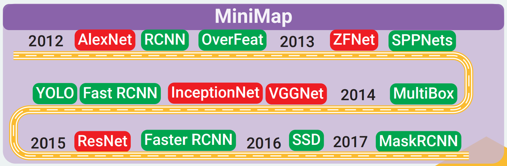
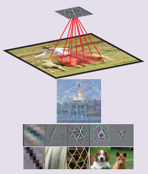
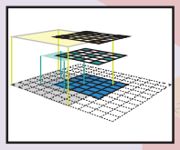

# Modern History of Object Recognition Infographic

## Important CNN Concepts

### Feature (pattern, activation of a neuron, feature detector)

当输入区域 (感受野) 中出现特定模式 (特征) 时激活的隐藏神经元。

神经元正在检测的模式可以通过以下方式进行可视化：(1) 优化其输入区域以最大化神经元的激活 (deep dream)，(2) 在输入像素上可视化神经元激活的梯度或引导梯度 (反向传播和引导反向传播)，(3) 可视化训练数据集中最能激活该神经元的一组图像区域。

### Receptive Field (input region of a feature)

输入图像中影响特征激活的区域。换句话说，它是特征正在查看的区域。通常，更高层的特征具有更大的感受野，这使其可以学习捕捉更复杂/抽象的模式。卷积网络架构决定了每一层的感受野是如何变化的。