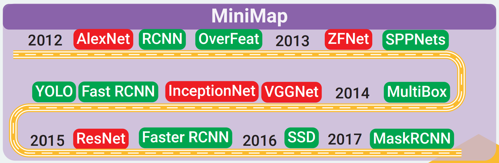
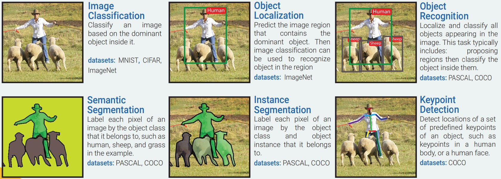
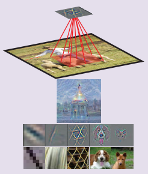
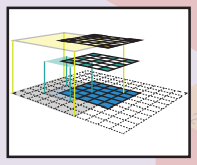
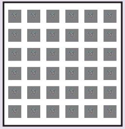

# [Modern History of Object Recognition Infographic](https://github.com/Nikasa1889/HistoryObjectRecognition)

## 计算机视觉 6 大关键技术

- 图像分类：根据图像的主要内容进行分类。数据集：MNIST, CIFAR, ImageNet
- 物体定位：预测包含主要物体的图像区域，然后可以用图像分类来识别区域内的物体。数据集：ImageNet
- 物体识别：定位并分类图像中出现的所有物体。这一任务通常包括：划出区域然后对其中的物体进行分类。数据集：PASCAL, COCO
- 语义分割：把图像中的每一个像素分到其所属物体类别，在样例中如人类、绵羊和草地。数据集：PASCAL, COCO
- 实例分割：把图像中的每一个像素分到其物体类别和所属物体实例。数据集：PASCAL, COCO
- 关键点检测：检测物体上一组预定义关键点的位置，例如人体上或者人脸上的关键点。数据集：COCO

## 重要的 CNN 概念

### 特征（模式，神经元的激活，特征探测）

Feature (pattern, activation of a neuron, feature detector)

当其输入区域 (感受野) 中出现特定模式 (特征) 时被激活的神经元。

神经元检测的模式可以通过以下方式可视化：(1) 优化其输入区域以最大化神经元的激活 (deep dream)，(2) 可视化神经元激活在其输入像素上的梯度或引导梯度 (反向传播和引导反向传播)，(3) 可视化训练数据集中激活神经元最多的图像区域集合。

### 感受野（特征的输入区域）

Receptive Field (input region of a feature)

输入图像中影响特征激活的区域。换句话说，它是特征所关注的区域。一般来说，更高层的特征拥有更大的感受野，可以学习捕捉更复杂/抽象的模式。卷积神经网络的架构决定了感受野逐层变化的方式。

### 特征图（隐藏层的一个通道）

Feature Map (a channel of a hidden layer)

通过在输入映射的不同位置滑动窗口式地应用相同的特征检测器而创建的一组特征（通过卷积运算得到）。相同特征图中的特征具有相同的感受野大小，并在不同的位置寻找相同的模式。这创建了卷积神经网络的空间不变性特性。

### 特征体（卷积神经网络中的隐藏层）

由一系列特征图组成，每个特征图都在输入映射上的固定位置集搜索特定特征。所有特征都具有相同的感受野大小。

### 全连接层作为特征体

具有 k 个隐藏节点的全连接层（fc 层 - 通常附加在卷积神经网络的末端用于分类）可以看作是 1x1xk 的特征体。 这种特征体在每个特征图中只有一个特征，其感受野覆盖整个图像。fc 层中的权重矩阵 W 可以转换为 CNN 卷积核。将 wxhxk 的内核与 wxhxd 的 CNN 特征体进行卷积会创建一个 1x1xk 的特征体（= 具有 k 个节点的 FC 层）。将 1x1xk 的滤波器内核与 1x1xd 的特征体进行卷积会创建一个 1x1xk 的特征体。用卷积层替换全连接层允许我们将卷积神经网络应用于任意大小的图像。

### 转置卷积（分数步长卷积、反卷积、上采样）

反向传播卷积操作梯度的操作。换句话说，它是卷积层的反向传递。转置卷积可以用插入零的普通卷积来实现。具有滤波器大小 k、步长 s 和零填充 p 的卷积具有相关的转置卷积，其滤波器大小 k'=k，步长 s'=1，零填充 p'=k-p-1，每个输入单元之间插入 s-1 个零。

左侧红色的输入单元通过 4 个彩色方块影响 4 个顶部的左侧输出单元的激活，因此它会接收来自这些输出单元的梯度。这种梯度反向传播可以通过右侧所示的转置卷积来实现。

## Reference

[1]: https://mp.weixin.qq.com/s?__biz=MzI3MTA0MTk1MA==&amp;mid=2651997432&amp;idx=1&amp;sn=1e926dae6bef826c81d1e9335b3c14d9	"【一图看懂】计算机视觉识别简史：从 AlexNet、ResNet 到 Mask RCNN"

