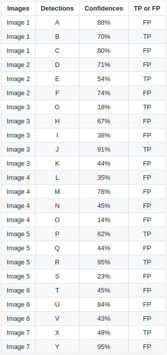
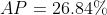

# [目标检测指标](https://github.com/rafaelpadilla/Object-Detection-Metrics)

这个项目的动机是不同的工作和实现在**在目标检测问题的评估指标**方面缺乏共识。虽然在线竞赛使用自己的指标来评估目标检测任务，但只有一些竞赛提供参考代码片段来计算检测到的对象的准确性。

想要使用不同于竞赛提供的数据集评估自己的工作的研究人员需要实现自己版本的指标。有时错误或不同的实现会产生不同和有偏差的结果。理想情况下，为了在不同方法之间进行可靠的基准测试，需要有一个灵活的实现，每个人都可以使用，而不管使用的数据集如何。

该项目提供了易于使用的函数，实现了目标检测最流行竞赛使用的相同指标。我们的实现不需要修改检测模型以复杂的输入格式，避免转换为XML或JSON文件。我们简化了输入数据（地面真实边界框和检测边界框），并在单个项目中收集了学术界和挑战赛中使用的主要指标。我们的实现经过仔细比较官方实现，结果完全相同。

在下面的主题中，您可以找到不同竞赛和作品中使用的最流行指标的概述，以及展示如何使用我们代码的示例。

## Table of contents

- [Motivation](#metrics-for-object-detection)
- [Different competitions, different metrics](#different-competitions-different-metrics)
- [Important definitions](#important-definitions)
- [Metrics](#metrics)
  - [Precision x Recall curve](#precision-x-recall-curve)
  - [Average Precision](#average-precision)
    - [11-point interpolation](#11-point-interpolation)
    - [Interpolating all  points](#interpolating-all-points)
- [**How to use this project**](#how-to-use-this-project)
- [References](#references)

## Different competitions, different metrics

- [PASCAL VOC Challenge](http://host.robots.ox.ac.uk/pascal/VOC/) 提供了一个 Matlab 脚本，以评估检测到的对象的质量。竞赛的参与者可以使用提供的 Matlab 脚本在提交结果之前测量其检测的准确性。官方文档解释了他们的目标检测指标标准，可以在[此处](http://host.robots.ox.ac.uk/pascal/VOC/voc2012/htmldoc/devkit_doc.html#SECTION00050000000000000000)访问。当前 PASCAL VOC 目标检测挑战使用的指标是 Precision x Recall 曲线和 AP (**area under the curve (AUC) of the Precision x Recall curve**)。

  PASCAL VOC Matlab 评估代码从 XML 文件中读取真实边界框，如果您想将其应用于其他数据集或特定情况，则需要更改代码。即使像 Faster-RCNN 这样的项目实现了 PASCAL VOC 评估指标，也需要将检测到的边界框转换为其特定格式。Tensorflow 框架也有其 PASCAL VOC 指标实现。

- [COCO Detection Challenge](https://competitions.codalab.org/competitions/5181) 使用不同的指标来评估不同算法的目标检测准确性。在[这里](http://cocodataset.org/#detection-eval)，您可以找到一个文档，解释了用于表征 COCO 上对象检测器性能的 12 个指标。该竞赛提供 Python 和 Matlab 代码，以便用户在提交结果之前验证其分数。也需要将结果转换为竞赛所需的格式。

- [Google Open Images Dataset V4 Competition](https://storage.googleapis.com/openimages/web/challenge.html) 也使用平均精度（mAP）来评估 500  个类别上的目标检测任务。

- [ImageNet Object Localization Challenge](https://www.kaggle.com/c/imagenet-object-detection-challenge) 考虑真实边界框与检测到的边界框之间的重叠区域和类别,为每个图像定义一个错误。总误差计算为所有测试数据集图像中所有最小误差的平均值。[这里](https://www.kaggle.com/c/imagenet-object-localization-challenge#evaluation)有关于他们评估方法更多细节。

## Important definitions

### Intersection Over Union (IOU)

交并比 (IOU) 是一种基于 Jaccard 指数的度量，用于评估两个边界框之间的重叠。它需要一个真实边界框和一个预测边界框。通过应用 IoU，我们可以判断检测是否有效（真正例）或无效（假正例）。

IOU 由预测边界框和真实边界框之间的重叠区域除以它们之间的联合区域面积给出：


下图展示了真实边界框 (绿色) 和预测边界框 (红色) 之间的 IOU。


### True Positive, False Positive, False Negative and True Negative

指标中使用的一些基本概念:

- **真正例 (TP)**: 正确的检测。IOU ≥ 阈值的检测
- **假正例 (FP)**: 错误的检测。IOU < 阈值的检测
- **假反例 (FN)**: 未检测到的真实目标
- **真反例 (TN)**: 不适用。它表示一个被纠正的错误检测。在目标检测任务中，图像中有许多不应检测到的可能的边界框。因此，TN 将是所有在图像中被正确不检测到的可能的边界框 (图像中许多可能的框)。这就是为什么指标不使用它的原因。

阈值: 根据指标的不同，通常设置为 50%、75% 或 95%。

### 精确率 (Precision)

精确率是模型仅识别相关对象的能力。它是正确的正类预测的百分比，计算公式如下:


### 召回率 (Recall)

召回率是模型找到所有相关案例 (所有真实边界框) 的能力。它是所有相关真实目标中被检测出的真正例 (TP) 的百分比，计算公式如下:


## Metrics

在下面的主题中，有关于目标检测中使用的最流行指标的一些评论。

### Precision x Recall curve

Precision x Recall 曲线是评估对象检测器性能的好方法，通过为每个对象类更改置信度来绘制曲线。如果一个特定类别的对象检测器的精确率在召回率增加时仍保持高水平，则认为其是好的，这意味着如果您变化置信度阈值，精度和召回率仍将保持高水平。判断对象检测器好坏的另一种方法是查看只能识别相关对象（0 假正例 = 高精度）的检测器，找到所有真实对象（0 假反例 = 高召回率）。

一个差的对象检测器需要增加检测对象的数量 (增加假正例 = 降低精确率) 来获取所有真实目标 (高召回率)。这就是为什么 Precision x Recall 曲线通常以高精度值开始，随着召回率的增加而降低。您可以在下一个主题 (Average Precision) 中看到 Prevision x Recall 曲线的示例。这种曲线用于 PASCAL VOC 2012 挑战赛，我们的实现中也可使用。

### Average Precision

另一种比较目标检测器性能的方法是计算 Precision x Recall 曲线下的面积（AUC）。由于 AP 曲线通常是上下波动的锯齿状曲线，因此在同一图中比较不同曲线（不同检测器）通常不是一项容易的任务，因为曲线往往会经常交叉。这就是为什么平均精度（AP）这个数值指标也可以帮助我们比较不同的检测器。在实践中，AP 是在 0 到 1 之间的所有召回值上平均的精度。

从 2010 年开始，PASCAL VOC 挑战赛计算 AP 的方法已经发生了变化。目前，PASCAL VOC 挑战赛执行的插值使用所有数据点，而不是仅插值其论文中所述的 11 个等间距点。由于我们想要复制他们的默认实现，因此我们的默认代码（如下所示）遵循他们最近的应用程序（插值所有数据点）。但是，我们还提供了 11 点插值方法。

#### 11-point interpolation

11 点插值试图通过在一组等间距召回级别 [0、0.1、0.2、…、1] 上平均精度来总结 Precision x Recall 曲线的形状：


与


其中 $\rho(\widetilde{\gamma})$ 是在召回率 $\widetilde{\gamma}$ 处测量的精确率。

AP 是仅通过在 11 个级别插值精确率获得的，取召回率大于等于该点的精确率的最大值来代替使用所有观测到的精确率。

#### Interpolating all points

你可以插值所有的点 $n$ 来代替仅插值 11 个等间距的点：


与


其中 $\rho(\widetilde{\gamma})$ 是在召回率 $\widetilde{\gamma}$ 处测量的精确率。

在这种情况下，与其仅使用少数点观察到的精确率，不如现在在每个级别上插值精确率，取其召回值大于或等于的最大精确率。这样我们就可以计算出曲线下的估计面积。

为了使事情更清楚，我们提供了一个比较两种插值的示例。

#### An ilustrated example

一个例子可以帮助我们更好地理解插值平均精度的概念。考虑以下检测：


有 7 张图像，由绿色边界框表示的 15 个真实对象和由红色边界框表示的 24 个检测对象。每个检测对象都有一个置信度级别，并由字母（A、B、…、Y）标识。

下表显示了边界框及其相应置信度。最后一列将检测标识为 TP 或 FP。在此示例中，如果 IOU 大于等于 30%，则视为 TP，否则将其视为 FP。通过查看上面的图像，我们可以大致判断检测是否为 TP 或 FP。



在某些图像中，有多个检测与真实值重叠（图像 2、3、4、5、6 和 7）。对于这些情况，将具有最高 IOU 的预测框视为 TP（例如，在图像 1 中，"E" 是 TP，而 "D" 是 FP，因为 "E" 与真实值之间的 IOU 大于 "D" 与真实值之间的 IOU）。这个规则是由 PASCAL VOC 2012 指标应用的："例如，单个对象的 5 次检测（TP）被计为 1 次正确检测和 4 次错误检测"。

通过计算累积 TP 或 FP 检测的精确率和召回率值来绘制 Precision x Recall 曲线。为此，**首先我们需要按其置信度对检测进行排序**，然后根据下表中所示的方式计算每个累积检测的精确率和召回率（请注意，在召回率计算中，分母项（"Acc TP + Acc FN" 或 "所有真实值"）为常数，因为 GT 框是不变的，无论检测如何）：


第二行（图像 7）的示例计算：精确率 = TP /（TP + FP）= 1/2 = 0.5，召回率 = TP /（TP + FN）= 1/15 = 0.066

绘制精度和召回率值，我们得到以下 Precision x Recall 曲线：


如前所述，有两种不同的方法来测量插值平均精度：11 点插值和插值所有点。下面我们进行比较：

#### Calculating the 11-point interpolation

11 点插值平均精度的想法是在一组 11 个召回率级别（0、0.1、…、1）上求精确率的平均值。插值精确率通过取其召回率大于其当前召回率的最大精确率来获得，如下所示：


通过应用 11 点插值，我们得到：





#### Calculating the interpolation performed in all points

通过插值所有点，平均精度（AP）可以解释为 Precision x Recall 曲线的近似 AUC。目的是减少曲线中的波动影响。通过应用前面提出的方程，我们可以获得如下所示的面积。我们还可以通过从最高（0.4666）开始查看召回率（从右到左查看图形），并在降低召回率时收集最高的精度值来直观地获得插值精度点，如下图所示：


从上图可以看出，AUC 可以分为 A1、A2、A3、A4 4个区域:


计算总面积，我们有AP:


其中：


两种不同的插值方法之间的结果略有不同：分别为每个点插值的 24.56% 和 11 点插值的 26.84%。

我们的默认实现与 VOC PASCAL 相同：每个点插值。如果要使用 11 点插值，请将使用 `method=MethodAveragePrecision.EveryPointInterpolation` 参数的函数更改为 `method=MethodAveragePrecision.ElevenPointInterpolation`。

如果要重现这些结果，请参见[示例 2](https://github.com/rafaelpadilla/Object-Detection-Metrics/tree/master/samples/sample_2/)。

## How to use this project

此项目是为了以非常简单的方式评估您的检测而创建的。如果您想使用最常用的目标检测指标评估您的算法，则来对了。

[Sample_1](https://github.com/rafaelpadilla/Object-Detection-Metrics/tree/master/samples/sample_1) 和 [sample_2](https://github.com/rafaelpadilla/Object-Detection-Metrics/tree/master/samples/sample_2) 是实际示例，演示了如何直接访问此项目的核心功能，从而提供了更多使用指标的灵活性。但是，如果您不想花时间理解我们的代码，请参见下面的说明，以轻松评估您的检测：

按照以下步骤开始评估您的检测：

1. 创建 ground truth 文件 

2. 创建检测文件 

3. 对于 Pascal VOC 指标，请运行命令：`python pascalvoc.py`

   如果要重现上面的示例，请运行命令：`python pascalvoc.py -t 0.3`

4. （可选）您可以使用参数来控制 IOU 阈值、边界框格式等。 

### Create the ground truth files

- 为 `groundtruths/` 文件夹中的每个图像创建单独的 ground truth 文本文件。

- 在这些文件中，每行应采用以下格式：`<class_name> <left> <top> <right> <bottom>`。

- 例如，图像 "2008_000034.jpg" 的 ground truth 边界框在文件 "2008_000034.txt" 中表示：

  ```
  bottle 6 234 45 362
  person 1 156 103 336
  person 36 111 198 416
  person 91 42 338 500
  ```

如果您愿意，也可以将边界框设置为这种格式：`<class_name> <left> <top> <width> <height>` (见这里*如何使用它)。在这种情况下，你的 "2008_000034.txt" 将被表示为:

```
bottle 6 234 39 128
person 1 156 102 180
person 36 111 162 305
person 91 42 247 458
```

### Create your detection files

- 为 `detections/` 文件夹中的每个图像创建单独的检测文本文件。

- 检测文件的名称必须与其对应的 ground truth 匹配（例如，"detections/2008_000182.txt" 表示 ground truth 的检测："groundtruths/2008_000182.txt"）。

- 在这些文件中，每行应采用以下格式：`<class_name> <confidence> <left> <top> <right> <bottom>`（请参见此处 * 如何使用它）。

- 例如，"2008_000034.txt":

  ```
  bottle 0.14981 80 1 295 500  
  bus 0.12601 36 13 404 316  
  horse 0.12526 430 117 500 307  
  pottedplant 0.14585 212 78 292 118  
  tvmonitor 0.070565 388 89 500 196  
  ```

如果你愿意，你也可以把你的边界框设置成这样的格式: `<class_name> <confidence> <left> <top> <width> <height>`。

### [Optional arguments](https://github.com/rafaelpadilla/Object-Detection-Metrics#optional-arguments)

Optional arguments:


## References

- The Relationship Between Precision-Recall and ROC Curves (Jesse Davis and Mark Goadrich) Department of Computer Sciences and Department of Biostatistics and Medical Informatics, University of Wisconsin
  http://pages.cs.wisc.edu/~jdavis/davisgoadrichcamera2.pdf
- The PASCAL Visual Object Classes (VOC) Challenge
  http://citeseerx.ist.psu.edu/viewdoc/download?doi=10.1.1.157.5766&rep=rep1&type=pdf
- Evaluation of ranked retrieval results (Salton and Mcgill 1986)
  https://www.amazon.com/Introduction-Information-Retrieval-COMPUTER-SCIENCE/dp/0070544840
  https://nlp.stanford.edu/IR-book/html/htmledition/evaluation-of-ranked-retrieval-results-1.html


<!-- 完成标志, 看不到, 请忽略! -->
