# git 基本工作流程

## 1. 克隆仓库到本地

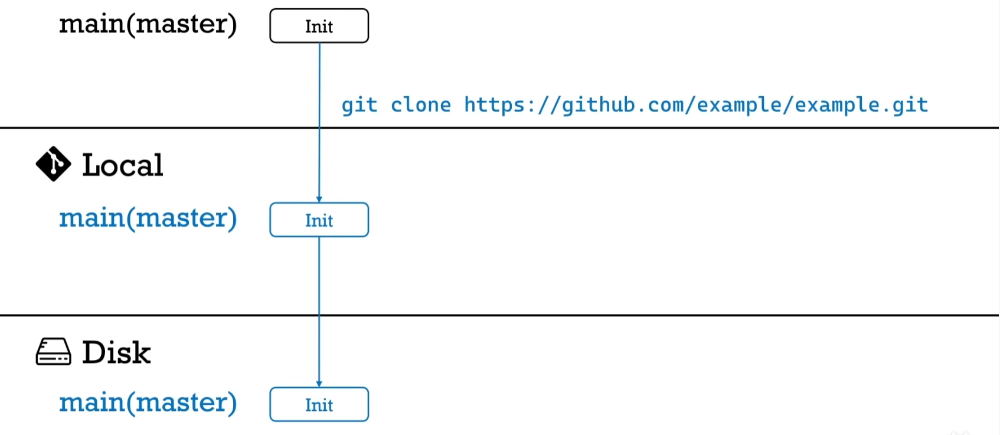

```shell
git clone <repository> [<directory>]
```

- repository：远端仓库地址
- directory：克隆到本地的目录

## 2. 切换开发/建立新分支

创建分支 `my-feature`

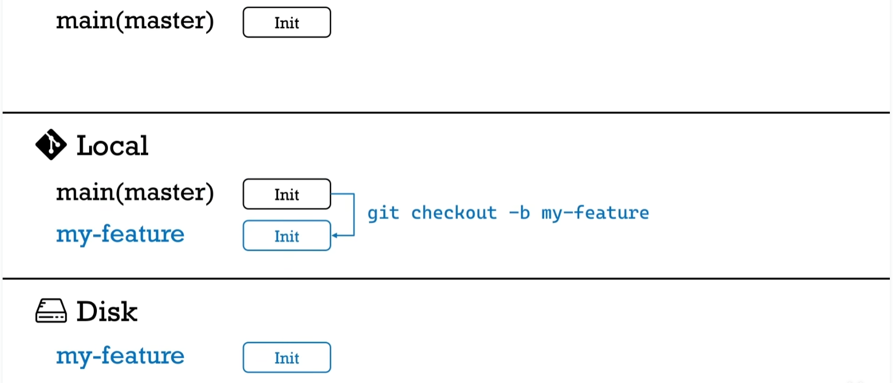

```shell
git checkout -b <branch>
```

- branch：分支名称

## 3. 添加/修改

在本地进行添加/修改

## 4. 查看区别

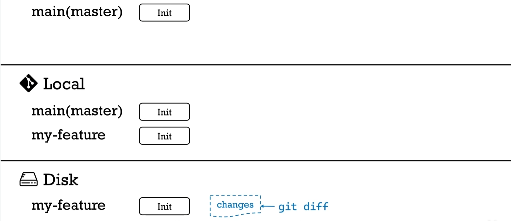

```shell
git diff [<commit>] [<path>]
```

- commit：某次已提交的唯一标识
- path：需要对比的文件

## 5. 添加到暂存区

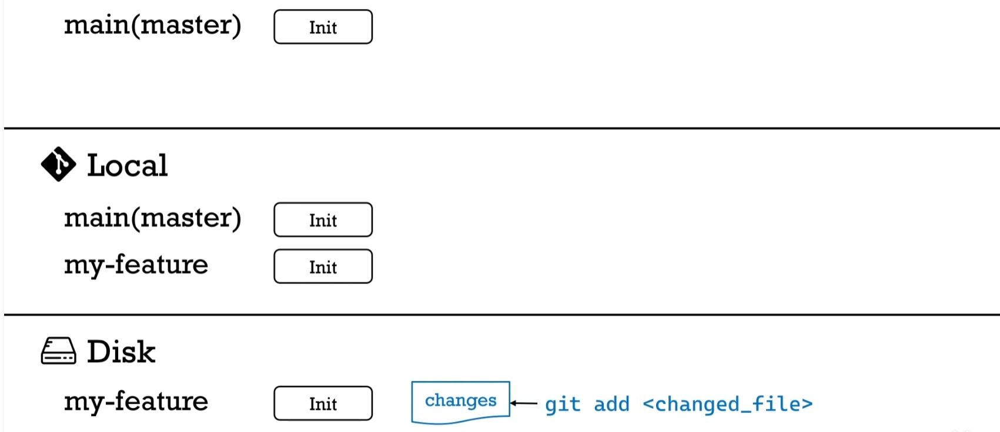

```shell
git add <path>
```

- path：需要添加的文件路径

## 6. 提交到本地 git

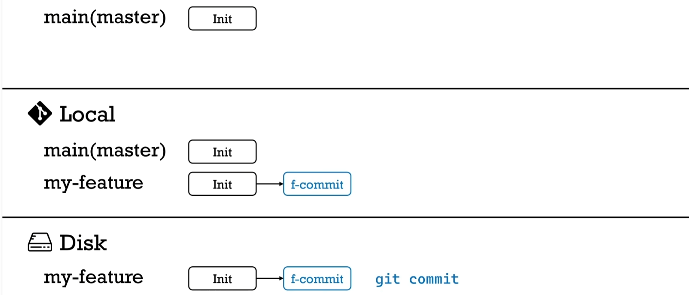

```shell
git commit [-F <file>] -m <msg>
```

- file：文件路径，可不写，提交全部
- msg：本次提交的说明信息

## 7. 推送本地分支

推送分支 `my-feature`

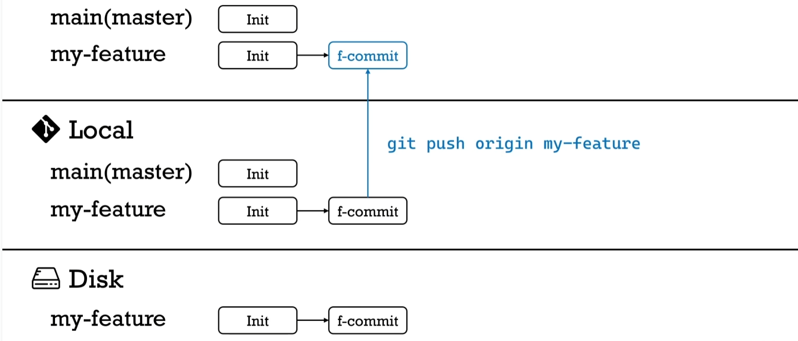

```shell
git push <origin> <branch>
```


- origin：分支的远端配置，如果没填，默认为 origin
- branch：分支名称

## 8. 将远端分支更新到本地

更新分支 `master`，先切换到 `master` 分支：`git checkout master`

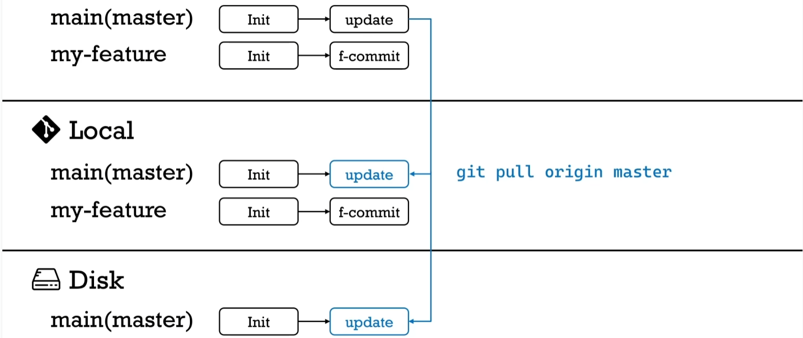

```shell
git pull <origin> <branch>
```

- origin：分支的远端配置，默认 origin
- branch：分支名称

## 9. 合并分支

在本地合并分支 `master` 到 `my-feature`，切换到 `my-feature` 分支：`git checkout my-feature`，然后执行 `git rebase master`，会将 `my-feature` 丢到一边，先把 `master` 的最新修改更新到本地，再在更新后的基础上合并 `my-feature` 的提交，解决 rebase conflict

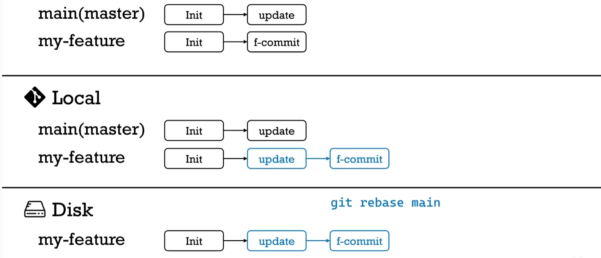

```shell
git rebase <branch>
```

- branch：分支名称

## 10. 推送合并后的本地分支

由于本地分支和远端的不一致，需要强行 push

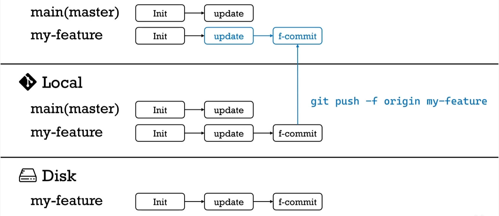

```shell
git push -f <origin> <branch>
```

- -f, --force：强行push
- origin：远端配置，默认 origin
- branch：分支名称

## 11. pull request

请求项目主人将分支的改动pull到主分支中

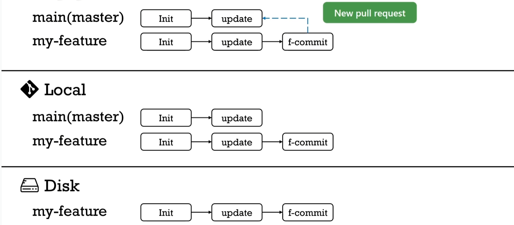

## 12. squash and merge

合并 `my-feature` 分支的所有改变为一个改变，然后将这个改变合并到 `master`

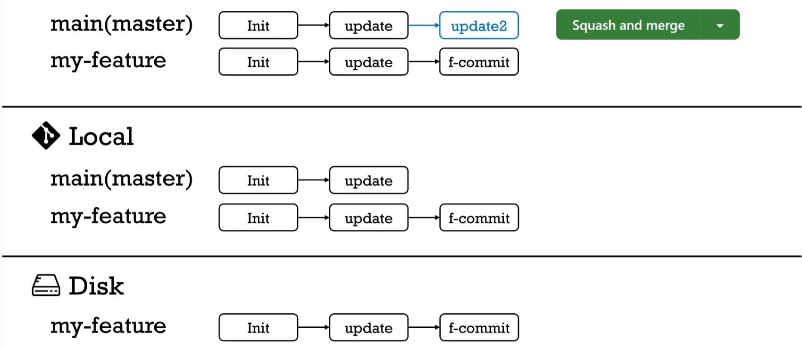

## 13. 删除分支

远端通过 `delete branch`，本地先切换到 `master` 分支：`git checkout master`，删除本地分支：`git branch -D my-feature`

## 14. 更新主分支

```shell
git pull origin master
```


<!-- 完成标志, 看不到, 请忽略! -->
