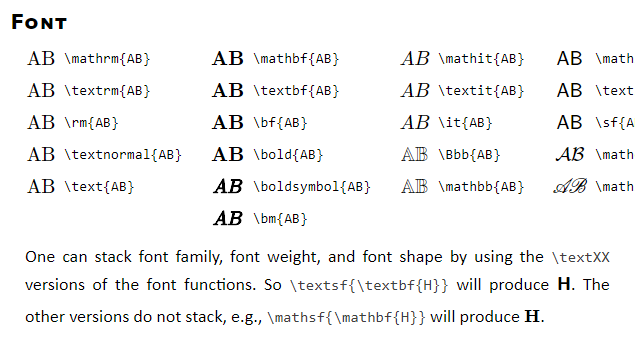

1. 公式 `$ $` 和正文、标点符号之间要有一个空格 ` `，否则显示异常

   例如： 公式$a = b + c$ 和公式 $a = b + c$

   例如： 公式：$a = b + c$ 和公式： $a = b + c$

2. 公式上下标顺序遵循：先下标，再上标，否则显示异常

   例如： $D^{\ast}_{G} (\boldsymbol{x}) = \frac{1}{2}$ 和 $D_{G}^{\ast} (\boldsymbol{x}) = \frac{1}{2}$ 

   例如： $D_{G}^{\ast} (\boldsymbol{x}) = \frac{1}{2}$ 和 $D^{\ast}_{G} (\boldsymbol{x}) = \frac{1}{2}$

3. 公式 `$$ $$` 要另起一行，否则显示异常，例如 $$ z = x + y $$

   $$z = x + y$$

4. 公式粗体测试 

   - $\mathbf{z}$
   - $\textbf{z}$
   - $\bf{z}$
   - $\bold{z}$
   - $\boldsymbol{z}$

