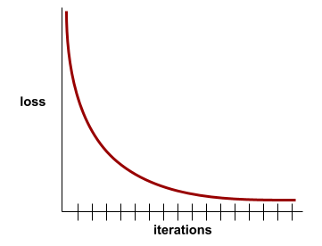

# [机器学习术语](https://developers.google.com/machine-learning/glossary)

根据首字母排序

| 索引   |    V1     |  V2  |    V3     |    V4     |    V5     |    V6     |  V7  |    V8     |  V9  |    V10    |
| :----- | :-------: | :--: | :-------: | :-------: | :-------: | :-------: | :--: | :-------: | :--: | :-------: |
| **U1** |     Q     |  W   | -[E](#E)- |     R     | -[T](#T)- |     Y     |  U   |     I     |  O   | -[P](#P)- |
| **U2** | -[A](#A)- |  S   | -[D](#D)- |     F     |     G     |     H     |  J   |     K     |  L   |           |
| **U3** |           |  Z   |     X     | -[C](#C)- | -[V](#V)- | -[B](#B)- |  N   | -[M](#M)- |      |           |

## A

### 消融实验 (ablation)

一种通过暂时从[模型](#模型-model)中删除某个[特征](#特征-feature)或组件来评估其重要性的技术。之后你在没有该特征或组件的情况下重新训练模型,如果重新训练的模型表现显著降低,则说明被删除的特征或组件很可能是重要的。

例如,假设你在10个特征上训练了一个[分类模型](#分类模型-classification-model),在[测试集](#测试集-test-set)上达到了88%的[精确率](#精确率-precision)。为了检查第一个特征的[重要性](#变量重要性-variable-importances),你可以只用其他9个特征重新训练模型。如果重新训练的模型表现明显变差(例如精确率下降到55%),那么被移除的特征很可能是重要的。反之,如果重新训练的模型表现一样好,那么该特征可能不是非常重要。

消融实验也可以帮助确定以下内容的重要性:

- 更大的组件,例如更大ML系统中的整个子系统
- 流程或技术,例如数据预处理步骤

在这两种情况下,你都可以观察系统性能在移除组件之后是否发生变化来判断组件的重要性。


### A/B 测试 (A/B testing)

一种用于比较两种(或多种)技术的统计方法——A 和 B。通常,A 是现有技术,B 是新技术。A/B 测试不仅可以确定哪种技术的表现更好,还可以确定两者间的差异是否具有显著的统计意义。

A/B 测试通常在两种技术上比较单个[指标](#指标-metric);例如,两个技术的模型[准确率](#准确率-accuracy)如何比较？但是,A/B 测试也可以比较任意数量的指标。


### 自编码器 (autoencoder)

一个学习从输入中提取最重要信息的系统。自动编码器由一个[编码器](#编码器-encoder)和[解码器](#解码器-decoder)组成。自动编码器依赖以下两步过程:

1. 编码器将输入映射到一个(通常)有损的较低维(中间)格式。
2. 解码器通过将较低维格式映射回原始的较高维输入格式,构建输入的一个有损版本。

自动编码器通过让解码器尽可能准确地从编码器的中间格式重构原始输入来端到端训练。因为中间格式比原始格式维度更低,自动编码器被迫学习输入中的哪些信息是必要的,输出不会与输入完全相同。

例如:

- 如果输入数据是图像,不精确的复制版本会类似于原始图像,但有些修改。也许不精确的复制版本会从原始图像中去除噪声,或者填补一些丢失的像素。
- 如果输入数据是文本,自动编码器会生成模拟(但不相同于)原始文本的新文本。

参见[变分自编码器](#变分自编码器-variational-autoencoder-VAE)。


## B

### 偏置 (bias)


## C

### 分类模型 (classification model)

其预测结果为一个**类别**的[模型](#模型-model)。例如,以下都是分类模型:

- 预测输入句子的语言(法语?西班牙语?意大利语?)的模型。
- 预测树种(枫树?橡树?猴面包树?)的模型。
- 预测某种医疗状况的正类或负类的模型。

相比之下,**回归模型**预测数字而不是类别。

两种常见的分类模型类型是:

- **二分类**:二元分类,只有两个类别。
- **多分类**:有多个类别,模型从中预测正确的一个。

分类模型通过学习输入与类别标签之间的关系,对新输入进行预测,属于监督学习的一种。分类模型的评估指标有精确率、召回率、F1分数等。选择合适的分类模型需要根据问题需求和数据集特点来进行。


### 聚类 (clustering)


## D

### 决策树 (decision tree)


## E

### 样本 (example)


## F

### 特征 (feature)


### 小样本学习 (few-shot learning)

一种机器学习方法,通常用于对象分类,旨在仅从少量训练样本中训练出有效的分类器。

参见[单样本学习](#单样本学习-one-shot-learning)和[零样本学习](#零样本学习-zero-shot-learning)。

## H

### 隐藏层 (hidden layer)


## L

### 标签 (label)

在[监督机器学习](#监督机器学习-supervised-machine-learning)中,[样本](#样本-example)的“答案”或“结果”部分。

每个[已标注样本](#已标注样本-labeled-example)由一个或多个[特征](#特征-feature)和一个标签组成。例如,在垃圾邮件检测数据集中,标签可能是“垃圾邮件”或“非垃圾邮件”。在降雨量数据集中,标签可能是某段时间内的降雨量。

### 已标注样本 (labeled example)

包含一个或多个[特征](#特征-feature)和一个[标签](#标签-label)的样本。例如,下表显示了房价预测模型的三个已标注样本,每个样本都包含三个特征和一个标签:

| Number of bedrooms | Number of bathrooms | House age | House price (label) |
| :----------------- | :------------------ | :-------- | :------------------ |
| 3                  | 2                   | 15        | $345,000            |
| 2                  | 1                   | 72        | $179,000            |
| 4                  | 2                   | 34        | $392,000            |

在[监督机器学习](#监督机器学习-supervised-machine-learning)中,模型在已标注样本上训练,并对[无标注样本](#无标注样本-unlabeled-example)进行预测。

标注样本与无标注样本形成对比。

### 标签泄漏 (label leakage)

一种模型设计缺陷,其中一个[特征](#特征-feature)是[标签](#标签-label)的代理。例如,考虑一个[二分类](#二分类-binary-classification)模型,用于预测一个潜在客户是否会购买某种产品。假设模型的特征之一是一个名为 `SpokeToCustomerAgent` 的布尔值。进一步假设客服专员只会在潜在客户实际购买产品之后才被分配。在训练期间,模型会快速学习 `SpokeToCustomerAgent` 特征和标签之间的关联。

## M

### 均方误差 (Mean Squared Error (MSE))


### 元学习 (meta-learning)

元学习是机器学习的一个子集,它发现或改进学习算法。元学习系统还可以训练模型,以便从少量数据或从以前任务中获得的经验中快速学习新任务。元学习算法通常试图实现以下目标:

- 改进/学习手工设计的特征(如初始化器或优化器)。
- 更高的数据效率和计算效率。
- 提高泛化能力。

元学习与[小样本学习](#小样本学习-few-shot-learning)有关。

### 指标 (metric)

一个你关心的统计数据。

[目标](#目标-objective)是机器学习系统企图优化的一个指标。

### 模型 (model)

通常,任何可以处理输入数据并返回输出的数学构造都可以称为模型。换句话说,模型是系统进行预测所需的参数和结构的集合。在[监督机器学习](#监督机器学习-supervised-machine-learning)中,模型将一个[样本](#样本-example)作为输入,并推理出一个[预测](#预测-prediction)作为输出。在监督学习中,不同的模型有些许区别。例如:

- 线性回归模型由一组[权重](#权重-weight)和一个[偏置](#偏置-bias)组成。

- [神经网络](#神经网络-neural-network)模型包含:
  - 一组[隐藏层](#隐藏层-hidden-layer),每个包含一个或多个[神经元](#神经元-neuron)。
  
  - 每个神经元相关的权重和偏置。
  
- [决策树](#决策树-decision-tree)模型包含:
- 树的形状;即条件和叶子节点的连接模式。
  
- 条件和叶子节点。

模型可以被保存、恢复或复制。

[无监督机器学习](#无监督机器学习-unsupervised-machine-learning)也会生成模型,通常是一个可以将输入映射到最合适的[簇](#聚类-clustering)的函数。

<details><summary><em>[点击图标比较代数和编程函数与机器学习模型]</em></summary>
<br>

像下面这样的代数函数是一个模型:

```
f(x, y) = 3x -5xy + y2 + 17
```

上述函数将输入值(x和y)映射到输出。

类似地,像下面的Python函数也是一个模型:

```python
def half_of_greater(x, y):
  if (x > y): 
    return(x / 2)
  else:
    return(y / 2)
```

调用者会向Python函数传入参数,然后函数生成输出(通过return语句)。

尽管**深度神经网络**的数学结构与代数或编程函数很不相同,但深度神经网络仍然接受输入(示例),并返回输出(预测)。

编程函数是由程序员手动编写。相比之下,机器学习模型会在自动化训练中逐步学习最优的参数。

</details>


## N

### 神经网络 (neural network)


### 神经元 (neuron)


## O

### 单样本学习 (one-shot learning) 

一种机器学习方法,通常用于对象分类,旨在从单个训练样本中学习有效的分类器。

参见[小样本学习](#小样本学习-few-shot-learning)和[零样本学习](#零样本学习-zero-shot-learning)。


## P

### 正类 (positive class)


### 精确率 (precision)

[分类模型](#分类模型-classification-model)的一个指标,用于回答以下问题:

> 当模型预测[正类](#正类-positive-class)时,预测正确的百分比是多少?

以下是公式:

$$
\mathrm{Precision} = \frac{\mathrm{true \ positives}}{\mathrm{true \ positives + false \ positives}}
$$

其中:

- true positive 是指模型正确地预测了正类。
- false positive 是指模型错误地预测了正类。

例如,假设一个模型做出了200次正类预测。在这200次正类预测中:

- 150次是真正类。
- 50次是假正类。

在这个例子中：

$$
\mathrm{Precision} = \frac{150}{150 + 50} = 0.75
$$

与[准确率]()和[召回率]()形成对比。

### 预测 (prediction)


## S

### 监督机器学习 (supervised machine learning)

使用[特征](#特征-feature)及其对应的[标签](#标签-label)训练一个[模型](#模型-model)。监督机器学习类似于通过学习问题及其对应的答案来学习一个主题。掌握问题与答案的映射后,学生就可以对同一主题的新(之前未见过的)问题给出答案。

与**无监督机器学习**形成对比。


## T

###  测试集 (test set)

### 训练 (training)

确定组成一个[模型](#模型-model)的理想[参数](#参数-parameter)(权重和偏差)的过程。在训练过程中,系统读取[样本](#样本-example),并逐渐调整参数。训练中每个示例的训练次数从几次到数十亿次不等。

### 训练损失 (training loss)

一个表示模型在一个特定训练迭代中的[损失](#损失-loss)的[指标](#指标-metric)。例如,假设损失函数是[均方误差](#均方误差-Mean-Squared-Error-MSE)。可能第10次迭代的训练损失(均方误差)是2.2,而第100次迭代的训练损失是1.9。

[损失曲线](#损失曲线-loss-curve)绘制训练损失与迭代次数的关系。损失曲线提供了以下关于训练的提示:

* 向下的斜率意味着模型正在改进。

* 向上的斜率意味着模型正在变差。

* 平坦的斜率意味着模型已经达到[收敛](#收敛-convergence)。

例如,下面的稍微理想化的[损失曲线](#损失曲线-loss-curve)显示:

* 在初始迭代中陡峭的下降,意味着模型快速改进。

* 直到训练接近结束,曲线逐渐变平(但仍在下降),意味着模型以比初始迭代稍慢的速度继续改进。

* 训练结束时曲线变平,意味着收敛。




尽管训练损失很重要，但另请参阅[泛化](#泛化-generalization)。


## U

### 无标注样本 (unlabeled example)


### 无监督机器学习 (unsupervised machine learning)


## V

### 变量重要性 (variable importances)


### 变分自编码器 (variational autoencoder (VAE))


## W

### 权重 (weight)


## Z

### 零样本学习 (zero-shot learning)

一种机器学习[训练]()方式,其中[模型](#模型-model)为其未经专门训练的任务推理一个[预测](#预测-prediction)。换句话说,模型没有得到任何特定于任务的训练[样本](#样本-example),但被要求对该任务进行[推理](#推理-inference)。

