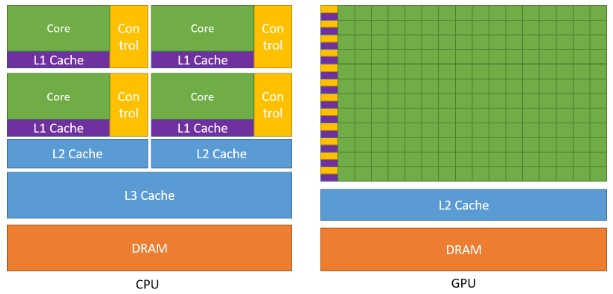
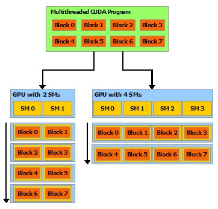

# [CUDA C++ Programming Guide](https://docs.nvidia.com/cuda/cuda-c-programming-guide/index.html)

# 1. Introduction

## 1.1. The Benefits of Using GPUs

GPU (图形处理器) 在相差不大价格和功率的情况下，提供比 CPU 更高的指令吞吐量和内存带宽。许多应用程序利用这些更高的能力在 GPU 上比在 CPU 上运行得更快 (请参见 GPU 应用程序)。其他计算设备，如 FPGA，也非常节能，但提供的编程灵活性远不如 GPU。

GPU 和 CPU 之间的这种能力差异是因为它们的设计目标不同。虽然 CPU 旨在尽可能快地执行称为线程的一系列操作，并且可以并行执行几十个这些线程，但 GPU 旨在并行执行数千个线程 (通过分摊较慢的单线程性能以实现更大的吞吐量)。

GPU 专门用于高度并行的计算，因此设计时更多的晶体管用于数据处理而不是数据缓存和流控制。图 1 显示了 CPU 与 GPU 的芯片资源分配示例分布。

**图 1**：GPU 将更多晶体管用于数据处理

将更多的晶体管用于数据处理，例如浮点运算，有利于高度并行的计算；GPU 可以通过计算来隐藏内存访问延迟，而不是依赖于大型数据缓存和复杂的流控制来避免长时间的内存访问延迟，这两者对于晶体管而言都是昂贵的。

通常，一个应用程序既有并行部分也有顺序部分，因此系统采用 GPU 和 CPU 的组合以最大限度地提高整体性能。具有高度并行性的应用程序可以利用 GPU 的大规模并行特性以实现比在 CPU 上更高的性能。

## 1.2. CUDA®: A General-Purpose Parallel Computing Platform and Programming Model

2006 年 11 月，NVIDIA® 推出了 CUDA®，这是一个通用的并行计算平台和编程模型，利用 NVIDIA GPU 中的并行计算引擎以比 CPU 更高效的方式解决许多复杂的计算问题。

CUDA 附带一个软件环境，允许开发人员使用 C++ 作为高级编程语言。如图2所示，还支持其他语言、应用程序编程接口或基于指令的方法，例如 FORTRAN、DirectCompute、OpenACC。

## 1.3. A Scalable Programming Model

多核 CPU 和多核 GPU 的出现意味着主流处理器芯片现在都是并行系统。面临的挑战是开发能够透明地扩展其并行性的应用程序软件，以利用数量不断增加的处理器核心，就像 3D 图形应用程序透明地将其并行性扩展到具有不同数量核心的多核 GPU 一样。

CUDA 并行编程模型旨在克服这一挑战，同时为熟悉 C 等标准编程语言的程序员保持较低的学习曲线。

其核心是三个关键抽象——线程组的层次结构、共享内存和栅障同步 (barrier synchronization) ——它们作为一组最小的语言扩展简单地暴露给程序员。

这些抽象提供了细粒度的数据并行性和线程并行性，嵌套在粗粒度的数据并行性和任务并行性中。它们引导程序员将问题划分为可以由线程块独立并行解决的粗略子问题，并将每个子问题划分为可以由块内的所有线程并行协作解决的更精细的部分。

这种分解通过允许线程在解决每个子问题时进行合作来保留语言表达能力，同时实现自动可扩展性。事实上，每个线程块都可以以任何顺序（同时或顺序）调度到 GPU 内的任何可用多处理器上，以便编译后的 CUDA 程序可以在任意数量的多处理器上执行，如图 3 所示，并且运行时系统仅需要知道物理多处理器的数量。

这种可扩展的编程模型允许 GPU 架构通过简单地扩展多处理器和内存分区的数量来跨越广泛的市场范围：从高性能发烧友 GeForce GPU 和专业的 Quadro 和 Tesla 计算产品到各种廉价的主流 GeForce GPU（有关所有[支持 CUDA 的 GPU 的](https://docs.nvidia.com/cuda/cuda-c-programming-guide/index.html#cuda-enabled-gpus)列表，请参阅支持 CUDA 的 GPU）。

**图 3**：自动的可扩展性

> Note：
>
> GPU 围绕流式多处理器 (SM) 阵列构建（有关更多详细信息，请参阅[硬件实现](https://docs.nvidia.com/cuda/cuda-c-programming-guide/index.html#hardware-implementation)）。多线程程序被划分为彼此独立执行的线程块，因此具有更多多处理器的 GPU 会比具有更少多处理器的 GPU 在更短的时间内自动执行程序。