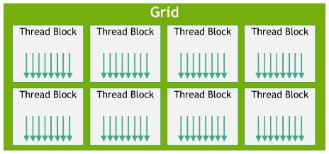
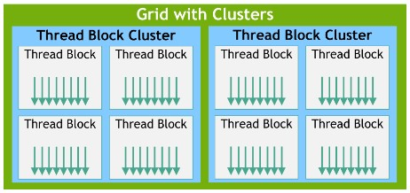
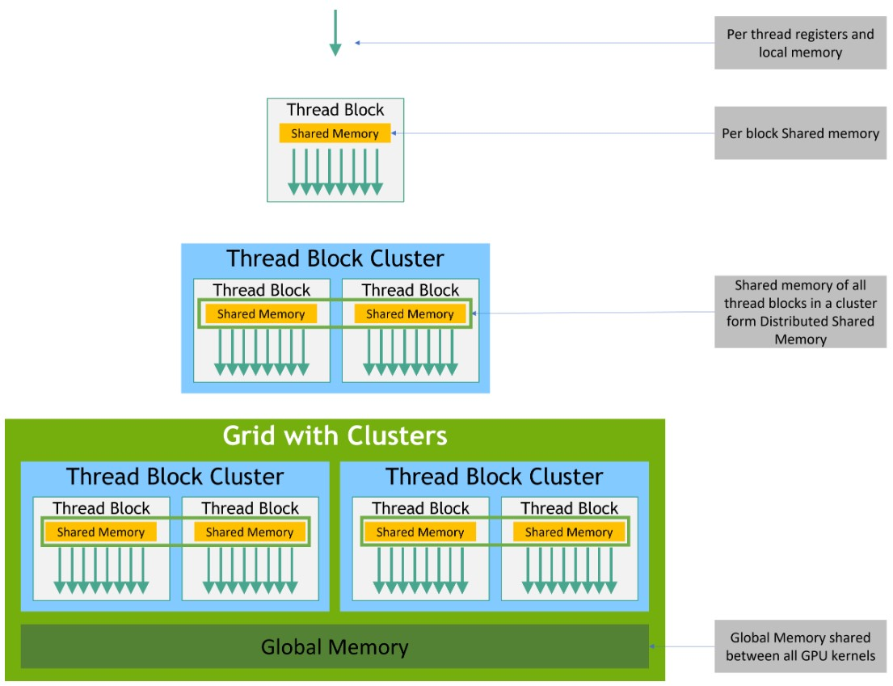
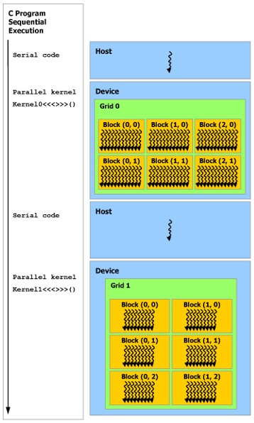

# [CUDA C++ Programming Guide](https://docs.nvidia.com/cuda/cuda-c-programming-guide/index.html)

# 1. 介绍

## 1.1. 使用 GPU 的好处

GPU (图形处理器) 在相差不大价格和功率的情况下，提供比 CPU 更高的指令吞吐量和内存带宽。许多应用程序利用这些更高的能力在 GPU 上比在 CPU 上运行得更快 (请参见 GPU 应用程序)。其他计算设备，如 FPGA，也非常节能，但提供的编程灵活性远不如 GPU。

GPU 和 CPU 之间的这种能力差异是因为它们的设计目标不同。虽然 CPU 旨在尽可能快地执行称为线程的一系列操作，并且可以并行执行几十个这些线程，但 GPU 旨在并行执行数千个线程 (通过分摊较慢的单线程性能以实现更大的吞吐量)。

GPU 专门用于高度并行的计算，因此设计时更多的晶体管用于数据处理而不是数据缓存和流控制。图 1 显示了 CPU 与 GPU 的芯片资源分配示例分布。


**图 1**：GPU 将更多晶体管用于数据处理

将更多的晶体管用于数据处理，例如浮点运算，有利于高度并行的计算；GPU 可以通过计算来隐藏内存访问延迟，而不是依赖于大型数据缓存和复杂的流控制来避免长时间的内存访问延迟，这两者对于晶体管而言都是昂贵的。

通常，一个应用程序既有并行部分也有顺序部分，因此系统采用 GPU 和 CPU 的组合以最大限度地提高整体性能。具有高度并行性的应用程序可以利用 GPU 的大规模并行特性以实现比在 CPU 上更高的性能。

## 1.2. CUDA®: 一个通用的并行计算平台和编程模型

2006 年 11 月，NVIDIA® 推出了 CUDA®，这是一个通用的并行计算平台和编程模型，利用 NVIDIA GPU 中的并行计算引擎以比 CPU 更高效的方式解决许多复杂的计算问题。

CUDA 附带一个软件环境，允许开发人员使用 C++ 作为高级编程语言。如图2所示，还支持其他语言、应用程序编程接口或基于指令的方法，例如 FORTRAN、DirectCompute、OpenACC。


## 1.3. 一个可扩展的编程模型

多核 CPU 和多核 GPU 的出现意味着主流处理器芯片现在都是并行系统。面临的挑战是开发能够透明地扩展其并行性的应用程序软件，以利用数量不断增加的处理器核心，就像 3D 图形应用程序透明地将其并行性扩展到具有不同数量核心的多核 GPU 一样。

CUDA 并行编程模型旨在克服这一挑战，同时为熟悉 C 等标准编程语言的程序员保持较低的学习曲线。

其核心是三个关键抽象——线程组的层次结构、共享内存和栅障同步 (barrier synchronization) ——它们作为一组最小的语言扩展简单地暴露给程序员。

这些抽象提供了细粒度的数据并行性和线程并行性，嵌套在粗粒度的数据并行性和任务并行性中。它们引导程序员将问题划分为可以由线程块独立并行解决的粗略子问题，并将每个子问题划分为可以由块内的所有线程并行协作解决的更精细的部分。

这种分解通过允许线程在解决每个子问题时进行合作来保留语言表达能力，同时实现自动可扩展性。事实上，每个线程块都可以以任何顺序（同时或顺序）调度到 GPU 内的任何可用多处理器上，以便编译后的 CUDA 程序可以在任意数量的多处理器上执行，如图 3 所示，并且运行时系统仅需要知道物理多处理器的数量。

这种可扩展的编程模型允许 GPU 架构通过简单地扩展多处理器和内存分区的数量来跨越广泛的市场范围：从高性能发烧友 GeForce GPU 和专业的 Quadro 和 Tesla 计算产品到各种廉价的主流 GeForce GPU（有关所有[支持 CUDA 的 GPU 的](#6. 支持 CUDA 的 GPUs)列表，请参阅支持 CUDA 的 GPU）。


**图 3**：自动的可扩展性

> Note：
>
> GPU 围绕流式多处理器 (SM) 阵列构建（有关更多详细信息，请参阅[硬件实现](https://docs.nvidia.com/cuda/cuda-c-programming-guide/index.html#hardware-implementation)）。多线程程序被划分为彼此独立执行的线程块，因此具有更多多处理器的 GPU 会比具有更少多处理器的 GPU 在更短的时间内自动执行程序。

## 1.4. 文档结构

- [介绍](#1. 介绍) 是对 CUDA 的一般介绍。
- [编程模型](#2. 编程模型) 概述了 CUDA 编程模型。

# 2. 编程模型

本章介绍了 CUDA 编程模型背后的主要概念，概述了它们在 C++ 中的体现。

CUDA C++ 的详细描述见 [编程接口](#3-编程接口)。

本章和下一章中使用的向量加法示例的完整代码可在 [vectorAdd CUDA 示例](https://docs.nvidia.com/cuda/cuda-samples/index.html#vector-addition)中找到。

## 2.1. Kernels

CUDA C++ 通过允许程序员定义称为内核的 C++ 函数来扩展 C++，这些函数在调用时由 N 个不同的CUDA 线程并行执行 N 次，而不是像常规 C++ 函数那样只执行一次。

内核使用 `__global__` 声明说明符定义，并使用新的 `<<<...>>>` 执行配置语法 (参见 [C++ 语言扩展](#7. C++ 语言扩展)) 指定执行该内核的 CUDA 线程数。**每个执行内核的线程都会被赋予一个唯一的线程 ID**，该 ID 可以在内核中通过内置变量 `threadIdx` 进行访问。

作为说明，下面的示例代码使用内置变量 `threadIdx`，对两个大小为 N 的向量 A 和 B 进行加法，并将结果存储到向量 C 中：

```c++
// Kernel definition
__global__ void VecAdd(float* A, float* B, float* C)
{
    int i = threadIdx.x;
    C[i] = A[i] + B[i];
}

int main()
{
    ...
    // Kernel invocation with N threads
    VecAdd<<<1, N>>>(A, B, C);
    ...
}
```

这里，执行 `VecAdd()` 的 N 个线程每个都执行一个成对的加法。

## 2.2. 线程层次结构

为方便起见，`threadIdx` 是一个 3 分量的向量，因此可以使用一维、二维或三维的线程索引来标识线程，形成一维、二维或三维的线程块，称为线程块 (thread block)。这提供了一种自然的方式来调用域中元素（例如向量、矩阵或体积）的计算。

线程的索引和线程 ID 之间的关系很简单：对于一维块，它们是相同的；对于大小为 (Dx,Dy) 的二维块，索引为 (x,y) 的线程的线程 ID 为 (x + y Dx)； 对于大小为 (Dx,Dy,Dz) 的三维块，索引为 (x,y,z) 的线程的线程 ID 为 (x + y Dx + z Dx Dy)。

例如，下面的代码对大小为 NxN 的两个矩阵 A 和 B 进行加法，并将结果存储到矩阵 C 中：

```c++
// Kernel definition
__global__ void MatAdd(float A[N][N], float B[N][N],
                       float C[N][N])
{
    int i = threadIdx.x;
    int j = threadIdx.y;
    C[i][j] = A[i][j] + B[i][j];
}

int main()
{
    ...
    // Kernel invocation with one block of N * N * 1 threads
    int numBlocks = 1;
    dim3 threadsPerBlock(N, N);
    MatAdd<<<numBlocks, threadsPerBlock>>>(A, B, C);
    ...
}
```

每个块的线程数量是有限的，因为块中的所有线程预期驻留在同一个流式多处理器核心上，并且必须共享该核心的有限内存资源。在当前的 GPU 上，**一个线程块最多可包含 1024 个线程**。

然而，一个内核可以由多个形状相同的线程块来执行，因此线程总数等于每个块的线程数乘以块数。

如图 4 所示，块被组织成一维、二维或三维线程块网格。网格中的线程块数量通常由要处理的数据大小决定，该数据通常超过了系统中的处理器数量。



**图 4**：线程块网格

在 `<<<...>>>` 语法中指定的每个块中的线程数和网格中的块数可以是 `int` 或 `dim3` 类型。 可以如上例所示，指定二维块或网格。

网格中的每个块可以通过一个一维、二维或三维的唯一索引来标识，该索引可以通过内置变量 `blockIdx` 在内核中访问。线程块的维度可以通过内置变量 `blockDim` 在内核中访问。

将前面的 `MatAdd()` 示例扩展为处理多个块，代码如下:

```c++
// Kernel definition
__global__ void MatAdd(float A[N][N], float B[N][N],
float C[N][N])
{
    int i = blockIdx.x * blockDim.x + threadIdx.x;
    int j = blockIdx.y * blockDim.y + threadIdx.y;
    if (i < N && j < N)
        C[i][j] = A[i][j] + B[i][j];
}

int main()
{
    ...
    // Kernel invocation
    dim3 threadsPerBlock(16, 16);
    dim3 numBlocks(N / threadsPerBlock.x, N / threadsPerBlock.y);
    MatAdd<<<numBlocks, threadsPerBlock>>>(A, B, C);
    ...
}
```

16x16 (256 个线程) 的线程块大小虽然在本例中是任意的，但却是常见的选择。像前面一样，网格是用足够多的块创建的，以便每个矩阵元素都有一个线程处理。为简单起见，这个示例假设每个维度的网格的线程数能被该维度中每个块的线程数整除，但实际上不一定如此。

线程块需要独立执行：必须能够以任何顺序（并行或串行）执行它们。这一独立性要求使得线程块可以按图 3 所示在任意数量的核心上以任何顺序调度，使程序员可以编写随核心数量扩展的代码。

块内的线程可以通过某些共享内存共享数据并同步其执行来协调内存访问来进行协作。更准确地说，可以通过调用内在函数 `__syncthreads()` 在内核中指定同步点；`__syncthreads()` 充当所有线程必须等待的屏障 (barrier)，然后才允许继续执行。[共享内存](#3.2.4. 共享内存) 给出了使用共享内存的示例。除了`__syncthreads()` 之外，[Cooperative Groups API](#8.-Cooperative-Groups) 还提供了一组丰富的线程同步基元。

为了高效协作，共享内存预期是一个低延迟内存，靠近每个处理器核心 (有点像L1缓存)，并且预期`__syncthreads()` 开销很小。

### 2.2.1. 线程块集群

随着 NVIDIA [Compute Capability 9.0](#16.8. 计算能力 9.0) 的推出，CUDA 编程模型引入了一个可选的层次结构级别，称为由线程块组成的线程块集群。类似于线程块中的线程被保证在流处理器上同时调度，线程块集群中的线程块也被保证在 GPU 处理集群 (GPC) 上同时调度。

类似于线程块，集群也可以组织成一维、二维或三维，如图 5 所示。集群中的线程块数量可以由用户定义，并且集群中最多支持 8 个线程块作为 CUDA 中一个可移植的集群大小。注意，在 GPU 硬件或 MIG 配置上太小上而无法支持 8 个多处理器时，最大集群大小将相应减小。这些较小配置以及支持超过 8 个线程块集群大小的更大配置的标识是特定于架构的，可以通过 `cudaOccupancyMaxPotentialClusterSize` API 查询。



**图 5**：线程块集群

> Note：
>
> 在使用集群支持启动的内核中，出于兼容性目的，gridDim 变量仍然表示线程块数量的大小。可以使用 Cluster Group API 找到集群中块的排名。

可以使用编译器时期内核属性 `__cluster_dims__(X,Y,Z)` 或使用 CUDA 内核启动 API  `cudaLaunchKernelEx` 在内核中启用线程块集群。下面的示例展示了如何使用编译器时期内核属性启动集群。使用属性定义的集群大小在编译时固定，然后可以使用经典的 `<<< , >>>` 启动内核。如果内核使用编译器时期的集群大小，则在启动内核时无法修改集群大小。

```c++
// Kernel definition
// Compile time cluster size 2 in X-dimension and 1 in Y and Z dimension
__global__ void __cluster_dims__(2, 1, 1) cluster_kernel(float *input, float* output)
{

}

int main()
{
    float *input, *output;
    // Kernel invocation with compile time cluster size
    dim3 threadsPerBlock(16, 16);
    dim3 numBlocks(N / threadsPerBlock.x, N / threadsPerBlock.y);

    // The grid dimension is not affected by cluster launch, and is still enumerated
    // using number of blocks.
    // The grid dimension must be a multiple of cluster size.
    cluster_kernel<<<numBlocks, threadsPerBlock>>>(input, output);
}
```

线程块集群大小也可以在运行时设置，内核可以使用 CUDA 内核启动 API `cudaLaunchKernelEx` 启动。下面的代码示例展示了如何使用可扩展 API 启动集群内核。

```c++
// Kernel definition
// No compile time attribute attached to the kernel
__global__ void cluster_kernel(float *input, float* output)
{

}

int main()
{
    float *input, *output;
    dim3 threadsPerBlock(16, 16);
    dim3 numBlocks(N / threadsPerBlock.x, N / threadsPerBlock.y);

    // Kernel invocation with runtime cluster size
    {
        cudaLaunchConfig_t config = {0};
        // The grid dimension is not affected by cluster launch, and is still enumerated
        // using number of blocks.
        // The grid dimension should be a multiple of cluster size.
        config.gridDim = numBlocks;
        config.blockDim = threadsPerBlock;

        cudaLaunchAttribute attribute[1];
        attribute[0].id = cudaLaunchAttributeClusterDimension;
        attribute[0].val.clusterDim.x = 2; // Cluster size in X-dimension
        attribute[0].val.clusterDim.y = 1;
        attribute[0].val.clusterDim.z = 1;
        config.attrs = attribute;
        config.numAttrs = 1;

        cudaLaunchKernelEx(&config, cluster_kernel, input, output);
    }
}
```

在计算能力 9.0 的 GPU 中，集群中的所有线程块都保证在单个 GPU 处理集群 (GPC) 上共同调度，并允许集群中的线程块使用 Cluster Group API  `cluster.sync()` 执行硬件支持的同步。集群组还提供了成员函数来查询集群组大小，即线程数目的 `num_threads()` 和块数目的 `num_blocks()` API。集群组中线程或块的 rank 可以分别通过 `dim_threads()` 和 `dim_blocks()` API查询。

属于一个集群的线程块可以访问分布式共享内存 (Distributed Shared Memory)。集群中的线程块有能力对分布式共享内存中的任意地址进行读、写和原子操作。[分布式共享内存](#3.2.5. 分布式共享内存)给出了在分布式共享内存中执行直方图的示例。

## 2.3. 内存层次结构

CUDA 线程在执行期间可以访问多个内存空间中的数据，如图 6 所示。每个线程都有私有的本地内存。每个线程块都有对该块的所有线程可见的共享内存，并且与该块具有相同的生命周期。线程块集群中的线程块可以对彼此的共享内存执行读、写和原子操作。所有线程都可以访问相同的全局内存。

还有两个额外的只读内存空间供所有线程访问：常量内存空间和纹理内存空间。全局、常量和纹理内存空间针对不同的内存使用 (见[设备内存访问](#5.3.2. 设备内存访问)) 进行了优化。纹理内存还为某些特定的数据格式提供不同的寻址模式以及数据过滤 (见[纹理和表面内存](#3.2.14. 纹理和表面内存))。

全局、常量和纹理内存空间在同一应用程序启动的内核之间是持久的。



**图 6**：内存层次结构

## 2.4. 异构编程

如图 7 所示，CUDA 编程模型假设 CUDA 线程在与运行 C++ 程序的主机物理分离的设备上执行。例如，当内核在 GPU 上执行而 C++ 程序的其余部分在 CPU 上执行时就是这种情况。

CUDA 编程模型还假设主机和设备都在 DRAM 中维护各自独立的内存空间，分别称为主机内存和设备内存。因此，程序通过调用 CUDA 运行时 (在[编程接口](#3. 编程接口)中描述) 来管理内核可见的全局、常量和纹理内存空间。这包括设备内存的分配和释放以及主机和设备内存之间的数据传输。

统一内存提供了托管内存 (managed memory) 来桥接主机和设备内存空间。托管内存可作为具有公共地址空间的单一的、一致的内存映像，可从系统中的所有 CPU 和 GPU 进行访问。这种功能支持设备内存的超额订阅，并且无需在主机和设备上显式镜像数据，从而大大简化移植应用程序的任务。请参阅[统一内存编程](#19. 统一内存编程)。



**图 7**：异构编程

> Note：
>
> 串行代码在主机上执行，而并行代码在设备上执行。

## 2.5. 异步 SIMT 编程模型

在 CUDA 编程模型中，线程是进行计算或内存操作的最低级抽象。从基于 NVIDIA Ampere GPU 架构的设备开始，CUDA 编程模型通过异步编程模型为内存操作提供加速。异步编程模型定义了与 CUDA 线程相关的异步操作的行为。

异步编程模型定义了用于 CUDA 线程之间同步的[异步屏障](#7.26. 异步屏障)的行为。该模型还解释和定义了如何使用 `cuda::memcpy_async` 在 GPU 中计算时异步地从全局内存中移动数据。

### 2.5.1. 异步操作

一个异步操作被定义为由一个 CUDA 线程发起并像由另一个线程异步执行的操作。在一个合理的程序中，一个或多个 CUDA 线程与该异步操作同步。发起异步操作的 CUDA 线程不需要是参与同步的线程之一。

这样的一个异步线程 (as-if 线程) 总是与发起异步操作的 CUDA 线程相关联。异步操作使用同步对象来同步操作的完成。这样的同步对象可以由用户显式管理 (例如 `cuda::memcpy_async`)，或在库中隐式管理 (例如 `cooperative_groups::memcpy_async`)。

同步对象可以是一个 `cuda::barrier` 或 `cuda::pipeline`。这些对象在[异步屏障](#7.26. 异步屏障)和[使用 cuda::pipeline 的异步数据复制](#7.27. 异步数据复制)中有详细解释。这些同步对象可以在不同的线程作用域使用。作用域定义了可以使用同步对象来与异步操作同步的线程集合。下表定义了 CUDA C++ 中可用的线程作用域以及可以与每个线程同步的线程。

| 线程作用域                                | 描述                                                    |
| ----------------------------------------- | ------------------------------------------------------- |
| `cuda::thread_scope::thread_scope_thread` | 只有发起异步操作的 CUDA 线程才会同步。                  |
| `cuda::thread_scope::thread_scope_block`  | 与发起线程相同线程块中的所有或任何 CUDA 线程同步。      |
| `cuda::thread_scope::thread_scope_device` | 与发起线程相同 GPU 设备中的所有或任何 CUDA 线程同步。   |
| `cuda::thread_scope::thread_scope_system` | 与发起线程相同系统中的所有或任何 CUDA 或 CPU 线程同步。 |

这些线程作用域作为 CUDA 标准 C++ 库中标准 C++ 的扩展来实现。

## 2.6. 计算能力

设备的计算能力由一个版本号表示，有时也称为它的 "SM 版本"。这个版本号标识了 GPU 硬件支持的功能，并由应用程序在运行时使用来确定当前 GPU 上可用的硬件功能和/或指令。

计算能力包含主版本号 `X` 和次版本号 `Y`，表示为 `X.Y`。

主版本号相同的设备属于同一核心架构。主版本号为 9 的设备基于 NVIDIA Hopper GPU 架构，8 为基于 NVIDIA Ampere GPU 架构的设备，7 为基于 Volta 架构的设备，6 为基于 Pascal 架构的设备，5 为基于 Maxwell 架构的设备，3 为基于 Kepler 架构的设备。

次版本号对应于核心架构的增量改进，可能包括新特性。

计算能力为 7.5 的设备的架构是 Turing，它是基于 Volta 架构的增量更新。

[支持 CUDA 的 GPUs](#6. 支持 CUDA 的 GPUs) 列出了所有支持 CUDA 的设备及其计算能力。[计算能力](#16. 计算能力)给出了每种计算能力的技术规格。

> Note
>
> 不要将特定 GPU 的计算能力版本与 CUDA 版本 (例如 CUDA 7.5、CUDA 8、CUDA 9) 相混淆，后者是 CUDA 软件平台的版本。应用程序开发人员使用 CUDA 平台来创建在多代 GPU 架构 (包括未来尚未发明的 GPU 架构) 上运行的应用程序。尽管新的 CUDA 平台版本通常通过支持该架构的计算能力版本来添加对新 GPU 架构的本地支持，但新的 CUDA 平台版本通常也包括与硬件生成无关的软件功能。

从 CUDA 7.0 和 CUDA 9.0 开始，分别不再支持 Tesla 和 Fermi 架构。

# 3. 编程接口

CUDA C++ 为熟悉 C++ 编程语言的用户提供了一条简单的路径，可以轻松编写供设备执行的程序。

它由 C++ 语言的最小扩展集和运行时库组成。

核心语言扩展已经在[编程模型](#2. 编程模型)中引入。它们允许程序员将内核定义为 C++ 函数，并在每次调用该函数时使用一些新语法来指定网格和块的维度。所有扩展的完整描述可以在 [C++ 语言扩展](#7. C++ 语言扩展)中找到。包含这些扩展中的任何一个的源文件都必须按照[使用 NVCC编译](3.1. 使用 NVCC 编译)中的说明使用 `nvcc` 进行编译。

运行时在CUDA运行时中介绍。它提供了在主机上执行的C和C++函数,以分配和释放设备内存、在主机内存和设备内存之间传输数据、管理具有多个设备的系统等。有关运行时的完整描述,请参阅CUDA参考手册。

运行时是建立在一个更低级的 C API 之上，即 CUDA 驱动程序 API，应用程序也可以访问该 API。驱动程序 API 通过公开更底层的概念 (例如 CUDA 上下文 (设备的主机进程的模拟) 和 CUDA 模块 (设备的动态加载库的模拟)) 提供了更多的控制级别。大多数应用程序不使用驱动程序 API，因为它们不需要这种额外的控制级别，并且在使用运行时时，上下文和模块管理是隐式的，从而产生更简洁的代码。由于运行时可与驱动程序 API 互操作，因此大多数需要某些驱动程序 API 功能的应用程序可以默认使用运行时 API，并且仅在需要时使用驱动程序 API。驱动程序 API 在[驱动程序 API](#17. 驱动程序 API) 中介绍，并在参考手册中完整描述。

## 3.1. 使用 NVCC 编译


## 3.2. CUDA 运行时


## 

### 3.2.4. 共享内存


### 3.2.5. 分布式共享内存


# 6. 支持 CUDA 的 GPUs


# 7. C++ 语言扩展

## 7.1. Function Execution Space Specifiers


### 7.1.1. \_\_global\_\_


## 7.26. 异步屏障


## 7.27. 异步数据复制

# 8. Cooperative Groups


# 16. 计算能力

## 16.8. 计算能力 9.0


# 17. 驱动程序 API


# 19. 统一内存编程

