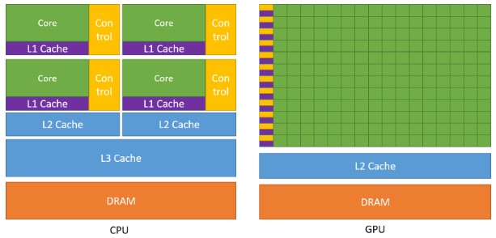
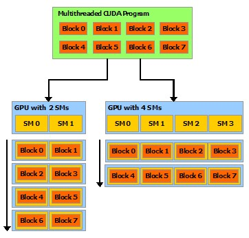
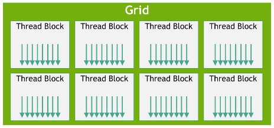
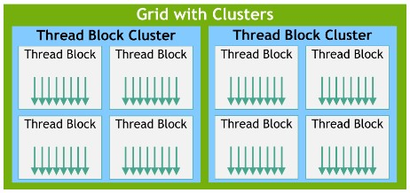
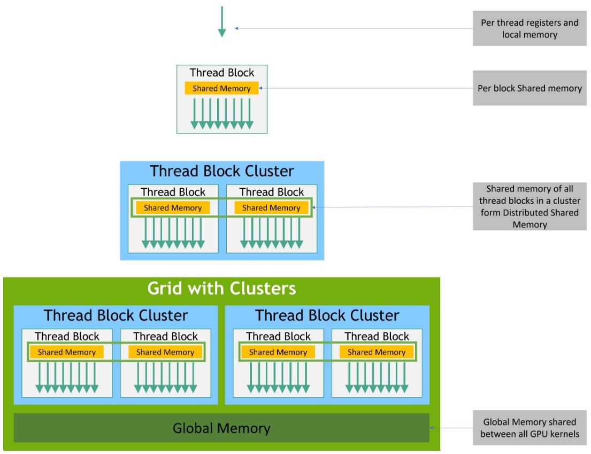
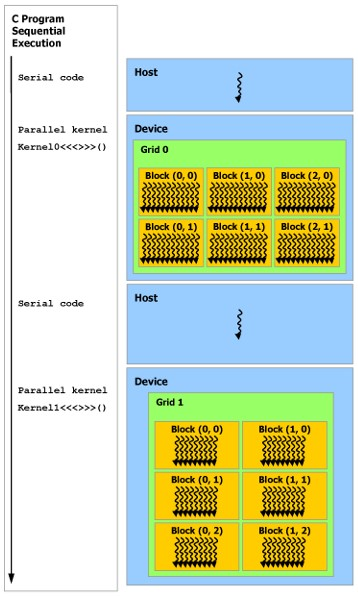
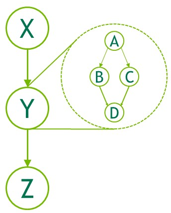

# [CUDA C++ 编程指南](https://docs.nvidia.com/cuda/cuda-c-programming-guide/index.html)

- Release 13.0

- Aug 20, 2025

# 1. 概述

CUDA 是由 NVIDIA 开发的一个并行计算平台和编程模型，它通过利用 GPU 的强大能力，显著提高了计算性能。它允许开发者使用 **C**、**C++** 和 **Fortran** 等语言来加速计算密集型应用程序，并被广泛应用于深度学习、科学计算和高性能计算（HPC）等领域。

# 2. 什么是《CUDA C 编程指南》？

《CUDA C 编程指南》是官方提供的综合性资源，解释了如何使用 CUDA 平台编写程序。它提供了关于 **CUDA 架构**、**编程模型**、**语言扩展**和**性能准则**的详细文档。无论你是 CUDA 新手，还是正在优化复杂的 GPU 内核，本指南都是一个不可或缺的重要参考，能帮助你有效利用 CUDA 的全部功能。

# 3. 引言

## 3.1. 使用 GPU 的好处

在相似的价格和功耗范围内，图形处理器（GPU）¹ 提供了比 CPU 高得多的指令吞吐量和内存带宽。许多应用程序利用这些强大的能力，在 GPU 上的运行速度比在 CPU 上更快（参见 **GPU 应用程序**）。其他计算设备，如 FPGA，虽然也非常节能，但其编程灵活性远不及 GPU。

GPU 和 CPU 之间的能力差异源于它们的设计目标不同。CPU 的设计旨在尽可能快地执行一系列操作（称为**线程**），并且可以并行执行几十个线程；而 GPU 的设计则擅长并行执行数千个线程（通过分摊较慢的单线程性能来达到更高的吞吐量）。

GPU 专为高度并行的计算而设计，因此其更多晶体管被用于数据处理，而不是数据缓存和流控制。示意图 图 1 展示了 CPU 与 GPU 芯片资源的示例分布。



**图 1**：GPU 将更多晶体管用于数据处理

将更多的晶体管用于数据处理（例如，浮点计算）对于高度并行的计算是有益的；==GPU 可以用计算来隐藏内存访问延迟==，而不是像 CPU 那样依赖大型数据缓存和复杂的流控制来避免长时间的内存访问延迟，因为这两种方式都会消耗大量的晶体管。 通常，一个应用程序既有并行部分也有顺序部分，因此系统被设计为 CPU 和 GPU 的混合架构，以实现整体性能的最大化。具有高度并行性的应用程序可以利用 GPU 的大规模并行特性，来获得比在 CPU 上更高的性能。

> ¹ “图形（graphics）”这个限定词源于 GPU 最初创建于二十年前的事实，那时它被设计成一个专用的处理器，用于加速图形渲染。在对实时、高清、3D 图形永不满足的市场需求的驱动下，它已经演变成一个通用的处理器，被用于比图形渲染更多的工作负载。

## 3.2 CUDA®: 一个通用并行计算平台和编程模型

2006 年 11 月，NVIDIA® 推出了 CUDA®，这是一个通用的并行计算平台和编程模型，它利用 NVIDIA GPU 中的并行计算引擎，以比 CPU 更高效的方式解决许多复杂的计算问题。

CUDA 提供了一个软件环境，允许开发者使用 C++ 作为高级编程语言。如图 2 所示，它还支持其他语言、应用程序编程接口或基于指令的方法，例如 FORTRAN、DirectCompute、OpenACC。


**图 2**：GPU 计算应用。CUDA 旨在支持各种语言和应用程序编程接口

## 3.3 可扩展的编程模型

多核 CPU 和多核 GPU 的出现意味着主流处理器芯片现在已经是并行系统。挑战在于如何开发应用程序软件，使其并行度能够透明地扩展，以利用不断增加的处理器核心数量，就像 3D 图形应用程序能够透明地扩展其并行度，以适应核心数量差异很大的多核 GPU 一样。

CUDA 并行编程模型旨在克服这一挑战，同时降低熟悉 C 语言等标准编程语言的程序员的学习难度。

其核心是三个关键抽象——**线程组的层次结构**、**共享内存**和**栅障同步**——它们以最少的语言扩展集形式直接呈现给程序员。

这些抽象提供了细粒度的数据并行和线程并行，嵌套在粗粒度的数据并行和任务并行中。它们指导程序员将问题划分为粗粒度子问题，这些子问题可以由**线程块**独立并行解决；同时，将每个子问题划分为更细粒度的部分，由块内的所有线程协作并行解决。

这种分解通过允许线程在解决每个子问题时进行协作，来保留语言的表达能力，同时实现了自动可扩展性。实际上，每个线程块都可以被调度到 GPU 内的任何可用多处理器上，以任何顺序，无论是并发还是顺序执行。因此，一个编译好的 CUDA 程序可以在任意数量的多处理器上执行，如图 3 所示，而只有运行时系统需要知道物理多处理器的数量。

这种可扩展的编程模型允许 GPU 架构通过简单地扩展多处理器和内存分区的数量来覆盖广泛的市场范围：从高性能发烧友级别的 GeForce GPU 和专业的 Quadro 和 Tesla 计算产品，到各种价格低廉的主流 GeForce GPU（有关所有支持 CUDA 的 GPU 列表，请参阅 [支持 CUDA 的 GPU](https://developer.nvidia.com/cuda-gpus)）。



**图 3**：自动的可扩展性

> Note：
>
> GPU 围绕流式多处理器 (SM) 阵列构建（有关更多详细信息，请参阅[硬件实现](https://docs.nvidia.com/cuda/cuda-c-programming-guide/index.html#hardware-implementation)）。多线程程序被划分为彼此独立执行的线程块，因此具有更多多处理器的 GPU 会比具有更少多处理器的 GPU 在更短的时间内自动执行程序。

# 4. 更新日志

**表 1 变更记录**

| 版本 | 更改内容                                                     |
| ---- | ------------------------------------------------------------ |
| 13.0 | 将指令吞吐量表从《CUDA C++ 编程指南》的“性能准则”部分移至《CUDA C++ 最佳实践指南》的“指令优化”部分。删除了不受支持的架构，并更正了整数运算和类型转换的条目。 |
| 12.9 | 在“CUDA 环境变量”部分新增了“错误日志管理”和 CUDA_LOG_FILE 的章节。 |
| 12.8 | 新增了“TMA Swizzle”章节。                                    |

# 5. 编程模型

本章通过概述 CUDA 编程模型在 C++ 中是如何呈现的，来介绍其背后的主要概念。

关于 CUDA C++ 的详细描述，请参见[编程接口](https://docs.nvidia.com/cuda/cuda-c-programming-guide/index.html#programming-interface)。

本章及下一章中使用的向量加法示例的完整代码，可以在 [vectorAdd CUDA 示例](https://docs.nvidia.com/cuda/cuda-samples/index.html#vector-addition) 中找到。

## 5.1. 内核（Kernels）

CUDA C++ 扩展了 C++，允许程序员定义名为 **kernels** 的 C++ 函数。与常规 C++ 函数只执行一次不同，当这些内核被调用时，它们会由 N 个不同的 CUDA 线程并行执行 N 次。

一个内核使用 `__global__` 声明修饰符来定义，并且在调用时，通过新的 `<<<...>>>`  执行配置语法来指定执行该内核的 CUDA 线程数量（参见[执行配置](https://docs.nvidia.com/cuda/cuda-c-programming-guide/index.html#execution-configuration)）。每个执行内核的线程都会被赋予一个独一无二的**线程 ID**，该 ID 可以通过内置变量在内核内部访问。

举个例子，下面的示例代码使用了内置变量 `threadIdx`，将大小为 N 的两个向量 A 和 B 相加，并将结果存储到向量 C 中。

```c++
// Kernel definition
__global__ void VecAdd(float* A, float* B, float* C)
{
    int i = threadIdx.x;
    C[i] = A[i] + B[i];
}

int main()
{
    ...
    // Kernel invocation with N threads
    VecAdd<<<1, N>>>(A, B, C);
    ...
}
```

这里，执行 `VecAdd()` 的 **N** 个线程中的每一个都执行一次成对的相加。

## 5.2. 线程层级结构

为了方便，`threadIdx` 是一个三元向量，因此线程可以使用一维、二维或三维的**线程索引**来标识，从而形成一维、二维或三维的线程块。这提供了一种自然的方式，可以跨向量、矩阵或体积等域中的元素来调用计算。

线程的索引与其线程 ID 之间的关系很简单：对于一维块，两者相同；对于大小为 *(Dx, Dy)* 的二维块，索引为 *(x, y)* 的线程的线程 ID 为 *(x + y Dx)* ；对于大小为 *(Dx, Dy, Dz)* 的三维块，索引为 *(x, y, z)* 的线程的线程 ID 为 *(x + y Dx + z Dx Dy)* 。

举个例子，以下代码将两个大小为 *NxN* 的矩阵 A 和 B 相加，并将结果存储到矩阵 C 中。

```c++
// Kernel definition
__global__ void MatAdd(float A[N][N], float B[N][N],
                       float C[N][N])
{
    int i = threadIdx.x;
    int j = threadIdx.y;
    C[i][j] = A[i][j] + B[i][j];
}

int main()
{
    ...
    // Kernel invocation with one block of N * N * 1 threads
    int numBlocks = 1;
    dim3 threadsPerBlock(N, N);
    MatAdd<<<numBlocks, threadsPerBlock>>>(A, B, C);
    ...
}
```

一个线程块内的线程数量是有限制的，因为块中的所有线程都应驻留在同一个流式多处理器（SM）核心上，并必须共享该核心有限的内存资源。在目前的 GPU 上，一个线程块最多可以包含 1024 个线程。

然而，一个内核可以由多个形状相同的线程块执行，因此线程总数等于每个块的线程数乘以块的数量。

如图 4 所示，这些线程块被组织成一个一维、二维或三维的**线程块网格（grid）**。网格中线程块的数量通常由正在处理的数据大小决定，而数据大小通常会超过系统中的处理器数量。



**图 4**：线程块网格

在 `<<<...>>>` 语法中指定的每个块的线程数和每个网格的块数可以是 `int` 或 `dim3` 类型。二维块或网格可以像前面的例子那样指定。

网格内的每个块都可以通过内置的 `blockIdx` 变量来访问其独一无二的一维、二维或三维索引。线程块的维度可以通过内置的 `blockDim` 变量在内核中访问。

将前面的 `MatAdd()` 示例扩展为处理多个块，代码如下所示。

```c++
// Kernel definition
__global__ void MatAdd(float A[N][N], float B[N][N],
float C[N][N])
{
    int i = blockIdx.x * blockDim.x + threadIdx.x;
    int j = blockIdx.y * blockDim.y + threadIdx.y;
    if (i < N && j < N)
        C[i][j] = A[i][j] + B[i][j];
}

int main()
{
    ...
    // Kernel invocation
    dim3 threadsPerBlock(16, 16);
    dim3 numBlocks(N / threadsPerBlock.x, N / threadsPerBlock.y);
    MatAdd<<<numBlocks, threadsPerBlock>>>(A, B, C);
    ...
}
```

此处，线程块的大小设为 16x16（共 256 个线程），虽然在此例中是任意选择的，但这是一种常见的做法。网格的创建确保每个矩阵元素都有一个线程对应，与之前一样。为简单起见，本例假设网格在每个维度上的线程数都能被该维度上的线程块线程数整除，尽管实际中并非必须如此。

线程块必须独立执行。这意味着可以以任何顺序、并行或串行地执行这些块。这种独立性要求使得线程块能够以任何顺序，并跨任意数量的核心进行调度，如 图 3 所示，从而使程序员能够编写出随着核心数量扩展而自动伸缩的代码。

块内的线程可以通过共享内存来共享数据，并通过同步执行来协调内存访问，从而实现协作。更具体地说，可以通过调用 `__syncthreads()` 内在函数来在内核中指定同步点；`__syncthreads()` 就像一个**屏障**，块内的所有线程都必须在此等待，然后才能继续前进。[共享内存]()一节提供了一个使用共享内存的示例。除了 `__syncthreads()` 之外，[协作组 API](https://docs.nvidia.com/cuda/cuda-c-programming-guide/index.html#cooperative-groups) 还提供了一套丰富的线程同步原语。

为了高效协作，共享内存被设计为靠近每个处理器核心的低延迟内存（很像 L1 缓存），而 `__syncthreads()` 则被设计为轻量级操作。

### 5.2.1. 线程块集群

随着 NVIDIA Compute Capability 9.0 的引入，CUDA 编程模型引入了一个可选的层次结构，称为**线程块集群（Thread Block Clusters）**，它由多个线程块组成。类似于线程块内的线程被保证共同调度到同一个流式多处理器（SM）上，集群内的线程块也被保证共同调度到 GPU 的一个 GPU 处理集群（GPC）上。

与线程块类似，集群也组织成一个一维、二维或三维的线程块集群网格，如图 5 所示。集群中的线程块数量可以由用户自定义，在 CUDA 中，8 个线程块的集群被作为可移植的集群大小来支持。需要注意的是，在无法支持 8 个多处理器的 GPU 硬件或 MIG 配置上，最大集群大小会相应减少。对这些较小配置以及支持超过 8 个线程块的更大配置的识别是架构特有的，可以使用 `cudaOccupancyMaxPotentialClusterSize` API 进行查询。



**图 5**：线程块集群

> Note：
>
> 在使用集群支持启动的内核中，出于兼容性目的，gridDim 变量仍然表示线程块数量的大小。可以使用 Cluster Group API 找到集群中块的排名。

在内核中启用线程块集群，可以使用编译时内核属性 `__cluster_dims__(X,Y,Z)`，也可以使用 CUDA 内核启动 API `cudaLaunchKernelEx`。下面的示例展示了如何使用编译时内核属性来启动集群。使用内核属性指定的集群大小在编译时是固定的，之后可以使用传统的 `<<< , >>>` 语法来启动内核。如果一个内核使用了编译时集群大小，那么在启动内核时就无法修改其集群大小。

```c++
// Kernel definition
// Compile time cluster size 2 in X-dimension and 1 in Y and Z dimension
__global__ void __cluster_dims__(2, 1, 1) cluster_kernel(float *input, float* output)
{

}

int main()
{
    float *input, *output;
    // Kernel invocation with compile time cluster size
    dim3 threadsPerBlock(16, 16);
    dim3 numBlocks(N / threadsPerBlock.x, N / threadsPerBlock.y);

    // The grid dimension is not affected by cluster launch, and is still enumerated
    // using number of blocks.
    // The grid dimension must be a multiple of cluster size.
    cluster_kernel<<<numBlocks, threadsPerBlock>>>(input, output);
}
```


线程块集群大小也可以在运行时设置，内核可以使用 CUDA 内核启动 API `cudaLaunchKernelEx` 启动。下面的代码示例展示了如何使用可扩展 API 启动集群内核。

```c++
// Kernel definition
// No compile time attribute attached to the kernel
__global__ void cluster_kernel(float *input, float* output)
{

}

int main()
{
    float *input, *output;
    dim3 threadsPerBlock(16, 16);
    dim3 numBlocks(N / threadsPerBlock.x, N / threadsPerBlock.y);

    // Kernel invocation with runtime cluster size
    {
        cudaLaunchConfig_t config = {0};
        // The grid dimension is not affected by cluster launch, and is still enumerated
        // using number of blocks.
        // The grid dimension should be a multiple of cluster size.
        config.gridDim = numBlocks;
        config.blockDim = threadsPerBlock;

        cudaLaunchAttribute attribute[1];
        attribute[0].id = cudaLaunchAttributeClusterDimension;
        attribute[0].val.clusterDim.x = 2; // Cluster size in X-dimension
        attribute[0].val.clusterDim.y = 1;
        attribute[0].val.clusterDim.z = 1;
        config.attrs = attribute;
        config.numAttrs = 1;

        cudaLaunchKernelEx(&config, cluster_kernel, input, output);
    }
}
```

在计算能力为 9.0 的 GPU 上，集群中的所有线程块都保证被共同调度到同一个 GPU 处理集群（GPC）上，并允许集群中的线程块使用 Cluster Group API 的 `cluster.sync()` 进行硬件支持的同步。集群组还提供了成员函数，可以使用 `num_threads()` 和 `num_blocks()` API 分别查询集群组中线程数和块数。线程或块在集群组中的等级（rank），则可以使用 `dim_threads()` 和 `dim_blocks()` API 分别进行查询。

属于集群的线程块可以访问分布式共享内存（Distributed Shared Memory）。集群中的线程块有能力对分布式共享内存中的任何地址进行读、写和原子操作。[分布式共享内存](https://docs.nvidia.com/cuda/cuda-c-programming-guide/index.html#distributed-shared-memory)一节提供了一个在分布式共享内存中执行直方图的示例。

### 5.2.2. 将块视为集群

使用 `__cluster_dims__` 时，所启动的集群数量是隐式的，只能手动计算。

```c++
__cluster_dims__((2, 2, 2)) __global__ void foo();

// 8x8x8 clusters each with 2x2x2 thread blocks.
foo<<<dim3(16, 16, 16), dim3(1024, 1, 1)>>>();
```

在上述示例中，内核被启动为一个 16x16x16 的线程块网格，或者说，一个 8x8x8 的集群网格。另外，使用另一个编译时内核属性 `__block_size__`，可以显式地配置一个包含特定数量线程块集群的网格。

```c++
// Implementation detail of how many threads per block and blocks per cluster
// is handled as an attribute of the kernel.
__block_size__((1024, 1, 1), (2, 2, 2)) __global__ void foo();

// 8x8x8 clusters.
foo<<<dim3(8, 8, 8)>>>();
```

`__block_size__` 需要两个字段，每个都是包含 3 个元素的元组。第一个元组表示块维度，第二个表示集群大小。如果第二个元组没有传入，则默认为 `(1,1,1)`。要指定流（stream），必须在 `<<<>>>` 内将 `1` 和 `0` 分别作为第二个和第三个参数传递，最后才是流本身。传递其他值将导致未定义的行为。

注意，`__block_size__` 的第二个元组和 `__cluster_dims__` 不能同时被指定，这是非法的。当指定了 `__block_size__` 的第二个元组时，这意味着“将块作为集群”的功能被启用，编译器会识别 `<<<>>>` 内的第一个参数为集群数量，而不是线程块数量。

## 5.3. 内存层级结构

如图 6 所示，CUDA 线程在执行过程中可以访问多个内存空间的数据。每个线程都有私有的局部内存。每个线程块都有共享内存，该内存对块内的所有线程可见，并且与块具有相同的生命周期。线程块集群中的线程可以对彼此的共享内存执行读、写和原子操作。所有线程都可以访问相同的全局内存。

此外，还有两个所有线程都可以访问的只读内存空间：常量内存和纹理内存。全局内存、常量内存和纹理内存针对不同的内存用途进行了优化（参见[设备内存访问](https://docs.nvidia.com/cuda/cuda-c-programming-guide/index.html#device-memory-accesses)）。纹理内存还为某些特定数据格式提供了不同的寻址模式和数据过滤功能（参见[纹理和表面内存](https://docs.nvidia.com/cuda/cuda-c-programming-guide/index.html#texture-and-surface-memory)）。

全局内存、常量内存和纹理内存对于同一应用程序的不同内核启动来说是持久存在的。



**图 6**：内存层次结构

## 5.4. 异构编程

如图 7 所示，CUDA 编程模型假设 CUDA 线程在一个物理上独立的设备（device）上执行，该设备作为运行 C++ 程序的主机（host）的协处理器。例如，当内核在 GPU 上执行而 C++ 程序的其余部分在 CPU 上执行时，情况就是如此。

CUDA 编程模型还假设主机和设备都在 DRAM 中维护各自独立的内存空间，分别称为主机内存（host memory）和设备内存（device memory）。因此，程序需要通过调用 CUDA 运行时（详见编程接口）来管理对内核可见的全局内存、常量内存和纹理内存空间。这包括设备内存的分配和释放，以及主机和设备内存之间的数据传输。

统一内存（Unified Memory）提供了一种托管内存（managed memory），用于连接主机和设备内存空间。托管内存作为一个单一的、一致的内存映像，拥有一个公共地址空间，可以被系统中的所有 CPU 和 GPU 访问。这项功能不仅能够支持设备内存的超额订阅，还能通过消除在主机和设备上显式镜像数据的需求，极大地简化应用程序的移植工作。有关统一内存的介绍，请参阅[统一内存编程](https://docs.nvidia.com/cuda/cuda-c-programming-guide/index.html#um-unified-memory-programming-hd)。



**图 7**：异构编程

> Note：
>
> 串行代码在主机上执行，而并行代码在设备上执行。

## 5.5. 异步 SIMT 编程模型

在 CUDA 编程模型中，线程是执行计算或内存操作的最低抽象级别。从基于 NVIDIA Ampere GPU 架构的设备开始，CUDA 编程模型通过异步编程模型为内存操作提供了加速。异步编程模型定义了异步操作相对于 CUDA 线程的行为。

异步编程模型定义了用于 CUDA 线程间同步的异步屏障（Asynchronous Barrier）的行为。该模型还解释和定义了如何使用 `cuda::memcpy_async` 来在 GPU 进行计算的同时，从全局内存异步移动数据。

### 5.5.1. 异步操作

异步操作被定义为由一个 CUDA 线程发起，并像是由另一个线程异步执行的操作。在一个结构良好的程序中，一个或多个 CUDA 线程会与该异步操作进行同步。发起异步操作的 CUDA 线程不一定需要是参与同步的线程。

这种异步线程（一个“仿佛”存在的线程）总是与发起异步操作的 CUDA 线程相关联。异步操作使用同步对象来同步操作的完成。这种同步对象可以由用户显式管理（例如，`cuda::memcpy_async`），也可以在库中隐式管理（例如，`cooperative_groups::memcpy_async`）。

同步对象可以是 `cuda::barrier` 或 `cuda::pipeline`。这些对象在[异步屏障](https://docs.nvidia.com/cuda/cuda-c-programming-guide/index.html#aw-barrier)和[使用 cuda::pipeline 的异步数据复制](https://docs.nvidia.com/cuda/cuda-c-programming-guide/index.html#asynchronous-data-copies)中进行了详细解释。这些同步对象可以在不同的线程范围（thread scopes）中使用。一个范围定义了可以使用同步对象与异步操作同步的线程集合。下表定义了 CUDA C++ 中可用的线程范围以及每个范围可以同步的线程。

| 线程作用域                                | 描述                                                    |
| ----------------------------------------- | ------------------------------------------------------- |
| `cuda::thread_scope::thread_scope_thread` | 只有发起异步操作的 CUDA 线程才会同步。                  |
| `cuda::thread_scope::thread_scope_block`  | 与发起线程相同线程块中的所有或任何 CUDA 线程同步。      |
| `cuda::thread_scope::thread_scope_device` | 与发起线程相同 GPU 设备中的所有或任何 CUDA 线程同步。   |
| `cuda::thread_scope::thread_scope_system` | 与发起线程相同系统中的所有或任何 CUDA 或 CPU 线程同步。 |

这些线程作用域作为 CUDA 标准 C++ 库中标准 C++ 的扩展来实现。

## 5.6. 计算能力（Compute Capability）

设备的计算能力（compute capability）由版本号表示，有时也称为其“SM 版本”。此版本号标识了 GPU 硬件所支持的功能，并由应用程序在运行时使用，以确定当前 GPU 上可用的硬件功能和/或指令。

计算能力包括一个主修订号 X 和一个次修订号 Y，记为 X.Y。

主修订号表示设备的核心 GPU 架构。具有相同主修订号的设备共享相同的基本架构。下表列出了与每个 NVIDIA GPU 架构对应的主修订号。

**表 2 GPU 架构与主修订号**

| 主修订号 | NVIDIA GPU 架构         |
| -------- | ----------------------- |
| 9        | NVIDIA Hopper GPU 架构  |
| 8        | NVIDIA Ampere GPU 架构  |
| 7        | NVIDIA Volta GPU 架构   |
| 6        | NVIDIA Pascal GPU 架构  |
| 5        | NVIDIA Maxwell GPU 架构 |
| 3        | NVIDIA Kepler GPU 架构  |

Export to Sheets

------

次修订号对应于核心架构的增量改进，可能包括新功能。

**表 3 GPU 架构中的增量更新**

| 计算能力 | NVIDIA GPU 架构        | 基于                  |
| -------- | ---------------------- | --------------------- |
| 7.5      | NVIDIA Turing GPU 架构 | NVIDIA Volta GPU 架构 |

Export to Sheets

[支持 CUDA 的 GPU](https://developer.nvidia.com/cuda-gpus) 列表列出了所有支持 CUDA 的设备及其计算能力。[计算能力](https://docs.nvidia.com/cuda/cuda-c-programming-guide/index.html#compute-capabilities)一节提供了每种计算能力的技术规格。

> Note
>
> 特定 GPU 的计算能力版本不应与 CUDA 版本（例如，CUDA 7.5、CUDA 8、CUDA 9）混淆，后者是 CUDA 软件平台的版本。应用程序开发者使用 CUDA 平台来创建可以在多代 GPU 架构上运行的应用程序，包括未来尚未发明的 GPU 架构。虽然新版本的 CUDA 平台通常会通过支持新架构的计算能力版本来增加对其的原生支持，但新版本的 CUDA 平台通常也包括独立于硬件世代的软件功能。

从 CUDA 7.0 和 CUDA 9.0 开始，分别不再支持 Tesla 和 Fermi 架构。

# 6. 编程接口

CUDA C++ 为熟悉 C++ 编程语言的用户提供了一条简单的路径，使其能够轻松编写在设备上执行的程序。

它由对 C++ 语言的少量扩展和一个运行时库组成。

核心语言扩展已在[编程模型]()一节中介绍。这些扩展允许程序员将内核定义为 C++ 函数，并使用一些新语法来指定每次函数调用时的网格和块维度。所有扩展的完整描述可在 [C++ 语言扩展](https://docs.nvidia.com/cuda/cuda-c-programming-guide/index.html#c-language-extensions)中找到。任何包含这些扩展的源文件都必须使用 `nvcc` 进行编译，如[使用 NVCC 编译](https://docs.nvidia.com/cuda/cuda-c-programming-guide/index.html#compilation-with-nvcc)一节所述。

[CUDA 运行时](https://docs.nvidia.com/cuda/cuda-c-programming-guide/index.html#cuda-c-runtime)一节介绍了运行时库。它提供了在主机上执行的 C 和 C++ 函数，用于分配和释放设备内存、在主机和设备内存之间传输数据、管理多设备系统等。有关运行时的完整描述，请参见 CUDA 参考手册。

该运行时构建在更底层的 C API（即 CUDA 驱动程序 API）之上，应用程序也可以访问该 API。驱动程序 API 通过公开更底层的概念（例如，与主机进程相对应的 CUDA 上下文，以及与动态加载库相对应的 CUDA 模块），提供了额外的控制级别。大多数应用程序不使用驱动程序 API，因为它们不需要这种额外的控制，并且在使用运行时时，上下文和模块管理是隐式的，从而使代码更简洁。由于运行时与驱动程序 API 能够互操作，大多数需要某些驱动程序 API 功能的应用程序可以默认使用运行时 API，只在需要时使用驱动程序 API。驱动程序 API 在[驱动程序 API](https://docs.nvidia.com/cuda/cuda-c-programming-guide/index.html#driver-api) 中有介绍，并在参考手册中进行了完整描述。

## 6.1. 使用 NVCC 编译

内核可以使用 CUDA 指令集架构（称为 PTX，在 PTX 参考手册中有描述）来编写。然而，通常使用 C++ 等高级编程语言更为有效。在这两种情况下，内核都必须由 `nvcc` 编译成二进制代码才能在设备上执行。

`nvcc` 是一个编译器驱动程序，它简化了编译 C++ 或 PTX 代码的过程：它提供了简单而熟悉的命令行选项，并通过调用实现不同编译阶段的工具集合来执行它们。本节概述了 `nvcc` 的工作流程和命令选项。完整的描述可以在 `nvcc` 用户手册中找到。

### 6.1.1. 编译工作流程

#### 6.1.1.1. 离线编译

使用 `nvcc` 编译的源文件可以包含主机代码（即在主机上执行的代码）和设备代码（即在设备上执行的代码）的混合。`nvcc` 的基本工作流程包括将设备代码与主机代码分离，然后：

- 将设备代码编译成汇编形式（PTX 代码）和/或二进制形式（cubin 对象）；
- 通过用必要的 CUDA 运行时函数调用来替换[内核](https://docs.nvidia.com/cuda/cuda-c-programming-guide/index.html#kernels)一节中介绍的 `<<<...>>>` 语法（在[执行配置](https://docs.nvidia.com/cuda/cuda-c-programming-guide/index.html#execution-configuration)中有更详细描述），从而修改主机代码，以从 PTX 代码和/或 cubin 对象中加载和启动每个编译好的内核。

修改后的主机代码或者作为 C++ 代码输出，留给其他工具编译；或者通过让 `nvcc` 在最后的编译阶段直接调用主机编译器，以目标代码形式输出。

之后，应用程序可以：

- 链接到已编译的主机代码（这是最常见的情况）；
- 或者忽略修改后的主机代码（如果有的话），并使用 CUDA 驱动程序 API（参见[驱动程序 API]）来加载和执行 PTX 代码或 cubin 对象。

#### 6.1.1.2. 即时编译 

任何在运行时被应用程序加载的 PTX 代码都会由设备驱动程序进一步编译为二进制代码。这被称为即时编译。即时编译会增加应用程序的加载时间，但能让应用程序受益于每个新设备驱动程序带来的新编译器改进。它也是应用程序在编译时不存在的设备上运行的唯一方式，详细内容请参见 [应用程序兼容性]()。

当设备驱动程序为某个应用程序即时编译一些 PTX 代码时，它会自动缓存一份生成的二进制代码副本，以避免在后续调用应用程序时重复编译。这个被称为计算缓存（compute cache）的缓存，在设备驱动程序升级时会自动失效，这样应用程序就可以受益于内置在新设备驱动程序中的即时编译器改进。

可以使用环境变量来控制即时编译，具体请参见 [CUDA 环境变量]()。

作为使用 `nvcc` 编译 CUDA C++ 设备代码的替代方案，NVRTC 可用于在运行时将 CUDA C++ 设备代码编译为 PTX。NVRTC 是一个用于 CUDA C++ 的运行时编译库；更多信息可在 [NVRTC 用户指南]()中找到。

### 6.1.2. 二进制兼容性

二进制代码是特定于架构的。使用编译器选项 `-code` 可以生成 cubin 对象，该选项指定了目标架构：例如，使用 `-code=sm_80` 进行编译会为计算能力为 8.0 的设备生成二进制代码。二进制兼容性可从一个次要版本保证到下一个，但不能从一个次要版本保证到前一个，也不能跨主要版本。换句话说，为计算能力 X.y 生成的 cubin 对象只会在计算能力为 X.z（其中 z≥y）的设备上执行。

> 二进制兼容性仅在桌面端支持。Tegra 不支持。此外，桌面和 Tegra 之间的二进制兼容性也不受支持。

### 6.1.3. PTX 兼容性

某些 PTX 指令仅在计算能力更高的设备上受支持。例如，[Warp Shuffle Functions](https://docs.nvidia.com/cuda/cuda-c-programming-guide/index.html#warp-shuffle-functions)（线程束混洗函数）仅在计算能力 5.0 及以上的设备上受支持。-arch 编译器选项指定了将 C++ 编译为 PTX 代码时所假设的计算能力。因此，包含线程束混洗等的代码，必须使用 `-arch=compute_50` (或更高)进行编译。

为某些特定计算能力生成的 PTX 代码总是可以编译为更大或相等计算能力的二进制代码。请注意，从早期 PTX 版本编译的二进制文件可能无法利用某些硬件特性。例如，针对计算能力 7.0 (Volta) 的设备编译的二进制文件，如果其 PTX 是为计算能力 6.0 (Pascal) 生成的，将无法利用 Tensor Core 指令，因为这些指令在 Pascal 上不可用。因此，最终的二进制文件的性能可能比使用最新版本 PTX 生成的可能性能要差。

编译以针对架构特定功能的 PTX 代码仅在完全相同的物理架构上运行，不能在其他任何地方运行。架构特定的 PTX 代码不向前和向后兼容。使用 `sm_90a` 或 `compute_90a` 编译的示例代码仅在计算能力为 9.0 的设备上运行，不向后或向前兼容。

编译以针对族特定功能的 PTX 代码仅在完全相同的物理架构和同一族中的其他架构上运行。族特定的 PTX 代码与同一族中的其他设备向前兼容，但不向后兼容。使用 `sm_100f` 或 `compute_100f` 编译的示例代码仅在计算能力为 10.0 和 10.3 的设备上运行。表 25 显示了族特定目标与计算能力的兼容性。

### 6.1.4. 应用程序兼容性

要在具有特定计算能力的设备上执行代码，应用程序必须加载与该计算能力兼容的二进制或 PTX 代码，如二进制兼容性和 PTX 兼容性中所述。特别是，为了能够在计算能力更高的未来架构上执行代码（尚无法为其生成二进制代码），应用程序必须加载 PTX 代码，该代码将为这些设备进行即时编译（请参阅即时编译）。

CUDA C++ 应用程序中嵌入的 PTX 和二进制代码由 `-arch` 和 `-code` 编译器选项或 `-gencode` 编译器选项控制，具体细节在 `nvcc` 用户手册中有详细说明。例如：

```bash
nvcc x.cu
        -gencode arch=compute_50,code=sm_50
        -gencode arch=compute_60,code=sm_60
        -gencode arch=compute_70,code=\"compute_70,sm_70\"
```

此命令嵌入了与计算能力 5.0 和 6.0 兼容的二进制代码（第一个和第二个 `-gencode` 选项），以及与计算能力 7.0 兼容的 PTX 和二进制代码（第三个 `-gencode` 选项）。

生成的宿主代码将自动在运行时选择最合适的代码进行加载和执行，在上述示例中，它将是：

- 适用于计算能力 5.0 和 5.2 设备的 5.0 二进制代码， 
- 适用于计算能力 6.0 和 6.1 设备的 6.0 二进制代码， 
- 适用于计算能力 7.0 和 7.5 设备的 7.0 二进制代码， 
- 对于计算能力高于 7.5 的设备，PTX 代码将在运行时被编译成二进制代码。

`x.cu` 可以有一个优化的代码路径，比如使用仅在计算能力为 8.0 及更高版本的设备上支持的 warp reduction 操作。可以使用 `__CUDA_ARCH__` 宏来根据计算能力区分不同的代码路径。该宏仅为设备代码定义。例如，当使用 `-arch=compute_80` 编译时，`__CUDA_ARCH__` 等于 800。

如果 `x.cu` 使用 `sm_100f` 或 `compute_100f` 编译为 [特定系列功能](https://docs.nvidia.com/cuda/cuda-c-programming-guide/index.html#family-specific-features)，则该代码只能在该特定系列的设备上运行，即计算能力为 10.0 和 10.3 的设备。对于特定系列的代码目标，还会定义一个额外的宏 `__CUDA_ARCH_FAMILY_SPECIFIC__`。在本例中，`__CUDA_ARCH_FAMILY_SPECIFIC__` 等于 1000。

如果 `x.cu` 使用 `sm_100a` 或 `compute_100a` 编译为 [特定架构功能](https://docs.nvidia.com/cuda/cuda-c-programming-guide/index.html#architecture-specific-features)，则该代码只能在计算能力为 10.0 的设备上运行。对于特定架构的代码目标，会定义一个额外的宏 `__CUDA_ARCH_SPECIFIC__`。在本例中，`__CUDA_ARCH_SPECIFIC__` 等于 1000。由于特定架构功能是特定系列功能的超集，因此特定系列宏 `__CUDA_ARCH_FAMILY_SPECIFIC__` 也被定义，并且等于 1000。

使用 驱动 API 的应用程序必须将代码编译成不同的文件，并在运行时显式加载和执行最合适的文件。

Volta 架构引入了独立线程调度，这改变了 GPU 上线程的调度方式。对于依赖于先前架构中 [SIMT 调度](https://docs.nvidia.com/cuda/cuda-c-programming-guide/index.html#simt-architecture) 特定行为的代码，独立线程调度可能会改变参与线程的集合，从而导致不正确的结果。为了帮助开发者在实现独立线程调度中详细的更正措施时进行迁移，Volta 开发者可以使用编译器选项组合 `-arch=compute_60 -code=sm_70` 来选择使用 Pascal 的线程调度。

`nvcc` 用户手册 列出了 `-arch`、`-code` 和 `-gencode` 编译器选项的各种简写形式。例如，`-arch=sm_70` 是 `-arch=compute_70 -code=compute_70,sm_70` 的简写形式（与 `-gencode arch=compute_70,code=\"compute_70,sm_70\"` 相同）。

### 6.1.5. C++ 兼容性

编译器的前端根据 C++ 语法规则处理 CUDA 源文件。主机代码完全支持完整的 C++。但是，如[C++ 语言支持](#14. C++ 语言支持)中所述，设备代码只完全支持 C++ 的一个子集。

### 6.1.6. 64 位兼容性

`nvcc` 的 64 位版本以 64 位模式编译设备代码 (即指针为 64 位)。以 64 位模式编译的设备代码仅与以 64 位模式编译的主机代码一起支持。

## 6.2. CUDA 运行时

运行时在 `cudart` 库中实现，通过 `cudart.lib` 或 `libcudart.a` 进行静态链接，或通过 `cudart.dll` 或 `libcudart.so` 进行动态链接，以连接到应用程序。需要 `cudart.dll` 和/或 `cudart.so` 进行动态链接的应用程序通常会将它们作为应用程序安装包的一部分。只有当组件链接到同一 CUDA 运行时实例时，才能安全地传递 CUDA 运行时符号的地址。

其所有入口点都以 `cuda` 为前缀。

正如 [异构编程]() 中提到的，CUDA 编程模型假设一个系统由一个主机和一个设备组成，各自拥有独立的内存。

- [设备内存](https://docs.nvidia.com/cuda/cuda-c-programming-guide/index.html#device-memory) 概述了用于管理设备内存的运行时函数。
- [共享内存](https://docs.nvidia.com/cuda/cuda-c-programming-guide/index.html#shared-memory) 阐述了如何使用在 [线程层级](https://docs.nvidia.com/cuda/cuda-c-programming-guide/index.html#thread-hierarchy) 中引入的共享内存来最大化性能。
- [页锁定主机内存](https://docs.nvidia.com/cuda/cuda-c-programming-guide/index.html#page-locked-host-memory) 介绍了页锁定主机内存，它是在主机和设备内存之间进行数据传输时，实现与内核执行重叠所必需的。
- [异步并发执行](https://docs.nvidia.com/cuda/cuda-c-programming-guide/index.html#asynchronous-concurrent-execution) 描述了用于在系统不同层级上实现异步并发执行的概念和 API。
- [多设备系统](https://docs.nvidia.com/cuda/cuda-c-programming-guide/index.html#multi-device-system) 展示了编程模型如何扩展到连接到同一主机的多设备系统。
- [错误检查](https://docs.nvidia.com/cuda/cuda-c-programming-guide/index.html#error-checking) 描述了如何正确检查运行时生成的错误。
- [调用栈](https://docs.nvidia.com/cuda/cuda-c-programming-guide/index.html#call-stack) 提到了用于管理 CUDA C++ 调用栈的运行时函数。
- [纹理和表面内存](https://docs.nvidia.com/cuda/cuda-c-programming-guide/index.html#texture-and-surface-memory) 介绍了纹理和表面内存空间，它们提供了另一种访问设备内存的方式，并公开了部分 GPU 纹理硬件。
- [图形互操作性](https://docs.nvidia.com/cuda/cuda-c-programming-guide/index.html#graphics-interoperability) 介绍了运行时提供的用于与两种主要图形 API（OpenGL 和 Direct3D）进行互操作的各种函数。

### 6.2.1. 初始化

从 CUDA 12.0 开始，`cudaInitDevice()` 和 `cudaSetDevice()` 这两个函数调用会初始化运行时以及与指定设备关联的主上下文。如果没有这些调用，运行时会隐式使用设备 0，并根据需要自动初始化以处理其他运行时 API 请求。在对运行时函数进行计时或解释首次调用运行时时的错误代码时，您需要记住这一点。在 12.0 之前，`cudaSetDevice()` 不会初始化运行时，因此应用程序通常会使用空操作（no-op）的运行时调用 `cudaFree(0)` 来将运行时初始化与其他 API 活动隔离开来（这样做是为了方便计时和错误处理）。

运行时会为系统中的每个设备创建一个 CUDA 上下文（有关 CUDA 上下文的更多详细信息，请参阅 [上下文](https://docs.nvidia.com/cuda/cuda-c-programming-guide/index.html#context)）。这个上下文是该设备的主上下文，并在需要该设备上活动上下文的第一个运行时函数调用时进行初始化。它在应用程序的所有主机线程之间共享。作为上下文创建的一部分，设备代码（如有必要）会进行即时编译，并加载到设备内存中，所有这些过程都是透明完成的。如果需要（例如，为了驱动 API 的互操作性），可以像[运行时和驱动 API 之间的互操作性](https://docs.nvidia.com/cuda/cuda-c-programming-guide/index.html#interoperability-between-runtime-and-driver-apis)中描述的那样，通过驱动 API 访问设备的主上下文。

当一个主机线程调用 `cudaDeviceReset()` 时，它会销毁该主机线程当前操作的设备的主上下文（即在设备选择（Device Selection）中定义的当前设备）。之后，任何以该设备为“当前设备”的主机线程进行的下一个运行时函数调用，都会为该设备创建一个新的主上下文。


>CUDA 接口使用全局状态，该状态在主机程序启动期间进行初始化，并在主机程序终止期间被销毁。CUDA 运行时和驱动程序无法检测该状态是否无效，因此在程序启动或 `main` 函数之后终止期间（隐式或显式地）使用这些接口中的任何一个都将导致未定义的行为。
>
>从 CUDA 12.0 开始，`cudaSetDevice()` 在为主机线程更改当前设备后，会显式地初始化运行时。之前的 CUDA 版本会将新设备上的运行时初始化延迟到 `cudaSetDevice()` 之后的第一次运行时调用时。这一变化意味着，现在检查 `cudaSetDevice()` 的返回值以获取初始化错误变得非常重要。
>
>参考手册中有关错误处理和版本管理的运行时函数不会初始化运行时。
>

### 6.2.2. 设备内存

如异构编程中所述，CUDA 编程模型假设一个由主机和设备组成的系统，每个系统都有自己的独立内存。内核在设备内存中运行，因此运行时提供了用于分配、释放、复制设备内存以及在主机内存和设备内存之间传输数据的函数。

设备内存可以分配为线性内存或 CUDA 数组。

- CUDA 数组是针对纹理获取优化的不透明内存布局。它们在纹理和表面内存中描述。

- 线性内存分配在一个统一的地址空间中，这意味着单独分配的实体可以通过指针相互引用，例如在二叉树或链表中。地址空间的大小取决于主机系统（CPU）和所用 GPU 的计算能力：

表 1 线性内存地址空间

|                              | x86_64 (AMD64) | POWER (ppc64le) | ARM64        |
| ---------------------------- | -------------- | --------------- | ------------ |
| 最高至计算能力 5.3 (Maxwell) | 40bit          | 40bit           | 40bit        |
| 计算能力 6.0 (Pascal) 或更新 | 最高至 47bit   | 最高至 49bit    | 最高至 48bit |

> **注意**
>
> 在计算能力为 5.3（Maxwell）及更早的设备上，CUDA 驱动程序创建一个未提交的 40 位虚拟地址保留，以确保内存分配（指针）落在支持的范围内。此保留显示为保留的虚拟内存，但直到程序实际分配内存才会占用任何物理内存。

线性内存通常使用 `cudaMalloc()` 分配，使用 `cudaFree()` 释放，主机内存和设备内存之间的数据传输通常使用 `cudaMemcpy()` 完成。在内核的向量加法代码示例中，需要将向量从主机内存复制到设备内存：

```c++
// Device code
__global__ void VecAdd(float* A, float* B, float* C, int N)
{
    int i = blockDim.x * blockIdx.x + threadIdx.x;
    if (i < N)
        C[i] = A[i] + B[i];
}

// Host code
int main()
{
    int N = ...;
    size_t size = N * sizeof(float);

    // Allocate input vectors h_A and h_B in host memory
    float* h_A = (float*)malloc(size);
    float* h_B = (float*)malloc(size);
    float* h_C = (float*)malloc(size);

    // Initialize input vectors
    ...

    // Allocate vectors in device memory
    float* d_A;
    cudaMalloc(&d_A, size);
    float* d_B;
    cudaMalloc(&d_B, size);
    float* d_C;
    cudaMalloc(&d_C, size);

    // Copy vectors from host memory to device memory
    cudaMemcpy(d_A, h_A, size, cudaMemcpyHostToDevice);
    cudaMemcpy(d_B, h_B, size, cudaMemcpyHostToDevice);

    // Invoke kernel
    int threadsPerBlock = 256;
    int blocksPerGrid =
            (N + threadsPerBlock - 1) / threadsPerBlock;
    VecAdd<<<blocksPerGrid, threadsPerBlock>>>(d_A, d_B, d_C, N);

    // Copy result from device memory to host memory
    // h_C contains the result in host memory
    cudaMemcpy(h_C, d_C, size, cudaMemcpyDeviceToHost);

    // Free device memory
    cudaFree(d_A);
    cudaFree(d_B);
    cudaFree(d_C);

    // Free host memory
    ...
}
```

线性内存还可以通过 `cudaMallocPitch()` 和 `cudaMalloc3D()` 分配。对于二维或三维数组的分配，推荐使用这些函数，因为它们可以确保分配适当填充以满足设备内存访问中描述的对齐要求，从而在访问行地址或在二维数组和其他设备内存区域之间执行复制（使用 `cudaMemcpy2D()` 和 `cudaMemcpy3D()` 函数）时确保最佳性能。返回的 pitch（或步幅）必须用于访问数组元素。

以下代码示例分配了一个 `width` x `height` 的二维浮点值数组，并展示了如何在设备代码中循环遍历数组元素：

```c++
// Host code
int width = 64, height = 64;
float* devPtr;
size_t pitch;
cudaMallocPitch(&devPtr, &pitch,
                width * sizeof(float), height);
MyKernel<<<100, 512>>>(devPtr, pitch, width, height);

// Device code
__global__ void MyKernel(float* devPtr,
                         size_t pitch, int width, int height)
{
    for (int r = 0; r < height; ++r) {
        float* row = (float*)((char*)devPtr + r * pitch);
        for (int c = 0; c < width; ++c) {
            float element = row[c];
        }
    }
}
```

以下代码示例分配了一个 `width` x `height` x `depth` 的浮点值 3D 数组，并展示了如何在设备代码中循环遍历数组元素：

```c++
// Host code
int width = 64, height = 64, depth = 64;
cudaExtent extent = make_cudaExtent(width * sizeof(float),
                                    height, depth);
cudaPitchedPtr devPitchedPtr;
cudaMalloc3D(&devPitchedPtr, extent);
MyKernel<<<100, 512>>>(devPitchedPtr, width, height, depth);

// Device code
__global__ void MyKernel(cudaPitchedPtr devPitchedPtr,
                         int width, int height, int depth)
{
    char* devPtr = devPitchedPtr.ptr;
    size_t pitch = devPitchedPtr.pitch;
    size_t slicePitch = pitch * height;
    for (int z = 0; z < depth; ++z) {
        char* slice = devPtr + z * slicePitch;
        for (int y = 0; y < height; ++y) {
            float* row = (float*)(slice + y * pitch);
            for (int x = 0; x < width; ++x) {
                float element = row[x];
            }
        }
    }
}
```

>**注意**
>
>为了避免过度分配内存并影响系统整体性能，请根据问题规模向用户请求分配参数。如果分配失败，您可以回退到其他较慢的内存类型（`cudaMallocHost()`、`cudaHostRegister()` 等），或返回错误消息告知用户所需的内存量。如果您的应用程序由于某种原因无法请求分配参数，我们建议在支持的平台上使用 `cudaMallocManaged()`。

参考手册列出了用于在 `cudaMalloc()` 分配的线性内存、`cudaMallocPitch()` 或 `cudaMalloc3D()` 分配的线性内存、CUDA 数组以及为全局或常量内存空间声明的变量分配的内存之间复制内存的各种函数。 

以下代码示例说明了通过运行时 API 访问全局变量的各种方法：

```c++
__constant__ float constData[256];
float data[256];
cudaMemcpyToSymbol(constData, data, sizeof(data));
cudaMemcpyFromSymbol(data, constData, sizeof(data));

__device__ float devData;
float value = 3.14f;
cudaMemcpyToSymbol(devData, &value, sizeof(float));

__device__ float* devPointer;
float* ptr;
cudaMalloc(&ptr, 256 * sizeof(float));
cudaMemcpyToSymbol(devPointer, &ptr, sizeof(ptr));
```

`cudaGetSymbolAddress()` 用于检索指向全局内存空间中为变量分配的内存的地址。分配内存的大小可以通过 `cudaGetSymbolSize()` 获取。

### 6.2.3. 设备内存 L2 访问管理

当 CUDA 内核重复访问全局内存中的数据区域时，可以认为这些数据访问是持久的。另一方面，如果数据只被访问一次，则可以认为这些数据访问是流式的。 

从 CUDA 11.0 开始，计算能力为 8.0 及以上的设备能够影响数据在 L2 缓存中的持久性，从而潜在地提供更高的带宽和更低的全局内存访问延迟。

#### 6.2.3.1. L2 缓存保留用于持久访问

L2 缓存的一部分可以被预留出来，专门用于持久的全局内存数据访问。持久访问对这部分预留的 L2 缓存拥有优先使用权，而普通或流式的全局内存访问只有在持久访问未使用这部分 L2 缓存时才能使用它。

用于持久访问的 L2 缓存预留大小可以在一定限度内进行调整：

```c++
cudaGetDeviceProperties(&prop, device_id);
size_t size = min(int(prop.l2CacheSize * 0.75), prop.persistingL2CacheMaxSize);
cudaDeviceSetLimit(cudaLimitPersistingL2CacheSize, size); /* set-aside 3/4 of L2 cache for persisting accesses or the max allowed*/
```

当 GPU 配置为多实例 GPU (MIG) 模式时，L2 缓存保留功能被禁用。 

使用多进程服务（MPS）时，L2 缓存的预留大小无法通过 `cudaDeviceSetLimit` 进行更改。相反，预留大小只能在 MPS 服务器启动时，通过环境变量 `CUDA_DEVICE_DEFAULT_PERSISTING_L2_CACHE_PERCENTAGE_LIMIT` 来指定。

#### 6.2.3.2. 持久访问的 L2 策略

访问策略窗口指定了全局内存中的一个连续区域，以及该区域内访问在 L2 缓存中的持久性属性。

下面的代码示例展示了如何使用 CUDA 流来设置一个 L2 持久访问窗口。

**CUDA Stream 示例**

```c++
cudaStreamAttrValue stream_attribute;                                         // Stream level attributes data structure
stream_attribute.accessPolicyWindow.base_ptr  = reinterpret_cast<void*>(ptr); // Global Memory data pointer
stream_attribute.accessPolicyWindow.num_bytes = num_bytes;                    // Number of bytes for persistence access.
                                                                              // (Must be less than cudaDeviceProp::accessPolicyMaxWindowSize)
stream_attribute.accessPolicyWindow.hitRatio  = 0.6;                          // Hint for cache hit ratio
stream_attribute.accessPolicyWindow.hitProp   = cudaAccessPropertyPersisting; // Type of access property on cache hit
stream_attribute.accessPolicyWindow.missProp  = cudaAccessPropertyStreaming;  // Type of access property on cache miss.

//Set the attributes to a CUDA stream of type cudaStream_t
cudaStreamSetAttribute(stream, cudaStreamAttributeAccessPolicyWindow, &stream_attribute);
```

当内核在 CUDA `stream` 中执行时，对全局内存范围 `[ptr..ptr+num_bytes)` 内的内存访问，比对其他全局内存位置的访问更有可能在 L2 缓存中保持持久。

如下面的示例所示，L2 持久性也可以为 CUDA Graph 内核节点进行设置：

**CUDA GraphKernelNode 示例**

```c++
cudaKernelNodeAttrValue node_attribute;                                     // Kernel level attributes data structure
node_attribute.accessPolicyWindow.base_ptr  = reinterpret_cast<void*>(ptr); // Global Memory data pointer
node_attribute.accessPolicyWindow.num_bytes = num_bytes;                    // Number of bytes for persistence access.
                                                                            // (Must be less than cudaDeviceProp::accessPolicyMaxWindowSize)
node_attribute.accessPolicyWindow.hitRatio  = 0.6;                          // Hint for cache hit ratio
node_attribute.accessPolicyWindow.hitProp   = cudaAccessPropertyPersisting; // Type of access property on cache hit
node_attribute.accessPolicyWindow.missProp  = cudaAccessPropertyStreaming;  // Type of access property on cache miss.

//Set the attributes to a CUDA Graph Kernel node of type cudaGraphNode_t
cudaGraphKernelNodeSetAttribute(node, cudaKernelNodeAttributeAccessPolicyWindow, &node_attribute);
```

`hitRatio` 参数可用于指定获得 `hitProp` 属性的访问所占的比例。在上面两个例子中，全局内存区域 `[ptr..ptr+num_bytes)` 内有 60% 的内存访问具有持久属性，而 40% 的内存访问具有流式属性。具体哪些内存访问被归类为持久访问（即 `hitProp`）是随机的，其概率约为 `hitRatio`；概率分布取决于硬件架构和内存范围。

例如，如果预留的 L2 缓存大小为 16KB，而 `accessPolicyWindow` 中的 `num_bytes` 为 32KB：

- 当 `hitRatio` 为 0.5 时，硬件将随机选择 32KB 窗口中的 16KB，指定其为持久访问并缓存在预留的 L2 缓存区域中。
- 当 `hitRatio` 为 1.0 时，硬件将尝试将整个 32KB 窗口缓存到预留的 L2 缓存区域。由于预留区域小于窗口大小，缓存行将被逐出，以确保 32KB 数据中最近使用的 16KB 仍保留在 L2 缓存的预留部分。

因此，`hitRatio` 可用于避免缓存行的抖动，并总体上减少进出 L2 缓存的数据量。

`hitRatio` 值低于 1.0 时，可以手动控制来自并发 CUDA 流的不同 `accessPolicyWindows` 可以在 L2 中缓存的数据量。例如，假设预留的 L2 缓存大小为 16KB，两个并发内核在两个不同的 CUDA 流中运行，每个内核都有一个 16KB 的 `accessPolicyWindow`，且 `hitRatio` 值都为 1.0。它们在竞争共享的 L2 资源时，可能会互相驱逐对方的缓存行。然而，如果两个 `accessPolicyWindows` 的 `hitRatio` 值都为 0.5，则它们驱逐自己或对方持久缓存行的可能性会降低。

#### 6.2.3.3. L2 访问属性

针对不同的全局内存数据访问，定义了三种类型的访问属性：

- `cudaAccessPropertyStreaming`：具有流式属性的内存访问不太可能在 L2 缓存中持久化，因为这些访问会被优先逐出。
- `cudaAccessPropertyPersisting`：具有持久属性的内存访问更可能在 L2 缓存中持久化，因为这些访问会被优先保留在 L2 缓存的预留部分。
- `cudaAccessPropertyNormal`：此访问属性会强制将先前应用的持久访问属性重置为正常状态。来自先前 CUDA 内核的具有持久属性的内存访问，可能会在其预期用途结束很久后仍保留在 L2 缓存中。这种“使用后持久”会减少可供后续未使用持久属性的内核使用的 L2 缓存量。使用 `cudaAccessPropertyNormal` 属性重置访问策略窗口，可以移除先前访问的持久（优先保留）状态，使其行为如同之前没有应用任何访问属性一样。

#### 6.2.3.4. L2 持久性示例

以下示例演示了如何为持久访问保留 L2 缓存，通过 CUDA Stream 在 CUDA 内核中使用保留的 L2 缓存，然后重置 L2 缓存。

```C++
cudaStream_t stream;
cudaStreamCreate(&stream);                                                                  // Create CUDA stream

cudaDeviceProp prop;                                                                        // CUDA device properties variable
cudaGetDeviceProperties( &prop, device_id);                                                 // Query GPU properties
size_t size = min( int(prop.l2CacheSize * 0.75) , prop.persistingL2CacheMaxSize );
cudaDeviceSetLimit( cudaLimitPersistingL2CacheSize, size);                                  // set-aside 3/4 of L2 cache for persisting accesses or the max allowed

size_t window_size = min(prop.accessPolicyMaxWindowSize, num_bytes);                        // Select minimum of user defined num_bytes and max window size.

cudaStreamAttrValue stream_attribute;                                                       // Stream level attributes data structure
stream_attribute.accessPolicyWindow.base_ptr  = reinterpret_cast<void*>(data1);               // Global Memory data pointer
stream_attribute.accessPolicyWindow.num_bytes = window_size;                                // Number of bytes for persistence access
stream_attribute.accessPolicyWindow.hitRatio  = 0.6;                                        // Hint for cache hit ratio
stream_attribute.accessPolicyWindow.hitProp   = cudaAccessPropertyPersisting;               // Persistence Property
stream_attribute.accessPolicyWindow.missProp  = cudaAccessPropertyStreaming;                // Type of access property on cache miss

cudaStreamSetAttribute(stream, cudaStreamAttributeAccessPolicyWindow, &stream_attribute);   // Set the attributes to a CUDA Stream

for(int i = 0; i < 10; i++) {
    cuda_kernelA<<<grid_size,block_size,0,stream>>>(data1);                                 // This data1 is used by a kernel multiple times
}                                                                                           // [data1 + num_bytes) benefits from L2 persistence
cuda_kernelB<<<grid_size,block_size,0,stream>>>(data1);                                     // A different kernel in the same stream can also benefit
                                                                                            // from the persistence of data1

stream_attribute.accessPolicyWindow.num_bytes = 0;                                          // Setting the window size to 0 disable it
cudaStreamSetAttribute(stream, cudaStreamAttributeAccessPolicyWindow, &stream_attribute);   // Overwrite the access policy attribute to a CUDA Stream
cudaCtxResetPersistingL2Cache();                                                            // Remove any persistent lines in L2

cuda_kernelC<<<grid_size,block_size,0,stream>>>(data2);                                     // data2 can now benefit from full L2 in normal mode
```

#### 6.2.3.5. 重置 L2 访问为正常

来自先前 CUDA 内核的持久性 L2 缓存行可能会在使用后长时间保留在 L2 中。因此，将 L2 缓存重置为正常对于流式或正常内存访问以正常优先级利用 L2 缓存非常重要。有三种方法可以将持久性访问重置为正常状态。

- 使用访问属性 `cudaAccessPropertyNormal` 重置之前的持久性内存区域。
- 通过调用 `cudaCtxResetPersistingL2Cache()` 将所有持久性 L2 缓存行重置为正常。
- 未被使用的行最终会自动重置为正常。强烈不建议依赖自动重置，因为自动重置所需的时间是不确定的。

#### 6.2.3.6. 管理 L2 保留缓存的利用率

多个 CUDA 内核在不同的 CUDA 流中并发执行时，它们可能被分配不同的访问策略窗口。然而，L2 预留缓存部分是所有这些并发内核共享的。因此，这部分预留缓存的净利用率是所有并发内核各自使用的总和。当持久访问的数据量超过预留的 L2 缓存容量时，将内存访问指定为持久访问所带来的好处会减弱。

为了管理预留 L2 缓存部分的利用率，应用程序必须考虑以下几点：

- L2 预留缓存的大小。
- 可能并发执行的 CUDA 内核。
- 所有可能并发执行的 CUDA 内核的访问策略窗口。
- 何时以及如何需要进行 L2 重置，以使普通或流式访问能以同等优先级利用先前预留的 L2 缓存。

#### 6.2.3.7. 查询 L2 缓存属性

与 L2 缓存相关的属性是 `cudaDeviceProp` 结构体的一部分，可以使用 CUDA 运行时 API `cudaGetDeviceProperties` 进行查询。

CUDA 设备属性包括：

- `l2CacheSize`：GPU 上可用的 L2 缓存量。
- `persistingL2CacheMaxSize`：可以为持久内存访问预留的最大 L2 缓存量。
- `accessPolicyMaxWindowSize`：访问策略窗口的最大大小。

#### 6.2.3.8. 控制持久性内存访问的 L2 缓存保留大小

用于持久内存访问的 L2 预留缓存大小可以通过 CUDA 运行时 API `cudaDeviceGetLimit` 查询，并使用 `cudaDeviceSetLimit`（作为 `cudaLimit` 的一种）进行设置。此限制设置的最大值为 `cudaDeviceProp::persistingL2CacheMaxSize`。

```c++
enum cudaLimit {
    /* other fields not shown */
    cudaLimitPersistingL2CacheSize
};
```

### 6.2.4. 共享内存

如[变量内存空间说明符](#<7.2. 变量内存空间说明符>)中所述，共享内存使用 `__shared__` 内存空间说明符进行分配。

如线程层次结构中提到的并在[共享内存中](https://docs.nvidia.com/cuda/cuda-c-programming-guide/index.html#shared-memory)详细介绍，共享内存比全局内存快得多。它可以作为暂存器内存（或软件管理的缓存），以最小化 CUDA 块对全局内存的访问，如下面的矩阵乘法示例所示。

下面的代码示例是矩阵乘法的直接实现，它没有利用共享内存的优势。每个线程读取 A 矩阵的一行和 B 矩阵的一列，并计算出 C 矩阵中对应的元素，如图 8 所示。因此，A 矩阵被从全局内存中读取了 B 矩阵的宽度（*B.width*）次，而 B 矩阵则被读取了 A 矩阵的高度（*A.height*）次。

```c++
// Matrices are stored in row-major order:
// M(row, col) = *(M.elements + row * M.width + col)
typedef struct {
    int width;
    int height;
    float* elements;
} Matrix;

// Thread block size
#define BLOCK_SIZE 16

// Forward declaration of the matrix multiplication kernel
__global__ void MatMulKernel(const Matrix, const Matrix, Matrix);

// Matrix multiplication - Host code
// Matrix dimensions are assumed to be multiples of BLOCK_SIZE
void MatMul(const Matrix A, const Matrix B, Matrix C)
{
    // Load A and B to device memory
    Matrix d_A;
    d_A.width = A.width; d_A.height = A.height;
    size_t size = A.width * A.height * sizeof(float);
    cudaMalloc(&d_A.elements, size);
    cudaMemcpy(d_A.elements, A.elements, size,
               cudaMemcpyHostToDevice);
    Matrix d_B;
    d_B.width = B.width; d_B.height = B.height;
    size = B.width * B.height * sizeof(float);
    cudaMalloc(&d_B.elements, size);
    cudaMemcpy(d_B.elements, B.elements, size,
               cudaMemcpyHostToDevice);

    // Allocate C in device memory
    Matrix d_C;
    d_C.width = C.width; d_C.height = C.height;
    size = C.width * C.height * sizeof(float);
    cudaMalloc(&d_C.elements, size);

    // Invoke kernel
    dim3 dimBlock(BLOCK_SIZE, BLOCK_SIZE);
    dim3 dimGrid(B.width / dimBlock.x, A.height / dimBlock.y);
    MatMulKernel<<<dimGrid, dimBlock>>>(d_A, d_B, d_C);

    // Read C from device memory
    cudaMemcpy(C.elements, d_C.elements, size,
               cudaMemcpyDeviceToHost);

    // Free device memory
    cudaFree(d_A.elements);
    cudaFree(d_B.elements);
    cudaFree(d_C.elements);
}

// Matrix multiplication kernel called by MatMul()
__global__ void MatMulKernel(Matrix A, Matrix B, Matrix C)
{
    // Each thread computes one element of C
    // by accumulating results into Cvalue
    float Cvalue = 0;
    int row = blockIdx.y * blockDim.y + threadIdx.y;
    int col = blockIdx.x * blockDim.x + threadIdx.x;
    for (int e = 0; e < A.width; ++e)
        Cvalue += A.elements[row * A.width + e] * B.elements[e * B.width + col];
    C.elements[row * C.width + col] = Cvalue;
}
```


图 8：不使用共享内存的矩阵乘法

下面这份代码示例展示了利用共享内存实现矩阵乘法。在该实现中，每个线程块负责计算 C 矩阵中的一个正方形子矩阵 *Csub*，而块内的每个线程则负责计算 *Csub* 的一个元素。正如 图 9 所示，*Csub* 等于两个矩形矩阵的乘积：一个 A 矩阵的子矩阵，其维度为 (*A.width*, *block_size*)，行索引与 *Csub* 相同；另一个 B 矩阵的子矩阵，其维度为 (*block_size*, *A.width*)，列索引与 *Csub* 相同。为了适应设备的资源，这两个矩形矩阵被进一步划分为所需数量的 *block_size* 维度的正方形矩阵，而 *Csub* 则被计算为这些正方形矩阵乘积的总和。这些乘积中的每一个都通过以下步骤完成：首先将两个对应的正方形矩阵从全局内存加载到共享内存（每个线程负责加载一个矩阵元素），然后让每个线程计算其中一个乘积元素。每个线程将这些乘积的结果累积到寄存器中，完成后再将最终结果写入全局内存。

通过这种分块计算的方式，我们利用了快速的共享内存，并节省了大量的全局内存带宽，因为 A 矩阵仅从全局内存中读取了 (*B.width* / *block_size*) 次，而 B 矩阵仅读取了 (*A.height* / *block_size*) 次。

前一个代码示例中的 `Matrix` 类型增加了 `stride` 字段，以便能够高效地用同一类型表示子矩阵。`__device__` 函数用于获取和设置元素，并从矩阵构建任何子矩阵。

```c++
// Matrices are stored in row-major order:
// M(row, col) = *(M.elements + row * M.stride + col)
typedef struct {
    int width;
    int height;
    int stride;
    float* elements;
} Matrix;
// Get a matrix element
__device__ float GetElement(const Matrix A, int row, int col)
{
    return A.elements[row * A.stride + col];
}
// Set a matrix element
__device__ void SetElement(Matrix A, int row, int col,
                           float value)
{
    A.elements[row * A.stride + col] = value;
}
// Get the BLOCK_SIZExBLOCK_SIZE sub-matrix Asub of A that is
// located col sub-matrices to the right and row sub-matrices down
// from the upper-left corner of A
 __device__ Matrix GetSubMatrix(Matrix A, int row, int col)
{
    Matrix Asub;
    Asub.width    = BLOCK_SIZE;
    Asub.height   = BLOCK_SIZE;
    Asub.stride   = A.stride;
    Asub.elements = &A.elements[A.stride * BLOCK_SIZE * row
                                         + BLOCK_SIZE * col];
    return Asub;
}
// Thread block size
#define BLOCK_SIZE 16
// Forward declaration of the matrix multiplication kernel
__global__ void MatMulKernel(const Matrix, const Matrix, Matrix);
// Matrix multiplication - Host code
// Matrix dimensions are assumed to be multiples of BLOCK_SIZE
void MatMul(const Matrix A, const Matrix B, Matrix C)
{
    // Load A and B to device memory
    Matrix d_A;
    d_A.width = d_A.stride = A.width; d_A.height = A.height;
    size_t size = A.width * A.height * sizeof(float);
    cudaMalloc(&d_A.elements, size);
    cudaMemcpy(d_A.elements, A.elements, size,
               cudaMemcpyHostToDevice);
    Matrix d_B;
    d_B.width = d_B.stride = B.width; d_B.height = B.height;
    size = B.width * B.height * sizeof(float);
    cudaMalloc(&d_B.elements, size);
    cudaMemcpy(d_B.elements, B.elements, size,
    cudaMemcpyHostToDevice);
    // Allocate C in device memory
    Matrix d_C;
    d_C.width = d_C.stride = C.width; d_C.height = C.height;
    size = C.width * C.height * sizeof(float);
    cudaMalloc(&d_C.elements, size);
    // Invoke kernel
    dim3 dimBlock(BLOCK_SIZE, BLOCK_SIZE);
    dim3 dimGrid(B.width / dimBlock.x, A.height / dimBlock.y);
    MatMulKernel<<<dimGrid, dimBlock>>>(d_A, d_B, d_C);
    // Read C from device memory
    cudaMemcpy(C.elements, d_C.elements, size,
               cudaMemcpyDeviceToHost);
    // Free device memory
    cudaFree(d_A.elements);
    cudaFree(d_B.elements);
    cudaFree(d_C.elements);
}
// Matrix multiplication kernel called by MatMul()
 __global__ void MatMulKernel(Matrix A, Matrix B, Matrix C)
{
    // Block row and column
    int blockRow = blockIdx.y;
    int blockCol = blockIdx.x;
    // Each thread block computes one sub-matrix Csub of C
    Matrix Csub = GetSubMatrix(C, blockRow, blockCol);
    // Each thread computes one element of Csub
    // by accumulating results into Cvalue
    float Cvalue = 0;
    // Thread row and column within Csub
    int row = threadIdx.y;
    int col = threadIdx.x;
    // Loop over all the sub-matrices of A and B that are
    // required to compute Csub
    // Multiply each pair of sub-matrices together
    // and accumulate the results
    for (int m = 0; m < (A.width / BLOCK_SIZE); ++m) {
        // Get sub-matrix Asub of A
        Matrix Asub = GetSubMatrix(A, blockRow, m);
        // Get sub-matrix Bsub of B
        Matrix Bsub = GetSubMatrix(B, m, blockCol);
        // Shared memory used to store Asub and Bsub respectively
        __shared__ float As[BLOCK_SIZE][BLOCK_SIZE];
        __shared__ float Bs[BLOCK_SIZE][BLOCK_SIZE];
        // Load Asub and Bsub from device memory to shared memory
        // Each thread loads one element of each sub-matrix
        As[row][col] = GetElement(Asub, row, col);
        Bs[row][col] = GetElement(Bsub, row, col);
        // Synchronize to make sure the sub-matrices are loaded
        // before starting the computation
        __syncthreads();
        // Multiply Asub and Bsub together
        for (int e = 0; e < BLOCK_SIZE; ++e)
            Cvalue += As[row][e] * Bs[e][col];
        // Synchronize to make sure that the preceding
        // computation is done before loading two new
        // sub-matrices of A and B in the next iteration
        __syncthreads();
    }
    // Write Csub to device memory
    // Each thread writes one element
    SetElement(Csub, row, col, Cvalue);
}
```


图 9：使用共享内存的矩阵乘法

### 6.2.5. 分布式共享内存

在计算能力 9.0 中引入的线程块集群（thread block clusters）为集群中的线程提供了访问集群内所有参与线程块的共享内存的能力。这种分区共享内存被称为分布式共享内存（Distributed Shared Memory），其对应的地址空间被称为分布式共享内存地址空间。属于线程块集群的线程，可以在分布式地址空间中进行读、写或原子操作，无论该地址是属于本地线程块还是远程线程块。无论内核是否使用分布式共享内存，其共享内存大小的规格（静态或动态）仍然是按每个线程块计算的。分布式共享内存的总大小就是每个集群的线程块数量乘以每个线程块的共享内存大小。

访问分布式共享内存需要所有线程块都已存在。用户可以使用集群组 API 中的 `cluster.sync()` 来确保所有线程块都已开始执行。用户还需要确保所有分布式共享内存操作在线程块退出之前完成，例如，如果一个远程线程块正在尝试读取给定线程块的共享内存，用户需要确保在本地线程块退出之前，远程线程块对共享内存的读取操作已经完成。

CUDA 提供了一种访问分布式共享内存的机制，应用程序可以利用其功能获益。我们来看一个简单的直方图计算，以及如何使用线程块集群在 GPU 上对其进行优化。计算直方图的一种标准方法是在每个线程块的共享内存中进行计算，然后执行全局内存原子操作。这种方法的局限性在于共享内存的容量。一旦直方图的**桶**（bins）无法全部放入共享内存，用户就需要直接在全局内存中计算直方图，从而进行原子操作。借助分布式共享内存，CUDA 提供了一个中间步骤：根据直方图桶的大小，直方图可以直接在共享内存、分布式共享内存或全局内存中计算。

下面的 CUDA 内核示例展示了如何根据直方图桶的数量，在共享内存或分布式共享内存中计算直方图。

```c++
#include <cooperative_groups.h>

// Distributed Shared memory histogram kernel
__global__ void clusterHist_kernel(int *bins, const int nbins, const int bins_per_block, const int *__restrict__ input,
                                   size_t array_size)
{
  extern __shared__ int smem[];
  namespace cg = cooperative_groups;
  int tid = cg::this_grid().thread_rank();

  // Cluster initialization, size and calculating local bin offsets.
  cg::cluster_group cluster = cg::this_cluster();
  unsigned int clusterBlockRank = cluster.block_rank();
  int cluster_size = cluster.dim_blocks().x;

  for (int i = threadIdx.x; i < bins_per_block; i += blockDim.x)
  {
    smem[i] = 0; //Initialize shared memory histogram to zeros
  }

  // cluster synchronization ensures that shared memory is initialized to zero in
  // all thread blocks in the cluster. It also ensures that all thread blocks
  // have started executing and they exist concurrently.
  cluster.sync();

  for (int i = tid; i < array_size; i += blockDim.x * gridDim.x)
  {
    int ldata = input[i];

    //Find the right histogram bin.
    int binid = ldata;
    if (ldata < 0)
      binid = 0;
    else if (ldata >= nbins)
      binid = nbins - 1;

    //Find destination block rank and offset for computing
    //distributed shared memory histogram
    int dst_block_rank = (int)(binid / bins_per_block);
    int dst_offset = binid % bins_per_block;

    //Pointer to target block shared memory
    int *dst_smem = cluster.map_shared_rank(smem, dst_block_rank);

    //Perform atomic update of the histogram bin
    atomicAdd(dst_smem + dst_offset, 1);
  }

  // cluster synchronization is required to ensure all distributed shared
  // memory operations are completed and no thread block exits while
  // other thread blocks are still accessing distributed shared memory
  cluster.sync();

  // Perform global memory histogram, using the local distributed memory histogram
  int *lbins = bins + cluster.block_rank() * bins_per_block;
  for (int i = threadIdx.x; i < bins_per_block; i += blockDim.x)
  {
    atomicAdd(&lbins[i], smem[i]);
  }
}
```

上面的内核可以在运行时以集群大小启动，具体取决于所需的分布式共享内存量。如果直方图足够小，可以放入一个块的共享内存中，用户可以使用集群大小 1 启动内核。下面的代码片段展示了如何根据共享内存需求动态启动集群内核。

```c++
// Launch via extensible launch
{
  cudaLaunchConfig_t config = {0};
  config.gridDim = array_size / threads_per_block;
  config.blockDim = threads_per_block;

  // cluster_size depends on the histogram size.
  // ( cluster_size == 1 ) implies no distributed shared memory, just thread block local shared memory
  int cluster_size = 2; // size 2 is an example here
  int nbins_per_block = nbins / cluster_size;

  //dynamic shared memory size is per block.
  //Distributed shared memory size =  cluster_size * nbins_per_block * sizeof(int)
  config.dynamicSmemBytes = nbins_per_block * sizeof(int);

  CUDA_CHECK(::cudaFuncSetAttribute((void *)clusterHist_kernel, cudaFuncAttributeMaxDynamicSharedMemorySize, config.dynamicSmemBytes));

  cudaLaunchAttribute attribute[1];
  attribute[0].id = cudaLaunchAttributeClusterDimension;
  attribute[0].val.clusterDim.x = cluster_size;
  attribute[0].val.clusterDim.y = 1;
  attribute[0].val.clusterDim.z = 1;

  config.numAttrs = 1;
  config.attrs = attribute;

  cudaLaunchKernelEx(&config, clusterHist_kernel, bins, nbins, nbins_per_block, input, array_size);
}
```

### 6.2.6. 锁页主机内存

运行时提供函数允许使用锁定页面（也称为固定）主机内存（与通过 `malloc()` 分配的常规可分页主机内存相反）：

- `cudaHostAlloc()` 和 `cudaFreeHost()` 分配和释放锁定页面主机内存；
- `cudaHostRegister()` 锁定 `malloc()` 分配的一系列内存（有关限制，请参阅参考手册）。

- 使用页锁定主机内存有以下几个好处：
  - 如[异步并发执行](https://docs.nvidia.com/cuda/cuda-c-programming-guide/index.html#asynchronous-concurrent-execution)中所述，对于某些设备，页锁定主机内存与设备内存之间的拷贝可以与内核执行并发进行。
  - 在某些设备上，页锁定主机内存可以被映射到设备的地址空间中，从而无需将其拷贝到设备内存或从设备内存拷贝出来，这在[映射内存](https://docs.nvidia.com/cuda/cuda-c-programming-guide/index.html#mapped-memory)中有详细说明。
  - 在带有前端总线（front-side bus）的系统上，如果主机内存被分配为页锁定，其与设备内存之间的带宽会更高；如果额外地将其分配为写合并（write-combining）内存（如[写合并内存](https://docs.nvidia.com/cuda/cuda-c-programming-guide/index.html#write-combining-memory)中所述），带宽甚至会更高。

> **注意**
>
> 在非 I/O 一致性的 Tegra 设备上，页锁定主机内存是不可缓存的。此外，`cudaHostRegister()` 在这些设备上也不受支持。
>

简单的零拷贝 CUDA 示例附带了一份关于页锁定内存 API 的详细文档。

#### 6.2.6.1. 可移植内存

一块页锁定内存可以与系统中的任何设备配合使用（有关多设备系统的更多细节，请参阅[多设备系统](https://docs.nvidia.com/cuda/cuda-c-programming-guide/index.html#multi-device-system)），但默认情况下，只有在分配该内存块时处于“当前”状态的设备（以及所有共享相同统一地址空间的设备，如果有的话，如统一虚拟地址空间中所述）才能享受到上述使用页锁定内存的好处。为了使所有设备都能获得这些优势，需要向 `cudaHostAlloc()` 传递 `cudaHostAllocPortable` 标志来分配该内存块，或者向 `cudaHostRegister()` 传递 `cudaHostRegisterPortable` 标志来页锁定它。

#### 6.2.6.2. 写合并内存

默认情况下，页锁定主机内存被分配为可缓存的。通过向 `cudaHostAlloc()` 传递 `cudaHostAllocWriteCombined` 标志，可以选择将其分配为写合并。写合并内存会释放主机的 L1 和 L2 缓存资源，为应用程序的其余部分提供更多可用的缓存。此外，在 PCI Express 总线传输过程中，写合并内存不会被探查（snooped），这可以将传输性能提高多达 40%。

从写合并内存中通过主机进行读取会非常慢，因此写合并内存通常应用于主机只进行写入操作的内存。

应避免在写合并内存上使用 CPU 原子指令，因为并非所有 CPU 实现都保证该功能。

#### 6.2.6.3. 映射内存

通过向 `cudaHostAlloc()` 传递 `cudaHostAllocMapped` 标志，或向 `cudaHostRegister()` 传递 `cudaHostRegisterMapped` 标志，一块页锁定主机内存也可以被映射到设备的地址空间中。因此，这样的内存块通常有两个地址：一个在主机内存中，由 `cudaHostAlloc()` 或 `malloc()` 返回；另一个在设备内存中，可以通过 `cudaHostGetDevicePointer()` 获取，然后用于在内核内部访问该内存块。唯一的例外是对于用 `cudaHostAlloc()` 分配的指针，并且主机和设备使用统一地址空间的情况，如[统一虚拟地址空间](https://docs.nvidia.com/cuda/cuda-c-programming-guide/index.html#unified-virtual-address-space)中所述。

直接从内核内部访问主机内存虽然无法提供与设备内存相同的带宽，但有以下一些优点：

- 无需在设备内存中分配一个内存块并在该块与主机内存中的内存块之间进行数据拷贝；数据传输会根据内核的需要隐式执行。
- 无需使用 stream（参见[并发数据传输](https://docs.nvidia.com/cuda/cuda-c-programming-guide/index.html#concurrent-data-transfers)）来重叠数据传输与内核执行；由内核发起的数据传输会自动与内核执行重叠。

然而，由于映射的页锁定内存由主机和设备共享，应用程序必须使用流或事件（参见[异步并发执行](https://docs.nvidia.com/cuda/cuda-c-programming-guide/index.html#asynchronous-concurrent-execution)）来同步内存访问，以避免任何潜在的写后读（read-after-write）、读后写（write-after-read）或写后写（write-after-write）危险。

为了能够获取任何映射的页锁定内存的设备指针，必须在执行任何其他 CUDA 调用之前，通过 `cudaSetDeviceFlags()` 函数并带有 `cudaDeviceMapHost` 标志来启用页锁定内存映射。否则，`cudaHostGetDevicePointer()` 将会返回错误。

如果设备不支持映射的页锁定主机内存，`cudaHostGetDevicePointer()` 也会返回错误。应用程序可以通过检查 `canMapHostMemory` 设备属性来查询此功能（参见[设备枚举](https://docs.nvidia.com/cuda/cuda-c-programming-guide/index.html#device-enumeration)），该属性对于支持映射页锁定主机内存的设备等于 1。

请注意，从主机或其他设备的角度来看，对映射的页锁定内存执行的原子函数（参见[原子函数](https://docs.nvidia.com/cuda/cuda-c-programming-guide/index.html#atomic-functions)）并不是原子操作。

另请注意，CUDA 运行时要求从设备发起的对主机内存的 1 字节、2 字节、4 字节、8 字节和 16 字节自然对齐的加载和存储操作，在主机和其他设备的角度来看，应作为单一访问保留。在某些平台上，对内存的原子操作可能会被硬件分解为单独的加载和存储操作。这些组成部分加载和存储操作对于自然对齐访问的保留具有相同的要求。CUDA 运行时不支持 PCI Express 总线拓扑中，PCI Express 桥接器拆分 8 字节自然对齐操作的情况，NVIDIA 也没有发现任何会拆分 16 字节自然对齐操作的拓扑。

### 6.2.7. 内存同步域

#### 6.2.7.1. 内存屏障干扰

某些 CUDA 应用程序可能会因内存屏障/刷新操作等待的事务多于 CUDA 内存一致性模型所要求的事务而导致性能下降。

```c++
__managed__ int x = 0;
__device__  cuda::atomic<int, cuda::thread_scope_device> a(0);
__managed__ cuda::atomic<int, cuda::thread_scope_system> b(0);

Thread 1 (SM)
x = 1;
a = 1;

Thread 2 (SM)
while (a != 1) ;
assert(x == 1);
b = 1;

Thread 3 (CPU)
while (b != 1) ;
assert(x == 1);
```

考虑上面的示例。CUDA 内存一致性模型保证断言条件会为真，因此线程 1 对 `x` 的写入必须在线程 2 对 `b` 的写入之前对线程 3 可见。

`a` 的释放和获取提供的内存排序仅足以使 `x` 对线程 2 可见，而不是对线程 3，因为这是一个设备范围（device-scope）的操作。因此，`b` 的释放和获取提供的系统范围排序不仅需要确保线程 2 本身发出的写入对线程 3 可见，还需要确保其他对线程 2 可见的线程发出的写入也对线程 3 可见。这被称为累积性。由于 GPU 在执行时无法知道哪些写入在源代码级别已保证可见，哪些仅因时间巧合而可见，因此它必须对正在进行的内存操作投下一张保守的“大网”。

这有时会导致干扰：因为 GPU 正在等待一些在源代码级别并非必须等待的内存操作，所以屏障/刷新操作可能会花费比必要更长的时间。

请注意，屏障可能显式地出现在代码中，作为内部函数或原子操作，如示例所示；也可能隐式地在任务边界实现“同步于”（synchronizes-with）关系。

一个常见的例子是，当一个内核在本地 GPU 内存中进行计算，而一个并行内核（例如来自 NCCL）正在与对等方进行通信时。完成时，本地内核将隐式地刷新其写入，以满足与下游工作的所有“同步于”关系。这可能会不必要地完全或部分等待来自通信内核的较慢的 nvlink 或 PCIe 写入。

#### 6.2.7.2. 使用域隔离流量

从 Hopper 架构 GPU 和 CUDA 12.0 开始，内存同步域功能提供了一种减轻此类干扰的方法。通过代码中的明确协助，GPU 可以缩小屏障操作所投下的“网”。每次内核启动都会获得一个 domain ID。写入和屏障都带有这个 ID 标记，并且屏障将只对与屏障域匹配的写入进行排序。在计算与通信并发的例子中，通信内核可以被放置在不同的域中。

使用域时，代码必须遵循以下规则：**在同一 GPU 上不同域之间的排序或同步需要系统范围的屏障**。在单个域内，设备范围的屏障仍然足够。这对于累积性是必要的，因为一个内核的写入将不会被另一个域中内核发出的屏障所包含。本质上，累积性是通过确保跨域流量提前刷新到系统范围来满足的。

请注意，这会修改 `thread_scope_device` 的定义。然而，由于内核默认将进入域 0（如下所述），因此保持了向后兼容性。

#### 6.2.7.3. 在 CUDA 中使用域

可以通过新的启动属性 `cudaLaunchAttributeMemSyncDomain` 和 `cudaLaunchAttributeMemSyncDomainMap` 来访问域。前者用于在逻辑域 `cudaLaunchMemSyncDomainDefault` 和 `cudaLaunchMemSyncDomainRemote` 之间进行选择，后者则提供从逻辑域到物理域的映射。远程域旨在用于执行远程内存访问的内核，以将其内存流量与本地内核隔离开来。但请注意，选择特定的域并不会影响内核可以合法执行的内存访问类型。

域的数量可以通过设备属性 `cudaDevAttrMemSyncDomainCount` 进行查询。Hopper 架构有 4 个域。为了方便代码的可移植性，该域功能可以在所有设备上使用，CUDA 在 Hopper 之前的设备上将报告域数量为 1。

使用逻辑域有助于应用程序的组合。栈中较低层级的单个内核启动，例如来自 NCCL 的启动，可以选择一个语义逻辑域，而无需担心周围的应用程序架构。较高层级可以通过映射来控制逻辑域。如果未设置，逻辑域的默认值为默认域，并且默认映射是将默认域映射到 0，将远程域映射到 1（在域数量大于 1 的 GPU 上）。特定的库可以在 CUDA 12.0 及更高版本中用远程域标记启动；例如，NCCL 2.16 就会这样做。这共同为常见应用程序提供了一种开箱即用的有益使用模式，无需在其他组件、框架或应用程序级别进行代码更改。另一种使用模式，例如在一个使用 `nvshmem` 或内核类型没有明确分离的应用程序中，可以对并行流进行分区。流 A 可以将两个逻辑域都映射到物理域 0，流 B 映射到 1，依此类推。

### 6.2.8. 异步并发执行

CUDA 将以下操作作为独立的任务暴露出来，它们可以彼此并发运行：

- 主机上的计算；
- 设备上的计算；
- 从主机到设备的内存传输；
- 从设备到主机的内存传输；
- 在给定设备内存内部的内存传输；
- 设备之间的内存传输。

这些操作之间达到的并发水平将取决于设备的特性集和计算能力，具体如下所述。

#### 6.2.8.1. 主机和设备之间的并发执行

主机与设备之间的并发执行通过异步库函数来实现，这些函数在设备完成请求的任务之前就将控制权返回给主机线程。使用异步调用，许多设备操作可以被一起排队，以便在可用的设备资源准备就绪时由 CUDA 驱动程序执行。这减轻了主机线程管理设备的许多责任，使其可以自由地执行其他任务。以下设备操作相对于主机是异步的：

- 内核启动；
- 单个设备内存内部的内存拷贝；
- 从主机到设备、大小为 64KB 或更小的内存块拷贝；
- 以 `Async` 为后缀的内存拷贝函数执行的操作；
- 内存设置函数调用。

程序员可以通过将环境变量 `CUDA_LAUNCH_BLOCKING` 设置为 1，来全局禁用系统上所有 CUDA 应用程序的内核启动异步性。此功能仅用于调试目的，不应作为使生产软件可靠运行的方式。

如果通过性能分析器（Nsight Compute）收集硬件计数器，内核启动是同步的，除非启用了并发内核分析。如果 `Async` 内存拷贝涉及的主机内存不是页锁定的，它们也可能是同步的。

#### 6.2.8.2. 并发内核执行

一些计算能力为 2.x 及更高的设备可以并发执行多个内核。应用程序可以通过检查 `concurrentKernels` 设备属性（参见[设备枚举](https://docs.nvidia.com/cuda/cuda-c-programming-guide/index.html#device-enumeration)）来查询此功能，支持该功能的设备其该属性值为 1。

设备可以并发执行的内核启动最大数量取决于其计算能力，并列于[表 27](https://docs.nvidia.com/cuda/cuda-c-programming-guide/index.html#features-and-technical-specifications-technical-specifications-per-compute-capability) 中。

来自一个 CUDA 上下文的内核不能与来自另一个 CUDA 上下文的内核并发执行。GPU 可能会进行时间片轮转以确保每个上下文都有前进的机会。如果用户想在 SM 上同时运行来自多个进程的内核，必须启用 MPS（多进程服务）。

使用大量纹理或大量局部内存的内核，与其他内核并发执行的可能性较低。

#### 6.2.8.3. 数据传输和内核执行的重叠

某些设备可以在与内核执行并发的同时，执行到 GPU 或从 GPU 的异步内存拷贝。应用程序可以通过检查 `asyncEngineCount` 设备属性（参见[设备枚举](https://docs.nvidia.com/cuda/cuda-c-programming-guide/index.html#device-enumeration)）来查询此功能，支持该功能的设备其该属性值大于零。如果拷贝涉及主机内存，该内存必须是页锁定的。

在设备内部进行拷贝，也可以与内核执行（在支持 `concurrentKernels` 设备属性的设备上）和/或与进出设备的拷贝（对于支持 `asyncEngineCount` 属性的设备）同时进行。设备内部的拷贝是通过标准的内存拷贝函数发起的，其目的地址和源地址都位于同一设备上。

#### 6.2.8.4. 并发数据传输

一些计算能力为 2.x 及更高的设备可以实现进出设备的拷贝重叠（copies to/from）。应用程序可以通过检查 `asyncEngineCount` 设备属性（参见[设备枚举](https://docs.nvidia.com/cuda/cuda-c-programming-guide/index.html#device-enumeration)）来查询此功能，支持该功能的设备其该属性值等于 2。为了实现重叠，任何涉及传输的主机内存都必须是页锁定的。

#### 6.2.8.5. Streams

应用程序通过 streams 来管理上述并发操作。流是一系列按顺序执行的命令（可能由不同的主机线程发出）。而不同的流，其命令可能无序或并发执行；这种行为不被保证，因此不应依赖它来确保正确性（例如，内核间的通信是未定义的）。在流上发出的命令，当满足所有依赖关系时即可执行。依赖关系可能是同一流上先前启动的命令，也可能是来自其他流的依赖。同步调用成功完成，可保证所有已启动的命令都已完成。

##### 6.2.8.5.1. Streams 的创建和销毁

通过创建一个流对象，并将其指定为一系列内核启动和主机 `<->` 设备内存拷贝的流参数，即可定义一个流。下面的代码示例创建了两个流，并在页锁定内存中分配了一个名为 `hostPtr` 的 `float` 数组。

```c++
cudaStream_t stream[2];
for (int i = 0; i < 2; ++i)
    cudaStreamCreate(&stream[i]);
float* hostPtr;
cudaMallocHost(&hostPtr, 2 * size);
```

每个流由以下代码示例定义为一个从主机到设备的内存复制、一个内核启动和一个从设备到主机的内存复制的序列：

```c++
for (int i = 0; i < 2; ++i) {
    cudaMemcpyAsync(inputDevPtr + i * size, hostPtr + i * size,
                    size, cudaMemcpyHostToDevice, stream[i]);
    MyKernel <<<100, 512, 0, stream[i]>>>
          (outputDevPtr + i * size, inputDevPtr + i * size, size);
    cudaMemcpyAsync(hostPtr + i * size, outputDevPtr + i * size,
                    size, cudaMemcpyDeviceToHost, stream[i]);
}
```

每个流将其各自的输入数组 `hostPtr` 部分拷贝到设备内存中的 `inputDevPtr` 数组，通过调用 `MyKernel()` 在设备上处理 `inputDevPtr`，然后将结果 `outputDevPtr` 拷贝回 `hostPtr` 的同一部分。[Overlapping Behavior](https://docs.nvidia.com/cuda/cuda-c-programming-guide/index.html#overlapping-behavior) 一节描述了在此示例中，流如何根据设备的能力进行重叠。请注意，为了实现任何重叠，`hostPtr` 必须指向页锁定的主机内存。

调用 `cudaStreamDestroy()` 即可释放流。

```c++
for (int i = 0; i < 2; ++i)
    cudaStreamDestroy(stream[i]);
```

当调用 `cudaStreamDestroy()` 时，如果设备仍在流中工作，函数会立即返回，而与流相关的资源将在设备完成流中的所有工作后自动释放。

##### 6.2.8.5.2. 默认流

没有指定流参数，或者将流参数设置为零的内核启动和主机 `<->` 设备内存拷贝，都会被提交到默认流。因此，它们是按顺序执行的。

对于使用 `--default-stream per-thread` 编译标志（或者在包含 CUDA 头文件 `cuda.h` 和 `cuda_runtime.h` 之前定义了 `CUDA_API_PER_THREAD_DEFAULT_STREAM` 宏）编译的代码，默认流是一个常规流，并且每个主机线程都有自己的默认流。

> **注意**
>
> 当代码由 `nvcc` 编译时，`#define CUDA_API_PER_THREAD_DEFAULT_STREAM 1` 无法启用此行为，因为 `nvcc` 会在翻译单元的顶部隐式包含 `cuda_runtime.h`。在这种情况下，需要使用 `--default-stream per-thread` 编译标志，或者使用 `-DCUDA_API_PER_THREAD_DEFAULT_STREAM=1` 编译器标志来定义 `CUDA_API_PER_THREAD_DEFAULT_STREAM` 宏。

对于使用 `--default-stream legacy` 编译标志编译的代码，默认流是一个特殊的流，称为 *NULL stream*，每个设备只有一个 NULL 流供所有主机线程使用。NULL 流是特殊的，因为它会引起隐式同步，具体描述见[隐式同步](https://docs.nvidia.com/cuda/cuda-c-programming-guide/index.html#implicit-synchronization)一节。

对于没有指定 `--default-stream` 编译标志的代码，会默认使用 `--default-stream legacy`。

##### 6.2.8.5.3. 显式同步

有多种方法可以显式地同步流：

- `cudaDeviceSynchronize()` 会等待所有主机线程中所有流的所有先前命令完成。
- `cudaStreamSynchronize()` 接受一个流作为参数，并等待给定流中的所有先前命令完成。它可以用于将主机与特定流同步，同时允许其他流在设备上继续执行。
- `cudaStreamWaitEvent()` 接受一个流和一个事件作为参数（事件的描述请参见[事件](https://docs.nvidia.com/cuda/cuda-c-programming-guide/index.html#events)一节），并使得在调用 `cudaStreamWaitEvent()` 之后添加到给定流的所有命令延迟执行，直到给定事件完成。
- `cudaStreamQuery()` 为应用程序提供了一种方式，来查询流中的所有先前命令是否已完成。

##### 6.2.8.5.4. 隐式同步

来自不同流的两个操作，如果它们之间提交了任何在 NULL 流上的 CUDA 操作，则无法并发运行，除非这些流是非阻塞流（使用 `cudaStreamNonBlocking` 标志创建）。

应用程序应遵循以下准则，以提高其并发内核执行的潜力：

- 所有独立操作应在依赖操作之前发出。
- 任何形式的同步都应尽可能地延迟。

##### 6.2.8.5.5. 重叠行为

两个流之间的执行重叠量取决于命令发出的顺序，以及设备是否支持数据传输与内核执行重叠（参见[数据传输与内核执行的重叠](# <6.2.8.3. 数据传输和内核执行的重叠>)）、并发内核执行（参见[并发内核执行](#<6.2.8.2. 并发内核执行>)）和/或并发数据传输（参见[并发数据传输](https://docs.nvidia.com/cuda/cuda-c-programming-guide/index.html#concurrent-data-transfers)）。

例如，在不支持并发数据传输的设备上，流的创建和销毁代码示例中的两个流根本不会重叠，因为提交给 stream[1] 的从主机到设备的内存拷贝是在提交给 stream[0] 的从设备到主机的内存拷贝之后发出的，所以它只能在提交给 stream[0] 的从设备到主机的内存拷贝完成后才能开始。如果代码被重写为以下方式（并假设设备支持数据传输和内核执行的重叠）

```c++
for (int i = 0; i < 2; ++i)
    cudaMemcpyAsync(inputDevPtr + i * size, hostPtr + i * size,
                    size, cudaMemcpyHostToDevice, stream[i]);
for (int i = 0; i < 2; ++i)
    MyKernel<<<100, 512, 0, stream[i]>>>
          (outputDevPtr + i * size, inputDevPtr + i * size, size);
for (int i = 0; i < 2; ++i)
    cudaMemcpyAsync(hostPtr + i * size, outputDevPtr + i * size,
                    size, cudaMemcpyDeviceToHost, stream[i]);
```

那么，提交到 stream[1] 的从主机到设备的内存拷贝将与提交到 stream[0] 的内核启动重叠。

在支持并发数据传输的设备上，流的创建和销毁代码示例中的两个流确实会重叠：提交到 stream[1] 的从主机到设备的内存拷贝，将与提交到 stream[0] 的从设备到主机的内存拷贝重叠，甚至会与提交到 stream[0] 的内核启动重叠（假设设备支持数据传输和内核执行的重叠）。

##### 6.2.8.5.6. 主机函数（回调）

运行时提供了一种方法，可以通过 `cudaLaunchHostFunc()` 在流中的任何位置插入一个 CPU 函数调用。一旦在回调之前提交给流的所有命令都已完成，所提供的函数就会在主机上执行。

下面的代码示例在向两个流中的每一个提交了从主机到设备的内存拷贝、一次内核启动和一次从设备到主机的内存拷贝之后，向每个流添加了主机函数 `MyCallback`。该函数将在每次从设备到主机的内存拷贝完成后，开始在主机上执行。

```c++
void CUDART_CB MyCallback(void *data){
    printf("Inside callback %d\n", (size_t)data);
}
...
for (size_t i = 0; i < 2; ++i) {
    cudaMemcpyAsync(devPtrIn[i], hostPtr[i], size, cudaMemcpyHostToDevice, stream[i]);
    MyKernel<<<100, 512, 0, stream[i]>>>(devPtrOut[i], devPtrIn[i], size);
    cudaMemcpyAsync(hostPtr[i], devPtrOut[i], size, cudaMemcpyDeviceToHost, stream[i]);
    cudaLaunchHostFunc(stream[i], MyCallback, (void*)i);
}
```

在主机函数之后在流中发出的命令，在函数完成之前不会开始执行。

排队到流中的主机函数不得（直接或间接）进行 CUDA API 调用，因为如果它进行了此类调用，最终可能会导致自身等待自己，从而造成死锁。

##### 6.2.8.5.7. 流优先级

流的相对优先级可以在创建时使用 `cudaStreamCreateWithPriority()` 指定。允许的优先级范围，按 [最高优先级, 最低优先级] 排序，可以通过 `cudaDeviceGetStreamPriorityRange()` 函数获取。在运行时，GPU 调度器利用流优先级来确定任务执行顺序，但这些优先级仅作为提示而非保证。在选择启动任务时，高优先级流中的待处理任务优先于低优先级流中的任务。高优先级任务不会抢占已经在运行的低优先级任务。GPU 在任务执行期间不会重新评估工作队列，因此提高流的优先级不会中断正在进行的工作。流优先级影响任务执行，但并不强制严格的排序，因此用户可以利用流优先级来影响任务执行，而无需依赖严格的排序保证。

下面的代码示例获取了当前设备允许的优先级范围，并创建了具有最高和最低可用优先级的流。

```c++
// get the range of stream priorities for this device
int priority_high, priority_low;
cudaDeviceGetStreamPriorityRange(&priority_low, &priority_high);
// create streams with highest and lowest available priorities
cudaStream_t st_high, st_low;
cudaStreamCreateWithPriority(&st_high, cudaStreamNonBlocking, priority_high);
cudaStreamCreateWithPriority(&st_low, cudaStreamNonBlocking, priority_low);
```

#### 3.2.8.6. 程序化依赖启动和同步

程序化依赖启动机制允许依赖的二级内核在依赖它的主内核在同一 CUDA 流中完成执行之前启动。从计算能力 9.0 的设备开始可用，当二级内核可以完成不依赖于主内核结果的重大工作时，此技术可以提供性能优势。

##### 3.2.8.6.1. 背景

CUDA 应用程序通过在 GPU 上启动和执行多个内核来利用 GPU。图 10 显示了典型的 GPU 活动时间线。


图 10：GPU 活动时间线

在这里，`secondary_kernel` 在 `primary_kernel` 完成执行后启动。序列化执行通常是必要的，因为 `secondary_kernel` 依赖于 `primary_kernel` 生成的结果数据。如果 `secondary_kernel` 不依赖于 `primary_kernel`，则可以通过使用 CUDA 流并发启动两者。即使 `secondary_kernel` 依赖于 `primary_kernel`，也存在一些并发执行的可能性。例如，几乎所有内核在执行过程中都有一些 *preamble* 部分，在此期间执行诸如清零缓冲区或加载常数值等任务。


图 11：`secondary_kernel` 的前言部分

图 11 显示了可以并发执行而不会影响应用程序的 `secondary_kernel` 的部分。请注意，并发启动还可以让我们隐藏 `secondary_kernel` 的启动延迟在 `primary_kernel` 的执行背后。


图 12：并发执行 `primary_kernel` 和 `secondary_kernel`

图 12 显示了 primary_kernel 和 secondary_kernel 的并发执行，可以使用程序化依赖启动实现。

程序化依赖启动对 CUDA 内核启动 API 引入了更改，如下节所述。这些 API 需要至少计算能力 9.0 才能提供重叠执行。

##### 3.2.8.6.2. API 描述

在程序化依赖启动中，主内核和次内核在同一个 CUDA 流中启动。当主内核准备好启动次内核时，它应该使用所有线程块执行 `cudaTriggerProgrammaticLaunchCompletion`。次内核必须使用可扩展的启动 API 启动，如下所示。

```c++
__global__ void primary_kernel() {
   // Initial work that should finish before starting secondary kernel

   // Trigger the secondary kernel
   cudaTriggerProgrammaticLaunchCompletion();

   // Work that can coincide with the secondary kernel
}

__global__ void secondary_kernel()
{
   // Independent work

   // Will block until all primary kernels the secondary kernel is dependent on have completed and flushed results to global memory
   cudaGridDependencySynchronize();

   // Dependent work
}

cudaLaunchAttribute attribute[1];
attribute[0].id = cudaLaunchAttributeProgrammaticStreamSerialization;
attribute[0].val.programmaticStreamSerializationAllowed = 1;
configSecondary.attrs = attribute;
configSecondary.numAttrs = 1;

primary_kernel<<<grid_dim, block_dim, 0, stream>>>();
cudaLaunchKernelEx(&configSecondary, secondary_kernel);
```

当使用 `cudaLaunchAttributeProgrammaticStreamSerialization` 属性启动次级内核时，CUDA 驱动程序可以安全地提前启动次级内核，而不必等待主内核的完成和内存刷新才能启动次级内核。

CUDA 驱动程序可以在所有主线程块启动并执行 `cudaTriggerProgrammaticLaunchCompletion` 后启动次级内核。如果主内核不执行触发器，它会在主内核中的所有线程块退出后隐式发生。

在任一情况下，次级线程块可能在主内核写入的数据可见之前启动。因此，当次级内核配置为程序化依赖启动时，它必须始终使用 `cudaGridDependencySynchronize` 或其他方式来验证主内核的结果数据可用。

请注意，这些方法提供了主内核和次级内核并发执行的机会，但是这种行为是机会性的，不能保证导致并发内核执行。以这种方式依赖并发执行是不安全的，可能导致死锁。

##### 3.2.8.6.3. 在 CUDA 图中使用

程序化依赖启动可以通过流捕获或直接通过边缘数据在 CUDA 图中使用。要在具有边缘数据的 CUDA 图中编程此功能，请在连接两个内核节点的边上使用 `cudaGraphDependencyType` 值 `cudaGraphDependencyTypeProgrammatic`。这种边缘类型使上游内核对下游内核中的 `cudaGridDependencySynchronize()` 可见。这种类型必须与 `cudaGraphKernelNodePortLaunchCompletion` 或 `cudaGraphKernelNodePortProgrammatic` 的输出端口一起使用。

流捕获的结果图等效项如下[HERE](https://docs.nvidia.com/cuda/cuda-c-programming-guide/index.html#use-in-cuda-graphs)：


#### 3.2.8.7. CUDA 图

CUDA Graphs 提出了一种在 CUDA 中提交工作的新模型。图是一系列由依赖关系连接的操作，例如 kernel 启动，其定义与其执行是分开的。这允许图被定义一次，然后重复启动。将图的定义与其执行分开可以实现许多优化：首先，与 stream 相比，CPU 启动成本降低了，因为大部分设置工作是提前完成的；其次，将整个工作流呈现给 CUDA，可以实现使用 stream 的分段工作提交机制无法实现的优化。

要了解图可能实现的优化，请考虑 stream 中发生的情况：当您将一个 kernel 放入 stream 时，主机驱动程序会执行一系列操作，为在 GPU 上执行该 kernel 做准备。这些操作对于设置和启动 kernel 是必需的，是每次发出 kernel 时必须支付的开销成本。对于执行时间较短的 GPU kernel，此开销成本可能占总端到端执行时间的很大一部分。

使用图的工作提交分为三个不同的阶段：定义、实例化和执行。

- 在定义阶段，程序会创建一个图中的操作及其之间依赖关系的描述。
- 实例化会获取图模板的快照，验证它，并执行大部分工作的设置和初始化，目的是最大限度地减少启动时需要做的工作。结果实例被称为**可执行图**。
- 可执行图可以像任何其他 CUDA 工作一样启动到 stream 中。它可以启动任意次数而无需重复实例化。

##### 3.2.8.7.1. 图结构

操作形成图中的节点。操作之间的依赖关系是边。这些依赖关系限制了操作的执行顺序。

一旦依赖的节点完成，就可以随时调度操作。调度由 CUDA 系统决定。

###### 3.2.8.7.1.1. 节点类型

图节点可以是：

- kernel
- CPU 函数调用
- 内存复制
- memset
- 空节点
- 等待事件
- 记录事件
- 信号外部信号量
- 等待外部信号量
- 条件节点
- 子图：执行单独的嵌套图，如下图所示。



图 13：子图示例

###### 3.2.8.7.1.2. 边缘数据

CUDA 12.3 引入了 CUDA 图上的边缘数据。边缘数据修改由边指定的依赖关系，由三个部分组成：输出端口、输入端口和类型。输出端口指定何时触发关联的边。输入端口指定节点的哪个部分依赖于关联的边。类型修改端点之间的关系。

端口值特定于节点类型和方向，边缘类型可能限于特定节点类型。在所有情况下，零初始化的边缘数据表示默认行为。输出端口 0 等待整个任务，输入端口 0 阻塞整个任务，边缘类型 0 与具有内存同步行为的完整依赖相关联。

边缘数据可以通过与关联节点并行的数组在各种图 API 中可选指定。如果它作为输入参数省略，则使用零初始化数据。如果它作为输出（查询）参数省略，则 API 在忽略的边缘数据全部为零初始化时接受它，并在调用将丢弃信息时返回 `cudaErrorLossyQuery`。

边缘数据也可用于某些流捕获 API：`cudaStreamBeginCaptureToGraph()`、`cudaStreamGetCaptureInfo()` 和 `cudaStreamUpdateCaptureDependencies()`。在这些情况下，还没有下游节点。数据与悬挂边（半边）关联，该边将连接到未来的捕获节点或在流捕获终止时被丢弃。请注意，某些边缘类型不会等待上游节点的完全完成。在考虑流捕获是否已完全重新加入原始流时，忽略这些边，并且不能在捕获结束时丢弃。请参阅创建使用流捕获的图。

目前，没有节点类型定义额外的输入端口，只有内核节点定义额外的输出端口。有一种非默认依赖类型 `cudaGraphDependencyTypeProgrammatic`，它可以在两个内核节点之间启用程序化依赖启动。

##### 3.2.8.7.2. 使用图 API 创建图

图可以通过两种机制创建：显式 API 和流捕获。以下是创建和执行以下图的示例。


```c++
// Create the graph - it starts out empty
cudaGraphCreate(&graph, 0);

// For the purpose of this example, we'll create
// the nodes separately from the dependencies to
// demonstrate that it can be done in two stages.
// Note that dependencies can also be specified
// at node creation.
cudaGraphAddKernelNode(&a, graph, NULL, 0, &nodeParams);
cudaGraphAddKernelNode(&b, graph, NULL, 0, &nodeParams);
cudaGraphAddKernelNode(&c, graph, NULL, 0, &nodeParams);
cudaGraphAddKernelNode(&d, graph, NULL, 0, &nodeParams);

// Now set up dependencies on each node
cudaGraphAddDependencies(graph, &a, &b, 1);     // A->B
cudaGraphAddDependencies(graph, &a, &c, 1);     // A->C
cudaGraphAddDependencies(graph, &b, &d, 1);     // B->D
cudaGraphAddDependencies(graph, &c, &d, 1);     // C->D
```

##### 3.2.8.7.3. 使用流捕获创建图

流捕获提供了一种从现有基于流的 API 创建图的机制。可以通过调用 `cudaStreamBeginCapture()` 和 `cudaStreamEndCapture()` 来括起将工作启动到流中的代码段，包括现有代码。见下文。

```c++
cudaGraph_t graph;

cudaStreamBeginCapture(stream);

kernel_A<<< ..., stream >>>(...);
kernel_B<<< ..., stream >>>(...);
libraryCall(stream);
kernel_C<<< ..., stream >>>(...);

cudaStreamEndCapture(stream, &graph);
```

调用 `cudaStreamBeginCapture()` 将流置于捕获模式。当流被捕获时，启动到流中的工作不会排队执行。而是附加到正在逐步构建的内部图中。然后通过调用 `cudaStreamEndCapture()` 返回此图，该调用也结束流的捕获模式。由流捕获正在积极构建的图称为捕获图。

流捕获可用于除 `cudaStreamLegacy`（NULL Stream）之外的任何 CUDA 流。请注意，它可以用于 `cudaStreamPerThread`。如果程序正在使用旧流，则可以将流 0 重新定义为每线程流，而无需功能更改。参见默认流。

可以使用 `cudaStreamIsCapturing()` 查询流是否正在被捕获。

可以使用 `cudaStreamBeginCaptureToGraph()` 将工作捕获到现有图中。工作不是捕获到内部图，而是捕获到用户提供的图。

###### 3.2.8.7.3.1. 跨流依赖和事件

流捕获可以处理使用 `cudaEventRecord()` 和 `cudaStreamWaitEvent()` 表达的跨流依赖关系，前提是等待的事件被记录到同一捕获图中。

当在处于捕获模式的流中记录事件时，会产生捕获事件。捕获事件表示捕获图中的一组节点。

当流等待捕获事件时，如果它尚未处于捕获模式，它会将流置于捕获模式，并且流中的下一个项目将对捕获事件中的节点具有额外的依赖关系。然后将两个流捕获到同一捕获图中。

当流捕获中存在跨流依赖关系时，必须在调用 `cudaStreamBeginCapture()` 的同一流中调用 `cudaStreamEndCapture()`；这是原始流。由于基于事件的依赖关系，被捕获到同一捕获图中的任何其他流也必须重新加入原始流。如下所示。所有捕获到同一捕获图的流在 `cudaStreamEndCapture()` 时退出捕获模式。未能重新加入原始流将导致整个捕获操作失败。

```c++
// stream1 is the origin stream
cudaStreamBeginCapture(stream1);

kernel_A<<< ..., stream1 >>>(...);

// Fork into stream2
cudaEventRecord(event1, stream1);
cudaStreamWaitEvent(stream2, event1);

kernel_B<<< ..., stream1 >>>(...);
kernel_C<<< ..., stream2 >>>(...);

// Join stream2 back to origin stream (stream1)
cudaEventRecord(event2, stream2);
cudaStreamWaitEvent(stream1, event2);

kernel_D<<< ..., stream1 >>>(...);

// End capture in the origin stream
cudaStreamEndCapture(stream1, &graph);

// stream1 and stream2 no longer in capture mode
```

上面代码返回的图如图 14 所示。

>**注意**
>
>当流退出捕获模式时，流中的下一个未捕获项目（如果有）仍将依赖于最近的先前未捕获项目，尽管中间项目已被删除。

###### 3.2.8.7.3.2. 禁止和未处理的操作

同步或查询正在捕获的流或捕获事件的执行状态是无效的，因为它们不代表计划执行的项目。查询或同步包含活动流捕获的更广泛句柄（例如，当任何关联流处于捕获模式时）的设备或上下文句柄也是无效的。

当同一上下文中的任何流正在被捕获并且不是使用 `cudaStreamNonBlocking` 创建时，任何尝试使用旧流都是无效的。这是因为旧流句柄始终包含这些其他流；向旧流排队将创建对正在捕获的流的依赖，查询或同步它将查询或同步正在捕获的流。

因此，在这种情况下调用同步 API 也是无效的。同步 API（例如 cudaMemcpy()）将工作排队到旧流并同步它，然后再返回。

> **注意**
>
> 一般来说，当依赖关系将捕获的内容与未捕获的内容连接起来并排队执行时，CUDA 更倾向于返回错误而不是忽略依赖关系。进入或退出捕获模式是一个例外；这会切断在模式转换之前和之后添加到流中的项目之间的依赖关系。

通过等待来自正在捕获的流的捕获事件来合并两个独立的捕获图是无效的，该捕获事件与事件关联的捕获图不同。等待来自未捕获流的非捕获事件而不指定 cudaEventWaitExternal 标志是无效的。

一些将异步操作排队到流中的 API 当前在图中不受支持，如果调用带有正在捕获的流的 API（例如 `cudaStreamAttachMemAsync()`），将返回错误。

###### 3.2.8.7.3.3. 无效化

当尝试在流捕获期间执行无效操作时，任何关联的捕获图都会被无效化。当捕获图被无效化时，进一步使用任何正在捕获的流或与图关联的捕获事件都是无效的，并将返回错误，直到使用 `cudaStreamEndCapture()` 结束流捕获。此调用将使关联的流退出捕获模式，但也会返回错误值和 NULL 图。

##### 3.2.8.7.4. CUDA 用户对象

CUDA 用户对象可用于帮助管理 CUDA 中异步工作使用的资源的生命周期。特别是，此功能对 CUDA 图和流捕获很有用。

各种资源管理方案与 CUDA 图不兼容。例如，考虑基于事件的池或同步创建、异步销毁方案。

```c++
// Library API with pool allocation
void libraryWork(cudaStream_t stream) {
    auto &resource = pool.claimTemporaryResource();
    resource.waitOnReadyEventInStream(stream);
    launchWork(stream, resource);
    resource.recordReadyEvent(stream);
}
```

```c++
// Library API with asynchronous resource deletion
void libraryWork(cudaStream_t stream) {
    Resource *resource = new Resource(...);
    launchWork(stream, resource);
    cudaStreamAddCallback(
        stream,
        [](cudaStream_t, cudaError_t, void *resource) {
            delete static_cast<Resource *>(resource);
        },
        resource,
        0);
    // Error handling considerations not shown
}
```

这些方案对于 CUDA 图来说是困难的，因为资源的非固定指针或句柄需要间接寻址或图更新，并且每次提交工作都需要同步 CPU 代码。如果这些考虑对库的调用者隐藏，它们也不适用于流捕获，并且由于在捕获期间使用了不允许的 API。存在各种解决方案，例如将资源暴露给调用者。CUDA 用户对象提供了另一种方法。

CUDA 用户对象将用户指定的析构回调与内部引用计数关联，类似于 C++ 的 `shared_ptr`。引用可以由 CPU 上的用户代码和 CUDA 图拥有。请注意，对于用户拥有的引用，与 C++ 智能指针不同，没有表示引用的对象；用户必须手动跟踪用户拥有的引用。一个典型的用例是在创建用户对象后立即将唯一的用户拥有引用移动到 CUDA 图。

当引用与 CUDA 图关联时，CUDA 将自动管理图操作。克隆的 `cudaGraph_t` 保留源 `cudaGraph_t` 拥有的每个引用的副本，具有相同的数量。实例化的 `cudaGraphExec_t` 保留源 `cudaGraph_t` 中每个引用的副本。当 `cudaGraphExec_t` 在未同步的情况下销毁时，引用将保留直到执行完成。

下面是一个使用示例。

```c++
cudaGraph_t graph;  // Preexisting graph

Object *object = new Object;  // C++ object with possibly nontrivial destructor
cudaUserObject_t cuObject;
cudaUserObjectCreate(
    &cuObject,
    object,  // Here we use a CUDA-provided template wrapper for this API,
             // which supplies a callback to delete the C++ object pointer
    1,  // Initial refcount
    cudaUserObjectNoDestructorSync  // Acknowledge that the callback cannot be
                                    // waited on via CUDA
);
cudaGraphRetainUserObject(
    graph,
    cuObject,
    1,  // Number of references
    cudaGraphUserObjectMove  // Transfer a reference owned by the caller (do
                             // not modify the total reference count)
);
// No more references owned by this thread; no need to call release API
cudaGraphExec_t graphExec;
cudaGraphInstantiate(&graphExec, graph, nullptr, nullptr, 0);  // Will retain a
                                                               // new reference
cudaGraphDestroy(graph);  // graphExec still owns a reference
cudaGraphLaunch(graphExec, 0);  // Async launch has access to the user objects
cudaGraphExecDestroy(graphExec);  // Launch is not synchronized; the release
                                  // will be deferred if needed
cudaStreamSynchronize(0);  // After the launch is synchronized, the remaining
                           // reference is released and the destructor will
                           // execute. Note this happens asynchronously.
// If the destructor callback had signaled a synchronization object, it would
// be safe to wait on it at this point.
```

图中子图节点拥有的引用与子图相关，而不是与父图相关。如果子图被更新或删除，引用相应地更改。如果可执行图或子图使用 `cudaGraphExecUpdate` 或 `cudaGraphExecChildGraphNodeSetParams` 更新，则新源图中的引用被克隆并替换目标图中的引用。在任何一种情况下，如果先前的启动未同步，任何将被释放的引用都将保留，直到启动完成执行。

目前没有通过 CUDA API 等待用户对象析构器的机制。用户可以从析构器代码手动发出同步对象信号。此外，不允许从析构器调用 CUDA API，类似于 `cudaLaunchHostFunc` 的限制。这是为了避免阻塞 CUDA 内部共享线程并阻止向前进度。如果依赖项是一路的，并且执行调用的线程不能阻止 CUDA 工作的向前进度，则允许信号另一个线程执行 API 调用。

用户对象是使用 `cudaUserObjectCreate` 创建的，这是浏览相关 API 的良好起点。

##### 3.2.8.7.5. 更新实例化图

使用图的工作提交分为三个不同的阶段：定义、实例化和执行。在工作流不变的情况下，定义和实例化的开销可以摊销到多次执行中，图比流具有明显的优势。

图是工作流的快照，包括内核、参数和依赖关系，以便尽可能快速高效地重放。在工作流更改的情况下，图会过时，必须修改。图结构（例如拓扑或节点类型）的重大更改将需要重新实例化源图，因为必须重新应用各种与拓扑相关的优化技术。

重复实例化的成本可能会降低图执行的整体性能优势，但通常只有节点参数（例如内核参数和 `cudaMemcpy` 地址）会更改，而图拓扑保持不变。对于这种情况，CUDA 提供了一种称为“图更新”的轻量级机制，允许就地修改某些节点参数，而无需重建整个图。这比重新实例化效率高得多。

更新将在下一次启动图时生效，因此不会影响之前的图启动，即使它们在更新时正在运行。图可以重复更新和重新启动，因此可以在流上排队多个更新/启动。

CUDA 提供了两种更新实例化图参数的机制：整个图更新和单个节点更新。整个图更新允许用户提供一个拓扑相同的 `cudaGraph_t` 对象，其节点包含更新的参数。单个节点更新允许用户显式更新单个节点的参数。当更新大量节点或调用者不知道图拓扑时（即图是库调用的流捕获的结果），使用更新的 `cudaGraph_t` 更方便。当更改数量较少且用户拥有需要更新的节点的句柄时，首选使用单个节点更新。单个节点更新跳过未更改节点的拓扑检查和比较，因此在许多情况下可以更有效率。

CUDA 还提供了一种启用和禁用单个节点而不影响其当前参数的机制。

以下部分将更详细地解释每种方法。

###### 3.2.8.7.5.1. 图更新限制

内核节点：
- 函数的所有者上下文不能更改。
- 原本不使用 CUDA 动态并行的节点不能更新为使用 CUDA 动态并行的函数。

`cudaMemset` 和 `cudaMemcpy` 节点：

- 操作数分配/映射到的 CUDA 设备不能更改。
- 源/目标内存必须从与原始源/目标内存相同的上下文分配。
- 只能更改一维 `cudaMemset` / `cudaMemcpy` 节点。

额外的 memcpy 节点限制：
- 更改源或目标内存类型（即 `cudaPitchedPtr`、`cudaArray_t` 等）或传输类型（即 `cudaMemcpyKind`）不受支持。

外部信号量等待节点和记录节点：
- 不支持更改信号量数量。

条件节点：
- 句柄创建和分配的顺序必须在图之间匹配。
- 不支持更改节点参数（即条件中的图数、节点上下文等）。
- 更改条件体图中节点的参数受上述规则限制。

对主机节点、事件记录节点或事件等待节点的更新没有限制。

###### 3.2.8.7.5.2. 整个图更新

`cudaGraphExecUpdate()` 允许使用拓扑相同的图（“更新”图）的参数更新实例化图（“原始图”）。更新图的拓扑必须与用于实例化 `cudaGraphExec_t` 的原始图相同。此外，指定依赖关系的顺序必须匹配。最后，CUDA 需要一致地排序接收器节点（没有依赖关系的节点）。CUDA 依赖于特定 API 调用的顺序来实现一致的接收器节点排序。

更明确地说，遵循以下规则将导致 `cudaGraphExecUpdate()` 确定性地配对原始图和更新图中的节点：

1. 对于任何捕获流，必须按相同顺序进行操作该流的 API 调用，包括事件等待和其他与节点创建不直接对应的 API 调用。
2. 直接操作给定图节点的传入边的 API 调用（包括捕获流 API、节点添加 API 和边添加/删除 API）必须按相同顺序进行。此外，当在这些 API 的数组中指定依赖关系时，依赖关系在这些数组中指定的顺序必须匹配。
3. 接收器节点必须一致排序。接收器节点是在 `cudaGraphExecUpdate()` 调用时最终图中没有依赖节点/输出边的节点。以下操作会影响接收器节点排序（如果存在）并且必须（作为一个组合集）按相同顺序进行：
   - 导致接收器节点的节点添加 API。
   - 导致节点成为接收器节点的边移除。
   - `cudaStreamUpdateCaptureDependencies()`，如果它从捕获流的依赖集中删除接收器节点。
   - `cudaStreamEndCapture()`。

以下示例展示了如何使用 API 更新实例化图：

### 3.2.9. 多设备系统


### 3.2.12. 错误检查


### 3.2.13. 调用堆栈


### 3.2.14. 纹理和表面内存


### 3.2.15. 图形互操作性


## 4.1. SIMT 架构


# 6. 支持 CUDA 的 GPUs


# 7. C++ 语言扩展

## 7.1. 函数执行空间指定符

函数执行空间指定符用于指示函数是在主机上还是设备上执行，以及是否可以从主机或设备调用。

### 7.1.1. \_\_global\_\_

`__global__` 执行空间指定符声明一个函数为内核函数。这种函数：

- 在设备上执行，
- 可以从主机调用，
- 对于计算能力为 5.0 或更高的设备，可以从设备调用（有关更多详细信息，请参阅 [CUDA 动态并行](#<9. CUDA 动态并行性>)）。

`__global__` 函数必须具有 void 返回类型，并且不能是类的成员。

对 `__global__` 函数的任何调用都必须指定其执行配置，如[执行配置](#<7.37. 执行配置>)中所述。

对 `__global__` 函数的调用是异步的，这意味着它在设备完成执行之前返回。

### 7.1.2. \_\_device\_\_

`__device__` 执行空间指定符声明一个函数：

- 在设备上执行的函数，
- 只能从设备调用。

`__global__`  和 `__device__`  执行空间指定符不能一起使用。

### 7.1.3. \_\_host\_\_

`__host__` 执行空间指定符声明一个函数：

- 在主机上执行的函数，
- 只能从主机调用。

仅使用 `__host__` 执行空间指定符声明函数或不使用任何 `__host__`、`__device__`  或 `__global__` 执行空间指定符声明函数是等效的；在任一情况下，该函数仅编译为主机。

`__global__` 和 `__host__` 执行空间指定符不能一起使用。

`__device__` 和 `__host__` 执行空间指定符可以一起使用，在这种情况下，该函数同时编译为主机和设备。在[应用程序兼容性](#<3.1.4. 应用程序兼容性>)中引入的 `__CUDA_ARCH__` 宏可用于区分主机和设备之间的代码路径：

```c++
__host__ __device__ func()
{
#if __CUDA_ARCH__ >= 800
   // Device code path for compute capability 8.x
#elif __CUDA_ARCH__ >= 700
   // Device code path for compute capability 7.x
#elif __CUDA_ARCH__ >= 600
   // Device code path for compute capability 6.x
#elif __CUDA_ARCH__ >= 500
   // Device code path for compute capability 5.x
#elif !defined(__CUDA_ARCH__)
   // Host code path
#endif
}
```

### 7.1.4. 未定义行为

当发生以下情况时，“跨执行空间”调用具有未定义行为：

- 定义了 `__CUDA_ARCH__`，从 `__global__`、`__device__` 或 `__host__ __device__` 函数内部调用 `__host__` 函数。
- 未定义 `__CUDA_ARCH__`，从  `__host__`  函数内部调用 `__device__` 函数。

### 7.1.5. \_\_noinline\_\_  和 \_\_forceinline\_\_

编译器在认为合适时内联任何 `__device__` 函数。`__noinline__` 函数限定符可以作为编译器不内联函数的提示。`__forceinline__` 函数限定符可用于强制编译器内联函数。`__noinline__` 和 `__forceinline__` 函数限定符不能一起使用，并且这两个函数限定符都不能应用于内联函数。

### 7.1.6. \_\_inline_hint\_\_

`__inline_hint__` 限定符可以在编译器中启用更积极的内联。与 `__forceinline__` 不同，它并不意味着函数是内联的。它可用于在使用 LTO 时改善跨模块的内联。`__noinline__` 或 `__forceinline__` 函数限定符不能与 `__inline_hint__` 函数限定符一起使用。

## 7.22. Warp Shuffle 函数


## 7.26. 异步屏障


## 7.27. 异步数据复制


## 7.37. 执行配置

任何对 `__global__` 函数的调用都必须指定该调用的*执行配置*。执行配置定义了将在设备上执行函数的 grid 和 blocks 的维度，以及关联的流（有关流的描述，请参阅 [CUDA 运行时](#<3.2. CUDA 运行时>)）。

执行配置通过在函数名称和带括号的参数列表之间插入形如 `<<< Dg, Db, Ns, S >>>` 的表达式来指定，其中：

- `Dg` 是 `dim3` 类型（参见 [dim3](#<7.3.2. dim3>)），指定网格的维度和大小，使得 `Dg.x * Dg.y * Dg.z` 等于启动的块数；
- `Db` 是 `dim3` 类型（参见 [dim3](#<7.3.2. dim3>)），指定每个块的维度和大小，使得 `Db.x * Db.y * Db.z` 等于每个块的线程数；
- `Ns` 是 `size_t` 类型，指定每个块为该调用动态分配的共享内存中的字节数，除了静态分配的内存之外；此动态分配的内存用于任何声明为外部数组的变量，如 `__shared__` 中所述；`Ns` 是可选参数，默认为 0；
- `S` 是 `cudaStream_t` 类型，指定关联的流；`S` 是可选参数，默认为 0。

例如，声明为

```c++
 __global__ void Func(float* parameter);
```

的函数必须像这样调用：

```c++
Func<<< Dg, Db, Ns >>>(parameter);
```

执行配置的参数在实际函数参数之前计算。

如果 `Dg` 或 `Db` 大于计算能力中指定的设备的最大允许大小，或者 `Ns` 大于设备上可用的最大共享内存量减去静态分配所需的共享内存量，则函数调用将失败。

计算能力 9.0 及更高版本允许用户指定编译时线程块集群维度，以便内核可以使用 CUDA 中的集群层次结构。编译时集群维度可以使用 `__cluster_dims__([x, [y, [z]]])` 指定。下面的示例显示了 X 维度中编译时集群大小为 2，Y 和 Z 维度中为 1。

```
__global__ void __cluster_dims__(2, 1, 1) Func(float* parameter);
```

线程块集群维度也可以在运行时指定，并且具有集群的内核可以使用 `cudaLaunchKernelEx` API 启动。该 API 采用类型为 `cudaLaunchConfig_t` 的配置参数、内核函数指针和内核参数。运行时内核配置示例如下：

```c++
__global__ void Func(float* parameter);


// Kernel invocation with runtime cluster size
{
    cudaLaunchConfig_t config = {0};
    // The grid dimension is not affected by cluster launch, and is still enumerated
    // using number of blocks.
    // The grid dimension should be a multiple of cluster size.
    config.gridDim = Dg;
    config.blockDim = Db;
    config.dynamicSmemBytes = Ns;

    cudaLaunchAttribute attribute[1];
    attribute[0].id = cudaLaunchAttributeClusterDimension;
    attribute[0].val.clusterDim.x = 2; // Cluster size in X-dimension
    attribute[0].val.clusterDim.y = 1;
    attribute[0].val.clusterDim.z = 1;
    config.attrs = attribute;
    config.numAttrs = 1;

    float* parameter;
    cudaLaunchKernelEx(&config, Func, parameter);
}
```


# 8. Cooperative Groups


# 9. CUDA 动态并行性


# 14. C++ 语言支持


# 16. 计算能力

## 16.8. 计算能力 9.0


### 16.6.2. 独立线程调度


# 17. 驱动程序 API


# 18. CUDA 环境变量


# 19. 统一内存编程

