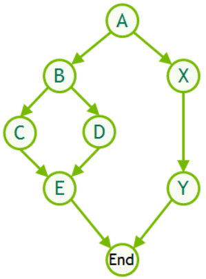
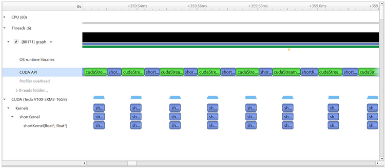
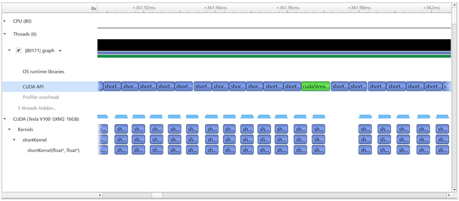

# [Getting Started with CUDA Graphs](https://developer.nvidia.com/blog/cuda-graphs/)

GPU 架构的性能在每一代新产品中持续提升。现代 GPU 速度极快，在许多重要的应用场景中，每个 GPU 操作（例如 kernel 或内存拷贝）所需的时间现在以微秒计。然而，与向 GPU 提交每个操作相关的开销——同样是微秒级的——现在在越来越多的情况下变得十分显著。

实际应用会执行大量的 GPU 操作：一个典型的模式涉及多次迭代（或时间步），每个步骤中包含多个操作。例如，分子系统的模拟会迭代许多时间步，在每个时间步中，根据其他分子施加的力来更新每个分子的位置。为了使模拟技术能够准确地建模自然，通常每个时间步需要对应多个 GPU 操作的多个算法阶段。如果这些操作中的每一个都单独启动到 GPU 并快速完成，那么这些开销可能会累积，从而导致整体性能显著下降。

CUDA Graphs 的设计宗旨是允许将工作定义为图而非单个操作。它们通过提供一种机制，可以通过一个 CPU 操作启动多个 GPU 操作，从而减少开销，解决了上述问题。在本文中，我们将通过展示如何改进一个非常简单的示例，来演示如何开始使用 CUDA Graphs。



## The Example

考虑这样一种情况：在每个时间步中，我们有一系列短小的 GPU kernel：


```
Loop over timesteps
    ...
    shortKernel1
    shortKernel2
    ...
    shortKernelN
    ...
```

我们将创建一个简单的代码来模仿这种模式。然后，我们将使用它来演示标准启动机制所涉及的开销，并展示如何引入一个包含多个 kernel 的 CUDA Graph，该 Graph 可以通过一个单一的操作从应用程序中启动。

首先，我们编写一个计算 kernel 如下：

```c++
#define N 500000 // 调整此值使 kernel 执行时间为几微秒

__global__ void shortKernel(float * out_d, float * in_d){
  int idx=blockIdx.x*blockDim.x+threadIdx.x;
  if(idx<N) out_d[idx]=1.23*in_d[idx];
}
```

这个 kernel 仅仅从内存中读取一个浮点数数组，将每个元素乘以一个常数因子，然后将输出数组写回内存。这个 kernel 的执行时间取决于数组的大小，我们将 `N` 设置为 500,000 个元素，以便 kernel 执行时间为几微秒。我们可以使用性能分析器测得其执行时间为 2.9μs，这是在 NVIDIA Tesla V100 GPU 上使用 CUDA 10.1（并将每个 block 的线程数设置为 512）运行时测得的。在本文的剩余部分，我们将保持这个 kernel 不变，只改变调用它的方式。

## First Implementation with Multiple Launches

我们可以使用上面的 kernel 来模拟模拟时间步中的每个短小 kernel，如下所示：

```c++
#define NSTEP 1000
#define NKERNEL 20

// start CPU wallclock timer
for(int istep=0; istep<NSTEP; istep++){
  for(int ikrnl=0; ikrnl<NKERNEL; ikrnl++){
    shortKernel<<<blocks, threads, 0, stream>>>(out_d, in_d);
    cudaStreamSynchronize(stream);
  }
}
//end CPU wallclock time
```

上面的代码片段调用 kernel 20 次，共迭代 1000 次。我们可以使用基于 CPU 的挂钟计时器来测量整个操作所需的时间，并将其除以 NSTEP*NKERNEL，得到每次 kernel 调用（包括开销）的时间为 9.6μs：这远高于 kernel 本身的执行时间 2.9μs。

注意每次 kernel 启动后都存在 `cudaStreamSynchronize` 调用，这意味着直到前一个 kernel 完成，后续的 kernel 才会被启动。这意味着与每次启动相关的任何开销都会完全暴露出来：总时间将是 kernel 执行时间加上所有开销的总和。我们可以使用 Nsight Systems 性能分析器直观地看到这一点：



这显示了时间轴的一部分 (时间从左向右增加)，其中包括 8 个连续的 kernel 启动。理想情况下，GPU 应该保持忙碌，空闲时间最少，但这里并非如此。每次 kernel 执行都显示在图像底部“CUDA (Tesla V100-SXM2-16G)”部分。可以看出，每次 kernel 执行之间存在很大的间隔，在此期间 GPU 是空闲的。

通过查看“CUDA API”行，我们可以获得更多洞察，该行显示了从 CPU 角度看与 GPU 相关的活动。此行中的紫色条目对应于 CPU 线程在启动 kernel 的 CUDA API 函数中花费的时间，绿色条目是在与 GPU 同步的 CUDA API 函数中花费的时间，即等待 kernel 在 GPU 上完全启动和完成的时间。因此，kernel 之间的间隔可以归因于 CPU 和 GPU 启动开销的结合。

请注意，在这种时间尺度下（我们正在检查非常短的事件），性能分析器会增加一些额外的启动开销，因此为了准确分析性能，应使用基于 CPU 的挂钟计时器（正如我们在本文中始终所做的那样）。尽管如此，性能分析器在提供代码行为的直观概述方面仍然有效。

## Overlapping Kernel Launch and Execution

我们可以对上面的代码进行一个简单但非常有效的改进，将同步操作移到最内层循环的外面，使得它只在每个时间步结束后才发生，而不是在每次 kernel 启动后都发生：

```c++
// start wallclock timer
for(int istep=0; istep<NSTEP; istep++){
  for(int ikrnl=0; ikrnl<NKERNEL; ikrnl++){
    shortKernel<<<blocks, threads, 0, stream>>>(out_d, in_d);
  }
  cudaStreamSynchronize(stream);
}
//end wallclock timer
```

Kernels 仍然会按顺序执行（因为它们在同一个 stream 中），但这个改变允许在一个 kernel 完成之前启动下一个 kernel，从而使得启动开销可以隐藏在 kernel 执行时间之后。当我们这样做时，测量得到每次 kernel 调用（包括开销）的时间为 3.8μs（而 kernel 执行时间为 2.9μs）。这已经有了实质性的改进，但仍然存在与多次启动相关的开销。

性能分析器现在显示：



可以看出来，我们已经移除了绿色的同步 API 调用，除了时间步结束时的那一个。在每个时间步内，可以看到启动开销现在可以与 kernel 执行重叠，并且连续 kernel 之间的间隔已经减少。但是，我们仍然为每个 kernel 执行单独的启动操作，每个 kernel 都不知道其他 kernel 的存在。

## CUDA Graph Implementation

我们可以通过使用 CUDA Graph 来进一步提升性能，它允许通过一个单一的操作启动每次迭代中的所有 kernel。

我们引入一个 graph 如下：

```c++
bool graphCreated=false;
cudaGraph_t graph;
cudaGraphExec_t instance;
for(int istep=0; istep<NSTEP; istep++){
  if(!graphCreated){
    cudaStreamBeginCapture(stream, cudaStreamCaptureModeGlobal);
    for(int ikrnl=0; ikrnl<NKERNEL; ikrnl++){
      shortKernel<<<blocks, threads, 0, stream>>>(out_d, in_d);
    }
    cudaStreamEndCapture(stream, &graph);
    cudaGraphInstantiate(&instance, graph, NULL, NULL, 0);
    graphCreated=true;
  }
  cudaGraphLaunch(instance, stream);
  cudaStreamSynchronize(stream);
}
```

新插入的代码通过使用 CUDA Graph 实现了执行。我们引入了两个新对象：类型为 `cudaGraph_t` 的 `graph`，它包含定义图的结构和内容的信息；以及类型为 `cudaGraphExec_t` 的 `instance`，它是一个“可执行图”：图的一种表示形式，可以以类似于单个 kernel 的方式启动和执行。

因此，首先我们必须定义图，我们通过**捕获**在 `cudaStreamBeginCapture` 和 `cudaStreamEndCapture` 调用之间提交到 stream 的 GPU 活动信息来完成此操作。然后，我们必须通过 `cudaGraphInstantiate` 调用**实例化**图，这会创建并预初始化所有 kernel 工作描述符，以便它们可以尽可能快地重复启动。然后可以通过 `cudaGraphLaunch` 调用提交生成的实例以供执行。

至关重要的是，捕获和实例化只需进行**一次**（在第一个时间步），并在所有后续时间步中重用同一个实例（这里由 `graphCreated` 布尔值控制的条件语句控制）。

因此，我们现在有以下流程：

- 第一步： 
  - 创建并实例化图 
  - 启动图（包含 20 个 kernel） 
  - 等待图完成
- 对于剩余的 999 个步骤中的每一个： 
  - 启动图（包含 20 个 kernel） 
  - 等待图完成

测量完成此整个过程所需的时间，并将其除以 1000×20 以得到每个 kernel 的有效时间（包括开销），结果为 3.4μs（而 kernel 执行时间为 2.9μs），因此我们成功地进一步减少了开销。请注意，在这种情况下，创建和实例化图的时间相对较长，约为 400μs，但这只执行一次，因此它对我们每个 kernel 的成本仅贡献约 0.02μs。类似地，第一次图启动比所有后续启动慢约 33%，但在多次重用同一个图时，这一点变得微不足道。初始化开销的严重程度显然取决于具体问题：通常为了从图中受益，你需要充分重用同一个图。许多现实世界的问题涉及大量的重复，因此适合使用图。

剩余的开销是由于在 GPU 上启动每个图所需的必要步骤，我们期望随着未来 CUDA 的改进进一步减少这些开销。我们有意不在这里展示任何性能分析结果，因为我们仍在努力解决 CUDA Graph 与性能分析工具的兼容性问题。在使用当前的 CUDA 版本时，性能分析结果看起来会类似于“重叠 Kernel 启动和执行”中所示的图，只不过在 CUDA API 行中，每组 20 个 kernel 执行只会有一个“cudaGraphLaunch”条目，并且在最开始的 CUDA API 行中会有额外的条目对应于图的创建和实例化。这 20 个 kernel 中的每一个仍然会显示为单独的条目，但为了提供这样的视图，分析器目前会禁用一些与图相关的优化。更准确的分析将不会禁用任何优化，并将每组 20 个 kernel 通过显示单个图条目来表示。

## Further Information

很高兴看到即使在上述非常简单的示例中（其中大部分开销已经通过重叠的 kernel 启动和执行得到了隐藏），CUDA Graphs 仍然展现出优势，但当然，更复杂的情况提供了更多的节省机会。Graphs 支持多个相互作用的 stream，不仅包括 kernel 执行，还包括内存拷贝和在主机 CPU 上执行的函数，如 CUDA 示例中的 [simpleCUDAGraphs](https://docs.nvidia.com/cuda/cuda-samples/index.html#simple-cuda-graphs) 示例更深入地演示的那样。

本文中的示例使用了 stream capture 机制来定义图，但也可以通过新提供的 API 调用显式定义节点和依赖关系——[simpleCUDAGraphs](https://docs.nvidia.com/cuda/cuda-samples/index.html#simple-cuda-graphs) 示例展示了如何使用这两种技术来实现相同的问题。此外，graphs 还可以跨越多个 GPU。

在一个单独的图内实现多个活动，而不是单独处理每个活动，最终为 CUDA 提供了更多信息，从而提供了更多优化的机会。欲了解更多信息，请参考《Programming Guide》的 [CUDA Graphs](https://docs.nvidia.com/cuda/cuda-c-programming-guide/index.html#cuda-graphs) 部分并观看 GTC 2019 演讲记录 CUDA: New Features and Beyond。