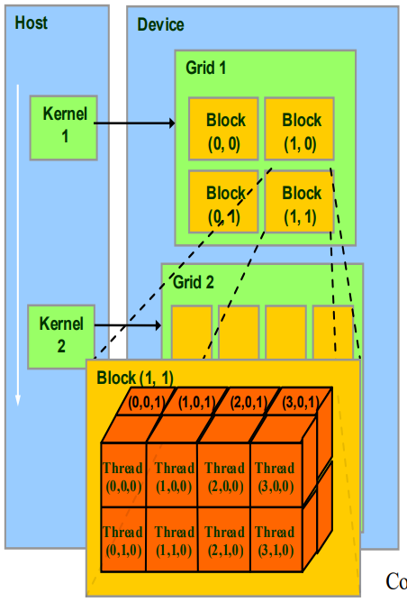

# 1. threadIdx.x，threadIdx.y，blockIdx.x，blockIdx.y，blockDim.x，blockDim.y，gridDim.x，gridDim.y 分别是什么

## 各参数含义

| 概念                | 含义                                                         | 类比（帮助理解）                                 |
| ------------------- | ------------------------------------------------------------ | ------------------------------------------------ |
| **Thread（线程）**  | CUDA 程序中最小的执行单元                                    | 像一个工人                                       |
| **Warp（线程束）**  | 32 个线程组成的一个“小队”，是 GPU 调度和执行的基本单位       | 像一个“班组”，32 个工人一起干活                  |
| **Block（线程块）** | 多个线程组成的“工作组”，同一个 block 内的线程可以共享内存、同步 | 像一个“车间”，同一个车间的人可以协作             |
| **Grid（网格）**    | 多个 block 组成的“大任务”，一个 kernel 对应一个 grid         | 像一个“工厂”，由多个车间组成，共同完成一个大任务 |

| 变量名        | 含义                                   | 范围                  | 示例          |
| ------------- | -------------------------------------- | --------------------- | ------------- |
| `threadIdx.x` | 当前线程在 block 中的 x 方向索引   | 0 到 `blockDim.x - 1` | [0,32)        |
| `threadIdx.y` | 当前线程在 block 中的 y 方向索引   | 0 到 `blockDim.y - 1` | [0,16)        |
| `threadIdx.z` | 当前线程在 block 中的 z 方向索引   | 0 到 `blockDim.z - 1` | [0,2)         |
| `blockIdx.x`  | 当前 block 在 grid 中的 x 方向索引 | 0 到 `gridDim.x - 1`  | [0,8)         |
| `blockIdx.y`  | 当前 block 在 grid 中的 y 方向索引 | 0 到 `gridDim.y - 1`  | [0,4)         |
| `blockIdx.z`  | 当前 block 在 grid 中的 z 方向索引 | 0 到 `gridDim.z - 1`  | [0,2)         |
| `blockDim.x`  | 每个 block 在 x 方向上的 线程总数  | 用户定义              | 32            |
| `blockDim.y`  | 每个 block 在 y 方向上的 线程总数  | 用户定义              | 16            |
| `blockDim.y`  | 每个 block 在 z 方向上的 线程总数  | 用户定义              | 2             |
| `gridDim.x`   | 整个 grid 在 x 方向上的 block 总数 | 用户定义8             | 8      |
| `gridDim.y`   | 整个 grid 在 y 方向上的 block 总数 | 用户定义              | 4      |
| `gridDim.z`   | 整个 grid 在 z 方向上的 block 总数 | 用户定义              | 2 |

### 根据示例值计算：

- **总 blocks 数**
  8 × 4 × 2 = **64 blocks**
- **每个 block 的线程数**
  32 × 16 × 2 = **1024 threads/block**
- **总线程数**
  64 blocks × 1024 threads/block = **65 536 threads**

## 图示

可以把 GPU 的线程组织理解成 **坐标系统**：

```mathematica
Grid (由多个 Block 组成)
┌─────────────────────────────┐
│ Block(0,0)   Block(1,0) ... │   ← blockIdx.y = 0
│ Block(0,1)   Block(1,1) ... │   ← blockIdx.y = 1
└─────────────────────────────┘
   ↑             ↑
 blockIdx.x=0   blockIdx.x=1
```

每个 **Block** 里又包含很多 **Thread**：

```mathematica
Block (blockIdx.x=1, blockIdx.y=0)
┌────────────────────────────────────┐
│ Thread(0,0)  Thread(1,0)  ...      │  ← threadIdx.y=0
│ Thread(0,1)  Thread(1,1)  ...      │  ← threadIdx.y=1
└────────────────────────────────────┘
   ↑              ↑
 threadIdx.x=0   threadIdx.x=1
```




## 全局线程 ID 计算公式

```c++
int global_x = blockIdx.x * blockDim.x + threadIdx.x;
int global_y = blockIdx.y * blockDim.y + threadIdx.y;
```


# 2. Halo区域 是什么

## 定义

Halo 区域（又叫 边界区 / 幽灵区 / 幽灵单元 Ghost Zone）指的是： 

- 在并行计算时，每个线程块处理一个 tile（局部区域）时，为了能正确计算边缘元素，需要在 tile 周围额外加载一圈/多圈数据。

## 为什么需要 Halo？

举个例子：假设我们做图像卷积（blur、sobel 等），卷积核大小是 `3×3`。

- 每个线程块处理一块 tile，例如 `32×32`。
- 但是为了计算边缘像素（例如 `(0,0)`），它需要访问相邻像素（例如 `(-1,0)`、`(0,-1)`）。
- 这些邻居像素在当前 tile 外面，所以必须加载一圈额外的数据。

这个额外的数据就是 Halo 区域。

## 图示

假设：

- block 要处理的 tile 大小 = `4×4`（红色区域）
- 卷积核大小 = `3×3`，需要外圈一层 Halo

```mathematica
    +---+---+---+---+---+---+
    | H | H | H | H | H | H |   ← Halo
    +---+---+---+---+---+---+
    | H | 0 | 1 | 2 | 3 | H |
    +---+---+---+---+---+---+
    | H | 4 | 5 | 6 | 7 | H |
    +---+---+---+---+---+---+
    | H | 8 | 9 |10 |11 | H |
    +---+---+---+---+---+---+
    | H |12 |13 |14 |15 | H |
    +---+---+---+---+---+---+
    | H | H | H | H | H | H |
    +---+---+---+---+---+---+
```

- 数字：tile 内的有效数据（真正要计算的部分）
- `H`：Halo 区域（需要多加载的邻居）

这样每个线程块在共享内存里保存的不仅是 `4×4` 的 tile，而是 `(4+2)×(4+2)` 的大区域。

