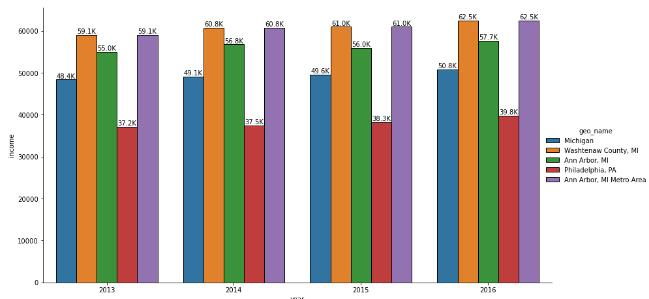
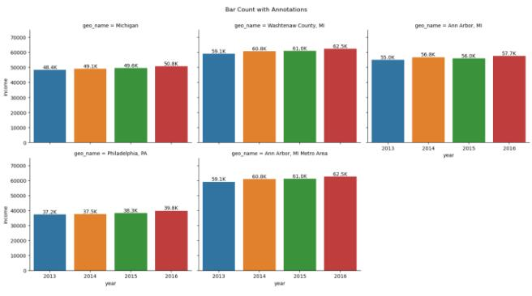
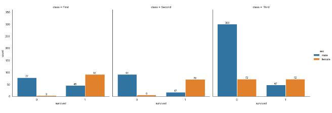

# 柱状图

## 柱状图上添加数值

https://stackoverflow.com/a/67594395

### 单图

<details><summary><em>[点击展开]</em></summary>
<br>


```python
g = sns.catplot(data=df, x='year', y='income', kind='bar', hue='geo_name', legend=True, height=6, aspect=2)

# extract the matplotlib axes_subplot objects from the FacetGrid
ax = g.facet_axis(0, 0)  # or ax = g.axes.flat[0]

# iterate through the axes containers
for c in ax.containers:
    labels = [f'{(v.get_height() / 1000):.1f}K' for v in c]
    ax.bar_label(c, labels=labels, label_type='edge')
```



</details>

### 多图

<details><summary><em>[点击展开]</em></summary>
<br>


```python
g = sns.catplot(data=df, x='year', y='income', kind='bar', col='geo_name', col_wrap=3)

g.fig.subplots_adjust(top=0.9)
g.fig.suptitle('Bar Count with Annotations')

# iterate through axes
for ax in g.axes.ravel():
    
    # add annotations
    for c in ax.containers:
        labels = [f'{(v.get_height() / 1000):.1f}K' for v in c]
        ax.bar_label(c, labels=labels, label_type='edge')
    ax.margins(y=0.2)

plt.show()
```



</details>

### 分组

<details><summary><em>[点击展开]</em></summary>
<br>


```python
df = sns.load_dataset('titanic')
g = sns.catplot(data=df, kind='count', x='survived', hue='sex', col='class')

# iterate through axes
for ax in g.axes.ravel():
    
    # add annotations
    for c in ax.containers:
        # add custom labels with the labels=labels parameter if needed
        # labels = [f'{h}' if (h := v.get_height()) > 0 else '' for v in c]
        ax.bar_label(c, label_type='edge')
    ax.margins(y=0.2)
```



</details>