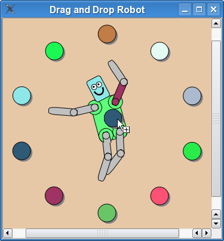

# [Drag and Drop Robot Example](https://doc.qt.io/qt-6/qtwidgets-graphicsview-dragdroprobot-example.html)

演示如何在 Graphics View 拖放 items。

拖放机器人示例展示了如何在 `QGraphicsItem` 子类中实现拖放，以及如何使用 Qt 的[动画框架](https://doc.qt.io/qt-6/animation.html)把 items 制成动画。



Graphics View 提供了 `QGraphicsScene` 类来管理大量派生自 `QGraphicsItem` 类的自定义的 2D 图形 items 并与之交互，还提供了一个用于可视化 items 的 `QGraphicsView` 控件，支持缩放和旋转。

这里例子由一个 `Robot` 类、一个 `ColorItem` 类和一个主函数组成：`Robot` 类描述了一个由多个 `RobotPart` 派生的肢体（包括 `RobotHead` 和 `RobotLimb`）组成的简单机器人，`ColorItem` 类提供了一个可拖动的彩色椭圆，`main()` 函数提供主程序窗口。

我们首先审查这个 `Robot` 类，看看如何组装不同部分，以便它们可以使用 `QPropertyAnimation` 独立地旋转和被制成动画，然后我们将审查 `ColorItem` 类来演示如何实现在项目之间拖放。最后，我们将审查 `main()` 函数来了解如何将所有部分组合在一起，形成最终的应用。

## Robot Class Definition

机器人由三个主要的类组成：`RobotHead`、`RobotTorso` 和用于 upper/lower 臂和腿的 `RobotLimb`。都派生自 `RobotPart` 类，该类又派生自 `QGraphicsObject`。`Robot` 类本身没有可视的外观，而仅用作机器人的根节点。

**注意：upper 指靠近躯干的那一节**

让我们从 `RobotPart` 类定义开始。

```c++
class RobotPart : public QGraphicsObject
{
public:
    RobotPart(QGraphicsItem *parent = nullptr);

protected:
    void dragEnterEvent(QGraphicsSceneDragDropEvent *event) override;
    void dragLeaveEvent(QGraphicsSceneDragDropEvent *event) override;
    void dropEvent(QGraphicsSceneDragDropEvent *event) override;

    QColor color = Qt::lightGray;
    bool dragOver = false;
};
```

这个基类继承了 `QGraphicsObject`。`QGraphicsObject` 通过继承 `QObject` 提供信号和槽，它还使用 `Q_PROPERTY` 声明 `QGraphicsItem` 的属性，这使得 `QPropertyAnimation` 可以访问这些属性。

`color` 连同 `dragOver` 被存储为成员变量，我们稍后将使用它们来直观地表示肢体可以接受被拖到它上面的颜色。

```c++
RobotPart::RobotPart(QGraphicsItem *parent)
    : QGraphicsObject(parent), color(Qt::lightGray)
{
    setAcceptDrops(true);
}
```

`RobotPart` 的构造函数初始化成员 `dragOver` 并将 `color` 设置为 `Qt::lightGray`。在构造函数体中，我们通过调用 `setAcceptDrops(true)` 启用对放置事件的支持。

此类实现的剩余部分是支持拖放。

```c++
void RobotPart::dragEnterEvent(QGraphicsSceneDragDropEvent *event)
{
    if (event->mimeData()->hasColor()) {
        event->setAccepted(true);
        dragOver = true;
        update();
    } else {
        event->setAccepted(false);
    }
}
```

当一个拖放元素被拖入机器人部件区域时，将调用 `dragEnterEvent()` 处理程序。

处理程序的实现决定此 item 作为一个整体是否可以接受与传入的拖动对象相关联的 mime (一种数据类型) 数据。 `RobotPart` 为所有接受颜色放置的部分提供基本行为。因此，如果传入的拖动对象包含颜色，则事件被接受，我们将 `dragOver` 设置为 `true` 并调用 `update()` 来向用户提供积极的视觉反馈；否则事件将被忽略，转而将事件传播给父元素。

```c++
void RobotPart::dragLeaveEvent(QGraphicsSceneDragDropEvent *event)
{
    Q_UNUSED(event);
    dragOver = false;
    update();
}
```

当拖放元素被拖离机器人部件区域时，将调用 `dropLeaveEvent()` 处理程序。我们的实现只是将 `dragOver` 重置为 `false` 并帮助提供拖动已经离开该 item 的事件反馈。

```c++
void RobotPart::dropEvent(QGraphicsSceneDragDropEvent *event)
{
    dragOver = false;
    if (event->mimeData()->hasColor())
        color = qvariant_cast<QColor>(event->mimeData()->colorData());
    update();
}
```

`dropEvent()`  处理程序在将拖放元素放到一个 item 上时调用（即，在拖动同时鼠标按键在 item 上释放的时候）。

我们重置 `dragOver` 为 `false`，指定 item 的新颜色，并调用 `update()`。

`RobotHead`、`RobotTorso` 和 `RobotLimb` 的声明和实现实际上是相同的。我们将仔细审查 `RobotHead`，因为这个类有一点点不同，并将其他的类留给读者作为练习。

```c++
class RobotHead : public RobotPart
{
public:
    RobotHead(QGraphicsItem *parent = nullptr);

    QRectF boundingRect() const override;
    void paint(QPainter *painter, const QStyleOptionGraphicsItem *option, QWidget *widget = nullptr) override;

protected:
    void dragEnterEvent(QGraphicsSceneDragDropEvent *event) override;
    void dropEvent(QGraphicsSceneDragDropEvent *event) override;

private:
    QPixmap pixmap;
};
```

`RobotHead` 类继承了 `RobotPart` 并提供了 `boundingRect()` 和 `paint()` 的必要实现。它也重新实现 `dragEnterEvent()` 和 `dropEvent()` 来提供图形拖放的特殊处理。

该类包含一个私有成员 `pixmap`，我们可以用它来实现接受图像放置的支持。

```c++
RobotHead::RobotHead(QGraphicsItem *parent)
    : RobotPart(parent)
{
}
```

`RobotHead` 有一个相当简单的构造函数，仅仅是转发给 `RobotPart` 的构造函数。

```c++
QRectF RobotHead::boundingRect() const
{
	return QRectF(-15, -15, 30, 50);
}
```

重新实现的 `boundingRect()` 返回头部的范围。因为我们希望旋转中心是 item 的底部中心，所以我们选择一个从 (-15, -50) 开始并延伸 30 个单位宽和 50 个单位高的边界矩形。当旋转头部时，“颈部”将保持静止，而头的顶部会左右倾斜。

```c++
void RobotHead::paint(QPainter *painter,
           const QStyleOptionGraphicsItem *option, QWidget *widget)
{
    Q_UNUSED(option);
    Q_UNUSED(widget);
    if (pixmap.isNull()) {
        painter->setBrush(dragOver ? color.lighter(130) : color);
        painter->drawRoundedRect(-10, -30, 20, 30, 25, 25, Qt::RelativeSize);
        painter->setBrush(Qt::white);
        painter->drawEllipse(-7, -3 - 20, 7, 7);
        painter->drawEllipse(0, -3 - 20, 7, 7);
        painter->setBrush(Qt::black);
        painter->drawEllipse(-5, -1 - 20, 2, 2);
        painter->drawEllipse(2, -1 - 20, 2, 2);
        painter->setPen(QPen(Qt::black, 2));
        painter->setBrush(Qt::NoBrush);
        painter->drawArc(-6, -2 - 20, 12, 15, 190 * 16, 160 * 16);
    } else {
        painter->scale(.2272, .2824);
        painter->drawPixmap(QPointF(-15 * 4.4, -50 * 3.54), pixmap);
    }
}
```

在 `paint()` 中我们绘制了实际的头部。实现分为两部分：如果一个图像已经落到头部，我们绘制图像，否则我们绘制一个带有简单矢量图形的圆角矩形机器人头部。

出于性能原因，根据绘制内容的复杂性，将头部绘制为图形通常比使用一系列矢量操作更快。

```c++
void RobotHead::dragEnterEvent(QGraphicsSceneDragDropEvent *event)
{
    if (event->mimeData()->hasImage()) {
        event->setAccepted(true);
        dragOver = true;
        update();
    } else {
        RobotPart::dragEnterEvent(event);
    }
}
```

机器人头部可接受图像放置。为了支持这一点，它重新实现的 `dragEnterEvent()` 检查拖动对象是否包含图像数据，如果包含，则接受该事件。否则我们回退到基类 `RobotPart` 的实现。

```c++
void RobotHead::dropEvent(QGraphicsSceneDragDropEvent *event)
{
    if (event->mimeData()->hasImage()) {
        dragOver = false;
        pixmap = qvariant_cast<QPixmap>(event->mimeData()->imageData());
        update();
    } else {
        RobotPart::dropEvent(event);
    }
}
```

要完成图像的支持，我们还必须实现 `dropEvent()`。我们检查拖动对象是否包含图像数据，如果包含，我们将此数据存储为成员 `pixmap` 并调用 `update()`。`pixmap` 在我们之前查看的 `paint()` 实现中被使用。

`RobotTorso` 和 `RobotLimb` 类似于 `RobotHead`，所以我们直接跳到 `Robot` 类。

```c++
class Robot : public RobotPart
{
public:
    Robot(QGraphicsItem *parent = nullptr);

    QRectF boundingRect() const override;
    void paint(QPainter *painter, const QStyleOptionGraphicsItem *option, QWidget *widget = nullptr) override;
};
```

`Robot` 类也继承 `RobotPart`，并像其他部分一样，它也实现了 `boundingRect()` 和 `paint()`。不过，它提供了一个相当特殊的实现：

```c++
QRectF Robot::boundingRect() const
{
    return QRectF();
}

void Robot::paint(QPainter *painter,
                  const QStyleOptionGraphicsItem *option, QWidget *widget)
{
    Q_UNUSED(painter);
    Q_UNUSED(option);
    Q_UNUSED(widget);
}
```

因为 `Robot` 类仅用作机器人其余部分的基本节点，所以它没有可视化表现形式。它的 `boundingRect()` 因此可以返回一个空的 `QRectF`，而它的 `paint()` 函数什么都不做。

```c++
Robot::Robot(QGraphicsItem *parent)
    : RobotPart(parent)
{
    setFlag(ItemHasNoContents);

    QGraphicsObject *torsoItem = new RobotTorso(this);
    QGraphicsObject *headItem = new RobotHead(torsoItem);
    QGraphicsObject *upperLeftArmItem = new RobotLimb(torsoItem);
    QGraphicsObject *lowerLeftArmItem = new RobotLimb(upperLeftArmItem);
    QGraphicsObject *upperRightArmItem = new RobotLimb(torsoItem);
    QGraphicsObject *lowerRightArmItem = new RobotLimb(upperRightArmItem);
    QGraphicsObject *upperRightLegItem = new RobotLimb(torsoItem);
    QGraphicsObject *lowerRightLegItem = new RobotLimb(upperRightLegItem);
    QGraphicsObject *upperLeftLegItem = new RobotLimb(torsoItem);
    QGraphicsObject *lowerLeftLegItem = new RobotLimb(upperLeftLegItem);
```

构造函数首先设置标志 `ItemHasNoContents`，这是对没有视觉外观的 items 的小优化。

然后我们构建所有机器人部件（头部、upper/lower 臂和腿）。堆叠的顺序很重要，我们使用父子层级结构来确保元素正确地旋转和移动。我们首先构建躯干，因为这是根元素。然后我们构建头部，并将躯干传递给 `HeadItem` 的构造函数。这会使得头部成为躯干的子 item：如果你旋转躯干，头部也会跟着旋转。其余的四肢也采用相同的模式。

```c++
    headItem->setPos(0, -18);
    upperLeftArmItem->setPos(-15, -10);
    lowerLeftArmItem->setPos(30, 0);
    upperRightArmItem->setPos(15, -10);
    lowerRightArmItem->setPos(30, 0);
    upperRightLegItem->setPos(10, 32);
    lowerRightLegItem->setPos(30, 0);
    upperLeftLegItem->setPos(-10, 32);
    lowerLeftLegItem->setPos(30, 0);
```

每个机器人部件都是精确放置的。例如，左 upper 臂被精确地移动到躯干的左上区域，右 upper 臂被移动到右上区域。

```c++
    QParallelAnimationGroup *animation = new QParallelAnimationGroup(this);

    QPropertyAnimation *headAnimation = new QPropertyAnimation(headItem, "rotation");
    headAnimation->setStartValue(20);
    headAnimation->setEndValue(-20);
    QPropertyAnimation *headScaleAnimation = new QPropertyAnimation(headItem, "scale");
    headScaleAnimation->setEndValue(1.1);
    animation->addAnimation(headAnimation);
    animation->addAnimation(headScaleAnimation);
```

下一节创建所有的动画对象。此片段展示了对头部缩放和旋转的两个动画。两个 `QPropertyAnimation` 实例只是设置对象、属性和各自的起始值和结束值。

所有的动画都由一个顶层的并行动画组控制。缩放和旋转动画被添加到该组。

其余的动画以类似的方式定义。

```c++
    for (int i = 0; i < animation->animationCount(); ++i) {
        QPropertyAnimation *anim = qobject_cast<QPropertyAnimation *>(animation->animationAt(i));
        anim->setEasingCurve(QEasingCurve::SineCurve);
        anim->setDuration(2000);
    }

    animation->setLoopCount(-1);
    animation->start();
```

最后我们为每个动画设置缓动曲线和持续时间，确保顶层动画组永远循环，并启动顶层动画。

## ColorItem Class Definition

`ColorItem` 类表示了一个可以按下以将颜色拖到机器人部件上的圆形 item。

```c++
class ColorItem : public QGraphicsItem
{
public:
    ColorItem();

    QRectF boundingRect() const override;
    void paint(QPainter *painter, const QStyleOptionGraphicsItem *option, QWidget *widget) override;

protected:
    void mousePressEvent(QGraphicsSceneMouseEvent *event) override;
    void mouseMoveEvent(QGraphicsSceneMouseEvent *event) override;
    void mouseReleaseEvent(QGraphicsSceneMouseEvent *event) override;

private:
    QColor color;
};
```

这个类非常简单。它不使用动画，不需要属性，也不需要信号和槽，所以为了节省资源，它继承 `QGraphicsItem` 是最自然的（而不是 `QGraphicsObject`）。

让我们来看看它的实现。

```c++
ColorItem::ColorItem()
    : color(QRandomGenerator::global()->bounded(256), QRandomGenerator::global()->bounded(256), QRandomGenerator::global()->bounded(256))
{
    setToolTip(QString("QColor(%1, %2, %3)\n%4")
              .arg(color.red()).arg(color.green()).arg(color.blue())
              .arg("Click and drag this color onto the robot!"));
    setCursor(Qt::OpenHandCursor);
    setAcceptedMouseButtons(Qt::LeftButton);
}
```

`ColorItem` 的构造函数通过使用 `QRandomGenerator` 为其成员 `color` 分配不透明的随机颜色。为了提高可用性，它指定了一个工具提示，为用户提供有用的提示，并且还设置了一个合适的光标。这确保当鼠标指针悬停在 item 上时，光标正好变成 `Qt::OpenHandCursor`。

最后，我们调用 `setAcceptedMouseButtons()` 来确保此 item 只能处理 `Qt::LeftButton`。这极大地简化了鼠标事件处理程序，因为我们总是可以假设只有鼠标左键被按下和释放。

```c++
QRectF ColorItem::boundingRect() const
{
    return QRectF(-15.5, -15.5, 34, 34);
}
```

Item 的边界矩形是一个以 item 原点为中心的固定的 30x30 个单位，并在所有方向上调整 0.5 个单位，以允许一个可缩放的笔来绘制它的轮廓。为了最后的视觉效果，边界还向下和向右补偿了几个单位，为简单的阴影腾出空间。

```c++
void ColorItem::paint(QPainter *painter, const QStyleOptionGraphicsItem *option, QWidget *widget)
{
    Q_UNUSED(option);
    Q_UNUSED(widget);
    painter->setPen(Qt::NoPen);
    painter->setBrush(Qt::darkGray);
    painter->drawEllipse(-12, -12, 30, 30);
    painter->setPen(QPen(Qt::black, 1));
    painter->setBrush(QBrush(color));
    painter->drawEllipse(-15, -15, 30, 30);
}
```

`paint()` 的实现绘制了一个椭圆，该椭圆具有 1 个单位黑色轮廓、纯色填充和深灰色阴影。

```c++
void ColorItem::mousePressEvent(QGraphicsSceneMouseEvent *)
{
    setCursor(Qt::ClosedHandCursor);
}
```

当你在 item 区域内按下鼠标时，`mousePressEvent()` 处理程序会被调用。我们的实现只是将光标设置为 `Qt::CloseHandCursor`。

```c++
void ColorItem::mouseReleaseEvent(QGraphicsSceneMouseEvent *)
{
    setCursor(Qt::OpenHandCursor);
}
```

当你在 item 区域内按下鼠标按键后释放鼠标按键时，`mouseReleaseEvent()` 处理程序会被调用。我们的实现将光标设置回 `Qt::OpenHandCurosr`。鼠标按下和释放事件处理程序一起为用户提供了有用的视觉反馈：当你将鼠标指针移动到一个 `CirleItem` 上时，光标会变成张开的手。按下 item 将显示一个闭合的手形光标。释放将再次恢复为张开的手形光标。

```c++
void ColorItem::mouseMoveEvent(QGraphicsSceneMouseEvent *event)
{
    if (QLineF(event->screenPos(), event->buttonDownScreenPos(Qt::LeftButton))
        .length() < QApplication::startDragDistance()) {
        return;
    }

    QDrag *drag = new QDrag(event->widget());
    QMimeData *mime = new QMimeData;
    drag->setMimeData(mime);
```

当你在 `ColorItem` 区域内按下鼠标按键后四处移动鼠标时，`mouseMoveEvent()` 处理程序会被调用。此实现为 `ColorItem` 提供了最重要的逻辑部分：启动和管理拖动的代码。

此实现首先检查鼠标是否被拖动得足够远以消除鼠标抖动噪音。我们只想在鼠标被拖动的距离超过应用程序的“开始拖动距离”时启用拖动。

继续，我们创建一个 `QDrag` 对象，将事件的控件（即 `QGraphicsView` 视口）传递给构造函数。Qt 会确保在正确的时间删除此对象。我们还创建了一个 `QMimeData` 实例，它可以包含我们的颜色或者图像数据，并将其赋给 `drag` 对象。

```c++
    static int n = 0;
    if (n++ > 2 && QRandomGenerator::global()->bounded(3) == 0) {
        QImage image(":/images/head.png");
        mime->setImageData(image);

        drag->setPixmap(QPixmap::fromImage(image).scaled(30, 40));
        drag->setHotSpot(QPoint(15, 30));
```

这个片段有一个有些随机的结果：偶尔，一个特殊的图像被赋给 `drag` 对象的 mime 数据。图像也被赋给 `drag` 对象的 `pixmap`。这将确保你可以看到图像在鼠标光标下作为像素图被拖动。

```c++
    } else {
        mime->setColorData(color);
        mime->setText(QString("#%1%2%3")
                      .arg(color.red(), 2, 16, QLatin1Char('0'))
                      .arg(color.green(), 2, 16, QLatin1Char('0'))
                      .arg(color.blue(), 2, 16, QLatin1Char('0')));

        QPixmap pixmap(34, 34);
        pixmap.fill(Qt::white);

        QPainter painter(&pixmap);
        painter.translate(15, 15);
        painter.setRenderHint(QPainter::Antialiasing);
        paint(&painter, nullptr, nullptr);
        painter.end();

        pixmap.setMask(pixmap.createHeuristicMask());

        drag->setPixmap(pixmap);
        drag->setHotSpot(QPoint(15, 20));
    }
```

否则，最常见的结果是，一种简单的颜色被赋给 `drag` 对象的 mime 数据。我们将此 `ColorItem` 渲染成一个新的像素图，以向用户提供颜色正在被“拖动”的视觉反馈。

```c++
    drag->exec();
    setCursor(Qt::OpenHandCursor);
}
```

最后我们执行拖动。`QDrag::exec()` 会重新进入事件循环，并且仅在拖动已经停止或者取消时退出。在任何情况下，我们都将光标重置为 `Qt::OpenHandCursor`。

## The main() Function

现在 `Robot` 和 `ColorItem` 类都完成了，我们可以将所有部分放在 `main()` 函数中。

```c++
int main(int argc, char **argv)
{
    QApplication app(argc, argv);
```

我们首先构造 `QApplication`，然后初始化随机数生成器。这样可以确保每次应用程序启动时颜色 items 都具有不同的颜色。

```c++
    QGraphicsScene scene(-200, -200, 400, 400);

    for (int i = 0; i < 10; ++i) {
        ColorItem *item = new ColorItem;
        item->setPos(::sin((i * 6.28) / 10.0) * 150,
                     ::cos((i * 6.28) / 10.0) * 150);

        scene.addItem(item);
    }

    Robot *robot = new Robot;
    robot->setTransform(QTransform::fromScale(1.2, 1.2), true);
    robot->setPos(0, -20);
    scene.addItem(robot);
```

我们构建了一个固定大小的场景，并创建了 10 个 `ColorItem` 实例排列成一个圆。每个 item 都被添加到场景中。

在这个圆的中心我们创建一个 `Robot` 实例。`robot` 被缩放并向上移动了几个单位。然后它被添加到场景中。

```c++
    GraphicsView view(&scene);
    view.setRenderHint(QPainter::Antialiasing);
    view.setViewportUpdateMode(QGraphicsView::BoundingRectViewportUpdate);
    view.setBackgroundBrush(QColor(230, 200, 167));
    view.setWindowTitle("Drag and Drop Robot");
    view.show();

    return app.exec();
}
```

最后我们创建一个 `QGraphicsView` 窗口，并将场景分配给它。

为了提供视觉质量，我们启用抗锯齿。我们还选择使用边界矩形更新来简化视觉更新处理。这个视图的有一个固定沙子颜色的背景和窗口标题。

然后我们展示视图。动画在进入事件循环后立即开始。


