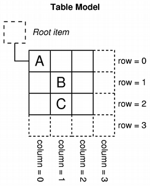
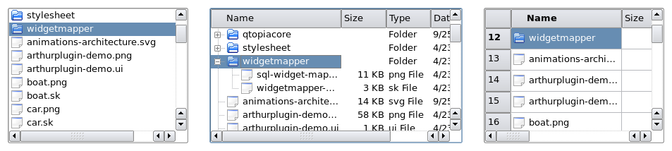
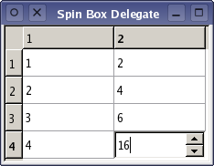

# [Model/View Programming](https://doc.qt.io/qt-6/model-view-programming.html)

## Introduction to Model/View Programming

Qt 包含一组使用模型/视图架构来管理数据与向用户呈现的方式之间关系的项目视图类。该架构引入的功能分离为开发人员提供了更大的灵活性来自定义项目的呈现方式，并提供了标准的模型接口，以允许广泛的数据源与现有项目视图一起使用。在本文档中，我们简要介绍了模型/视图范例，概述了涉及的概念，并描述了项目视图系统的架构。解释了架构中的每个组件，并给出了示例，展示如何使用提供的类。

## The model/view architecture

Model-View-Controller (MVC) 是一种源自 Smalltalk 的设计模式，通常用于构建用户界面。在《设计模式》一书中，Gamma 等人写道：

> MVC 由三种对象组成。模型是应用程序对象，视图是其屏幕表示形式，控制器定义了用户界面对用户输入的反应方式。在 MVC 之前，用户界面设计倾向于将这些对象合并在一起。 MVC 将它们解耦以增加灵活性和重用性。

如果将视图和控制器对象合并，则结果是模型/视图架构。这仍然将存储数据的方式与向用户呈现数据的方式分开，但提供了一个基于相同原则的更简单的框架。此分离使得可以在多个不同视图中显示相同的数据，并实现新类型的视图，而无需更改底层数据结构。为了允许灵活处理用户输入，我们引入了"委托"的概念。在此框架中具有委托的优点是它允许自定义渲染和编辑数据项的方式。


Model/View架构

模型与数据源通信，为架构中的其他组件提供接口。通信的性质取决于数据源的类型以及模型的实现方式。

视图从模型获取模型索引；这些是对数据项的引用。通过向模型提供模型索引，视图可以从数据源检索数据项。

在标准视图中，一个*委托*渲染数据项。当编辑项目时，委托使用模型索引直接与模型通信。

通常，模型/视图类可以分为上述三组：模型、视图和委托。每个组件都由抽象类定义，这些抽象类提供了公共接口，并在某些情况下提供了功能的默认实现。抽象类旨在被子类化，以提供其他组件所期望的完整功能集；这也允许编写专门的组件。

模型、视图和委托使用信号和槽彼此通信：

- 来自模型的信号通知视图有关数据源保存的数据更改的信息。
- 来自视图的信号提供有关用户与正在显示的项目交互的信息。
- 来自委托的信号在编辑期间用于告知模型和视图编辑器的状态。

### Models

所有 item models 都基于 `QAbstractItemModel` 类。该类定义了一个视图和委托访问数据的接口。数据本身不必存储在模型中；它可以保存在由单独的类、文件、数据库或其他应用程序组件提供的数据结构或存储库中。

有关模型的基本概念在 [Model Class](https://doc.qt.io/qt-6/model-view-programming.html#model-classes) 一节中介绍。

`QAbstractItemModel` 为数据提供了一个的接口，可以灵活处理以表格、列表和树形式表示数据的视图。但是，在为列表和类似表格的数据结构实现新模型时，`QAbstractListModel` 和 `QAbstractTableModel` 类是更好的起点，因为它们提供了常见函数的适当的默认实现。每个这些类都可以被子类化以提供支持特定类型列表和表格的模型。

有关子类化模型的过程在 [Creating New Models](https://doc.qt.io/qt-6/model-view-programming.html#creating-new-models) 一节中讨论。

Qt 提供了一些现成的模型，可用于处理数据项：

- `QStringListMode` 用于存储 `QString` 项的简单列表。
- `QStandardItemModel` 管理更复杂的项目树结构，每个项目都可以包含任意数据。
- `QFileSystemMode` 提供有关本地文件系统中文件和目录的信息。
- `QSqlQueryModel`、`QSqlTableModel` 和 `QSqlRelationalTableModel` 用于使用模型/视图约定访问数据库。

如果这些标准模型不符合您的要求，则可以子类化 `QAbstractItemModel`、`QAbstractListModel` 或 `QAbstractTableModel` 来创建自己的自定义模型。

### Views

Qt 为不同类型的视图提供了完整的实现：`QListView` 显示项目列表，`QTableView` 在表格中显示模型数据，`QTreeView` 以分层列表的形式显示模型数据项。这些类每个都基于 `QAbstractItemView` 抽象基类。虽然这些类是现成的实现，但它们也可以被子类化以提供自定义视图。

可用的视图在 [View Classes](https://doc.qt.io/qt-6/model-view-programming.html#view-classes) 一节中进行了详细介绍。

### Delegates

`QAbstractItemDelegate` 是模型/视图框架中委托的抽象基类。默认委托实现由 `QStyledItemDelegate` 提供，这是Qt标准视图使用的默认委托。但是，`QStyledItemDelegate` 和 `QItemDelegate` 是两个独立的方案，绘制视图中项目和提供编辑器。它们之间的区别在于，`QStyledItemDelegate` 使用当前样式来绘制其项目。因此，在实现自定义委托或使用Qt样式表时，我们建议使用 `QStyledItemDelegate` 作为基类。

有关委托的详细信息，请参见 [Delegate Classes](https://doc.qt.io/qt-6/model-view-programming.html#delegate-classes) 一节。

### Sorting

在模型/视图架构中有两种方法可以处理排序；选择哪种方法取决于您的底层模型。

如果您的模型是可排序的，即如果它重新实现了 `QAbstractItemModel::sort()` 函数，则 `QTableView` 和 `QTreeView` 都提供了一个API，允许您以编程方式对模型数据进行排序。此外，您还可以通过将 `QHeaderView::sortIndicatorChanged()` 信号连接到相应的 `QTableView::sortByColumn()` 槽或 `QTreeView::sortByColumn()` 槽来启用交互式排序（即允许用户通过单击视图标题来对数据进行排序）。

另一种方法是，如果您的模型没有所需的接口或者如果您想使用列表视图来呈现数据，则可以使用代理模型来转换模型结构，然后再在视图中呈现数据。这在 [Proxy Models](https://doc.qt.io/qt-6/model-view-programming.html#proxy-models) 一节中有详细介绍。

### Convenience Classes

为了使依赖于 Qt 的 item-based 的项目视图和表格类的应用程序受益，许多便利类都是从标准视图类派生而来的。它们不打算被子类化。

这些类的示例包括 `QListWidget`、`QTreeWidget` 和 `QTableWidget`。

这些类没有视图类灵活，不能与任意模型一起使用。我们建议您使用模型/视图方法来处理项目视图中的数据，除非您强烈需要一组 item-based 的类。

如果您希望利用模型/视图方法提供的功能，同时仍然使用一个 item-based 的接口，请考虑使用视图类，例如 `QListView`、`QTableView` 和 `QTreeView` 与 `QStandardItemModel` 一起使用。

## Using Models and Views

以下各节介绍了如何在 Qt 中使用模型/视图模式。每个部分都包括一个示例，后面跟着一个显示如何创建新组件的部分。

### Two models included in Qt

Qt 提供的两个标准模型是 `QStandardItemModel` 和 `QFileSystemModel`。`QStandardItemModel` 是一个多用途模型，可用于表示列表、表格和树视图所需的各种不同数据结构。该模型还保存数据项。`QFileSystemModel` 是一种维护目录内容信息的模型。因此，它本身不持有任何数据项，而只是表示在本地文件系统上文件和目录。

`QFileSystemModel` 提供了一个可供实验使用的现成模型，并且可以轻松配置以使用现有数据。使用此模型，我们可以展示如何建立一个模型来使用现成视图，并探索如何使用模型索引操作数据。

### Using views with an existing model

`QListView` 和 `QTreeView` 类是与 `QFileSystemModel` 是与 `QFileSystemModel` 一起使用的最合适的视图。下面介绍的示例在树视图中显示目录内容，并在列表视图中显示相同信息。这些视图共享用户的选择，以便在两个视图中都突出显示所选项目。


我们设置了一个 `QFileSystemModel`，并创建了一些视图来显示目录的内容。这显示了使用模型的最简单方法。模型的构建和使用是在单个 `main()` 函数中执行的：

```c++
int main(int argc, char *argv[])
{
    QApplication app(argc, argv);
    QSplitter *splitter = new QSplitter;

    QFileSystemModel *model = new QFileSystemModel;
    model->setRootPath(QDir::currentPath());
```

该模型设置为使用来自某个文件系统的数据。调用 `setRootPath()` 告诉模型向视图暴露文件系统上的哪个驱动器。

我们创建了两个视图，以便我们可以以两种不同的方式检查模型中保存的项目：

```c++
	QTreeView *tree = new QTreeView(splitter);
    tree->setModel(model);
    tree->setRootIndex(model->index(QDir::currentPath()));

    QListView *list = new QListView(splitter);
    list->setModel(model);
    list->setRootIndex(model->index(QDir::currentPath()));
```

视图的构造方式与其他小部件相同。设置视图以显示模型中的项目只用以目录模型作为参数调用其 `setModel()` 函数。我们通过在每个视图上调用 `setRootIndex()` 函数并传递文件系统模型对于当前目录的的模型索引来过滤模型提供的数据。

在这种情况下使用的 `index()` 函数是 `QFileSystemModel` 特有的；我们向其提供一个目录，它会返回一个模型索引。模型索引在 [Model Class](https://doc.qt.io/qt-6/model-view-programming.html#model-classes) 中讨论。

函数的剩余部分只是在分裂器小部件中显示视图，并运行应用程序的事件循环：

```c++
	splitter->setWindowTitle("Two views onto the same file system model");
    splitter->show();
    return app.exec();
}
```

在上述示例中，我们忽略了如何处理项目的选中。这个主题在关于 [Handling Selections in Item Views](https://doc.qt.io/qt-6/model-view-programming.html#handling-selections-in-item-views) 一节中有更详细的介绍。

## Model Classes

在研究如何处理选择之前，您可能会发现检查模型/视图框架中使用的概念很有用。

### Basic concepts

在模型/视图架构中，模型提供了视图和委托访问数据的标准接口。在 Qt 中，标准接口由 `QAbstractItemModel` 类定义。无论数据项如何存储在任何底层数据结构中，`QAbstractItemModel` 的所有子类都将数据表示为包含项目表的层级结构。视图使用这个约定来访问模型中的数据项，但是它们在向用户呈现这些信息的方式上没有限制。


模型还通过信号和槽机制通知任何附加的视图有关数据更改的信息。

本节描述了一些基本概念，这些概念对于其他组件通过模型类访问数据项的方式至关重要。更高级的概念在后面的章节中讨论。

#### Model indexes

为了确保数据的表示与访问方式分开，引入了模型索引的概念。可以通过模型获得的每个信息都由模型索引表示。视图和委托使用这些索引请求要显示的数据项。

因此，只有模型需要知道如何获取数据，并且由模型管理的数据类型可以相当普遍地定义。模型索引包含指向创建它们的模型的指针，这可以防止在使用多个模型时出现混淆。

```c++
QAbstractItemModel *model = index.model();
```

模型索引提供了对信息片段的临时引用，可以被用于通过模型检索或修改数据。由于模型可能会不时地重新组织其内部结构，因此模型索引可能会变得无效，不应存储。如果需要长期引用某个信息片段，则必须创建持久模型索引。这提供了对模型保持最新的信息的引用。`QModelIndex` 类提供临时模型索引，`QPersistentModelIndex` 类提供持久模型索引。

要获取与数据项对应的模型索引，必须向模型指定三个属性：行号、列号和父项的模型索引。以下各节详细描述和解释了这些属性。

#### Rows and columns

在其最基本的形式中，可以将模型访问为简单的表格，其中项目按其行和列编号定位。这并不意味着底层数据片段存储在数组结构中；行和列编号的使用只是一种约定，以允许组件彼此通信。我们可以通过将其行和列编号指定为模型来检索有关任何给定项目的信息，并收到表示该项目的索引：

在其最基本的形式中，可以将模型当作简单的表格进行访问，其中项目按其行和列编号定位。这并不意味着底层数据片段存储在数组结构中；行和列编号的使用只是一种约定，以允许组件彼此通信。我们可以通过向模型指定行和列来检索任何给定的项，并且我们会收到一个代表该项的索引：

```c++
QModelIndex index = model->index(row, column, ...);
```

为列表和表格等简单的、单层的数据结构提供接口的模型不需要提供任何其他信息，但正如上面代码所示，我们需要在获取模型索引时提供更多的信息。



该图显示了一个基本表格模型的表示，其中每个项目都由一对行号和列号定位。我们通过将相关的行号和列号传递给模型来获得引用数据项的模型索引。

```c++
QModelIndex indexA = model->index(0, 0, QModelIndex());
QModelIndex indexB = model->index(1, 1, QModelIndex());
QModelIndex indexC = model->index(2, 1, QModelIndex());
```

模型中的顶级项始终通过指定 `QModelIndex()` 为父项来引用。这将在下一节中讨论。

#### Parents of items

在表格或列表视图中使用数据时，模型为项目数据提供的类似于表格的接口是理想的；行号和列号系统完全映射到视图显示项目的方式。但是，树视图等结构要求模型向其中的项目暴露更灵活的接口。因此，每个项目也可以是另一个项目表的父项，这与树视图中的 top-level items 可以包含另一个项目列表的方式非常相似。

当请求模型项的索引时，我们必须提供有关项的父项的一些信息。在模型之外，引用项目的唯一方法是通过模型索引，因此还必须给出父模型索引：

```c++
QModelIndex index = model->index(row, column, parent);
```


该图显示了树模型的表示，其中每个项目都由父项、行号和列号引用。项目 "A" 和 "C" 表示为模型中的顶级的 siblings：

```c++
QModelIndex indexA = model->index(0, 0, QModelIndex());
QModelIndex indexC = model->index(2, 1, QModelIndex());
```

项目 "A" 有多个孩子。项目 "B" 的模型索引通过以下代码获取：

```c++
QModelIndex indexB = model->index(1, 0, indexA);
```

#### Item roles

模型中的项目可以为其他组件扮演各种*角色*，允许为不同情况提供不同类型的数据。例如， `Qt::DisplayRole` 用于访问可以在视图中显示为文本的字符串。通常，项目包含许多不同角色的数据，标准角色由 `Qt::ItemDataRole` 定义。

我们可以通过将项目对应的模型索引传递给模型来向模型查询项目的数据，并通过指定角色来获取我们想要的数据类型：

```c++
QVariant value = model->data(index, role);
```


该角色向模型指示所引用的数据类型。视图可以以不同的方式显示角色，因此为每个角色提供适当的信息很重要。[Creating New Models](https://doc.qt.io/qt-6/model-view-programming.html#creating-new-models) 部分更详细地介绍了角色的一些特定用途。

`Qt :: ItemDataRole` 中定义的标准角色涵盖了项目数据的大多数常见用途。通过为每个角色提供适当的项目数据，模型可以向视图和委托提供有关如何向用户呈现项目的提示。不同类型的视图可以自由地解释或忽略此信息。还可以定义用于特定于应用程序的目的的其他角色。

#### Summary

- 模型索引以独立于任何底层数据结构的方式向视图和委托提供模型提供的项目位置信息。
- 项目按其行和列编号以及其父项的模型索引来引用。
- 模型索引是由模型在其他组件（例如视图和委托）的请求下构建的。
- 如果在使用 `index()` 请求索引时为父项指定了有效的模型索引，则返回的索引指向该模型中该父项之下的项目。获得的索引指向该项的子项。
- 如果在使用 `index()` 请求索引时为父项指定了无效的模型索引，则返回的索引指向模型中的 top-level items。
- 角色区分与项目关联的不同类型数据。

### Using model indexes

为了演示如何使用模型索引从模型中检索数据，我们设置了一个没有视图的 `QFileSystemModel`，并在小部件中显示文件和目录的名称。尽管这不是使用模型的正常方式，但它演示了模型在处理模型索引时使用的约定。

`QFileSystemModel` 加载是异步的，以最大限度地减少系统资源的使用。在处理这个模型时，我们必须考虑到这一点。

我们通过以下方式构建文件系统模型：

```c++
	auto *model = new QFileSystemModel;

    auto onDirectoryLoaded = [model, layout, &window](const QString &directory) {
        QModelIndex parentIndex = model->index(directory);
        const int numRows = model->rowCount(parentIndex);
        for (int row = 0; row < numRows; ++row) {
            QModelIndex index = model->index(row, 0, parentIndex);

            QString text = model->data(index, Qt::DisplayRole).toString();
            // Display the text in a widget.
            auto *label = new QLabel(text, &window);
            layout->addWidget(label);
        }
    };

    QObject::connect(model, &QFileSystemModel::directoryLoaded, onDirectoryLoaded);
    model->setRootPath(QDir::currentPath());
```

在这个示例中，我们首先设置了一个默认的 `QFileSystemModel`。我们将其信号 `directoryLoaded(QString)` 连接到一个 `lambda` 中，在其中我们将使用该模型提供的特定实现的 `index()` 获取目录的父索引。

在 `lambda` 中，我们使用 `rowCount()` 函数确定模型中的行数。

为简单起见，我们只对模型中第一列中的项目感兴趣。我们依次检查每一行，为每一行中的第一个项目获取模型索引，并读取存储在该模型中的项目的数据。

```c++
	for (int row = 0; row < numRows; ++row) {
        QModelIndex index = model->index(row, 0, parentIndex);
```

为了获取模型索引，我们指定行号，列号（第一列为零）以及我们想要的所有项目的父项的模型索引。使用模型的 `data()` 函数检索存储在每个项目中的文本。我们指定模型索引和 `DisplayRole` 以获取以字符串形式表示的项目的数据。

```c++
		QString text = model->data(index, Qt::DisplayRole).toString();

	}
```

最后，我们设置 `QFileSystemModel` 的根路径，以便它开始加载数据并触发 `lambda`。

上面的示例演示了从模型中检索数据所使用的基本原则：

- 可以使用 `rowCount()` 和 `columnCount()`找到模型的维度。这些函数通常需要指定父模型索引。
- 模型索引用于访问模型中的项目。需要行、列和父模型索引来指定项目。
- 要访问模型中的 top-level items，请使用 `QModelIndex()` 将空模型索引指定为父索引。
- 项目包含不同角色的数据。要获取特定角色的数据，必须向模型提供模型索引和角色。

### Futher reading

可以通过实现 `QAbstractItemModel` 提供的标准接口来创建新模型。在 [Creating New Models](https://doc.qt.io/qt-6/model-view-programming.html#creating-new-models) 部分中，我们通过创建一个方便的可用于保存字符串列表的消除的模型来演示这一点。

## View Classes

### Concepts

在模型/视图架构中，视图从模型中获取数据项并将其呈现给用户。呈现数据的方式不必类似于模型提供的数据的表示形式，并且可以与存储数据项的底层数据结构完全不同。

通过使用 `QAbstractItemModel` 提供的标准模型接口、`QAbstractItemView` 提供的标准视图接口以及表示通用数据项的模型索引来实现内容和表示的分离。视图通常管理从模型获取的数据的整体布局。它们可以自己渲染单个数据项，也可以使用委托来处理渲染和编辑功能。

除了呈现数据外，视图还处理项目之间的导航以及项目选择的某些方面。视图还实现基本用户界面功能，例如上下文菜单和拖放。视图可以为项目提供默认编辑工具，或者可以与委托一起工作以提供自定义编辑器。

可以在没有模型的情况下构建视图，但必须在显示有用信息之前提供模型。通过使用 selections 来跟踪用户选择的项目，视图可以维护用户选择的项目，这些选择可以针对每个视图单独维护，也可以在多个视图之间共享。

一些视图（例如 `QTableView` 和 `QTreeView`）显示标题以及项目。这些也由一个视图类 `QHeaderView` 实现。标题通常访问与包含它们的视图相同的模型。它们使用 `QAbstractItemModel :: headerData()` 函数从模型检索数据，并通常以标签形式显示标题信息。可以从 `QHeaderView` 类中派生新标题，为视图提供更专业化的标签。

### Using an existing view

Qt 提供了三个现成的视图类，它们以大多数用户熟悉的方式呈现模型中的数据。`QListView` 可以将模型中的项目显示为简单列表，或者以经典图标视图的形式显示。`QTreeView` 将模型中的项目显示为列表层级结构，允许以紧凑的方式表示深度嵌套结构。`QTableView` 以表格形式呈现模型中的项目，很像电子表格应用程序的布局。

这些视图类是在Qt Model/View框架中使用的，该框架提供了一种将数据和视图分离的方法，从而使数据可以在多个视图之间共享和重用。



上面显示的标准视图的默认行为对于大多数应用程序应该足够了。它们提供基本的编辑功能，并且可以定制以满足更专业的用户界面的需求。

#### Using a model

我们使用字符串列表模型创建一个示例模型，为它设置一些数据，并构造一个视图来显示模型的内容。这一切都可以在一个函数中执行：

```c++
int main(int argc, char *argv[])
{
    QApplication app(argc, argv);

// Unindented for quoting purposes:
QStringList numbers;
numbers << "One" << "Two" << "Three" << "Four" << "Five";

QAbstractItemModel *model = new StringListModel(numbers);
```

请注意，`StringListModel` 被声明为 `QAbstractItemModel`。这允许我们可以使用模型的抽象接口，并确保即使我们将字符串列表模型替换为其他模型，代码仍然有效。

由 `QListView` 提供的列表视图足以呈现字符串列表模型中的项目。我们构建视图，并使用以下代码设置模型：

```c++
QListView *view = new QListView;
view->setModel(model);
```

视图以正常方式显示：

```c++
	view->show();
    return app.exec();
}
```

视图渲染模型的内容，通过模型的接口访问数据。当用户尝试编辑项目时，视图使用默认委托提供编辑器小部件。


上图显示了一个 `QListView` 如何表示字符串列表模型中的数据。由于模型是可编辑的，因此视图自动地允许使用默认的委托编辑列表中的每一项

#### Using multiple views of a model

为同一模型提供多个视图只是将每个视图设置为相同模型的问题。在以下代码中，我们创建了两个表视图，每个表视图都使用我们为此示例创建的相同的简单表模型：

```c++
	QTableView *firstTableView = new QTableView;
    QTableView *secondTableView = new QTableView;

    firstTableView->setModel(model);
    secondTableView->setModel(model);
```

在模型/视图架构中使用信号和槽意味着对模型的更改可以传播到所有附加的视图，确保我们始终可以访问相同的数据，而不管使用的视图如何。


上图显示了同一模型的两个不同视图，每个视图都包含多个选定的项目。尽管模型中的数据在视图中保持一致，但每个视图都维护其自己的内部选择模型。在某些情况下，这可能很有用，但对于许多应用程序，共享选择模型是理想的。

### Handling selections of items

处理视图中项目的选择的机制由 `QItemSelectionModel` 类提供。所有标准视图默认情况下都构建自己的选择模型，并以正常方式与它们交互。可以通过 `selectionModel()` 函数获取视图正在使用的选择模型，并可以使用 `setSelectionModel()` 指定替换选择模型。当我们想要为同一模型数据提供多个一致的视图时，控制视图使用的选择模型的能力非常有用。

通常，除非您正在子类化模型或视图，否则不需要直接操作选择内容。但是，如果需要，可以访问选择模型的接口，这在 [Handling Selections in Item Views](https://doc.qt.io/qt-6/model-view-programming.html#handling-selections-in-item-views) 中进行了探讨。

#### Sharing selections among views

虽然默认情况下视图类提供自己的选择模型很方便，但是当我们在同一模型上使用多个视图时，通常希望在所有视图中一致地显示模型数据和用户选择。由于视图类允许替换其内部选择模型，因此我们可以通过以下行实现视图之间的统一选择：

```c++
	secondTableView->setSelectionModel(firstTableView->selectionModel());
```

第二个视图被赋予第一个视图的选择模型。两个视图在相同的选择模型上操作，从而使数据和所选项目保持同步。


在上面显示的示例中，两个相同类型的视图被用来显示相同模型的数据。但是，如果使用了两种不同类型的视图，则每个视图中选择的项目可能会有非常不同的表示方式；例如，在表视图中的连续选择可以表示为树视图中突出显示的一组分散的项目。

## Delegate Classes

### Concepts

与模型-视图-控制器模式不同，模型/视图设计不包括一个用于管理与用户的交互的完全独立的组件。通常，视图负责将模型数据呈现给用户，并处理用户输入。为了在获取此输入的方式上允许一些灵活性，交互由委托执行。这些组件提供输入功能，并且还负责在某些视图中呈现独立的项目。控制委托的标准接口在 `QAbstractItemDelegate` 类中定义。

委托应该能够通过实现 `paint()` 和 `sizeHint()` 函数自己渲染其内容。但是，简单的基于小部件的委托可以子类化 `QStyledItemDelegate` 而不是 `QAbstractItemDelegate`，并利用这些函数的默认实现。

委托的编辑器可以通过使用小部件来管理编辑过程或直接处理事件来实现。第一种方法稍后在本节中介绍，它也显示在 [Spin Box Delegate](https://doc.qt.io/qt-6/qtwidgets-itemviews-spinboxdelegate-example.html) 示例中。

[Pixelator](https://doc.qt.io/qt-6/qtwidgets-itemviews-pixelator-example.html) 示例演示了如何创建一个自定义委托，为表视图执行特殊渲染。

### Using an existing delegate

Qt 提供的标准视图使用 `QStyledItemDelegate` 的实例来提供编辑功能。标准视图使用的默认委托接口的实现会为每个标准视图 (`QListView`、`QTableView` 和 `QTreeView`) 中的项呈现通常的样式。

所有标准角色都由标准视图使用的默认委托处理，这些角色的解释在 `QStyledItemDelegate` 文档中描述。

视图使用的委托由 `itemDelegate()` 函数返回。`setItemDelegate()` 函数允许您为标准视图安装自定义委托，并且在为自定义视图设置委托时需要使用此函数。

### A simple delegate

下面实现的委托使用 `QSpinBox` 提供编辑功能，主要用于显示整数的模型。虽然我们为此设置了一个自定义的基于整数的表格模型，但我们也可以使用 `QStandardItemModel`，因为自定义委托控制数据输入。我们构造一个表视图来显示模型的内容，这将使用自定义委托进行编辑。



我们从 `QStyledItemDelegate` 子类化委托，因为我们不想编写自定义显示函数。但是，我们仍然必须提供函数来管理编辑器小部件：

```c++
class SpinBoxDelegate : public QStyledItemDelegate
{
    Q_OBJECT

public:
    SpinBoxDelegate(QObject *parent = nullptr);

    QWidget *createEditor(QWidget *parent, const QStyleOptionViewItem &option,
                          const QModelIndex &index) const override;

    void setEditorData(QWidget *editor, const QModelIndex &index) const override;
    void setModelData(QWidget *editor, QAbstractItemModel *model,
                      const QModelIndex &index) const override;

    void updateEditorGeometry(QWidget *editor, const QStyleOptionViewItem &option,
                              const QModelIndex &index) const override;
};
```

请注意，在构造委托时没有设置编辑器小部件。我们只在需要时才构造一个编辑器小部件。

#### Providing an editor

这个例子中，当表视图需要提供一个编辑器时，它会要求委托为正在被修改的项目提供一个合适的编辑器小部件。`createEditor()` 函数提供了委托设置合适的小部件需要的所有内容。

```c++
QWidget *SpinBoxDelegate::createEditor(QWidget *parent,
                                       const QStyleOptionViewItem &/* option */,
                                       const QModelIndex &/* index */) const
{
    QSpinBox *editor = new QSpinBox(parent);
    editor->setFrame(false);
    editor->setMinimum(0);
    editor->setMaximum(100);

    return editor;
}
```

请注意，我们不需要保留对编辑器小部件的指针，因为视图负责在不再需要时销毁它。

我们在编辑器上安装委托的默认事件过滤器，以确保它提供用户所期望的标准编辑快捷方式。可以添加其他快捷方式以允许更复杂的行为；这些在 [Editing Hints](https://doc.qt.io/qt-6/model-view-programming.html#editinghints) 部分中讨论。

视图通过调用我们稍后为此目的定义的函数来确保编辑器的数据和几何形状设置正确。我们可以根据视图提供的模型索引创建不同的编辑器。例如，如果我们有一个整数列和一个字符串列，我们可以根据正在编辑的列来返回 `QSpinBox` 或 `QLineEdit`。

委托必须提供一个将模型数据复制到编辑器中的函数。在这个例子中，我们读取存储在 [display role](https://doc.qt.io/qt-6/qt.html#ItemDataRole-enum) 中的数据，并相应地设置 spin box 中的值。

```c++
void SpinBoxDelegate::setEditorData(QWidget *editor,
                                    const QModelIndex &index) const
{
    int value = index.model()->data(index, Qt::EditRole).toInt();

    QSpinBox *spinBox = static_cast<QSpinBox*>(editor);
    spinBox->setValue(value);
}
```


