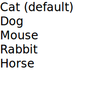

# [Models and Views in Qt Quick](https://doc.qt.io/qt-6/qtquick-modelviewsdata-modelview.html)

大多数应用程序需要格式化数据并显示数据。Qt Quick 有模型、视图和委托的概念来显示数据。它们将数据的可视化模块化，以便开发人员或设计人员控制数据的不同方面。开发人员可以通过很少的更改将列表视图与网格视图交换。同样，将数据实例封装在委托中允许开发人员决定如何呈现或处理数据。


- Model — 包含数据及其结构。有多种 QML 类型可用于创建模型。

- View — 一个容器，用于显示数据。视图可以以列表或网格的形式显示数据。

- Delegate — 决定数据在视图中的显示方式。委托将模型中的每个数据单元封装起来。通过委托可以访问数据。委托还可以将数据写回可编辑模型（例如，在 `TextField` 的 `onAccepted` 处理程序中）。 

要可视化数据，请将视图的 `model` 属性绑定一个模型，将 `delegate` 属性绑定一个组件或另一个兼容类型。

## Displaying Data with Views

视图是项目集合的容器。它们功能丰富，可以根据样式或行为要求进行自定义。

在 Qt Quick 图形类型的基本集合中提供了一组标准视图：

- `ListView` — 将项目排列在一个水平或垂直列表中
- `GridView` — 在可用空间内将项目排列成网格 
- `PathView` — 在一个路径上排列项目 
- `TableView` — 将 `QAbstractTableModel` 中的数据排列成表格 
- `TreeView` — 将 `QAbstractItemModel` 中的数据排列成树形结构

这些类型具有各自独有的属性和行为。参阅它们各自的文档以了解更多信息。

此外，Qt Quick Controls 包含一些额外的视图和委托，这些视图和委托根据应用程序样式进行了样式设置，例如 `HorizontalHeaderView` 和 `VerticalHeaderView`。

### Decorating Views

视图通过如 `header`、`footer` 和 `section` 等装饰属性进行视觉定制。通过将对象（通常是另一个可视对象）绑定到这些属性，可以装饰视图。`footer` 可以包含一个显示边框的 `Rectangle` 类型或一个在列表顶部显示 logo 的标题。

假设一个特定俱乐部想要使用其品牌颜色装饰其成员列表。成员列表在一个 `model` 中，`delegate` 将显示模型的内容。

```qml
ListModel {
    id: nameModel
    ListElement { name: "Alice" }
    ListElement { name: "Bob" }
    ListElement { name: "Jane" }
    ListElement { name: "Harry" }
    ListElement { name: "Wendy" }
}
Component {
    id: nameDelegate
    Text {
        required property string name
        text: name
        font.pixelSize: 24
    }
}
```

俱乐部可以通过将可视对象绑定到 `header` 和 `footer` 属性来装饰成员列表。可视对象可以内联定义，在另外一个文件中，或者在一个 `Component` 类型中。

```qml
ListView {
    anchors.fill: parent
    clip: true
    model: nameModel
    delegate: nameDelegate
    header: bannercomponent
    footer: Rectangle {
        width: parent.width; height: 30;
        gradient: clubcolors
    }
    highlight: Rectangle {
        width: parent.width
        color: "lightgray"
    }
}

Component {     //instantiated when header is processed
    id: bannercomponent
    Rectangle {
        id: banner
        width: parent.width; height: 50
        gradient: clubcolors
        border {color: "#9EDDF2"; width: 2}
        Text {
            anchors.centerIn: parent
            text: "Club Members"
            font.pixelSize: 32
        }
    }
}
Gradient {
    id: clubcolors
    GradientStop { position: 0.0; color: "#8EE2FE"}
    GradientStop { position: 0.66; color: "#7ED2EE"}
}
```


### Mouse and Touch Handling

视图处理其内容的拖动和轻弹 (浏览)，但它们不处理与各个委托的触摸交互。为了使委托对触摸输入做出反应，例如设置 `currentIndex`，必须由委托提供具有适当触摸处理逻辑的 `MouseArea`。

请注意，如果将 `highlightRangeMode` 设置为 `StrictlyEnforceRange`，则 `currentIndex` 将受到拖动/轻扫视图的影响，因为视图始终会确保 `currentIndex` 在指定的高亮范围内。

### ListView Sections

`ListView` 内容可以分成若干分区，其中相关的列表项根据其所属的分区进行标记。此外，可以使用委托装饰分区。

列表可能包含一个列表，其中显示人名和人所属的团队。

```qml
ListModel {
    id: nameModel
    ListElement { name: "Alice"; team: "Crypto" }
    ListElement { name: "Bob"; team: "Crypto" }
    ListElement { name: "Jane"; team: "QA" }
    ListElement { name: "Victor"; team: "QA" }
    ListElement { name: "Wendy"; team: "Graphics" }
}
Component {
    id: nameDelegate
    Text {
        text: name;
        font.pixelSize: 24
        anchors.left: parent.left
        anchors.leftMargin: 2
    }
}
```

`ListView` 类型具有 `section` 附加属性，可以将相邻和相关类型组合成一个分区。`section.property` 确定使用哪个列表类型属性作为分区。`section.criteria` 可以指定如何显示分区名称，而 `section.delegate` 类似于视图的 `delegate` 属性。


## View Delegates

视图需要委托来可视化表示在列表中的项目。视图将根据委托定义的模板可视化每个项目列表。模型中的项目可以通过 `index` 属性以及项目的属性进行访问。

```qml
Component {
    id: petdelegate
    Text {
        id: label
        font.pixelSize: 24
        text: index === 0 ? type + " (default)" : type

        required property int index
        required property string type
    }
}
```



### Accessing Views and Models from Delegates

委托绑定的列表视图可以通过 `ListView.view` 属性从委托中访问。同样，`GridView` 的 `GridView.view` 对于委托也是可用的。因此，相应的模型及其属性可以通过 `ListView.view.model` 访问。此外，模型中定义的任何信号或方法也是可访问的。

当您想要为多个视图使用相同的委托时，此机制非常有用，但您希望每个视图的装饰或其他功能不同，并且您希望这些不同的设置是每个视图的属性。同样，访问或显示模型的某些属性可能很有趣。

在以下示例中，委托显示模型的 `language` 属性，并且其中一个字段的颜色取决于视图的 `fruit_color` 属性。

```qml
Rectangle {
     width: 200; height: 200

    ListModel {
        id: fruitModel
        property string language: "en"
        ListElement {
            name: "Apple"
            cost: 2.45
        }
        ListElement {
            name: "Orange"
            cost: 3.25
        }
        ListElement {
            name: "Banana"
            cost: 1.95
        }
    }

    Component {
        id: fruitDelegate
        Row {
                id: fruit
                Text { text: " Fruit: " + name; color: fruit.ListView.view.fruit_color }
                Text { text: " Cost: $" + cost }
                Text { text: " Language: " + fruit.ListView.view.model.language }
        }
    }

    ListView {
        property color fruit_color: "green"
        model: fruitModel
        delegate: fruitDelegate
        anchors.fill: parent
    }
}
```

## Models

通过命名的数据角色将数据提供给委托，委托可以绑定到这些角色。以下是具有两个角色 `type` 和 `age` 的 `ListModel`，以及一个 `ListView`，其中委托绑定到这些角色以显示它们的值：

```qml
import QtQuick 2.0

Item {
    width: 200
    height: 250

    ListModel {
        id: myModel
        ListElement { type: "Dog"; age: 8; noise: "meow" }
        ListElement { type: "Cat"; age: 5; noise: "woof" }
    }

    component MyDelegate : Text {
        required property string type
        required property int age
        text: type + ", " + age
        // WRONG: Component.onCompleted: () => console.log(noise)
        // The above line would cause a ReferenceError
        // as there is no required property noise,
        // and the presence of the required properties prevents
        // noise from being injected into the scope
    }

    ListView {
        anchors.fill: parent
        model: myModel
        delegate: MyDelegate {}
    }
}
```

**在大多数情况下，您应该使用 `required property` 将模型数据传递到委托中**。如果委托包含必需的属性，则 QML 引擎将检查必需属性的名称是否与模型角色的名称匹配。如果是，则该属性将绑定到模型中相应的值。

在极少数边缘情况下，您可能希望通过 QML 上下文传输模型属性，而不是作为必需属性。如果您的委托中没有必需的属性，则命名角色将作为上下文属性提供：

```qml
import QtQuick 2.0

Item {
    width: 200; height: 250

    ListModel {
        id: myModel
        ListElement { type: "Dog"; age: 8 }
        ListElement { type: "Cat"; age: 5 }
    }

    Component {
        id: myDelegate
        Text { text: type + ", " + age }
    }

    ListView {
        anchors.fill: parent
        model: myModel
        delegate: myDelegate
    }
}
```

上下文属性对于工具来说是不可见的，并防止 Qt Quick 编译器优化您的代码。它们使推断委托期望的特定数据变得更加困难。没有办法从 QML 显式填充 QML 上下文。如果您的组件希望通过 QML 上下文传递数据，则只能在通过本机方式提供正确上下文的地方使用它。这可以是您自己的 C++ 代码或周围元素的特定实现。相反，可以从 QML 以多种方式或通过本机方式设置必需属性。因此，通过 QML 上下文传递数据会降低组件的可重用性。

如果模型的属性与委托的属性之间存在命名冲突，则可以使用限定模型名称访问角色。例如，如果 `Text` 类型具有（非必需）`type` 或 `age` 属性，则上面示例中的文本将显示这些属性值，而不是模型项中的 `type` 和 `age` 的值。在这种情况下，可以将属性引用为 `model.type` 和 `model.age`，以确保委托显示模型项中的属性值。为了使其工作，您需要在委托中要求一个 `model` 属性（除非您使用上下文属性）。

委托还可以访问包含模型中项目索引的一个特殊的 `index` 角色。请注意，如果从模型中删除项目，则此索引设置为 -1。如果绑定到 `index` 角色，请确保逻辑考虑到索引可能为 -1，即该项目不再有效。（通常，该项目很快就会被销毁，但在某些视图中可以通过 `delayRemove` 附加属性延迟委托销毁。）

没有命名角色的模型（例如下面显示的 `ListModel`）将通过 `modelData` 角色提供数据。对于只有一个角色的模型，也提供 `modelData` 角色。在这种情况下，`modelData` 角色包含与命名角色相同的数据。

> 注意：如果委托包含必需属性，则无法访问 `model`、`index` 和 `modelData` 角色，除非它还具有名称匹配的必需属性。

QML 在内置 QML 类型集中提供了几种数据模型类型。此外，可以使用 Qt C++ 创建模型，然后使其可用于 `QQmlEngine`，以供 QML 组件使用。有关创建这些模型的信息，请访问 [使用 C++ 模型与 Qt Quick 视图](<./Using C++ Models with Qt Quick Views.md>) 和 [创建 QML 类型](<./The QML Type System.md>) 文章。

可以使用一个 Repeater 实现来自模型的项目的定位。

### List Model

`ListModel` 是在 QML 中指定的一组简单类型层次结构。可用角色由 `ListElement` 属性指定。

```qml
ListModel {
    id: fruitModel

    ListElement {
        name: "Apple"
        cost: 2.45
    }
    ListElement {
        name: "Orange"
        cost: 3.25
    }
    ListElement {
        name: "Banana"
        cost: 1.95
    }
}
```

上面的模型有两个角色，`name` 和 `cost`。这些可以通过一个 `ListView` 的委托绑定，例如：

```
ListView {
    anchors.fill: parent
    model: fruitModel
    delegate: Row {
        id: delegate
        required property string name
        required property real cost

        Text { text: "Fruit: " + delegate.name }
        Text { text: "Cost: $" + delegate.cost }
    }
}
```

`ListModel` 提供了通过 JavaScript 直接操作 `ListModel` 的方法。在这种情况下，插入的第一项确定了任何使用该模型的视图可用的角色。例如，如果创建一个空的 `ListModel` 并通过 JavaScript 填充它，则第一次插入提供的角色是在视图中显示的唯一角色：

```qml
ListModel { id: fruitModel }
    ...
MouseArea {
    anchors.fill: parent
    onClicked: fruitModel.append({"cost": 5.95, "name":"Pizza"})
}
```

当 `MouseArea` 被点击，`fruitModel` 会有两个角色，`cost` 和 `name`。即使添加了后续角色，使用该模型的视图也只会处理前两个角色。要重置模型中可用的角色，请调用 `ListModel::clear()`

> 通过 JavaScript 填充 ListModel，填充到模型的第一项确定了视图可用的角色。

### XML Model

`XmlListModel` 允许从 XML 数据源构建模型。角色通过 `XmlListModelRole` 类型指定。需要导入类型。

```qml
import QtQml.XmlListModel
```

以下模型有个角色，`title`、`link` 和 `pubDate`：

```qml
XmlListModel {
     id: feedModel
     source: "http://rss.news.yahoo.com/rss/oceania"
     query: "/rss/channel/item"
     XmlListModelRole { name: "title"; elementName: "title" }
     XmlListModelRole { name: "link"; elementName: "link" }
     XmlListModelRole { name: "pubDate"; elementName: "pubDate" }
}
```

`query` 属性指定 `XmlListModel` 为 XML 文档中的每个 <item> 生成一个模型项。

[RSS News Demo](https://doc.qt.io/qt-6/qtdoc-demos-rssnews-example.html) 展示了 `XmlListModel` 如何用于显示 RSS 摘要。

### Object Model

`ObjectModel` 包含要在视图中使用的可视项。当 `ObjectModel` 用于视图时，视图不需要委托，因为 `ObjectModel` 已经包含了可视委托（项）。

下面的示例在 `ListView` 中放置了三个彩色矩形。

```
import QtQuick 2.0
import QtQml.Models 2.1

Rectangle {
    ObjectModel {
        id: itemModel
        Rectangle { height: 30; width: 80; color: "red" }
        Rectangle { height: 30; width: 80; color: "green" }
        Rectangle { height: 30; width: 80; color: "blue" }
    }

    ListView {
        anchors.fill: parent
        model: itemModel
    }
}
```

### Integers as Models

整数可以用作包含某些类型的模型。在这种情况下，模型没有任何数据角色。

以下示例创建了一个具有五个元素的 `ListView`：

```qml
Item {
    width: 200; height: 250

    Component {
        id: itemDelegate

        Text {
            required property int index
            text: "I am item number: " + index
        }
    }

    ListView {
        anchors.fill: parent
        model: 5
        delegate: itemDelegate
    }

}
```

> 注意：整数模型中的项目数量限制为  100,000,000。

### Object Instances as Models

一个对象实例可用于指定具有单一对象类型的模型。对象的属性作为角色提供。

下面的示例创建了一个包含一个项目的列表，显示 `myText` 文本的颜色。请注意，使用完全限定的 `model.color` 属性以避免与委托中 `Text` 类型的 `color` 属性冲突。

```qml
Rectangle {
    width: 200; height: 250

    Text {
        id: myText
        text: "Hello"
        color: "#dd44ee"
    }

    Component {
        id: myDelegate

        Text {
            required property var model
            text: model.color
        }
    }

    ListView {
        anchors.fill: parent
        anchors.topMargin: 30
        model: myText
        delegate: myDelegate
    }
}
```

### C++ Data Models

可以在 C++ 中定义模型，然后使其可用于 QML。此机制对于将现有 C++ 数据模型或其他复杂数据集暴露到 QML 中非常有用。

有关信息，请访问 [使用 C++ 模型与 Qt Quick 视图](<./Using C++ Models with Qt Quick Views.md>)。

## Repeaters


Repeaters 使用模型中的数据从模板中创建与 positioners 一起使用的项目。组合重复器和定位器是布置大量项目的简单方法。将 `Repeater` 项放置在定位器内部，并生成封装定位器排列的项目。

每个 `Repeater` 通过将模型中的每个数据元素（使用 `model` 属性指定）与作为 Repeater 内部子项定义的模板项组合来创建一些项目。项目的总数由模型中的数据量确定。

以下示例显示了一个`Repeater` 与 `Grid` 项一起使用，以排列一组矩形项。`Repeater` 项为 `Grid` 项创建了 24 个矩形，以 5x5 排列。

```qml
import QtQuick 2.0

Rectangle {
    width: 400; height: 400; color: "black"

    Grid {
        x: 5; y: 5
        rows: 5; columns: 5; spacing: 10

        Repeater { 
        	model: 24
            Rectangle { 
            	width: 70; height: 70
                color: "lightgreen"

                Text { 
                	text: index
                    font.pointSize: 30
                    anchors.centerIn: parent 
                } 
            }
        }
    }
}
```

`Repeater` 创建的项目数由其 `count` 属性保存。不能设置此属性来确定要创建的项目数。相反，如上例所示，我们使用整数作为模型。

有关详细信息，请参见 [QML 数据模型](<# Integers as Models>) 文档。

如果模型是字符串列表，则委托还会暴露给通常只读的 `modelData` 属性，该属性保存字符串。例如：

```qml
Column {
    Repeater {
        model: ["apples", "oranges", "pears"]
        Text {
            required property string modelData
            text: "Data: " + modelData
        }
    }
}
```


还可以使用委托作为 `Repeater` 创建的项目的模板。这是使用 `delegate` 属性指定的。

## Changing Model Data

要更改模型数据，可以将更新后的值赋给模型属性。QML `ListModel` 默认为可编辑，而 C++ 模型必须实现 `setData()` 才能变为可编辑。整数和 JavaScript 数组模型是只读的。

假设基于 `QAbstractItemModel` 的 C++ 模型实现了 `setData` 方法，并将其注册为名为 `EditableModel` 的 QML 类型。然后可以像这样将数据写入模型：

```qml
ListView {
    anchors.fill: parent
    model: EditableModel {}
    delegate: TextEdit {
        required property var model

        width: ListView.view.width
        height: 30
        text: model.edit
        Keys.onReturnPressed: model.edit = text
    }
}
```

> 注意：`edit` 角色等于 `Qt::EditRole`。有关内置角色名称，请参见 `roleNames()`。但是，实际模型通常会注册自定义角色。

> 注意：如果模型角色绑定到必需属性，赋值给该属性不会修改模型。它将打破与模型的绑定（就像赋值给任何其他属性一样会打破现有的绑定）。如果要使用必需属性并更改模型数据，请让 `model` 也成为必需属性，并将其分配给 `model.propertyName`。

有关更多信息，请访问 [使用 C++ 模型与 Qt Quick 视图](<./Using C++ Models with Qt Quick Views.md>)。

## Using Transitions

转换可用于为添加到定位器、在定位器内移动或从定位器移除的项目设置动画。

添加项目的转换适用于作为定位器的一部分创建的项目，以及重新设置父级以成为定位器的子项的项目。

删除项目的转换适用于在定位器中删除的项目，以及从定位器中删除并在文档中赋予新父项的项目。

> 注意：将项目的不透明度更改为零不会使它们从定位器中消失。可以通过更改 `visible` 属性来删除和重新添加它们。

