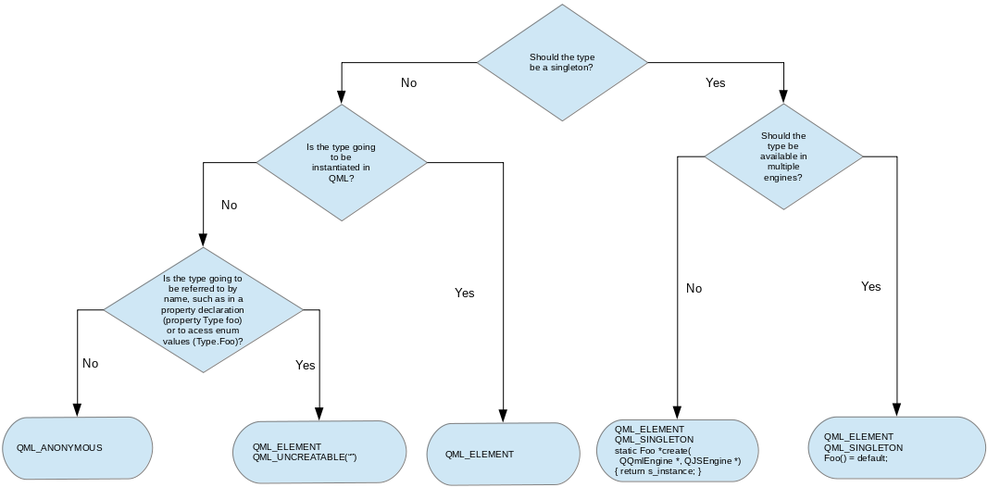

# [Overview - QML and C++ Integration](https://doc.qt.io/qt-6/qtqml-cppintegration-overview.html)

QML 设计成可通过 C++ 代码轻松扩展。[Qt QML](<./Qt QML.md>) 模块中的类使得可以从 C++ 中加载和操作 QML 对象，而 QML 引擎与 Qt 的 [元对象系统](<../Qt Core/The Meta-Object System.md>) 的集成使得可以直接从 QML 中调用 C++ 功能。这允许开发使用 QML、JavaScript 和 C++ 代码的混合实现的混合应用程序。

集成 QML 和 C++ 提供了各种机会，包括以下能力：

- 通过使用 QML 文档中的 QML 和 JavaScript 实现前端，使用 C++ 实现后端，将用户界面代码与应用程序逻辑代码分离。
- 从 QML 中使用和调用一些 C++ 功能（例如，调用应用程序逻辑、使用在 C++ 中实现的数据模型或调用第三方 C++ 库中的某些函数）。
- 访问 Qt QML 或 [Qt Quick](<../Qt Quick/Qt Quick.md>) C++ API 中的功能（例如，使用 `QQuickImageProvider` 动态生成图像）。
- 从 C++ 实现自己的 [QML 对象类型](。/QML Object Types.md)，无论是为了在自己的特定应用程序中使用还是为了分发给其他人。

要向 QML 提供一些 C++ 数据或功能，必须从 `QObject` 派生类中提供它。由于 QML 引擎与元对象系统的集成，任何 `QObject` 派生类的属性、方法和信号都可以从 QML 中访问，如在 [将 C++ 类型的属性暴露给 QML](./Exposing Attributes of C++ Types to QML.md) 中所述。一旦这样的类提供了所需的功能，它可以以多种方式暴露给 QML：

- 该类可 [注册为可实例化的 QML 类型](<./Defining QML Types from C++.md#Registering an Instantiable Object Type>)，以便可以像任何普通的 QML 对象类型一样从 QML 代码中实例化和使用它。
- 该类可 [注册为 Singleton 类型](<./Defining QML Types from C++.md#Registering Singleton Objects with a Singleton Type>)，以便可以从 QML 代码中导入该类的单例，允许从 QML 访问该实例的属性、方法和信号。
- 将该类的实例 [嵌入到 QML 代码](https://doc.qt.io/qt-6/qtqml-cppintegration-contextproperties.html) 中作为上下文属性或上下文对象，允许从 QML 访问该实例的属性、方法和信号。

这些是从 QML 代码访问 C++ 功能最常见的方法；有关更多选项和详细信息，请参见下面更深入的部分中描述的主要文档页面。除了能够从 QML 访问 C++ 功能之外，Qt QML 模块还提供了一些方法来反向操作并从 C++ 代码操作 QML 对象。更多细节参见 [从 C++ 与 QML 对象交互](./Interacting with QML Objects from C++.md)。

通常希望将某些状态作为全局属性暴露给 QML。[将状态从 C++ 暴露到 QML](<./Exposing State from C++ to QML.md>) 中描述了如何做到这一点。

最后，C++ 代码可以集成到 C++ 应用程序或 C++ 插件中，具体取决于它是作为独立应用程序还是库进行分发。插件可以与一个 QML 模块集成，然后可以在其他应用程序中导入并使用该模块中的 QML 代码；参见 [在 C++ 插件中提供类型和功能](<./Creating C++ Plugins for QML.md>) 了解更多。

## Choosing the Correct Integration Method Between C++ and QML

要快速决定哪种集成方式适合您的情况，可以使用以下流程图：

有关流程图中的宏的说明，请参见 [从 C++ 定义 QML 类型](<./Defining QML Types from C++.md>)

## Exposing Attributes of C++ Classes to QML

由于 QML 引擎与 Qt 元对象系统集成，QML 可以轻松地从 C++ 扩展。此集成允许从 QML 访问任何 `QObject` 派生类的属性、方法和信号：可以读取和修改属性，可以从 JavaScript 表达式调用方法，必要时会自动为信号创建信号处理程序。此外，`QObject` 派生类的枚举值可从 QML 中访问。

有关更多信息，请参见 [将 C++ 类型的属性暴露给 QML](<./Exposing Attributes of C++ Types to QML.md>)。

## Defining QML Types from C++

QML 类型可以在 C++ 中定义，然后在 [QML 类型系统](<./The QML Type System.md>) 中注册。这允许将一个 C++ 类实例化为 [QML 对象类型](<./QML Object Types.md>)，从而实现在 C++ 中实现自定义对象类型并将其集成到现有 QML 代码中。C++ 类还可以注册用于其他目的：例如，它可以注册为 *Singleton Type*，以使 QML 代码导入单个类实例，或者它可以注册以使非可实例化类的枚举值可从 QML 访问。

此外，Qt QML 模块提供了机制来定义与 QML 概念（如附加属性和默认属性）集成的 QML 类型。

有关从 C++ 注册和创建自定义 QML 类型的更多信息，请参见 [从 C++ 定义 QML 类型](<./Defining QML Types from C++.md>) 文档。

## Embedding C++ Objects into QML with Context Properties

C++ 对象和值可以直接嵌入到加载的 QML 对象的上下文（或作用域）中，使用 *context properties* 和 *context objects* 即可实现。这是通过 Qt QML 模块提供的 `QQmlContext` 类实现的，该类将数据公开给 QML 组件的上下文，允许从 C++ 向 QML 注入数据。

有关更多信息，请参见[使用上下文属性将 C++ 对象嵌入到 QML 中](<./Embedding C++ Objects into QML with Context Properties.md>)。

## Interacting with QML Objects from C++

QML 对象类型可以从 C++ 实例化并进行检查，以访问其属性、调用其方法并接收其信号通知。这是由于**所有 QML 对象类型都是使用 QObject 派生类实现的**，使得 QML 引擎能够通过 Qt 元对象系统动态加载和内省对象。

> 警告：虽然可以从 C++ 访问 QML 对象并操作它们，但这不是推荐的方法，除了测试和原型制作之外。QML 和 C++ 集成的优点之一是能够在 QML 中实现与 C++ 逻辑和数据集后端分离的 UI，如果 C++ 端开始直接操作 QML，则会失败。这种方法还使得在不影响其 C++ 对应项的情况下更改 QML UI 变得困难。

有关从 C++ 访问 QML 对象的更多信息，请参见 [从 C++ 与 QML 对象交互](<./Interacting with QML Objects from C++.md>)。

## Data Type Conversion Between QML and C++

当在 QML 和 C++ 之间交换数据值时，QML 引擎会将它们转换为适合 QML 或 C++ 使用的正确数据类型，前提是引擎已知所涉及的数据类型。

有关引擎支持的内置类型以及在 QML 和 C++ 之间交换时如何转换这些类型的信息，请参见 [QML 和 C++ 之间的数据类型转换](<./Data Type Conversion Between QML and C++.md>)。

<!-- 完成标志, 看不到, 请忽略! -->