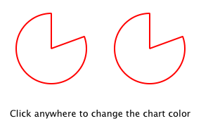
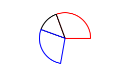

# [Writing QML Extensions with C++](https://doc.qt.io/qt-6/qtqml-tutorials-extending-qml-example.html)

Qt QML 模块提供了一组 API，用于通过 C++ 扩展扩展QML。您可以编写扩展来添加自定义的 QML 类型，扩展现有的 Qt 类型或调用普通 QML 代码无法访问的 C/C++ 函数。

本教程介绍了如何使用 C++ 编写 QML 扩展，其中包括核心 QML 功能，包括属性、信号和绑定。它还展示了如何通过插件部署扩展。

本教程涵盖的许多主题在 [Overview - QML and C++ Integration](<./Overview - QML and C++ Integration.md>) 及其文档子主题中有更详细的记录。特别是，您可能会对子主题 [将 C++ 类型的属性暴露给 QML](<./Exposing Attributes of C++ Types to QML.md>) 和 [从 C++ 定义 QML 类型](<./Defining QML Types from C++.md>) 感兴趣。

## Running the Tutorial Examples

本教程中的代码可作为示例项目使用，每个教程章节都有关联的子项目。在 Qt Creator 中，打开欢迎模式并从示例中选择教程。在编辑模式下，展开 extending-qml 项目，在要运行的子项目（章节）上单击右键，然后选择运行。

## Creating Tutorial Project

我们使用  Qt Creator 中的 *Qt Quick Application* 模板创建一个新项目，如 [Qt Creator: Creating Qt Quick Projects](https://doc.qt.io/qtcreator/quick-projects.html) 中所示。

## Chapter 1: Creating a New Type

extending-qml/chapter1-basics

扩展 QML 时的一个常见的任务是提供一个新的 QML 类型，该类型支持一些自定义功能，超出了内置 [Qt Quick 类型](<./Qt Quick QML Types.md>) 提供的功能。例如，可以使用它来实现特定的数据模型，或提供具有自定义绘画和绘图功能的类型，或者访问无法通过内置 QML 功能访问的网络编程等系统功能。

在本教程中，我们将展示如何使用 Qt Quick 模块中的 C++ 类来扩展 QML。最终结果将是一个简单的饼图显示，由几个自定义 QML 类型通过 QML 特性（如绑定和信号）连接在一起实现，并通过插件提供给 QML 运行时。

首先，让我们创建一个名为 `PieChart` 的新 QML 类型，它具有两个属性：名称和颜色。我们将在名为 `Charts` 的可导入类型命名空间中提供它，版本为 1.0。

我们希望可以像如下所示这样从 QML 中使用这个 `PieChart` 类型：

```qml
import Charts 1.0

PieChart {
    width: 100; height: 100
    name: "A simple pie chart"
    color: "red"
}
```

为此，我们需要一个封装该 `PieChart` 类型及其两个属性的 C++ 类。由于 QML 广泛使用了 [Qt 元对象系统](<../Qt Core/The Meta-Object System.md>)，这个新类必须：

- 继承自 `QObject`
- 使用 `Q_PROPERTY` 宏声明其属性

### Class Declaration

这是我们的 `PieChart` 类，定义在 piechart.h 中：

```c++
#include <QtQuick/QQuickPaintedItem>
#include <QColor>

class PieChart : public QQuickPaintedItem
{
    Q_OBJECT
    Q_PROPERTY(QString name READ name WRITE setName FINAL)
    Q_PROPERTY(QColor color READ color WRITE setColor FINAL)
    QML_ELEMENT

public:
    PieChart(QQuickItem *parent = nullptr);

    QString name() const;
    void setName(const QString &name);

    QColor color() const;
    void setColor(const QColor &color);

    void paint(QPainter *painter) override;

private:
    QString m_name;
    QColor m_color;
};
```

该类继承自 `QQuickPaintedItem`，因为我们希望重写 `QQuickPaintedItem::paint()` 以使用 `QPainter` API 执行绘图操作。如果该类只是表示某些数据类型，并且不是实际需要显示的项，则可以简单地继承 `QObject`。或者，如果我们想要扩展现有的基于 `QObject` 的类的功能，则可以改为继承该类。或者，如果我们想要创建一个不需要使用 `QPainter` API 执行绘图操作的可视项，则可以仅子类化 `QQuickItem`。

`PieChart` 类使用 `Q_PROPERTY` 宏定义了两个属性 `name` 和 `color`，并重写了 `QQuickPaintedItem::paint()`。`PieChart` 类使用 `QML_ELEMENT` 宏进行注册，以允许从 QML 中使用它。如果您不注册该类，则 app.qml 将无法创建 `PieChart`。

### qmake Setup

为使注册生效，在项目文件中将 `qmltypes` 选项添加到 `CONFIG`，并提供 `QML_IMPORT_NAME` 和 `QML_IMPORT_MAJOR_VERSION`：

```qmake
CONFIG += qmltypes
QML_IMPORT_NAME = Charts
QML_IMPORT_MAJOR_VERSION = 1
```

### CMake Setup

同样，为了在使用 CMake 时注册生效，请使用 [qt_add_qml_module](<./qt_add_qml_module.md>) 命令：

```cmake
qt_add_qml_module(chapter1-basics
    URI Charts
    QML_FILES app.qml
    NO_RESOURCE_TARGET_PATH
    DEPENDENCIES QtQuick
)
```

### Class implementation

在 piechart.cpp 中的类实现简单地设置并返回适当的 `m_name` 和 `m_color` 的值，并实现 `paint()` 绘制一个简单的饼图：

```c++
PieChart::PieChart(QQuickItem *parent)
    : QQuickPaintedItem(parent)
{
}
...
void PieChart::paint(QPainter *painter)
{
    QPen pen(m_color, 2);
    painter->setPen(pen);
    painter->setRenderHints(QPainter::Antialiasing, true);
    painter->drawPie(boundingRect().adjusted(1, 1, -1, -1), 90 * 16, 290 * 16);
}
```

### QML Usage

现在我们已经定义了 `PieChart` 类型，我们将在 QML 中使用它。app.qml 文件创建一个 `PieChart` 项目并使用一个标准的 QML Text 项目显示饼图的名称：

```qml
import Charts
import QtQuick

Item {
    width: 300; height: 200

    PieChart {
        id: aPieChart
        anchors.centerIn: parent
        width: 100; height: 100
        name: "A simple pie chart"
        color: "red"
    }

    Text {
        anchors { bottom: parent.bottom; horizontalCenter: parent.horizontalCenter; bottomMargin: 20 }
        text: aPieChart.name
    }
}
```

请注意，尽管在 QML 中将颜色指定为字符串，但它会自动转换为 `PieChart` 颜色属性的 `QColor` 对象。提供了各种其他值类型的自动转换。例如，像 "640x480" 这样的字符串可以自动转换为 `QSize` 值。

我们还将创建一个使用 `QQuickView` 运行和显示 app.qml 的 C++ 应用程序。

以下是应用程序 main.cpp：

```c++
#include "piechart.h"
#include <QtQuick/QQuickView>
#include <QGuiApplication>

int main(int argc, char *argv[])
{
    QGuiApplication app(argc, argv);

    QQuickView view;
    view.setResizeMode(QQuickView::SizeRootObjectToView);
    view.setSource(QUrl("qrc:///app.qml"));
    view.show();
    return QGuiApplication::exec();
}
```

### Project Build

为了构建项目，我们包含文件，链接到库，并为暴露给 QML 的类型定义了一个名为 `Charts` 的命名空间，版本1.0。

使用qmake：

```qmake
QT += qml quick

CONFIG += qmltypes
QML_IMPORT_NAME = Charts
QML_IMPORT_MAJOR_VERSION = 1

HEADERS += piechart.h
SOURCES += piechart.cpp \
           main.cpp

RESOURCES += chapter1-basics.qrc

DESTPATH = $$[QT_INSTALL_EXAMPLES]/qml/tutorials/extending-qml/chapter1-basics
target.path = $$DESTPATH
INSTALLS += target
```

使用CMake

```cmake
# Copyright (C) 2022 The Qt Company Ltd.
# SPDX-License-Identifier: BSD-3-Clause

cmake_minimum_required(VERSION 3.16)
project(chapter1-basics LANGUAGES CXX)

set(CMAKE_AUTOMOC ON)

if(NOT DEFINED INSTALL_EXAMPLESDIR)
    set(INSTALL_EXAMPLESDIR "examples")
endif()

set(INSTALL_EXAMPLEDIR "${INSTALL_EXAMPLESDIR}/qml/tutorials/extending-qml/chapter1-basics")

find_package(Qt6 REQUIRED COMPONENTS Core Gui Qml Quick)

qt_add_executable(chapter1-basics
    main.cpp
    piechart.cpp piechart.h
)

set_target_properties(chapter1-basics PROPERTIES
    WIN32_EXECUTABLE TRUE
    MACOSX_BUNDLE TRUE
)

target_link_libraries(chapter1-basics PUBLIC
    Qt6::Core
    Qt6::Gui
    Qt6::Qml
    Qt6::Quick
)
qt_add_qml_module(chapter1-basics
    URI Charts
    QML_FILES app.qml
    NO_RESOURCE_TARGET_PATH
    DEPENDENCIES QtQuick
)
install(TARGETS chapter1-basics
    RUNTIME DESTINATION "${INSTALL_EXAMPLEDIR}"
    BUNDLE DESTINATION "${INSTALL_EXAMPLEDIR}"
    LIBRARY DESTINATION "${INSTALL_EXAMPLEDIR}"
)
```

现在我们可以构建并运行应用程序：


> 注意：您可能会看到警告表达式...取决于不可通知属性：PieChart::name。这是因为我们向可写的name属性添加了绑定，但尚未为其定义通知信号。因此，如果名称值更改，QML引擎无法更新绑定。这在以下章节中得到解决。

## Chapter 2: Connecting to C++ Methods and Signals

extending-qml/chapter2-methods

假设我们希望 `PieChart` 具有 `clearChart()` 方法，该方法擦除图表，然后发出 `chartCleared` 信号。我们的 app.qml 将能够像这样调用 `clearChart()` 并接收 `chartCleared()` 信号：

```qml
import Charts
import QtQuick

Item {
    width: 300; height: 200

    PieChart {
        id: aPieChart
        anchors.centerIn: parent
        width: 100; height: 100
        color: "red"

        onChartCleared: console.log("The chart has been cleared")
    }

    MouseArea {
        anchors.fill: parent
        onClicked: aPieChart.clearChart()
    }

    Text {
        anchors { bottom: parent.bottom; horizontalCenter: parent.horizontalCenter; bottomMargin: 20 }
        text: "Click anywhere to clear the chart"
    }
}
```


为此，我们向 C++ 类添加一个 `clearChart()` 方法和一个 `chartCleared()` 信号：

```c++
class PieChart : public QQuickPaintedItem
{
    ...
public:
    ...
    Q_INVOKABLE void clearChart();

signals:
    void chartCleared();
    ...
};
```

使用 `Q_INVOKABLE` 让 `clearChart()` 方法可用于 Qt 元对象系统，进而可用于 QML。请注意，它也可以声明为 Qt 槽，而不是使用 `Q_INVOKABLE`，因为槽也可以从 QML 中调用。这两种方法都是有效的。

> QML 中可以调用 `Q_INVOKABLE` 和 Qt 槽

`clearChart()` 方法只是将颜色更改为 `Qt::transparent`，重新绘制图表，然后发出 `chartCleared()` 信号：

```c++
void PieChart::clearChart()
{
    setColor(QColor(Qt::transparent));
    update();

    emit chartCleared();
}
```

现在，当我们运行应用程序并单击窗口时，饼图消失，并且应用程序输出：

```
qml: The chart has been cleared
```

## Chapter 3: Adding Property Bindings

extending-qml/chapter3-bindings

属性绑定是 QML 的一个强大功能，它允许不同类型的值自动同步。当属性值更改时，它使用信号来通知和更新其他类型的值。

让我们为颜色属性启用属性绑定。这意味着如果我们有这样的代码：

```qml
import Charts
import QtQuick

Item {
    width: 300; height: 200

    Row {
        anchors.centerIn: parent
        spacing: 20

        PieChart {
            id: chartA
            width: 100; height: 100
            color: "red"
        }

        PieChart {
            id: chartB
            width: 100; height: 100
            color: chartA.color
        }
    }

    MouseArea {
        anchors.fill: parent
        onClicked: { chartA.color = "blue" }
    }

    Text {
        anchors { bottom: parent.bottom; horizontalCenter: parent.horizontalCenter; bottomMargin: 20 }
        text: "Click anywhere to change the chart color"
    }
}
```



`color: chartA.color` 语句将 `chartB` 的颜色值绑定到 `chartA` 的颜色。每当 `chartA` 的颜色值更改时，`chartB` 的颜色值都会更新为相同的值。当单击窗口时，`MouseArea` 中的 `onClicked` 处理程序会更改 `chartA` 的颜色，从而将两个图表更改为蓝色。

要为颜色属性启用属性绑定很容易。我们在其 `Q_PROPERTY()` 声明中添加 `NOTIFY` 功能，以指示在值更改时发出 `colorChanged` 信号。

```c++
class PieChart : public QQuickPaintedItem
{
    ...
    Q_PROPERTY(QColor color READ color WRITE setColor NOTIFY colorChanged FINAL)
public:
    ...
signals:
    void colorChanged();
    ...
};
```

然后，我们在 `setColor()` 中发出这个信号

```c++
void PieChart::setColor(const QColor &color)
{
    if (color != m_color) {
        m_color = color;
        update();   // repaint with the new color
        emit colorChanged();
    }
}
```

在发出 `colorChanged()` 之前，检查 `setColor()` 是否实际更改了颜色值非常重要。这可以确保不必要地发出信号，并防止其他类型响应值更改时出现循环。

绑定的使用对于 QML 是必不可少的。如果可以实现，您应始终为属性添加 `NOTIFY` 信号，以便您的属性可以用于绑定。无法绑定的属性无法自动更新，并且在 QML 中无法灵活使用。此外，由于绑定在 QML 中经常被调用并被依赖，因此如果未实现绑定，则使用您的自定义 QML 类型的用户可能会看到意外行为。

## Chapter 4: Using Custom Property Types
extending-qml/chapter4-customPropertyTypes

`PieChart` 类型目前具有字符串类型属性和颜色类型属性。它可以具有许多其他类型的属性。例如，它可以具有 `int` 类型属性来存储每个图表的标识符：

```
// C++
class PieChart : public QQuickPaintedItem
{
    Q_PROPERTY(int chartId READ chartId WRITE setChartId NOTIFY chartIdChanged)
    ...

public:
    void setChartId(int chartId);
    int chartId() const;
    ...

signals:
    void chartIdChanged();
};

// QML
PieChart {
    ...
    chartId: 100
}
```

除了 `int` 之外，我们还可以使用各种其他属性类型。许多 Qt 数据类型，例如 `QColor`、`QSize` 和 `QRect`，QML 都自动支持。（请参阅 [Data Type Conversion Between QML and C++](<./Data Type Conversion Between QML and C++.md>) 文档以获取完整列表。）

如果我们想创建一个类型不受 QML 默认支持的属性，我们需要向 QML 引擎注册该类型。

例如，让我们使用一个名为 `PieSlice` 的类型来替换属性的使用，该类型具有颜色属性。我们不分配颜色，而是分配一个包含颜色的 `PieSlice` 值：

```qml
import Charts
import QtQuick

Item {
    width: 300; height: 200

    PieChart {
        id: chart
        anchors.centerIn: parent
        width: 100; height: 100

        pieSlice: PieSlice {
            anchors.fill: parent
            color: "red"
        }
    }

    Component.onCompleted: console.log("The pie is colored " + chart.pieSlice.color)
}
```

就像 `PieChart`， 这个新的 `PieSlice` 类型继承自 `QQuickPaintedItem ` 并用 `Q_PROPERTY()` 声明其属性：

```c++
class PieSlice : public QQuickPaintedItem
{
    Q_OBJECT
    Q_PROPERTY(QColor color READ color WRITE setColor FINAL)
    QML_ELEMENT

public:
    PieSlice(QQuickItem *parent = nullptr);

    QColor color() const;
    void setColor(const QColor &color);

    void paint(QPainter *painter) override;

private:
    QColor m_color;
};
```

要在 `PieChart` 中使用它，我们修改 `color` 属性声明和关联的方法签名：

```c++
class PieChart : public QQuickItem
{
    Q_OBJECT
    Q_PROPERTY(PieSlice* pieSlice READ pieSlice WRITE setPieSlice FINAL)
    ...
public:
    ...
    PieSlice *pieSlice() const;
    void setPieSlice(PieSlice *pieSlice);
    ...
};
```

在实现 `setPieSlice()` 时需要注意一件事。`PieSlice` 是一个可视项，因此必须使用 `QQuickItem::setParentItem()` 将其设置为 `PieChart` 的子项，以便 `PieChart` 知道在绘制其内容时绘制此子项：

```c++
void PieChart::setPieSlice(PieSlice *pieSlice)
{
    m_pieSlice = pieSlice;
    pieSlice->setParentItem(this);
}
```

与 `PieChart` 类型一样，`PieSlice` 类型必须使用 `QML_ELEMENT` 暴露给 QML：

```c++
class PieSlice : public QQuickPaintedItem
{
    Q_OBJECT
    Q_PROPERTY(QColor color READ color WRITE setColor FINAL)
    QML_ELEMENT

public:
    PieSlice(QQuickItem *parent = nullptr);

    QColor color() const;
    void setColor(const QColor &color);

    void paint(QPainter *painter) override;

private:
    QColor m_color;
};
    ...
```

与 `PieChart` 类型一样，我们将 `Charts` 类型命名空间（版本 1.0）添加到我们的构建文件中：

使用 qmake：

```qmake
QT += qml quick

CONFIG += qmltypes
QML_IMPORT_NAME = Charts
QML_IMPORT_MAJOR_VERSION = 1

HEADERS += piechart.h \
           pieslice.h
SOURCES += piechart.cpp \
           pieslice.cpp \
           main.cpp

RESOURCES += chapter4-customPropertyTypes.qrc

DESTPATH = $$[QT_INSTALL_EXAMPLES]/qml/tutorials/extending-qml/chapter4-customPropertyTypes
target.path = $$DESTPATH
INSTALLS += target
```

使用 CMake

```cmake
...
qt_add_executable(chapter4-customPropertyTypes
    main.cpp
    piechart.cpp piechart.h
    pieslice.cpp pieslice.h
)
qt_add_qml_module(chapter4-customPropertyTypes
    URI Charts
    QML_FILES app.qml
    NO_RESOURCE_TARGET_PATH
    DEPENDENCIES QtQuick
)
    ...
```

## Chapter 5: Using List Property Types

extending-qml/chapter5-listproperties

现在，`PieChart` 只能有一个 `PieSlice`。理想情况下，图表将具有多个切片，具有不同的颜色和大小。为此，我们可以有一个 `slices` 属性，该属性接受一个 `PieSlice` 项的列表：

```c++
import Charts
import QtQuick

Item {
    width: 300; height: 200

    PieChart {
        anchors.centerIn: parent
        width: 100; height: 100

        slices: [
            PieSlice {
                anchors.fill: parent
                color: "red"
                fromAngle: 0; angleSpan: 110
            },
            PieSlice {
                anchors.fill: parent
                color: "black"
                fromAngle: 110; angleSpan: 50
            },
            PieSlice {
                anchors.fill: parent
                color: "blue"
                fromAngle: 160; angleSpan: 100
            }
        ]
    }
}
```



为此，我们将 `PieChart` 中的 `pieSlice` 属性替换为 `slices` 属性，声明为 `QQmlListProperty` 类型。`QQmlListProperty` 类使得在 QML 扩展中创建列表属性成为可能。我们将 `pieSlice()` 函数替换为返回一个切片列表的 `slices()` 函数，并添加一个内部的 `append_slice()` 函数（下面讨论）。我们还使用一个 `QList` 将切片的内部列表存储为 `m_slices`。

```c++
class PieChart : public QQuickItem
{
    Q_OBJECT
    Q_PROPERTY(QQmlListProperty<PieSlice> slices READ slices FINAL)
    ...
public:
    ...
    QQmlListProperty<PieSlice> slices();

private:
    static void append_slice(QQmlListProperty<PieSlice> *list, PieSlice *slice);

    QString m_name;
    QList<PieSlice *> m_slices;
};
```

尽管 `slices` 属性没有关联的 `WRITE` 函数，但由于 `QQmlListProperty` 的工作方式，它仍然是可修改的。在 `PieChart` 实现中，我们实现了 `PieChart::slices()` 函数来返回一个 `QQmlListProperty` 值，并指示每当从 QML 发出请求以将项目添加到列表中时，将调用内部的 `PieChart::append_slice()` 函数。

```c++
QQmlListProperty<PieSlice> PieChart::slices()
{
    return QQmlListProperty<PieSlice>(this, nullptr, &PieChart::append_slice, nullptr,
                                      nullptr, nullptr, nullptr, nullptr);
}

void PieChart::append_slice(QQmlListProperty<PieSlice> *list, PieSlice *slice)
{
    PieChart *chart = qobject_cast<PieChart *>(list->object);
    if (chart) {
        slice->setParentItem(chart);
        chart->m_slices.append(slice);
    }
}
```

`append_slice()` 函数只是像以前一样设置父项，并将新项添加到列表 `m_slices` 中。如您所见， `QQmlListProperty` 的 `append` 函数需要两个参数：`list` 属性和要附加的项。

`PieSlice` 类也已被修改为包含 `fromAngle` 和 `angleSpan` 属性，并根据这些值绘制切片。如果您已经阅读了本教程的前几页，则这是一个简单的修改，因此此处未显示代码。

## Chapter 6: Writing an Extension Plugin

目前，`PieChart` 和 `PieSlice` 类型由 app.qml 使用，其在一个 C++ 应用程序中使用 `QQuickView` 显示。使用我们的 QML 扩展的另一种方法是创建一个插件库，将其作为新的 QML 导入模块提供给 QML 引擎使用。这允许将 `PieChart` 和 `PieSlice` 类型注册到类型命名空间中，该命名空间可以由任何 QML 应用程序导入，而不仅限于一个应用程序使用这些类型。

创建插件的步骤在 [Creating C++ Plugins for QML](<./Creating C++ Plugins for QML.md>) 中有描述。首先，我们创建一个名为 `ChartsPlugin` 的插件类。它是 `QQmlEngineExtensionPlugin` 的子类，并使用 `Q_PLUGIN_METADATA()` 宏将插件注册到 Qt 元对象系统中。

这是 `chartsplugin.h` 中 `ChartsPlugin` 的定义：

```c++
#include <QQmlEngineExtensionPlugin>

class ChartsPlugin : public QQmlEngineExtensionPlugin
{
    Q_OBJECT
    Q_PLUGIN_METADATA(IID QQmlEngineExtensionInterface_iid)
};
```

 然后，我们配置构建文件来将项目定义为一个插件库。

使用 qmake：

```qmake
TEMPLATE = lib
CONFIG += plugin qmltypes
QT += qml quick

QML_IMPORT_NAME = Charts
QML_IMPORT_MAJOR_VERSION = 1

TARGET = $$qtLibraryTarget(chartsplugin)

HEADERS += piechart.h \
           pieslice.h \
           chartsplugin.h

SOURCES += piechart.cpp \
           pieslice.cpp

DESTPATH=$$[QT_INSTALL_EXAMPLES]/qml/tutorials/extending-qml/chapter6-plugins/$$QML_IMPORT_NAME

target.path=$$DESTPATH
qmldir.files=$$PWD/qmldir
qmldir.path=$$DESTPATH
INSTALLS += target qmldir

CONFIG += install_ok  # Do not cargo-cult this!

OTHER_FILES += qmldir

# Copy the qmldir file to the same folder as the plugin binary
cpqmldir.files = qmldir
cpqmldir.path = .
COPIES += cpqmldir
```

使用 CMake：

```cmake
# Copyright (C) 2022 The Qt Company Ltd.
# SPDX-License-Identifier: BSD-3-Clause

qt6_policy(SET QTP0001 NEW)
qt6_add_qml_module(chartsplugin
    URI "Charts"
    PLUGIN_TARGET chartsplugin
    DEPENDENCIES QtQuick
)

target_sources(chartsplugin PRIVATE
    piechart.cpp piechart.h
    pieslice.cpp pieslice.h
)

target_link_libraries(chartsplugin PRIVATE
    Qt6::Core
    Qt6::Gui
    Qt6::Qml
    Qt6::Quick
)

if(QT6_IS_SHARED_LIBS_BUILD AND APPLE)
    get_target_property(is_bundle chapter6-plugins MACOSX_BUNDLE)
    if(is_bundle)
        # The application's main.cpp adds an explicit QML import path to look for qml modules under
        # a PlugIns subdirectory in a macOS bundle.
        # Copy the qmldir and shared library qml plugin.

        set(charts_dir "$<TARGET_FILE_DIR:chartsplugin>")
        set(chars_qmldir_file "${charts_dir}/qmldir")
        set(app_dir "$<TARGET_FILE_DIR:chapter6-plugins>")
        set(bundle_charts_dir "${app_dir}/../PlugIns/Charts")

        add_custom_command(TARGET chartsplugin POST_BUILD
            COMMAND ${CMAKE_COMMAND} -E make_directory ${bundle_charts_dir}
            COMMAND ${CMAKE_COMMAND} -E copy_if_different
                    $<TARGET_FILE:chartsplugin> ${bundle_charts_dir}
            COMMAND ${CMAKE_COMMAND} -E copy_if_different
                    ${chars_qmldir_file} ${bundle_charts_dir}
            VERBATIM
        )
    endif()
endif()

set(INSTALL_EXAMPLEDIR "${INSTALL_EXAMPLEDIR}/Charts")
install(TARGETS chartsplugin
    RUNTIME DESTINATION "${INSTALL_EXAMPLEDIR}"
    BUNDLE DESTINATION "${INSTALL_EXAMPLEDIR}"
    LIBRARY DESTINATION "${INSTALL_EXAMPLEDIR}"
)
install(FILES ${CMAKE_CURRENT_BINARY_DIR}/qmldir
    DESTINATION "${INSTALL_EXAMPLEDIR}")
```

当在 Windows 或 Linux 上构建此示例时，`Charts` 目录将位于与使用新导入模块的应用程序相同的级别。这样，QML 引擎将找到我们的模块，因为 QML 导入的默认搜索路径包括应用程序可执行文件的目录。在 macOS 上，插件二进制文件将复制到应用程序包中的 `Contents/PlugIns` 中。使用 qmake，此路径设置在 `chapter6-plugins/app.pro` 中：

```qmake
macos:!qtConfig(static) {
    charts.files = $$OUT_PWD/Charts
    charts.path = Contents/PlugIns
    QMAKE_BUNDLE_DATA += charts
}
```

为了解决这个问题，我们还需要在 `main.cpp` 中将此位置添加为一个 [QML import path](https://doc.qt.io/qt-6/qmake-variable-reference.html#qml-import-path)：

```c++
QQuickView view;
#ifdef Q_OS_MACOS
    view.engine()->addImportPath(app.applicationDirPath() + "/../PlugIns");
#endif
    ...
```

当有多个应用程序使用相同的 QML 导入时，定义自定义导入路径也很有用。

该 .pro 文件还包含其他魔法以确保模块定义 qmldir 文件始终复制到与插件二进制文件相同的位置。

该 `qmldir` 文件声明模块名称和模块提供的插件：

```
module Charts
plugin chartsplugin
```

现在我们有了一个可以导入到任何应用程序的 QML 模块，前提是 QML 引擎知道在哪里找到它。该示例包含一个可执行文件，它加载 app.qml，该文件使用 `import Charts 1.0` 语句。或者，您可以使用 [qml 工具](https://doc.qt.io/qt-6/qtquick-qml-runtime.html) 加载 QML 文件，并将导入路径设置为当前目录，以便找到 qmldir 文件：

```
qml -I . app.qml
```

`Charts` 模块将被 QML 引擎加载，并且该模块提供的类型可在导入它的任何 QML 文档中使用。

## Chapter 7: Summary

在本教程中，我们展示了创建 QML 扩展的基本步骤：

- 通过子类化 `QObject` 并使用 `QML_ELEMENT` 或 `QML_NAMED_ELEMENT()` 将其注册到 QML 中，定义新的 QML 类型。
- 使用 `Q_INVOKABLE` 或 `Qt slots` 添加可调用方法，并使用 `onSignal` 语法连接到 Qt 信号。
- 通过定义 `NOTIFY` 信号添加属性绑定。
- 如果内置类型不足，则定义自定义属性类型。
- 使用 `QQmlListProperty` 定义列表属性类型。
- 通过定义 Qt 插件并编写 qmldir 文件来创建插件库。

[Overview - QML and C++ Integration](./Overview - QML and C++ Integration.md) 文档显示了可以添加到 QML 扩展的其他有用功能。例如，我们可以使用[默认属性](https://doc.qt.io/qt-6/qtqml-syntax-objectattributes.html#default-properties)来允许添加切片而无需使用 `slices` 属性：

```qml
PieChart {
    PieSlice { ... }
    PieSlice { ... }
    PieSlice { ... }
}
```

或者使用 [Property Value Sources](https://doc.qt.io/qt-6/qtqml-cppintegration-definetypes.html#property-value-sources) 时不时地随机添加和删除切片：

```qml
PieChart {
    PieSliceRandomizer on slices {}
}
```

> 注意：要继续了解 QML 扩展和功能，请查看 [Writing advanced QML Extensions with C++](<./Writing advanced QML Extensions with C++.md>)


<!-- 完成标志, 看不到, 请忽略! -->
