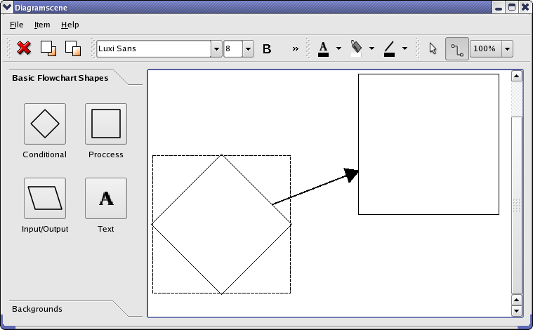

# [Diagram Scene Example](https://doc.qt.io/qt-6/qtwidgets-graphicsview-diagramscene-example.html)

演示如何使用图形视图框架



简单图形场景示例是一个可以创建流程图的应用程序。可以添加流程图形状和文本，并通过箭头连接形状，如上图所示。形状、箭头和文本可以指定不同的颜色，并且可以更改文本的字体、样式和添加下划线。

Qt 图形视图框架旨在管理和显示自定义的 2D 图形项。框架的主要类是 `QGraphicsItem` 、`QGraphicsScene` 和 `QGraphicsView`。图形场景管理图形项并为它们提供外观 (surface)。`QGraphicsView` 是一个用于在屏幕上渲染场景的小部件。参阅 [Graphics View Framework](./Graphics View Framework.md) 以了解该框架的更详细的描述。

在这个示例中，我们展示如何通过实现继承 `QGraphicsScene` 和 `QGraphicsItem` 的类来创建这些自定义图形场景和图形项。

特别地，我们展示了如何：

- 创建自定义图形项
- 处理图形项的鼠标事件和移动
- 实现一个可以管理我们自定义的图形项的图形场景
- 图形项的自定义绘制
- 创建一个可移动和可编辑的文本项

这个示例由以下类组成：

- `MainWindow` 创建小部件并在 `QMainWindow` 中显示它们。它还管理小部件与图形场景、视图和图形项直接的交互
- `DiagramItem` 继承 `QGraphicsPolygonItem`，表示一个流程图形状
- `TextDiagramItem` 继承 `QGraphicsTextItem`，表示流程图中的文本项。该类添加了对使用鼠标移动图形项的支持，`QGraphicsTextItem` 是不支持的
- `Arrow` 继承 `QGraphicsLineItem`，是连接两个 `DiagramItem` 的箭头
- `DiagramScene` 继承 `QGraphicsDiagramScene`，提供对 `DiagramItem`、`Arrow` 和 `DiagramTextItem` 的支持（除了 `QGraphicsScene` 已经处理的支持之外）

## MainWindow Class Definition

```c++
class MainWindow : public QMainWindow
{
    Q_OBJECT

public:
   MainWindow();

private slots:
    void backgroundButtonGroupClicked(QAbstractButton *button);
    void buttonGroupClicked(QAbstractButton *button);
    void deleteItem();
    void pointerGroupClicked();
    void bringToFront();
    void sendToBack();
    void itemInserted(DiagramItem *item);
    void textInserted(QGraphicsTextItem *item);
    void currentFontChanged(const QFont &font);
    void fontSizeChanged(const QString &size);
    void sceneScaleChanged(const QString &scale);
    void textColorChanged();
    void itemColorChanged();
    void lineColorChanged();
    void textButtonTriggered();
    void fillButtonTriggered();
    void lineButtonTriggered();
    void handleFontChange();
    void itemSelected(QGraphicsItem *item);
    void about();

private:
    void createToolBox();
    void createActions();
    void createMenus();
    void createToolbars();
    QWidget *createBackgroundCellWidget(const QString &text,
                                        const QString &image);
    QWidget *createCellWidget(const QString &text,
                              DiagramItem::DiagramType type);
    QMenu *createColorMenu(const char *slot, QColor defaultColor);
    QIcon createColorToolButtonIcon(const QString &image, QColor color);
    QIcon createColorIcon(QColor color);

    DiagramScene *scene;
    QGraphicsView *view;

    QAction *exitAction;
    QAction *addAction;
    QAction *deleteAction;

    QAction *toFrontAction;
    QAction *sendBackAction;
    QAction *aboutAction;

    QMenu *fileMenu;
    QMenu *itemMenu;
    QMenu *aboutMenu;

    QToolBar *textToolBar;
    QToolBar *editToolBar;
    QToolBar *colorToolBar;
    QToolBar *pointerToolbar;

    QComboBox *sceneScaleCombo;
    QComboBox *itemColorCombo;
    QComboBox *textColorCombo;
    QComboBox *fontSizeCombo;
    QFontComboBox *fontCombo;

    QToolBox *toolBox;
    QButtonGroup *buttonGroup;
    QButtonGroup *pointerTypeGroup;
    QButtonGroup *backgroundButtonGroup;
    QToolButton *fontColorToolButton;
    QToolButton *fillColorToolButton;
    QToolButton *lineColorToolButton;
    QAction *boldAction;
    QAction *underlineAction;
    QAction *italicAction;
    QAction *textAction;
    QAction *fillAction;
    QAction *lineAction;
};
```

`MainWindow` 类在一个 `QMainWindow` 中创建和布置小部件。该类将输入从小部件转发到 `DiagramScene`。当流程图场景的文本发生变化，或者一个图形或者文本被加入到场景时，它会更新它的小部件。

该类还实现从场景中删除图形项和处理 z 轴顺序，这决定了项目相互重叠时的绘制顺序。

## MainWindow Class Implementation

我们先来看看构造函数：

```c++
MainWindow::MainWindow()
{
    createActions();
    createToolBox();
    createMenus();

    scene = new DiagramScene(itemMenu, this);
    scene->setSceneRect(QRectF(0, 0, 5000, 5000));
    connect(scene, &DiagramScene::itemInserted,
            this, &MainWindow::itemInserted);
    connect(scene, &DiagramScene::textInserted,
            this, &MainWindow::textInserted);
    connect(scene, &DiagramScene::itemSelected,
            this, &MainWindow::itemSelected);
    createToolbars();

    QHBoxLayout *layout = new QHBoxLayout;
    layout->addWidget(toolBox);
    view = new QGraphicsView(scene);
    layout->addWidget(view);

    QWidget *widget = new QWidget;
    widget->setLayout(layout);

    setCentralWidget(widget);
    setWindowTitle(tr("Diagramscene"));
    setUnifiedTitleAndToolBarOnMac(true);
}
```

在构造函数中，我们在创建流程图场景之前调用方法来创建示例的小部件和布局。工具栏必须在场景连接到其信号之后创建。然后我们将小部件放置到窗口中。

我们连接到 `DiagramScene` 的 ` itemInserted()` 和 `textInserted()` 槽，因为我们想在图形项插入后取消选中工具箱中的按钮。当选中场景中的图形项时，我们会接收到信号 `itemSelected()`。如果被选中的图形项是一个 `DiagramTextItem`，我们使用它来更新小部件的显示文字的属性 (粗体、斜体之类)。

`createToolBox()` 函数创建并布置了工具箱 `QToolBox` 的小部件。我们不会仔细审查它，因为它不涉及图形框架特定的功能。下面是它的实现：

```c++
void MainWindow::createToolBox()
{
    buttonGroup = new QButtonGroup(this);
    buttonGroup->setExclusive(false);
    connect(buttonGroup, QOverload<QAbstractButton *>::of(&QButtonGroup::buttonClicked),
            this, &MainWindow::buttonGroupClicked);
    QGridLayout *layout = new QGridLayout;
    layout->addWidget(createCellWidget(tr("Conditional"), DiagramItem::Conditional), 0, 0);
    layout->addWidget(createCellWidget(tr("Process"), DiagramItem::Step),0, 1);
    layout->addWidget(createCellWidget(tr("Input/Output"), DiagramItem::Io), 1, 0);
```

这部分函数设置包含流程图形状的选项卡式小部件项目。一个排他性 `QButtonGroup` 始终只选中一个按钮；我们希望该组允许取消选中所有的按钮。我们仍然使用按钮组，因为我们可以将用于存储图表类型的用户数据与每个按钮关联起来。`createCellWidget()` 函数在选项卡式小部件项目中设置按钮，并在稍后进行检查。

背景选项卡式小部件项目的按钮以相同的方式设置，所以我们跳到工具箱的创建：

```c++
toolBox = new QToolBox;
    toolBox->setSizePolicy(QSizePolicy(QSizePolicy::Maximum, QSizePolicy::Ignored));
    toolBox->setMinimumWidth(itemWidget->sizeHint().width());
    toolBox->addItem(itemWidget, tr("Basic Flowchart Shapes"));
    toolBox->addItem(backgroundWidget, tr("Backgrounds"));
}
```

我们将工具箱的首选大小设置为其最大值。通过这种方式，可以为图形视图提供更多的控件。

下面是 `createActions()` 函数：

```c++
void MainWindow::createActions()
{
    toFrontAction = new QAction(QIcon(":/images/bringtofront.png"),
                                tr("Bring to &Front"), this);
    toFrontAction->setShortcut(tr("Ctrl+F"));
    toFrontAction->setStatusTip(tr("Bring item to front"));
    connect(toFrontAction, &QAction::triggered, this, &MainWindow::bringToFront);
```

我们展示了创建动作的示例。动作触发的功能在我们将动作连接槽中进行讨论。如果你需要动作的高级介绍，可以查看[应用程序示例](https://doc.qt.io/qt-6/qtwidgets-mainwindows-application-example.html)。

下面是 `createMenus()` 函数：

```c++
void MainWindow::createMenus()
{
    fileMenu = menuBar()->addMenu(tr("&File"));
    fileMenu->addAction(exitAction);

    itemMenu = menuBar()->addMenu(tr("&Item"));
    itemMenu->addAction(deleteAction);
    itemMenu->addSeparator();
    itemMenu->addAction(toFrontAction);
    itemMenu->addAction(sendBackAction);

    aboutMenu = menuBar()->addMenu(tr("&Help"));
    aboutMenu->addAction(aboutAction);
}
```

我们在这个示例中创建了三个菜单。

`createToolbars()` 函数设置示例的工具栏。`colorToolBar` 中的三个 `QToolButtons`，`fontColorButton`、`fillColorToolButton` 和 `lineColorToolButton` 很有趣，因为我们通过使用 `QPainter` 在 `QPixmap` 上绘制来为它们创建图标。我们展示了 `fillColorToolButton` 是如何被创建的。此按钮允许用户为流程图的图形选择颜色。

```c++
void MainWindow::createToolbars()
{
    ...
    fillColorToolButton = new QToolButton;
    fillColorToolButton->setPopupMode(QToolButton::MenuButtonPopup);
    fillColorToolButton->setMenu(createColorMenu(SLOT(itemColorChanged()), Qt::white));
    fillAction = fillColorToolButton->menu()->defaultAction();
    fillColorToolButton->setIcon(createColorToolButtonIcon(
                                     ":/images/floodfill.png", Qt::white));
    connect(fillColorToolButton, &QAbstractButton::clicked,
            this, &MainWindow::fillButtonTriggered);
    ...
}
```

我们用 `setMenu()` 来设置工具按钮的菜单。我们需要 `QAction` 对象 `fillAction` 始终指向菜单中选中的动作。该菜单是使用 `createColorMenu()` 函数创建的，正如我们稍后将看到的，它包含一个菜单项，设置每个图形项可以用的颜色。当用户按下按钮时，触发 `clicked()` 信号，我们将选中颜色的设置为 `fillAction` 的颜色。通过 `createColorToolButtonIcon()`，我们为按钮创建图标。

下面是 `createBackgroundCellWidget()` 函数：

```c++
QWidget *MainWindow::createBackgroundCellWidget(const QString &text, const QString &image)
{
    QToolButton *button = new QToolButton;
    button->setText(text);
    button->setIcon(QIcon(image));
    button->setIconSize(QSize(50, 50));
    button->setCheckable(true);
    backgroundButtonGroup->addButton(button);

    QGridLayout *layout = new QGridLayout;
    layout->addWidget(button, 0, 0, Qt::AlignHCenter);
    layout->addWidget(new QLabel(text), 1, 0, Qt::AlignCenter);

    QWidget *widget = new QWidget;
    widget->setLayout(layout);

    return widget;
}
```

这个函数创建包含一个工具按钮和一个标签的 `QWidget` 小部件。使用此函数创建的小部件被用于工具箱中的背景选项卡式小部件项目。

下面是 `createCellWidget()` 函数：

```c++
QWidget *MainWindow::createBackgroundCellWidget(const QString &text, const QString &image)
{
    QToolButton *button = new QToolButton;
    button->setText(text);
    button->setIcon(QIcon(image));
    button->setIconSize(QSize(50, 50));
    button->setCheckable(true);
    backgroundButtonGroup->addButton(button);

    QGridLayout *layout = new QGridLayout;
    layout->addWidget(button, 0, 0, Qt::AlignHCenter);
    layout->addWidget(new QLabel(text), 1, 0, Qt::AlignCenter);

    QWidget *widget = new QWidget;
    widget->setLayout(layout);

    return widget;
}
```

这个函数返回一个包含具有 `DiagramItems` 之一的图像 (即流程图形状) 的 `QToolButton` 的 `QWidget`。图像由 `DiagramItem`  通过 `image()` 函数创建。`QButtonGroup` 类允许我们为每个按钮附件一个 id (int)；我们存储图形的类型，即枚举 `DiagramItem::DiagramType`。当我们为场景创建新的流程图项时，我们使用存储的流程图类型。使用此函数创建的小部件被用于工具箱。

下面是 `createColorMenu()` 函数：

```c++
QMenu *MainWindow::createColorMenu(const char *slot, QColor defaultColor)
{
    QList<QColor> colors;
    colors << Qt::black << Qt::white << Qt::red << Qt::blue << Qt::yellow;
    QStringList names;
    names << tr("black") << tr("white") << tr("red") << tr("blue")
          << tr("yellow");

    QMenu *colorMenu = new QMenu(this);
    for (int i = 0; i < colors.count(); ++i) {
        QAction *action = new QAction(names.at(i), this);
        action->setData(colors.at(i));
        action->setIcon(createColorIcon(colors.at(i)));
        connect(action, SIGNAL(triggered()), this, slot);
        colorMenu->addAction(action);
        if (colors.at(i) == defaultColor)
            colorMenu->setDefaultAction(action);
    }
    return colorMenu;
}
```

这个函数创建一个颜色菜单，用作于 `colorToolBar` 中工具按钮的下拉菜单。我们为添加到菜单中的每种颜色创建一个动作。当我们为流程图项、线、文本设置颜色时，我们获取动作 (action) 的数据。

下面是 `createColorToolButtonIcon()` 函数：

```c++
QIcon MainWindow::createColorToolButtonIcon(const QString &imageFile, QColor color)
{
    QPixmap pixmap(50, 80);
    pixmap.fill(Qt::transparent);
    QPainter painter(&pixmap);
    QPixmap image(imageFile);
    // Draw icon centred horizontally on button.
    QRect target(4, 0, 42, 43);
    QRect source(0, 0, 42, 43);
    painter.fillRect(QRect(0, 60, 50, 80), color);
    painter.drawPixmap(target, image, source);

    return QIcon(pixmap);
}
```

这个函数用于创建 `fillColorToolButton`、`fontColorToolButton` 和 `lineColorToolButton` 的 `QIcon`。`imageFile` 下面的是用于按钮的文本、填充或者线条符号。图像下面我们绘制了一个带颜色的矩形。

下面是 `createColorIcon()` 函数

```c++
QIcon MainWindow::createColorIcon(QColor color)
{
    QPixmap pixmap(20, 20);
    QPainter painter(&pixmap);
    painter.setPen(Qt::NoPen);
    painter.fillRect(QRect(0, 0, 20, 20), color);

    return QIcon(pixmap);
}
```

这个函数创建一个带颜色填充的矩形图标。它被用于为 `fillCOlorToolButton`、`fontColorToolButton` 和 `lineColorToolButton` 中的颜色菜单创建图标。

下面是 `backgroundButtonGroupClicked()` 槽：

```c++
void MainWindow::backgroundButtonGroupClicked(QAbstractButton *button)
{
    const QList<QAbstractButton *> buttons = backgroundButtonGroup->buttons();
    for (QAbstractButton *myButton : buttons) {
        if (myButton != button)
            button->setChecked(false);
    }
    QString text = button->text();
    if (text == tr("Blue Grid"))
        scene->setBackgroundBrush(QPixmap(":/images/background1.png"));
    else if (text == tr("White Grid"))
        scene->setBackgroundBrush(QPixmap(":/images/background2.png"));
    else if (text == tr("Gray Grid"))
        scene->setBackgroundBrush(QPixmap(":/images/background3.png"));
    else
        scene->setBackgroundBrush(QPixmap(":/images/background4.png"));

    scene->update();
    view->update();
}
```

在这个函数中，我们设置用于绘制流程图场景背景的 `QBrush`。背景可以是蓝色、灰色或者白色方块网格，或者根本没有网格。我们从创建画刷的 png 文件中获得了瓷砖的 `QPixmap`。

单击背景选项卡式的小部件项目中的按钮之一时，我们改变画刷；我们通过检查按钮的文本找出它是那个按钮。

下面是是 `buttonGroupClicked()` 的实现：

```c++
void MainWindow::buttonGroupClicked(QAbstractButton *button)
{
    const QList<QAbstractButton *> buttons = buttonGroup->buttons();
    for (QAbstractButton *myButton : buttons) {
        if (myButton != button)
            button->setChecked(false);
    }
    const int id = buttonGroup->id(button);
    if (id == InsertTextButton) {
        scene->setMode(DiagramScene::InsertText);
    } else {
        scene->setItemType(DiagramItem::DiagramType(id));
        scene->setMode(DiagramScene::InsertItem);
    }
}
```

当 `buttonGroup` 中的一个按钮被按下时会调用这个槽函数。选中按钮后，用户可以单击图像视图，然后一个所选类型的 `DiagramItem` 会被添加进 `DiagramScene`。我们必须遍历组中的按钮以取消其他按钮，因为一次只允许选中一个按钮。

`QButtonGroup` 为每个按钮分配一个 id。我们将每个按钮的 id 设置为流程图类型，由 `DiagramItem::DiagramType` 给出，单击时添加到场景中。然后我们可以在使用 `setItemType()` 时使用按钮 id 设置流程图的类型。对于文本，我们分配了一个值不在 `DiagramType` 枚举中的 id。

下面是 `deleteItem()` 的实现：

```c++
void MainWindow::deleteItem()
{
    QList<QGraphicsItem *> selectedItems = scene->selectedItems();
    for (QGraphicsItem *item : std::as_const(selectedItems)) {
        if (item->type() == Arrow::Type) {
            scene->removeItem(item);
            Arrow *arrow = qgraphicsitem_cast<Arrow *>(item);
            arrow->startItem()->removeArrow(arrow);
            arrow->endItem()->removeArrow(arrow);
            delete item;
        }
    }

    selectedItems = scene->selectedItems();
    for (QGraphicsItem *item : std::as_const(selectedItems)) {
         if (item->type() == DiagramItem::Type)
             qgraphicsitem_cast<DiagramItem *>(item)->removeArrows();
         scene->removeItem(item);
         delete item;
     }
}
```

这个槽函数从场景中删除图像项 (如果有)。它首先删除箭头避免它们删除两次。如果被删除的项目是一个 `DiagramItem`，我们还要删除与其相连的箭头；我们不希望场景中的箭头的两端没有连接到项目。

下面是 `pointerGroupClicked()` 的实现：

```c++
void MainWindow::pointerGroupClicked()
{
    scene->setMode(DiagramScene::Mode(pointerTypeGroup->checkedId()));
}
```

`pointerTypeGroup` 决定场景是处于 `ItemMove` 还是 `InsertLine` 模式。这个按钮是排他性的，即任何时候只勾选一个按钮。与上面的 `buttonGroup` 一样，我们为每个按钮分配了一个匹配 `DiagramScene::Mode` 枚举的值的 id，这样我们使用该 id 来设置正确的模式。

下面是 `bringToFront()` 槽函数：

```c++
void MainWindow::bringToFront()
{
    if (scene->selectedItems().isEmpty())
        return;

    QGraphicsItem *selectedItem = scene->selectedItems().first();
    const QList<QGraphicsItem *> overlapItems = selectedItem->collidingItems();

    qreal zValue = 0;
    for (const QGraphicsItem *item : overlapItems) {
        if (item->zValue() >= zValue && item->type() == DiagramItem::Type)
            zValue = item->zValue() + 0.1;
    }
    selectedItem->setZValue(zValue);
}
```

在场景中的多个图形项可能发生碰撞，即重叠。当用户请求将一个图形项放置在与其碰撞的图形项之上时调用这个槽函数。`QGraphicsItem` 有一个 `z` 值，它决定了图形在场景中的堆叠顺序；你可以将其视为 3D 坐标系中的 z 轴。当图形项发生碰撞时，具有较高 `z` 值的图形将被绘制在具有较低 `z` 值的图形值上。当我们将一个图形放到最前面时，我们可以遍历与它相碰撞的图形项，然后设置一个高于所有图形的 `z` 值。

下面是 `sendToBack()` 槽函数：

```c++
void MainWindow::sendToBack()
{
    if (scene->selectedItems().isEmpty())
        return;

    QGraphicsItem *selectedItem = scene->selectedItems().first();
    const QList<QGraphicsItem *> overlapItems = selectedItem->collidingItems();

    qreal zValue = 0;
    for (const QGraphicsItem *item : overlapItems) {
        if (item->zValue() <= zValue && item->type() == DiagramItem::Type)
            zValue = item->zValue() - 0.1;
    }
    selectedItem->setZValue(zValue);
}
```

这个槽函数的原理与上述 `bringToFron()` 相同，但图形要设置的 `z` 值低于与其相碰撞的其他图形的值。

下面是 `itemInserted()` 的实现：

```c++
void MainWindow::itemInserted(DiagramItem *item)
{
    pointerTypeGroup->button(int(DiagramScene::MoveItem))->setChecked(true);
    scene->setMode(DiagramScene::Mode(pointerTypeGroup->checkedId()));
    buttonGroup->button(int(item->diagramType()))->setChecked(false);
}
```

当一个图形项被添加到场景中时，这个槽函数被 `DiagramScene` 调用。我们将场景的模式设置回插入图形之前的模式，即 `ItemMove` 或 `InsertText`，具体取决于 `pointerTypeGroup` 中按下的按钮。我们还必须取消选中 `buttonGroup` 中的按钮。

下面是 `textInserted()` 的实现：

```c++
void MainWindow::textInserted(QGraphicsTextItem *)
{
    buttonGroup->button(InsertTextButton)->setChecked(false);
    scene->setMode(DiagramScene::Mode(pointerTypeGroup->checkedId()));
}
```

我们简单地将场景的模式设置回插入文本之前的模式。

下面是 `currentFontChanged()` 槽函数：

```c++
void MainWindow::currentFontChanged(const QFont &)
{
    handleFontChange();
}
```

当用户请求改变字体时，通过使用 `fontToolBar` 中的一个小部件，我们创建一个新的 `QFont` 对象并设置其属性以匹配小部件的状态。这是在 `handleFontChange()` 中完成的，所以我们只是简单地调用这个函数。

下面是 `fontSizeChanged()` 槽函数：

```c++
void MainWindow::fontSizeChanged(const QString &)
{
    handleFontChange();
}
```

当用户请求改变字体大小时，通过使用 `fontToolBar` 中的一个小部件，我们创建一个新的 `QFont` 对象并设置其属性以匹配小部件的状态。这是在 `handleFontChange()` 中完成的，所以我们只是简单地调用这个函数。

下面是 `sceneScaleChanged()` 的实现：

```c++
void MainWindow::sceneScaleChanged(const QString &scale)
{
    double newScale = scale.left(scale.indexOf(tr("%"))).toDouble() / 100.0;
    QTransform oldMatrix = view->transform();
    view->resetTransform();
    view->translate(oldMatrix.dx(), oldMatrix.dy());
    view->scale(newScale, newScale);
}
```

用户可以增大或者减小比例，使用 `sceneScaleCombo`，绘制场景。改变比例的并不是场景本身，而只是视图 (即只是放大缩小视觉效果，场景和图形项的实际大小不改变) 。

下面是 `textColorChanged()` 槽：

```c++
void MainWindow::textColorChanged()
{
    textAction = qobject_cast<QAction *>(sender());
    fontColorToolButton->setIcon(createColorToolButtonIcon(
                                     ":/images/textpointer.png",
                                     qvariant_cast<QColor>(textAction->data())));
    textButtonTriggered();
}
```

当按下 `fontColorToolButton` 中的下拉菜单中的项目被按下时调用这个槽函数。我们需要将按钮上图标更改为所选 `QAction` 的颜色。我们在 `textAction` 中保留一个指向所选动作的指针。它正是在 `textButtonTriggered()` 中我们将文本颜色更改为 `textAction` 的颜色，因此我们调用这个槽。

下面是 `itemColorChanged()` 的实现：

```c++
void MainWindow::itemColorChanged()
{
    fillAction = qobject_cast<QAction *>(sender());
    fillColorToolButton->setIcon(createColorToolButtonIcon(
                                     ":/images/floodfill.png",
                                     qvariant_cast<QColor>(fillAction->data())));
    fillButtonTriggered();
}
```

这个槽函数以与 `textColorChanged()` 同样的方式处理更改 `DiagramItem` 颜色的请求。

下面是 `lineColorChanged()` 的实现：

```c++
void MainWindow::lineColorChanged()
{
    lineAction = qobject_cast<QAction *>(sender());
    lineColorToolButton->setIcon(createColorToolButtonIcon(
                                     ":/images/linecolor.png",
                                     qvariant_cast<QColor>(lineAction->data())));
    lineButtonTriggered();
}
```

这个槽函数以与 `DiagramTextItem` 的 `textColorChanged()` 相同的方式处理更改 `Arrow` 颜色的请求。

下面是 `textButtonTriggered()` 槽函数：

```c++
void MainWindow::textButtonTriggered()
{
    scene->setTextColor(qvariant_cast<QColor>(textAction->data()));
}
```

`textAction` 指向 `fontColorToolButton` 的颜色下拉菜单中当前选中的菜单项。我们已经将动作的数据设置为动作所代表的 `QColor`，因此我们可以在用 `setTextColor()` 设置文本的颜色时获取它。

下面是 `fillButtonTriggered()` 槽函数：

```c++
void MainWindow::fillButtonTriggered()
{
    scene->setItemColor(qvariant_cast<QColor>(fillAction->data()));
}
```

`fillAction` 指向 `fillColorToolButton` 的颜色下拉菜单中当前选中的菜单项。因此我们可以在使用 `setItemColor()` 设置图形项的颜色时使用此动作的数据。

下面是 `lineButtonTriggered()` 槽函数：

```c++
void MainWindow::lineButtonTriggered()
{
    scene->setLineColor(qvariant_cast<QColor>(lineAction->data()));
}
```

`lineAction` 指向 `lineColorToolButton` 的下拉菜单中选中的菜单项。当我们使用 `setLineColor()` 来设置箭头颜色时使用它的数据。

下面是 `handleFontChange()` 函数：

```c++
void MainWindow::handleFontChange()
{
    QFont font = fontCombo->currentFont();
    font.setPointSize(fontSizeCombo->currentText().toInt());
    font.setWeight(boldAction->isChecked() ? QFont::Bold : QFont::Normal);
    font.setItalic(italicAction->isChecked());
    font.setUnderline(underlineAction->isChecked());

    scene->setFont(font);
}
```

`handleFontChange()` 在任何小部件的显示字体属性发生改变时调用。我们创建一个新的 `QFont` 对象并基于小部件设置它的属性。然后我们调用 `DiagramScene` 的 `setFont()` 函数；它是设置场景管理的  `DiagramTextItem` 的字体。

下面是 `itemSelected()` 槽函数：

```c++
void MainWindow::itemSelected(QGraphicsItem *item)
{
    DiagramTextItem *textItem =
    qgraphicsitem_cast<DiagramTextItem *>(item);

    QFont font = textItem->font();
    fontCombo->setCurrentFont(font);
    fontSizeCombo->setEditText(QString().setNum(font.pointSize()));
    boldAction->setChecked(font.weight() == QFont::Bold);
    italicAction->setChecked(font.italic());
    underlineAction->setChecked(font.underline());
}
```

这个槽函数在 `DiagramScene` 中的项目被选中时被调用。在本例中，只有文本项在本选中时会发出信号，因此我们不需要检查图形项的类型。

下面是 `about()` 槽函数：

```c++
void MainWindow::about()
{
    QMessageBox::about(this, tr("About Diagram Scene"),
                       tr("The <b>Diagram Scene</b> example shows "
                          "use of the graphics framework."));
}
```

当用户从帮助菜单中选中关于菜单项时，这个槽函数会为本示例展示一个关于框。

## DiagramScene Class Definition

`DiagramScene` 继承自 `QGraphicsScene` 类，除了它的超类处理的项目之外，添加了对 `DiagramItem`、`Arrow` 和 `DiagramTextItem` 的处理。

```c++
class DiagramScene : public QGraphicsScene
{
    Q_OBJECT

public:
    enum Mode { InsertItem, InsertLine, InsertText, MoveItem };

    explicit DiagramScene(QMenu *itemMenu, QObject *parent = nullptr);
    QFont font() const { return myFont; }
    QColor textColor() const { return myTextColor; }
    QColor itemColor() const { return myItemColor; }
    QColor lineColor() const { return myLineColor; }
    void setLineColor(const QColor &color);
    void setTextColor(const QColor &color);
    void setItemColor(const QColor &color);
    void setFont(const QFont &font);

public slots:
    void setMode(Mode mode);
    void setItemType(DiagramItem::DiagramType type);
    void editorLostFocus(DiagramTextItem *item);

signals:
    void itemInserted(DiagramItem *item);
    void textInserted(QGraphicsTextItem *item);
    void itemSelected(QGraphicsItem *item);

protected:
    void mousePressEvent(QGraphicsSceneMouseEvent *mouseEvent) override;
    void mouseMoveEvent(QGraphicsSceneMouseEvent *mouseEvent) override;
    void mouseReleaseEvent(QGraphicsSceneMouseEvent *mouseEvent) override;

private:
    bool isItemChange(int type) const;

    DiagramItem::DiagramType myItemType;
    QMenu *myItemMenu;
    Mode myMode;
    bool leftButtonDown;
    QPointF startPoint;
    QGraphicsLineItem *line;
    QFont myFont;
    DiagramTextItem *textItem;
    QColor myTextColor;
    QColor myItemColor;
    QColor myLineColor;
};
```

在 `DiagramScene` 中一个鼠标点击可以给出三种不同的动作：可以移动鼠标下的图形项，可以添加流程图项，或者可以在流程图项目之间添加连接箭头。鼠标点击的动作取决于场景所处的模式，由枚举 `Mode` 给出。模式由 `setMode()` 函数设置。

场景还设置其内项目的颜色和文本项的字体。场景使用的颜色和字体可以通过 `setLineColor()`、`setTextColor()`、`setItemColor()` 和 `setFont()` 函数设置。`DiagramItem` 的类型由 `DiagramItem::DiagramType` 函数给出，在插入项目时使用 `setItemType()` 槽函数创建。

`MainWindow` 和 `DiagramScene` 共同分担示例的功能性职责。`MainWindow` 处理以下任务：删除项目、文本和箭头；将流程图项目移到后面和前面；设置场景的比例。

## DiagramScene Class Implementation

我们从构造函数开始：

```c++
DiagramScene::DiagramScene(QMenu *itemMenu, QObject *parent)
    : QGraphicsScene(parent)
{
    myItemMenu = itemMenu;
    myMode = MoveItem;
    myItemType = DiagramItem::Step;
    line = nullptr;
    textItem = nullptr;
    myItemColor = Qt::white;
    myTextColor = Qt::black;
    myLineColor = Qt::black;
}
```

场景使用 `myItemMenu` 在创建 `DiagramItem` 时设置上下文菜单。我们将默认模式设置为 `DiagramScene::MoveItem`，因为这是 `QGraphicsScene` 的默认行为。

下面是 `setLineColor` 函数：

```c++
void DiagramScene::setLineColor(const QColor &color)
{
    myLineColor = color;
    if (isItemChange(Arrow::Type)) {
        Arrow *item = qgraphicsitem_cast<Arrow *>(selectedItems().first());
        item->setColor(myLineColor);
        update();
    }
}
```

如果一个 `Arrow` 项在场景中被选中，`isItemChange` 返回 `true`，在此情况下我们想改变它的颜色。当 `DiagramScene` 创建并添加新的 `Arrow` 到场景中时，它也会使用新的颜色。

下面是 `setTextColor()` 函数：

```c++
void DiagramScene::setTextColor(const QColor &color)
{
    myTextColor = color;
    if (isItemChange(DiagramTextItem::Type)) {
        DiagramTextItem *item = qgraphicsitem_cast<DiagramTextItem *>(selectedItems().first());
        item->setDefaultTextColor(myTextColor);
    }
}
```

这个函数设置 `DiagramTextItem` 项的颜色的方式和设置 `Arrow` 的颜色的 `setLineColor` 相同。

下面是 `setItemColor()` 函数：

```c++
void DiagramScene::setItemColor(const QColor &color)
{
    myItemColor = color;
    if (isItemChange(DiagramItem::Type)) {
        DiagramItem *item = qgraphicsitem_cast<DiagramItem *>(selectedItems().first());
        item->setBrush(myItemColor);
    }
}
```

此函数在场景创建 `DiagramItems` 时使用。它也会改变选中的 `DiagramItem` 的颜色。

下面是 `setFont()` 的实现：

```c++
void DiagramScene::setFont(const QFont &font)
{
    myFont = font;

    if (isItemChange(DiagramTextItem::Type)) {
        QGraphicsTextItem *item = qgraphicsitem_cast<DiagramTextItem *>(selectedItems().first());
        //At this point the selection can change so the first selected item might not be a DiagramTextItem
        if (item)
            item->setFont(myFont);
    }
}
```

如果选中了文本项，为新的和选中的文本项 `DiagramTextItem` 设置字体。

下面是 `editorLostFocus()` 槽函数的实现：

```c++
void DiagramScene::editorLostFocus(DiagramTextItem *item)
{
    QTextCursor cursor = item->textCursor();
    cursor.clearSelection();
    item->setTextCursor(cursor);

    if (item->toPlainText().isEmpty()) {
        removeItem(item);
        item->deleteLater();
    }
}
```

当 `DiagramTextItem` 丢失焦点时会发出一个信号，该信号连接到这个槽函数。如果项目没有文本，我们将其删除。否则，我们会泄露内存，并让用户迷惑，因为当鼠标按下时项目将被编辑。

`mousePressEvent()` 函数根据 `DiagramScene` 所处的模式处理鼠标按下事件的不同情况。我们检查每种模式的实现：

```c++
void DiagramScene::mousePressEvent(QGraphicsSceneMouseEvent *mouseEvent)
{
    if (mouseEvent->button() != Qt::LeftButton)
        return;

    DiagramItem *item;
    switch (myMode) {
        case InsertItem:
            item = new DiagramItem(myItemType, myItemMenu);
            item->setBrush(myItemColor);
            addItem(item);
            item->setPos(mouseEvent->scenePos());
            emit itemInserted(item);
            break;
```

`InsertItem` 模式，我们只是创建一个新的 `DiagramItem` 并将其添加到场景中鼠标按下的位置。请注意，其局部坐标系的原理将位于鼠标指针下方.

```c++
		case InsertLine:
            line = new QGraphicsLineItem(QLineF(mouseEvent->scenePos(),
                                        mouseEvent->scenePos()));
            line->setPen(QPen(myLineColor, 2));
            addItem(line);
            break;
```

`InsertLine` 模式，用户通过在要连接的项目之间拉一条线来添加 `Arrow` 到场景中。线的起点固定在用户单击鼠标的位置，只要按住鼠标按键，终点就会跟随鼠标指针。当用户释放鼠标按键时，如果线的起点和终点下方有一个 `DiagramItem`，则会添加一个 `Arrow` 到场景中。稍后我们会看到这是如何实现的，这里我们只需要添加线。

```c++
		case InsertText:
            textItem = new DiagramTextItem();
            textItem->setFont(myFont);
            textItem->setTextInteractionFlags(Qt::TextEditorInteraction);
            textItem->setZValue(1000.0);
            connect(textItem, &DiagramTextItem::lostFocus,
                    this, &DiagramScene::editorLostFocus);
            connect(textItem, &DiagramTextItem::selectedChange,
                    this, &DiagramScene::itemSelected);
            addItem(textItem);
            textItem->setDefaultTextColor(myTextColor);
            textItem->setPos(mouseEvent->scenePos());
            emit textInserted(textItem);
```

`InsertText` 模式，当 `Qt::TextEditorInteraction` 标志被设置时，`DiagramTextItem` 是可编辑的，否则它能被鼠标拖动。我们总是希望文本项绘制在场景中的其他项目之上，因此我们将值设置为高于场景中的其他项目的数字。

```c++
    default:
        ;
	}
    QGraphicsScene::mousePressEvent(mouseEvent);
}
```

如果我们达到默认开关，我们就处于 `MoveItem` 模式；然后我们可以调用 `QGraphicsScene` 的实现，它用鼠标处理图形项的移动。即使我们处于另一种模式下，我们也会进行此调用，从而可以添加一个项目，然后按住鼠标按键并开始移动它。对于文本项，这是不可能的，因为它们在可编辑状态时不会传播鼠标事件。

下面是 `mouseMoveEvent()` 函数：

```c++
void DiagramScene::mouseMoveEvent(QGraphicsSceneMouseEvent *mouseEvent)
{
    if (myMode == InsertLine && line != nullptr) {
        QLineF newLine(line->line().p1(), mouseEvent->scenePos());
        line->setLine(newLine);
    } else if (myMode == MoveItem) {
        QGraphicsScene::mouseMoveEvent(mouseEvent);
    }
}
```

如果我们处于 `InsertMode` 并且鼠标按键被按下，且 `line` 不为空，我们必须画线。如 `mousePressEvent()` 中所述，线是从按下鼠标的位置到鼠标当前的位置绘制的。

如果我们处于 `MoveItem` 模式，我们调用 `QGraphicsScene` 的实现，它处理图形项的移动。

在 `mouseReleaseEvent()` 函数中，我们需要检查是否将箭头添加到场景中：

```c++
void DiagramScene::mouseReleaseEvent(QGraphicsSceneMouseEvent *mouseEvent)
{
    if (line != nullptr && myMode == InsertLine) {
        QList<QGraphicsItem *> startItems = items(line->line().p1());
        if (startItems.count() && startItems.first() == line)
            startItems.removeFirst();
        QList<QGraphicsItem *> endItems = items(line->line().p2());
        if (endItems.count() && endItems.first() == line)
            endItems.removeFirst();

        removeItem(line);
        delete line;
```

首先我们需要获取线的起点和终点下的项目 (如果有的话)。线本身是这些点的第一个图形项，因此我们将其从列表中删除。作为预防措施，我们检查列表是否为空，但这应该永远不会发生。

```c++
        if (startItems.count() > 0 && endItems.count() > 0 &&
            startItems.first()->type() == DiagramItem::Type &&
            endItems.first()->type() == DiagramItem::Type &&
            startItems.first() != endItems.first()) {
            DiagramItem *startItem = qgraphicsitem_cast<DiagramItem *>(startItems.first());
            DiagramItem *endItem = qgraphicsitem_cast<DiagramItem *>(endItems.first());
            Arrow *arrow = new Arrow(startItem, endItem);
            arrow->setColor(myLineColor);
            startItem->addArrow(arrow);
            endItem->addArrow(arrow);
            arrow->setZValue(-1000.0);
            addItem(arrow);
            arrow->updatePosition();
        }
    }
```

现在我们检查是否有两个不同的 `DiagramItem` 在线的起点和终点之下。如果有，我们可以用这两个项目创建应该 `Arrow`。然后箭头被添加到每个项目，最后添加到场景中。必须更新箭头以将其起点和终点调整到项目。我们将箭头的 `z` 值设为 -1000.0，因为我们总是希望它绘制在项目之下。

```c++
    line = nullptr;
    QGraphicsScene::mouseReleaseEvent(mouseEvent);
}
```

下面是 `isItemChange()` 函数

```c++
bool DiagramScene::isItemChange(int type) const
{
    const QList<QGraphicsItem *> items = selectedItems();
    const auto cb = [type](const QGraphicsItem *item) { return item->type() == type; };
    return std::find_if(items.begin(), items.end(), cb) != items.end();
}
```

场景有单一选中，即在任何给定时间只能选中一个项目。然后 for 循环将使用所选项目循环一次，如果未选中任何项目，则不循环。`isItemChange()` 用于检查项目是否存在以及是否属于指定的流程图类型。

## DiagramItem Class Definition

```c++
class DiagramItem : public QGraphicsPolygonItem
{
public:
    enum { Type = UserType + 15 };
    enum DiagramType { Step, Conditional, StartEnd, Io };

    DiagramItem(DiagramType diagramType, QMenu *contextMenu, QGraphicsItem *parent = nullptr);

    void removeArrow(Arrow *arrow);
    void removeArrows();
    DiagramType diagramType() const { return myDiagramType; }
    QPolygonF polygon() const { return myPolygon; }
    void addArrow(Arrow *arrow);
    QPixmap image() const;
    int type() const override { return Type; }

protected:
    void contextMenuEvent(QGraphicsSceneContextMenuEvent *event) override;
    QVariant itemChange(GraphicsItemChange change, const QVariant &value) override;

private:
    DiagramType myDiagramType;
    QPolygonF myPolygon;
    QMenu *myContextMenu;
    QList<Arrow *> arrows;
};
```

`DiagramItem` 表示 `DiagramScene` 中的流程图形状。它继承自 `QGraphicsPolygonItem` 并且每个形状都有一个多边形。枚举 `DiagramType` 对每个流程图形状都有一个对应的值。

该类有一个连接到它的箭头列表。这是必要的，因为只有项目知道它何时被移动 (使用 `itemChanged()` 函数)，此时箭头必须更新。该项还可以使用 `image()` 函数将自己绘制到一个 `QPixmap` 上。这被用于 `MainWindow` 中工具按钮，参加 `MainWindow` 中的 `createColorToolButtonIcon()`。

`Type` 枚举是类的唯一标识。它被用于 `qgraphicsitem_cast()`，执行图形项的动态转换。`UserType` 常量是自定义图形项类型的最小值。

## DiagramItem Class Implementation

我们先来看看构造函数：

```c++
DiagramItem::DiagramItem(DiagramType diagramType, QMenu *contextMenu,
                         QGraphicsItem *parent)
    : QGraphicsPolygonItem(parent), myDiagramType(diagramType)
    , myContextMenu(contextMenu)
{
    QPainterPath path;
    switch (myDiagramType) {
        case StartEnd:
            path.moveTo(200, 50);
            path.arcTo(150, 0, 50, 50, 0, 90);
            path.arcTo(50, 0, 50, 50, 90, 90);
            path.arcTo(50, 50, 50, 50, 180, 90);
            path.arcTo(150, 50, 50, 50, 270, 90);
            path.lineTo(200, 25);
            myPolygon = path.toFillPolygon();
            break;
        case Conditional:
            myPolygon << QPointF(-100, 0) << QPointF(0, 100)
                      << QPointF(100, 0) << QPointF(0, -100)
                      << QPointF(-100, 0);
            break;
        case Step:
            myPolygon << QPointF(-100, -100) << QPointF(100, -100)
                      << QPointF(100, 100) << QPointF(-100, 100)
                      << QPointF(-100, -100);
            break;
        default:
            myPolygon << QPointF(-120, -80) << QPointF(-70, 80)
                      << QPointF(120, 80) << QPointF(70, -80)
                      << QPointF(-120, -80);
            break;
    }
    setPolygon(myPolygon);
    setFlag(QGraphicsItem::ItemIsMovable, true);
    setFlag(QGraphicsItem::ItemIsSelectable, true);
    setFlag(QGraphicsItem::ItemSendsGeometryChanges, true);
}
```

在构造函数中，我们根据 `diagramType` 来创建多边形。`QGraphicsItem` 默认情况下是不可移动或不可选中的，因此我们必须设置这些属性。

下面是 `removeArrow()` 函数：

```c++
void DiagramItem::removeArrow(Arrow *arrow)
{
    arrows.removeAll(arrow);
}
```

`removeArrow()` 用于在删除箭头或者箭头所连接到的 `DiagramItem` 从场景中移除时移除 `Arrow` 项。

下面是 `removeArrows()` 函数：

```c++
void DiagramItem::removeArrows()
{
    // need a copy here since removeArrow() will
    // modify the arrows container
    const auto arrowsCopy = arrows;
    for (Arrow *arrow : arrowsCopy) {
        arrow->startItem()->removeArrow(arrow);
        arrow->endItem()->removeArrow(arrow);
        scene()->removeItem(arrow);
        delete arrow;
    }
}
```

当图形项从场景中移除并移除连接到该项的所有箭头时调用此函数。箭头必须同时从它的开始项和结束项的 `arrows` 列表中移除。由于开始项或结束项是调用此函数的对象，因此我们必须确保处理 `arrows` 的副本，因为 `removeArrow()` 正在修改此容器。

下面是 `addArrow()` 函数：

```c++
void DiagramItem::addArrow(Arrow *arrow)
{
    arrows.append(arrow);
}
```

此函数只是将 `arrow` 添加到项目的 `arrows` 列表中。

下面是 `image()` 函数：

```c++
QPixmap DiagramItem::image() const
{
    QPixmap pixmap(250, 250);
    pixmap.fill(Qt::transparent);
    QPainter painter(&pixmap);
    painter.setPen(QPen(Qt::black, 8));
    painter.translate(125, 125);
    painter.drawPolyline(myPolygon);

    return pixmap;
}
```

此函数将图形项的多边形绘制到 `QPixmap` 上。在这个示例中，我们使用它来为工具按键创建图标。

下面是 `contextMenuEvent()` 函数：

```c++
void DiagramItem::contextMenuEvent(QGraphicsSceneContextMenuEvent *event)
{
    scene()->clearSelection();
    setSelected(true);
    myContextMenu->exec(event->screenPos());
}
```

我们显示上下文菜单。单击鼠标右键时，显示菜单，模型情况下不选项目，我们使用 `setSelected()` 设置选中的项目。这是必须的，因为只有图形项被选中才能使用 `bringToFront` 和 `sendToBack` 动作来改变其海拔。

下面是 `itemChange()` 的实现：

```c++
QVariant DiagramItem::itemChange(GraphicsItemChange change, const QVariant &value)
{
    if (change == QGraphicsItem::ItemPositionChange) {
        for (Arrow *arrow : std::as_const(arrows))
            arrow->updatePosition();
    }

    return value;
}
```

如果图形被移动，我们需要更新连接到它的箭头的位置。`QGraphicsItem` 的实现什么都不做，因此我们只返回 `value`。

## DiagramTextItem Class Definition

`DiagramTextItem` 类继承了 `QGraphicsTextItem` 并增加了移动可编辑文本项的可能性。可编辑的 `QGraphicsTextItem` 被设计固定在合适的位置，并在用户单击它时编辑开始。而 `DiagramTextItem` 编辑从双击开始，单击可以与之交互并移动它。

```c++
class DiagramTextItem : public QGraphicsTextItem
{
    Q_OBJECT

public:
    enum { Type = UserType + 3 };

    DiagramTextItem(QGraphicsItem *parent = nullptr);

    int type() const override { return Type; }

signals:
    void lostFocus(DiagramTextItem *item);
    void selectedChange(QGraphicsItem *item);

protected:
    QVariant itemChange(GraphicsItemChange change, const QVariant &value) override;
    void focusOutEvent(QFocusEvent *event) override;
    void mouseDoubleClickEvent(QGraphicsSceneMouseEvent *event) override;
};
```

我们使用 `itemChange()` 和 `focusOutEvent()` 来通知 `DiagramScene` 文本项何时被选中和失去焦点。

我们重新实现处理鼠标事件的函数，以便改变 `QGraphicsTextItem` 的鼠标行为。

## DiagramTextItem Implementation

我们从构造函数开始：

```c++
DiagramTextItem::DiagramTextItem(QGraphicsItem *parent)
    : QGraphicsTextItem(parent)
{
    setFlag(QGraphicsItem::ItemIsMovable);
    setFlag(QGraphicsItem::ItemIsSelectable);
}
```

我们简单地将项目设为可移动和可被选中的，因为这些标志默认处于关闭状态。

下面是 `itemChange()` 函数：

```c++
QVariant DiagramTextItem::itemChange(GraphicsItemChange change,
                     const QVariant &value)
{
    if (change == QGraphicsItem::ItemSelectedHasChanged)
        emit selectedChange(this);
    return value;
}
```

当项目被选中时我们发射 `selectedChange` 信号。`MainWindow` 使用这个信号将显示字体属性的小部件更新为所选文本项的字体。

下面是 `focusOutEvent()` 函数：

```c++
void DiagramTextItem::focusOutEvent(QFocusEvent *event)
{
    setTextInteractionFlags(Qt::NoTextInteraction);
    emit lostFocus(this);
    QGraphicsTextItem::focusOutEvent(event);
}
```

`DiagramScene` 使用当文本项失去焦点时发出的信号来移除该项目 (如果它是空的，即不包含文本)。

下面是 `mouseDoubleClickEvent()` 的实现：

```c++
void DiagramTextItem::mouseDoubleClickEvent(QGraphicsSceneMouseEvent *event)
{
    if (textInteractionFlags() == Qt::NoTextInteraction)
        setTextInteractionFlags(Qt::TextEditorInteraction);
    QGraphicsTextItem::mouseDoubleClickEvent(event);
}
```

当我们接收到双击事件时，我们通过调用 `QGraphicsTextItem::setTextInteractionFlags()` 使项目可编辑。然后我们将双击转发到项目本身。

## Arrow Class Definition

`Arrow` 类是连接两个 `DiagramItem` 的图形项。它为其中一图形项绘制了一个箭头。为了实现这一点，图形项需要绘制它自身并重新实现图形场景用于检查碰撞和选中的方法。该类继承 `QGraphicsLineItem`，并绘制箭头，跟随其连接的图形项移动。

```c++
class Arrow : public QGraphicsLineItem
{
public:
    enum { Type = UserType + 4 };

    Arrow(DiagramItem *startItem, DiagramItem *endItem,
          QGraphicsItem *parent = nullptr);

    int type() const override { return Type; }
    QRectF boundingRect() const override;
    QPainterPath shape() const override;
    void setColor(const QColor &color) { myColor = color; }
    DiagramItem *startItem() const { return myStartItem; }
    DiagramItem *endItem() const { return myEndItem; }

    void updatePosition();

protected:
    void paint(QPainter *painter, const QStyleOptionGraphicsItem *option,
               QWidget *widget = nullptr) override;

private:
    DiagramItem *myStartItem;
    DiagramItem *myEndItem;
    QPolygonF arrowHead;
    QColor myColor = Qt::black;
};
```

项目的颜色可以用 `setColor()` 设置。

重新实现 `boundingRect()` 和 `shape()`，并被场景用于检查碰撞和选中。

调用 `updatePosition()` 会重新计算其位置和箭头角度。重新实现 `paint()`，这样我们绘制一个箭头，而不仅仅是图形项之间的一条线。

`myStartItem` 和 `myEndItem` 是箭头连接的流程图图形。箭头是指向结束项的。`arrowHead` 是一个具有三个顶点的多边形，我们用它来绘制箭头。

## Arrow Class Implementation

`Arrow` 类的构造函数如下所示：

```c++
Arrow::Arrow(DiagramItem *startItem, DiagramItem *endItem, QGraphicsItem *parent)
    : QGraphicsLineItem(parent), myStartItem(startItem), myEndItem(endItem)
{
    setFlag(QGraphicsItem::ItemIsSelectable, true);
    setPen(QPen(myColor, 2, Qt::SolidLine, Qt::RoundCap, Qt::RoundJoin));
}
```

我们设置箭头的开始和结束流程图项。箭头将绘制在直线与结束项相交的位置。

下面是 `boundingRect()` 函数：

```c++
QRectF Arrow::boundingRect() const
{
    qreal extra = (pen().width() + 20) / 2.0;

    return QRectF(line().p1(), QSizeF(line().p2().x() - line().p1().x(),
                                      line().p2().y() - line().p1().y()))
        .normalized()
        .adjusted(-extra, -extra, extra, extra);
}
```

我们需要重新实现这个函数，因为箭头大于 `QGraphicsLineItem` 的边界矩形。图形场景使用边界矩形来了解要更新场景的哪些区域。

下面是 `shape()` 函数：

```c++
QPainterPath Arrow::shape() const
{
    QPainterPath path = QGraphicsLineItem::shape();
    path.addPolygon(arrowHead);
    return path;
}
```

`shape()` 函数返回一个 `QPainterPath`，它是图形的确切形状。`QGraphicsLineItem::Shape()` 返回一个使用当前的笔绘制的一条线的路径，因此我们只需要添加箭头即可。此函数用于检查碰撞和鼠标选中。

下面是 `updatePosition()` 槽函数：

```c++
void Arrow::updatePosition()
{
    QLineF line(mapFromItem(myStartItem, 0, 0), mapFromItem(myEndItem, 0, 0));
    setLine(line);
}
```

这个槽函数通过将线的起点和终点设置为其连接的图形项的中心来更新箭头。

下面是 `paint()` 函数：

```c++
void Arrow::paint(QPainter *painter, const QStyleOptionGraphicsItem *,
                  QWidget *)
{
    if (myStartItem->collidesWithItem(myEndItem))
        return;

    QPen myPen = pen();
    myPen.setColor(myColor);
    qreal arrowSize = 20;
    painter->setPen(myPen);
    painter->setBrush(myColor);
```

如果开始项和结束项碰撞在一起，我们就不绘制箭头；如果图形项发生碰撞，我们用来查找一个绘制箭头的点的算法可能会失败。

我们首先设置用于绘制箭头的笔和画刷。

```c++
    QLineF centerLine(myStartItem->pos(), myEndItem->pos());
    QPolygonF endPolygon = myEndItem->polygon();
    QPointF p1 = endPolygon.first() + myEndItem->pos();
    QPointF intersectPoint;
    for (int i = 1; i < endPolygon.count(); ++i) {
        QPointF p2 = endPolygon.at(i) + myEndItem->pos();
        QLineF polyLine = QLineF(p1, p2);
        QLineF::IntersectionType intersectionType =
            polyLine.intersects(centerLine, &intersectPoint);
        if (intersectionType == QLineF::BoundedIntersection)
            break;
        p1 = p2;
    }

    setLine(QLineF(intersectPoint, myStartItem->pos()));
```

然后我们需要找到绘制箭头的位置。箭头应该绘制在线段和结束线相交的位置。这是通过取多边形中每个点之间的线段，并检查它是否与箭头线段相交来完成的。由于线的起点和终点设置为图形项的中心，因此箭头线段应该与多边形的一条线相交且只与一条线相交。注意，多边形中的点是相对于图形项的局部坐标系的。因此我们必须加上结束项的位置，使得坐标是相对于场景的。

```c++
    double angle = std::atan2(-line().dy(), line().dx());

    QPointF arrowP1 = line().p1() + QPointF(sin(angle + M_PI / 3) * arrowSize,
                                    cos(angle + M_PI / 3) * arrowSize);
    QPointF arrowP2 = line().p1() + QPointF(sin(angle + M_PI - M_PI / 3) * arrowSize,
                                    cos(angle + M_PI - M_PI / 3) * arrowSize);

    arrowHead.clear();
    arrowHead << line().p1() << arrowP1 << arrowP2;
```

我们计算箭头线段与 x 轴之间的角度。我们需要将箭头转动到这个角度，使跟随线的方向。如果角度为负，我们必须转动箭头的方向。

然后我们可以计算箭头多边形的三个点。其中一个点是线的终点，现在是箭头线段和结束项的多边形之间的交点。然后我们清除 `arrowHead` 的之前计算的多边形，并设置这些新的点。

```c++
    painter->drawLine(line());
    painter->drawPolygon(arrowHead);
    if (isSelected()) {
        painter->setPen(QPen(myColor, 1, Qt::DashLine));
        QLineF myLine = line();
        myLine.translate(0, 4.0);
        painter->drawLine(myLine);
        myLine.translate(0,-8.0);
        painter->drawLine(myLine);
    }
}
```

如果选中了该线，我们将绘制两条与箭头线段平行的虚线。我们不使用默认的实现，它使用 `boundingRect()`，因为 `QRect` 边界矩形比线段大得多。
