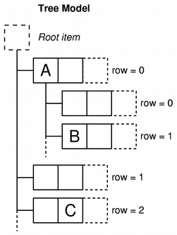
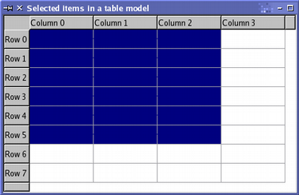
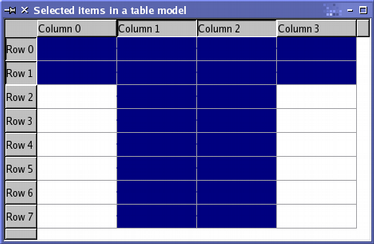
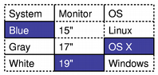

# [Model/View Programming](https://doc.qt.io/qt-6/model-view-programming.html)

## Introduction to Model/View Programming

Qt 包含一组使用模型/视图架构来管理数据与向用户呈现的方式之间关系的项目视图类。该架构引入的功能分离为开发人员提供了更大的灵活性来自定义项目的呈现方式，并提供了标准的模型接口，以允许广泛的数据源与现有项目视图一起使用。在本文档中，我们简要介绍了模型/视图范例，概述了涉及的概念，并描述了项目视图系统的架构。解释了架构中的每个组件，并给出了示例，展示如何使用提供的类。

## The model/view architecture

Model-View-Controller (MVC) 是一种源自 Smalltalk 的设计模式，通常用于构建用户界面。在《设计模式》一书中，Gamma 等人写道：

> MVC 由三种对象组成。模型是应用程序对象，视图是其屏幕表示形式，控制器定义了用户界面对用户输入的反应方式。在 MVC 之前，用户界面设计倾向于将这些对象合并在一起。 MVC 将它们解耦以增加灵活性和重用性。

如果将视图和控制器对象合并，则结果是模型/视图架构。这仍然将存储数据的方式与向用户呈现数据的方式分开，但提供了一个基于相同原则的更简单的框架。此分离使得可以在多个不同视图中显示相同的数据，并实现新类型的视图，而无需更改底层数据结构。为了允许灵活处理用户输入，我们引入了"委托"的概念。在此框架中具有委托的优点是它允许自定义渲染和编辑数据项的方式。

| Model/View架构                                               |                                                              |
| ------------------------------------------------------------ | ------------------------------------------------------------ |
|  | 模型与数据源通信，为架构中的其他组件提供接口。通信的性质取决于数据源的类型以及模型的实现方式。视图从模型获取模型索引；这些是对数据项的引用。通过向模型提供模型索引，视图可以从数据源检索数据项。在标准视图中，一个*委托*渲染数据项。当编辑项目时，委托使用模型索引直接与模型通信。 |

通常，模型/视图类可以分为上述三组：模型、视图和委托。每个组件都由抽象类定义，这些抽象类提供了公共接口，并在某些情况下提供了功能的默认实现。抽象类旨在被子类化，以提供其他组件所期望的完整功能集；这也允许编写专门的组件。

模型、视图和委托使用信号和插槽彼此通信：

- 来自模型的信号通知视图有关数据源保存的数据更改的信息。
- 来自视图的信号提供有关用户与正在显示的项目交互的信息。
- 来自委托的信号在编辑期间用于告知模型和视图编辑器的状态。

### Models

所有 item models 都基于 `QAbstractItemModel` 类。该类定义了一个视图和委托访问数据的接口。数据本身不必存储在模型中；它可以保存在由单独的类、文件、数据库或其他应用程序组件提供的数据结构或存储库中。

有关模型的基本概念在 [Model Classes](# Model Classes) 一节中介绍。

`QAbstractItemModel` 为数据提供了一个的接口，可以灵活处理以表格、列表和树形式表示数据的视图。但是，在为列表和类似表格的数据结构实现新模型时，`QAbstractListModel` 和 `QAbstractTableModel` 类是更好的起点，因为它们提供了常见函数的适当的默认实现。每个这些类都可以被子类化以提供支持特定类型列表和表格的模型。

有关子类化模型的过程在 [Create New Models](# Create New Models) 一节中讨论。

Qt 提供了一些现成的模型，可用于处理数据项：

- `QStringListMode` 用于存储 `QString` 项的简单列表。
- `QStandardItemModel` 管理更复杂的项目树结构，每个项目都可以包含任意数据。
- `QFileSystemMode` 提供有关本地文件系统中文件和目录的信息。
- `QSqlQueryModel`、`QSqlTableModel` 和 `QSqlRelationalTableModel` 用于使用模型/视图约定访问数据库。

如果这些标准模型不符合您的要求，则可以子类化 `QAbstractItemModel`、`QAbstractListModel` 或 `QAbstractTableModel` 来创建自己的自定义模型。

### Views

Qt 为不同类型的视图提供了完整的实现：`QListView` 显示项目列表，`QTableView` 在表格中显示模型数据，`QTreeView` 以分层列表的形式显示模型数据项。这些类每个都基于 `QAbstractItemView` 抽象基类。虽然这些类是现成的实现，但它们也可以被子类化以提供自定义视图。

可用的视图在 [View Classes](# View Classes) 一节中进行了详细介绍。

### Delegates

`QAbstractItemDelegate` 是模型/视图框架中委托的抽象基类。默认委托实现由 `QStyledItemDelegate` 提供，这是Qt标准视图使用的默认委托。但是，`QStyledItemDelegate` 和 `QItemDelegate` 是两个独立的方案，绘制视图中项目和提供编辑器。它们之间的区别在于，`QStyledItemDelegate` 使用当前样式来绘制其项目。因此，在实现自定义委托或使用Qt样式表时，我们建议使用 `QStyledItemDelegate` 作为基类。

有关委托的详细信息，请参见 [Delegate Classes](# Delegate Classes) 一节。

### Sorting

在模型/视图架构中有两种方法可以处理排序；选择哪种方法取决于您的底层模型。

如果您的模型是可排序的，即如果它重新实现了 `QAbstractItemModel::sort()` 函数，则 `QTableView` 和 `QTreeView` 都提供了一个API，允许您以编程方式对模型数据进行排序。此外，您还可以通过将 `QHeaderView::sortIndicatorChanged()` 信号连接到相应的 `QTableView::sortByColumn()` 插槽或 `QTreeView::sortByColumn()` 插槽来启用交互式排序（即允许用户通过单击视图标题来对数据进行排序）。

另一种方法是，如果您的模型没有所需的接口或者如果您想使用列表视图来呈现数据，则可以使用代理模型来转换模型结构，然后再在视图中呈现数据。这在 [Proxy Models](# Proxy Models) 一节中有详细介绍。

### Convenience Classes

为了使依赖于 Qt 的 item-based 的项目视图和表格类的应用程序受益，许多便利类都是从标准视图类派生而来的。它们不打算被子类化。

这些类的示例包括 `QListWidget`、`QTreeWidget` 和 `QTableWidget`。

这些类没有视图类灵活，不能与任意模型一起使用。我们建议您使用模型/视图方法来处理项目视图中的数据，除非您强烈需要一组 item-based 的类。

如果您希望利用模型/视图方法提供的功能，同时仍然使用一个 item-based 的接口，请考虑使用视图类，例如 `QListView`、`QTableView` 和 `QTreeView` 与 `QStandardItemModel` 一起使用。

## Using Models and Views

以下各节介绍了如何在 Qt 中使用模型/视图模式。每个部分都包括一个示例，后面跟着一个显示如何创建新组件的部分。

### Two models included in Qt

Qt 提供的两个标准模型是 `QStandardItemModel` 和 `QFileSystemModel`。`QStandardItemModel` 是一个多用途模型，可用于表示列表、表格和树视图所需的各种不同数据结构。该模型还保存数据项。`QFileSystemModel` 是一种维护目录内容信息的模型。因此，它本身不持有任何数据项，而只是表示在本地文件系统上文件和目录。

`QFileSystemModel` 提供了一个可供实验使用的现成模型，并且可以轻松配置以使用现有数据。使用此模型，我们可以展示如何建立一个模型来使用现成视图，并探索如何使用模型索引操作数据。

### Using views with an existing model

`QListView` 和 `QTreeView` 类是与 `QFileSystemModel` 是与 `QFileSystemModel` 一起使用的最合适的视图。下面介绍的示例在树视图中显示目录内容，并在列表视图中显示相同信息。这些视图共享用户的选择，以便在两个视图中都突出显示所选项目。


我们设置了一个 `QFileSystemModel`，并创建了一些视图来显示目录的内容。这显示了使用模型的最简单方法。模型的构建和使用是在单个 `main()` 函数中执行的：

```c++
int main(int argc, char *argv[])
{
    QApplication app(argc, argv);
    QSplitter *splitter = new QSplitter;

    QFileSystemModel *model = new QFileSystemModel;
    model->setRootPath(QDir::currentPath());
```

该模型设置为使用来自某个文件系统的数据。调用 `setRootPath()` 告诉模型向视图暴露文件系统上的哪个驱动器。

我们创建了两个视图，以便我们可以以两种不同的方式检查模型中保存的项目：

```c++
	QTreeView *tree = new QTreeView(splitter);
    tree->setModel(model);
    tree->setRootIndex(model->index(QDir::currentPath()));

    QListView *list = new QListView(splitter);
    list->setModel(model);
    list->setRootIndex(model->index(QDir::currentPath()));
```

视图的构造方式与其他小部件相同。设置视图以显示模型中的项目只用以目录模型作为参数调用其 `setModel()` 函数。我们通过在每个视图上调用 `setRootIndex()` 函数并传递文件系统模型对于当前目录的的模型索引来过滤模型提供的数据。

在这种情况下使用的 `index()` 函数是 `QFileSystemModel` 特有的；我们向其提供一个目录，它会返回一个模型索引。模型索引在 [Model Classes](# Model Classes) 中讨论。

函数的剩余部分只是在分裂器小部件中显示视图，并运行应用程序的事件循环：

```c++
	splitter->setWindowTitle("Two views onto the same file system model");
    splitter->show();
    return app.exec();
}
```

在上述示例中，我们忽略了如何处理项目的选中。这个主题在关于 [Handling Selections in Item Views](# Handling Selections in Item Views) 一节中有更详细的介绍。

## Model Classes

在研究如何处理选择之前，您可能会发现检查模型/视图框架中使用的概念很有用。

### Basic concepts

在模型/视图架构中，模型提供了视图和委托访问数据的标准接口。在 Qt 中，标准接口由 `QAbstractItemModel` 类定义。无论数据项如何存储在任何底层数据结构中，`QAbstractItemModel` 的所有子类都将数据表示为包含项目表的层级结构。视图使用这个约定来访问模型中的数据项，但是它们在向用户呈现这些信息的方式上没有限制。


模型还通过信号和插槽机制通知任何附加的视图有关数据更改的信息。

本节描述了一些基本概念，这些概念对于其他组件通过模型类访问数据项的方式至关重要。更高级的概念在后面的章节中讨论。

#### Model indexes

为了确保数据的表示与访问方式分开，引入了模型索引的概念。可以通过模型获得的每个信息都由模型索引表示。视图和委托使用这些索引请求要显示的数据项。

因此，只有模型需要知道如何获取数据，并且由模型管理的数据类型可以相当普遍地定义。模型索引包含指向创建它们的模型的指针，这可以防止在使用多个模型时出现混淆。

```c++
QAbstractItemModel *model = index.model();
```

模型索引提供了对信息片段的临时引用，可以被用于通过模型检索或修改数据。由于模型可能会不时地重新组织其内部结构，因此模型索引可能会变得无效，不应存储。如果需要长期引用某个信息片段，则必须创建持久模型索引。这提供了对模型保持最新的信息的引用。`QModelIndex` 类提供临时模型索引，`QPersistentModelIndex` 类提供持久模型索引。

要获取与数据项对应的模型索引，必须向模型指定三个属性：行号、列号和父项的模型索引。以下各节详细描述和解释了这些属性。

#### Rows and columns

在其最基本的形式中，可以将模型访问为简单的表格，其中项目按其行和列编号定位。这并不意味着底层数据片段存储在数组结构中；行和列编号的使用只是一种约定，以允许组件彼此通信。我们可以通过将其行和列编号指定为模型来检索有关任何给定项目的信息，并收到表示该项目的索引：

在其最基本的形式中，可以将模型当作简单的表格进行访问，其中项目按其行和列编号定位。这并不意味着底层数据片段存储在数组结构中；行和列编号的使用只是一种约定，以允许组件彼此通信。我们可以通过向模型指定行和列来检索任何给定的项，并且我们会收到一个代表该项的索引：

```c++
QModelIndex index = model->index(row, column, ...);
```

为列表和表格等简单的、单层的数据结构提供接口的模型不需要提供任何其他信息，但正如上面代码所示，我们需要在获取模型索引时提供更多的信息。


该图显示了一个基本表格模型的表示，其中每个项目都由一对行号和列号定位。我们通过将相关的行号和列号传递给模型来获得引用数据项的模型索引。

```c++
QModelIndex indexA = model->index(0, 0, QModelIndex());
QModelIndex indexB = model->index(1, 1, QModelIndex());
QModelIndex indexC = model->index(2, 1, QModelIndex());
```

模型中的顶级项始终通过指定 `QModelIndex()` 为父项来引用。这将在下一节中讨论。

#### Parents of items

在表格或列表视图中使用数据时，模型为项目数据提供的类似于表格的接口是理想的；行号和列号系统完全映射到视图显示项目的方式。但是，树视图等结构要求模型向其中的项目暴露更灵活的接口。因此，每个项目也可以是另一个项目表的父项，这与树视图中的 top-level items 可以包含另一个项目列表的方式非常相似。

当请求模型项的索引时，我们必须提供有关项的父项的一些信息。在模型之外，引用项目的唯一方法是通过模型索引，因此还必须给出父模型索引：

```c++
QModelIndex index = model->index(row, column, parent);
```



该图显示了树模型的表示，其中每个项目都由父项、行号和列号引用。项目 "A" 和 "C" 表示为模型中的顶级的 siblings：

```c++
QModelIndex indexA = model->index(0, 0, QModelIndex());
QModelIndex indexC = model->index(2, 1, QModelIndex());
```

项目 "A" 有多个孩子。项目 "B" 的模型索引通过以下代码获取：

```c++
QModelIndex indexB = model->index(1, 0, indexA);
```

#### Item roles

模型中的项目可以为其他组件扮演各种*角色*，允许为不同情况提供不同类型的数据。例如， `Qt::DisplayRole` 用于访问可以在视图中显示为文本的字符串。通常，项目包含许多不同角色的数据，标准角色由 `Qt::ItemDataRole` 定义。

我们可以通过将项目对应的模型索引传递给模型来向模型查询项目的数据，并通过指定角色来获取我们想要的数据类型：

```c++
QVariant value = model->data(index, role);
```


该角色向模型指示所引用的数据类型。视图可以以不同的方式显示角色，因此为每个角色提供适当的信息很重要。[Create New Models](# Create New Models) 部分更详细地介绍了角色的一些特定用途。

`Qt :: ItemDataRole` 中定义的标准角色涵盖了项目数据的大多数常见用途。通过为每个角色提供适当的项目数据，模型可以向视图和委托提供有关如何向用户呈现项目的提示。不同类型的视图可以自由地解释或忽略此信息。还可以定义用于特定于应用程序的目的的其他角色。

#### Summary

- 模型索引以独立于任何底层数据结构的方式向视图和委托提供模型提供的项目位置信息。
- 项目按其行和列编号以及其父项的模型索引来引用。
- 模型索引是由模型在其他组件（例如视图和委托）的请求下构建的。
- 如果在使用 `index()` 请求索引时为父项指定了有效的模型索引，则返回的索引指向该模型中该父项之下的项目。获得的索引指向该项的子项。
- 如果在使用 `index()` 请求索引时为父项指定了无效的模型索引，则返回的索引指向模型中的 top-level items。
- 角色区分与项目关联的不同类型数据。

### Using model indexes

为了演示如何使用模型索引从模型中检索数据，我们设置了一个没有视图的 `QFileSystemModel`，并在小部件中显示文件和目录的名称。尽管这不是使用模型的正常方式，但它演示了模型在处理模型索引时使用的约定。

`QFileSystemModel` 加载是异步的，以最大限度地减少系统资源的使用。在处理这个模型时，我们必须考虑到这一点。

我们通过以下方式构建文件系统模型：

```c++
	auto *model = new QFileSystemModel;

    auto onDirectoryLoaded = [model, layout, &window](const QString &directory) {
        QModelIndex parentIndex = model->index(directory);
        const int numRows = model->rowCount(parentIndex);
        for (int row = 0; row < numRows; ++row) {
            QModelIndex index = model->index(row, 0, parentIndex);

            QString text = model->data(index, Qt::DisplayRole).toString();
            // Display the text in a widget.
            auto *label = new QLabel(text, &window);
            layout->addWidget(label);
        }
    };

    QObject::connect(model, &QFileSystemModel::directoryLoaded, onDirectoryLoaded);
    model->setRootPath(QDir::currentPath());
```

在这个示例中，我们首先设置了一个默认的 `QFileSystemModel`。我们将其信号 `directoryLoaded(QString)` 连接到一个 `lambda` 中，在其中我们将使用该模型提供的特定实现的 `index()` 获取目录的父索引。

在 `lambda` 中，我们使用 `rowCount()` 函数确定模型中的行数。

为简单起见，我们只对模型中第一列中的项目感兴趣。我们依次检查每一行，为每一行中的第一个项目获取模型索引，并读取存储在该模型中的项目的数据。

```c++
	for (int row = 0; row < numRows; ++row) {
        QModelIndex index = model->index(row, 0, parentIndex);
```

为了获取模型索引，我们指定行号，列号（第一列为零）以及我们想要的所有项目的父项的模型索引。使用模型的 `data()` 函数检索存储在每个项目中的文本。我们指定模型索引和 `DisplayRole` 以获取以字符串形式表示的项目的数据。

```c++
		QString text = model->data(index, Qt::DisplayRole).toString();

	}
```

最后，我们设置 `QFileSystemModel` 的根路径，以便它开始加载数据并触发 `lambda`。

上面的示例演示了从模型中检索数据所使用的基本原则：

- 可以使用 `rowCount()` 和 `columnCount()`找到模型的维度。这些函数通常需要指定父模型索引。
- 模型索引用于访问模型中的项目。需要行、列和父模型索引来指定项目。
- 要访问模型中的 top-level items，请使用 `QModelIndex()` 将空模型索引指定为父索引。
- 项目包含不同角色的数据。要获取特定角色的数据，必须向模型提供模型索引和角色。

### Futher reading

可以通过实现 `QAbstractItemModel` 提供的标准接口来创建新模型。在 [Creating New Models](https://doc.qt.io/qt-6/model-view-programming.html#creating-new-models) 部分中，我们通过创建一个方便的可用于保存字符串列表的消除的模型来演示这一点。

## View Classes

### Concepts

在模型/视图架构中，视图从模型中获取数据项并将其呈现给用户。呈现数据的方式不必类似于模型提供的数据的表示形式，并且可以与存储数据项的底层数据结构完全不同。

通过使用 `QAbstractItemModel` 提供的标准模型接口、`QAbstractItemView` 提供的标准视图接口以及表示通用数据项的模型索引来实现内容和表示的分离。视图通常管理从模型获取的数据的整体布局。它们可以自己渲染单个数据项，也可以使用委托来处理渲染和编辑功能。

除了呈现数据外，视图还处理项目之间的导航以及项目选择的某些方面。视图还实现基本用户界面功能，例如上下文菜单和拖放。视图可以为项目提供默认编辑工具，或者可以与委托一起工作以提供自定义编辑器。

可以在没有模型的情况下构建视图，但必须在显示有用信息之前提供模型。通过使用 selections 来跟踪用户选择的项目，视图可以维护用户选择的项目，这些选择可以针对每个视图单独维护，也可以在多个视图之间共享。

一些视图（例如 `QTableView` 和 `QTreeView`）显示标题以及项目。这些也由一个视图类 `QHeaderView` 实现。标题通常访问与包含它们的视图相同的模型。它们使用 `QAbstractItemModel :: headerData()` 函数从模型检索数据，并通常以标签形式显示标题信息。可以从 `QHeaderView` 类中派生新标题，为视图提供更专业化的标签。

### Using an existing view

Qt 提供了三个现成的视图类，它们以大多数用户熟悉的方式呈现模型中的数据。`QListView` 可以将模型中的项目显示为简单列表，或者以经典图标视图的形式显示。`QTreeView` 将模型中的项目显示为列表层级结构，允许以紧凑的方式表示深度嵌套结构。`QTableView` 以表格形式呈现模型中的项目，很像电子表格应用程序的布局。

这些视图类是在Qt Model/View框架中使用的，该框架提供了一种将数据和视图分离的方法，从而使数据可以在多个视图之间共享和重用。


上面显示的标准视图的默认行为对于大多数应用程序应该足够了。它们提供基本的编辑功能，并且可以定制以满足更专业的用户界面的需求。

#### Using a model

我们使用字符串列表模型创建一个示例模型，为它设置一些数据，并构造一个视图来显示模型的内容。这一切都可以在一个函数中执行：

```c++
int main(int argc, char *argv[])
{
    QApplication app(argc, argv);

// Unindented for quoting purposes:
QStringList numbers;
numbers << "One" << "Two" << "Three" << "Four" << "Five";

QAbstractItemModel *model = new StringListModel(numbers);
```

请注意，`StringListModel` 被声明为 `QAbstractItemModel`。这允许我们可以使用模型的抽象接口，并确保即使我们将字符串列表模型替换为其他模型，代码仍然有效。

由 `QListView` 提供的列表视图足以呈现字符串列表模型中的项目。我们构建视图，并使用以下代码设置模型：

```c++
QListView *view = new QListView;
view->setModel(model);
```

视图以正常方式显示：

```c++
	view->show();
    return app.exec();
}
```

视图渲染模型的内容，通过模型的接口访问数据。当用户尝试编辑项目时，视图使用默认委托提供编辑器小部件。


上图显示了一个 `QListView` 如何表示字符串列表模型中的数据。由于模型是可编辑的，因此视图自动地允许使用默认的委托编辑列表中的每一项

#### Using multiple views of a model

为同一模型提供多个视图只是将每个视图设置为相同模型的问题。在以下代码中，我们创建了两个表视图，每个表视图都使用我们为此示例创建的相同的简单表模型：

```c++
	QTableView *firstTableView = new QTableView;
    QTableView *secondTableView = new QTableView;

    firstTableView->setModel(model);
    secondTableView->setModel(model);
```

在模型/视图架构中使用信号和插槽意味着对模型的更改可以传播到所有附加的视图，确保我们始终可以访问相同的数据，而不管使用的视图如何。


上图显示了同一模型的两个不同视图，每个视图都包含多个选定的项目。尽管模型中的数据在视图中保持一致，但每个视图都维护其自己的内部选择模型。在某些情况下，这可能很有用，但对于许多应用程序，共享选择模型是理想的。

### Handling selections of items

处理视图中项目的选择的机制由 `QItemSelectionModel` 类提供。所有标准视图默认情况下都构建自己的选择模型，并以正常方式与它们交互。可以通过 `selectionModel()` 函数获取视图正在使用的选择模型，并可以使用 `setSelectionModel()` 指定替换选择模型。当我们想要为同一模型数据提供多个一致的视图时，控制视图使用的选择模型的能力非常有用。

通常，除非您正在子类化模型或视图，否则不需要直接操作选择内容。但是，如果需要，可以访问选择模型的接口，这在 [Handling Selections in Item Views](https://doc.qt.io/qt-6/model-view-programming.html#handling-selections-in-item-views) 中进行了探讨。

#### Sharing selections among views

虽然默认情况下视图类提供自己的选择模型很方便，但是当我们在同一模型上使用多个视图时，通常希望在所有视图中一致地显示模型数据和用户选择。由于视图类允许替换其内部选择模型，因此我们可以通过以下行实现视图之间的统一选择：

```c++
	secondTableView->setSelectionModel(firstTableView->selectionModel());
```

第二个视图被赋予第一个视图的选择模型。两个视图在相同的选择模型上操作，从而使数据和所选项目保持同步。


在上面显示的示例中，两个相同类型的视图被用来显示相同模型的数据。但是，如果使用了两种不同类型的视图，则每个视图中选择的项目可能会有非常不同的表示方式；例如，在表视图中的连续选择可以表示为树视图中突出显示的一组分散的项目。

## Delegate Classes

### Concepts

与模型-视图-控制器模式不同，模型/视图设计不包括一个用于管理与用户的交互的完全独立的组件。通常，视图负责将模型数据呈现给用户，并处理用户输入。为了在获取此输入的方式上允许一些灵活性，交互由委托执行。这些组件提供输入功能，并且还负责在某些视图中呈现独立的项目。控制委托的标准接口在 `QAbstractItemDelegate` 类中定义。

委托应该能够通过实现 `paint()` 和 `sizeHint()` 函数自己渲染其内容。但是，简单的基于小部件的委托可以子类化 `QStyledItemDelegate` 而不是 `QAbstractItemDelegate`，并利用这些函数的默认实现。

委托的编辑器可以通过使用小部件来管理编辑过程或直接处理事件来实现。第一种方法稍后在本节中介绍，它也显示在 [Spin Box Delegate](https://doc.qt.io/qt-6/qtwidgets-itemviews-spinboxdelegate-example.html) 示例中。

[Pixelator](https://doc.qt.io/qt-6/qtwidgets-itemviews-pixelator-example.html) 示例演示了如何创建一个自定义委托，为表视图执行特殊渲染。

### Using an existing delegate

Qt 提供的标准视图使用 `QStyledItemDelegate` 的实例来提供编辑功能。标准视图使用的默认委托接口的实现会为每个标准视图 (`QListView`、`QTableView` 和 `QTreeView`) 中的项呈现通常的样式。

所有标准角色都由标准视图使用的默认委托处理，这些角色的解释在 `QStyledItemDelegate` 文档中描述。

视图使用的委托由 `itemDelegate()` 函数返回。`setItemDelegate()` 函数允许您为标准视图安装自定义委托，并且在为自定义视图设置委托时需要使用此函数。

### A simple delegate

下面实现的委托使用 `QSpinBox` 提供编辑功能，主要用于显示整数的模型。虽然我们为此设置了一个自定义的基于整数的表格模型，但我们也可以使用 `QStandardItemModel`，因为自定义委托控制数据输入。我们构造一个表视图来显示模型的内容，这将使用自定义委托进行编辑。


我们从 `QStyledItemDelegate` 子类化委托，因为我们不想编写自定义显示函数。但是，我们仍然必须提供函数来管理编辑器小部件：

```c++
class SpinBoxDelegate : public QStyledItemDelegate
{
    Q_OBJECT

public:
    SpinBoxDelegate(QObject *parent = nullptr);

    QWidget *createEditor(QWidget *parent, const QStyleOptionViewItem &option,
                          const QModelIndex &index) const override;

    void setEditorData(QWidget *editor, const QModelIndex &index) const override;
    void setModelData(QWidget *editor, QAbstractItemModel *model,
                      const QModelIndex &index) const override;

    void updateEditorGeometry(QWidget *editor, const QStyleOptionViewItem &option,
                              const QModelIndex &index) const override;
};
```

请注意，在构造委托时没有设置编辑器小部件。我们只在需要时才构造一个编辑器小部件。

#### Providing an editor

这个例子中，当表视图需要提供一个编辑器时，它会要求委托为正在被修改的项目提供一个合适的编辑器小部件。`createEditor()` 函数提供了委托设置合适的小部件需要的所有内容。

```c++
QWidget *SpinBoxDelegate::createEditor(QWidget *parent,
                                       const QStyleOptionViewItem &/* option */,
                                       const QModelIndex &/* index */) const
{
    QSpinBox *editor = new QSpinBox(parent);
    editor->setFrame(false);
    editor->setMinimum(0);
    editor->setMaximum(100);

    return editor;
}
```

请注意，我们不需要保留对编辑器小部件的指针，因为视图负责在不再需要时销毁它。

我们在编辑器上安装委托的默认事件过滤器，以确保它提供用户所期望的标准编辑快捷方式。可以添加其他快捷方式以允许更复杂的行为；这些在 [Editing Hints](https://doc.qt.io/qt-6/model-view-programming.html#editinghints) 部分中讨论。

视图通过调用我们稍后为此目的定义的函数来确保编辑器的数据和几何形状设置正确。我们可以根据视图提供的模型索引创建不同的编辑器。例如，如果我们有一个整数列和一个字符串列，我们可以根据正在编辑的列来返回 `QSpinBox` 或 `QLineEdit`。

委托必须提供一个将模型数据复制到编辑器中的函数。在这个例子中，我们读取存储在 [display role](https://doc.qt.io/qt-6/qt.html#ItemDataRole-enum) 中的数据，并相应地设置 spin box 中的值。

```c++
void SpinBoxDelegate::setEditorData(QWidget *editor,
                                    const QModelIndex &index) const
{
    int value = index.model()->data(index, Qt::EditRole).toInt();

    QSpinBox *spinBox = static_cast<QSpinBox*>(editor);
    spinBox->setValue(value);
}
```

在这个例子中，我们知道编辑器小部件是一个旋转框，但是我们可以为模型中的不同数据类型提供不同的编辑器，在这种情况下，我们需要在访问其成员函数之前将小部件转换为适当的类型。

#### Submitting data to the model

当用户完成旋转框中的值的编辑时，视图会通过调用 `setModelData()` 函数来请求委托将编辑后的值存储到模型中。

```c++
void SpinBoxDelegate::setModelData(QWidget *editor, QAbstractItemModel *model,
                                   const QModelIndex &index) const
{
    QSpinBox *spinBox = static_cast<QSpinBox*>(editor);
    spinBox->interpretText();
    int value = spinBox->value();

    model->setData(index, value, Qt::EditRole);
}
```

由于视图管理用于委托的编辑器小部件，我们只需要使用提供的编辑器的内容更新模型即可。在这种情况下，我们确保旋转框是最新的，并使用指定的索引将其包含的值更新到模型中。

标准的 `QStyledItemDelegate` 类通过发出 `closeEditor()` 信号来通知视图已完成编辑。视图确保编辑器小部件已关闭并销毁。在这个例子中，我们只提供了简单的编辑功能，所以我们永远不需要发出这个信号。

所有在数据上操作都是通过 `QAbstractItemModel` 提供的接口执行的。这使得委托大多数独立于它操作的数据的类型，但是为了使用某些类型的编辑器小部件，必须做出一些假设。在这个例子中，我们假设模型始终包含整数值，但是我们仍然可以将此委托与不同类型的模型一起使用，因为 `QVariant` 为意外数据提供了合理的默认值。

#### Updating the editor's geometry

委托负责管理编辑器的几何形状。在创建编辑器时必须设置几何形状，和在视图中的项的大小或位置发生更改时必须设置几何形状。幸运的是，视图在一个 [view option](https://doc.qt.io/qt-6/qstyleoptionviewitem.html) 对象中提供了所有必要的几何信息。

```c++
void SpinBoxDelegate::updateEditorGeometry(QWidget *editor,
                                           const QStyleOptionViewItem &option,
                                           const QModelIndex &/* index */) const
{
    editor->setGeometry(option.rect);
}
```

在这种情况下，我们只使用项目矩形中的视图选项提供的几何信息。渲染具有多个元素的项的委托不会直接使用项目矩形。它将相对于项目中的其他元素定位编辑器。

#### Editing hints

编辑后，委托应向其他组件提供有关编辑过程结果的提示，并提供有助于任何后续编辑操作的提示。这是通过使用适当的提示发出 `closeEditor()` 信号来实现的。这是由我们在构建旋转框时安装的默认 `QStyledItemDelegate` 事件过滤器处理的。

旋转框的行为可以调整为更加用户友好。在 `QStyledItemDelegate` 提供的默认事件过滤器中，如果用户按回车键确认他们在旋转框中的选择，则委托将该值提交到模型并关闭旋转框。我们可以通过在旋转框上安装自己的事件过滤器，并提供适合我们需要的编辑提示来更改此行为；例如，我们可以使用 `EditNextItem` 提示发出 `closeEditor()` 以自动开始编辑视图中的下一项。

另一种不需要使用事件过滤器的方法是提供自己的编辑器小部件，可能是为了方便而子类化 `QSpinBox`。这种替代方法将使我们更多地控制编辑器小部件的行为，但代价是编写额外代码。如果需要自定义标准 Qt 编辑器小部件的行为，通常在委托中安装事件过滤器会更容易。

委托不必发出这些提示，但是那些不发出提示的委托将比那些发出提示以支持常见编辑操作的委托更少地集成到应用程序中，并且可用性也会降低。

## Handling Selections in Item Views

### Concepts

在项目视图类中使用的选择模型提供基于模型/视图架构的选择机制的一般描述。虽然用于操作选择的标准类对于提供的项目视图已足够，但选择模型允许您创建专门的选择模型以适应自己的项目模型和视图的需求。

视图中所选项目的信息存储在 `QItemSelectionModel` 类的实例中。这会维护单个模型中项目的模型索引，并且与任何视图无关。由于模型上可以有多个视图，因此可以在视图之间共享选择，从而允许应用程序以一致的方式显示多个视图。

选择由选择范围组成。这些通过仅记录所选项目的每个范围的起始和结束模型索引来高效地维护大量项目选择的信息。使用多个选择范围来描述选择以构建非连续选择的项目。

选择应用于由选择模型持有的模型索引集合。应用最近一次所选项目称为当前选择。即使在应用后，也可以通过使用某些类型的选择命令来修改此选择的效果。这些将在本节后面讨论。

#### Current item and selected items

在视图中，始终存在当前项目和所选项目—两个独立的状态。一个项目可以同时是当前项目和所选项目。视图负责确保始终存在一个当前项目，例如，键盘导航需要一个当前项目。

下表突出了当前项目和所选项目之间的区别。

| 当前项目                                                     | 所选项目                                                     |
| :----------------------------------------------------------- | :----------------------------------------------------------- |
| 只能有一个当前项目。                                         | 可以有多个所选项目。                                         |
| 当前项目将通过按键导航或鼠标按钮单击进行更改。               | 当用户与项目交互时，项目的选定状态被设置或取消设置，这取决于几种预定义的模式——例如，单选、多选等。 |
| 如果编辑键 **F2** 按下或双击该项目 (前提是启用了编辑)，当前项目将被编辑。 | 当前项可以与锚点一起使用，以指定应选择或取消选择（或两者的组合）的范围。 |
| 当前项目由焦点矩形指示。                                     | 所选项目用选择矩形表示。                                     |

当操作选择时，将 `QItemSelectionModel` 视为项目模型中所有项目的选择状态的记录通常很有帮助。一旦设置了选择模型，就可以选择、取消选择项目集合，或者切换其选择状态，而无需知道哪些项已经被选择。可以随时检索所有选定项的索引，并且可以通过信号和插槽机制通知其他组件有关选择模型的更改。

### Using a selection model

标准视图类提供了可以在大多数应用程序中使用的默认选择模型。可以使用视图的 `selectionModel()` 函数获取属于一个视图的选择模型，并使用 `setSelectionModel()` 在多个视图之间共享，因此通常不需要构建新的选择模型。

通过指定模型和 `QItemSelection` 中的一对模型索引来创建选择。这使用索引来引用给定模型中的项目，并将它们解释为所选项目块中左上角和右下角的项目。将选择应用于模型中的项目需要将选择提交给选择模型；这可以通过多种方式实现，每种方式对已存在于选择模型中的选择具有不同的影响。

#### Selecting items

为了演示一些主要特性，我们构造了一个总共有 32 个项目的自定义表格模型实例，并打开了一个表格视图以查看其数据：

```c++
	TableModel *model = new TableModel(8, 4, &app);

    QTableView *table = new QTableView(0);
    table->setModel(model);

    QItemSelectionModel *selectionModel = table->selectionModel();
```

表格视图的默认选择模型将被检索以供后续使用。我们不会修改模型中的任何项目，而是选择一些项目，这些项目将在表格的左上角显示。为此，我们需要检索与要选择区域中左上角和右下角项目对应的模型索引：

```c++
	QModelIndex topLeft;
    QModelIndex bottomRight;

    topLeft = model->index(0, 0, QModelIndex());
    bottomRight = model->index(5, 2, QModelIndex());
```

要在模型中选择这些项目，并在表视图中看到相应的变化，我们需要构造一个选择对象，然后将其应用于选择模型：

```c++
	QItemSelection selection(topLeft, bottomRight);
    selectionModel->select(selection, QItemSelectionModel::Select);
```

使用由 [selection flags](https://doc.qt.io/qt-6/qitemselectionmodel.html#SelectionFlag-enum) 组合定义的命令将选择应用于选择模型。在这种情况下，使用的标志会导致选择对象中记录的项目被包含在选择模型中，而不管它们的先前状态。选择结果由视图显示。



使用由选择标志定义的各种操作可以修改项目的选择。由这些操作产生的选择可能具有复杂的结构，但是选择模型可以有效地表示它。当我们研究如何更新选择时，将描述使用不同的选择标志来操作所选项目。

#### Reading the selection state

存储在选择模型中的模型索引可以使用 `selectedIndexes()` 函数读取。这将返回一个未排序的模型索引列表，只要我们知道它们所属的模型，就可以对其进行迭代：

```c++
	const QModelIndexList indexes = selectionModel->selectedIndexes();

    for (const QModelIndex &index : indexes) {
        QString text = QString("(%1,%2)").arg(index.row()).arg(index.column());
        model->setData(index, text);
    }
```

上面的代码使用基于范围的 for 循环来迭代并修改与选择模型返回的索引对应的项目。

选择模型发出信号以指示选择中的更改。这些信号通知其他组件有关选择作为整体以及项目模型中当前聚焦项的更改。我们可以将 `selectionChanged()` 信号连接到一个插槽，并在选择更改时检查模型中选中的或取消选定的项目。插槽使用两个 `QItemSelection` 对象调用：一个包含与新选择的项目对应的索引列表；另一个包含与新取消选择的项目对应的索引。

在以下代码中，我们提供了一个接收 `selectionChanged()` 信号的插槽，它使用字符串填充所选项目，并清除取消选择的项目的内容。

```c++
void MainWindow::updateSelection(const QItemSelection &selected,
    const QItemSelection &deselected)
{
    QModelIndexList items = selected.indexes();

    for (const QModelIndex &index : std::as_const(items)) {
        QString text = QString("(%1,%2)").arg(index.row()).arg(index.column());
        model->setData(index, text);
    }

    items = deselected.indexes();

    for (const QModelIndex &index : std::as_const(items)) {
        model->setData(index, QString());
}
```

我们可以通过将 `currentChanged()` 信号连接到使用两个模型索引调用的插槽来跟踪当前聚焦的项。这些 (索引) 与先前聚焦的项和当前聚焦的项对应。

在以下代码中，我们提供了一个接收 `currentChanged()` 信号的插槽，它使用提供的信息更新 `QMainWindow` 的状态栏：

```c++
void MainWindow::changeCurrent(const QModelIndex &current,
    const QModelIndex &previous)
{
    statusBar()->showMessage(
        tr("Moved from (%1,%2) to (%3,%4)")
            .arg(previous.row()).arg(previous.column())
            .arg(current.row()).arg(current.column()));
}
```

使用这些信号监视用户所做的选择很简单，但我们也可以直接更新选择模型。

#### Updating a selection

选择命令由 `QItemSelectionModel::SelectionFlag` 定义的选择标志组合提供。每个选择标志告诉选择模型在调用任意一个 `select()` 函数时如何更新其内部记录的所选项目。最常用的标志是 `Select` 标志，它指示选择模型将指定的项目记录为已选择。`Toggle` 标志会导致选择模型反转指定项目的状态，选中任何给定的未选中的项目，并取消选中任何当前选中的项目。`Deselect` 标志取消选中所有指定的项目。

通过创建项目的选择并将其应用于选择模型来更新选择模型中的各个项目。在以下代码中，我们将第二个项目选择应用于上面显示的表格模型，使用 `Toggle` 命令反转给定项目的选择状态。

```c++
	QItemSelection toggleSelection;

    topLeft = model->index(2, 1, QModelIndex());
    bottomRight = model->index(7, 3, QModelIndex());
    toggleSelection.select(topLeft, bottomRight);

    selectionModel->select(toggleSelection, QItemSelectionModel::Toggle);
```

此操作的结果显示在表视图中，提供了一种可视化我们所取得的成果的便捷方式：


默认情况下，选择命令仅对模型索引指定的单个项目进行操作。但是，用于描述选择命令的标志可以与其他标志组合，以更改整行和整列。例如，如果您使用一个索引调用 `select()`，但使用的命令是 `Select` 和 `Rows` 的组合，则选择包含所引用项目的整行。以下代码演示了 `Rows` 和 `Columns` 标志的使用：

```c++
	QItemSelection columnSelection;

    topLeft = model->index(0, 1, QModelIndex());
    bottomRight = model->index(0, 2, QModelIndex());

    columnSelection.select(topLeft, bottomRight);

    selectionModel->select(columnSelection,
        QItemSelectionModel::Select | QItemSelectionModel::Columns);

    QItemSelection rowSelection;

    topLeft = model->index(0, 0, QModelIndex());
    bottomRight = model->index(1, 0, QModelIndex());

    rowSelection.select(topLeft, bottomRight);

    selectionModel->select(rowSelection,
        QItemSelectionModel::Select | QItemSelectionModel::Rows);
```

尽管只向选择模型提供了四个索引，但使用 `Columns` 和 `Rows` 选择标志意味着选择了两列和两行。下图显示了这两个选择的结果：



在示例模型上执行的所有命令都涉及在模型中累积项目的选择。还可以清除选择，或使用新选择替换当前选择。

要使用新的选择替换当前选择，请将其他选择标志与 `Current` 标志组合。使用此标志的命令指示选择模型在 `select()` 调用中用指定的模型索引替换其当前模型索引集合。要在开始添加新选择之前清除所有选择，请将其他选择标志与 `Clear` 标志组合。这会导致重置选择模型的模型索引集合。

#### Selecting all items in a model

要选择模型中的所有项目，必须为每个级别的模型创建一个覆盖该级别中的所有项目的选择。我们通过检索与给定父索引的左上角和右下角项对应的索引来完成此操作：

```c++
	QModelIndex topLeft = model->index(0, 0, parent);
    QModelIndex bottomRight = model->index(model->rowCount(parent)-1,
        model->columnCount(parent)-1, parent);
```

用这些索引和模型构建一个选择。然后在选择模型中选择相应的项目：

```c++
	QItemSelection selection(topLeft, bottomRight);
    selectionModel->select(selection, QItemSelectionModel::Select);
```

这需要对模型中的所有级别执行。对于顶级项目，我们将以通常的方式定义父索引：

```c++
	QModelIndex parent = QModelIndex();
```

对于分层模型，`hasChildren()` 函数用于确定任何给定项是否是另一级项目的父项。

## Create New Models

模型/视图组件之间的功能分离允许创建可以利用现有视图的模型。这种方法使我们能够使用标准的图形用户界面组件 (例如 `QListView`、`QTableView` 和 `QTreeView`) 从各种来源呈现数据。

`QAbstractItemModel` 类提供了一个足够灵活的接口，支持将信息以分层结构的方式排列的数据源，允许插入、删除、修改或排序数据。它还提供了拖放操作的支持。

`QAbstractListModel` 和 `QAbstractTableModel` 类提供了对简单的非分层数据结构的接口支持，并且更容易用作于简单列表和表格模型的起点。

在本节中，我们创建一个简单的只读模型，以探索模型/视图架构的基本原理。在本节后面，我们将调整此简单模型，以便用户可以修改项目。

有关更复杂模型的示例，请参见 [Simple Tree Model](https://doc.qt.io/qt-6/qtwidgets-itemviews-simpletreemodel-example.html)。

有关 `QAbstractItemModel` 子类的需求在 [Model Subclassing Reference](# Model Subclassing Reference) 中有更详细的描述。

### Designing a model

在为现有数据结构创建新模型时，重要的是考虑应使用哪种类型的模型来提供在数据之上的接口。如果数据结构可以表示为项目列表或项目表格，则可以子类化 `QAbstractListModel` 或 `QAbstractTableModel`，因为这些类为许多函数提供了适当的默认实现。

但是，如果底层数据结构只能由分层树结构表示，则必须子类化 `QAbstractItemModel`。这种方法在 [Simple Tree Model](https://doc.qt.io/qt-6/qtwidgets-itemviews-simpletreemodel-example.html) 中被采用。

在本节中，我们实现了一个基于字符串列表的简单模型，因此 `QAbstractListModel` 提供了一个理想的基类来构建。

无论底层数据结构采用何种形式，通常最好在专用模型中扩充标准的 `QAbstractItemModel` API，以便允许更自然地访问底层数据结构。这使得更容易使用数据填充模型，同时使其他通用模型/视图组件仍然可以使用标准 API 与其交互。下面描述的模型提供了一个自定义构造函数来实现这一目的。

### A read-only example model

这里实现的模型是一个简单的、非分层的只读数据模型，基于标准的 `QStringListModel` 类。它使用 `QStringList` 作为其内部数据源，并仅实现了使其成为一个可用模型所需的内容。为了使实现更容易，我们子类化 `QAbstractListModel`，因为它为列表模型定义了合理的默认行为，并且它暴露了比 `QAbstractItemModel` 类更简单的接口。

在实现模型时，重要的是记住 `QAbstractItemModel` 本身不存储任何数据，它仅提供视图用于访问数据的接口。对于最小的只读模型，只需要实现一些函数，因为大多数接口都有默认实现。类声明如下：

```c++
class StringListModel : public QAbstractListModel
{
    Q_OBJECT

public:
    StringListModel(const QStringList &strings, QObject *parent = nullptr)
        : QAbstractListModel(parent), stringList(strings) {}

    int rowCount(const QModelIndex &parent = QModelIndex()) const override;
    QVariant data(const QModelIndex &index, int role) const override;
    QVariant headerData(int section, Qt::Orientation orientation,
                        int role = Qt::DisplayRole) const override;

private:
    QStringList stringList;
};
```

除了模型的构造函数之外，我们只需要实现两个函数：`rowCount()` 返回模型中的行数，`data()` 返回与指定的模型索引对应的数据项。

行为良好的模型还实现了 `headerData()`，以便树和表视图在其标题中显示内容。

请注意，这是一个非分层模型，因此我们不必担心父子关系。如果我们的模型是分层的，则还必须实现 `index()` 和 `parent()` 函数。

字符串列表存储在 `stringList` 私有成员变量中。

#### Dimensions of the model

我们希望模型中的行数与字符串列表中的字符串数相同。我们根据这一点实现 `rowCount()` 函数：

```c++
int StringListModel::rowCount(const QModelIndex &parent) const
{
    return stringList.count();
}
```

由于模型是非分层的，因此我们可以安全地忽略与父项对应的模型索引。默认情况下，从 `QAbstractListModel` 派生的模型仅包含一列，因此我们不需要重新实现 `columnCount()` 函数。

#### Model headers and data

对于视图中的项目，我们希望返回字符串列表中的字符串。`data()` 函数负责返回与索引参数对应的数据项：

```c++
QVariant StringListModel::data(const QModelIndex &index, int role) const
{
    if (!index.isValid())
        return QVariant();

    if (index.row() >= stringList.size())
        return QVariant();

    if (role == Qt::DisplayRole)
        return stringList.at(index.row());
    else
        return QVariant();
}
```

只有在提供的模型索引有效、行号在字符串列表中的项目的范围内且请求的角色是我们支持的角色时，我们才返回有效的 `QVariant`。

一些视图 (例如 `QTreeView` 和 `QTableView`) 能够显示标题以及项目数据。如果我们的模型在具有标题的视图中显示，我们希望标题显示行号和列号。我们可以通过重写 `headerData()` 函数来提供有关标题的信息：

```c++
QVariant StringListModel::headerData(int section, Qt::Orientation orientation,
                                     int role) const
{
    if (role != Qt::DisplayRole)
        return QVariant();

    if (orientation == Qt::Horizontal)
        return QStringLiteral("Column %1").arg(section);
    else
        return QStringLiteral("Row %1").arg(section);
}
```

同样，只有在角色是我们支持的角色时，我们才返回一个有效的 `QVariant`。在决定要返回的确切数据时，还考虑了标题的方向。

并非所有视图都会一起显示项目数据和标题，那些视图可能被配置为隐藏标题。尽管如此，仍然建议您实现 `headerData()` 函数，以提供有关模型提供的数据的相关信息。

一个项可以有多个角色，根据指定的角色提供不同的数据。我们模型中的项仅具有一个角色 `DisplayRole`，因此无论指定的角色如何，我们都会返回项目的数据。但是，我们可以在其他角色中重用我们为 `DisplayRole` 提供的数据，例如 `ToolTipRole`，视图可以使用它在工具提示中显示项目的信息。

### An editable model

只读模型显示了如何向用户呈现简单选择，但对于许多应用程序来说，一个可编辑列表模型更加有用。我们可以修改只读模型以使项目可编辑，方法是更改我们为只读实现的 `data()` 函数，并实现两个额外函数：`flags()` 和 `setData()`。以下函数声明已添加到类定义中：

```c++
Qt::ItemFlags StringListModel::flags(const QModelIndex &index) const
{
    if (!index.isValid())
        return Qt::ItemIsEnabled;

    return QAbstractItemModel::flags(index) | Qt::ItemIsEditable;
}
```

注意，我们不必知道委托如何执行实际的编辑过程。我们只需要为委托提供一种方法来设置模型中的数据。这由 `setData()` 函数实现：

```c++
bool StringListModel::setData(const QModelIndex &index,
                              const QVariant &value, int role)
{
    if (index.isValid() && role == Qt::EditRole) {

        stringList.replace(index.row(), value.toString());
        emit dataChanged(index, index, {role});
        return true;
    }
    return false;
}
```

在此模型中，与模型索引对应的字符串列表中的项将替换为被提供的值。但是，在我们可以修改字符串列表之前，必须确保索引有效，项是正确类型的，并且角色是受支持的。按照惯例，我们坚持认为角色是 `EditRole`，因为这是标准项委托使用的角色。但是，对于布尔值，您可以使用 `Qt::CheckStateRole` 并设置 `Qt::ItemIsUserCheckable` 标志；然后使用一个复选框编辑该值。在此模型中，底层数据对于所有角色都相同，因此此细节只是使模型更容易与标准组件集成。

当数据设置完毕后，模型必须让视图知道某些数据已更改。这是通过发出 `dataChanged()` 信号来完成的。由于只更改了一个数据项，因此信号中指定的项范围仅限于一个模型索引。

还需要更改 `data()` 函数以添加 `Qt::EditRole` 测试：

```C++
QVariant StringListModel::data(const QModelIndex &index, int role) const
{
    if (!index.isValid())
        return QVariant();

    if (index.row() >= stringList.size())
        return QVariant();

    if (role == Qt::DisplayRole || role == Qt::EditRole)
        return stringList.at(index.row());
    else
        return QVariant();
}
```

#### Inserting and removing rows

可以更改模型中的行数和列数。在字符串列表模型中，只有改变行数才有意义，所以我们只重新实现插入和删除行的函数。这些在类定义中声明：

```c++
	bool insertRows(int position, int rows, const QModelIndex &index = QModelIndex()) override;
    bool removeRows(int position, int rows, const QModelIndex &index = QModelIndex()) override;
```

由于此模型中的行对应于列表中的字符串，因此 `insertRows()` 函数在指定位置之前将一些空字符串插入到字符串列表中。插入的字符串数等于指定的行数。

父索引通常用于确定应在模型中添加行的位置。在此情况下，我们只有一个顶级字符串列表，因此只需将空字符串插入该列表即可。

```c++
bool StringListModel::insertRows(int position, int rows, const QModelIndex &parent)
{
    beginInsertRows(QModelIndex(), position, position+rows-1);

    for (int row = 0; row < rows; ++row) {
        stringList.insert(position, "");
    }

    endInsertRows();
    return true;
}
```

模型首先调用 `beginInsertRows()` 函数，通知其他组件行数即将更改。该函数指定要插入的第一个和最后一个新行的行号，以及其父项的模型索引。在更改字符串列表后，它调用 `endInsertRows()` 完成操作并通知其他组件模型的维度已更改，并返回 true 以指示成功。

从模型中删除行的函数也很容易编写。要从模型中删除的行由给定的位置和行数指定。我们忽略父索引以简化实现，并仅从字符串列表中删除相应的项。

```c++
bool StringListModel::removeRows(int position, int rows, const QModelIndex &parent)
{
    beginRemoveRows(QModelIndex(), position, position+rows-1);

    for (int row = 0; row < rows; ++row) {
        stringList.removeAt(position);
    }

    endRemoveRows();
    return true;
}
```

`beginRemoveRows()` 函数总是在删除任何底层数据之前调用，并指定要删除的第一行和最后一行。这允许其他组件在数据变得不可用之前访问数据。删除行后，模型发出 `endRemoveRows()` 以完成操作并让其他组件知道模型的维度已更改。

### Next steps

我们可以使用 `QListView` 类显示此模型或任何其他模型提供的数据，以垂直列表的形式呈现模型的项目。对于字符串列表模型，此视图还提供了默认编辑器，以便可以操作项目。我们在 [View Classes](# View Classes) 中研究标准视图类提供的可能性。

[Model Subclassing Reference](https://doc.qt.io/qt-6/model-view-programming.html#model-subclassing-reference) 文档更详细地讨论了 `QAbstractItemModel` 子类的要求，并提供了实现不同类型模型中各种功能所必须实现的虚函数的指南。

## Item View Convenience Classes

基于项目的小部件具有反映其用途的名称：`QListWidget` 提供一个项目列表，`QTreeWidget` 显示一个多级树结构，而 `QTableWidget` 提供单元格项目表。每个类都继承了 `QAbstractItemView` 类的行为，该类实现了项目选择和标题管理的常见行为。

### List widgets

通常使用一个 `QListWidget` 和多个 `QListWidgetItem` 显示单级项目列表。列表小部件的构造方式与任何其他小部件相同：

```c++
	QListWidget *listWidget = new QListWidget(this);
```

列表项目可以在构建时直接添加到列表小部件中：

```c++
	new QListWidgetItem(tr("Sycamore"), listWidget);
    new QListWidgetItem(tr("Chestnut"), listWidget);
    new QListWidgetItem(tr("Mahogany"), listWidget);
```

它们也可以在没有父列表小部件的情况下构建，并在之后的某个时间添加到到列表中：

```c++
	QListWidgetItem *newItem = new QListWidgetItem;
    newItem->setText(itemText);
    listWidget->insertItem(row, newItem);
```

列表中的每个项目都可以显示文本标签和图标。用于呈现文本的颜色和字体可以更改，以为项目提供自定义外观。工具提示、状态提示和“这是什么？”帮助都可以轻松配置，以确保列表正确集成到应用程序中。

```c++
	newItem->setToolTip(toolTipText);
    newItem->setStatusTip(toolTipText);
    newItem->setWhatsThis(whatsThisText);
```

默认情况下，列表中的项目按其创建顺序呈现。可以根据 `Qt::SortOrder` 中给定的标准对项目列表进行排序，以产生按正向或反向字母顺序排序的项目列表：

```c++
	listWidget->sortItems(Qt::AscendingOrder);
    listWidget->sortItems(Qt::DescendingOrder);
```

### Tree widgets

`QTreeWidget` 和 `QTreeWidgetItem` 类提供了树形或分层项目列表。树小部件中的每个项目都可以有自己的子项，并且可以显示多列信息。树小部件的创建和任何其他小部件一样：

```c++
	QTreeWidget *treeWidget = new QTreeWidget(this);
```

在将项目添加到树小部件之前，必须设置列数。例如，我们可以定义两列，并创建一个标题，在每列顶部提供标签：

```c++
	treeWidget->setColumnCount(2);
    QStringList headers;
    headers << tr("Subject") << tr("Default");
    treeWidget->setHeaderLabels(headers);
```

为每个部分设置标签的最简单方法是提供一个字符串列表。对于更复杂的标题，可以构造一个树形项目，根据需要对其进行装饰，并将其用作树小部件的标题。

树小部件中的顶级项目是以树小部件作为其父小部件构建的。它们可以按任意顺序插入，或者在构造每个项目时通过指定前一个项目来确保它们按特定顺序列出：

```c++
	QTreeWidgetItem *cities = new QTreeWidgetItem(treeWidget);
    cities->setText(0, tr("Cities"));
    QTreeWidgetItem *osloItem = new QTreeWidgetItem(cities);
    osloItem->setText(0, tr("Oslo"));
    osloItem->setText(1, tr("Yes"));

    QTreeWidgetItem *planets = new QTreeWidgetItem(treeWidget, cities);
```

树小部件处理顶级项目与树内更深层的其他项目略有不同。可以通过调用树小部件的 `takeTopLevelItem()` 函数从树的顶层中删除项目，通过调用其父项的 `takeChild()` 函数来删除来自较低层的项目。使用 `insertTopLevelItem()` 函数在树的顶层插入项目。在树的较低层中，使用父项的 `insertChild()` 函数。

在树的顶层和较低层之间移动项目很容易。我们只需要检查项目是否为顶级项目，这些信息由每个项目的 `parent()` 函数提供。例如，我们可以删除树小部件中的当前项目，而不管其位置：

```c++
	QTreeWidgetItem *parent = currentItem->parent();
    int index;

    if (parent) {
        index = parent->indexOfChild(treeWidget->currentItem());
        delete parent->takeChild(index);
    } else {
        index = treeWidget->indexOfTopLevelItem(treeWidget->currentItem());
        delete treeWidget->takeTopLevelItem(index);
    }
```

将项目插入树小部件中的某些位置遵循相同的模式：

```c++
	QTreeWidgetItem *parent = currentItem->parent();
    QTreeWidgetItem *newItem;
    if (parent)
        newItem = new QTreeWidgetItem(parent, treeWidget->currentItem());
    else
        newItem = new QTreeWidgetItem(treeWidget, treeWidget->currentItem());
```

### Table widgets

类似于电子表格应用程序中找到的项目表格是使用 `QTableWidget` 和 `QTableWidgetItem` 构建的。这些提供了一个带有标题的可滚动的表格小部件，和可在其中使用的项目。

可以使用一定数量的行和列创建表，或者可以根据需要将这些添加到未调整大小的表中。

```c++
	QTableWidget *tableWidget;
    tableWidget = new QTableWidget(12, 3, this);
```

在将项目添加到表格中所需位置之前，先在表外构建项目：

```c++
	QTableWidgetItem *newItem = new QTableWidgetItem(tr("%1").arg(
        pow(row, column+1)));
    tableWidget->setItem(row, column, newItem);
```

通过在表外构造项目并将它们用作表头，可以将水平和垂直表头添加到表格中：

```c++
	QTableWidgetItem *valuesHeaderItem = new QTableWidgetItem(tr("Values"));
    tableWidget->setHorizontalHeaderItem(0, valuesHeaderItem);
```

注意，表格中的行和列从零开始。

### Common features

每个方便类别中都有的一些基于项目的功能，这些功能可以通过每个类别中的相同接口使用。我们将在以下部分中提供这些内容，并为不同的小部件提供一些示例。查看有关每个小部件的 [Model/View Classes](# The Model/View Classes) 列表，了解更多详细信息以了解每个函数的使用。

#### Hidden items

有时，将项目隐藏在项目视图小部件中而不是删除它们是很有用的。所有上述小部件的项目都可以隐藏，并在之后再次显示。您可以通过调用 `isItemHidden()` 函数来确定项目是否隐藏，并且可以使用`setItemHidden()` 来隐藏项目。

由于此操作是基于项目的，因此所有三个方便类别都提供了相同的函数。

#### Selections

控制选择项目的方式由小部件的选择模式 (`QAbstractItemView::SelectionMode`) 控制。此属性控制用户是否可以选择一个或多个项目，以及在多项目选择中，选择是否必须是连续范围的项目。对于所有上述小部件，选择模式都以相同的方式工作。

|                                                              |                                                              |
| ------------------------------------------------------------ | ------------------------------------------------------------ |
|  | 单项选择：当用户需要从小部件中选择单个项目时，默认的 `SingleSelection` 模式最合适。在此模式下，当前项目和所选项目相同。 |
|  | 多项选择：在此模式下，用户可以在不更改现有选择的情况下切换小部件中任何项目的选择状态，就像非排他性复选框可以独立切换一样。 |
|  | 扩展选择：通常需要选择许多相邻项目的小部件（例如电子表格中的小部件）需要 `ExtendedSelection` 模式。在此模式下，可以使用鼠标和键盘选择小部件中的连续范围项目。如果使用 modifier 键，则还可以创建涉及许多不与小部件中其他已选项目相邻的项目的复杂选择。如果用户在不使用 modifier 键的情况下选择项目，则会清除现有选择。 |

使用 `selectedItems()` 函数读取小部件中被选中的项目，提供一个可以迭代的相关项目的列表。例如，我们可以使用以下代码计算一个被选中的项目列表中所有数值的总和：

```c++
	const QList<QTableWidgetItem *> selected = tableWidget->selectedItems();
    int number = 0;
    double total = 0;

    for (QTableWidgetItem *item : selected) {
        bool ok;
        double value = item->text().toDouble(&ok);

        if (ok && !item->text().isEmpty()) {
            total += value;
            number++;
        }
    }
```

请注意，在单选模式下，当前项目将在选择中。在多选和扩展选择模式下，当前项目可能不在选择范围内，这取决于用户形成选择的方式。

#### Searching

无论是作为开发人员还是作为向用户呈现的服务，能够在项目视图小部件中查找项目通常很有用。三个项目视图方便类别都提供了一个通用的 `findItems()` 函数，以使其尽可能一致和简单。

根据从 `Qt::MatchFlags` 的值选择的标准，通过它们包含的文本搜索项目。我们可以使用 `findItems()` 函数获取匹配项列表：

```c++
	const QList<QTreeWidgetItem *> found = treeWidget->findItems(
        itemText, Qt::MatchWildcard);

    for (QTreeWidgetItem *item : found) {
        item->setSelected(true);
        // Show the item->text(0) for each item.
    }
```

上述代码会导致树小部件中的项目在包含搜索字符串中给定的文本时被选择。此模式也可以在列表和表格小部件中使用。

## Using Drag and Drop with Item Views

Qt 的拖放基础设施完全支持模型/视图框架。列表、表格和树中的项目可以在视图中拖动，数据可以作为MIME编码数据导入和导出。

标准视图自动支持内部拖放，其中项目被移动以更改它们显示的顺序。默认情况下，这些视图未启用拖放，因为它们配置为最简单、最常见的用途。要允许拖动项目，需要启用视图的某些属性，并且项目本身也必须允许发生拖动。

对于只允许从视图中导出项目并且不允许将数据放入其中的模型的要求低于完全启用的拖放模型的要求。

有关在新模型中启用拖放支持的更多信息，请参见 [Model Subclassing Reference](# Model Subclassing Reference)。

### Using convenience views

`QListWidget`、`QTableWidget` 和 `QTreeWidget` 中使用的每种项目类型都默认配置为使用一组不同的标志。例如，每个 `QListWidgetItem` 或 `QTreeWidgetItem` 最初都是启用的、可勾选的、可选中的，并且可以用作拖放操作的源；每个 `QTableWidgetItem` 也可以被编辑并用作拖放操作的目标。

尽管所有标准项目都设置了一个或两个拖放标志，但通常需要在视图本身中设置各种属性以利用内置的拖放支持：

- 要启用项目拖动，请将视图的 `dragEnabled` 属性设置为 `true`。
- 要允许用户在视图中放置内部或外部项目，请将视图的 `viewport()` 的 `acceptDrops` 属性设置为 `true`。
- 要向用户显示当前正在拖动的项目如果放下将被放置在哪里，请设置视图的 `showDropIndicator` 属性。这为用户提供了有关视图中项目放置的不断更新信息。 

例如，我们可以使用以下代码行在一个列表小部件中启用拖放：

```c++
QListWidget *listWidget = new QListWidget(this);
listWidget->setSelectionMode(QAbstractItemView::SingleSelection);
listWidget->setDragEnabled(true);
listWidget->viewport()->setAcceptDrops(true);
listWidget->setDropIndicatorShown(true);
```

结果是一个列表小部件，允许在视图中复制项目，甚至允许用户在包含相同类型数据的视图之间拖动项目。在这两种情况下，项目都是复制而不是移动。

要使用户能够在视图中移动项目，我们必须设置列表小部件的 `dragDropMode`：

```c++
listWidget->setDragDropMode(QAbstractItemView::InternalMove);
```

### Using model/view classes

为视图设置拖放遵循与方便视图使用的相同模式。例如，`QListView` 可以像 `QListWidget` 一样设置：

```c++
QListView *listView = new QListView(this);
listView->setSelectionMode(QAbstractItemView::ExtendedSelection);
listView->setDragEnabled(true);
listView->setAcceptDrops(true);
listView->setDropIndicatorShown(true);
```

由于访问视图所显示的数据受模型控制，因此使用的模型也必须提供对拖放操作的支持。模型支持的操作可以通过重新实现 `QAbstractItemModel::supportedDropActions()` 函数来指定。例如，使用以下代码启用复制和移动操作：

```c++
Qt::DropActions DragDropListModel::supportedDropActions() const
{
    return Qt::CopyAction | Qt::MoveAction;
}
```

尽管可以给出 `Qt::DropActions` 的任何组合值，但模型需要编写以支持它们。例如，为了使 `Qt::MoveAction` 在列表模型中正常使用，模型必须提供 `QAbstractItemModel::removeRows()` 的实现，直接或通过从其基类继承实现。

#### Enabling drag and drop for items

通过重新实现 `QAbstractItemModel::flags()` 函数提供适当的标志，模型指示视图哪些项目可以拖动，哪些项目将接受拖放。

例如，基于 `QAbstractListModel` 提供简单列表的模型可以通过确保返回的标志包含 `Qt::ItemIsDragEnabled` 和 `Qt::ItemIsDropEnabled` 值来为每个项目启用拖放：

```c++
Qt::ItemFlags DragDropListModel::flags(const QModelIndex &index) const
{
    Qt::ItemFlags defaultFlags = QStringListModel::flags(index);

    if (index.isValid())
        return Qt::ItemIsDragEnabled | Qt::ItemIsDropEnabled | defaultFlags;
    else
        return Qt::ItemIsDropEnabled | defaultFlags;
}
```

请注意，可以将项目放置到模型的顶层，但仅对有效项目启用拖动。

在上面的代码中，由于模型是从 `QStringListModel` 派生的，因此我们通过调用其 `flags()` 函数的实现来获得默认的标志集。

#### Encoding exported data

当数据项在拖放操作中从模型中导出时，它们会被编码为与一个或多个 `MIME` 类型相对应的适当格式。模型通过重新实现 `QAbstractItemModel::mimeTypes()` 函数声明它们可以使用哪些 `MIME` 类型来提供项目，返回一个标准 `MIME` 类型列表。

例如，仅提供纯文本的模型将提供以下实现：

```c++
QStringList DragDropListModel::mimeTypes() const
{
    QStringList types;
    types << "application/vnd.text.list";
    return types;
}
```

模型还必须提供以广告格式编码数据的代码。这是通过重新实现 `QAbstractItemModel::mimeData()` 函数来提供 `QMimeData` 对象来实现的，就像在任何其他拖放操作中一样。

以下代码显示了如何将与给定索引列表对应的每个数据项编码为纯文本并存储在 `QMimeData` 对象中。

```c++
QMimeData *DragDropListModel::mimeData(const QModelIndexList &indexes) const
{
    QMimeData *mimeData = new QMimeData;
    QByteArray encodedData;

    QDataStream stream(&encodedData, QIODevice::WriteOnly);

    for (const QModelIndex &index : indexes) {
        if (index.isValid()) {
            QString text = data(index, Qt::DisplayRole).toString();
            stream << text;
        }
    }

    mimeData->setData("application/vnd.text.list", encodedData);
    return mimeData;
}
```

由于向函数提供了模型索引列表，因此此方法足够通用，可用于分层和非分层模型。

请注意，必须将自定义数据类型声明为 [meta objects](https://doc.qt.io/qt-6/qmetaobject.html)，并且必须为它们实现流运算符。详细信息请参见 [QMetaObject](https://doc.qt.io/qt-6/qmetaobject.html) 类描述。

#### Inserting dropped data into a model

任何给定模型处理放置的数据的方式都取决于其类型 (列表、表格或树) 以及其内容可能向用户呈现的方式。通常，适应放置的数据所采取的方法应该是最适合模型底层数据存储的方法。

不同类型的模型倾向于以不同的方式处理放置的数据。列表和表格模型仅提供存储数据项的平面结构。因此，当在视图上的现有项目上放置数据时，它们可能会插入新行 (和列)，或者它们可能会使用提供的一些数据覆盖模型中项目的内容。树形模型通常能够向其底层数据存储添加包含新数据的子项，因此在用户方面，它们将表现得更加可预测。

模型通过重新实现 `QAbstractItemModel::dropMimeData()` 来处理放置的数据。例如，处理简单字符串列表的模型可以提供一个实现，该实现将放置在现有项目上的数据与放置在模型顶层 (即无效项目) 上的数据分开处理。

通过重新实现 `QAbstractItemModel::canDropMimeData()`，模型可以禁止在某些项目上进行拖放，或根据放置的数据禁止拖放。

首先，模型必须确保操作应该被执行，提供的数据是可用的格式，并且它在模型中的目标是有效的：

```c++
bool DragDropListModel::canDropMimeData(const QMimeData *data,
    Qt::DropAction action, int row, int column, const QModelIndex &parent) const
{
    Q_UNUSED(action);
    Q_UNUSED(row);
    Q_UNUSED(parent);

    if (!data->hasFormat("application/vnd.text.list"))
        return false;

    if (column > 0)
        return false;

    return true;
}
bool DragDropListModel::dropMimeData(const QMimeData *data,
    Qt::DropAction action, int row, int column, const QModelIndex &parent)
{
    if (!canDropMimeData(data, action, row, column, parent))
        return false;

    if (action == Qt::IgnoreAction)
        return true;
```

如果提供的数据不是纯文本，或者给定的列号无效，则简单的单列字符串列表模型可以指示失败。

要插入模型的数据根据它是否放置在现有项目上而有所不同。在这个简单的例子中，我们希望允许在现有项目之间、在列表中的第一个项目之前和最后一个项目之后进行拖放。

当发生拖放时，对应于父项的模型索引将是有效的，表示拖放发生在项目上，或者它将是无效的，表示拖放发生在视图中对应于模型顶层的位置。

```c++
	int beginRow;

    if (row != -1)
        beginRow = row;
```

我们首先检查提供的行号，看看我们是否可以使用它项模型中插入项目，而不管父索引是否有效。

```c++
	else if (parent.isValid())
        beginRow = parent.row();
```

如果父模型索引有效，则拖放发生在一个项目上。在这个简单的列表模型中，我们找出项目的行号并使用该值将放置的项目插入到模型的顶层中。

```c++
	else
        beginRow = rowCount(QModelIndex());
```

当拖放发生在视图的其他位置并且行号无法使用时，我们将项目附加到模型的顶层。

在分层模型中，当拖放发生在项目上时，最好将新项目作为该项目的子项插入模型中。在此处的简单示例中，模型仅具有一级，因此此方法不适用。

#### Decoding imported data

`dropMimeData()` 的每个实现还必须解码数据并将其插入模型的底层数据结构中。

对于简单的字符串列表模型，可以将编码的项解码并流式传输到一个 `QStringList` 中：

```c++
	QByteArray encodedData = data->data("application/vnd.text.list");
    QDataStream stream(&encodedData, QIODevice::ReadOnly);
    QStringList newItems;
    int rows = 0;

    while (!stream.atEnd()) {
        QString text;
        stream >> text;
        newItems << text;
        ++rows;
    }
```

然后可以将字符串插入到底层数据存储中。为了保持一致性，这可以通过模型自己的接口来完成：

```c++
	insertRows(beginRow, rows, QModelIndex());
    for (const QString &text : std::as_const(newItems)) {
        QModelIndex idx = index(beginRow, 0, QModelIndex());
        setData(idx, text);
        beginRow++;
    }

    return true;
}
```

请注意，模型通常需要提供 `QAbstractItemModel::insertRows()` 和 `QAbstractItemModel::setData()` 函数的实现。

## Proxy Models

在模型/视图框架中，由单个模型提供的数据项可以由任意数量的视图共享，并且每个视图都可能以完全不同的方式表示相同的信息。自定义视图和委托是提供相同数据的截然不同表示的有效方法。但是，应用程序通常需要提供对相同数据处理后的版本的传统视图，例如对项目列表进行不同排序的视图。

虽然在视图的内部函数中执行排序和过滤操作似乎是合适的，但这种方法不允许多个视图共享此类潜在昂贵操作的结果。另一种方法涉及在模型本身内部进行排序，这会导致类似的问题，即每个视图都必须显示根据最近处理操作组织的数据项。

为了解决这个问题，模型/视图框架使用代理模型来管理单个模型和视图之间提供的信息。代理模型是行为类似于视图角度下的普通模型的组件，并代表该视图访问源模型中的数据。模型/视图框架使用的信号和插槽确保每个视图都得到适当更新，无论在它自己和源模型之间放置了多少代理模型。

### Using proxy models

代理模型可以插入到现有模型和任意数量的视图之间。Qt 提供了一个标准代理模型 `QSortFilterProxyModel`，通常会直接实例化和使用，但也可以子类化以提供自定义过滤和排序行为。可以按以下方式使用 `QSortFilterProxyModel` 类：

```c++
	QSortFilterProxyModel *filterModel = new QSortFilterProxyModel(parent);
    filterModel->setSourceModel(stringListModel);

    QListView *filteredView = new QListView;
    filteredView->setModel(filterModel);
```

由于代理模型继承自 `QAbstractItemModel`，因此它们可以连接到任何类型的视图，并且可以在视图之间共享。它们还可以用于以管道排列方式处理从其他代理模型获得的信息。

`QSortFilterProxyModel` 类旨在在应用程序中直接实例化和使用。可以通过子类化这些类并实现所需的比较操作来创建更专业的代理模型。

### Customizing proxy models

通常，在代理模型中使用的处理类型涉及将每个数据项从其在源模型中的原始位置映射到代理模型中的不同位置。在某些模型中，某些项目可能没有对应的位置在代理模型中；这些模型是过滤型代理模型。视图使用代理模型提供的模型索引访问项目，这些索引不包含有关源模型或原始项目在该模型中的位置的任何信息。

`QSortFilterProxyModel` 使得可以在提供给视图之前过滤来自源模型的数据，并允许将源模型的内容作为预排序数据提供给视图。

#### Custom filtering models

`QSortFilterProxyModel` 类提供了一个相当通用的过滤模型，可用于各种常见情况。对于高级用户，可以对 `QSortFilterProxyModel` 进行子类化，提供一种机制来实现自定义过滤器。

`QSortFilterProxyModel` 的子类可以重新实现两个虚函数，每当请求或使用代理模型中的模型索引时，这些函数就会被调用：

- `filterAcceptsColumn()` 用于从源模型的一部分中过滤特定列。

- `filterAcceptsRow()` 用于从源模型的一部分中过滤特定行。 

`QSortFilterProxyModel` 中上述函数的默认实现返回 `true`，以确保将所有项目传递到视图；这些函数的重新实现应返回 `false` 以过滤掉单独的行和列。

#### Custom sorting models

`QSortFilterProxyModel` 实例使用 `std::stable_sort()` 函数设置源模型中的项目与代理模型中的项目之间的映射，从而允许在不修改源模型结构的情况下向视图暴露排序后的项目的层次结构。要提供自定义排序行为，请重新实现 `lessThan()` 函数以执行自定义比较。

## Model Subclassing Reference

模型子类需要提供 `QAbstractItemModel` 基类中定义的许多虚函数的实现。需要实现的这些函数的数量取决于模型的类型——它是为视图提供简单列表、表格还是复杂的项目层次结构。继承自 `QAbstractListModel` 和 `QAbstractTableModel` 的模型可以利用这些类提供的函数的默认实现。在树状结构中公开数据项的模型必须为 `QAbstractItemModel` 中的许多虚函数提供实现。

需要在模型子类中实现的函数可以分为三组：

- **项目数据处理：**所有模型都需要实现函数，以使视图和委托能够查询模型的维度、检查项目并检索数据。
- **导航和索引创建：**分层模型需要提供视图可以调用以导航它们公开的树状结构，并获取项目的模型索引的函数。
- **拖放支持和 MIME 类型处理：**模型继承的控制内部和外部拖放操作方式的函数。这些函数允许使用 其他组件和应用程序可以理解 MIME 类型来描述数据项。

### Item data handling

模型可以对其提供的数据提供不同级别的访问：它们可以是简单的只读组件，一些模型可能支持调整大小操作，而其他模型可能允许编辑项目。

### Read-Only access

为了提供对模型提供的数据的只读访问，必须在模型的子类中实现以下函数：

|                |                                                              |
| -------------- | ------------------------------------------------------------ |
| `flags()`      | 用于由其他组件获取有关模型提供的每个项目的信息。在许多模型中，标志的组合应包括 `Qt::ItemIsEnabled` 和 `Qt::ItemIsSelectable`。 |
| `data()`       | 用于向视图和委托提供项数据。通常，模型只需要为 `Qt::DisplayRole` 和任何特定于应用程序的用户角色提供数据，但为其他角色提供数据，例如 `Qt::ToolTipRole`、`Qt::AccessibleTextRole` 和 `Qt::AccessibleDescriptionRole` 也是一种很好的做法。有关与每个角色关联的类型的信息，请参见 [Qt::ItemDataRole](https://doc.qt.io/qt-6/qt.html#ItemDataRole-enum) 枚举文档。 |
| `headerData()` | 为视图提供要在其标题中显示的信息。该信息仅由可以显示标题信息的视图检索。 |
| `rowCount()`   | 提供模型公开的数据行数。                                     |

这四个函数必须在所有类型的模型中实现，包括列表模型 (`QAbstractListModel` 的子类) 和表格模型 (`QAbstractTableModel` 子类)。

此外，以下函数必须在 `QAbstractTableModel` 和 `QAbstractItemModel` 的直接子类中实现：

|                 |                                                              |
| --------------- | ------------------------------------------------------------ |
| `columnCount()` | 提供模型公开的数据列数。列表模型不提供此函数，因为它已经在 `QAbstractListModel` 中实现。 |

#### Editable items

可编辑模型允许修改数据项，并且还可以提供函数以允许插入和删除行和列。为了启用编辑，必须正确实现以下函数：

|                   |                                                              |
| ----------------- | ------------------------------------------------------------ |
| `flags()`         | 必须为每个项目返回适当的标志组合。特别是，除了应用于只读模型中的项目的值，此函数返回的值必须包括 `Qt::ItemIsEditable`。 |
| `setData()`       | 用于修改与指定模型索引关联的数据项。为了能够接受由用户界面元素提供的用户输入，此函数必须处理与 `Qt::EditRole` 相关联的数据。实现还可以接受与由 `Qt::ItemDataRole` 指定的许多不同类型的角色相关联的数据。更改数据项后，模型必须发出 `dataChanged()` 信号以通知其他组件更改。 |
| `setHeaderData()` | 用于修改水平和垂直标题信息。更改数据项后，模型必须发出 `headerDataChanged()` 信号以通知其他组件该更改。 |

#### Resizable models

所有类型的模型都可以支持插入和删除行。表格模型和分层模型还可以支持插入和删除列。重要的是在模型的维度发生变化之前和之后通知其他组件。因此，可以实现以下函数以允许调整模型的大小，但实现必须确保调用适当的函数以通知附加的视图和委托：

|                   |                                                              |
| ----------------- | ------------------------------------------------------------ |
| `insertRows()`    | 用于向所有类型的模型添加新行和数据项。实现必须在将新行插入任何底层数据结构之前调用 `beginInsertRows()`，并紧随其后调用 `endInsertRows()`。 |
| `removeRows()`    | 用于从所有类型的模型中删除行及其包含的数据项。实现必须在从任何底层数据结构中删除行之前调用 `beginRemoveRows()`，并紧随其后调用 `endRemoveRows()`。 |
| `insertColumns()` | 用于向表格模型和分层模型添加新列和数据项。实现必须在将新列插入任何底层数据结构之前调用 `beginInsertColumns()`，并紧随其后调用 `endInsertColumns()`。 |
| `removeColumns()` | 用于从表格模型和分层模型中删除列及其包含的数据项。实现必须在从任何底层数据结构中删除列之前调用 `beginRemoveColumns()`，并紧随其后调用 `endRemoveColumns()`。 |

通常，如果操作成功，则应返回 `true`。但是，可能存在操作仅部分成功的情况；如果可以插入的行数少于指定的行数。在这种情况下，模型应返回 `false` 以指示失败，以启用任何附加的组件处理该情况。

在调整大小 API 的实现中调用的函数发出的信号使附加组件有机会在任何数据变得不可用之前采取行动。使用 `begin` 和 `end` 函数封装插入和删除操作还使模型能够正确管理[持久模型索引](https://doc.qt.io/qt-6/qpersistentmodelindex.html)。

通常，`begin` 和 `end` 函数能够通知其他组件有关模型底层结构的更改。对于模型结构的更复杂的更改，例如涉及内部重组、数据排序或任何其他结构更改，需要执行以下序列：

- 发出 `layoutAboutToBeChanged()` 信号
- 更新表示模型结构的内部数据。
- 使用 `changePersistentIndexList()` 更新持久化的索引
- 发出 `layoutChanged()` 信号。

这个序列可以用于任何结构更新，代替更高级别和方便的受保护方法。例如，如果一个包含两百万行的模型需要删除所有奇数行，即一百万个不连续的一个元素范围。可以使用 `beginRemoveRows` 和 `endRemoveRows` 一百万次，但这显然是低效的。相反，可以将其作为单个布局更改发出信号，该布局更改一次性更新所有必要的持久索引。

#### Lazy population of model data

惰性填充模型数据有效地允许将有关模型的信息的请求推迟到视图实际需要它们的时候。

某些模型需要从远程源获取数据，或者必须执行耗时的操作以获取有关数据组织方式的信息。由于视图通常请求尽可能多的信息以准确地显示模型数据，因此限制返回给它们的信息量以减少不必要的后续数据请求可能很有用。

在分层模型中，查找给定项的子项数量是一项昂贵的操作，因此有必要确保仅在必要时才调用模型的 `rowCount()` 实现。在这种情况下，`hasChildren()` 函数可以被重新实现，为视图提供一种廉价的方法来检查子项是否存在，并在 `QTreeView` 的情况下为其父项绘制适当的装饰。

无论 `hasChildren()` 的重新实现返回 `true` 还是 `false`，视图可能不需要调用 `rowCount()` 来查找有多少子项。例如，如果父项未展开以显示它们，则 `QTreeView` 不需要知道有多少子项。

如果已知许多项目将具有子项，则重新实现 `hasChildren()` 以无条件返回 `true` 有时是一个有用的方法。这确保了每个项目都可以稍后检查其子项，同时使模型数据的初始填充尽可能快。唯一的缺点是，在用户尝试查看不存在的子项之前，没有子项的项可能在某些视图中显示不正确。

### Navigation and model index creation

分层模型需要提供视图可以调用的函数，以浏览它们公开的树状结构，并获取项目的模型索引。

#### Parents and children

由于暴露给视图的结构是由底层数据结构决定的，因此每个模型子类都需要通过提供以下函数的实现来创建自己的模型索引：

|            |                                                              |
| ---------- | ------------------------------------------------------------ |
| `index()`  | 给定父项的模型索引，此函数允许视图和委托访问该项的子项。如果找不到与指定行、列和父模型索引对应的有效子项，则该函数必须返回一个无效的模型索引 `QModelIndex()`。 |
| `parent()` | 提供与任何给定子项对应的父项的模型索引。如果指定的模型索引对应于模型中的顶级项，或者如果模型中没有有效的父项，则该函数必须返回一个使用空 `QModelIndex()` 构造函数创建的无效的模型索引。 |

上述两个函数都使用 `createIndex()` 工厂函数生成其他组件使用的索引。通常，模型会向此函数提供一些唯一标识符，以确保稍后可以将模型索引重新关联到其相应的项目上。

### Drag and drop support and MIME type handling

模型/视图类支持拖放操作，提供了适用于许多应用程序的默认行为。但是，也可以自定义项目在拖放操作期间的编码方式，默认情况下是复制还是移动，以及如何将它们插入现有模型。

此外，方便的视图类实现了专门的行为，这些行为应该紧密遵循现有开发人员的预期。[Convenience views](# Convenience views) 部分提供了此行为的概述。

#### MIME data

默认情况下，内置模型和视图使用内部 MIME 类型 (`application/x-qabstractitemmodeldatalist`) 传递有关模型索引的信息。这指定了包含每个项目的行号和列号，以及每个项支持的角色信息的项目列表数据。

使用此 MIME 类型编码的数据可以通过调用 `QAbstractItemModel::mimeData()` 并使用包含要序列化的项的 `QModelIndexList` 来获取。

在自定义模型中实现拖放支持时，可以通过重新实现以下函数以专门格式导出数据项：

|              |                                                              |
| ------------ | ------------------------------------------------------------ |
| `mimeData()` | 这个函数可以重新实现以返回除默认的 `application/x-qabstractitemmodeldatalist`  内部 MIME 类型之外的其他格式的数据。子类可以从基类中获取默认的 `QMimeData` 对象，并以其他格式向其添加数据。 |

对于许多模型，提供以 `text/plain` 和 `image/png` 等 MIME 类型表示的常见格式的项目内容非常有用。请注意，可以使用 `QMimeData::setImageData()`、`QMimeData::setColorData()` 和 `QMimeData::setHtml()` 函数轻松地将图像、颜色和 HTML 文档添加到 `QMimeData` 对象中。

#### Accepting dropped data

当在视图上执行拖放操作时，会查询底层模型以确定它支持哪些类型的操作以及它可以接受哪些 MIME 类型。此信息由 `QAbstractItemModel::supportedDropActions()` 和 `QAbstractItemModel::mimeTypes()` 函数提供。未重写 `QAbstractItemModel` 提供的实现的模型支持复制操作和项目的默认内部 MIME 类型。

当序列化的项目数据被拖放到视图上时，使用其 `QAbstractItemModel::dropMimeData()` 的实现将数据插入到当前模型中。此函数的默认实现永远不会覆盖模型中的任何数据；相反，它尝试将数据项作为项的同级或子级插入。

为了利用 `QAbstractItemModel` 的内置 MIME 类型的默认实现，新模型必须提供以下函数的重新实现：

|                   |                                                              |
| ----------------- | ------------------------------------------------------------ |
| `insertRows()`    | 这些函数使模型能够使用 `QAbstractItemModel::dropMimeData()` 提供的现有实现自动插入新数据。 |
| `insertColumns()` |                                                              |
| `setData()`       | 允许用项目填充新的行和列。                                   |
| `setItemData()`   | 此函数为填充新项目提供更有效的支持。                         |

要接受其他形式的数据，必须重新实现这些函数：

|                          |                                                              |
| ------------------------ | ------------------------------------------------------------ |
| `supportedDropActions()` | 用于返回组合的[拖放操作](https://doc.qt.io/qt-6/qt.html#DropAction-enum)，指示模型接受的拖放操作类型。 |
| `mimeTypes()`            | 用于返回可以由模型解码和处理的 MIME 类型列表。通常，支持输入到模型中的 MIME 类型与其用于编码数据供外部组件使用的类型相同。 |
| `dropMimeData()`         | 执行由拖放操作传输的数据的实际解码，确定它将在模型中设置在哪里，并在必要时插入新行和列。此函数在子类中的实现方式取决于每个模型暴露的数据的要求。 |

如果 `dropMimeData()` 函数的实现通过插入或删除行或列更改了模型的维度，或者修改了数据项，则必须注意确保发出所有相关信号。为确保模型行为一致，简单地调用子类中其他函数的重新实现可能很有用，例如 `setData()`、`insertRows()` 和 `insertColumns()`。

为了确保拖动操作正常工作，重要的是重新实现以下从模型中删除数据的函数：

- `removeRows()`
- `removeRow()`
- `removeColumns()`
- `removeColumn()`

有关使用项目视图进行拖放的更多信息，请参阅 [Using drag and drop with item views](# Using Drag and Drop with Item Views)。

#### Convenience views

方便的视图 (`QListWidget`、`QTableWidget` 和 `QTreeWidget`) 重写了默认的拖放功能，以提供较少灵活但更自然的行为，适用于许多应用程序。例如，由于在 `QTableWidget` 中将数据拖放到单元格中更为常见，用正在传输的数据替换现有内容，底层模型将设置目标项的数据，而不是将新行和列插入模型。有关方便视图中拖放的更多信息，请参见 [Using drag and drop with item views](# Using Drag and Drop with Item Views)。

### Performance optimization for large amounts of data

`canFetchMore()` 函数检查父项是否有更多可用数据，并相应地返回 `true` 或 `false`。`fetchMore()` 函数根据指定的父项获取数据。这两个函数可以组合使用，例如，在涉及增量数据的数据库查询中，以填充 `QAbstractItemModel`。我们重新实现 `canFetchMore()` 来指示是否有更多数据需要获取，并重新实现 `fetchMore()` 来根据需要填充模型。

另一个例子是动态填充的树模型，在树模型中展开分支时，我们重新实现 `fetchMore()`。

如果您重新实现 `fetchMore()` 以向模型添加行，则需要调用 `beginInsertRows()` 和 `endInsertRows()`。此外，`canFetchMore()` 和 `fetchMore()` 必须重新实现，因为它们的默认实现返回 `false` 并且不执行任何操作。

## The Model/View Classes

这些类使用模型/视图设计模式，其中底层数据 (在模型中) 与用户呈现和操作数据的方式 (在视图中) 分开。

|                                                              |                                                              |
| ------------------------------------------------------------ | ------------------------------------------------------------ |
| [QAbstractItemDelegate](https://doc.qt.io/qt-6/qabstractitemdelegate.html) | 用于显示和编辑模型中的数据项                                 |
| [QAbstractItemModel](https://doc.qt.io/qt-6/qabstractitemmodel.html) | 项目模型类的抽象接口                                         |
| [QAbstractItemView](https://doc.qt.io/qt-6/qabstractitemview.html) | 项目视图类的基本功能                                         |
| [QAbstractListModel](https://doc.qt.io/qt-6/qabstractlistmodel.html) | 可以子类化以创建一维列表模型的抽象模型                       |
| [QAbstractProxyModel](https://doc.qt.io/qt-6/qabstractproxymodel.html) | 可以执行排序、过滤或其他数据处理任务的代理项模型的基类       |
| [QAbstractTableModel](https://doc.qt.io/qt-6/qabstracttablemodel.html) | 可以子类化以创建表模型的抽象模型                             |
| [QColumnView](https://doc.qt.io/qt-6/qcolumnview.html)       | 列视图的模型/视图实现                                        |
| [QConcatenateTablesProxyModel](https://doc.qt.io/qt-6/qconcatenatetablesproxymodel.html) | 代理多个源模型，连接它们的行                                 |
| [QDataWidgetMapper](https://doc.qt.io/qt-6/qdatawidgetmapper.html) | 数据模型的一部分与小部件之间的映射                           |
| [QFileSystemModel](https://doc.qt.io/qt-6/qfilesystemmodel.html) | 本地文件系统的数据模型                                       |
| [QHeaderView](https://doc.qt.io/qt-6/qheaderview.html)       | 项目视图的标题行或标题列                                     |
| [QIdentityProxyModel](https://doc.qt.io/qt-6/qidentityproxymodel.html) | 代理其源模型未修改                                           |
| [QItemDelegate](https://doc.qt.io/qt-6/qitemdelegate.html)   | 模型中数据项的显示和编辑工具                                 |
| [QItemEditorCreator](https://doc.qt.io/qt-6/qitemeditorcreator.html) | 无需子类化 QItemEditorCreatorBase 即可创建项目编辑器创建者基础 |
| [QItemEditorCreatorBase](https://doc.qt.io/qt-6/qitemeditorcreatorbase.html) | 实现新项目编辑器创建者时必须子类化的抽象基类                 |
| [QItemEditorFactory](https://doc.qt.io/qt-6/qitemeditorfactory.html) | 用于在视图和委托中编辑项目数据的小部件                       |
| [QItemSelection](https://doc.qt.io/qt-6/qitemselection.html) | 管理有关模型中所选项目的信息                                 |
| [QItemSelectionModel](https://doc.qt.io/qt-6/qitemselectionmodel.html) | 跟踪视图的选定项                                             |
| [QItemSelectionRange](https://doc.qt.io/qt-6/qitemselectionrange.html) | 管理有关模型中一系列选定项目的信息                           |
| [QListView](https://doc.qt.io/qt-6/qlistview.html)           | 模型上的列表或图标视图                                       |
| [QListWidget](https://doc.qt.io/qt-6/qlistwidget.html)       | 基于项目的列表小部件                                         |
| [QListWidgetItem](https://doc.qt.io/qt-6/qlistwidgetitem.html) | 与 QListWidget 项目视图类一起使用的项目                      |
| [QModelIndex](https://doc.qt.io/qt-6/qmodelindex.html)       | 用于在数据模型中定位数据                                     |
| [QModelRoleData](https://doc.qt.io/qt-6/qmodelroledata.html) | 拥有角色和与该角色关联的数据                                 |
| [QModelRoleDataSpan](https://doc.qt.io/qt-6/qmodelroledataspan.html) | 跨越 QModelRoleData 对象                                     |
| [QPersistentModelIndex](https://doc.qt.io/qt-6/qpersistentmodelindex.html) | 用于在数据模型中定位数据                                     |
| [QSortFilterProxyModel](https://doc.qt.io/qt-6/qsortfilterproxymodel.html) | 支持排序和过滤在另一个模型和视图之间传递的数据               |
| [QStandardItem](https://doc.qt.io/qt-6/qstandarditem.html)   | 与 QStandardItemModel 类一起使用的项目                       |
| [QStandardItemEditorCreator](https://doc.qt.io/qt-6/qstandarditemeditorcreator.html) | 无需子类化 QItemEditorCreatorBase 即可注册小部件的可能性     |
| [QStandardItemModel](https://doc.qt.io/qt-6/qstandarditemmodel.html) | 用于存储自定义数据的通用模型                                 |
| [QStringListModel](https://doc.qt.io/qt-6/qstringlistmodel.html) | 为视图提供字符串的模型                                       |
| [QStyledItemDelegate](https://doc.qt.io/qt-6/qstyleditemdelegate.html) | 模型中数据项的显示和编辑工具                                 |
| [QTableView](https://doc.qt.io/qt-6/qtableview.html)         | 表视图的默认模型/视图实现                                    |
| [QTableWidget](https://doc.qt.io/qt-6/qtablewidget.html)     | 具有默认模型的基于项目的表视图                               |
| [QTableWidgetItem](https://doc.qt.io/qt-6/qtablewidgetitem.html) | 与 QTableWidget 类一起使用的项目                             |
| [QTableWidgetSelectionRange](https://doc.qt.io/qt-6/qtablewidgetselectionrange.html) | 在不使用模型索引和选择模型的情况下与模型中的选择进行交互的方式 |
| [QTreeView](https://doc.qt.io/qt-6/qtreeview.html)           | 树视图的默认模型/视图实现                                    |
| [QTreeWidget](https://doc.qt.io/qt-6/qtreewidget.html)       | 使用预定义树模型的树视图                                     |
| [QTreeWidgetItem](https://doc.qt.io/qt-6/qtreewidgetitem.html) | 与 QTreeWidget 便利类一起使用的项目                          |
| [QTreeWidgetItemIterator](https://doc.qt.io/qt-6/qtreewidgetitemiterator.html) | 迭代 QTreeWidget 实例中的项目的方法                          |

## Related Examples

- [Dir View](https://doc.qt.io/qt-6/qtwidgets-itemviews-dirview-example.html)
- [Spin Box Delegate](https://doc.qt.io/qt-6/qtwidgets-itemviews-spinboxdelegate-example.html)
- [Pixelator](https://doc.qt.io/qt-6/qtwidgets-itemviews-pixelator-example.html)
- [Simple Tree Model](https://doc.qt.io/qt-6/qtwidgets-itemviews-simpletreemodel-example.html)
- [Chart](https://doc.qt.io/qt-6/qtwidgets-itemviews-chart-example.html)

See also [Item Views Puzzle Example](https://doc.qt.io/qt-6/qtwidgets-itemviews-puzzle-example.html).

## Reference

- https://doc.qt.io/qt-6/model-view-programming.html


<!-- 完成标志, 看不到, 请忽略! -->
