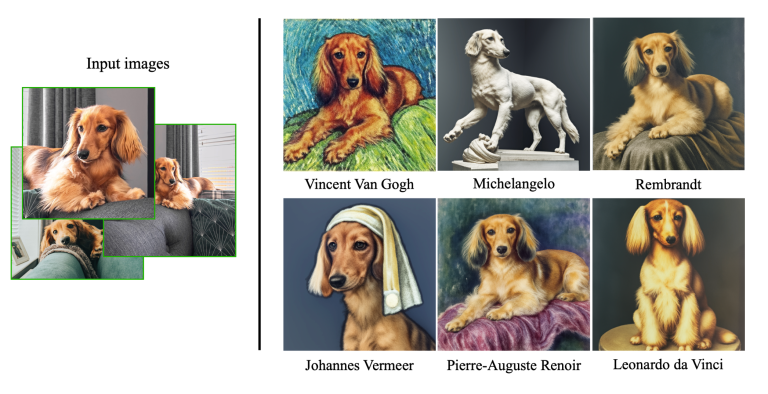
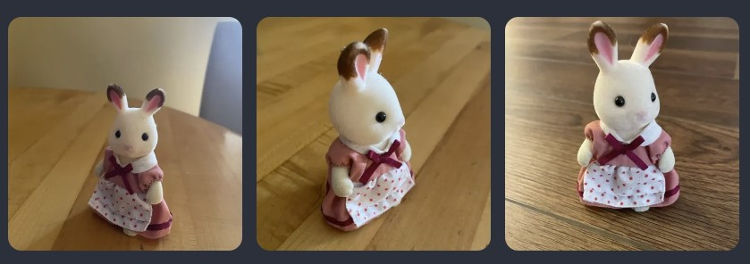
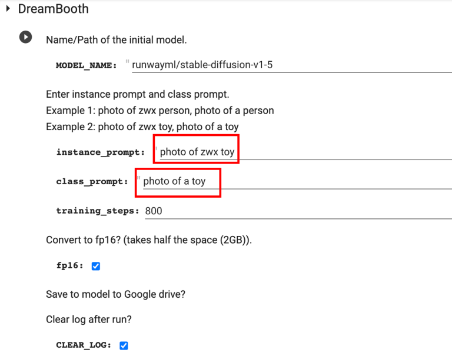
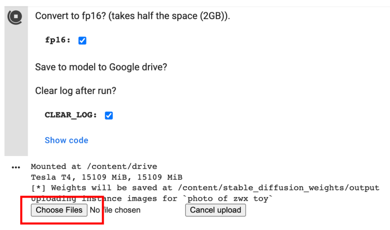
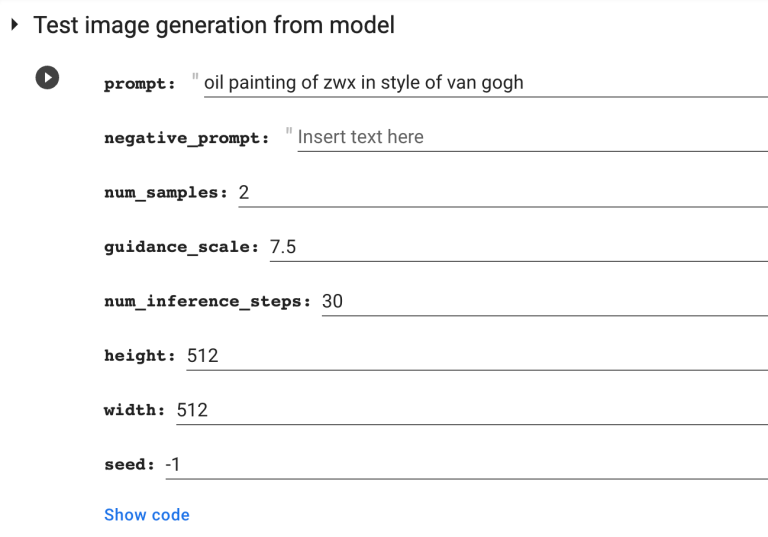
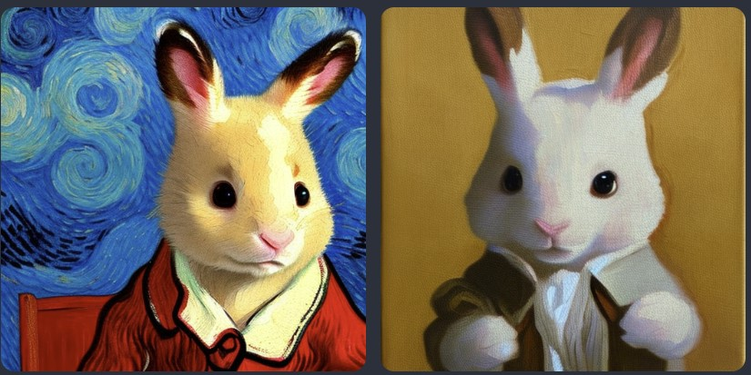
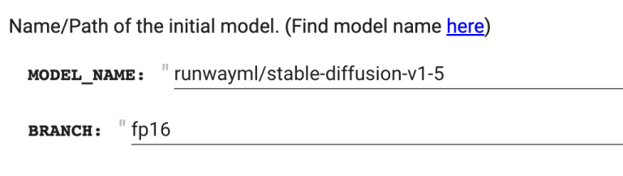
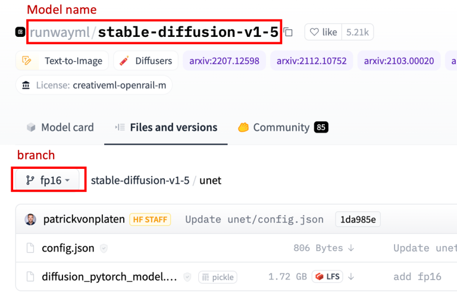

# [How to use Dreambooth to put anything in Stable Diffusion](https://stable-diffusion-art.com/dreambooth/)

Dreambooth 是一种将任何东西——你所爱的人、你的狗、你最喜欢的玩具放入一个 Stable Diffusion 模型的一个方法。我们将介绍 Dreambooth 是什么，它是如何工作的，以及如何进行训练。

这个教程旨在面向那些使用过 Stable Diffusion 但从未使用过 Dreambooth 的人。

你知道吗？许多[自定义模型](https://stable-diffusion-art.com/models/)都是使用 Dreambooth 进行训练的。完成本教程后，您将知道如何制作自己的模型。

如果您只对训练感兴趣，可以跳过到训练部分。

## What is Dreambooth?

[Dreambooth](https://dreambooth.github.io/) 是一种注入自定义主题到扩散模型（如 Stable Diffusion）中进行微调的技术，由 Google 研究团队于 2022 年发表。

为什么叫Dreambooth呢？根据Google研究团队的说法

> 它就像一个照相亭，但是一旦主题被捕捉到，它可以在你的梦想带你去的任何地方合成。

听起来很棒！但它的工作效果如何呢？以下是研究文章中的一个例子。只使用特定狗（我们称她为 Devora）的 3 张图片作为输入，dreamboothed 模型可以生成 Devora 在不同背景下的图像。

图 1：只需 3 张训练图像，Dreambooth 就可以将自定义主题无缝注入扩散模型

### How does Dreambooth work?

你可能会问，为什么不能简单地使用这些图像进行额外的模型训练？问题在于这样做已知会由于过度拟合（由于数据集非常小）和[语言漂移](https://arxiv.org/abs/1909.04499)而导致灾难性的失败。

Dreambooth 通过以下方式解决了这些问题：

1. 对于新主题使用罕见的单词（请注意，我为狗使用了一个罕见的名字 Devora），以便它在模型中一开始就没有太多意义。
2. 类别的先验保留：为了保留类别的含义（在上面的例子中是狗），模型被微调，以便注入主题（Devora）的同时保留类别（狗）的图像生成。

还有一种类似的技术叫做文本反演。不同之处在于 Dreambooth 微调整个模型，而文本反演则注入一个新单词，而不是重用罕见单词，并仅微调模型的文本嵌入部分。

### What you need to train Dreambooth

你将需要三样东西：

1. 一些自定义图片
2. 一个唯一标识符
3. 一个类名

在上面的例子中，唯一标识符是 Devora，类名是狗。

然后你需要构建你的实例提示：

> a photo of [unique identifier] [class name]

和类提示：

> a photo of [class name]

在上面的例子中，实例提示是：

> a photo of Devora dog

由于 Devora 是一只狗，所以类提示是：

> a photo of a dog

现在你明白你需要什么了，让我们深入学习吧！

## Step-by-step guide

### Get training images

与任何机器学习任务一样，高质量的训练数据是您成功的最重要因素。拍摄 3-10 张自定义主题的照片。照片应从不同角度拍摄。主题还应在各种背景下拍摄，以便模型可以将主题与背景区分开来。

我将在本教程中使用这个玩具。

### Resize your images

为了在训练中使用这些图像，您需要将它们先调整为512×512像素，以便与v1模型一起进行训练。[BIRME](https://www.birme.net/?target_width=512&target_height=512) 是一个方便的网站，可以调整图像大小。

1. 将您的图像拖到BIRME页面上。
2. 调整每个图像的画布，以便充分显示主题。 
3. 确保宽度和高度都为512像素。 
4. 按 `SAVE FILES` 按钮将调整大小后的图像保存到您的计算机上。

或者，如果您只想学习本教程，可以下载教程调整大小的图像。[Download](https://stable-diffusion-art.com/wp-content/uploads/2022/12/dreambooth_training_images.zip)

### Training

我建议使用 Google Colab 进行训练，因为它可以节省设置的麻烦。以下 notebook 本是从 [Shivam Shrirao](https://github.com/ShivamShrirao) 的仓库修改而来，但更加用户友好。如果您喜欢其他设置，请按照仓库的说明进行操作。

整个训练大约需要30分钟。如果您不经常使用 Google Colab，则可能可以在不断开连接的情况下完成训练。购买一些计算信用点以避免断开连接的烦恼。截至 2022 年 12 月，10 美元将为您提供 50 小时，因此成本不高。

Notebook 将把模型保存到您的 Google Drive 中。如果您选择fp16（推荐），请确保至少有 2GB，如果没有，则需要 4GB。

1. 获取此 Dreambooth 指南并打开 Colab notebook。

2. 如果要从 Stable Diffusion v1.5 模型进行训练（推荐），则无需更改 MODEL_NAME。

3. 输入实例提示和类提示。对于我的图像，我将我的玩具兔子命名为 zwx，因此我的实例提示是 “photo of zwx toy”，我的类提示是 “photo of a toy”。

   

4. 点击左侧的运行按钮开始训练

5. 授予访问 Google Drive 的权限。目前，除了保存到 Google Drive 之外，没有简单的方法来下载模型文件。

6. 按下 `Choose Files` 上传缩放后的图像

   

7. 完成训练大约需要30分钟。完成后，您应该会看到从新模型生成的一些示例图像。

8. 您的自定义模型将保存在您的 Google Drive 中，位于 Dreambooth_model 文件夹下。下载模型检查点文件并将其安装在您喜欢的 GUI 中。

就是这样！

### Testing the model

您可以使用 notebook 的第二个单元格来测试使用模型。

使用提示

> oil painting of zwx in style of van gogh

通过我的新训练模型，我对我得到的结果感到满意：

## Using the model

您可以在 AUTOMATIC1111 GUI 中使用模型检查点文件。它是一个免费的、功能齐全的 GUI，您可以在Windows、Mac上 安装，或在 Google Colab 上运行。

如果您还没有使用 GUI，并且模型文件已经保存在您的 Google Drive 中，最简单的方法是使用 Google Colab 选项。您需要做的就是在 Google Drive 中放入模型路径以使用它。有关更多详细信息，请参见[教程](https://stable-diffusion-art.com/automatic1111-colab/#Step-by-step_instructions_to_run_Colab_notebook)。

## How to train from a different model

你将需要修改 `MODEL_NAME` 和 `BRANCH`。

目前，notebook 仅支持训练半精度 v1 模型。您可以通过查看模型大小来判断。它应该是大约2GB。

您可以在 Huggingface 页面上找到模型名称和分支名称，如下所示。下面显示的页面在[此处](https://huggingface.co/runwayml/stable-diffusion-v1-5/tree/fp16)。

## Further readings

如果您想深入了解 Dreambooth，我建议您阅读以下文章。

- [Training Stable Diffusion with Dreambooth using Diffusers – Huggingface blog](../huggingface博客/Training Stable Diffusion with Dreambooth using Diffusers.md)
- [Dreambooth training guide – nitrosocke](https://github.com/nitrosocke/dreambooth-training-guide)
- [BlueFaux’s dreamBooth guide](https://docs.google.com/document/d/1xHSHEohmCOLlhdCY0ox4EARFKKU29XbFd8ji8UgjGn4/edit)
- [The research paper](https://arxiv.org/abs/2208.12242)

<!-- 完成标志, 看不到, 请忽略! -->