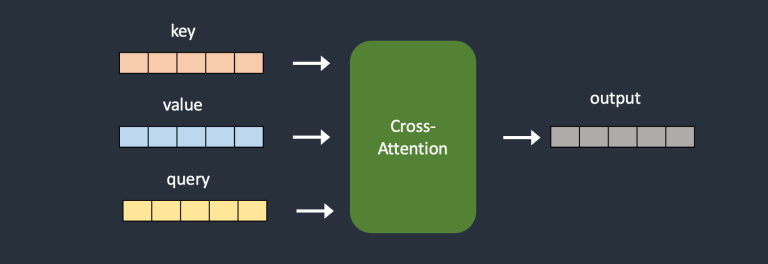
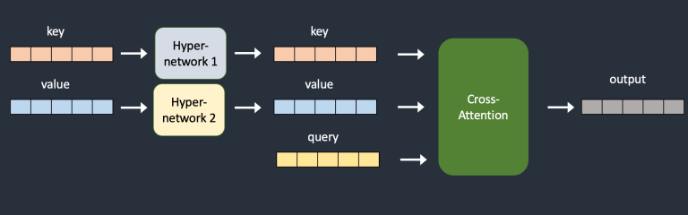
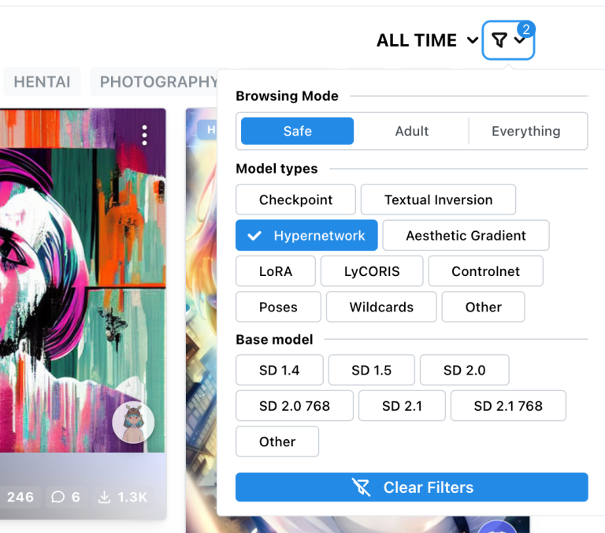
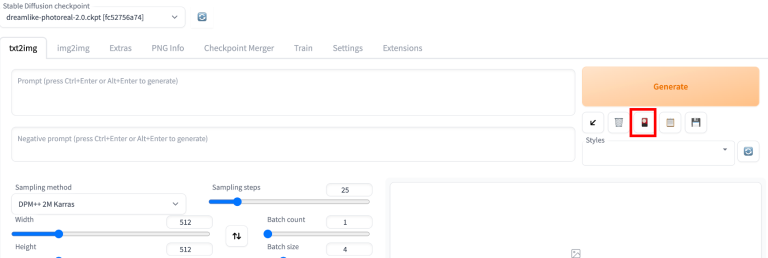
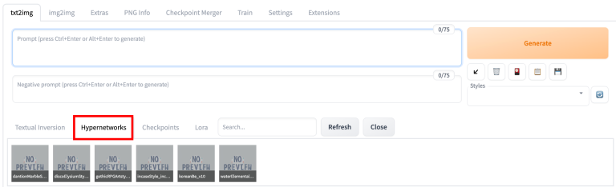

# [What are hypernetworks and the ones you should know](https://stable-diffusion-art.com/hypernetwork/)

您准备好将您的 Stable Diffusion 技能提升到更高的水平了吗？如果是这样，让我们谈谈 Hypernetwork 模型。在本文中，您将学习有关 Hypernetwork 的一切知识以及如何使用它们来实现您所需的结果。我将涵盖从 Hypernetwork 模型的基础知识到如何使用它与 AUTOMATIC1111 Stable Diffusion GUI 的所有内容。此外，我还将向您展示我在自己的工作中使用的一些最喜欢的 HyperNetwork 。所以，请系好安全带，让我们一起探索 HyperNetwork 模型的世界。

## What is a hypernetwork in Stable Diffusion?

Hypernetwork 是一种由 Novel AI 最初开发的微调技术，它是一个附加到 Stable Diffusion 模型的小型神经网络，用于修改其风格。

小型 HyperNetwork 插入在哪里？当然是 Stable Diffusion 模型的最关键部分：噪声预测器 UNet 的交叉注意力模块。LoRA 模型以不同的方式类似地修改了 Stable Diffusion 模型的这一部分。

Hypernetwork 通常是一个简单的神经网络：一个具有 dropout 和激活的全连接线性网络，就像您在神经网络入门课程中学到的那些一样。它们通过插入两个网络来转换 key 和 value 向量来劫持交叉注意力模块。请参见下面的原始和劫持模型架构进行比较。

> HyperNetwork 作用于 noise predictor 中的交叉注意力层。HyperNetwork 是一个带 dropout 和激活的全连接网络。修改交叉注意力模块中的 key 和 value。





图 2：Hypernetwork 添加额外的神经网络来转换 keys 和 values

在训练期间，Stable Diffusion 模型被锁定，但允许更改附加的 HyperNetwork 。由于 HyperNetwork 很小，训练速度快，需要的资源有限。训练可以在普通计算机上进行。快速训练和小的文件大小是 HyperNetwork 的主要吸引力。

您应该知道，它与机器学习中通常所知的 [Hypernetwork ](https://arxiv.org/abs/1609.09106) 不同。那是一个为另一个网络生成权重的网络。因此，Stable Diffusion 的 Hypernetwork 并不是在 2016 年发明的。

## Difference from other model types

我将解释 HyperNetwork 与其他模型类型之间的区别，以帮助您理解并决定使用哪种。

本节面向好奇心或模型训练者。如果您不关心它们如何工作，可以跳到下一节。

### Checkpoint models

Checkpoint 模型包含生成图像所需的所有必要信息。您可以通过它们的大文件大小来识别它们。它们的大小范围从 2 到 7 GB。 HyperNetwork 通常低于 200 MB。

 HyperNetwork 不能单独运行。它需要与 checkpoint 模型一起工作才能生成图像。

Checkpoint 模型比 HyperNetwork 更强大。它可以比 HyperNetwork 更好地存储样式。在训练 checkpoint 模型时，整个模型都会进行微调。在训练 HyperNetwork 时，只有 HyperNetwork 会进行微调。

### LoRA models

LoRA 模型与 HyperNetwork 最相似。它们都很小，只修改交叉注意力模块。区别在于它们如何修改它。LoRA 模型通过改变权重来修改交叉注意力。 HyperNetwork 通过插入附加网络来实现。

用户通常发现 LoRA 模型产生更好的结果。它们的文件大小类似，通常低于 200 MB，比 checkpoint 模型小得多。

LoRA 是一种数据存储方法。它不定义训练过程，可以是 dreambooth 或附加训练。 HyperNetwork 定义了训练。

### Embeddings

嵌入是一种称为文本反演的微调方法的结果。与 HyperNetwork 一样，文本反演不会改变模型。它只是定义了新的关键字以实现某些样式。

文本反演和 HyperNetwork 在 Stable Diffusion 模型的不同部分上工作。文本反演在文本编码器中创建新的嵌入。 HyperNetwork 将一个小网络插入到噪声预测器的交叉注意力模块中。

根据我的经验，嵌入比 HyperNetwork 略微更强大。

## Where to find hypernetworks

最好的地方是 https://civitai.com。通过 Hypernetwork 模型类型过滤。



## How to use hypernetworks

### Step 1: Install a hypernetwork model

要在 [AUTOMATIC1111 webui](https://github.com/AUTOMATIC1111/stable-diffusion-webui) 中安装 HyperNetwork 模型，请将模型文件放入以下文件夹：

```
stable-diffusion-webui/models/hypernetworks
```

### Step 2: Use a hypernetwork model

要使用 HyperNetwork ，请在提示符中输入以下短语：

```
<hypernet:filename:multiplier>
```

`filename` 是 HyperNetwork 的文件名，不包括扩展名 (.pt、.bin 等)。

`multiplier` 是应用于 HyperNetwork 模型的权重。默认值为 1。将其设置为 0 会禁用该模型。

如何确保文件名正确？不要写这个短语，而是点击“生成”按钮下面的“模型”按钮。



点击 HyperNetwork tab 页。您应该会看到已安装的 HyperNetwork 列表。单击您想要使用的那个。hypernet 短语将插入提示符中。



请注意， hypernetwork 短语不被视为提示的一部分。它只是指示使用哪些 hypernetwork 。在应用 hypernetwork 后，它将被删除。因此，您不能使用任何提示语法，例如 `[keyword1：keyword2：0.5]`。

### Step 3: Testing and creating art with the model

为了使自己有最大的成功机会解锁预期风格，请首先将它与训练它的模型一起使用。但不要止步于此。有些 hypernetwork 需要特定的提示或仅适用于某些主题，因此请务必查看模型页面上的提示示例，以了解哪种方法最有效。

这里有一个专业技巧：如果您发现您的图像看起来过于饱和，那么这可能意味着您需要调整乘数。这是一个简单的修复方法。Stable Diffusion 有时会将颜色饱和度解释为达到目标的完美方式，但减少权重可以帮助平衡。

一旦您确认您的 hypernetwork 正在发挥其魔力，为什么不尝试在其他模型上使用它呢？您永远不知道可能会出现什么有趣和意外的效果，而且让我们真实一点，玩耍就是纯粹的乐趣。所以，请放心发挥创造力。

## Some hypernetworks I use

 这里是我偏见选择的 hypernetwork 。

### Water Elemental

水元素是一种独特的 hypernetwork ，可以将任何东西变成水！在主题前使用短语 “water elemental”。确保描述背景。您可以将此 hypernetwork 与 Stable Diffusion v1.5一起使用。更改 hypernetwork 权重以调整水效果。

- [Water Elemental Hypernetwork 模型页面](https://civitai.com/models/1399/water-elemental)

Prompt:

```
water elemental woman walking across a busy street <hypernet:waterElemental_10:0.7>
```

```
water elemental a boy running on water <hypernet:waterElemental_10:1>
```

### InCase Style

InCase Style 与 Anything v3 模型一起使用。它修改 Anything v3 模型以产生更成熟的动漫风格。

- [InCase Hybernetwork 模型页面](https://civitai.com/models/5124/incase-style-hypernetwork)

- [Anything v3 模型页面](https://huggingface.co/Linaqruf/anything-v3.0)

Prompt:

```
detailed face, a beautiful woman, explorer in forest, white top, short brown pants, hat, sky background, realism, small breast <hypernet:incaseStyle_incaseAnythingV3:1>
```

Negative prompt:

```
moon, ugly, tiling, poorly drawn hands, poorly drawn feet, poorly drawn face, out of frame, extra limbs, disfigured, deformed, body out of frame, bad anatomy, watermark, signature, cut off, low contrast, underexposed, overexposed, bad art, beginner, amateur, distorted face, blurry, draft, grainy, large breast
```

### Gothic RPG Artstyle

哥特式 RPG 艺术风格产生了一种时尚的单色插图风格。与 Protogen 模型一起使用。

- [Gothic RPG Artstyle Hypernetwork 模型页面](https://civitai.com/models/5814/gothic-rpg-artstyle)

- [Protogen v2.2 模型页面](https://huggingface.co/darkstorm2150/Protogen_v2.2_Official_Release)

Prompt:

```
drawing male leather jacket cyberpunk 2077 on a city street by WoD1 <hypernet:gothicRPGArtstyle_v1:1>
```

## Readings

这里有一些有趣的阅读材料。

- [Hypernetwork Style Training, a tiny guide](https://github.com/AUTOMATIC1111/stable-diffusion-webui/discussions/2670) – 详细的训练指南。
- [Illustrated self-attention](https://towardsdatascience.com/illustrated-self-attention-2d627e33b20a) – 解释了自注意力的数学，这与交叉注意力类似。
- [NovelAI’s improvements on Stable Diffusion](https://blog.novelai.net/novelai-improvements-on-stable-diffusion-e10d38db82ac) – 请参见 "Hypernetworks" 部分以了解他们的贡献。其他改进也很有趣。
- [Adding Conditional Control to Text-to-Image Diffusion Models](https://arxiv.org/abs/2302.05543) – 这是ControlNet论文，但第2.1节 (相关工作) 包含了超网络的说明。

