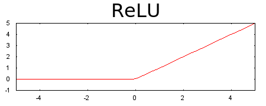
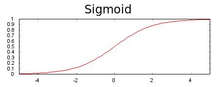
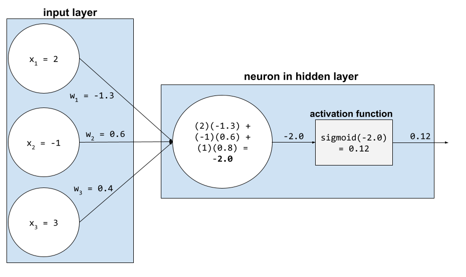
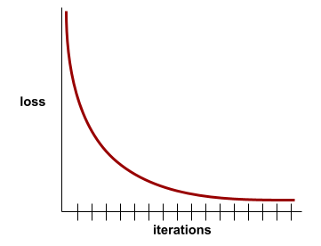

# [机器学习术语](https://developers.google.com/machine-learning/glossary)

根据首字母排序

| 索引   |    V1     |    V2     |    V3     |    V4     |    V5     |    V6     |    V7     |    V8     |    V9     |    V10    |
| :----- | :-------: | :-------: | :-------: | :-------: | :-------: | :-------: | :-------: | :-------: | :-------: | :-------: |
| **U1** | -[Q](#q)- | -[W](#W)- | -[E](#E)- | -[R](#R)- | -[T](#T)- | -[Y](#Y)- | -[U](#U)- | -[I](#I)- | -[O](#O)- | -[P](#P)- |
| **U2** | -[A](#A)- | -[S](#S)- | -[D](#D)- | -[F](#F)- | -[G](#G)- | -[H](#H)  | -[J](#J)- | -[K](#K)- | -[L](#L)- |           |
| **U3** |           | -[Z](#Z)- | -[X](#X)- | -[C](#C)- | -[V](#V)- | -[B](#B)- | -[N](#N)- | -[M](#M)- |           |           |

## A

### 消融实验 (ablation)

一种通过暂时从[模型](#模型-model)中删除某个[特征](#特征-feature)或组件来评估其重要性的技术。之后你在没有该特征或组件的情况下重新训练模型,如果重新训练的模型表现显著降低,则说明被删除的特征或组件很可能是重要的。

例如,假设你在10个特征上训练了一个[分类模型](#分类模型-classification-model),在[测试集](#测试集-test-set)上达到了88%的[精确率](#精确率-precision)。为了检查第一个特征的[重要性](#变量重要性-variable-importances),你可以只用其他9个特征重新训练模型。如果重新训练的模型表现明显变差(例如精确率下降到55%),那么被移除的特征很可能是重要的。反之,如果重新训练的模型表现一样好,那么该特征可能不是非常重要。

消融实验也可以帮助确定以下内容的重要性:

- 更大的组件,例如更大ML系统中的整个子系统
- 流程或技术,例如数据预处理步骤

在这两种情况下,你都可以观察系统性能在移除组件之后是否发生变化来判断组件的重要性。


### A/B 测试 (A/B testing)

一种用于比较两种(或多种)技术的统计方法——A 和 B。通常,A 是现有技术,B 是新技术。A/B 测试不仅可以确定哪种技术的表现更好,还可以确定两者间的差异是否具有显著的统计意义。

A/B 测试通常在两种技术上比较单个[指标](#指标-metric);例如,两个技术的模型[准确率](#准确率-accuracy)如何比较？但是,A/B 测试也可以比较任意数量的指标。

### 加速芯片 (accelerator chip)

一类专门设计来执行深度学习算法所需的关键计算的专用硬件组件。

与通用 CPU 相比,加速芯片(简称[加速器](#加速器-accelerator))可以显著提高训练和推理任务的速度和效率。它们非常适合训练神经网络和其他计算密集型任务。

加速芯片的例子包括:

* Google 的 Tensor Processing Units ([TPUs](#TPU)),具有专门的深度学习硬件。

* NVIDIA 的 GPU,虽然最初是为图形处理而设计,但经过优化可以实现并行处理,从而显著提高处理速度。

### 准确率 (accuracy)

正确的分类[预测](#预测-prediction)数除以总预测数。即:

$$
\mathrm{Accuracy} = \frac{\mathrm{correct} \ \mathrm{predictions}}{\mathrm{correct} \ \mathrm{predictions} + \mathrm{incorrect} \ \mathrm{predictions}}
$$

其中：

- correct predictions 是正确预测
- incorrect predictions 是错误预测

例如,一个模型做出 40 个正确预测和 10 个错误预测,其准确率为:

$$
\mathrm{Accuracy} = \frac{40}{40 + 10} = 80%
$$

[二分类](#二分类-binary-classification)对不同的“正确预测”和“错误预测”类别的提供了具体命名。所以,二分类的准确率公式如下:

$$
\mathrm{Accuracy} = \frac{\mathrm{TP} + \mathrm{TN}}{\mathrm{TP} + \mathrm{TN} + \mathrm{FP} + \mathrm{FN}}
$$

其中:

- TP 是[真正例](#真正例-true-positive-TP)(正确预测)的数量。
- TN 是[真负例](真负例-true-negative-TN)(正确预测)的数量。 
- FP 是[假正例](#假正例-false-positive-FP)(错误预测)的数量。
- FN 是[假负例](#假负例-false-negative-FN)(错误预测)的数量。

将准确率与[精确率](#精确率-precision)和[召回率](#召回率-recall)进行比较。

<details><summary><em>[点击查看额外笔记]</em></summary>
<br>
尽管在某些情况下,准确度是一个有价值的指标,但在其他情况下,准确度具有高度误导性。 注意,对于处理[类别不平衡的数据集](#类别不平衡的数据集-class-imbalanced-dataset)的分类模型来说,准确度通常是一个较差的指标。

例如,假设一个某个亚热带城市一百年里只下雪25天。由于无雪天数(负样本)远远多于下雪天数(正样本),这个城市的下雪数据集是类别不均衡的。想象一个[二分类](#二分类-binary-classification)模型,它每天预测下雪或不下雪,但只是每天都预测“不下雪”。这个模型准确度很高,但没有任何预测能力。下表总结了一个世纪的预测结果:

| Category | Number |
| :------- | :----- |
| TP       | 0      |
| TN       | 36500  |
| FP       | 25     |
| FN       | 0      |

```
accuracy = (TP + TN) / (TP + TN + FP + FN)
accuracy = (0 + 36500) / (0 + 36500 + 25 + 0) = 0.9993 = 99.93%
```

尽管99.93%的准确率似乎是一个非常令人印象深刻的百分比,但这个模型实际上没有任何预测能力。

对于训练在类别不均衡数据集上的模型,与**准确率**相比,[精确率](#精确率-precision)和[召回率](#召回率-recall)通常是更有用的评价指标。

</details>

### 动作 (action)

在[强化学习](#强化学习-reinforcement-learning)中,[智能体](#智能体-agent)在[环境](#环境-environment)的[状态](#状态-state)之间转换的机制。智能体通过[策略](#策略-policy)来选择动作。

动作是智能体对环境做出的操作。一些关键点:

- 动作会使环境的状态发生转移。
- 不同的动作会导致不同的状态转移结果。
- 动作的好坏会通过奖励函数来评估。
- 智能体的目标是最大化累积奖励。
- 智能体需要学习一个最优策略来选择动作。

例如在走迷宫游戏中,智能体的动作可以是“向上走”、“向下走”、“向左走”、“向右走”。做出不同动作会使智能体到达不同的迷宫位置。

选择正确的动作序列可以最大化累积奖励,帮助智能体达成目标。

### 激活函数 (activation function)

使[神经网络](#神经网络-neural-network)能够学习[特征](#特征-feature)和[标签](#标签-label)之间的[非线性](#非线性-nonlinear)(复杂)关系的函数。

常用的激活函数包括:

- [ReLU](#)
- [Sigmoid](#)

激活函数的曲线图从来都不会是单一的直线。例如,ReLU 激活函数的曲线图由两段直线组成:



Sigmoid 激活函数图如下所示：



<details><summary><em>[点击查看示例]</em></summary>
<br>

在神经网络中,激活函数操纵进入一个[神经元](#神经元-neuron)的所有输入的[加权和](#加权和-weighted-sum)。要计算加权和,神经元将相关值和权重的乘积全部相加。例如,假设进入一个神经元的相关输入如下:

| input value | input weight |
| ----------- | ------------ |
| 2           | -1.3         |
| -1          | 0.6          |
| 3           | 0.4          |

则加权和为:

```python
weighted sum = (2)(-1.3) + (-1)(0.6) + (3)(0.4) = -2.0
```

假设这个神经网络的设计者选择了 [sigmoid 函数](#sigmoid-函数-sigmoid-function)作为激活函数。在这种情况下,神经元计算 -2.0 的 sigmoid,约为0.12。因此,神经元将0.12(而不是-2.0)传递给神经网络的下一层。相关过程可表示为:



</details>

### 自编码器 (autoencoder)

一个学习从输入中提取最重要信息的系统。自动编码器由一个[编码器](#编码器-encoder)和[解码器](#解码器-decoder)组成。自动编码器依赖以下两步过程:

1. 编码器将输入映射到一个(通常)有损的较低维(中间)格式。
2. 解码器通过将较低维格式映射回原始的较高维输入格式,构建输入的一个有损版本。

自动编码器通过让解码器尽可能准确地从编码器的中间格式重构原始输入来端到端训练。因为中间格式比原始格式维度更低,自动编码器被迫学习输入中的哪些信息是必要的,输出不会与输入完全相同。

例如:

- 如果输入数据是图像,不精确的复制版本会类似于原始图像,但有些修改。也许不精确的复制版本会从原始图像中去除噪声,或者填补一些丢失的像素。
- 如果输入数据是文本,自动编码器会生成模拟(但不相同于)原始文本的新文本。

参见[变分自编码器](#变分自编码器-variational-autoencoder-VAE)。


## B

### 偏置 (bias)


### 二分类 (binary classification)

一种[分类](#分类-classification)任务,用于预测两种互斥的类别之一:

* [正类](#正类-positive-class)

* [负类](#负类-negative-class)

例如,以下两个机器学习模型各自执行二元分类:

* 一个确定电子邮件信息是垃圾邮件(正类)还是非垃圾邮件(负类)的模型。

* 一个评估医学症状来确定一个人是否有某种特定疾病(正类),或者没有那种疾病(负类)的模型。

与[多分类](#多分类-multi-class-classification)进行比较。

参见[逻辑回归](#逻辑回归-logistic-regression)和[分类阈值](#分类阈值-classification-threshold)。


## C

### 类别 (class)

一个[标签](#标签-label)可以所属的类别。比如:

- 在一个[二分类](#)模型中,用来检测垃圾邮件,两个类别可能是“垃圾邮件”和“非垃圾邮件”。
- 在一个[多分类]()模型中,用来识别狗的品种,类别可能是“贵宾”、“比格犬”、“布偶犬”等等。

一个[分类模型](#分类模型-classification-model)预测一个类别。相反,一个[回归模型](#回归模型-regression-model)预测一个数值而不是一个类别。

### 分类模型 (classification model)

其预测结果为一个[类别](#类别-class)的[模型](#模型-model)。例如,以下都是分类模型:

- 预测输入句子的语言(法语?西班牙语?意大利语?)的模型。
- 预测树种(枫树?橡树?猴面包树?)的模型。
- 预测某种医疗状况的正类或负类的模型。

相比之下,**回归模型**预测数字而不是类别。

两种常见的分类模型类型是:

- **二分类**:二元分类,只有两个类别。
- **多分类**:有多个类别,模型从中预测正确的一个。

分类模型通过学习输入与类别标签之间的关系,对新输入进行预测,属于监督学习的一种。分类模型的评估指标有精确率、召回率、F1分数等。选择合适的分类模型需要根据问题需求和数据集特点来进行。

### 分类阈值 (classification threshold)

在[二分类](#二分类-binary-classification)问题中,将[逻辑回归](#逻辑回归-logistic-regression)模型的原始输出转换为[正类](#正类-positive-class)或[负类](#负类-negative-class)预测的一个 0 到 1 之间的数值。注意,分类阈值是人为选择的,而不是通过模型训练得到的。

逻辑回归模型输出一个 0 到 1 之间的原始值。然后:

- 如果原始值大于分类阈值,预测为正类。

- 如果原始值小于分类阈值,预测为负类。

例如,假设分类阈值是0.8。如果原始值为0.9,模型预测正类。如果原始值为0.7,模型预测负类。

分类阈值的选择会对[假正例]()和[假负例]()的数量产生很大影响。

<details><summary><em>[点击展开额外补充]</em></summary>
<br>

随着模型或数据集的变化,工程师有时也会改变分类阈值。当分类阈值改变时,原本的正类预测可能会突然变成负类,反之亦然。

例如,考虑一个二分类疾病预测模型。假设第一年系统运行时:

- 某患者的原始输出为0.95
- 分类阈值为0.94

因此,系统预测该患者为正类(患病)。

一年后,值可能如下:

- 该患者的原始输出仍为0.95  
- 分类阈值改为0.97

于是,系统现在将该患者重新分类为负类(不患病)。同一个患者,预测结果改变。

分类阈值的调整需要谨慎,要评估其对不同错误类别的影响。

</details>

### 聚类 (clustering)


## D

### 决策树 (decision tree)


## E

### 样本 (example)

一组[特征](#特征-feature)值和可能的[标签](#标签-label)组成的数据。在[监督学习中](#监督机器学习-supervised-machine-learning),样本可以分为两类:

- [已标注样本](#已标注样本-labeled-example):包含一个或多个特征及标签。用于模型训练。
- [无标注样本](#无标注样本):只包含一个或多个特征,无标签。用于模型推理。

例如,假设你正在训练一个模型来确定天气条件对学生成绩的影响。以下是三个已标注样本:

| Features    |          |          | Label      |
| :---------- | :------- | :------- | :--------- |
| Temperature | Humidity | Pressure | Test score |
| 15          | 47       | 998      | Good       |
| 19          | 34       | 1020     | Excellent  |
| 18          | 92       | 1012     | Poor       |

以下是三个无标注样本:

| Temperature | Humidity | Pressure |      |
| :---------- | :------- | :------- | :--- |
| 12          | 62       | 1014     |      |
| 21          | 47       | 1017     |      |
| 19          | 41       | 1021     |      |

一个[数据集](#数据集-dataset)的一行通常是样本的原始来源。也就是说,一个样本通常包含数据集中部分列。此外,样本中的特征还可以包括[合成特征](#合成特征-synthetic-feature)，例如[特征交叉](#特征交叉-feature-cross)。

样本是训练和应用机器学习模型的基础单位。

## F

### 假负例 (false negative (FN))

模型错误地预测为[负类](#负类-negative-class)的示例。例如,模型预测一封特定的电子邮件消息不是垃圾邮件(负类),但该消息实际上是垃圾邮件。

在二分类问题中,根据真实类别和预测类别的组合,结果可以分为:

- 真正例(True Positive, TP): 真实为正类,预测也为正类
- 真负例(True Negative, TN): 真实为负类,预测也为负类
- 假正例(False Positive, FP): 真实为负类,预测为正类
- 假负例(False Negative, FN): 真实为正类,预测为负类

假负例在很多场景下是一个严重的错误,例如疾病检测、网络欺诈等。它代表模型漏掉了正类实例。

减少假负例通常需要提高模型的召回率。方法包括获取更多正类数据、使用 Ensemble 等。

### 特征 (feature)

机器学习模型的输入变量。一个[样本](#样本-example)包含一个或多个特征。例如,你正在训练一个模型来确定天气条件对学生考试成绩的影响。下表显示了3个样本,每个样本包含3个特征和1个标签:

| Features    |          |          | Label      |
| :---------- | :------- | :------- | :--------- |
| Temperature | Humidity | Pressure | Test score |
| 15          | 47       | 998      | 92         |
| 19          | 34       | 1020     | 84         |
| 18          | 92       | 1012     | 87         |

特征是描述和区分不同样本的数据。特征越能代表样本的差异,模型就能更好地进行模式识别和预测。选择合适的特征对建立一个好的机器学习模型非常重要。

常见的特征类型包括:数值特征、类别特征、文本特征、图像特征等。特征工程包括特征选择、转换、处理等过程。

与[标签](#标签-label)对比

### 小样本学习 (few-shot learning)

一种机器学习方法,通常用于对象分类,旨在仅从少量训练样本中训练出有效的分类器。

参见[单样本学习](#单样本学习-one-shot-learning)和[零样本学习](#零样本学习-zero-shot-learning)。

## H

### 隐藏层 (hidden layer)


## L

### 标签 (label)

在[监督机器学习](#监督机器学习-supervised-machine-learning)中,[样本](#样本-example)的“答案”或“结果”部分。

每个[已标注样本](#已标注样本-labeled-example)由一个或多个[特征](#特征-feature)和一个标签组成。例如,在垃圾邮件检测数据集中,标签可能是“垃圾邮件”或“非垃圾邮件”。在降雨量数据集中,标签可能是某段时间内的降雨量。

### 已标注样本 (labeled example)

包含一个或多个[特征](#特征-feature)和一个[标签](#标签-label)的样本。例如,下表显示了房价预测模型的三个已标注样本,每个样本都包含三个特征和一个标签:

| Number of bedrooms | Number of bathrooms | House age | House price (label) |
| :----------------- | :------------------ | :-------- | :------------------ |
| 3                  | 2                   | 15        | $345,000            |
| 2                  | 1                   | 72        | $179,000            |
| 4                  | 2                   | 34        | $392,000            |

在[监督机器学习](#监督机器学习-supervised-machine-learning)中,模型在已标注样本上训练,并对[无标注样本](#无标注样本-unlabeled-example)进行预测。

标注样本与无标注样本形成对比。

### 标签泄漏 (label leakage)

一种模型设计缺陷,其中一个[特征](#特征-feature)是[标签](#标签-label)的代理。例如,考虑一个[二分类](#二分类-binary-classification)模型,用于预测一个潜在客户是否会购买某种产品。假设模型的特征之一是一个名为 `SpokeToCustomerAgent` 的布尔值。进一步假设客服专员只会在潜在客户实际购买产品之后才被分配。在训练期间,模型会快速学习 `SpokeToCustomerAgent` 特征和标签之间的关联。

### 线性模型 (linear model)

一种为每个[特征](#特征-feature)分配一个[权重](#权重-weight)来做出[预测](#预测-prediction)的[模型](#模型-model)。(线性模型还包含一个[偏置](#偏置-bias)。)相比之下,[深度模型](#深度模型-deep-model)中的特征与预测之间的关系通常是**非线性**的。

线性模型通常比深度模型更易于训练,并且更具[可解释性](#可解释性-interpretable)。但是,深度模型可以学习特征之间的复杂关系。

[线性回归](#线性回归-linear-regression)和[逻辑回归](#逻辑回归-logistic-regression)是两种线性模型。

<details><summary><em>[点击查看相关数学]</em></summary>
<br>
线性模型遵循以下公式：

$$
y' = b + w_1 x_1 + w_2 x_2 + \dots w_n x_n
$$

其中:

- $y'$ 是原始预测。(在某些类型的线性模型中,这个原始预测将被进一步修正。例如,参见[逻辑回归](#逻辑回归-logistic-regression)。)
- $b$ 是[偏置](#偏置-bias)。
- $w$ 是[权重](#权重-weight),所以 $w_1$ 是第一个特征的权重, $w_2$ 是第二个特征的权重,以此类推。
- $x$ 是[特征](#特征-feature),所以 $x_1$ 是第一个特征的值, $x_2$ 是第二个特征的值,以此类推。

例如,假设一个线性模型对三个特征学习到以下的偏置和权重:

- $b = 7$
- $w_1 = -2.5$
- $w_2 = -1.2$
- $w_3 = 1.4$

因此,给定三个特征 $(x_1,x_2,x_3)$ ,线性模型使用以下公式生成每个预测:

$$
y' = 7 + (-2.5)(x_1) + (-1.2)(x_2) + (1.4)(x_3)
$$

假设一个特定的例子包含以下值:

- $x_1 = 4$
- $x_2 = -10$
- $x_3 = 5$

将这些值代入公式得到这个例子的预测:

$$
y' = 7 + (-2.5)(4) + (-1.2)(-10) + (1.4)(5) \\
y' = 16
$$

线性模型不仅包括只使用线性方程进行预测的模型,还包括更广泛的一组模型,这些模型只将线性方程用作生成预测的公式的一个组成部分。例如,逻辑回归会对原始预测( $y'$ )进行后处理,以产生一个介于0和1之间的最终预测值。

</details>

### 线性回归 (linear regression)

一种机器学习模型,遵循以下两点:

- 模型是[线性模型](#线性模型-linear-model)。
- 预测结果是一个浮点数。(这就是在*线性回归*中的[回归](#回归-regression)部分。)

将线性回归与[逻辑回归](#逻辑回归-logistic-regression)进行对比。另外,将回归与[分类](#分类-classification)比较。

线性回归的优点包括:

- 模型形式简单,易于建立和解释
- 能够处理多维特征
- 计算高效

线性回归的缺点包括:

- 只能建模线性关系
- 对异常值敏感
- 可能导致过拟合

通过正则化、增强数据、使用特征工程等方法可以提高线性回归的性能。线性回归仍然是最简单有效的监督学习算法之一。

### 逻辑回归 (logistic regression)

一种用于预测概率的[回归模型](#回归模型-regression-model)。逻辑回归模型具有以下特征:

- 标签是[分类数据](#分类数据-categorical-data)。逻辑回归通常是指**二元逻辑回归**,也就是计算两个可能标签的值的概率。一个不太常见的变体**多项式逻辑回归**，可以计算具有两个以上可能值的标签的概率。

- 训练过程中的损失函数是[对数损失](#对数损失-log-loss)。(对于具有多于两个可能值的标签,可以并行放置多个对数损失单元。)

- 模型具有线性体系结构,而不是深度神经网络。但是,如果[深度模型](#深度模型-deep-model)预测分类标签的概率,这个定义的其余部分也适用。

例如,考虑一个逻辑回归模型,用于计算输入电子邮件是垃圾邮件还是非垃圾邮件的概率。在推理过程中,假设模型预测结果为0.72。因此,模型估计:

- 电子邮件为垃圾邮件的概率为72%。

- 电子邮件为非垃圾邮件的概率为28%。

逻辑回归模型使用以下两步架构:

1. 模型通过对输入特征进行线性函数运算生成原始预测值(y')。

2. 模型使用原始预测值作为输入到 [sigmoid 函数](#sigmoid-函数),将原始预测值转换为 0 到 1 之间的数值(不包括 0 和 1)。

与任何回归模型一样,逻辑回归模型预测一个数字。但是,这个数字通常作为二元分类模型的一部分,如下:

- 如果预测数字大于[分类阈值](#分类阈值-classification-threshold),则二元分类模型预测正类。

- 如果预测数字小于分类阈值,则二元分类模型预测负类。

## M

### 均方误差 (Mean Squared Error (MSE))


### 元学习 (meta-learning)

元学习是机器学习的一个子集,它发现或改进学习算法。元学习系统还可以训练模型,以便从少量数据或从以前任务中获得的经验中快速学习新任务。元学习算法通常试图实现以下目标:

- 改进/学习手工设计的特征(如初始化器或优化器)。
- 更高的数据效率和计算效率。
- 提高泛化能力。

元学习与[小样本学习](#小样本学习-few-shot-learning)有关。

### 指标 (metric)

一个你关心的统计数据。

[目标](#目标-objective)是机器学习系统企图优化的一个指标。

### 模型 (model)

通常,任何可以处理输入数据并返回输出的数学构造都可以称为模型。换句话说,模型是系统进行预测所需的参数和结构的集合。在[监督机器学习](#监督机器学习-supervised-machine-learning)中,模型将一个[样本](#样本-example)作为输入,并推理出一个[预测](#预测-prediction)作为输出。在监督学习中,不同的模型有些许区别。例如:

- 线性回归模型由一组[权重](#权重-weight)和一个[偏置](#偏置-bias)组成。

- [神经网络](#神经网络-neural-network)模型包含:
  - 一组[隐藏层](#隐藏层-hidden-layer),每个包含一个或多个[神经元](#神经元-neuron)。
  
  - 每个神经元相关的权重和偏置。
  
- [决策树](#决策树-decision-tree)模型包含:
- 树的形状;即条件和叶子节点的连接模式。
  
- 条件和叶子节点。

模型可以被保存、恢复或复制。

[无监督机器学习](#无监督机器学习-unsupervised-machine-learning)也会生成模型,通常是一个可以将输入映射到最合适的[簇](#聚类-clustering)的函数。

<details><summary><em>[点击图标比较代数和编程函数与机器学习模型]</em></summary>
<br>

像下面这样的代数函数是一个模型:

```
f(x, y) = 3x -5xy + y2 + 17
```

上述函数将输入值(x和y)映射到输出。

类似地,像下面的Python函数也是一个模型:

```python
def half_of_greater(x, y):
  if (x > y): 
    return(x / 2)
  else:
    return(y / 2)
```

调用者会向Python函数传入参数,然后函数生成输出(通过return语句)。

尽管**深度神经网络**的数学结构与代数或编程函数很不相同,但深度神经网络仍然接受输入(示例),并返回输出(预测)。

编程函数是由程序员手动编写。相比之下,机器学习模型会在自动化训练中逐步学习最优的参数。

</details>


## N

### 神经网络 (neural network)


### 神经元 (neuron)


## O

### 单样本学习 (one-shot learning) 

一种机器学习方法,通常用于对象分类,旨在从单个训练样本中学习有效的分类器。

参见[小样本学习](#小样本学习-few-shot-learning)和[零样本学习](#零样本学习-zero-shot-learning)。


## P

### 正类 (positive class)


### 精确率 (precision)

[分类模型](#分类模型-classification-model)的一个指标,用于回答以下问题:

> 当模型预测[正类](#正类-positive-class)时,预测正确的百分比是多少?

以下是公式:

$$
\mathrm{Precision} = \frac{\mathrm{true \ positives}}{\mathrm{true \ positives + false \ positives}}
$$

其中:

- true positive 是指模型正确地预测了正类。
- false positive 是指模型错误地预测了正类。

例如,假设一个模型做出了200次正类预测。在这200次正类预测中:

- 150次是真正类。
- 50次是假正类。

在这个例子中：

$$
\mathrm{Precision} = \frac{150}{150 + 50} = 0.75
$$

与[准确率]()和[召回率](#召回率-recall)形成对比。

### 精确率-召回率曲线 (precision-recall curve)

[精确率](#精确率-precision)与[召回率](#召回率-recall)在不同[分类阈值](#分类阈值-classification-threshold)下的曲线图。

PR 曲线反映了分类模型在不同阈值设置下的精确率和召回率。其中:

- 横坐标是召回率,反映了模型识别正样本的能力。
- 纵坐标是精确率,反映了模型预测的正类样本中有多少是真正的正样本。
- 分类阈值从高到低遍历时,召回率升高,精确率降低。

PR曲线通常用于评估二分类模型,特别是在类别不均衡的问题下。相比ROC曲线,它更直接反映了正样本识别能力。曲线下的面积(AP, Average Precision)可以用一个数值总结模型的性能。

PR曲线对选择合适的分类阈值也很有帮助。选择不同的工作点,可以平衡精确率和召回率。

### 预测 (prediction)

模型的输出。例如:

- 二分类模型的预测是正类或负类。
- 多分类模型的预测是一个类别。
- 线性回归模型的预测是一个数值。

预测是模型对新数据做出的输出。它反映了模型对新数据所代表含义的判断或估计。

## R

### 随机森林 random forest

一组[决策树](#决策树-decision-tree)组成的[集成](#集成-ensemble),其中每个决策树都是通过一种特定的随机噪声训练得到的,例如[bagging](#装袋-bagging)。

随机森林是[决策森林](#决策森林-decision-forest)的一种。

### 召回率 (recall)

[分类模型](#分类模型-classification-model)的一个指标,用于回答以下问题:

> 当[真实标签](#真实标签-ground-truth)为[正类](#正类-positive-class)时,模型正确预测为正类的比例是多少?

公式如下:

$$
\mathrm{Recall} = \frac{\mathrm{true} \ \mathrm{positives}}{\mathrm{true} \ \mathrm{positives} + \mathrm{false} \ \mathrm{negatives}}
$$


其中:

- true positive 是指模型正确地预测了正类。
- false negative 是指模型错误地预测了[负类](#负类-negative-class)。

例如,假设你的模型对真实标签为正类的 200 个样本进行预测。其中:

- 180 个为真正例
- 20 个为假负例

那么召回率为:

$$
\mathrm{Recall} = \frac{180}{180 + 20} = 0.9
$$

<details><summary><em>[点击图标了解关于类别不平衡的数据集的笔记]</em></summary>
<br>

召回率特别适用于判断那些正类样本较少的分类模型的预测能力。例如,在一个[类别不平衡的数据集](#类别不平衡的数据集-class-imbalanced-dataset)中,某疾病的正类仅出现在 100 万样本中的 10 个样本中。假设你的模型对 500 万个样本进行预测,得到以下结果:

- 30 个真正例
- 20 个假负例 
- 4,999,000 个真负例
- 950 个假正例

则这个模型的召回率为:

```
recall = TP / (TP + FN)
recall = 30 / (30 + 20) = 0.6 = 60%
```

相比之下，该模型的[准确率](#准确率-accuracy)为:

```
accuracy = (TP + TN) / (TP + TN + FP + FN)
accuracy = (30 + 4,999,000) / (30 + 4,999,000 + 950 + 20) = 99.98%
```

尽管准确率很高,但实际上意义不大。对于类别不平衡的数据集,召回率远比准确率更有用。

</details>

### 回归模型 (regression model)

非正式地说,回归模型是一个生成一个数值预测的模型。(相比之下,[分类模型](#分类模型-classification-model)生成一个类别预测。)例如,以下都是回归模型:

- 一个预测某栋房屋的价值 (比如42.3万欧元) 的模型。

- 一个预测某棵树的预期寿命 (比如23.2年) 的模型。 

- 一个预测某座城市在未来6个小时内将降雨量 (比如0.18英寸) 的模型。

两种常见的回归模型:

- [线性回归](#线性回归-linear-regression),找到最佳拟合特征到标签值的线。

- [逻辑回归](#逻辑回归-logistic-regression),生成0.0和1.0之间的一个概率,然后系统通常会将其映射到一个类别预测。

并非每一个输出数值预测的模型都是回归模型。在某些情况下,数值预测实际上只是一个分类模型,碰巧拥有数值类别名称。例如,预测数字邮政编码的模型是一个分类模型,而不是回归模型。

### 接受者操作特征曲线 (ROC (receiver operating characteristic) Curve)


## S

### 监督机器学习 (supervised machine learning)

使用[特征](#特征-feature)及其对应的[标签](#标签-label)训练一个[模型](#模型-model)。监督机器学习类似于通过学习问题及其对应的答案来学习一个主题。掌握问题与答案的映射后,学生就可以对同一主题的新(之前未见过的)问题给出答案。

与[无监督机器学习](#无监督机器学习-unsupervised-machine-learning)形成对比。


## T

###  测试集 (test set)

### 训练 (training)

确定组成一个[模型](#模型-model)的理想[参数](#参数-parameter)(权重和偏差)的过程。在训练过程中,系统读取[样本](#样本-example),并逐渐调整参数。训练中每个示例的训练次数从几次到数十亿次不等。

### 训练损失 (training loss)

一个表示模型在一个特定训练迭代中的[损失](#损失-loss)的[指标](#指标-metric)。例如,假设损失函数是[均方误差](#均方误差-Mean-Squared-Error-MSE)。可能第10次迭代的训练损失(均方误差)是2.2,而第100次迭代的训练损失是1.9。

[损失曲线](#损失曲线-loss-curve)绘制训练损失与迭代次数的关系。损失曲线提供了以下关于训练的提示:

* 向下的斜率意味着模型正在改进。

* 向上的斜率意味着模型正在变差。

* 平坦的斜率意味着模型已经达到[收敛](#收敛-convergence)。

例如,下面的稍微理想化的[损失曲线](#损失曲线-loss-curve)显示:

* 在初始迭代中陡峭的下降,意味着模型快速改进。

* 直到训练接近结束,曲线逐渐变平(但仍在下降),意味着模型以比初始迭代稍慢的速度继续改进。

* 训练结束时曲线变平,意味着收敛。




尽管训练损失很重要，但另请参阅[泛化](#泛化-generalization)。


## U

### 无标注样本 (unlabeled example)


### 无监督机器学习 (unsupervised machine learning)


## V

### 变量重要性 (variable importances)


### 变分自编码器 (variational autoencoder (VAE))


## W

### 权重 (weight)


## Z

### 零样本学习 (zero-shot learning)

一种机器学习[训练]()方式,其中[模型](#模型-model)为其未经专门训练的任务推理一个[预测](#预测-prediction)。换句话说,模型没有得到任何特定于任务的训练[样本](#样本-example),但被要求对该任务进行[推理](#推理-inference)。

