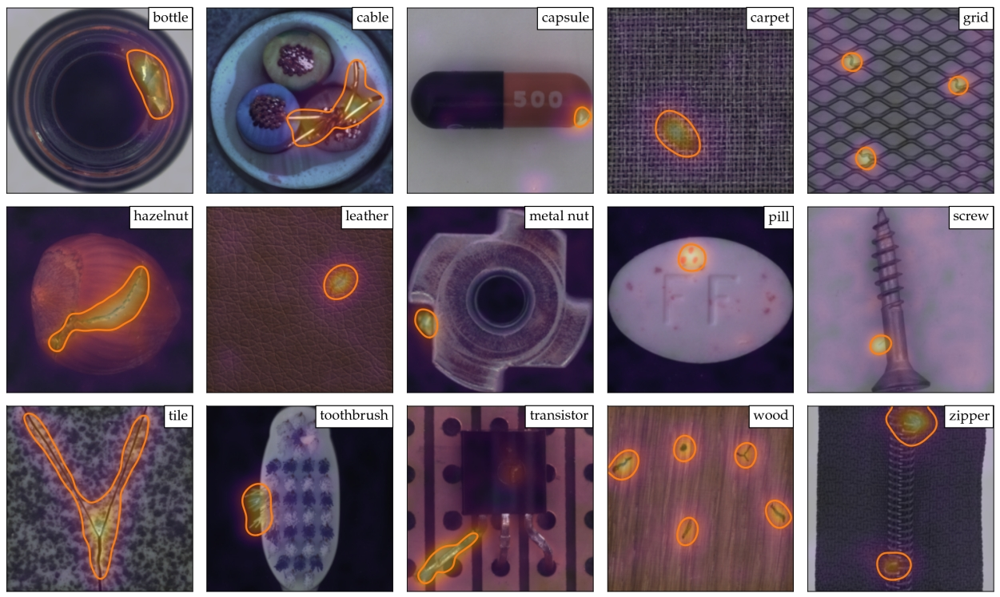
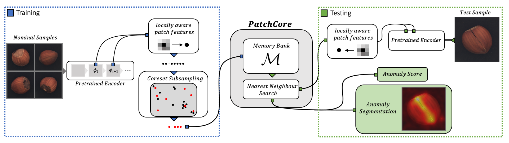
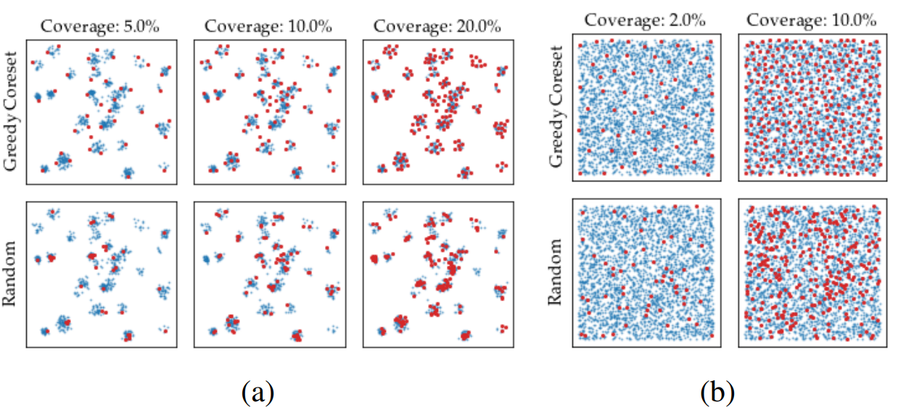
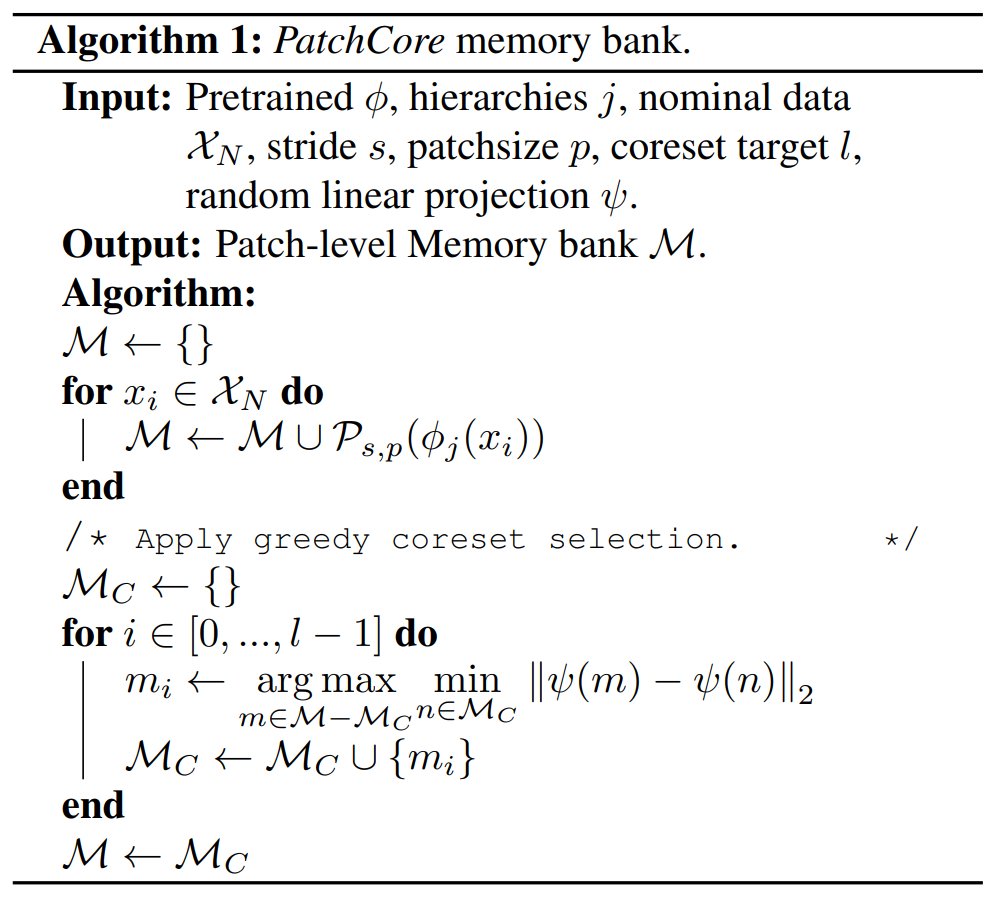

# [Towards Total Recall in Industrial Anomaly Detection](https://arxiv.org/abs/2106.08265)

## Abstract

能够发现有缺陷的部件是大规模工业制造中的关键。我们在这项工作中面临的一个特殊挑战是冷启动问题：仅使用正常 (无缺陷) 的示例图像来拟合模型。虽然针对每个类别手工设计解决方案是可能的，但目标是构建可以在许多不同任务上自动并且同时发挥良好作用的系统。表现最佳的方法将 ImageNet 模型的嵌入 (embeddings) 与一个异常检测模型相结合。在这篇文章中，我们在这条研究路线的基础上提出了 PatchCore，它使用了一个包含正常 patch 的特征的最大代表性的内存库。PatchCore 在实现最先进的检测和定位性能的同时，提供了有竞争力的推理时间。在具有挑战性的、广泛使用的 MVTec AD 基准测试中，PatchCore 实现了高达 99.6% 的图像级异常检测 AUROC 分数，与下一个最佳的竞争对手相比，将错误降低了一半以上。我们还在两个额外的数据集上报告了有竞争力的结果，并且发现在少样本的极端情况下也表现良好。代码： [github.com/amazon-research/patchcore-inspection](https：//github.com/amazon-science/patchcore-inspection)。

图 1：MVTec基准数据集的示例。图像上叠加了 PatchCore 的分割结果。橙色边界表示异常的实际分割图的异常轮廓，如破碎的玻璃、划痕、烧伤或蓝橙色渐变的结构变化。

> 算法流程：通过预训练好的 ResNet-50 在正常样本上面进行特征提取（不从 ResNet 最后一层获取特征，而是从中间蹭获取）随后再采用 coreset subsampling，进行有效的降采样生成更加核心的特征集即 memory bank 。 在测试的时候，将提取到的特征通过 nearest neighbour search（最近邻搜索）：每个 query 进来，首先找最近距离最近的领域质心，找到距离 query 最近的质心后，锁定该领域，然后在该领域内计算距离最远的数据点，用该距离计算异常分数 (anomaly score)，判断是否异常，得到结果。
>
> patch:

## 1.  Introduction

能够在图像中检测到异常模式是人类认知中一个根深蒂固的特征。人类只需看几个正常的实例，就能区分数据中的期望方差和异常值。在这项工作中，我们解决了这个问题的计算版本，即工业图像数据的视觉检测的冷启动异常检测。在许多工业场景中，获取正常的示例的图像很容易，但获取完整的指定预期缺陷变化很费力且复杂。这个任务自然地被表述为一个分布外检测问题，其中模型需要区分样本是从训练数据分布中抽取的，还是在其支持集之外的。工业视觉缺陷分类尤其困难，因为错误可以来自细微改变 (如细微划痕) 到更大的结构缺陷 (如缺少组件)。MVTec AD 基准中的一些示例以及我们提出方法的结果如图 1 所示。现有的冷启动工业视觉异常检测工作依赖于通过自动编码方法、GAN或其他无监督适应方法来学习正常的分布的模型。最近，[4, 10]提出利用来自 ImageNet 分类的普通深度表示，而不需要适应目标分布。尽管缺少适应，这些模型提供了强大的异常检测性能，甚至可以可靠地定位缺陷的空间位置。这些技术背后的关键原理是测试样本与正常的样本之间的特征匹配，同时利用深度特征表示的多尺度特性。细微的、细粒度的缺陷分割由高分辨率特征覆盖，而结构偏差和整个图像级异常检测则应该由更高抽象级别的特征来描述。这种非自适应方法的固有缺点是，在更高的抽象级别匹配置信度有限：来自 ImageNet 训练的高级抽象特征与工业环境所需的抽象特征重合性很小。此外，这些方法在测试时可以使用的正常的上下文实际上受提取的高级特征表示的数量限制。

在本文中，我们提出了 PatchCore 作为一个有效的解决方法：(1) 最大化测试时可用的正常的信息，(2) 减少对 ImageNet 类别的偏置，(3) 保持高推理速度。PatchCore 利用这样一个事实：**只要一个块 (patch) 异常，图像就可以被分类为异常**。PatchCore 通过利用局部聚合的中级特征块 (patch) 来实现这一点。使用中间层网络 patch 特征使 PatchCore 在高分辨率下运行时对 ImageNet 类别的偏差降到最低，而对局部邻域的特征聚合可以保留足够的空间上下文。这就形成了一个庞大的内存库，使得 PatchCore 可以在测试时最佳利用可用的正常的上下文。最后，为了实际应用性，PatchCore 还为正常特征库引入了一个**贪心核心集子采样**[1]作为核心元素，来减少提取的基于块 (patch) 的内存库中的冗余，同时显着降低存储器需求和推理时间，这使得 PatchCore 非常适合实际的工业使用案例。

在多样化的 MVTec AD 和专业的磁铁瓷砖缺陷 (MTD) 工业异常检测基准测试中进行的实验展示了 PatchCore 在工业异常检测中的强大能力。它在 MVTec AD 和MTD 上取得了最先进的图像级检测分数，在 MVTec AD上 近乎完美 (AUROC 达到 99.6%)，比先前方法的检测错误减少了一半以上，并取得了最先进的工业异常定位性能。PatchCore 在保留快速的推理时间的同时而无需在手头的数据集上训练。这使得 PatchCore 非常适合工业异常检测的实际应用。此外，进一步的实验展示了 PatchCore 的高样本效率，在仅使用正常训练数据的一小部分的情况下，其性能与现有的异常检测方法相当。

## 2. Related Works

大多数异常检测模型依赖于学习固有于正常数据的表示。例如，这可以通过使用自动编码器模型来实现[44]。为了更好地估计正常特征分布，已提出了基于高斯混合模型的扩展[60]、对抗生成目标训练[2, 39, 43]、对预定义物理增强的不变性[25]、重建隐特征的鲁棒性[29]、原型内存库[21]、注意力引导[52]、结构目标[7, 59]或受限表示空间[38]等方法。其他无监督表示学习方法也可以类似地利用，如通过GAN[13]、学习预测预定义的几何变换[20]或通过归一化流[42]。给定各自的正常表示和新的测试表示，那么异常检测可以成为一个重建错误[44]、到k个最近邻居的距离[18]，或在这些特征之上微调单类分类模型 (如 OC-SVMs [46]或 SVDD [50, 56]) 的简单问题。对于这些方法中的大多数，基于像素级重构误差的异常定位是自然而然的，也可以使用基于显著性的方法(如 GradCAM [47]或 XRAI [28]) 进行异常分割[42,  45,  52]。

**工业异常检测**。虽然关于通过学习正常表示进行常规异常检测的文献很多，但工业图像数据具有自己的挑战[5]，最近的研究从[4]开始，展示了使用在大型外部自然图像数据集（如ImageNet [16]）上预训练的模型而不需要对手头的数据进行任何适应性调整的最先进检测性能。这催生了其他依赖于更好地重用预训练特征的工业异常检测方法，例如 SPADE [10]，它利用包含各种特征层次结构的内存库进行细粒度的、基于 kNN [18]的异常分割和图像级异常检测。类似地，[14]最近提出了 PaDiM，它利用局部约束的装袋特征 (bag-of-features) 方法[8]，估计 patch-level 的特征分布矩（均值和协方差）用于 patch-level 的马氏距离测量[33]。这种方法类似于[40]在完整图像上进行的研究。为了更好地考虑自然预训练和工业图像数据之间的分布偏移，可以进行后续适应，例如通过学生-教师知识蒸馏[24] (例如在[6, 45]中) 或在预训练网络特征之上训练的归一化流[17, 30]。

PatchCore 中使用的具体组件与 SPADE 和 PaDiM 最相关。SPADE 利用预训练的骨干网络提取的正常特征的内存库，具有单独的方法进行图像级和像素级异常检测。PatchCore 同样使用内存库，但是具有关键的邻域感知的 patch-level 级别的特征，这对于实现更高的性能至关重要，因为保留了更多的正常上下文并且纳入更合适的归纳偏差。此外，内存库采用核心集子采样以确保在更高性能下降低推理成本。核心集通过找到最佳近似某个可用集合结构的子集，并允许使用显着降低的成本进行近似解决方案查找[1, 9]，在基础的 kNN 和 kMeans 方法[22]或混合模型[19]中已经有了长期使用。更近期，基于核心集的方法也被引入到深度学习方法中，例如用于网络剪枝[34]、主动学习[48]以及增加小批量有效数据覆盖率以改进 GAN 训练[49]或表示学习[41]。后三者都成功地利用了贪婪核心集选择机制。由于我们目的是逼近内存库特征空间覆盖率，我们类似地为 PatchCore 适应了贪婪核心集机制。最后，我们对图像级异常检测和异常分割的基于 patch 的方法与PaDiM 相关，目的是鼓励更高的异常检测敏感性。我们使用一个高效的 patch 特征内存库，**该内存库在测试时可访问所有的 patch**，而 PaDiM 将 patch-level 的异常检测限制在每个 patch 特定的马氏距离度量。通过这种方式，**PatchCore 不太依赖图像对齐**，同时使用更大的正常上下文来估计异常。此外，与 PaDiM 不同，**输入图像在训练和测试期间不需要相同的形状**。最后，**PatchCore 利用局部感知的 patch 特征分数来考虑局部空间方差**，并减少对 ImageNet 类别的偏差。

## 3. Method

PatchCore 方法包括以下几个部分：局部 patch 特征聚合到内存库中 ([3.1 节](#3.1.-Locally-aware-patch-features))，核心集减少方法以提高效率（[3.2 节](#3.2.-Coreset-reduced-patch-feature-memory-bank)），最后是完整算法，用于检测和定位决策（[3.3 节](#3.3.-Anomaly-Detection-with-PatchCore)）。

图 2：PatchCore 概览。正常样本被分解为一个领域感知的、patch-level 的特征内存库。为了减少冗余信息和推理时间，这个内存库通过贪心的核心集  (coreset) 下采样进行降维。在测试时，如果至少有一个patch 是异常的，那么图像会被分类为异常。并且通过评分每个 patch 的特征，生成像素级的异常分割。

### 3.1. Locally aware patch features

我们使用 $\mathcal{X}_N$ 表示训练时可用的所有正常图像集合 $( \forall{x} \in \mathcal{X}_{N} : y_x = 0 )$ ，其中 $y_x \in \set{0,1}$ 表示图像 $x$ 是正常 (0) 还是异常 (1) 图像。相应地，我们定义 $\mathcal{X}_T$ 为测试时提供的样本集合，其中 $\forall{x} \in \mathcal{X}_{T} : y_x \in \set{0,1}$ 。遵循[[4][4]]、[[10][10]] 和 [[14][14]]，PatchCore 使用一个在 ImageNet上 预训练的网络 $\phi$ 。由于在特定网络层级的特征起着重要作用，我们使用 $\phi_{i,j} = \phi_j(x_i)$ 表示数据集 $\mathcal{X}$ 中的图像 $x_i \in \mathcal{X}$ 在预训练网络 $\phi$ 的第 $j$ 层特征。如果没有特别说明，与现有文献一致， $j$ 索引类似 ResNet [[23][23]] 的体系结构 (如 ResNet50 或 WideResnet-50[57]) 的特征图，其中 $j \in \set{1,2,3,4}$ 表示各自空间分辨率块的最终输出。

特征表示的一个选择是网络特征层次结构中的最后一层。这是 [4] 或 [10] 的做法，但引入了以下两个问题。首先，它会丢失更加局部的正常 (图像) 信息[14]。由于测试时遇到的异常类型事先不可知，这会损害后续的异常检测性能。其次，在 ImageNet 上预训练的网络中的非常深层和抽象的特征会偏向自然图像分类任务，与冷启动工业异常检测任务及手头评估的数据之间只有很小的重叠。

因此，我们提出使用一个包含中间或中级特征表示的 patch-level 特征的内存库 $\mathcal{M}$ ，以利用提供的训练上下文，避免过于通用或或对 ImageNet 分类偏置过重的特征。在 ResNet 类架构的具体情况下,这将指的是例如 $j \in [2,3]$ 。为了规范化 patch 表示，我们扩展了先前引入的符号。假设特征映射 $\phi_{ i,j} \in \mathbb{R}^{c^∗ \times h^∗ \times w^∗}$ 是一个深度为 $c^∗$ ，高度为 $h^∗$ ，宽度为 $w^∗$ 的三维张量。然后，我们使用 $\phi_{i,j}(h,w) = \phi_j(x_i,h,w) \in \mathbb{R}^{c^∗}$ 来表示在位置 $h \in \set{1,\dots,h^∗}$ 和 $w \in \set{1,\dots,w^∗}$ 处的 $c^∗$ 维特征切片。假设每个 $\phi_{i,j}$ 的感受野大小大于1，则这实际上涉及到图像 patch 特征表示。理想情况下，每个 patch 表示都在足够大的感受野大小上运行，以考虑对局部空间变化具有鲁棒性的有意义的异常上下文。虽然这可以通过有步长的池化 (strided pooling) 和进入网络层次结构的更深层来实现这一点，但由此创建的 patch 特征变得更加具有 ImageNet 特色，因此对于手头的异常检测任务不那么相关，同时训练成本增加并且有效特征映射分辨率降低。

这促使在构建每个 patch-level 特征表示时进行一个局部邻域聚合，以提高感受野大小和对小空间偏差的鲁棒性，而不损失空间分辨率或特征图的可用性。为此，我们扩展了上述 $\phi_{i,j}(h,w)$ 的表示，以考虑不均匀的 patch 大小 $p$ (对应考虑的邻域大小)，并结合邻域中的特征向量

$$
\begin{aligned}
\mathcal{N}_p^{(h,w)} = \{(a,b) \mid   a &\in [ h - \lfloor p/2 \rfloor, \ \dots, \ h + \lfloor p/2 \rfloor ], \\
b &\in [ w - \lfloor p/2 \rfloor, \ \dots, \ w + \lfloor p/2 \rfloor ]\}
\end{aligned} \tag{1}
$$

位置 $(h, w)$ 的局部感知特征为

$$
\phi_{i,j}\left( \mathcal{N}_p^{(h,w)} \right) = f_{agg}\left( \{ \phi_{i,j}(a,b) \mid (a,b) \in \mathcal{N}_p^{(h,w)} \} \right) \tag{2}
$$

其中 $f_{agg}$ 为一些聚合函数对邻域 $\mathcal{N}^{(h,w)}_p$ 中的特征向量进行聚合。对于 PatchCore，我们使用自适应平均池化。这类似于对每个单独的特征映射进行局部平滑处理，从而在预定义的维度 $d$ 上得到一个在 $(h,w)$ 的单一表示，这是对所有的 $(h,w)$ 对进行的，其中 $h \in \set{1,\dots,h^∗}$ 且 $w \in \set{1,\dots,w^∗}$ ，从而保留了特征映射的分辨率。对于特征图张量 $\phi_{i,j}$ ，其局部感知 patch 特征集合 $\mathcal{P}_{s,p}(\phi_{i,j})$ 为

$$
\begin{aligned}
\mathcal{P}&_{s,p}(\phi_{i,j}) = \{ \phi_{i,j}\left( \mathcal{N}_p^{(h,w)} \right) \mid \\ 
&{h, w} \mod s = 0, h < h^*, w < w^*, h, w \in \mathbb{N} \}
\end{aligned} \tag{3}
$$

其中可选的步幅参数 $s$ ，除了在 [4.4.2]() 节中进行的消融实验外我们将其设置为 1。类似于[10]和[14]，我们发现聚合多个特征层次结构可以提供一些好处。但是，为了保留所使用特征的通用性以及空间分辨率，PatchCore 仅使用两个中间特征层次结构 $j$ 和 $j + 1$ 。这是通过计算 $\mathcal{P}_{s,p}(\phi_{i,j+1})$ 并将每个元素与其在使用的最低层次结构（即最高分辨率）上对应的 patch 特征进行聚合来实现的，我们通过双线性重新缩放 $\mathcal{P}_{s,p}(\phi_{i,j+1})$ 以使 $\left|\mathcal{P}_{s,p}(\phi_{i,j+1})\right|$ 和 $\left|\mathcal{P}_{s,p}(\phi_{i,j})\right|$ 相匹配来实现这一点。

最后，对于所有正常训练样本 $x_i \in \mathcal{X}_N$ ，PatchCore 的内存库 $\mathcal{M}$ 只需简单地定义为

$$
\mathcal{M} = \bigcup_{x_i \in \mathcal{X}_N} \mathcal{P}_{s,p}(\phi_{j}(x_i)) \tag{4}
$$

图 3：对比：多模态 (a) 和均匀分布 (b) 中采样的 2D 数据 (蓝色) 的核心集 (顶部) 与随机下采样 (底部) (红色)。从视觉上看，核心集子采样更好地近似了空间支持，随机子采样在多模态情况下错过了簇，并且在 (b) 中不太均匀。

### 3.2. Coreset-reduced patch-feature memory bank

随着 $\mathcal{X}_N$ 的大小增加，$\mathcal{M}$ 变得越来越大，从而使得对新测试数据进行推理的时间和所需存储量都增加。这个问题已经用于异常分割的SPADE [10]中被注意到，它同时使用了低级和高级特征图。由于计算限制，SPADE 需要一个预选择阶段来根据较弱的全图像深度特征表示的图像级异常检测机制选择特征图，以进行像素级异常检测，即对最后一个特征图进行全局平均。这导致从完整图像计算出的低分辨率、带有 ImageNet 偏差的表示可能会对检测和定位性能产生负面影响。

这些问题可以通过使 $\mathcal{M}$ 对更大的图像大小和数量下可有意义的搜索来解决，从而允许基于 patch 的比较对异常检测和分割都有益。这要求保留在 $\mathcal{M}$ 中编码的正常特征的覆盖率。不幸的是，随机子采样，尤其是多个数量级的子采样，会丢失 $\mathcal{M}$ 中编码的正常特征覆盖范围中的大量信息 (参见第 4.4.2 节中的实验)。在本文中,我们使用核心集下采样机制来减少 $\mathcal{M}$，我们发现它可以减少推理时间同时保持性能。

从概念上讲，核心集选择旨在找到一个子集 $\mathcal{S} \subset \mathcal{A}$ ，使得在 $\mathcal{A}$ 上计算的问题解可以通过在 $\mathcal{S}$ 上计算的那些结果进行最接近和特别是更快速的逼近[1]。根据具体问题，感兴趣的核心集各不相同。因为PatchCore 使用最近邻计算 (下一部分)，我们使用一个 **minimax facility location coreset selection**，参见[48]和[49]，以确保 $\mathcal{M}-\mathrm{coreset} \ \mathcal{M}_C$ 在 patch-level 的特征空间中的覆盖范围大约与原始内存库 $\mathcal{M}$ 相似

$$
\mathcal{M}_C^* = \arg\min_{\mathcal{M_C \subset \mathcal{M}}}\max_{m \in \mathcal{M}}\min_{n \in \mathcal{M}_C} \lVert m - n \rVert_2 \tag{5}
$$

$M_C^*$ 的精确计算是 NP 困难的[54]，我们使用[48]中建议的迭代贪心逼近。为进一步减少核心集选择时间,我们遵循[49]，利用 Johnson-Lindenstrauss 定理[11]通过随机线性映射 $\psi: \mathbb{R}^d \rightarrow \mathbb{R}^{d*} (d^* < d)$ 降低 元素 $\mathcal{m} \in \mathcal{M}$ 的维数。内存库减少总结在算法 1 中。对于符号，我们使用 $PatchCore-n\%$ 表示原始内存库减少到的百分比 $n$ ,例如，$PatchCore-1\%$ 是 $\mathcal{M}$ 的 100 倍减少。图 3 给出了与随机选择相比,贪心核心集下采样的空间覆盖的视觉感受。

### 3.3. Anomaly Detection with PatchCore

使用正常 patch 特征内存库 $\mathcal{M}$ ，我们通过测试图像 $x^{test}$ 中的测试 patch 特征集合 $\mathcal{P}(x^{test}) = \mathcal{P}_{s,p}(\phi_j(x^{test}))$ 与 $\mathcal{M}$ 中每个相应的最近邻 $m^∗$ 之间的最大距离分数 $s^∗$ 来估计测试图像 $x^{test}$ 的图像级异常分数 $s \in \mathbb{R}$ :

$$
\begin{aligned}
m^{test,*}， m^* &= \arg \max_{m^{test} \in \mathcal{P}(x^{test})} \arg \min_{m \in \mathcal{M}} \lVert m^{test} - m \rVert_2 \\
s^* &= \lVert m^{test,*} - m^* \rVert_2
\end{aligned} \tag{6}
$$

为了获得 $s$ ,我们使用缩放 $w$ 对 $s^∗$ 进行调整，来考虑邻域 patch 的行为：如果与异常候选 $m^{test,*}$ 最接近的内存库特征 $m^*$ 本身远离相邻样本，从而已经是一个罕见的正常样本，我们增加异常分数：

$$
s = \left( 1 - \frac{ \exp \lVert m^{test,*} - m^* \rVert_2 }{ \sum_{m \in \mathcal{N}_b (m^*)} \exp \lVert m^{test,*} - m^* \rVert_2 } \right) \cdot s^* \tag{7}
$$

其中 $\mathcal{N}_b(m^*)$ 是测试 patch 特征 $m^*$ 在 $\mathcal{M}$ 中的最近的 $b$ 个 patch 特征。我们发现这种重新加权比仅使用 patch 距离的最大值更加鲁棒。给定 $s$ ，分割直接跟随。公式 7 中的图像级异常分数 (第一行) 需要通过 $\arg \max$ 操作计算每个 patch 的异常分数。类似于[14]，可以通过根据它们各自的空间位置重新对齐计算的 patch 异常分数来在同一步骤中计算分割图。为了匹配原始输入分辨率 (我们可能需要使用中间网络特征)，我们通过双线性插值将结果上采样。此外，我们使用核宽度为 $\sigma = 4$ 的高斯平滑结果，但没有优化此参数。

## 4. Experiments

### 4.1. Experimental Details

**数据集**。为了研究工业异常检测性能，我们的大多数实验都是在 MVTec 异常检测基准数据集[5]上进行的。

MVTec AD 包含总共 5354 张图像的 15 个子数据集，其中测试集中有 1725 张。每个子数据集被划分为仅包含正常训练数据和包含正常和异常样本的测试集，用于特定产品的各种缺陷类型以及各自的异常真值掩模。如[10,14,56]中所述，图像被调整大小并中心裁剪为 256×256 和 224×224。不进行数据增强,因为这需要事先知道保留类别的增强方法。

我们还在更专业的任务上研究工业异常检测。为此，我们利用[26]中的磁瓷砖缺陷 (MTD) 数据集，如[42]中使用的，它包含 925 张无缺陷和 392 张异常磁瓷砖图像，具有不同的照明水平和图像大小。与[42]相同，20%的无缺陷图像在测试时进行评估，其余用于冷启动训练。

最后，我们还强调了 PatchCore 在非工业图像数据上的潜在适用性，基准测试如[52]和[14]等在 Mini Shanghai Tech Campus (mSTC) 上的冷启动异常定位。mSTC 是原始 STC 数据集[32]的子采样版本，仅使用每 fifth 个训练和测试视频帧。它包含来自 12 个不同场景的行人视频。训练视频包括正常的行人行为，而测试视频可以包含不同的行为，如打架或骑自行车。为了与我们的冷启动实验结果可比，我们遵循确立的 mSTC协议[14,52]，不利用任何异常监督，并将图像调整大小为 256×256。

**评估指标**。使用生成的异常分数，通过接收器操作特征曲线下的面积 (AUROC) 来测量图像级异常检测性能。根据以前的工作，我们在MVTec上计算类别平均 AUROC [2,10,14]。为了测量分割性能，我们使用像素级 AUROC 和 PRO 指标[6]，两者都遵循[6]。PRO 得分考虑连接的异常组件的重叠和恢复，以更好地解释 MVTec AD 中的异常大小变化，详情见[6]。

## 5. Conclusion

这篇论文介绍了用于冷启动异常检测的 PatchCore 算法，其中只利用正常样本的知识来在测试时检测和分割异常数据。PatchCore 通过使用包含从 ImageNet 预训练网络中提取的局部感知的、正常的 patch-level 特征表示的内存库，并通过 coreset 子采样在测试时保留最大量的正常上下文和最小运行时间之间达到平衡。其结果是一个计算代价低且在工业异常检测基准测试中达到最先进水平的冷启动图像异常检测和定位系统。在 MVTec 上，我们实现了超过 99% 的图像异常检测 AUROC，并具有相关小训练集区域中最高的样本效率。

**更广泛的影响**。由于自动化工业异常检测是计算机视觉最成功的应用之一，因此该领域的从业者可能对通过 PatchCore 获得的改进具有显着的兴趣。由于我们的工作专门针对工业异常检测，负面社会影响有限。虽然基本方法可能潜在地被用于更具争议性的领域的检测系统中，但我们认为我们的改进不足以改变这些系统的社会应用。

**局限性**。虽然 PatchCore 在不需要特别适应手头问题域的情况下显示出高效性，但应用通常受到预训练特征的可转移性的限制。这可以通过将 PatchCore 的有效性与所使用特征的适应性相结合来解决。我们将这个有趣的扩展留给未来的工作。

## Reference

[4]: https://arxiv.org/abs/2002.10445	"Deep Nearest Neighbor Anomaly Detection"
[10]:  https://arxiv.org/abs/2005.02357 "Sub-image anomaly detection with deep pyramid correspondences"
[14]:  https://arxiv.org/abs/2011.08785	"PaDiM: a Patch Distribution Modeling Framework for Anomaly Detection and Localization"
[23]: https://arxiv.org/abs/1512.03385	"Deep Residual Learning for Image Recognition"

## Supplementary

### A. Implementation Details

我们使用 Python 3.7 [51] 和 PyTorch [37] 实现了模型。实验在 Nvidia Tesla V4 GPU 上运行。我们使用了来自 torchvision 和 PyTorch Image Models 仓库[53]的 torchvision ImageNet 预训练模型。默认情况下，遵循[[10][10]] 和 [14]，PatchCore 使用 WideResNet50 骨干[57]，以进行直接比较。Patch-level 特征从块 2 和 3 的最终输出的特征图聚合中获取。对于所有最近邻检索和距离计算，我们使用 faiss [27]。

