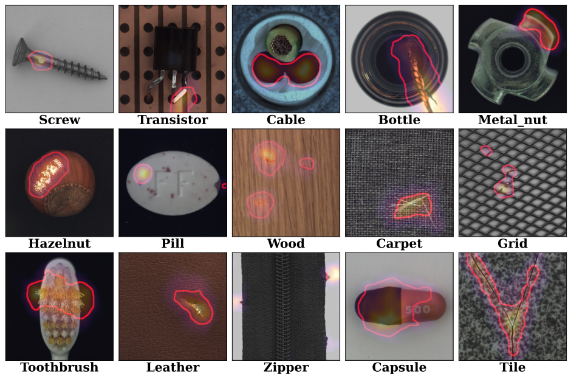
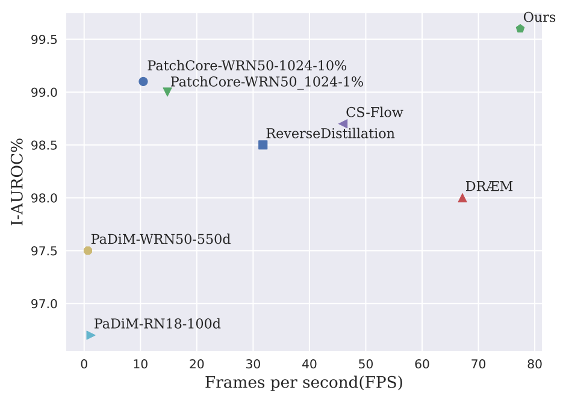
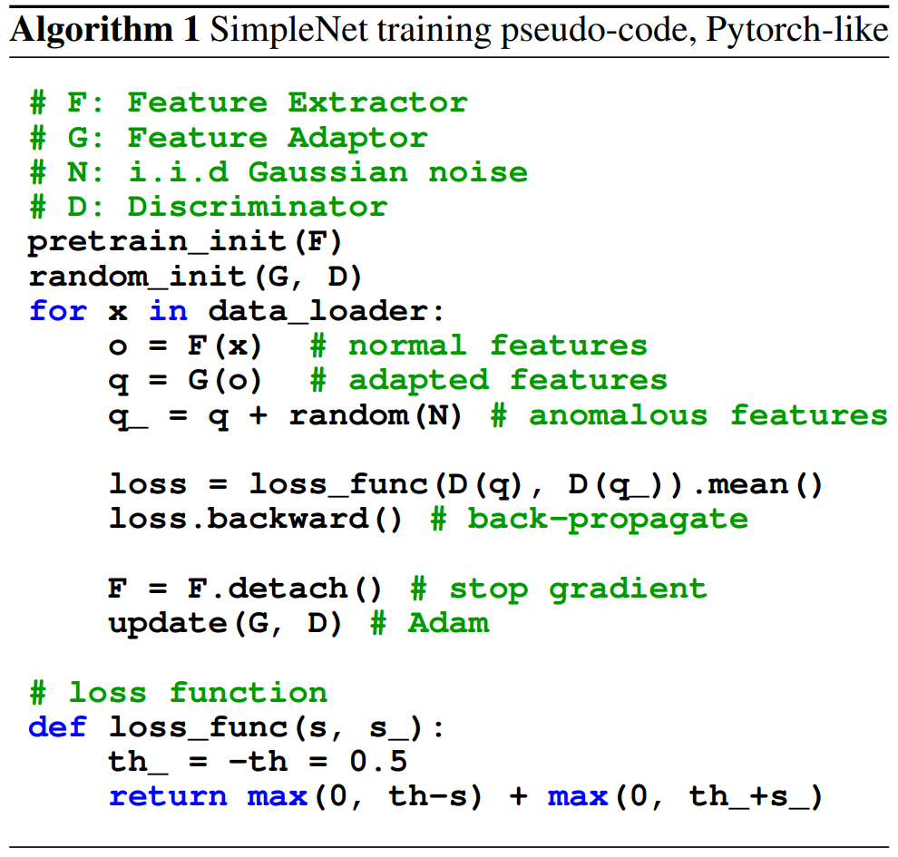

# [SimpleNet: A Simple Network for Image Anomaly Detection and Localization](https://arxiv.org/abs/2303.15140)

**图 1**：MVTec AD 样本的可视化。生成的异常图叠加在图像上。高异常分数的异常区域用橙色表示。红色轮廓线表示异常的实际分割图边界。

## Abstract

我们提出了一个简单易用的网络 (称为SimpleNet)，用于检测和定位异常。SimpleNet 由四个组件组成：(1) 一个预训练的特征提取器，用于生成局部特征，(2) 一个浅层特征适配器，用于将局部特征转移到目标域，(3) 一个简单的异常特征生成器，通过向正常特征添加高斯噪声来伪造异常特征，以及 (4) 一个二进制异常鉴别器，用于区分异常特征和正常特征。在推理期间，异常特征生成器将弃用。我们的方法基于三个直觉。首先，将预训练的特征转换为面向目标的特征有助于避免域偏差。其次，在特征空间中生成合成异常更加有效，因为缺陷在图像空间中可能没有太多共性。第三，一个简单的鉴别器更加高效实用。尽管简单，但 SimpleNet 在定量和定性上均优于以前的方法。在 MVTec AD 基准测试中，SimpleNet 实现了99.6％ 的异常检测 AUROC，在减少错误 55.5％ 的同时比下一个最佳性能模型更好。此外，SimpleNet 比现有方法更快，在 3080ti GPU 上具有高帧率 77 FPS。此外，SimpleNet 在单类新颖性检测任务的性能方面也有显着改进。代码：https://github.com/DonaldRR/SimpleNet。

**图 2**：在 MVTec AD 基准测试上的推理速度 (FPS) 与 I-AUROC。SimpleNet 在准确率和效率方面都大幅超过了之前的所有方法。

## 1. Introduction

图像异常检测和定位任务旨在识别异常图像并定位异常子区域。检测各种感兴趣的异常的技术在工业检查中具有广泛的应用[3, 6]。在工业场景中，由于异常样本稀少且异常可能从细微的变化（如细小划痕）到大型结构缺陷（例如缺失部分）不等，因此异常检测和定位尤其困难。MVTec AD 基准测试中的一些示例以及我们提出的方法的结果如图 1 所示。这为基于有监督的方法带来了巨大困难。

目前的方法以无监督的方式解决这个问题，其中训练过程中仅使用正常样本。基于重建的方法[10, 21, 31]、基于合成的方法[17, 30]和基于嵌入的方法[6, 22, 24]是解决这个问题的三个主要趋势。基于重建的方法，如[21,31]，假设仅使用正常数据训练的深度网络无法准确重建异常区域。像素级重建误差被视为异常定位的异常分数。然而，这种假设并不总是成立，有时网络可以"泛化"得很好，以至于也可以很好地重建异常输入，导致误检[10, 19]。基于合成的方法[17, 30]通过在无异常图像上生成合成异常来估计正常和异常之间的决策边界。然而，合成图像不够逼真。来自合成数据的特征可能会偏离正常特征，使用这样的负样本进行训练可能会导致一个松散边界的正常特征空间，这意味着在分布特征空间中可能包含不明显的缺陷。

最近，基于嵌入的方法[6,7,22,24]取得了最先进的性能。这些方法利用在 ImageNet 上预训练的卷积神经网络 (CNN) 提取泛化的正常特征。然后采用多元高斯分布[6]、标准化流[24]和记忆库[22]等统计算法嵌入正常特征分布。通过将输入特征与学习到的分布或记忆的特征进行比较，实现异常检测。但是，工业图像通常与 ImageNet 具有不同的分布。直接使用这种有偏差的特征可能会导致不匹配的问题。此外，统计算法通常会受到高计算复杂度或高内存消耗的困扰。

为了缓解上述问题，我们提出了一种新颖的异常检测和定位网络，名为 SimpleNet。SimpleNet 利用了基于合成和基于嵌入的方式，并做出了几项改进。首先，我们没有直接使用预训练特征，而是提出使用特征适配器来产生面向目标的特征，以减少域偏差。其次，我们没有直接在图像上合成异常，而是通过在特征空间对正常特征加噪声来生成异常特征。我们认为，通过适当校准噪声范围，可以获得一个紧密边界的正常特征空间。第三，我们通过训练一个简单的判别器来简化异常检测过程，这比上述基于嵌入的方法采用的复杂统计算法计算效率更高。具体来说，SimpleNet 使用预训练的 backbone 提取正常特征，然后经特征适配器转移特征到目标域。然后，通过对适配后的正常特征添加高斯噪声来简单地生成异常特征。在这些特征上训练了一个由几层 MLP 层组成的简单判别器来判别异常。

SimpleNet 易于训练和应用，性能和推理速度出色。基于广泛使用的 WideResnet50 骨干网络，我们提出的 SimpleNet 在 MVTec AD 数据集上取得了 99.6% 的 AUROC，同时以 77 fps 的速度运行，在准确性和效率方面都超过了之前发表的最佳异常检测方法，见图 2。我们进一步将 SimpleNet 引入到 OneClass Novelty Detection 任务中，以展示其泛化性。这些优势使 SimpleNet 架起了学术研究和工业应用之间的桥梁。代码将公开可用。

## 2. Related Work

异常检测和定位方法可以主要分为三类，即基于重建的方法、基于合成的方法和基于嵌入的方法。

**基于重建的方法**认为异常图像区域由于在训练样本中不存在，因此不应该能够被正确重建。一些方法[10]利用生成模型，例如自动编码器和生成对抗网络对正常数据进行编码和重建。其他方法[13,21,31]将异常检测框架视为图像修复问题，其中图像块被随机遮蔽。然后，利用神经网络预测被擦除的信息。在训练中广泛使用结构相似性指数 (SSIM) 损失函数。异常图通过输入图像与其重建图像之间的逐像素差异生成的。然而，如果异常与正常训练数据共享组成模式 (例如局部边缘) 或或者解码器"过于强大"，可以很好地解码某些异常编码，则图像中的异常很可能会被很好地重建[31]。

**基于合成的方法**通常在无异常图像上合成异常。DRÆM [30]提出了一种网络，该网络在合成的分布外的模式上进行端到端的有区别地训练。CutPaste [17]提出了一种简单的策略，通过切割图像块并粘贴到大图像的随机位置上，来为异常检测生成合成异常。训练一个 CNN 来区分来自正常和增强数据分布的图像。然而，合成异常的外观与真实异常的外观不太相似。实际上，由于缺陷五花八门、难以预测，生成包含所有离群值的异常集是不可能的。因此，本文提出的 SimpleNet 在特征空间中合成负样本，而不是在图像上合成。

**基于嵌入的方法**最近取得了最先进的性能。这些方法将正常特征嵌入到压缩空间中。异常特征在嵌入空间中远离正常簇。典型的方法[6,7,22,24]利用在 ImageNet 上进行预训练的网络进行特征提取。使用预训练模型，PaDiM [6] 通过多元高斯分布嵌入提取的异常 patch 特征。PatchCore [22] 使用正常 patch 特征的最大代表性记忆库。测试时采用马氏距离或最大特征距离对输入特征进行评分。然而，工业图像的分布通常与 ImageNet 不同。直接使用预训练特征可能会导致不匹配问题。此外，计算协方差的逆[6]或在记忆库[22]中搜索最近邻居会限制实时性能，尤其是对于边缘设备。

CS-Flow [24]、CFLOW-AD [12] 和 DifferNet [23] 提出通过标准化流 (NF) [20]将正常特征分布转换为高斯分布。由于标准化流只能处理全尺寸的特征图，即不允许下采样，且耦合层[9]的内存消耗是普通卷积层的几倍，这些方法会消耗大量内存。蒸馏方法[4,7]训练一个学生网络，使其与仅使用正常样本的固定预训练教师网络的输出相匹配。在给定异常查询时，应检测学生和教师输出之间的差异。由于输入图像需要通过教师网络和学生网络两者，计算复杂度加倍。

SimpleNet 克服了上述问题。SimpleNet 使用特征适配器在目标数据集上进行迁移学习，以减轻预训练 CNN 的偏差。SimpleNet 提出在特征空间而不是直接在图像上合成异常。SimpleNet 在推理时遵循单流方式，完全由传统的 CNN 块构建，这有利于快速训练、推理和工业应用。

## 3. Method

在本节中，详细介绍了提出的 SimpleNet。如图 3 所示，SimpleNet 由特征提取器、特征适配器、异常特征生成器和鉴别器组成。异常特征生成器仅在训练期间使用，因此 SimpleNet 在推理时遵循单流模式。下面将按顺序描述这些模块。

**图 3**：提出的 SimpleNet 的概览。在训练阶段，将正常样本馈送到预训练的特征提取器中以获取局部特征。然后，使用特征适配器将预训练的特征适应到目标域。通过向适应特征添加高斯噪声来合成异常特征。适应后的特征和异常特征分别用作正样本和负样本，以训练最终的鉴别器。在推理期间，将删除异常特征生成器。

### 3.1. Feature Extractor

特征提取器如[22]中所述获取局部特征。我们将该过程重新表述如下。我们将训练集和测试集分别表示为 $\mathcal X_{train}$ 和 $\mathcal X_{test}$ 。对于 $\mathcal X_{train} \bigcup \mathcal X_{test}$ 中的任意图像 $x_i \in \mathbb R^{H \times W \times 3}$ ，预训练网络 $\phi$ 从不同的层次提取特征，通常使用 ResNet-like 骨干网络。由于预训练网络偏向于其训练的数据集，因此仅选择目标数据集的一部分层级是合理的。形式上，我们定义 $L$ 为包含要使用的层次索引的子集。来自层 $l \in L$ 的特征映射表示为 $\phi^{l,i} \sim \phi^l(x_i) \in \mathbb R^{H_l \times W_l \times C_l}$ ，其中 $H_l, W_l, C_l$ 是特征映射的高度、宽度和通道大小。对于位置 $(h, w)$ 处的条目 $\phi^{l, i}_{h, w} \in \mathbb R^{C_l}$ ，其大小为 $p$ 的邻域定义为

$$
\begin{aligned}
\mathcal N_p^{(h,w)} = \{(h',y') \mid   h' & \in [ h - \lfloor p/2 \rfloor, \ \dots, \ h + \lfloor p/2 \rfloor ], \\
y' & \in [ w - \lfloor p/2 \rfloor, \ \dots, \ w + \lfloor p/2 \rfloor ]\}
\end{aligned} \tag{1}
$$

使用聚合函数 $f_{agg}$ (这里使用自适应平均池化) 在邻域 $\mathcal N_p^{h,w}$ 内聚合特征，结果为局部特征 $z_{h,w}^{l,i}$ ，定义如下

$$
z_{h,w}^{l,i} = f_{agg}(\{ \phi_{h',y'}^{l,i} \mid (h',y') \in \mathcal N_p^{h,w} \}) \tag{2}
$$

为融合不同层级的特征 $z_{h,w}^{l,i}$ ，将所有的特征图线性地缩放到相同大小 $(H_0,W_0)$ ，即最大的特征图的大小。简单地将特征沿着通道维度拼接起来，得到特征图 $o^i \in \mathbb R^{H_0 \times W_0 \times C}$ 。该过程定义如下

$$
o^i = f_{cat}(resize(z^{l',i},(H_0,W_0))) \mid l' \in L \tag{3}
$$

我们定义 $o_{h,w}^i \in \mathbb R^C$ 为特征图在位置 $(h,w)$ 的条目。我们将上述表达式简化为

$$
o^i = F_\phi(x^i) \tag{4}
$$

其中 $F_\phi$ 是特征提取器。

### 3.2. Feature Adaptor

由于工业图像通常与 backbone 预训练中使用的数据集具有不同的分布，因此我们采用特征适配器 $G_\theta$ 将训练特征转移到目标域。特征适配器 $G_\theta$ 将局部特征 $o_{h,w}$ 投影到适应特征 $q_{h,w}$ 上，即

$$
q_{h,w}^i = G_\theta (o_{h,w}^i) \tag{5}
$$

特征适配器可以由简单的神经块组成，例如全连接层或多层感知器 (MLP)。我们在实验中发现，使用单个全连接层就能达到良好的性能。

### 3.3. Anomalous Feature Generator

为了训练鉴别器以估计样本为正常的可能性，最简单的方法是采样负样本，即缺陷特征，并将其与正常样本一起优化。缺陷样本的稀缺使采样分布估计变得棘手。虽然[17, 18, 30]依赖于额外的数据来合成缺陷图像，但我们在特征空间中对正常样本添加了简单的噪声，声称它的性能优于那些修改的方法。

异常特征是通过在正常特征 $q_{h,w}^i \in \mathbb R^C$ 上添加高斯噪声来生成的。形式上，采样一个噪声向量 $\epsilon \in \mathbb R^C$ ，每个条目都遵循 i.i.d. (独立同分布) 高斯分布 $\mathcal N(\mu,\sigma^2)$ 。异常特征 $q_{h,w}^{i-}$ 被融合为

$$
q_{h,w}^{i-} = q_{h, w}^i + \epsilon \tag{6}
$$

图 4 展示了异常特征对 MVTec AD 的四个类别影响。我们可以看到，适应后的特征的每个维度的标准差趋于一致。因此，在区分异常特征和正常特征时，特征空间趋于紧凑。

### 3.4. Discriminator

鉴别器 $D_\psi$ 作为正常性评分器，直接估计每个位置 $(h,w)$ 的正常性。由于负样本与正常特征 $q^i \mid x^i \in \mathcal X_{train}$ 一起生成，因此在训练期间它们都被馈送到鉴别器中。鉴别器期望正常特征的输出为正，而异常特征的输出为负。我们简单使用一个 2 层的多层感知器 (MLP) 结构，就像普通分类器一样，将正常性估计为 $D_{\psi}(q_{h,w}) \in \mathbb R$ 。

### 3.5. Loss function and Training

一个简单的截断的 $l1$ 损失为

$$
l_{h,w}^i = \max (0, th^+ - D_{\psi}(q_{h,w}^i)) + \max (0, -th^- + D_{\psi}(q_{h,w}^{i-})) \tag{7}
$$

$th^+$ 和 $th^-$ 是防止过拟合的截断项。它们默认设置为 $0.5$ 和 $-0.5$ 。训练的目标函数是

$$
\mathcal L = \min_{\theta, \psi} \sum_{x^i \in \mathcal X_{train}} \sum_{h,w} \frac{l_{h,w}^i}{H_0 * W_0} \tag{8}
$$

我们将在实验部分中使用被广泛使用的交叉熵损失函数与所提出的截断的 $l1$ 损失函数进行试验评估。训练过程的伪代码如算法 1 所示。

### 3.6. Inference and Scoring function

在推理时丢弃异常特征生成器。请注意，剩余的模块可以堆叠成一个端到端的网络。我们将每个 $x_i \in \mathcal X_{test}$ 依次馈送到上述特征提取器 $F_{\phi}$ 和特征适配器 $G_{\theta}$ 中以获取适应后的特征 $q_{h,w}^i$ ，如公式 5 所示。异常分数由鉴别器 $D_{\psi}$ 提供

$$
s_{h,w}^i = -D_{\psi}(q_{h,w}^i) \tag{9}
$$

在推理期间用于异常定位的异常图定义为

$$
S_{AL}(x_i) \coloneqq \set{ s_{h,w}^i \mid (h,w) \in W_0 \times H_0 } \tag{10}
$$

然后将 $S_{AL}(x_i)$ 插值以获取与输入样本相同的空间分辨率，并使用 $\sigma = 4$ 的高斯滤波平滑边界。由于对于任何大小的异常区域都存在最显著的响应点，因此将异常图的最大分数作为每个图像的异常检测分数

$$
S_{AD}(x_i) \coloneqq \max_{(h,w) \in W_0 \times H_0} s_{h,w}^i \tag{11}
$$

## 4. Experiments

### 4.1. Datasets

我们在异常检测和定位领域中著名的 MVTec Anomaly Detection 基准测试上进行了大部分实验。MVTec AD 包含 5 种纹理和 10 种来自制造业的物体类别，共 5354 张图像。该数据集由用于训练的正常图像和用于测试的正常图像及带有各种缺陷的异常图像组成。它还为有缺陷的测试图像提供了像素级标注。典型图像如图 1 所示。与[6, 22]一样，图像分别被调整大小并居中裁剪为 256×256 和 224×224。未应用数据增强。我们遵循 one-class 分类协议，也称为冷启动异常检测，即对每个类别使用其各自的正常训练样本训练一个一类分类器。

我们在 CIFAR10 [16]上进行单类新颖性检测，其包含 10 个类别，50K 个训练图像和 10K 个测试图像，图像大小为 32×32。在单类新颖性检测设置下，一个类别被视为正常数据，其他类别被用作新颖性。

### 4.2. Evaluation Metrics

## 5. Conclusion

在本文中，我们提出了一种名为 SimpleNet 的简单而高效的方法，用于无监督的异常检测和定位。SimpleNet 由几个简单的神经网络模块组成，易于在工业场景中进行训练和应用。尽管简单，但SimpleNet 在 MVTec AD 基准测试中相对于以前的最先进方法实现了最高的性能和最快的推理速度。SimpleNet 为异常检测和定位领域中学术研究和工业应用之间的差距提供了新的视角。