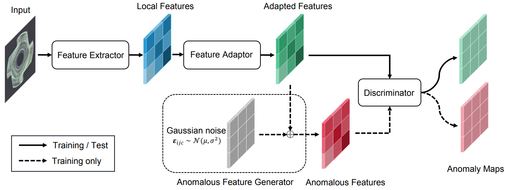

# [SimpleNet: A Simple Network for Image Anomaly Detection and Localization](https://arxiv.org/abs/2303.15140)

**图 1**：MVTec AD 样本的可视化。生成的异常图叠加在图像上。高异常分数的异常区域用橙色表示。红色轮廓线表示异常的实际分割图边界。

## Abstract

我们提出了一个简单易用的网络 (称为SimpleNet)，用于检测和定位异常。SimpleNet 由四个组件组成：(1) 一个预训练的特征提取器，用于生成局部特征，(2) 一个浅层特征适配器，用于将局部特征转移到目标域，(3) 一个简单的异常特征生成器，通过向正常特征添加高斯噪声来伪造异常特征，以及 (4) 一个二进制异常鉴别器，用于区分异常特征和正常特征。在推理期间，异常特征生成器将弃用。我们的方法基于三个直觉。首先，将预训练的特征转换为面向目标的特征有助于避免域偏差。其次，在特征空间中生成合成异常更加有效，因为缺陷在图像空间中可能没有太多共性。第三，一个简单的鉴别器更加高效实用。尽管简单，但 SimpleNet 在定量和定性上均优于以前的方法。在 MVTec AD 基准测试中，SimpleNet 实现了99.6％ 的异常检测 AUROC，在减少错误 55.5％ 的同时比下一个最佳性能模型更好。此外，SimpleNet 比现有方法更快，在 3080ti GPU 上具有高帧率 77 FPS。此外，SimpleNet 在单类新颖性检测任务的性能方面也有显着改进。代码：https://github.com/DonaldRR/SimpleNet。

**图 2**：在 MVTec AD 基准测试上的推理速度 (FPS) 与 I-AUROC。SimpleNet 在准确率和效率方面都大幅超过了之前的所有方法。

## 1. Introduction

图像异常检测和定位任务旨在识别异常图像并定位异常子区域。检测各种感兴趣的异常的技术在工业检查中具有广泛的应用[3, 6]。在工业场景中，由于异常样本稀少且异常可能从细微的变化（如细小划痕）到大型结构缺陷（例如缺失部分）不等，因此异常检测和定位尤其困难。MVTec AD 基准测试中的一些示例以及我们提出的方法的结果如图 1 所示。这为基于有监督的方法带来了巨大困难。

目前的方法以无监督的方式解决这个问题，其中训练过程中仅使用正常样本。基于重建的方法[10, 21, 31]、基于合成的方法[17, 30]和基于嵌入的方法[6, 22, 24]是解决这个问题的三个主要趋势。基于重建的方法，如[21,31]，假设仅使用正常数据训练的深度网络无法准确重建异常区域。像素级重建误差被视为异常定位的异常分数。然而，这种假设并不总是成立，有时网络可以"泛化"得很好，以至于也可以很好地重建异常输入，导致误检[10, 19]。基于合成的方法[17, 30]通过在无异常图像上生成合成异常来估计正常和异常之间的决策边界。然而，合成图像不够逼真。来自合成数据的特征可能会偏离正常特征，使用这样的负样本进行训练可能会导致一个松散边界的正常特征空间，这意味着在分布特征空间中可能包含不明显的缺陷。

## 2. Related Work

## 3. Method

**图 3**：提出的 SimpleNet 的概览。在训练阶段，将正常样本馈送到预训练的特征提取器中以获取局部特征。然后，使用特征适配器将预训练的特征适应到目标域。通过向适应特征添加高斯噪声来合成异常特征。适应后的特征和异常特征分别用作正样本和负样本，以训练最终的鉴别器。在推理期间，将删除异常特征生成器。