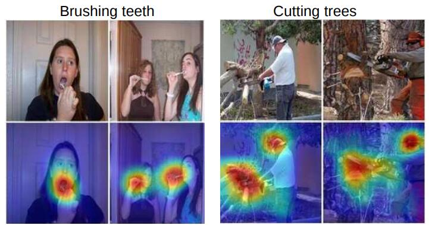

# [Learning Deep Features for Discriminative Localization](http://cnnlocalization.csail.mit.edu/Zhou_Learning_Deep_Features_CVPR_2016_paper.pdf)

## Abstract

在这项工作中，我们重新审视了 [[13]][13] 中提出的全局平均池化层，并阐明了它如何明确地使卷积神经网络（CNN）具有显着的定位能力，尽管它是在图像级标签上训练的。虽然这种技术以前被提出作为一种正则化训练的手段，但我们发现它实际上构建了一个通用的可定位的深度表示，揭示了 CNN 对图像的隐式关注。尽管全局平均池化看起来很简单，但我们在没有训练任何边界框注释的情况下在 ILSVRC 2014 上实现了 37.1％ 的 Top-5 错误率。我们在各种实验中证明，我们的网络能够定位具有区分性的图像区域，尽管只是为了解决分类任务而进行训练。

## 1. Introduction

最近，Zhou 等人的工作 [34] 表明，卷积神经网络 (CNN) 的各个卷积层的卷积单元实际上是物体检测器，尽管没有提供关于物体位置的监督。尽管在卷积层中具有这种显着的定位物体的能力，但在使用全连接层进行分类时，这种能力会丧失。最近，一些流行的全卷积神经网络，例如网络中的网络 (NIN) [13]和 GoogLeNet [25]，已被提出来避免使用全连接层以最小化参数数量，同时保持高性能。

为了实现这一点，[13]使用全局平均池化作为结构正则化器，在训练期间防止过度拟合。在我们的实验中，我们发现这种全局平均池化层的优势不仅仅只是充当正则化器——事实上，通过一些微调，网络可以保留其显着的定位能力，直到最后一层。这种微调允许在单个前向传播中轻松识别出一系列任务的具有区分能力的图像区域，即使是在网络最初未经过训练的任务。如图 1 (a) 所示，针对对象分类进行训练的 CNN 能够成功地将动作分类的判别区域定位为人类正在交互的对象，而不是人类本身。

尽管我们的方法表面上很简单，但对于 ILSVRC 基准测试[21]上的弱监督对象定位，我们的最佳网络实现了 37.1％ 的 Top-5 测试错误率，这相当接近完全监督的AlexNet [10] 实现的 34.2％ 的 Top-5 测试错误率。此外，我们证明了我们的方法中深度特征的可定位性可以轻松转移到其他识别数据集，以进行通用分类，定位和概念发现。

**图 1**：全局平均池化层的简单修改与我们的类激活映射 (CAM) 技术相结合，使经过分类训练的 CNN 能够在单个前向传播中对图像进行分类和定位特定类别的图像区域，例如，用于刷牙的牙刷和用于砍树的电锯。

### 1.1. Related Work

卷积神经网络 (CNN) 在各种视觉识别任务上表现出色 。最近的研究表明，尽管 CNN 是基于图像级别标签进行训练的，但它们具有定位对象的显著能力 。在这项工作中，我们展示了，使用适当的架构，我们可以将这种能力推广到不仅仅是定位对象，而是开始确定图像的哪些区域被用于区分。在这里，我们讨论了与本文最相关的两个工作方向：弱监督目标定位和可视化 CNN 的内部表示。

**弱监督目标定位**：最近有许多研究探索使用 CNN 进行弱监督目标定位。Bergamo 等人提出了一种自学习目标定位技术，涉及遮盖图像区域以识别导致最大激活的区域以定位对象。Cinbis 等人和 Pinheiro 等人将多实例学习与 CNN 特征相结合以定位对象。Oquab 等人提出了一种转移中层图像表示的方法，并表明通过在多个重叠 patch 上评估 CNN 的输出，可以实现一些目标定位。然而，这些方法虽然产生了有希望的结果，但它们没有进行端到端的训练，需要多次前向传播网络才能定位对象，使它们难以扩展到真实世界的数据集。我们的方法进行了端到端的训练，并可以在单次前向传播中定位对象。

与我们最相似的方法是 Oquab 等人基于全局最大池化的工作[16]。他们没有使用全局平均池化，而是应用全局最大池化在对象上定位一个点。然而，他们的定位仅限于位于对象边界上的一个点，而不是确定对象的完整范围。我们认为，尽管最大值和平均值函数非常相似，但使用平均池化有助于网络识别对象的完整范围。这背后的基本直觉是，与最大池化相比，平均池化的损失在网络识别对象的所有辨别区域时会有所改善。这在第 3.2 节中进行了更详细的解释和实验验证。此外，与[16]不同，我们证明了这种定位能力是通用的，即使是网络没有训练过的问题上也可以观察到。

我们使用类激活映射来指代为每个图像生成的加权激活图，如第 2 节所述。我们想强调的是，虽然全局平均池化不是我们在这里提出的新技术，但观察到它可以应用于准确的区分性定位，据我们所知，这是我们工作的独特之处。我们认为，这种技术的简单性使其具有可移植性，并可应用于各种计算机视觉任务，以实现快速准确的定位。

## 2. Class Activation Mapping

在本节中，我们描述了如何在卷积神经网络 (CNN) 中使用全局平均池化 (GAP) 生成类激活映射 (CAM) 的过程。某一类别的类激活映射表示 CNN 用于识别该类别的具有区分能力的图像区域 (例如图 3)。生成这些映射的过程如图 2 所示。我们使用的网络结构类似于 Network in Network [13] 和 GoogLeNet [25] —— 网络主要由卷积层组成，在最终输出层 (分类任务中为 softmax) 之前，我们对卷积特征图进行全局平均池化，并将其用作全连接层的特征以产生所需的输出 (类别或其他)。给定这种简单的连接结构，我们可以通过将输出层的权重反向投影到卷积特征图上来识别图像区域的重要性，我们将此技术称为类激活映射。

如图 2 所示，全局平均池化输出最后一个卷积层的每个单元的特征图的空间平均值。这些值的加权和用于生成最终输出。类似地，我们对最后一个卷积层的特征图进行加权求和以获得我们的类激活映射。下面我们更正式地描述 softmax 的情况。同样的技术也可以应用于回归和其他损失函数。

给定一张图像，令 $f_k(x,y)$ 表示最后一层卷积层中空间位置 $(x,y)$ 处的单元 $k$ 的激活。然后，对于单元 $k$ ，执行全局平均池化的结果 $F^k$ 是 $\sum_{x,y} f_k(x,y)$ 。因此，给定一个类别 $c$ ，softmax 的输入 $S_c$  是 $\sum_k w_k^c F_k$ ，其中 $w_k^c$ 是单元 $k$ 对应于类别 $c$ 的权重。本质上， $w_k^c$ 表示 $F_k$ 对于类别 $c$ 的重要性。最终，类别 $c$ 的 softmax 的输出由 $\frac{\exp(S_c)}{\sum_c \exp(S_c)}$ 给出。这里我们忽略偏置项：我们显式地将 softmax 的输入偏置设置为 0，因为它对分类的性能几乎没有影响。

通过将 $F_k = \sum_{x,y} f_k(x,y)$ 代入到类别分数 $S_c$ ，我们得到：

$$
S_c = \sum_k w_k^c \sum_{x,y} f_k(x,y) = \sum_{x,y}\sum_k w_k^c f_k(x,y). \tag{1}
$$

我们定义 $M_c$  为类别 $c$ 的类别激活映射，其中每个空间元素由下式给出

$$
M_c(x,y) = \sum_k w_k^c f_k(x,y). \tag{2}
$$

## References

[13]: https://arxiv.org/pdf/1312.4400.pdf	"Network In Network"

