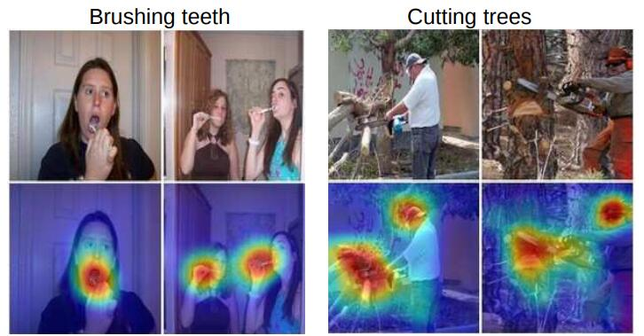

# [Learning Deep Features for Discriminative Localization](http://cnnlocalization.csail.mit.edu/Zhou_Learning_Deep_Features_CVPR_2016_paper.pdf)

## Abstract

在这项工作中，我们重新审视了 [[13]][13] 中提出的全局平均池化层，并阐明了它如何明确地使卷积神经网络（CNN）具有显着的定位能力，尽管它是在图像级标签上训练的。虽然这种技术以前被提出作为一种正则化训练的手段，但我们发现它实际上构建了一个通用的可定位的深度表示，揭示了 CNN 对图像的隐式关注。尽管全局平均池化看起来很简单，但我们在没有训练任何边界框注释的情况下在 ILSVRC 2014 上实现了 37.1％ 的 Top-5 错误率。我们在各种实验中证明，我们的网络能够定位具有区分性的图像区域，尽管只是为了解决分类任务而进行训练。

## 1. Introduction

最近，Zhou 等人的工作 [34] 表明，卷积神经网络 (CNN) 的各个卷积层的卷积单元实际上是物体检测器，尽管没有提供关于物体位置的监督。尽管在卷积层中具有这种显着的定位物体的能力，但在使用全连接层进行分类时，这种能力会丧失。最近，一些流行的全卷积神经网络，例如网络中的网络 (NIN) [13]和 GoogLeNet [25]，已被提出来避免使用全连接层以最小化参数数量，同时保持高性能。

为了实现这一点，[13]使用全局平均池化作为结构正则化器，在训练期间防止过度拟合。在我们的实验中，我们发现这种全局平均池化层的优势不仅仅只是充当正则化器——事实上，通过一些微调，网络可以保留其显着的定位能力，直到最后一层。这种微调允许在单个前向传播中轻松识别出一系列任务的具有区分能力的图像区域，即使是在网络最初未经过训练的任务。如图 1 (a) 所示，针对对象分类进行训练的 CNN 能够成功地将动作分类的判别区域定位为人类正在交互的对象，而不是人类本身。

尽管我们的方法表面上很简单，但对于 ILSVRC 基准测试[21]上的弱监督对象定位，我们的最佳网络实现了 37.1％ 的 Top-5 测试错误率，这相当接近完全监督的AlexNet [10] 实现的 34.2％ 的 Top-5 测试错误率。此外，我们证明了我们的方法中深度特征的可定位性可以轻松转移到其他识别数据集，以进行通用分类，定位和概念发现。

**图 1**：全局平均池化层的简单修改与我们的类激活映射 (CAM) 技术相结合，使经过分类训练的 CNN 能够在单个前向传播中对图像进行分类和定位特定类别的图像区域，例如，用于刷牙的牙刷和用于砍树的电锯。

## 2. Class Activation Mapping

在本节中，我们描述了如何在卷积神经网络 (CNN) 中使用全局平均池化 (GAP) 生成类激活映射 (CAM) 的过程。某一类别的类激活映射表示 CNN 用于识别该类别的具有区分能力的图像区域 (例如图 3)。生成这些映射的过程如图 2 所示。我们使用的网络结构类似于 Network in Network [13] 和 GoogLeNet [25] —— 网络主要由卷积层组成，在最终输出层 (分类任务中为 softmax) 之前，我们对卷积特征图进行全局平均池化，并将其用作全连接层的特征以产生所需的输出 (类别或其他)。给定这种简单的连接结构，我们可以通过将输出层的权重反向投影到卷积特征图上来识别图像区域的重要性，我们将此技术称为类激活映射。

如图 2 所示，全局平均池化输出最后一个卷积层的每个单元的特征图的空间平均值。这些值的加权和用于生成最终输出。类似地，我们对最后一个卷积层的特征图进行加权求和以获得我们的类激活映射。下面我们更正式地描述 softmax 的情况。同样的技术也可以应用于回归和其他损失函数。

## References

[13]: https://arxiv.org/pdf/1312.4400.pdf	"Network In Network"

