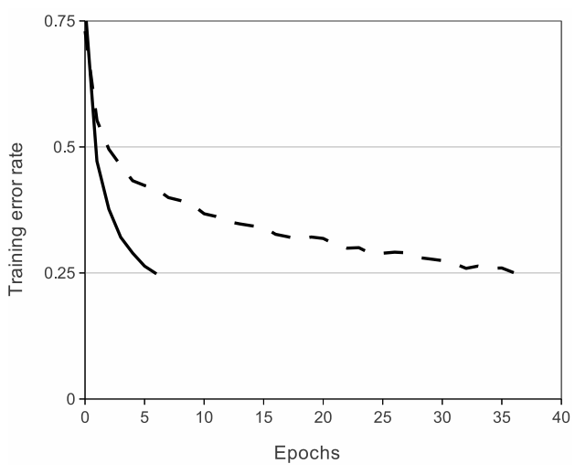
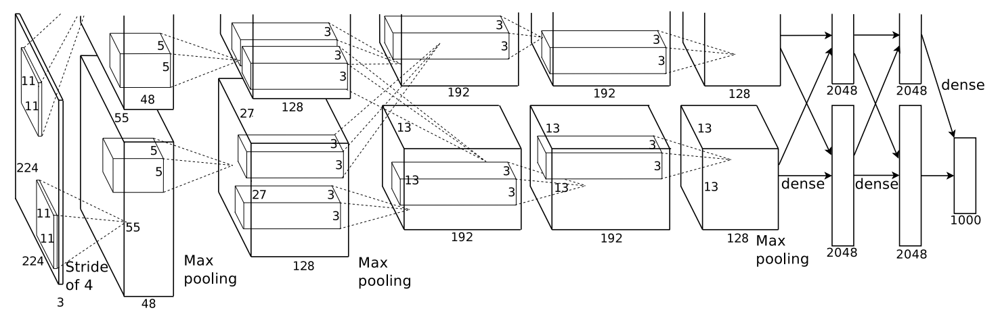

[TOC]

# ImageNet Classification with Deep Convolutional Neural Networks

## Abstract

作者训练了一个大型的深度卷积神经网络，将 ImageNet LSVRC-2010 比赛中的 120 万高分辨率图像分类为 1000 个不同类别。在测试数据上，作者取得了 37.5% 和 17.0% 的 top-1 和 top-5 错误率，这大大优于之前的最好结果。这个神经网络有 6000 万参数和 650,000 个神经元，由 5 个卷积层组成，一些卷积层后跟着最大汇聚层，还有三个全连接层，最后还有 1000 路 softmax。为了训练更快，作者使用非饱和神经元和卷积操作的一个非常高效的 gpu 实现。为了减少全连接层中的过拟合，作者采用了一种名为 "dropout" 的正则化方法，该方法被证明非常有效。作者还在 ILSVRC-2012 比赛中提交了这个模型的一种变体，并以 15.3% 的 top-5 测试错误率赢了，对比第二名获得的错误率是 26.2%。

**PS：** 说白了就是训练了一个当时看来很大的深度卷积神经网络，在 ImageNet 数据集上分类效果不错 (15.3% top-5 error rate)，比第二名高了 10 %。

## 1 Introduction

当前的物体识别方法主要使用机器学习方法。为提高它们的性能，可以收集更大的数据集，学习更强大的模型，并使用更好的技术来防止过拟合。直到最近，有标注的图像数据集相当小——大约一万张图像 (例如，NORB、Caltech-101/256 和 CIFAR-10/100)。这种规模的数据集的简单识别任务能被很好地解决，特别是当它们被用保留标签的变换做数据增广时。例如，目前在 MNIST 数字识别任务上的最佳错误率 (<0.3%) 接近人类的表现。但在现实环境中的物体表现出相当大的可变性，因此要学习识别它们需要使用更大的训练集。事实上，小的图像数据集的缺点已经被广泛认识到，但直到最近才有可能收集带有数百万图像的标注数据集。新的更大的数据集包括 LabelMe，由数十万完全分割的图像组成；和 ImageNet，由超过 22000 个类别的，1500 万有标注的高分辨率图像组成。

为了从数百万张图像中学习成千上万个物体，我们需要一个具有大量学习能力的模型。然而，物体识别任务的巨大复杂性意味着这个问题无法被即使是 ImageNet 这样大的数据集具化，所以我们的模型也应该有大量的先验知识来补偿所有我们没有的数据。卷积神经网络可以被认为这样类模型。它们的能力可以通过改变它们的深度和宽度来控制，同时它们还对自然图像作出强的且大部分是正确的假设 (即统计的平稳性和像素依赖的局部性)。因此，与有相似大小的层的标准前馈网络相比，CNNs 有更少的连接和参数，因此更加容易训练，而理论最佳性能可能只是稍差一点。

尽管 CNNs 的特性很吸引人，而且它们的局部架构的相对效率也很高，但要大规模应用于高分辨率图像的成本还是很昂贵的。幸运的是，当前的 GPUs 和高度优化的 2D 卷积实现相结合，足够强大来促进训练大型 CNNs，而且最近的数据集 (如 ImageNet) 包含足够多的标注数据训练这些模型，而不会过拟合。

本文的具体贡献如下：我们在 ILSVRC-2010 和 2012 比赛中使用的 ImageNet 子集上训练了迄今为止最大的卷积神经网络，并在这些数据集上取得了目前最好的结果。我们编写了一套高度优化的 2D 卷积和其他训练卷积神经网络固有的其他算子的 GPU 实现，并且公开了。我们的网络包含一些新的和不寻常的特性，这些特性可以提升网络的性能并减少它的训练时间，将在第三节详细介绍。我们网络的规模使得过拟合成为一个严重的问题，即使是有120万的有标签的训练样本，因此我们使用一些有效的技术来防止过拟合，将在第四节详细介绍。我们最终的网络包含 5 个卷积和 3 个全连接层，而且深度好像很重要：我们发现移除任何卷积层 (每个层包含的参数不超过模型参数的 1%) 会导致较差的性能。

最后，网络的规模主要受限于当前 GPUs 上可用的内存大小和我们所能容忍的训练时长。我们的网络在两块 GTX 580 3GB GPUs 上需要 5 到 6 天的训练时间。我们的实验表明，只要等待更快的 GPU 和更大的数据集出现，我们的结果就可以得到改善。

**ps：** 介绍了在 ImageNet 上训练了一个 5 CNNs + 3 FCs 的网络，编写了一个高效的 GPU 实现，通过实验表明深度很重要 (宽度也重要)，如果有更快的 GPU 和更大的数据集，性能还能提升。

## 2 The Dataset

ImageNet 是一个有超过 1500 万有标注的高分辨率图像，大约 22000 类的数据集。这些图像是从网上收集，然后由人工标注者用亚马逊的 Mechanical Turk 众包工具标注的。从 2010 年开始，作为 Pascal Visual Object Challenge 的一部分，每年都会举办一场名为 ImageNet Large-Scale Visual Recognition Challenge (ILSVRC) 的竞赛。ILSVRC 使用 ImageNet 的一个子集，大约 1000 类，每类 1000 张图像。总共大约有 120 万训练图像，5 万验证图像和 15 万测试图像。

ILSVRC-2010 是唯一测试集可用的版本，因此它是我们进行大多数实验的版本。因为我们也在 ILSVRC-2012 中也提交了我们的模型，在第 6 节我们也报告了这个版本的结果，这个版本测试集没有公布。在 ImageNet 上，通常报告两种错误了：top-1 和 top-5，其中 top-5 错误率是指正确标签不在模型认为最有可能的五个标签之中的测试图像的比例。

ImageNet 由不同分辨率的图像组成，而我们的系统需要恒定的输入维度。因此，我们将图像降采样到 $256 \times 256$ 的固定分辨率。给定一个矩形图像，我们首先将短边缩放至 256，然后从结果图像中裁剪出中间的 $256 \times 256$ 的块。除了每个像素减去训练集的均值，没有以其他任何方式预处理图像。因此，我们在 (中心) 原始 RGB 像素值上训练网络。

**ps：** ImageNet 是一个 22, 000 类，1500 万图像的超大数据集，用了 ImageNet 的包含 1000 类，每类 1000 张图像的子集训练。对于不同大小的图像，将短边缩放到 256 后，裁取中心的 256 ，每个像素减去训练集的均值，在原始 RGB 上训练。

## 3 The Architecture

我们的网络架构总结在图 2。它包含 8 个可学习的层—— 5 个卷积和 3 个全连接。下面，我们将描述网络架构的一些新颖的或不寻常的特性。3.1 - 3.4 节是根据我们对其重要性的评估进行排序的，最重要的放第一位。

### 3.1 ReLU Nonlinearity

将神经元的输出 $f$ 建模为其输入 $x$ 的函数的标准做法是使用 $f(x) = tanh(x)$ 或 $f(x) = (1 + e^{-x})^{-1}$。在使用梯度下降训练期间，这些饱和非线性比非饱和非线性 $f(x) = \max(0,x)$ 慢得多。在 Nair 和 Hinton 之后，我们将具有这种非线性的神经元称为整流线性单元 (ReLUs)。使用 ReLUs 的深度卷积神经网络的比使用 tanh 单元的相同网络快好几倍。图 1 展示了这点，它显示了对于特定的四层卷积网络在 CIFA10 上达到 25% 训练误差所需的迭代次数。这张图表明，如果我们使用传统的饱和神经元模型，我们无法使用如此大的神经网络来进行实验。

我们不是第一个考虑在 CNNs 中改变传统神经元的人。例如，Jarrett 等人声称非线性 $f(x) = \left | tanh(x) \right |$ 与他们在局部平均汇聚之后添加对比归一化，在Caltech-101 上表现很好。然而，在这个数据集上的主要关注点是防止过拟合，因此他们观察到的效果与我们报告的在使用 ReLUs 加速拟合训练集的能力不同。更快的学习对于在大数据上训练大模型的性能有很大的影响。

图 1：一个使用的 ReLUs (实线) 的四层卷积神经网络在 CIFA-10 上达到 25% 训练误差比使用 tanh 神经元 (虚线) 的相同网络快 6 倍。每个网络的学习率都是独立选择的，以使得训练尽可能快。没有使用任何形式的正则化。这里展示的结果的幅度随网络结构不同而不同，但使用 ReLUs 的网络始终比使用饱和神经元的网络快几倍。

**ps：** 用非饱和的非线性 ReLU 可以加速收敛，比饱和的非线性快几倍。其他人提出过改变 CNNs 中的神经元，例如 $|tanh(x)|$，用于防止过拟合。训练更快还是很重要的。

### 3.2 Training on Multiple GPUs

单个 GTX 580 GPU 只有 3GB 内存，这限制了可在其上训练的最大网络的大小。事实证明，120 万个训练样本足以训练一个大到单 GPU 无法容纳的网络。因此，我们将网络分散到两个 GPUs 上。当前的 GPUs 特别适合跨 GPU 并行化，因为它们能够之间读写彼此的内存，而不需要经过主机内存。我们使用的并行化方案本质上是将一半的内核 (或神经元) 放到每个 GPU 上，还有一个额外的技巧：GPUs 仅在特定的层进行通信。例如，第 3 层的内核将第 2 层的所有内核映射作为输入 (在输出通道concat 起来)。然而，第 4 层的内核仅将同一 GPU 的第 3 层的内核映射作为输入。选择连接模式是交叉验证的一个问题，但这允许我们精确地调整通信量，直到它达到计算量可接受的量。

产生的架构与 Ciresan 等人使用的 “柱状” CNN 有点类似，但我们的列不是独立的，(见图 2)。这个方案与在单个 GPU 上训练的，只有一半内核的网络相比，将 top-1 和 top-5 错误率分别降低了 1.7% 和 1.2%。两个 GPU 的网络比单 GPU 网络的训练时间略微短一点。

## 7 Discussion

作者的结果展示了使用纯监督学习，一个大型的深度卷积神经网络能够在非常具有挑战的数据集取得突破记录的结果。值得注意的是，如果去掉一个卷积层，网络的性能会退化。例如，去除任意中间层会导致损失大约 2% 的 top-1 网络性能。因此深度对于实现作者的结果很重要。

**PS：** 去掉一层卷积层，努力调调参，还是有可能不降低网络性能的。深度很重要，但是宽度同样重要。

为了简化实验，作者没有使用任何的无监督预训练，尽管作者认为它会有用，特别是当获得足够的计算能力来显著地提升网络大小，而不用相应地提升的标注数据的数量。到目前为止，作者的结果已经得到改善，因为作者使他的网络更大，并且训练时间更长，但为了匹配人类视觉系统的 infero-temporal 路径，还有许多工作要做。最终，作者想在视频序列上使用非常大且深的卷积网络，视频中有一些时序信息，而这些信息在静态图像中是缺失的或很少的。

