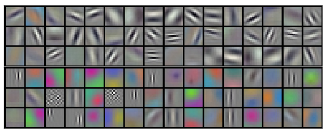
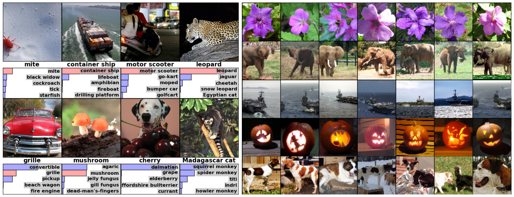

[TOC]

# ImageNet Classification with Deep Convolutional Neural Networks

## Abstract

作者训练了一个大型的深度卷积神经网络，将 ImageNet LSVRC-2010 比赛中的 120 万高分辨率图像分类为 1000 个不同类别。在测试数据上，作者取得了 37.5% 和 17.0% 的 top-1 和 top-5 错误率，这大大优于之前的最好结果。这个神经网络有 6000 万参数和 650,000 个神经元，由 5 个卷积层组成，一些卷积层后跟着最大汇聚层，还有三个全连接层，最后还有 1000 路 softmax。为了训练更快，作者使用非饱和神经元和卷积操作的一个非常高效的 gpu 实现。为了减少全连接层中的过拟合，作者采用了一种名为 "dropout" 的正则化方法，该方法被证明非常有效。作者还在 ILSVRC-2012 比赛中提交了这个模型的一种变体，并以 15.3% 的 top-5 测试错误率赢了，对比第二名获得的错误率是 26.2%。

**PS：** 说白了就是训练了一个当时看来很大的深度卷积神经网络，在 ImageNet 数据集上分类效果不错 (15.3% top-5 error rate)，比第二名高了 10 %。

## 1 Introduction

当前的物体识别方法主要使用机器学习方法。为提高它们的性能，可以收集更大的数据集，学习更强大的模型，并使用更好的技术来防止过拟合。直到最近，有标注的图像数据集相当小——大约一万张图像 (例如，NORB、Caltech-101/256 和 CIFAR-10/100)。这种规模的数据集的简单识别任务能被很好地解决，特别是当它们被用保留标签的变换做数据增广时。例如，目前在 MNIST 数字识别任务上的最佳错误率 (<0.3%) 接近人类的表现。但在现实环境中的物体表现出相当大的可变性，因此要学习识别它们需要使用更大的训练集。事实上，小的图像数据集的缺点已经被广泛认识到，但直到最近才有可能收集带有数百万图像的标注数据集。新的更大的数据集包括 LabelMe，由数十万完全分割的图像组成；和 ImageNet，由超过 22000 个类别的，1500 万有标注的高分辨率图像组成。

为了从数百万张图像中学习成千上万个物体，我们需要一个具有大量学习能力的模型。然而，物体识别任务的巨大复杂性意味着这个问题无法被即使是 ImageNet 这样大的数据集具化，所以我们的模型也应该有大量的先验知识来补偿所有我们没有的数据。卷积神经网络可以被认为这样类模型。它们的能力可以通过改变它们的深度和宽度来控制，同时它们还对自然图像作出强的且大部分是正确的假设 (即统计的平稳性和像素依赖的局部性)。因此，与有相似大小的层的标准前馈网络相比，CNNs 有更少的连接和参数，因此更加容易训练，而理论最佳性能可能只是稍差一点。

尽管 CNNs 的特性很吸引人，而且它们的局部架构的相对效率也很高，但要大规模应用于高分辨率图像的成本还是很昂贵的。幸运的是，当前的 GPUs 和高度优化的 2D 卷积实现相结合，足够强大来促进训练大型 CNNs，而且最近的数据集 (如 ImageNet) 包含足够多的标注数据训练这些模型，而不会过拟合。

本文的具体贡献如下：我们在 ILSVRC-2010 和 2012 比赛中使用的 ImageNet 子集上训练了迄今为止最大的卷积神经网络，并在这些数据集上取得了目前最好的结果。我们编写了一套高度优化的 2D 卷积和其他训练卷积神经网络固有的其他算子的 GPU 实现，并且公开了。我们的网络包含一些新的和不寻常的特性，这些特性可以提升网络的性能并减少它的训练时间，将在第三节详细介绍。我们网络的规模使得过拟合成为一个严重的问题，即使是有120万的有标签的训练样本，因此我们使用一些有效的技术来防止过拟合，将在第四节详细介绍。我们最终的网络包含 5 个卷积和 3 个全连接层，而且深度好像很重要：我们发现移除任何卷积层 (每个层包含的参数不超过模型参数的 1%) 会导致较差的性能。

最后，网络的规模主要受限于当前 GPUs 上可用的内存大小和我们所能容忍的训练时长。我们的网络在两块 GTX 580 3GB GPUs 上需要 5 到 6 天的训练时间。我们的实验表明，只要等待更快的 GPU 和更大的数据集出现，我们的结果就可以得到改善。

**ps：** 介绍了在 ImageNet 上训练了一个 5 CNNs + 3 FCs 的网络，编写了一个高效的 GPU 实现，通过实验表明深度很重要 (宽度也重要)，如果有更快的 GPU 和更大的数据集，性能还能提升。

## 2 The Dataset

ImageNet 是一个有超过 1500 万有标注的高分辨率图像，大约 22000 类的数据集。这些图像是从网上收集，然后由人工标注者用亚马逊的 Mechanical Turk 众包工具标注的。从 2010 年开始，作为 Pascal Visual Object Challenge 的一部分，每年都会举办一场名为 ImageNet Large-Scale Visual Recognition Challenge (ILSVRC) 的竞赛。ILSVRC 使用 ImageNet 的一个子集，大约 1000 类，每类 1000 张图像。总共大约有 120 万训练图像，5 万验证图像和 15 万测试图像。

ILSVRC-2010 是唯一测试集可用的版本，因此它是我们进行大多数实验的版本。因为我们也在 ILSVRC-2012 中也提交了我们的模型，在第 6 节我们也报告了这个版本的结果，这个版本测试集没有公布。在 ImageNet 上，通常报告两种错误了：top-1 和 top-5，其中 top-5 错误率是指正确标签不在模型认为最有可能的五个标签之中的测试图像的比例。

ImageNet 由不同分辨率的图像组成，而我们的系统需要恒定的输入维度。因此，我们将图像降采样到 $256 \times 256$ 的固定分辨率。给定一个矩形图像，我们首先将短边缩放至 256，然后从结果图像中裁剪出中间的 $256 \times 256$ 的块。除了每个像素减去训练集的均值，没有以其他任何方式预处理图像。因此，我们在 (中心) 原始 RGB 像素值上训练网络。

**ps：** ImageNet 是一个 22, 000 类，1500 万图像的超大数据集，用了 ImageNet 的包含 1000 类，每类 1000 张图像的子集训练。对于不同大小的图像，将短边缩放到 256 后，裁取中心的 256 ，每个像素减去训练集的均值，在原始 RGB 上训练。

## 3 The Architecture

我们的网络架构总结在图 2。它包含 8 个可学习的层—— 5 个卷积和 3 个全连接。下面，我们将描述网络架构的一些新颖的或不寻常的特性。3.1 - 3.4 节是根据我们对其重要性的评估进行排序的，最重要的放第一位。

### 3.1 ReLU Nonlinearity

将神经元的输出 $f$ 建模为其输入 $x$ 的函数的标准做法是使用 $f(x) = tanh(x)$ 或 $f(x) = (1 + e^{-x})^{-1}$。在使用梯度下降训练期间，这些饱和非线性比非饱和非线性 $f(x) = \max(0,x)$ 慢得多。在 Nair 和 Hinton 之后，我们将具有这种非线性的神经元称为整流线性单元 (ReLUs)。使用 ReLUs 的深度卷积神经网络的比使用 tanh 单元的相同网络快好几倍。图 1 展示了这点，它显示了对于特定的四层卷积网络在 CIFA10 上达到 25% 训练误差所需的迭代次数。这张图表明，如果我们使用传统的饱和神经元模型，我们无法使用如此大的神经网络来进行实验。

我们不是第一个考虑在 CNNs 中改变传统神经元的人。例如，Jarrett 等人声称非线性 $f(x) = \left | tanh(x) \right |$ 与他们在局部平均汇聚之后添加对比归一化，在Caltech-101 上表现很好。然而，在这个数据集上的主要关注点是防止过拟合，因此他们观察到的效果与我们报告的在使用 ReLUs 加速拟合训练集的能力不同。更快的学习对于在大数据上训练大模型的性能有很大的影响。

图 1：一个使用的 ReLUs (实线) 的四层卷积神经网络在 CIFA-10 上达到 25% 训练误差比使用 tanh 神经元 (虚线) 的相同网络快 6 倍。每个网络的学习率都是独立选择的，以使得训练尽可能快。没有使用任何形式的正则化。这里展示的结果的幅度随网络结构不同而不同，但使用 ReLUs 的网络始终比使用饱和神经元的网络快几倍。

**ps：** 用非饱和的非线性 ReLU 可以加速收敛，比饱和的非线性快几倍。其他人提出过改变 CNNs 中的神经元，例如 $|tanh(x)|$，用于防止过拟合。训练更快还是很重要的。

### 3.2 Training on Multiple GPUs

单个 GTX 580 GPU 只有 3GB 内存，这限制了可在其上训练的最大网络的大小。事实证明，120 万个训练样本足以训练一个大到单 GPU 无法容纳的网络。因此，我们将网络分散到两个 GPUs 上。当前的 GPUs 特别适合跨 GPU 并行化，因为它们能够之间读写彼此的内存，而不需要经过主机内存。我们使用的并行化方案本质上是将一半的 kernels (或神经元) 放到每个 GPU 上，还有一个额外的技巧：GPUs 仅在特定的层进行通信。例如，第 3 层的 kernels 将第 2 层的所有 kernel maps 作为输入 (在输出通道concat 起来)。然而，第 4 层的 kernels 仅将同一 GPU 的第 3 层的 kernel maps 作为输入。选择连接模式是交叉验证的一个问题，但这允许我们精确地调整通信量，直到它达到计算量可接受的量。

产生的架构与 Ciresan 等人使用的 “柱状” CNN 有点类似，但我们的列不是独立的，(见图 2)。这个方案与在单个 GPU 上训练的，只有一半 kernels 的网络相比，将 top-1 和 top-5 错误率分别降低了 1.7% 和 1.2%。两个 GPU 的网络比单 GPU 网络的训练时间略微短一点。

### 3.3 Local Response Normalization

ReLUs 具有理想特性，它们不需要输入归一化来防止饱和。如果至少有一些训练样本产生正的输入给 ReLU，学习就会在那个神经元中发生。然而，我们仍然发现下面的局部归一化方案有助于泛化。用 $a_{x,y}^i$ 表示在 $(x,y)$ 处应用第 $i$ 个 kernel 计算所得的神经元的激活，再使用 ReLU 非线性，响应归一化后的激活 $b_{x,y}^i$ 由下式给出：
$$
b_{x,y}^i = a_{x,y}^i / \left ( k + \alpha \sum\limits_{j=\max(0,i-n/2)}^{\min(N-1,i+n/2)} (a_{x,y}^j)^2 \right)^\beta
$$
其中求和是在同一空间位置的 $n$ 邻近的 kernel maps 上进行的，$N$ 是该层 kernels 的总数。kernel maps 的顺序是任意的，并且在训练前就确定了的。这种响应归一化由真实神经元中启发，实现了一种侧向抑制的形式，在使用不同 kernels 计算得到的神经元的输出的大的激活之间产生了竞争。常量 $k,n,\alpha$ 和 $\beta$ 是超参数，其值由验证集确定；我们使用 $k = 2$，$n = 5$，$\alpha = 10^{-4}$ 和 $\beta = 0.75$。在某些层应用 ReLU 非线性之后，我们使用了这种归一化 (见 3.5 节)。

这个方案与 Jarret 等人的局部对比度归一化方案有一些相似之处，但我们的方案更准确地称为 “亮度归一化”，因为我们没有减去平均激活。响应归一化使我们的 top-1 和 top-5 错误率分别降低 1.4% 和 1.2%。我们还在 CIFAR-10 上验证了这个方案的有效性：一个四层的 CNN 在没有归一化的情况下获得了 13% 的测试错误率，在有归一化的情况下获得了 11% 的错误率。

### 3.4 Overlapping Pooling

CNNs 中的汇聚层总结了同一 kernel map 中的相邻神经元的输出。传统上，由相邻的汇聚单元总结的不会重叠。更准确地说，汇聚层可以认为是由间隔为 s 像素的汇聚单元组成的网格，每个网格概括了一个大小为 $z \times z$ 的位于汇聚单元中心的领域。如果我们设 $s = z$，我们就得到通常在 CNN 中所使用的传统的局部汇聚。如果我们设 $s < z$，我们得到重叠汇聚。这就是我们在整个网络中所使用的，其中 $s = 2$ 和 $z = 3$。与不重叠的方案 $s=2$，$z=2$ 相比，这个方案将 top-1 和 top-5 错误率分别降低 0.4% 和 0.3%，并且产生相同维度的输出。在训练期间，我们观察到使用重叠汇聚的模型过拟合稍微难一点。

### 3.5 Overall Architecture

如图 2 所示，网络包含 8 个带权重的层；前 5 层是卷积，剩余 3 层是全连接。最后一个全连接的输出被馈送给 1000 路的 softmax，产生 1000 类标签的分布。我们的网络最大化多项逻辑回归，相当于在预测分布下最大化每个训练样例的正确标签的 log-probability。

第 2、4 和 5 层卷积层的 kernels 仅与哪些在同一 GPU 上的前一层的 kernel maps 相连接。全连接层的神经元与前一层的所有神经元相连接。响应归一化跟在第 1 和第 2 层卷积层之后。最大汇聚层，3.4 节中所描述的，跟在响应归一化和第 5 层卷积层之后。每个卷积层和全连接层的输出都应用 ReLU 非线性。

第一层卷积层用 96 个大小为 $11 \times 11 \times 3$ (ps：这里的 3 应该是输入通道，kernel 大小应该是 $11 \times 11$)，步长为 4 (这是 kernel map 中的相邻神经元的感受野中心的距离) 的 kernels 过滤 $224 \times 224 \times 3$ 的输入图像。第二层将第一层的输出 (经过响应归一化和汇聚后) 作为输入，用 256 个大小为 $5 \times 5 \times 48$ (ps: 48 应该是输入通道，上一层的输出通道是 96，分给两块 GPU，刚好 48) 对它们进行滤波。第三、第四和第五层与前一层输出相连，中间没有任何汇聚层或归一化层。第三层卷积层有 384 个大小为 $3 \times 3 \times 256$ 的 kernels，第五层有 256 个 $3 \times 3 \times 192$ 的 kernels。全连接层每层有 4096 个神经元。

图 2：CNN 的架构图解，明确地描述了两个 GPU 之间的职责划分。一个 GPU 运行图中顶部的层，而另一个 GPU 运行图中底部的层。 GPUs 只在特定的层进行通信。

## 4 Reducing Overfitting

我们的神经网络有 6000 万个参数。虽然 ILSVRC 的 1000 类使每个训练样本对从图像到标签的映射施加了不少的约束，但这被证明不足以学习如此多的参数而不会遭受很大的过拟合。下面，我们将描述两种对抗过拟合的主要方法。

### 4.1 Data Augmentation

减少图像过拟合最简单也是最常用的方法是使用标签保留的变换来人为地扩大数据集。我们采用两种不同的数据增强形式，这两种形式都允许使用很少的计算量从原始图像生成转换后的图像，因此转换后的图像无需存储在磁盘上。在我们的实现中，转换后的图像是在 GPU 训练上一个小批量图像时由 python 代码在 CPU 上生成的。因此，这些数据增强方案实际上是计算免费的。(ps：当时 GPU 相对慢，现在这些增强会称为训练的时间瓶颈)。

第一种形式的数据增强包括生成图像的平移和水平反射。我们通过从 $256 \times 256$ 的图像中随机提取 $224 \times 224$ 的块 (已经它们的水平反射) 来完成，并在这些提取到的块上训练我们的网络。这使得我们的训练集的规模提升了 2048 倍，但训练示例是高度相互依赖的。没有这个方案，我们的网络会遭受严重的过拟合，这将迫使我们使用更小的网络。测试时，网络通过提取 5 个 $224 \times 224$ 的块 (四个角落和一个中心) 以及它们的水平反射 (共 10 个块)进行预测，并将在这 10 个块的网络 softmax 层的预测取平均。

第二中形式的数据增强时改变训练图像中 RGB 通道的强度。具体来说，我们对整个 ImageNet 训练集的 RGB 像素进行 PCA。对于每个训练图像，成倍的添加找到的主成分，幅值大小是相应的特征值乘以一个来自均值为 0，标准差为 0.1 的高斯分布的随机值。因此对于每个图像的 RGB 像素 $I_{xy} = [I_{xy}^R \ I_{xy}^G \ I_{xy}^B]$ 我们添加下面的参量：
$$
[P_1, P_2, P_3][\alpha_1\lambda_1, \alpha_2\lambda_2, \alpha_3\lambda_3]^T
$$
其中 $P_i$ 和 $\lambda_i$ 分别是 RGB 像素值的 $3 \times 3$ 的协方差矩阵的第 i 个特征向量和特征值，$\alpha_i$ 是上述随机变量。对于特定图像的所有像素，每个 $\alpha_i$ 只绘制一次，直到该图像再次被用于训练，此时它将重新绘制。此方案近似地捕捉了自然图像的一个重要特性，即物体的一致性对光照强度和颜色的变化是不变的。这个方案将 top-1 错误率降低了 1% 以上。

### 4.2 Dropout

结合许多不同模型的预测是减少测试误差的一种非常成功的方法，但对于已经花费数天时间来训练的大型网络来说似乎过于昂贵。然而，有一个非常有效的模型组合版本， 仅需要两倍训练时间。最近引入的技术，称为 "dropout"，将每个隐藏神经元的输出以 0.5 的概率设置为 0。以这种方式 "dropout out" 的神经元不参与正向传递，也不参与反向传播。所以每次输入时，网络都会采样不同的架构，但所有的架构都共享权重。这项技术减少了神经元的协同适应，因为一个神经元不能依赖其他特定的神经元的出现。因此，它被迫学习更鲁棒的特征，这些特征与其他神经元的不同的随机子集结合起来是有用的。测试时，我们使用了全部的神经元，但将它们的输出乘以 0.5，这是对指数级别的 "dropout" 网络产生的预测分布的几何均值一个合理的近似。

我们在图 2 的前两个全连接层使用 dropout。没有 dropout，我们的网络表现出明显的过拟合。Dropout 是收敛需要的迭代次数翻倍。

ps： dropout 实际上是引入了更多的噪音，而不是结合很多个模型，是一种正则化。训练时可以使用以下设计
$$
h' = 
\left\{
	\begin{array}{ll}
	0, & p\\
	\frac{h}{1-p}, & other
	\end{array}
\right.
$$
使其数学期望保持不变，即 $E[h'] = h$。

## 5 Details of learning

我们使用随机梯度下降来训练我们的模型，批量大小为 128，动量 0.9 ，权重衰减 0.0005。我们发现这个很小的权重衰减对于模型的学习是很重要的。换句话说，权重衰减在这不仅仅是一个正则化：它减少了模型的训练误差。权重 $w$ 的更新规则是：
$$
\begin{aligned}	
v_{i+1} & := 0.9 \cdot v_i - 0.0005 \cdot \epsilon \cdot w - \epsilon \left \langle  \frac{\partial L}{\partial w} |_{w_i} \right \rangle _{D_{i}} \\
w_{i+1} & :=   w_i + v_{i+1}
\end{aligned}
$$
其中 $i$ 是迭代索引，$v$ 是动量变量，$\epsilon$ 是学习率，$\left \langle  \frac{\partial L}{\partial w} |_{w_i} \right \rangle _{D_{i}}$ 是目标函数 $L$ 对 $w$ 的导数在 $w_i$ 处的值，在第 $i$ 个批量 $D_i$ 上的平均值。

我们用均值为 0，标准差为 0.01 的高斯分布初始化每一层的权重。我们用常量 1 初始化第二、第四和第五层卷积层以及全连接层的偏差。这一初始化通过向 ReLU 提供正的输入来加速学习的早期阶段。我们用常量 0 来初始化剩下的层的神经元的偏差。

我们对所有的层使用相同的学习率，在训练过程中手动的调整。我们遵循的启发式方法是，当验证错误率在当前学习率下停止提升时，将学习率除以 10。学习率初始化为 0.01，并在训练终止之前衰减三次。我们在 120 万图像的训练集上训练网络大约 90 个循环。

ps：目前权重一般都用 Xavier 初始化，偏差一般初始化为 0。也有一些是将 bias 初始化为 0.01 (可能更糟，暂时不明确)。

图 3：通过在 $224 \times 224 \times 3$ 的输入图像上的第一层卷积层学习的 96 个尺寸为 $11 \times 11 \times 3$ 卷积核。上边 48 个核是在 GPU 1 学习的，而下边的 48 个核是在 GPU 2 上学习的。细节见 6.1 节。

## 6 Results

我们在 ILSVRC-2010 上的结果总结在表 1。我们的网络取得的 top-1 和 top-5 测试错误率为 **37.5%** 和 **17.0%** (4.1 节中描述的没有对 10 个 pathces 的预测取平均的错误率是 39.0% 和 18.3%)。在 ILSVRC-2010 比赛中取得的最好的成绩是 47.1% 和 28.2%，使用的方法是对六个在不同特征上训练的稀疏编码模型产生的预测的取平均，从那以后，最好的公开结果是 45.7% 和 25.7%，使用的方法是对在由两种类型的密集采样特征上计算的 Fisher Vectors (FVs) 上训练的分类器的预测取平均。

| Model               | Top-1     | Top-5    |
| :------------------ | --------- | :------- |
| *Sparse coding [2]* | 47.1%     | 28.2%    |
| *SIFT + FVs [24]*   | 45.7%     | 25.7%    |
| CNN                 | **37.5%** | **17.0** |

表 1：在 ILSVRC-2010 测试集上结果比较。斜体是其他方法取得的最好结果。

我们也在 ILSVRC-2012 比赛中提交了我们的模型，并在表 2 中报告了我们的结果。由于 ILSVRC-2012 测试集标签没有公开，所以我们不能报告我们尝试的所有模型的测试错误率。在本段的剩余部分，我们交替使用验证和测试错误率，因为根据我们的经验，它们相差不超过 0.1% (见表 2)。本篇论文描述的 CNN 取得了 18.2% 的 top-5 错误率。对 5 个相似的 CNNs 的预测取平均，错误率为 16.4%。训练一个 CNN，在最后一层汇聚层上增加第 6 个卷积层，对整个 2011 年秋季发布的 ImageNet (1500 万图像，22000 个类别) 进行分类，然后在 ILSVRC-2012 上微调，错误率为 16.6%。将在整个 2011 年秋季发布的 ImageNet 上预训练 2 个 CNNs 和之前提到的 5 个 CNNs 的预测取平均，错误率为 15.3%。第二好的参赛作品获得了 26.2% 的错误率，使用的方法是对在不同类型的密集采样的特征上计算的 FVs 上训练的分类器的预测取平均。

| Model            | Top-1 (val) | Top-5 (val) | Top-5 (test) |
| ---------------- | ----------- | ----------- | ------------ |
| *SIFT + FVs [7]* |             |             | 26.2%        |
| 1 CNN            | 40.7%       | 18.2%       |              |
| 5 CNNs           | 38.1%       | 16.4%       | **16.4%**    |
| 1 CNN*           | 39.0%       | 16.6%       |              |
| 7 CNNs*          | 36.7%       | 15.4%       | **15.3%**    |

最后，我们还报告了在 2009 年秋季版 ImageNet 的错误率，有 10184 个类别和 890 万图像。在这个数据集上，我们遵循文献中约定，一半的图像用于训练，一半图像用于测试。因为没有测试集，我们的分割必然不同于以前作者使用的分割，但这不会显著地影响结果。我们在这个数据集上的 top-1 和 top-5 错误率是 **67.4%** 和 **40.9%**，由上述网络，在最后一层汇聚层后添加第六个卷积层实现的。在这个数据集上发表的最佳结果是 78.1% 和 60.9%。

### 6.1 Qualitative Evaluations

图 3 展示了由网络的两个数据连接层学习到的卷积核。该网络已经学会了各种频率和方向选择的核，以及各种颜色的斑点。请注意这两个 GPU 所展示出的特殊化，这是 3.5 节中描述的受限连接的结果。GPU 1 上的核很大程度上是颜色无关的，而 GPU 2 上的核很大程度是颜色相关的。这种特殊化发生在每次运行期间，并且独立于任何特定的随机权重初始化 (对 GPU 的重新编号的取模)。

在图 4 的左边，我们通过在 8 张图像计算它们的 top-5 预测来定性地评估网络已经学习到了什么。注意到，即使是偏离中心的物体，如左上角的螨，也可以被网络识别。排名前 5 的标签大多是合理的。例如，只有其他类型的猫被认为是豹子的可能可信的标签。在某些示例中 (grille，樱桃) 有模棱两可的预期输出。

另一种探测网络的视觉知识的方法是考虑图像在最后的 4096 维隐藏层输出特征激活。如果两幅图像产生的特征激活向量的欧式距离很小，我们可以说神经网络的高层认为他们是相似的。图 4 展示了 5 张来自测试集的图像，和根据这个度量与它们最相似的 6 幅来自训练集的图像。注意，在像素级别上，检索到的训练图像在 L2 中通常与第一列的查询图像不相近。例如，被检索到的狗和大象以各种姿势出现。我们在补充材料中给出了更多测试图像的结果。

利用两个 4096 维的实值向量之间的欧式距离计算相似性是低效的，但通过训练一个自编码器将这些向量压缩为短的二进制编码可以使其高效。这将产生一种比对原始像素应用自编码器更好的图像检索方法，后者没有使用图像标签，因此有检索具有相似边缘模式的图像的趋势，无论它们是否在语义上相似。

图 4：(左) 8 张 ILSVRC-2010 测试图像和我们模型认为最有可能的 5 个标签。正确的标签写在每个图像下面，并且被分配给正确标签的概率也用红色条显示 (如果它碰巧在 top-5 中)。(右) 第一列是 5 个 ILSVRC-2010 测试图像。剩下的列展示了在最后一层隐藏层中产生的特征向量与测试图像的特征向量的欧式距离最小的 6 张训练图像。

## 7 Discussion

作者的结果展示了使用纯监督学习，一个大型的深度卷积神经网络能够在非常具有挑战的数据集取得突破记录的结果。值得注意的是，如果去掉一个卷积层，网络的性能会退化。例如，去除任意中间层会导致损失大约 2% 的 top-1 网络性能。因此深度对于实现作者的结果很重要。

**PS：** 去掉一层卷积层，努力调调参，还是有可能不降低网络性能的。深度很重要，但是宽度同样重要。

为了简化实验，作者没有使用任何的无监督预训练，尽管作者认为它会有用，特别是当获得足够的计算能力来显著地提升网络大小，而不用相应地提升的标注数据的数量。到目前为止，作者的结果已经得到改善，因为作者使他的网络更大，并且训练时间更长，但为了匹配人类视觉系统的 infero-temporal 路径，还有许多工作要做。最终，作者想在视频序列上使用非常大且深的卷积网络，视频中有一些时序信息，而这些信息在静态图像中是缺失的或很少的。

<!-- 完成标志, 看不到, 请忽略! -->
