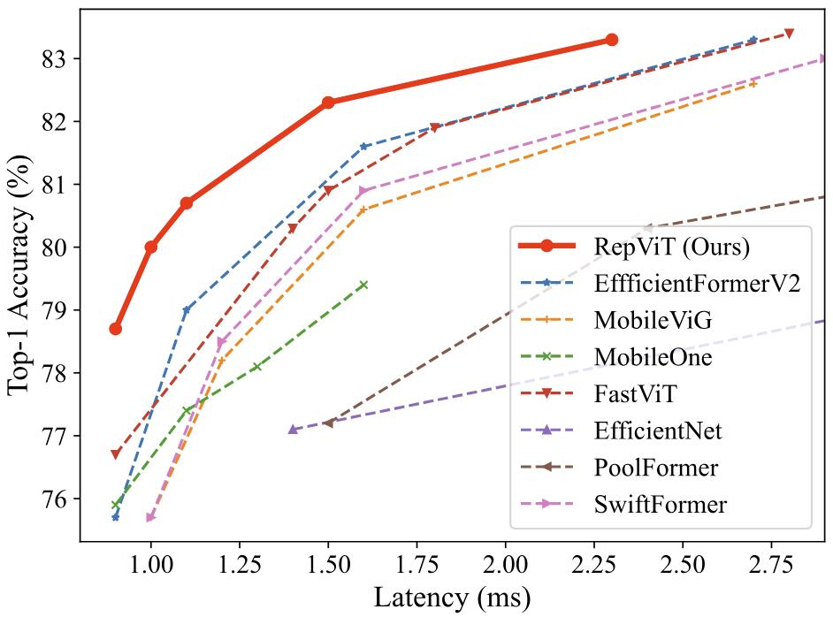
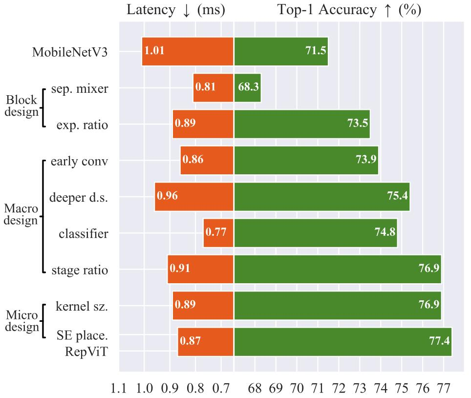
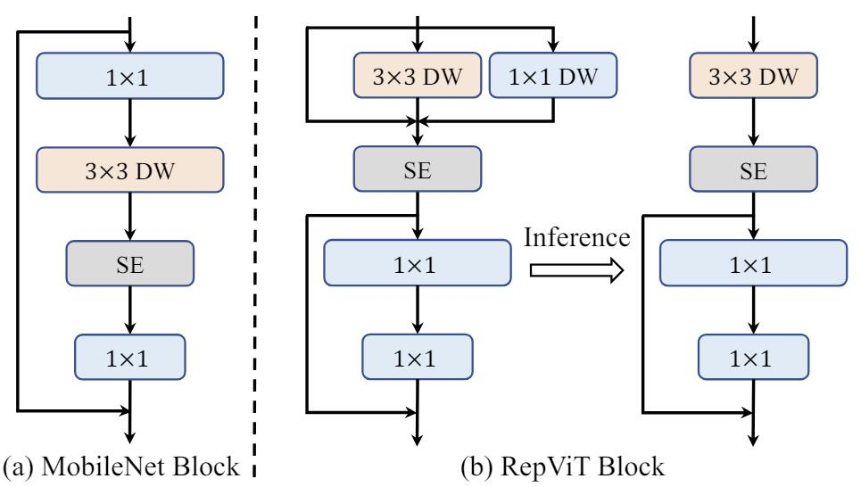
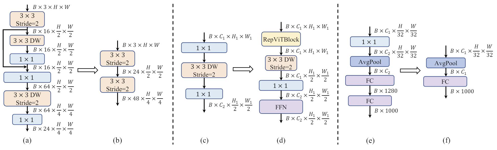
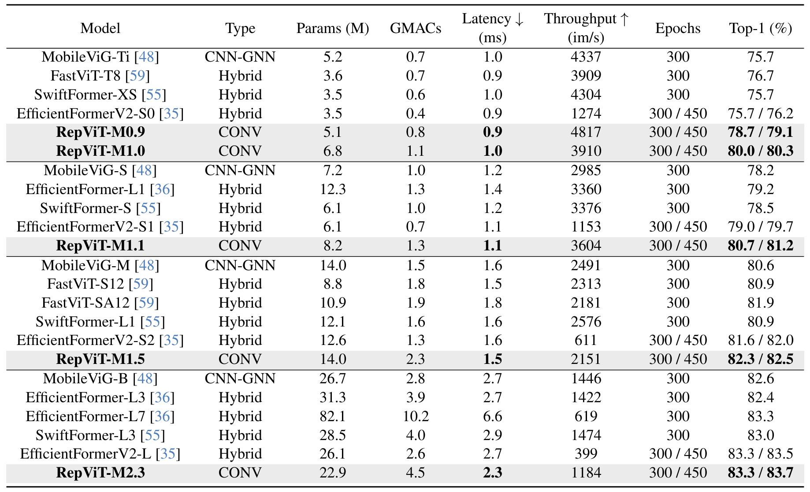
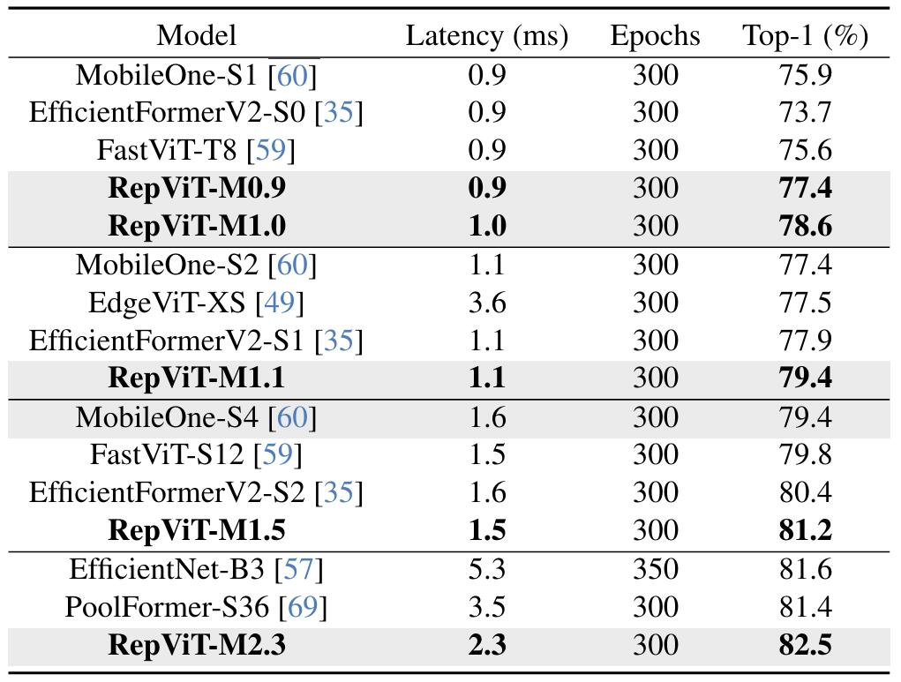

# [RepViT: Revisiting Mobile CNN From ViT Perspective](https://arxiv.org/abs/2307.09283)

## Abstract

最近，轻量级的 Vision Transformers（ViTs）与轻量级的卷积神经网络（CNN）相比，在资源受限的移动设备上展示了更优异的性能和更低的延迟。研究人员发现轻量级 ViT 和轻量级 CNN 之间存在许多结构上的联系。然而，它们在块结构、宏观和微观设计方面存在显著的架构差异，却尚未得到充分的研究。在这项研究中，我们从 ViT 的视角重新审视轻量级 CNN 的有效设计，并强化它们在移动设备上的应用前景。具体来说，我们通过集成轻量级 ViT 的有效架构设计，逐步增强标准轻量级 CNN（例如 MobileNetV3）的移动友好性。这最终得到了一系列新的纯轻量级 CNNs，即 RepViT。大量实验表明，RepViT 在各种视觉任务上优于现有的最先进轻量级 ViT，并且表现出良好的延迟。值得注意的是，在 ImageNet 数据集上，RepViT 在 iPhone 12 上实现了超过 80% 的 top-1 准确率，延迟仅为 1.0 毫秒，（据我们所知）这是轻量级模型首次取得如此成绩。此外，当 RepViT 遇到 SAM 时，我们的 RepViT-SAM 可以实现比先进的 MobileSAM 快近 10 倍的推理速度。代码和模型可以在以下网址获取：https://github.com/THU-MIG/RepViT.

**图 1**：RepViT 和其他网络之间延迟和准确率的比较。Top-1 准确率是在 ImageNet-1K 上测试的，而延迟是通过使用 iOS 16 的 iPhone 12 测量的。RepViT 在性能和延迟上取得最好的平衡。

## 1. Introduction

在计算机视觉领域，设计轻量级模型一直是实现卓越模型性能和降低计算成本的主要方向。这对于资源受限的移动设备尤其重要，因为它可以实现边缘视觉模型的部署。过去十年间，研究人员主要关注轻量级卷积神经网络 (CNN)，并取得了重大进展。许多有效的架构设计原则被提出，包括可分离卷积 [27]、inverted residual bottlenecks [53]、channel shuffling [44, 75] 和结构重新参数化 [13, 14] 等。这些设计原则促进了 MobileNets [26, 27, 53]、ShuffleNets [44, 75] 和 RepVGG [14] 等代表性模型的开发。

近年来，Vision Transformer (ViT) [18] 作为一种学习视觉表示的替代方案，已成为一种前景广阔的深度学习模型。它们在图像分类 [39, 63]、语义分割 [6, 66] 和目标检测 [4, 34] 等多种视觉任务上展示了比 CNN 更优异的性能。然而，为了提高性能而增加 ViT 参数数量的趋势会导致模型尺寸庞大、延迟较高 [11, 40]，从而使其不适用于资源受限的移动设备 [36, 46]。虽然可以直接减小 ViT 模型的尺寸以满足移动设备的限制，但它们的性能往往低于轻量级 CNN [5]。因此，研究人员开始探索 ViT 的轻量级设计，旨在实现超越轻量级 CNN 的性能。

许多有效的架构设计原则被提出，以提高 ViT 在移动设备上的计算效率 [5, 35, 46, 49]。一些方法提出了将卷积层与 ViT 相结合的创新架构，从而产生了混合网络 [5, 46]。此外，还引入了具有线性复杂度的新型自注意力操作 [47] 和尺寸一致的设计原则 [35, 36] 来提高效率。这些研究表明，轻量级 ViT [35, 47, 49] 可以实现更低的移动设备延迟，同时又能优于轻量级 CNN [26, 53, 60]，如图 1 所示。

尽管轻量级 ViT 取得了成功，由于硬件和计算库支持不足，它们仍然面临着实际挑战 [60]。此外，ViT 对高分辨率输入很敏感，导致延迟较高 [3]。相比之下，CNN 利用高度优化的卷积运算，其复杂度与输入成线性关系，这使得它们更适合在边缘设备上部署 [54, 73]。因此，设计高性能轻量级 CNN 变得势在必行，这促使我们必须仔细比较现有的轻量级 ViT 和 CNN。

轻量级 ViT 和轻量级 CNN 在结构上存在一定相似性。例如，它们都使用卷积模块来学习空间局部特征 [46, 47, 49, 61]。为了学习全局特征，轻量级 CNN 通常会扩大卷积核尺寸 [73]，而轻量级 ViT 则普遍采用多头自注意力模块 [46, 47]。然而，尽管存在这些结构上的联系，它们在块结构、宏观/微观设计方面仍然存在显著差异，这些差异尚未得到充分研究。例如，轻量级 ViT 通常采用 MetaFormer 块结构 [69]，而轻量级 CNN 则偏好反向残差瓶颈 [53]。这自然地引出了一个问题：轻量级 ViT 的架构设计能否提升轻量级 CNN 的性能？为了回答这个问题，本研究从 ViT 的角度重新审视了轻量级 CNN 的设计。我们的研究旨在缩小轻量级 CNN 和轻量级 ViT 之间的差距，并强调前者在移动设备部署方面比后者更具前景。

为了实现这一目标，参照 [41]，我们首先从一个标准的轻量级 CNN - MobileNetV3-L [26] 开始。我们通过整合轻量级 ViT 的高效架构设计 [35, 36, 38, 46]，逐步对其架构进行“现代化”改造。最终，我们为资源受限的移动设备获得了一个全新的轻量级 CNN 系列，即 RepViT，它完全由类似 ViT 的 MetaFormer 结构中的重新参数化卷积组成 [36, 69, 70]。作为纯轻量级 CNN，RepViT 在图像分类（ImageNet [12]）、目标检测和实例分割（COCO-2017 [37]）、语义分割（ADE20k [78]）等各种计算机视觉任务上，相比现有的最先进轻量级 ViT [35, 49] 展示了卓越的性能和效率。值得注意的是，RepViT 在 ImageNet 上达到了 80% 以上的 top-1 准确率，在 iPhone 12 上的延迟仅为 1.0 毫秒，据我们所知，这是轻量级模型首次取得如此成绩。我们最大的模型 RepViT-M2.3 在仅有 2.3 毫秒延迟的情况下获得了 83.7% 的准确率。将 RepViT 与 SAM [33] 结合后，我们的 RepViT-SAM 可以实现比最先进的 MobileSAM [71] 快近 10 倍的推理速度，同时在零样本迁移能力方面也明显更优。我们希望 RepViT 能够成为一个强有力的基线，并激励人们进一步研究边缘部署的轻量级模型。

## 2. Related Work

## 3. Methodology

本节我们将首先介绍一个标准的轻量级 CNN 模型，即 MobileNetV3-L。然后，通过融合轻量级 ViT 的架构设计，逐步从各种粒度对其进行改进。首先，我们在 3.1 节中引入用于测量移动设备延迟的指标，然后将训练方案与现有的轻量级 ViT 模型进行对齐。在一致的训练设置下，我们在 3.2 节探索最佳的模块设计。此外，我们在 3.3 节从宏观架构元素（即 stem、下采样层、分类器和整体阶段比率）方面进一步优化 MobileNetV3-L 在移动设备上的性能。然后，我们在 3.4 节通过逐层微观设计来调整轻量级 CNN 模型。图 2 展示了整个过程以及我们在每个步骤中取得的成果。最后，我们在 3.5 节获得了一个专为移动设备设计的新型纯轻量级 CNN 模型家族，即 RepViT。所有模型均在 ImageNet-1K 上进行训练和评估。

**图 2**：从各种粒度对 MobileNetV3-L 进行改进。我们主要考虑移动设备上的延迟和在 ImageNet-1K 的准确率。最终，我们获得一个新的纯轻量级的 CNN 系列，即 RepViT，它可以实现更低的延迟和更高的性能。注意这些结果是没有经过蒸馏而得到的。

### 3.1. Preliminary

**延迟指标**。以前的一些研究 [5, 57] 基于浮点运算 (FLOPs) 或模型大小等指标来优化模型的推理速度。然而，这些指标与移动应用程序中的实际延迟关联性并不强 [36]。因此，我们遵循 [35, 36, 46, 60] 的做法，将实际的设备延迟作为基准指标进行测量。这种策略可以提供更准确的性能评估，并在真实世界的移动设备上对不同模型进行公平的比较。实际上，我们使用 iPhone 12 作为测试设备，并像 [35, 36, 60] 一样使用 Core ML Tools [1] 作为编译器。此外，为了避免 Core ML Tools 不支持的功能，我们遵循 [36, 60] 的做法，在 MobileNetV3-L 模型中采用了 GeLU 激活函数。

我们测量 MobileNetV3-L 的延迟为 1.01 毫秒。

**对齐训练方案**。近期的轻量级 ViT 模型 [35, 36, 46, 49] 通常采用 DeiT [58] 的训练方案。具体来说，他们使用 AdamW 优化器 [42] 和余弦学习率调度器，从头开始训练模型 300 个 epochs，并使用 RegNetY-16GF [51] 作为教师模型进行知识蒸馏。此外，它们还采用了 Mixup [72]、自动增强 [8] 和随机擦除 [77] 进行数据增强。 标签平滑 [56] 也被用作正则化方案。为了进行公平的比较，我们将 MobileNetV3-L 的训练方案与现有的轻量级 ViT 模型进行对齐，只是暂时排除知识蒸馏。因此，MobileNetV3-L 获得了 71.5% 的 top-1 准确率。

我们现在将默认使用该训练方案。

### 3.2. Block design

**图 3**：模块设计。(a) 是一个 MobileNetV3 block，具有可选的 squeeze-and-excitation (SE) 层。(b) 是设计的 RepViT block，它通过结构化的重参数化技术将 token 混合器和通道混合器分离。SE 层在 RepViT block 中也是可选的。为了简化，归一化层和非线性已被省略。

**分离 token 混合器和通道混合器**。轻量级 ViT [35, 36, 47] 的模块结构包含了一个重要设计特征，即分离的 token 混合器和通道混合器 [70]。根据最近的研究 [69]，ViT 的有效性主要源于其通用的 token 混合器和通道混合器架构（即 MetaFormer 架构），而不是所装备的特定的 token 混合器。鉴于这一发现，我们旨在通过分离 MobileNetV3-L 中的 token 混合器和通道混合器来模拟现有的轻量级 ViT。

具体来说，如图 3.(a) 所示，原始的 MobileNetV3 模块采用了一个 $1\times1$ 的扩张卷积和一个 $1\times1$ 的投影层，用于启用通道之间的交互（即通道混合器）。在 1x1 扩张卷积之后加入了一个 $3\times3$ 的深度可分离 (DW) 卷积，用于融合空间信息（即 token 混合器）。这种设计使 token 混合器和通道混合器耦合在一起。为了将它们分开，我们首先将 DW 卷积上移。可选的 SE 层也向上移动，放置在 DW 之后，因为它依赖于空间信息交互。因此，我们可以成功地将 MobileNetV3 模块中的 token 混合器和通道混合器分离。我们进一步为 DW 层采用了一种被广泛使用的结构化重新参数化技术 [7, 14]，以在训练过程中增强模型学习。得益于结构化重新参数化技术，我们可以消除推理过程中与跳跃连接相关的计算和内存成本，这对于移动设备尤其有利。我们将这种模块命名为 RepViT 模块（图 3.(b)），它将 MobileNetV3-L 的延迟降低到 0.81 毫秒，同时伴随着暂时性的性能下降到 68.3%。

**降低扩展比并增加宽度**。在原始的 ViT 中，通道混合器中的扩展比通常设置为 4，这使得前馈网络 (FFN) 模块的隐藏维度比输入维度宽 4 倍。因此，它消耗了大量的计算资源，从而在整体推理时间占了很大比重 [76]。为了缓解这个瓶颈，最近的一些工作 [21, 30] 采用了一个更窄的 FFN。例如，LV-ViT [30] 在 FFN 中采用 3 的扩展比。LeViT [21] 将扩展比设置为 2。此外，杨等人 [68] 指出 FFN 中存在大量的通道冗余。因此，使用更小的扩展比是合理的。

在 MobileNetV3-L 中，扩展比的范围为 2.3 到 6，最后两个通道较多的阶段集中在 6。对于我们的 RepViT 模块，我们遵循 [21, 30, 38] 的做法，在所有阶段的通道混合器中将扩展比设置为 2。这导致延迟降低到 0.65 毫秒。通过较小的扩展比，我们可以增加网络宽度来弥补巨大的参数减少。我们每个阶段的通道数量翻倍，最终每个阶段分别为 48、96、192 和 384 个通道。这些修改可以使 top-1 准确率提高到 73.5%，延迟为 0.89 毫秒。

需要注意的是，通过直接调整原始 MobileNetV3 模块的扩展比和网络宽度，我们在类似 0.91 毫秒的延迟下获得了较低的性能，top-1 准确率为 73.0%。因此，对于模块设计，我们默认情况下采用新扩展比和网络宽度的 RepViT 模块。

### 3.3. Macro design

**图 4**：宏观设计。(a) 和 (b)，(c) 和 (d)，(e) 和 (f) 分别代表 stem，下采样层和分类器的设计。RepViT 有四个阶段，分别有 $\frac{H}{4} \times \frac{W}{4}, \frac{H}{8} \times \frac{W}{8}, \frac{H}{16} \times \frac{W}{16}, \frac{H}{32} \times \frac{W}{32}$ 的分辨率，其中 $H$ 和 $W$ 是输入图像的宽和高。 $C$ 是通道维度， $B$ 是批量大小。归一化层和非线性被省略。

这部分我们从网络的头部到尾部，针对移动设备的宏架构进行特定优化的探索。

**茎部 (stem) 的早期卷积**。ViT 模型通常使用分割成块 (patchify) 操作作为 stem，将输入图像分割成非重叠的块 [18]。这种简单的 stem 对应于具有较大内核大小（例如，内核大小 = 16）和大步长（例如，步长 = 16）的非重叠卷积。分层 ViT 模型 [39, 63] 采用相同的 patchify 操作，但采用较小的块大小 (4)。然而，最近的研究 [65] 表明，这种 patchify 操作很容易导致 ViT 模型的优化能力低下且对训练方案敏感。为了缓解这些问题，他们建议使用少量堆叠的步长为 2 的 $3\times3$ 卷积作为 stem 的替代方案，称为早期卷积，可以改善优化稳定性和性能，因此被轻量级 ViT 模型 [35, 36] 广泛采用。

相比之下，MobileNetV3-L 采用了一个复杂的茎部，如图 4.(a) 所示，它包含一个 $3\times3$ 卷积、一个深度可分离卷积和一个反向瓶颈结构。由于 stem 模块以最高分辨率处理输入图像，因此复杂的架构会在移动设备上导致严重的延迟瓶颈。因此，作为权衡，MobileNetV3-L 将初始滤波器数量减少到 16，这反过来又限制了 stem 的表示能力。为了解决这些问题，遵循 [35, 36, 38, 65] 的做法，我们采用早期卷积 [65] 的方式，简单地使用两个步长为 2 的 $3\times3$ 卷积作为 stem。如图 4.(b) 所示，第一个卷积的滤波器数量设置为 24，第二个设置为 48。整体延迟降低到 0.86 毫秒。同时，top-1 准确率提高到 73.9%。

我们现在将使用早期卷积作为 stem。

**更深的下采样层**。在 ViT 模型中，空间下采样通常通过一个分离块合并层来实现。正如 [41] 所证明的，这种基于分离的下采样层有利于增加网络深度并减轻因分辨率降低导致的信息丢失。因此，EfficientViT [38] 采用夹层布局来加深下采样层，实现高效有效的下采样。相比之下，MobileNetV3-L 仅通过步长为 2 的深度可分离卷积的反向瓶颈块来实现下采样，如图 4.(c) 所示。这种设计可能缺乏足够的网络深度，从而导致信息丢失并对模型性能产生负面影响。因此，为了实现一个分离且更深的下采样层，我们首先分别使用步长为 2 的深度可分离卷积和 $1 \times 1$ 的点状卷积来执行空间下采样和调节通道维度，如图 4.(d) 所示。此外，我们还在前面添加一个 RepViT 块来进一步加深下采样层。$1 \times 1$ 卷积之后放置了一个前馈网络 (FFN) 模块，以记住更多的潜在信息。结果表明，这种更深的下采样层使 top-1 准确率达到 75.4%，延迟为 0.96 毫秒。

我们现在将使用更深的下采样层。

**简单分类器**。在轻量级 ViT 模型 [21, 36, 46] 中，分类器通常由一个全局平均池化层和一个线性层组成。这种简单的分类器对延迟友好，尤其适用于移动设备。相比之下，MobileNetV3-L 采用了一个复杂的分类器，如图 4.(e) 所示，它包含一个额外的 $1 \times 1$ 卷积和一个额外的线性层将特征扩展到更高维的空间 [9]。这种设计对于 MobileNetV3-L 生成丰富的预测特征至关重要 [26] ，尤其是在最终阶段的输出通道较少的情况下。然而，这反过来又会增加移动设备的延迟负担。考虑到经过 3.2 节的模块设计后，最终阶段现在具有更多通道，因此我们将其替换为一个简单的分类器，即一个全局平均池化层和一个线性层，如图 4.(f) 所示。此步骤导致精度下降 0.6%，但使延迟降低到 0.77 毫秒。

我们现在将使用简单的分类器。

**整体阶段比率**。阶段比例代表不同阶段的块数比率，从而指示了计算在各个阶段的分布。以前的工作 [50, 51] 表明，在第三阶段使用更多的块可以获得更好的精度和速度平衡。因此，现有的轻量级 ViT 模型通常在这个阶段应用更多的块。例如，EfficientFormer-L2 [36] 采用 $1:1:3:1.5$ 的阶段比例。同时，Conv2Former [25] 表明更激进的阶段比例和更深的布局对小型模型效果更好。因此，他们分别为 Conv2Former-T 和 Conv2Former-S 采用了 $1:1:4:1$ 和 $1:1:8:1$ 的阶段比例。在这里，我们为网络采用 $1:1:7:1$ 的阶段比例。然后我们将网络深度增加到 $2:2:14:2$ ，实现更深的布局。这一步将 top-1 准确率提高到 76.9%，延迟为 0.91 ms。

我们将使用这个阶段比例。

### 3.4. Micro design

本节我们将重点关注轻量级 CNN 的微架构，包括内核大小选择和 Squeeze-and-Excitation (SE) 层放置。

**内核大小选择**。CNN 的性能和延迟往往受到卷积核大小的影响。例如，为了捕获像 MHSA 这样的长距离依赖关系，ConvNeXt [41] 采用了大内核卷积，展示了性能提升。类似地，RepLKNet [15] 展示了一种强大的范式，在 CNN 中使用超大卷积核。然而，由于计算复杂度和内存访问成本，大内核卷积对移动设备并不友好。此外，与 $3 \times 3$ 卷积相比，更大的卷积核通常不会被编译器和计算库高度优化 [14]。MobileNetV3-L 主要使用 3 × 3 卷积，在某些块中使用少量 $5 \times 5$ 卷积。为了确保在移动设备上的推理效率，我们在所有模块中优先使用简单的 $3 \times 3$ 卷积。这种替换可以在保持 76.9% 的 top-1 准确率的同时，将延迟降低到 0.89 ms。

我们现在将使用 3 × 3 卷积。

**SE 层放置**。自注意力模块与卷积相比的一个优势在于能够根据输入调整权重，即所谓的“数据驱动属性” [29, 64]。作为通道注意模块，SE 层 [28] 可以补偿卷积缺乏数据驱动属性的限制，带来更好的性能 [73]。MobileNetV3-L 在某些块中加入了 SE 层，主要集中在后两个阶段。然而，正如 [52] 所展示的，具有低分辨率特征图的阶段比具有高分辨率特征图的阶段获得的精度收益更小。同时，SE 层在带来性能提升的同时，也引入了不可忽略的计算成本。因此，我们设计了一种策略，以跨越块 (cross-block) 的方式利用 SE 层，即在每个阶段的第 1、3、5 个块等处采用 SE 层，以最小化延迟增加的情况下最大化精度收益。这一步使 top-1 准确率达到 77.4%，延迟为 0.87 ms。

我们现在将使用这种 cross-block SE 层放置方式。这带来了我们最终的模型，即 RepViT。

### 3.5. Network architecture

遵循 [36, 46] 的方法，我们开发了多种 RepViT 变体，包括 RepViT-M0.9/M1.0/M1.1/M1.5/M2.3。后缀“-MX” 表示对应模型在移动设备（即 iPhone 12，iOS 16）上的延迟为 X ms。变体的区别在于每个阶段内的通道数和块数。有关详细信息，请参阅补充材料。

## 4. Experiments

**表 1**：ImageNet-1K 上的分类性能。遵循 [21, 38]，吞吐量是在一块 Nvidia RTX3090 上测试的，最大批处理大小为适合内存的两倍。

**表 2**：在 ImageNet-1K 上没用蒸馏的结果。

## 5. Conclusion

本论文通过将轻量级 ViT 的架构设计融入轻量级 CNN 的高效设计中，对轻量级 CNN 的设计进行了重新审视。由此诞生了 RepViT，这是一个适用于资源受限移动设备的全新轻量级 CNN 系列。RepViT 在各种视觉任务上优于现有的最先进轻量级 ViT 和 CNN，展现了卓越的性能和延迟表现，彰显了纯轻量级 CNN 在移动设备上的应用前景。我们希望 RepViT 能够成为一个强有力的基准，并激励人们进一步研究轻量级模型。

