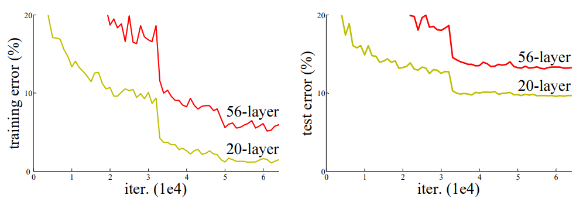
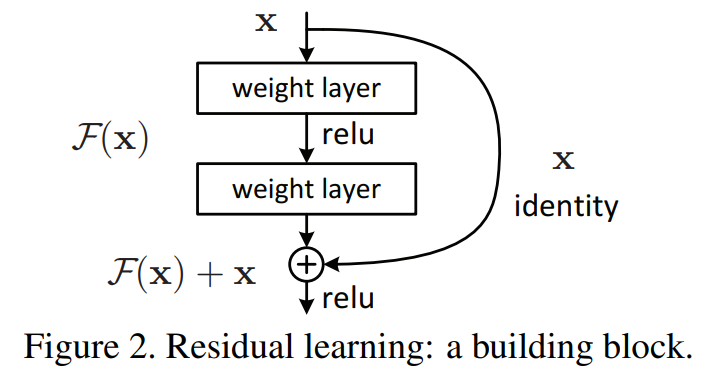

# Deep Residual Learning for Image Recognition

## Abstract

更深的神经网络更难训练。我们提出一个残差学习框架，使得训练比以前的网络深得多的网络容易。我们明确地将层重新定义为学习关于输入的残差，而不是学习无参照的函数。我们提供了全面的实验性证据表明这些残差网络更加容易优化，并且可以从大幅增加的深度中提升精度。在 ImageNet 数据集上，我们评估深度高达 152 层的残差网络——比 VGG 网络深 8 倍，但仍然具有更低的复杂性。一个残差网络的集成 (ensemble) 在 ImageNet 测试集上取得了 3.57% 的错误率。这个结果在 ILSVRC 2015 分类任务中获得了第一名。我们还用 100 层和 1000 层在 CIFAR-10 上进行了分析。

表征的深度对许多视觉识别任务至关重要。仅仅由于我们的极其深的表征，我们在 COCO 目标检测数据集上获得了 28% 的相对提升。深度残差网络是我们在 ILSVRC & COCO 2015 竞赛中的提交的基线，在那我们还赢得了 ImageNet 检测、ImageNet 定位、COCO 检测和 COCO 分割的第一名。

## 1. Introduction

深度卷积神经网络为图像分类带来了一系列的突破。深度网络以端到端的多层方式自然地集成了低/中/高级特征和分类器，而特征的 "级别" 可以通过堆叠层的数量 (深度) 来丰富。最近的证据表明网络的深度是至关重要的，而在具有挑战性的 ImageNet 数据集位于前列的结果都利用了 "非常深" 的模型，深度从 16 到 30。许多其他重要的视觉识别任务也从非常深的模型中获益良多。

受深度的重要性的驱使，一个问题出现了：学习更好的网络就像堆叠更多的层一样容易吗？回答这个问题的一个障碍是臭名昭著的梯度消失/爆炸问题，它从一开始就阻碍了收敛。然而，这个问题很大程度上通过规范化后的初始化和中间的规范化层得到了解决，它使得具有数十层的网络开始收敛于使用反向传播的随机梯度下降 (SGD)。

当更深的网络开始收敛时，一个退化问题就暴露出来了：随着网络的深度的增加，准确性达到饱和 (可能并不奇怪)  然后迅速退化。令人意外的是，这种退化并不是过拟合造成的，在适当深度的模型上添加更多的层会导致更高的训练误差，如 [11, 42] 中所报道的，并通过我们的实验得到验证。图 1 展示了一个典型的例子。

图 1：使用 20 层和 50 层 "普通" 网络在 CIFAR-10 上的训练错误率 (左) 和 测试错误率 (右)。更深的网络有更高的训练错误率和测试错误率。ImageNet 上同样的现象在图 4 中展示。

(训练精度的) 退化表明并非所有的系统都同样容易优化。让我们考虑一个较浅的架构以及在它基础上添加更多层的较深的对应架构。通过构造更深的模型，存在一种解决方案：添加的层是恒等映射，而其他的层是从学习后的较浅的模型拷贝而来。这种构造方法的存在表明，深度模型应该不会产生比浅层模型更高的训练误差。但实验表明，我们现有的 solvers 无法找到比这种构建方案更好的解决方案 (或无法在可行时间内做到)。

在本论文中，我们通过引入一种深度残差学习框架来解决退化问题。与其希望每几个堆叠的层直接拟合一个期望的底层映射，不如显示地让这些层拟合一个残差映射。形式上，将期望的底层映射表示为 $\mathcal{H}(\bold{x})$，我们让堆叠的非线性层拟合另外一个映射 $\mathcal{F}(\bold{x}) := \mathcal{H}(\bold{x}) - \bold{x}$。原来的映射被改写成 $\mathcal{F}(\bold{x}) + \bold{x}$。我们假设优化残差映射比优化原始的更容易。最极端的情况是，如果一个恒等映射是最优的，那么将残差推向 0 比通过一堆非线性层来拟合恒等映射更容易。

表达式 $\mathcal{F}(\bold{x}) + \bold{x}$ 可以使用 "shortcut connections" (图 2) 的前馈神经网络来实现。Shortcut connections 是指跳过一层或多层的连接。在我们的方法中，shortcut connections 简单地执行恒等映射，它们的输出被添加到堆叠的层的输出上 (图 2)。恒等 shortcut connections 既不增加参数，也不增加计算复杂性。整个网络仍然可以通过 SGD 使用反向传播进行端到端的训练，并且可以很容易地使用常用的库 (如 Caffe) 实现，无需修改 solvers。

图 2：残差学习：一个构建块

我们在 ImageNet 上进行了全面的实验，以展示退化问题并评估我们的方法。我们的研究表明：1) 我们的非常深的残差网络容易优化，但对应的 "普通" 网络 (简单地堆叠层) 在深度增加时表现出更高的训练误差；2) 我们的深度残差网络可以很容易地从大幅度增加的深度中获得精度提升，产生比之前的网络好很多的结果。

在 CIFAR-10 数据集上也显示了类似的现象，这表明我们的方法的优化的困难和效果并不仅仅是与特定的数据集有关系。我们在这个数据集上成功训练了 100 层的模型，并探索了 1000 层以上的模型。

在 ImageNet 分类数据集上，我们通过非常深的残差网络获得了极好的结果。我们的 152 层的残差网络是 ImageNet 上出现过的最深的网络，但复杂度比 VGG 网络更低。我们的集成 (ensemble) 在 ImageNet 测试集上获得了 3.57% 的 top-5 错误率，并赢得了 ILSVRC 2015 分类竞赛的第一名。非常深的表征在其他识别任务上也有极好的泛化性能，并让我们在 ILSVRC & COCO 2015 竞赛中的 ImageNet 检测、ImageNet 定位、COCO 检测和 COCO 分割取得了第一名。这一强有力的证据表明，残差学习的原则是通用的，我们希望它能适用于其他视觉和非视觉的问题。

## 2. Related Work

**Residual Representations.** 在图像识别中，[VLAD](https://hal.inria.fr/inria-00633013/document) 是一个与字典相关的残差向量进行编码的表示，而 [Fisher Vector](https://citeseerx.ist.psu.edu/viewdoc/download?doi=10.1.1.71.7388&rep=rep1&type=pdf) 可以表示为 VLAD 的概率版本。两者都是图像检索和分类的强有力的浅层表示。对于矢量量化，编码残差向量被证明比编码原始向量更加有效。

在低级的视觉和计算机图形学中，为了求解偏微分方程 (PDEs)，广泛使用的多重网格法将系统重新表示为多尺度的子问题，其中每个子问题负责粗尺度和细尺度之间的残差解。多重网格的另外一种选择是 hierarchical basis preconditioning，它依赖于表示两个尺度之间的残差向量的变量。已有研究表明，这些 solvers 比那些不知道残差本质的标准 solvers 收敛快得多。这些方法表明，好的 reformulation 和 preconditioning 能简化优化。

**Shortcut Connections.** Shortcut connections 的实践和理论已经被研究了很长时间。一个训练多层感知机 (MLPs) 的早期实践是添加一个线性层连接网络的输入到输出。在 [44, 24]，一些中间层直接连接到辅助分类器，用于处理梯度消失/爆炸。论文 [39, 38, 31, 47] 提出通过 shortcut connections 实现集中层响应、梯度和传播误差。在 [44]，一个 "inception" 层由一个 shortcut 分支和几个更深的分支组成。

与我们的工作的同一时期，"highway networks" 提出了有门函数的 shortcut connections。这些门是依赖于数据并且有参数，相反，我们的恒等 shortcuts 则没有参数。当门控 shortcut "关闭" (接近 0)，highway networks 中的层代表非残差函数。相反，我们的 formulation 则总是学习残差函数；我们的恒等 shortcuts 永远不会关闭，所有的信息总是被通过，还有一些额外的要学习的残差函数。另外，highway networks 没有展示随着深度的极大提升 (例如超过 100 层) 获得精度的提升。

## 3. Deep Residual Learning

### 3.1. Residual Learning

让我们把 $\mathcal{H}(\bold{x})$ 看作是由几个堆叠的层 (不一定是整个网络) 拟合的底层映射，$\bold{x}$ 表示这些层的第一层的输入。如果假设多个非线性层能渐进地逼近复杂的函数，那么就等价于假设它们可以渐进地逼近残差函数，即 $\mathcal{H}(\bold{x}) - \bold{x}$ (假设输入和输出是相同维度的)。因此，与其期望堆叠的层逼近 $\mathcal{H}(\bold{x})$，不如显示地让这些层逼近一个残差函数 $\mathcal{F}(\bold{x}) := \mathcal{H}(\bold{x}) - \bold{x}$。因此，原始函数就变成了 $\mathcal{F}(\bold{x}) + \bold{x}$。虽然这两种形式都应该能够渐进地逼近期望函数 (如假设的那样)，但学习的难易程度可能不同。

这个 reformulation 是由关于退化问题的反直觉现象 (图 1 左) 所激励的。正如我们在引言中所讨论的，如果添加的层可以被构建为恒等映射，一个更深的模型的训练误差应该不大于它的对应的浅层模型。退化问题表明 solvers 在用多个非线性层逼近恒等映射时可能有困难。使用残差学习 reformulation，如果恒等映射是最优的，solvers 可以简单地将多个非线性层的权重趋于零来逼近恒等映射。

在实际情况中，恒等映射不太可能是最优的，但我们的 reformulation 可能有助于 precondition 问题。如果最优的函数是接近于恒等映射而不是零映射，那么对于 solvers 来说，找到一个关于恒等映射的扰动比学习一个新函数更容易。我们通过实验 (图 7) 表明学习到的残差函数整体上响应较小，这表明恒等映射提供了合理的 preconditioning。

### 3.2. Identity Mapping by Shortcuts

我们每隔几层采用残差学习。一个构造块如图 2 所示。形式上，在本论文中我们考虑将一个构造块定义为：
$$
\bold{y} = \mathcal{F}(\bold{x}, \{W_i\}) + \bold{x} \tag{1}
$$
这里的 $\bold{x}$ 和 $\bold{y}$ 是被考虑的层的输入和输出向量。函数 $\mathcal{F}(\bold{x}, W_i)$ 表示要学习的残差映射。对于图 2 中的两层的示例，$\mathcal{F} = W_2\sigma(W_1\bold{x})$，其中 $\sigma$ 表示 ReLU，并且为了简化表示，偏置被省略了。运算 $\mathcal{F} + \bold{x}$ 是通过 shortcut connection 和元素级别的加法完成的。我们在加法后使用了第二次非线性 (例如，$\sigma(\bold{y})$，见图 2)。

等式 (1) 中的 shortcut connections 既不引入额外的参数，也不引入计算复杂度。这不仅在实践中很有吸引力，而且在我们比较普通网络和残差网络时也很重要。我们可以公平地比较同时具有相同数量的参数、深度、宽度和计算成本 (除了可忽略的元素级加法) 的普通网络和残差网络。

等式 (1) 中的 $\bold{x}$ 和 $\mathcal{F}$ 的维度必须相等。如果不相等 (例如，改变输入/输出通道)，我们可以对 shortcut connections 进行一个线性投影 $W_s$ 来匹配维度：
$$
\bold{y} = \mathcal{F}(\bold{x}, \{W_i\}) + W_s \bold{x} \tag{2}
$$
我们也可以在等式 (1) 中使用方阵 $W_s$ 。但我们将通过实验证明，恒等映射对于解决退化问题是足够的，并且是经济的，因此 $W_s$ 只在匹配维度时使用。

残差函数 $\mathcal{F}$ 的形式是灵活的。在本论文中的实验涉及到的一个函数 $\mathcal{F}$，它有两层或三层，也可以有更多层。但如果 $\mathcal{F}$ 只有一层，等式 (1) 类似于线性层：$\bold{y} = W_1 \bold{x} + \bold{x}$，我们没有观察到它的优点。

我们还注意到，尽管为了简单起见，上述符号是关于全连接层的，但它们适用于卷积层。函数 $\mathcal{F}(\bold{x}, \{W_i\})$ 可以表示多个卷积层。元素级加法在两个特征映射上，逐个通道执行。

### 3.3. Network Architectures

我们测试了各种普通/残差网络，并观察到一致的现象。为了提供实例供讨论，我们在下面描述了两个 ImageNet的模型。

**普通网络。**我们的普通基线 (图 3 中间) 主要受到 VGG 网络 (图 3 左) 的思想启发。卷积层大多有 $3 \times 3$ 的滤波器，并遵循两个设计原则：(i) 对于相同输出 feature map 大小，层有相同数量的 filters；(ii) 如果 feature map 的大小减半，filters 的数量增加一倍，以维持每层的时间复杂度。我们直接通过步幅为 2 的卷积层进行下采样。网络以一个全局平均汇聚层和一个 1000 路带有 softmax 的全连接层结束。图 3 (中间) 中有权重的层的总数是 34。

值得注意的是，与 VGG 网络 (图 3 左) 相比，我们的模型 filters 更少，复杂性更低。我们的 34 层基线模型有 36 亿 FLOPs (乘-加)

**ps：** FLOPs——浮点运算次数 (Floating Point Operations)；FLOPS——每秒浮点运算次数 (Floating Point Operations Per Second)

**残差网络。** 在上述的普通网络的基础上，我们插入 shortcut connections (图 3 右)，将网络转化为对应的残差版本。当输入和输出是相同的维度时，恒等 shortcut (等式 (1)) 可以直接使用 (图 3 中的实线 shortcuts)。当维度增加时 (图 3 中的虚线 shortcuts)，我们考虑两种选择：(A) shortcut 通过额外的零填充来增加维度，仍然进行恒等映射；(B) 等式(2) 中的投影被用于匹配维度 (通过 $1 \times 1$ 的卷积完成)。对于这两个选项，当 shortcuts 跨越两种尺寸的 feature maps 时，它们的步幅都为 2。

### 3.4. Implementation

我们在 ImageNet 的实现遵循 [21, 41] 中的实验。图像被缩放到短边为 [256, 480] 中的随机采样，用于缩放增强。从图像或者它的水平翻转中随机裁剪一个 $224 \times 224$，并减去每个像素的平均值 (训练集的RGB平均值)。使用 [21] 中标准的颜色增强。我们按照 [16] 在每个卷积之后，激活之前采样批标准化 (BN)。我们按照 [13] 初始化权重，并从头开始训练普通/残差网络。我们使用批量大小为 256 的 SGD。学习率从 0 开始，当误差稳定时将学习率除以 10，模型训练 $60 \times 10^4$ 次迭代 (一个 batch 算一次 iteration)。我们使用权重衰减为 0.0001，动量为 0.9。我们没有使用 dropout，遵循 [16] 中的实验。

测试时，为了比较研究，我们采用标准的 10-crop 测试 (四个角落块和中心块以及对应的翻转)。为了最佳结果，我们采用了 [41, 13] 中的全卷积形式，并对多个尺度上 (图像被调整大小到短边为 {224, 256, 384, 480, 640}) 的分数取平均。

## 4. Experiments

### 4.1. ImageNet Classification

我们在 1000 类的 ImageNet 2012 分类数据集上评估我们的方法。在 120 万训练图像上对模型进行训练，在 50 k 验证图像上对模型进行评估。我们还获得了 100k 测试图像的最终结果，由测试服务报告。

**普通网络。**
