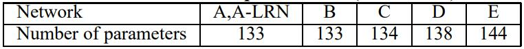
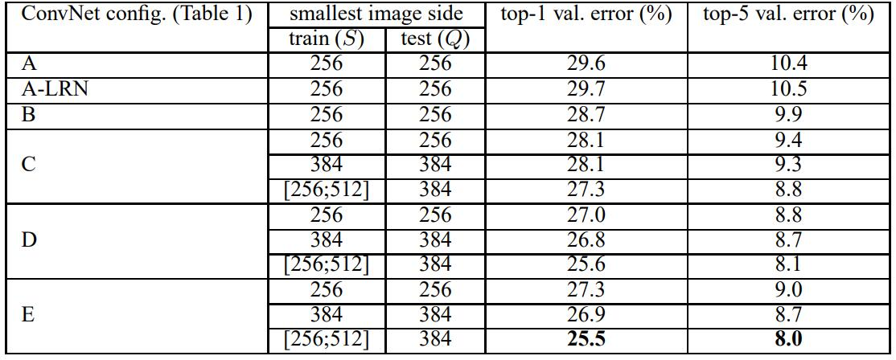

# [Very Deep Convolutional Networks for Large-Scale Image Recognition](https://arxiv.org/abs/1409.1556)

## ABSTRACT

本文中，我们研究了卷积网络深度对其在大规模图像识别任务中的准确性的影响。我们的主要贡献是通过使用一种非常小 $(3 \times 3)$ 的卷积滤波器的架构对网络深度的增加进行了全面评估，结果显示通过将深度提升到 16-19 个权重层，可以实现对现有技术配置的显著改进。这些发现是我们在 2014 年 ImageNet 挑战赛提交的基础，在该比赛中，我们的团队分别在定位和分类赛道上获得了第一名和第二名。我们还展示了我们的表征能很好地推广到其他数据集，在这些数据集上我们也取得了最先进的结果。我们已经公开发布了我们的两个性能最佳的卷积网络模型，以促进计算机视觉领域中对深度视觉表示的进一步研究。

## 1 INTRODUCTION

卷积网络 (ConvNets) 最近在大规模图像和视频识别中获得了巨大的成功 (例如 Krizhevsky et al., 2012; Zeiler & Fergus, 2013; Sermanet et al., 2014; Simonyan & Zisserman, 2014 )，这主要得益于大型公共图像仓库 (如 ImageNet (Deng et al., 2009)) 和高性能计算系统 (如 GPU 或大型分布式集群 (Dean et al., 2012)) 的支持。特别是，ImageNet Large-Scale Visual Recognition Challenge（ILSVRC）在深度视觉识别架构的发展中起到了重要作用，它成为了几代大规模图像分类系统的测试平台，从高维浅层特征编码（ILSVRC-2011的获胜者）到深度卷积网络（ILSVRC-2012的获胜者）。

随着卷积网络在计算机视觉领域变得越来越普及，有许多尝试去改进 Krizhevsky 等(2012) 的原始架构 (AlexNet) 以获得更高的准确率。例如，ILSVRC2013 中表现最好的提交 (Zeiler & Fergus, 2013; Sermanet et al., 2014) 使用了更小的感受野窗口和更小的第一卷积层步长。改进网络的另一方面是对整个图像和多个尺度进行密集的训练和测试 (Sermanet et al., 2014; Howard, 2014)。在本文中，我们关注的是卷积网络架构设计的另一个重要方面——它的深度。为此，我们固定了架构的其他参数，通过添加更多的卷积层稳步增加网络的深度，这要归功于在所有层中使用非常小 $( 3 \times 3 )$ 的卷积滤波器，使其成为可能。

因此，我们设计出了明显更准确的卷积网络架构，它们不仅在 ILSVRC 分类和定位任务上取得了目前最佳的准确性，而且也适用于其他图像识别数据集，甚至在作为相对简单的管道 (例如，通过线性 SVM 分类深度特征而不微调) 的一部分时，也能达到令人满意的性能。我们已经发布了我们的两个性能最佳模型，以促进进一步的研究。

文章的其余部分组织如下。在第 2 节中，我们描述了我们的卷积网络配置。然后在第 3 节中介绍了图像分类训练和评估的详细信息，并在第 4 节中在 ILSVRC 分类任务上比较了这些配置。第 5 节总结了本文。为了完整起见，我们还在附录 A 中描述和评估了我们的 ILSVRC-2014 对象定位系统，并在附录 B 中讨论了非常深层特征对其他数据集的泛化能力。最后，附录 C 包含了主要论文修订的列表。

## 2 CONVNET CONFIGURATIONS

为了在公平的设置下测量增加的卷积网络深度带来的改进，我们的所有卷积网络层配置都遵循相同的设计原则，这些原则受 Ciresan et al. (2011); Krizhevsky et al. (2012) 的启发。在这一节中，我们首先描述了我们的卷积网络配置的通用布局 (2.1节)，然后详细描述了评估中使用的特定配置 (2.2 节)。我们的设计选择在 2.3 节中进行了讨论和与现有技术的比较。

### 2.1 ARCHITECTURE

在训练期间，我们卷积网络的输入是一个固定大小的 $224 \times 224$ RGB 图像。我们所做的唯一预处理是从每个像素中减去训练集上计算得出的平均 RGB 值。图像通过一组卷积层的堆叠，其中我们使用滤波器具有非常小的感受野：$3 \times 3$ (这是捕捉左/右，上/下，中心概念的最小大小)。在其中一个配置中，我们还使用了 $1 \times 1$ 卷积滤波器，可以看作是输入通道的一个线性变换 (后面跟着非线性)。卷积步长固定为 1 像素；卷积层输入的空间填充使得卷积后空间分辨率得以保持，即对于 $3 \times 3$ 卷积层，填充为 1 像素。空间池化是通过 5 个最大池化层完成的，它们跟在一些卷积层后 (并非所有的卷积层后面都有最大池化)。最大池化在 $2 \times 2$ 像素窗口上执行，步长为 2。

一组卷积层的堆叠 (在不同架构中深度不同) 后面跟着 3 个全连接 (FC) 层：前 2 个都有 4096 个通道，第 3 个执行 1000 类的 ILSVRC 分类，因此包含 1000 个通道(每个类一个)。最后一层是 softmax 层。完全连接层的配置在所有网络中都是相同的。

所有隐藏层都配备了整流 (ReLU) 非线性。我们注意到，除了一个之外，我们的网络都不包含局部响应标准化 (LRN) 归一化：如第 4 节所示，这种归一化在 ILSVRC 数据集上并没有提升性能，但会增加内存消耗和计算时间。如果适用，LRN 层的参数是(AlexNet) 中的参数。

### 2.2 CONFIGURATIONS

本文评估的卷积网络配置如表 1 所示，每列一个。下面我们将按其名称 (A-E) 引用网络。所有配置都遵循第 2.1 节中介绍的通用设计，只在深度上有所不同：从网络 A 中的 11 个权重层 (8 个卷积层和 3 个全连接层) 到网络 E 中的 19 个权重层 (16 个卷积层和 3 个全连接层)。卷积层的宽度 (通道数) 相当小，从第一层的 64 开始，然后在每次最大池化层之后以 2 的因子增加，直到达到 512。

表 2 报告了每个配置的参数数量。尽管深度很大，但我们网络中的权重数量不大于宽度更大的卷积层和感受野的更浅层网络中的权重数量 (Sermanet等人,2014) 中的144M 个权重)。

**表 1**：ConvNet 配置 (以列显示)。从左 (A) 到右 (E)，配置的深度随着层的增加而增加 (添加的层用粗体显示)。卷积层参数表示为 "conv\<感受野大小\> -\<通道数\>"。

**表 2**：参数数量（百万级别）

### 2.3 DISCUSSION

我们的卷积网络配置与 ILSVRC-2012 比赛 (Krizhevsky 等，2012年) 和 ILSVRC-2013 比赛 (Zeiler 和 Fergus，2013年; Sermanet 等，2014年) 中表现最好的提交的配置非常不同。我们没有在第一层卷积层中使用相对较大的感受野 (例如，在 (Krizhevsky 等，2012年) 中是 $11 \times 11$ 且步长为 4，或在 (Zeiler 和 Fergus，2013年; Sermanet 等，2014年) 中是 $7 \times 7$ 且步长为 2)，而是在整个网络中使用非常小的 $3 \times 3$ 感受野，与输入的每个像素 (步长为 1) 进行卷积。很容易看出，两个 $3 \times 3$ 卷积层的堆叠 (中间没有空间池化) 有 $5 \times 5$ 的有效感受野；三个这样的层有 $7 \times 7$ 的有效感受野。那么，使用三个 $3 \times 3$ 卷积层的堆叠而不是单个 $7 \times 7$ 的卷积层有什么好处？首先，我们结合了三个非线性整流层，而不是单个，这使决策函数更具判别性。其次，我们减少了参数的数量：假设三层 $3 \times 3$ 卷积堆叠的输入和输出都有 $C$ 个通道，则该堆叠的卷积层的参数为 $3 ( 3^2 C^2) =27C^2$ 个权重；同时，单个 $7 \times 7$ 卷积层需要 $7^2C^2=49C^2$ 个参数，即参数多了 81%。这可以看作是对 $7 \times 7$ 卷积滤波器的一种正则化，迫使它们通过 $3 \times 3$ 滤波器 (在它们中间注入非线性) 进行分解。

结合 $1 \times 1$ 卷积层 (配置 C，表 1) 是一种增加决策函数非线性而不影响卷积层的感受野的方法。尽管在我们的案例中， $1 \times 1$ 卷积实质上是在相同维度空间 (输入和输出通道数相同) 的线性映射，但通过整流函数引入了额外的非线性。值得注意的是， $1 \times 1$ 卷积层最近被 Lin 等人 (2014 年) 在 "Network in Network" 架构中使用过。

小尺寸卷积滤波器以前被 Ciresan 等人 (2011 年) 使用，但是他们的网络明显比我们的浅，他们也没有在大规模的 ILSVRC 数据集上评估。 Goodfellow 等人 (2014年) 将深度卷积网络 (11 个权重层) 应用于街道数字识别任务，并表明增加的深度导致了更好的性能。 GoogLeNet (Szegedy 等，2014 年) 是 ILSVRC-2014 分类任务的一个表现最佳的提交，是独立于我们工作之外的开发的，但是类似的是它基于非常深的卷积网络 (22 个权重层) 和小的卷积滤波器 (除了 $3 \times 3$ ，他们还使用 $1 \times 1$ 和 $5 \times 5$ 卷积)。然而，他们的网络拓扑比我们的复杂得多，第一层的特征图空间分辨率更小以减少计算量。正如第 4.5 节所示，就单网络分类准确率而言，我们的模型胜过 Szegedy 等人 (2014 年) 的模型 (GoogLeNet)。

## 3 CLASSIFICATION FRAMEWORK

在上一节中，我们介绍了我们的网络配置的细节。在本节中，我们将介绍分类 ConvNet 训练和评估的细节。

### 3.1 TRAINING

ConvNet 的训练过程通常遵循 Krizhevsky 等 (2012) 的方法 (除了从多尺度训练图像中对输入裁剪图像进行采样外，如下文所述)。具体来说，通过使用具有动量的小批量梯度下降 (基于反向传播 (LeCun 等，1989)) 优化多项式逻辑回归目标函数来进行训练。批量大小设置为 256，动量设置为 0.9。训练通过权重衰减 (L2 惩罚乘数设置为 $5 \cdot 10^{-4}$ ) 和前两层全连接层的 dropout 正则化 (dropout 比率设置为 0.5) 来正则化。学习率最初设置为 $10^{-2}$ ，然后在验证集精度停止改善时缩小 10 倍。总体而言，学习率减小了 3 次，在 370K 次迭代 (74 个 epoch) 后停止学习。我们推测，尽管与 (Krizhevsky 等，2012) 相比，我们的网络参数更多，深度也更大，但网络需要更少的 epoch 数就能收敛，这是由于 (a) 更大的深度和更小的卷积滤波器大小带来的隐式正则化；(b) 某些层的预初始化。

网络权重的初始化很重要，因为由于深度网络中梯度的不稳定，不好的初始化可能会阻碍学习。为了规避这个问题，我们首先训练配置 A (表 1)，它足够浅可用随机初始化进行训练。然后，在训练更深的架构时，我们用网络 A 的层初始化前四个卷积层和最后三个全连接层 (中间层随机初始化)。我们没有降低预初始化层的学习率，允许它们在学习过程中改变。对于随机初始化 (如果适用)，我们从平均值为零、方差为 $10^{-2}$ 的正态分布中采样权重。偏置初始化为零。值得注意的是，在提交论文后，我们发现通过 Glorot 和 Bengio (2010) 的随机初始化程序可以在不需要预训练的情况下初始化权重。

为了获得固定大小 $224 \times 224$ 的 ConvNet 输入图像，它们是从重新缩放的训练图像中随机裁剪的 (每个 SGD 迭代一个图像一个裁剪)。为了进一步增强训练数据集，裁剪经历随机水平翻转和随机 RGB 颜色变换 (Krizhevsky 等，2012)。训练图像的重新缩放方式如下。

**训练图像大小**。设 $S$ 为等比例缩放的训练图像的最小边，ConvNet 输入从 $S$ 中裁剪 (我们也将 $S$ 称为训练尺度)。虽然裁剪大小固定为 $224 \times 224$ ，但原则上 $S$ 可以取任何不小于 224 的值：对于 $S=224$ ，裁剪将捕获整个图像的统计信息，完全涵盖训练图像的最小边；对于 $S \gg 224$ ，裁剪将对应图像的一小部分，包含一个小目标或目标的一部分。

我们考虑两种设置训练尺度 $S$ 的方法。第一种是固定 $S$ ，对应单尺度训练 (请注意，采样裁剪中的图像内容仍可表示多尺度图像统计)。在我们的实验中，我们评估了在两个固定尺度下训练的模型： $S=256$ (在先前工作中被广泛使用 (Krizhevsky 等，2012；Zeiler 和 Fergus，2013；Sermanet 等，2014))和 $S=384$ 。给定一个 ConvNet 配置，我们首先使用 $S=256$ 训练网络。为了加速 $S=384$ 网络的训练，我们用 $S=256$ 预训练的权重初始化它，并使用较小的初始学习速率 $10^{-3}$ 。

设置 $S$ 的第二种方法是多尺度训练，其中每个训练图像通过从一定范围 $[S_{min}, S_{max}]$ (我们使用 $S_{min} = 256$ 和 $S_{max} = 512$ ) 中随机采样 $S$ 进行单独缩放。由于图像中的目标可能具有不同的大小，因此在训练期间考虑到这一点是有益的。这也可以看作是通过尺度抖动进行训练集增强，其中单个模型被训练在一定尺度范围内识别对象。出于速度的考虑，我们通过微调具有相同配置的单尺度模型的所有层来训练多尺度模型，该单尺度模型使用固定的 $S = 384$ 进行了预训练。

### 3.2 TESTING

在测试时，给定一个训练好的 ConvNet 和一个输入图像，它的分类方式如下。首先，它被等比例缩放到一个预定义的最小图像边，表示为 $Q$ (我们也将其称为测试尺度)。需要注意的是， $Q$ 不一定等于训练尺度 $S$ (正如我们在第 4 节中所示，对每个 $S$ 使用几个 $Q$ 值都可以提高性能)。然后，网络以类似于 (Sermanet 等人，2014) 的方式密集地应用于归一化的测试图像上。即，首先将全连接层转换为卷积层 (第一个全连接层转换为 $7 \times 7$ 卷积层，最后两个全连接层转换为 $1 \times 1$卷积层)。然后，将得到的全卷积网络应用于整个 (未裁剪的) 图像。结果是一个类别评分图，通道数等于类别数，其空间分辨率取决于输入图像大小。最后，为了获得图像的固定大小的类别评分向量，对类别评分图进行空间平均池化 (求和池化)。我们还通过水平翻转图像来增强测试集；原始图像和翻转图像的 softmax 分类后验概率平均以获得图像的最终得分。

由于全卷积网络被应用在整个图像上，所以在测试时没有必要采样多个裁剪图像 (Krizhevsky 等，2012)，因为它需要网络重新计算每个裁剪图像，这样效率较低。同时，如Szegedy等人（2014）所做的那样，使用大量的裁剪图像可以提高准确率，因为与全卷积网络相比，它使输入图像的采样更精细。此外，由于不同的卷积边界条件，多裁剪图像评估是密集评估的补充：当将 ConvNet 应用于裁剪图像时，卷积特征图用零填充，而在密集评估的情况下，相同裁剪图像的填充自然会来自于图像的相邻部分 (由于卷积和空间池化)，这大大增加了整个网络的感受野，因此捕获了更多的上下文。虽然我们认为，在实践中，多裁剪图像的计算时间增加不值得潜在的准确度提升，但作为参考，我们还使用每个尺度 50 个裁剪 ( $5 \times 5$ 规则网格与 2 次翻转) 对我们的网络进行了评估，总共在 3 个尺度上有 150 个裁剪，这与 Szegedy 等 (2014) 使用的 4 个尺度上的 144 个裁剪相当。

## 3.3 IMPLEMENTATION DETAILS

我们的实现源自公开的 C++ Caffe 工具箱 (Jia,2013) (2013年12月推出)，但包含许多重要的修改，允许我们在单个系统中安装的多 GPU 上进行训练和评估，以及在多个尺度上对完整 (未裁剪) 图像进行训练和评估 (如上所述)。多 GPU 训练利用数据并行性，通过将每个训练图像批次拆分为多个 GPU 批次来实现，并行在每个 GPU 上处理。计算出 GPU 批次梯度后，对其进行平均以获得完整批次的梯度。GPU 之间的梯度计算是同步的，因此结果与单 GPU 训练完全相同。

尽管最近提出了更复杂的加速 ConvNet 训练的方法(Krizhevsky,2014)，他们对网络不同层采用模型和数据并行，但我们发现我们概念上更简单的方案与使用单GPU 相比，已经在非定制的 4 GPU 系统上实现了 3.75 倍的加速。在配备四块 NVIDIA Titan Black GPU 的系统上，根据架构训练单个网络需要 2 - 3 周时间。

## 4 CLASSIFICATION EXPERIMENTS

**数据集**。在本节中，我们介绍了所描述的 ConvNet 架构在 ILSVRC-2012 数据集 (用于 ILSVRC 2012-2014 挑战赛) 上的图像分类结果。该数据集包含 1000 类图像，分为三组：训练 (130 万张图像)、验证 (5 万张图像) 和测试(10 万张图像，真实类别标签不公开)。分类性能使用两个指标进行评估：top-1 错误和 top-5 错误。前者是多类分类误差，即错误分类图像的比例；后者是 ILSVRC 中使用的主要评估标准，计算为真实类别不在前 5 个预测类别中的图像比例。

对于大多数实验，我们使用验证集作为测试集。在测试集上也进行了一些实验，并将其作为ILSVRC-2014竞赛（Russakovsky等，2014）“VGG”小组的输入提交到了官方的ILSVRC服务器。

### 4.1 SINGLE SCALE EVALUATION

我们首先评估单个 ConvNet 模型在单尺度上的性能，其层结构配置如 2.2 节中描述。测试图像大小设置如下：对于固定 $S$ 的 $Q=S$ ，对于抖动 $S \in [S_{min}, S_{max}]$ ， $Q = 0.5(S_{min} + S_{max})$ 。结果如表 3 所示。

首先，我们注意到，使用局部响应归一化 (A-LRN网络) 在没有任何归一化层的情况下，对模型A没有改善。因此，我们在较深的架构 (B-E) 中不采用归一化。

其次，我们观察到分类误差随着 ConvNet 深度的增加而减小：从 A 中的 11 层到 E 中的 19 层。值得注意的是，尽管深度相同，配置C (包含三个 $1 \times 1$ 卷积层) 的表现比在整个网络层中使用 $3 \times 3$ 卷积的配置 D 更差。这表明尽管额外的非线性确实有帮助 (C优于B)，但使用具有 non-trivial 感受野的卷积滤波器来捕获空间上下文也很重要 (D优于C)。当深度达到 19 层时，我们的架构的错误率饱和，但对于更大的数据集，更深的模型也可能是有利的。我们还将网络 B 与一个具有五个 $5 \times 5$ 卷积层的浅层网络进行了比较，该浅层网络是从 B 中将每对 $3 \times 3$ 卷积层替换为单个 $5 \times 5$ 卷积层 (具有相同的感受野，如 2.3 节所述) 而得出的。与 B 相比，浅层网络的 top-1 错误率高出 7% (在中心裁剪上)，这证实了具有小滤波器的深层网络优于带有较大滤波器的浅层网络。

最后，训练时的尺度抖动 ( $S \in [256;512]$ ) 比在固定最小边 ( $S=256$ 或 $S=384$ ) 的图像上训练取得明显更好的结果，即使测试时只使用单一尺度。这证实了通过尺度抖动增强训练数据集对于捕获多尺度图像统计信息确实有帮助。

**表 3**：单测试尺度的 ConvNet 性能

### 4.2 MULTI-SCALE EVALUATION

在单个尺度下评估了 ConvNet 模型后，我们现在评估测试时尺度抖动的影响。它包括在测试图像的多个重新缩放版本上运行模型 (对应不同的 $Q$ 值)，然后平均结果类别概率。考虑到训练和测试尺度之间较大的差异会导致性能下降，在固定 $S$ 上训练的模型在三个接近训练尺度的测试图像尺寸上进行评估： $Q = \set{S - 32,S,S + 32}$ 。同时，训练时的尺度抖动允许网络在更广泛的尺度范围内进行测试，因此用变量 $S \in [S_{min}; S_{max}]$ 上训练的模型在更大范围的尺寸 $Q = \set{S_{min}, 0.5(S_{min}+S_{max}),S_{max}}$ 上进行评估。

表 4 中的结果表明，测试时的尺度抖动导致更好的性能 (与评估同一模型在单个尺度上的表现相比，如表 3 所示)。如前所述，最深的配置 (D 和 E) 表现最好，尺度抖动优于使用固定最小边 $S$ 的训练。我们在验证集上的最佳单网络性能是 24.8%/7.5% 的 top-1/top-5 错误率 (在表 4 中用粗体标出)。在测试集上，配置 E 达到了 7.3% 的 top-5 错误率。

**表 4**：在多个测试尺度上的 ConvNet 性能

### 4.3 MULTI-CROP EVALUATION

在表 5 中，我们比较了密集 ConvNet 评估和多裁剪评估 (详见第 3.2 节)。我们还通过平均其 softmax 输出来评估这两种评估技术的互补性。可以看出，使用多个裁剪的表现略优于密集评估，而且这两种方法确实是互补的，因为它们的组合优于每一种方法。如上所述，我们推测这是由于对卷积边界条件的不同处理所致。

**表 5**：ConvNet 评估技术比较。在所有的实验中训练尺度 $S$ 从 $[256; 512]$ 采样，三个测试尺度 $Q$ 为： $\set{256, 384, 512}$ 。

### 4.4 CONVNET FUSION

到目前为止，我们评估了单个 ConvNet 模型的性能。在这一部分实验中，我们通过对soft-max类别后验进行平均，结合了几种模型的输出。这通过模型的互补性来改进性能，并在 2012 年 (Krizhevsky 等，2012) 和 2013 年 (Zeiler 和 Fergus，2013; Sermanet 等，2014) 的 ILSVRC 最佳提交中使用。

结果如表 6 所示。在 ILSVRC 提交时，我们只训练了单尺度网络，以及一个多尺度模型 D (通过微调全连接层而不是所有层)。由此产生的 7 个网络组合具有 7.3％ 的 ILSVRC 测试误差。提交后，我们考虑了仅由两个性能最佳的多尺度模型 (配置 D 和 E) 组成的集成，在密集评估下将测试错误率降低到 7.0%，在组合密集评估和多裁剪评估下降低到 6.8%。作为参考，我们最佳的单模型错误率为 7.1% (模型 E，表 5)。

**表 6**：多个 ConvNet 融合的结果

### 4.5 COMPARISON WITH THE STATE OF THE ART

最后，我们在表 7 中将我们的结果与最新进展进行了比较。在 ILSVRC-2014 挑战赛的分类任务中 (Russakovsky等,2014)，我们的“VGG”团队使用 7 个模型的集成获得了第二名，测试误差为 7.3%。提交后，我们使用 2 个模型的集成将误差率降低到了 6.8%。

从表 7 可以看出，我们的非常深 ConvNet 明显优于之前一代获得 ILSVRC-2012 和 ILSVRC-2013 比赛最佳结果的模型。我们的结果对于分类任务获胜者 (GoogLeNet，错误率 6.7%) 也具有竞争力，并明显优于 ILSVRC-2013 获胜者 Clarifai，后者在使用外部训练数据时达到 11.2% 的错误率，不使用时为 11.7%。考虑到我们最好的结果只是结合了两个模型，这是一个非常令人印象深刻的成就，明显少于大多数 ILSVRC 提交中使用的模型数量。就单个网络性能而言，我们的架构达到了最佳结果 (7.0%测试误差)，优于单个 GoogLeNet 0.9%。值得注意的是，我们没有偏离 LeCun 等 (1989) 的经典 ConvNet 架构，而是通过大幅增加深度来改进它。

**表 7**：在 ILSVRC 分类中与最新技术比较。我们的方法表示为“VGG”。报告的结果没有使用外部数据。

## 5 CONCLUSION

在本工作中，我们评估了非常深的卷积网络 (最多 19 个权重层) 用于大规模图像分类。结果表明，表示的深度对分类准确率有利，使用大大增加深度的传统 ConvNet 架构 (LeCun 等，1989; Krizhevsky 等，2012) 可以在 ImageNet 挑战数据集上达到最先进的性能。在附录中，我们还展示了我们的模型能够很好地推广到广泛的任务和数据集，其性能匹配或超过围绕图像表征较浅的更复杂识别管道。我们的结果再次证实了视觉表示中深度的重要性。

## Reference

[1]: https://blog.csdn.net/C_chuxin/article/details/82833070	"【论文翻译】VGG网络论文中英对照翻译"
[2]: https://noahsnail.com/2017/08/17/2017-08-17-VGG%E8%AE%BA%E6%96%87%E7%BF%BB%E8%AF%91%E2%80%94%E2%80%94%E4%B8%AD%E6%96%87%E7%89%88/	"VGG论文翻译——中文版"

<!-- 完成标志, 看不到, 请忽略! -->
