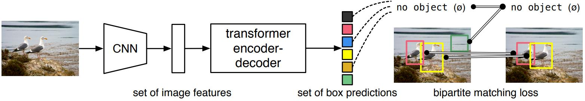
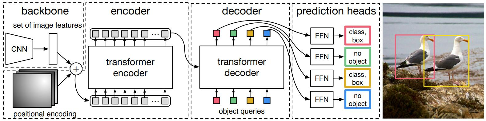
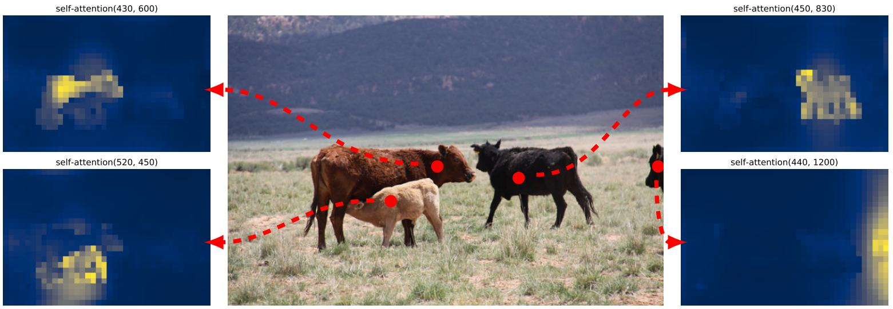
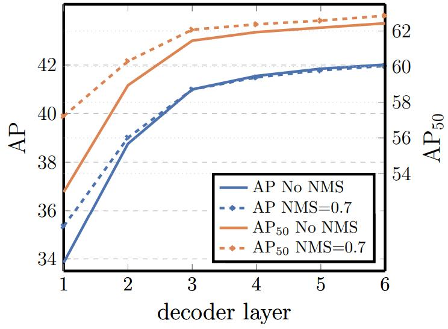
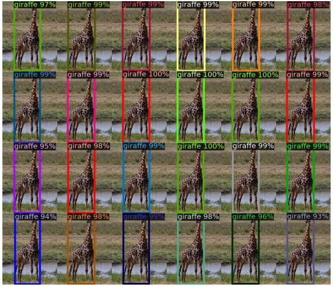
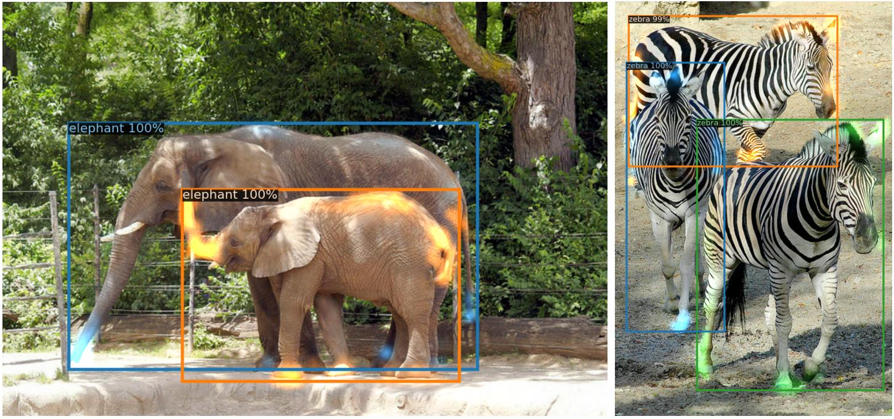
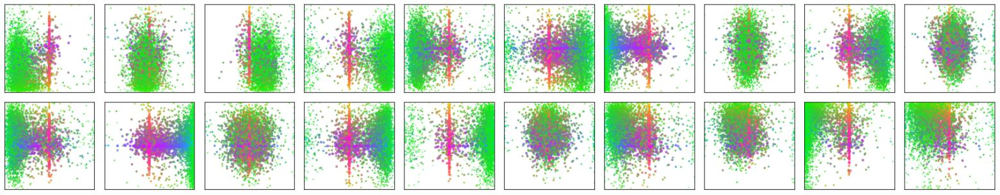
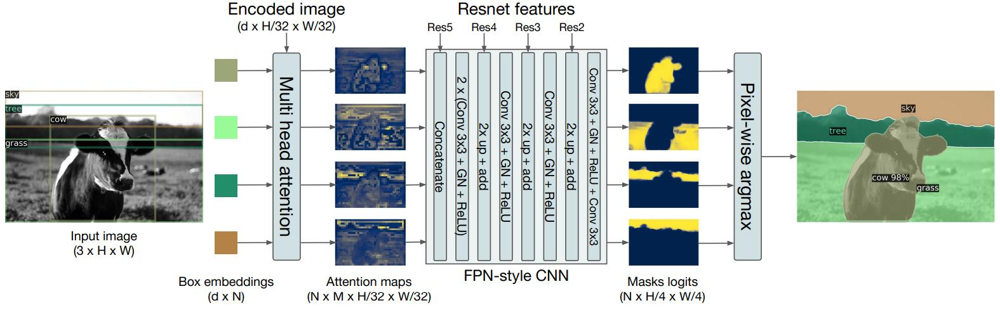
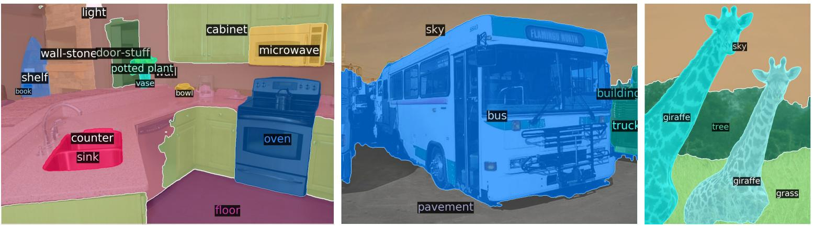

# [End-to-End Object Detection with Transformers](https://arxiv.org/abs/2005.12872)

## Abstract

我们提出了一种新方法，将目标检测视为一个直接的集合预测问题。我们的方法简化了检测流程，有效地消除了对许多手工设计组件的需求，例如非极大值抑制过程或锚框生成，这些组件显式地编码了我们关于该任务的先验知识。这个被称为 DEtection TRansformer 或 DETR 的新框架的主要组成部分是：一个通过二分匹配强制产生唯一预测的基于集合的全局损失，以及一个 transformer 编码器-解码器架构。给定一个固定的少量已学习的目标查询集合，DETR 对目标与全局图像上下文的关系进行推理，从而并行地直接输出最终的预测集合。与许多其他现代检测器不同，这个新模型在概念上很简单，并且不需要专门的库。在具有挑战性的 COCO 目标检测数据集上，DETR 表现出了与成熟且高度优化的 Faster RCNN 基线相当的准确率和运行时间性能。此外，DETR 可以很容易地推广，以统一的方式生成全景分割。我们展示了它显著优于具有竞争力的基线模型。训练代码和预训练模型可在 [https://github.com/facebookresearch/detr](https://github.com/facebookresearch/detr) 获取。

## 1 Introduction

目标检测的目标是为每个感兴趣的目标预测一组边界框和类别标签。现代检测器以间接的方式解决这个集合预测任务，即在大量的提议 [37,5]、锚框 [23] 或窗口中心 [53,46] 上定义代理的回归和分类问题。它们的性能受到用于消除近似重复预测的后处理步骤、锚框集合的设计，以及将目标框分配给锚框的启发式方法 [52] 的显著影响。为了简化这些流程，我们提出了一种直接的集合预测方法来绕过这些代理任务。这种端到端的理念已经在诸如机器翻译或语音识别等复杂的结构化预测任务中带来了显著的进展，但尚未在目标检测领域实现：先前的尝试 [43,16,4,39] 要么加入了其他形式的先验知识，要么在极具挑战性的基准测试中尚未证明能与强大的基准模型相媲美。本文旨在弥合这一差距。

我们通过将目标检测视为一个直接的集合预测问题来精简训练流程。我们采用了一种基于 Transformer [47] 的编码器-解码器架构，这是一种用于序列预测的流行架构。Transformer 的自注意力机制显式地对序列中元素之间的所有成对交互进行建模，使得这些架构特别适合于集合预测的特定约束，例如消除重复的预测。

我们的检测 Transformer（DEtection TRansformer，DETR，见图1）一次性预测所有目标，并使用集合损失函数进行端到端训练，该函数在预测目标和真实目标之间执行二分匹配。DETR 通过摒弃多个编码先验知识的人工设计组件（如空间锚框或非极大值抑制）简化了检测流程。与大多数现有的检测方法不同，DETR 不需要任何自定义层，因此可以在任何包含标准 CNN 和 Transformer 类的框架中轻松复现。

与大多数先前关于直接集合预测的工作相比，DETR 的主要特征是将二分匹配损失与带有（非自回归）并行解码的 Transformer 结合起来 [29,12,10,8]。相比之下，以前的工作主要集中在使用 RNN 进行自回归解码 [43,41,30,36,42]。我们的匹配损失函数将一个预测唯一地分配给一个真实目标，并且对预测目标的排列具有不变性，因此我们可以并行地输出它们。

我们在最受欢迎的目标检测数据集之一 COCO [24] 上评估了 DETR，并与极具竞争力的 Faster R-CNN 基准方法[37]进行了对比。Faster RCNN 经历了多次设计迭代，自最初发布以来其性能得到了极大的提升。我们的实验表明，我们的新模型实现了相当的性能。更准确地说，DETR 在大目标上表现出了明显更优的性能，这一结果很可能是由 Transformer 的非局部计算促成的。然而，它在小目标上的性能较低。我们期望未来的工作能在这一方面进行改进，就像 FPN[22] 的发展对 Faster R-CNN 所起的作用一样。

DETR 的训练设置在多个方面与标准目标检测器不同。这个新模型需要超长的训练周期，并得益于 Transformer 中的辅助解码损失。我们深入探讨了哪些组件对所展示的性能至关重要。

DETR 的设计理念很容易扩展到更复杂的任务中。在我们的实验中，我们展示了在预训练的 DETR 基础上训练的一个简单分割头，在全景分割[19]（一项最近受到青睐且极具挑战性的像素级识别任务）上超越了极具竞争力的基准方法。

**图 1**：DETR通过结合通用的 CNN 与 Transformer 架构，直接（并行地）预测最终的检测集合。在训练期间，二分匹配将预测结果与真实框进行唯一分配。没有匹配的预测应该产生一个“无对象” $(\varnothing)$ 的类别预测。

## 2 Related work

我们的工作建立在几个领域的先前工作基础之上：用于集合预测的二分匹配损失、基于 Transformer 的编码器-解码器架构、并行解码以及目标检测方法。

### 2.1 Set Prediction

目前没有规范的深度学习模型来直接预测集合。基本的集合预测任务是多标签分类（例如，参见计算机视觉背景下的参考文献[40,33]），其基准方法即“一对多”（one-vs-rest）并不适用于诸如检测这样元素之间存在潜在结构（即几乎相同的框）的问题。这些任务中的第一个困难是避免近似重复项。目前的大多数检测器使用诸如非极大值抑制等后处理操作来解决这个问题，但直接集合预测是免后处理的。它们需要能够对所有预测元素之间的交互进行建模的全局推理方案，以避免冗余。对于固定大小的集合预测，密集的完全连接网络[9]是足够的，但成本很高。一种通用的方法是使用自回归序列模型，例如循环神经网络[48]。在所有情况下，损失函数都应该对预测结果的排列具有不变性。通常的解决方案是设计一个基于匈牙利算法[20]的损失函数，以在真实值和预测值之间找到一个二分匹配。这强制了排列不变性，并保证每个目标元素都有一个唯一的匹配。我们遵循二分匹配损失的方法。然而，与大多数先前的工作不同，我们放弃了自回归模型，转而使用带有并行解码的 Transformer，我们将在下面对此进行描述。

### 2.2 Transformers and Parallel Decoding

Transformer 是由 Vaswani 等人 [47] 作为机器翻译的一种新的基于注意力的构建块引入的。注意力机制 [2] 是从整个输入序列中聚合信息的神经网络层。Transformer 引入了自注意力层，与非局部神经网络[49]类似，它扫描序列的每个元素，并通过聚合来自整个序列的信息来更新它。基于注意力的模型的主要优势之一是它们的全局计算和完美的记忆力，这使得它们在处理长序列时比 RNN 更合适。Transformer 现在正在自然语言处理、语音处理和计算机视觉领域的许多问题中取代 RNN[8,27,45,34,31]。

Transformer 最初被用于自回归模型中，紧随早期的序列到序列模型 [44]，逐个生成输出标记。然而，由于过高的推理成本（与输出长度成正比，且难以进行批处理），促成了在音频 [29]、机器翻译 [12,10]、词表示学习 [8] 以及最近的语音识别 [6] 领域中并行序列生成的发展。我们也将 Transformer 和并行解码结合起来，因为它们在计算成本和执行集合预测所需的全局计算能力之间取得了适当的权衡。

### 2.3 Object detection

大多数现代目标检测方法都是相对于一些初始猜测来进行预测的。两阶段检测器 [37,5] 相对于提议（proposals）预测框，而单阶段方法相对于锚框 [23] 或可能的目标中心网格 [53,46] 来进行预测。最近的工作 [52] 表明，这些系统的最终性能在很大程度上取决于这些初始猜测的精确设置方式。在我们的模型中，我们能够移除这种人工设计的过程，并通过相对于输入图像而不是锚框进行绝对框预测来直接预测检测集合，从而精简检测流程。

**基于集合的损失**。几个目标检测器 [9,25,35] 使用了二分匹配损失。然而，在这些早期的深度学习模型中，不同预测之间的关系仅使用卷积层或全连接层来建模，且人工设计的 NMS 后处理可以提高它们的性能。更近期的检测器 [37,23,53] 在真实值和预测值之间使用非唯一分配规则，并结合 NMS 使用。

可学习的 NMS 方法 [16,4] 和关系网络 [17] 利用注意力显式地对不同预测之间的关系进行建模。使用直接的集合损失，它们不需要任何后处理步骤。然而，这些方法采用了额外的人工设计的上下文特征（如提议框的坐标）来高效地建模检测结果之间的关系，而我们则在寻找能够减少编码在模型中的先验知识的解决方案。

**循环检测器**。与我们方法最接近的是用于目标检测 [43] 和实例分割 [41,30,36,42] 的端到端集合预测。与我们类似，它们使用二分匹配损失和基于 CNN 激活的编码器-解码器架构来直接生成一组边界框。然而，这些方法仅在小数据集上进行了评估，并未与现代基准方法进行对比。特别是，它们基于自回归模型（更确切地说是 RNN），因此它们没有利用近期带有并行解码的 Transformer。

## 3 The DETR model

目标检测中直接进行集合预测有两个必不可少的要素：(1) 一种强制在预测框和真实框之间进行唯一匹配的集合预测损失；(2) 一种（在一次前向传播中）预测一组目标并对它们的关系进行建模的架构。我们在图 2 中详细描述了我们的架构。

**图 2**：DETR 使用传统的 CNN 主干网络来学习输入图像的二维表示。模型将其展平，并在将其传入 Transformer 编码器之前补充位置编码。然后，Transformer 解码器接受少量固定数量的学习到的位置嵌入（我们称之为对象查询）作为输入，并额外关注编码器的输出。我们将解码器的每个输出嵌入传递给一个共享的前馈网络（FFN），该网络预测一个检测结果（类别和边界框）或一个“无对象”类别。

### 3.1 Object detection set prediction loss

DETR 通过解码器的一次前向传播，推断出一个由 N 个预测组成的固定大小的集合，其中 N 被设置为显著大于图像中典型的目标数量。训练的主要困难之一是根据真实值对预测目标（类别、位置、大小）进行评分。我们的损失在预测目标和真实目标之间产生一个最优的二分匹配，然后优化特定于目标（边界框）的损失。

我们将真实目标集合记为 $y$ ，将 N 个预测的集合记为 $\hat{y} = \set{ \hat{y}_i }_{i=1}^N$ 。假设 N 大于图像中的目标数量，我们也将 $y$ 视为一个大小为 N 的集合，用 $\varnothing$ （无目标）进行填充。为了在这两个集合之间找到二分匹配，我们寻找具有最低代价的 N 个元素的排列 $\sigma \in \mathfrak{S}_{N}$ ：

$$
\large \hat{\sigma}=\underset{\sigma \in \mathfrak{S}_{N}}{\arg \min } \sum_{i}^{N} \mathcal{L}_{\text {match }}\left(y_{i}, \hat{y}_{\sigma(i)}\right), \tag{1}
$$

其中 $\mathcal{L}_{\text {match }}\left(y_{i}, \hat{y}_{\sigma(i)}\right)$ 是真实值 $y_i$ 和索引为 $\sigma(i)$ 的预测之间的成对匹配代价。遵循先前的工作（例如 [43]），这种最优分配是使用匈牙利算法高效计算出来的。

匹配代价同时考虑了类别预测以及预测框和真实框的相似度。真实值集合中的每个元素 $i$ 都可以看作是一个 $y_i = (c_i, b_i)$ ，其中 $c_i$ 是目标类别标签（可能是 $\varnothing$ ）， $b_i \in [0, 1]^4$ 是一个向量，定义了真实框的中心坐标以及其相对于图像大小的高度和宽度。对于索引为 $\sigma(i)$ 的预测，我们将类别 $c_i$ 的概率定义为 $\hat{p}_{\sigma(i)} (c_i)$ ，并将预测框定义为 $\hat{b}_{\sigma(i)}$ 。使用这些记号，我们将 $\mathcal{L}_{\text {match }}\left(y_{i}, \hat{y}_{\sigma(i)}\right)$ 定义为： $\large -\mathbb{1}_{\set{c_i \neq \varnothing}} \hat{p}_{\sigma(i)}(c_i) + \mathbb{1}_{\set{c_i \neq \varnothing}} \mathcal{L}_{\mathrm{box}}(b_i,\hat{b}_{\sigma(i)})$

这种寻找匹配的过程与现代检测器中用于将提议 [37] 或锚框 [22] 与真实目标进行匹配的启发式分配规则起着相同的作用。主要区别在于，我们需要为没有重复的直接集合预测找到一对一的匹配。

第二步是计算损失函数，即计算上一步中匹配的所有对的匈牙利损失。我们像常见目标检测器的损失一样定义该损失，即类别预测的负对数似然和稍后定义的边界框损失的线性组合：
$$
\large \mathcal{L}_{\text {Hungarian }}(y, \hat{y})=\sum_{i=1}^{N}\left[-\log \hat{p}_{\hat{\sigma}(i)}\left(c_{i}\right)+\mathbb{1}_{\left\{c_{i} \neq \varnothing \right\}} \mathcal{L}_{\text {box }}\left(b_{i}, \hat{b}_{\hat{\sigma}}(i)\right)\right], \tag{2}
$$

其中 $\hat{\sigma}$ 是在第一步 (1) 中计算出的最优分配。在实践中，当 $c_i = \varnothing$ 时，我们将对数概率项的权重降低 10 倍，以解决类别不平衡的问题。这类似于 Faster R-CNN 训练过程如何通过子采样来平衡正负提议[37]。请注意，一个目标与 $\varnothing$ 之间的匹配代价不依赖于预测，这意味着在这种情况下代价是一个常数。在匹配代价中，我们使用概率 $\hat{p}_{\hat{\sigma}(i)}(c_i)$ 而不是对数概率。这使得类别预测项与 $\mathcal{L}_{\mathrm{box}}(\cdot,\cdot)$ （在下文描述）可通约，并且我们观察到了更好的经验性能。

**边界框损失**。匹配代价和匈牙利损失的第二部分是 $\mathcal{L}_{\text{box}}(\cdot)$ ，它对边界框进行评分。与许多将边界框预测作为相对于一些初始猜测的偏移量 $\Delta$ 的检测器不同，我们直接进行边界框预测。虽然这种方法简化了实现，但它带来了损失相对缩放的问题。即使相对误差相似，最常用的 $\ell 1$ 损失对于小框和大框也会有不同的尺度。为了缓解这个问题，我们使用了 $\ell 1$ 损失和尺度不变的广义 IoU 损失[38] $\mathcal{L}_{iou}(\cdot,\cdot)$ 的线性组合。总的来说，我们的边界框损失 $\mathcal{L}_{\text {box }}\left(b_{i}, \hat{b}_{\hat{\sigma}}(i)\right)$ 定义为 $\large \lambda_{\text{iou}} \mathcal{L}_{\text{iou}}(b_i, \hat{b}_{\sigma(i)}) + \lambda_{\text{L1}} \| b_i - \hat{b}_{\sigma(i)} \|_{1} $ ，其中 $\lambda_{\text{iou}}, \lambda_{\text{L1}} \in \mathbb{R}$ 是超参数。这两个损失通过批次内目标的数量进行归一化。

### 3.2 DETR architecture

DETR 的整体架构出奇地简单，如图 2 所示。它包含三个主要组件，我们在下面对其进行描述：用于提取紧凑特征表示的 CNN 主干网络、一个编码器-解码器  Transformer，以及一个做出最终检测预测的简单前馈网络（FFN）。与许多现代检测器不同，DETR 可以在任何提供通用 CNN 主干网络和 Transformer 架构实现的深度学习框架中仅用几百行代码来实现。DETR 的推理代码可以在 PyTorch [32] 中用不到 50 行代码实现。我们希望我们方法的简单性能够吸引新的研究人员加入检测社区。

**主干网络**。从初始图像 $x_{\text{img}} \in \mathbb{R}^{3 \times H_0 \times W_0}$（具有 3 个颜色通道）开始，传统的 CNN 主干网络生成一个较低分辨率的激活图 $f \in \mathbb{R}^{C \times H \times W}$ 。我们使用的典型值是 $C = 2048$ 以及 $H, W = \frac{H_0}{32}, \frac{W_0}{32}$ 。

>  输入图像是一批 (batched)，填充 0 以便它们与最大尺寸的图像有相同的维度 $(H_0, W_0)$ 

**Transformer 编码器**。首先， $1 \times 1$ 卷积将高级激活图 $f$ 的通道维度从 $C$ 降低到一个较小的维度 $d$ ，创建一个新的特征图 $z_0 \in \mathbb{R}^{d \times H \times W}$ 。编码器期望以序列作为输入，因此我们将 $z_0$ 的空间维度折叠成一维，得到一个 $d \times HW$ 的特征图。每个编码器层具有标准架构，由一个多头自注意力模块和一个前馈网络（FFN）组成。由于 Transformer 架构具有排列不变性，我们为其补充了固定的位置编码[31,3]，这些编码被添加到每个注意力层的输入中。我们将架构的详细定义留到补充材料中，该架构遵循 [47] 中描述的结构。

**Transformer 解码器**。解码器遵循 Transformer 的标准架构，使用多头自注意力和编码器-解码器注意力机制转换 N 个大小为 $d$ 的嵌入。与原始 Transformer 的区别在于，我们的模型在每个解码器层并行解码这 N 个目标，而 Vaswani 等人[47]使用的是一个一次预测输出序列中一个元素的自回归模型。我们将不熟悉这些概念的读者引至补充材料。由于解码器同样具有排列不变性，因此这 N 个输入嵌入必须不同才能产生不同的结果。这些输入嵌入是学习到的位置编码，我们将其称为对象查询，并且与编码器类似，我们将它们添加到每个注意力层的输入中。这 N 个对象查询被解码器转换为一个输出嵌入。然后，它们被一个前馈网络（在下一小节中描述）独立解码为边界框坐标和类别标签，从而得到 N 个最终预测。通过在这些嵌入上使用自注意力和编码器-解码器注意力，模型利用所有目标之间的成对关系对它们进行全局推理，同时能够使用整幅图像作为上下文。

**预测前馈网络（FFNs）**。最终的预测由一个具有 ReLU 激活函数和隐藏维度 $d$ 的 3 层感知机以及一个线性投影层计算得出。FFN 预测相对于输入图像归一化后的边界框中心坐标、高度和宽度，线性层使用 softmax 函数预测类别标签。由于我们预测的是一个固定大小的包含 N 个边界框的集合，其中 N 通常远大于图像中实际感兴趣目标的数量，因此使用了一个额外的特殊类别标签 $\varnothing$ 来表示在一个槽内没有检测到目标。该类别扮演着与标准目标检测方法中的“背景”类相似的角色。

**辅助解码损失**。我们发现在训练期间在解码器中使用辅助损失 [1] 是有帮助的，特别是能够帮助模型输出每种类别正确数量的目标。我们在每个解码器层之后添加预测 FFN 和匈牙利损失。所有的预测 FFN 共享它们的参数。我们使用一个额外的共享层归一化来对来自不同解码器层的预测 FFN 的输入进行归一化。

## 4 Experiments

**图 3**：一组参考点的编码器自注意力。编码器能够分离各个实例。预测是使用基准 DETR 模型在验证集图像上进行的。

**图 4**：每个解码器层之后的AP和AP50性能。评估了一个单一的长训练周期的基准模型。根据设计，DETR不需要NMS，本图验证了这一点。NMS在最后几层降低了AP，移除了真阳性（TP）预测，但在最初的解码器层中提高了AP，移除了重复预测，因为在第一层中没有通信，并且稍微提高了AP50。

**图 5**：罕见类别的分布外泛化。尽管训练集中没有图像包含超过13只长颈鹿，DETR在泛化到24只及以上的同类实例时毫无困难。

**图 6**：每个预测对象的解码器注意力可视化（图像来自COCO验证集）。预测是使用DETR-DC5模型进行的。不同的对象的注意力分数用不同的颜色进行了编码。解码器通常关注对象的末端部位，如腿和头。彩色观看效果最佳。

**图 7**：在DETR解码器总共N=100个预测槽中，选出20个预测槽在COCO 2017验证集的所有图像上的所有边界框预测的可视化。每个边界框预测被表示为一个点，其中心坐标位于由每个图像尺寸归一化的1x1的正方形中。这些点经过了颜色编码，绿色对应于小框，红色对应于大的水平框，蓝色对应于大的垂直框。我们观察到，每个槽都学会了通过几种操作模式专注于特定的区域和框大小。我们注意到几乎所有的槽都有一种预测COCO数据集中常见的大型全图框的模式。

**图 8**：全景头的图示。并行为每个检测到的对象生成一个二值掩码，然后使用像素级的 argmax 合并这些掩码。

**图 9**：由 DETR-R101 生成的全景分割定性结果。DETR 以统一的方式为可数目标（things）和不可数事物（stuff）生成对齐的掩码预测。

## 5 Conclusion

我们提出了 DETR，这是一种基于 Transformer 和二分匹配损失进行直接集合预测的目标检测系统新设计。该方法在极具挑战性的 COCO 数据集上取得了与经过优化的 Faster R-CNN 基准相当的结果。DETR 易于实现，并且具有灵活的架构，可以轻松扩展到全景分割任务，并取得具有竞争力的结果。此外，它在大目标上的性能明显优于 Faster R-CNN，这可能归功于自注意力执行的全局信息处理。

检测器的这种新设计也带来了新的挑战，特别是在**训练、优化和在小目标上的性能**方面。当前的检测器需要数年的改进才能应对类似的问题，我们期望未来的工作能够成功地为 DETR 解决这些问题。