# [Emerging Properties in Self-Supervised Vision Transformers](https://arxiv.org/pdf/2104.14294)

## Abstract

在本文中，我们质疑自监督学习是否为 Vision Transformer（ViT）[19]带来了与卷积神经网络（ConvNet）相比突出的新特性。 除了自监督方法特别适合这种架构的事实之外，我们还做出了以下观察：首先，自监督 ViT 特征包含关于图像语义分割的显式信息，这在监督 ViT 或 ConvNet 中并不明显。其次，这些特征也是优秀的 k-NN 分类器，使用小型 ViT 在 ImageNet 上达到 78.3% 的 top-1 准确率。我们的研究还强调了动量编码器[33]、多裁剪训练[10]和使用小 patch 的 ViT 的重要性。我们将我们的发现应用到一个简单的自监督方法 **DINO** 中，将其解释为一种无标签的自蒸馏形式。我们通过在 ViT-Base 的线性评估中达到 80.1% 的 ImageNet top-1 准确率，展示了 DINO 和 ViT 之间的协同作用。

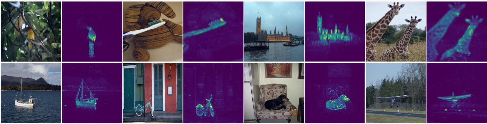

**图 1：自监督训练的 8 x 8 patches Vision Transformer 的自注意力**。我们观察最后一层头部 [CLS] 词元的自注意力。该词元未附加任何标签或监督。这些图显示模型自动学习类特定特征，从而实现无监督对象分割。

## 1. Introduction

Transformer [70] 近期作为一种替代卷积神经网络（ConvNet）的视觉识别方法 [19, 69, 83] 而兴起。它们的采用与受自然语言处理（NLP）启发的训练策略相结合，即在大规模数据上预训练并在目标数据集上微调 [18, 55]。由此产生的 Vision Transformer（ViT）[19]与 ConvNet 具有竞争力，但它们尚未展现出明显的优势：它们计算要求更高，需要更多的训练数据，并且它们的特征没有表现出独特的性质。

在本文中，我们质疑 Transformer 在视觉领域有限的成功是否可以解释为其预训练中监督的使用。我们的动机是，Transformer 在 NLP 领域取得成功的关键因素之一是使用自监督预训练，以 BERT [18] 中的闭合过程或 GPT [55] 中的语言建模的形式。这些自监督预训练目标使用句子中的单词来创建前置/代理任务 (pretext task)，提供比预测每个句子单个标签的监督目标更丰富的学习信号。类似地，在图像中，图像级监督通常将图像中丰富的视觉信息简化为从预定义的几千个物体类别中选择的一个概念 [60]。

虽然 NLP 中使用的自监督代理任务是特定于文本的，但许多现有的自监督方法已经展示了它们与卷积神经网络（ConvNet）相结合在图像上的潜力 [10, 12, 30, 33]。它们通常共享相似的结构，但具有不同的组件设计以避免平凡解（崩溃）或提高性能 [16]。在这项工作中，受这些方法的启发，我们研究了自监督预训练对ViT 特征的影响。特别有趣的是，我们发现了一些在监督 ViT 或 ConvNet 中未曾出现的有趣特性：

- 自监督 ViT 特征明确包含场景布局，特别是物体边界，如图 1 所示。该信息可以直接从最后一个块的自注意力模块中获取。
- 自监督 ViT 特征在一个基础的最近邻分类器（k-NN）上表现特别好，无需任何微调、线性分类器或数据增强，即可在 ImageNet 上达到 78.3% 的 top-1 准确率。

分割掩码的出现似乎是自监督方法共享的一个特性。然而，只有结合动量编码器[33]和多裁剪增强[10]等特定组件时，k-NN 的良好性能才会出现。我们的研究另一个发现是使用更小的 patch 的 ViT 以提高特征质量。

总体而言，我们关于这些组件的重要性的发现促使我们设计了一种简单的自监督方法，可以解释为一种**无标签的知识蒸馏** [35] 形式。由此产生的框架 DINO，通过使用标准交叉熵损失直接预测教师网络（由动量编码器构建）的输出，简化了自监督训练。有趣的是，我们的方法仅需要对教师输出进行中心化和锐化即可避免崩溃，而其他流行的组件如预测器[30]、高级归一化[10]或对比损失[33]在稳定性或性能方面收益甚微。特别重要的是，我们的框架灵活且适用于 ConvNet 和 ViT，无需修改架构或调整内部归一化[58]。

通过在 ImageNet 线性分类基准上使用带有小 patch 的 ViT-Base 达到 80.1% 的 top-1准确率，超越以前的自监督特征，我们进一步验证了 DINO 和 ViT 之间的协同作用。通过与 ResNet-50 架构的最新技术相匹配，我们还确认 DINO 适用于 ConvNet。最后，我们讨论了在计算和内存容量有限的情况下使用 DINO 与 ViT 的不同场景。特别是，使用 ViT 训练 DINO 仅需 2 台 8-GPU 服务器超过 3 天即可在 ImageNet 线性基准上达到 76.1%，这优于基于 ConvNet 的自监督系统，具有相当的尺寸和显著减少的计算需求[10, 30]。

**图 2**：无标签的自蒸馏。为了简单起见，我们以一对视图 $(x_1, x_2)$ 为例说明 DINO。 模型将输入图像的两种不同随机变换传递给学生网络和教师网络。 两个网络具有相同的架构但不同的参数。 教师网络的输出以批处理计算的平均值进行中心化。 每个网络输出一个 $K$ 维特征，该特征在特征维度上使用一个带温度系数的 softmax 进行归一化。 使用交叉熵损失测量它们的相似性。 我们对教师网络应用停梯度 (sg) 运算符，仅通过学生网络传播梯度。 教师网络的参数使用学生网络参数的指数移动平均 (EMA) 进行更新。

## 2. Related work

**自监督学习**。大量关于自监督学习的工作都集中在被称为实例分类 [12, 20, 33, 73] 的判别方法上，这些方法将每个图像视为一个不同的类别，并通过对它们进行数据增强来训练模型。然而，显式地学习一个分类器来区分所有图像 [20] 并不适用于大量图像。Wu 等人 [73] 提出了使用噪声对比估计器 (NCE) [32] 来比较实例而不是对它们进行分类。这种方法的一个缺点是它需要同时比较大量图像的特征。在实践中，这需要大批量 [12] 或内存库 [33, 73]。一些变体允许以聚类的形式自动分组实例 [2, 8, 9, 36, 42, 74, 80, 85]。

最近的工作表明，我们可以无需区分图像的情况下学习无监督特征。特别值得注意的是，Grill 等人 [30] 提出了一个称为 BYOL 的度量学习公式，其中通过将特征与动量编码器获得的表示进行匹配来训练特征。像 BYOL 这样的方法甚至可以在没有动量编码器的情况下工作，但代价是性能下降 [16, 30]。其他几项工作也呼应了这一方向，表明可以匹配更复杂的表示 [26, 27]，训练特征以匹配均匀分布 [6] 或使用白化 [23, 81]。我们的方法受到 BYOL 的启发，但使用一个不同的相似性匹配损失，并对学生和教师使用完全相同的架构。这样，我们的工作完成了 BYOL 提出的解释，即自监督学习是一种无标签的平均教师自蒸馏 [65] 的形式。

**自训练和知识蒸馏**。自训练旨在通过将一小部分初始标注传播到大量未标记实例来提高特征的质量。这种传播可以通过硬标签分配 [41, 78, 79] 或软标签分配 [76] 来完成。当使用软标签时，该方法通常被称为知识蒸馏 [7, 35]，主要用于训练一个小网络来模仿大网络的输出以压缩模型。Xie 等人 [76] 表明，蒸馏可以用于在自训练管道中将软伪标签传播到未标记数据，从而建立了自训练和知识蒸馏之间的重要联系。我们的工作建立在这个关系之上，并将知识蒸馏扩展到没有标签的情况。以前的工作还结合了自监督学习和知识蒸馏 [25, 63, 13, 47]，从而实现了自监督模型压缩和性能提升。然而，这些工作依赖于预训练的固定教师，而我们的教师是在训练过程中动态构建的。这样，知识蒸馏不再作为自监督预训练的后处理步骤，而是直接作为自监督目标。最后，我们的工作也与联合蒸馏 [1] 相关，其中学生和教师具有相同的架构，并在训练期间使用蒸馏。然而，联合蒸馏中的教师也从学生那里蒸馏，而在我们的工作中，教师是用学生的平均值更新的。

## 3. Approach

### 3.1. SSL with Knowledge Distillation

用于这项工作的框架 DINO 与最近的自监督方法 [10, 16, 12, 30, 33] 具有相同的总体结构。然而，我们的方法也与知识蒸馏 [35] 具有相似之处，我们从这个角度来呈现它。我们在图 2 中说明了 DINO，并在算法 1 中提出了伪代码实现。

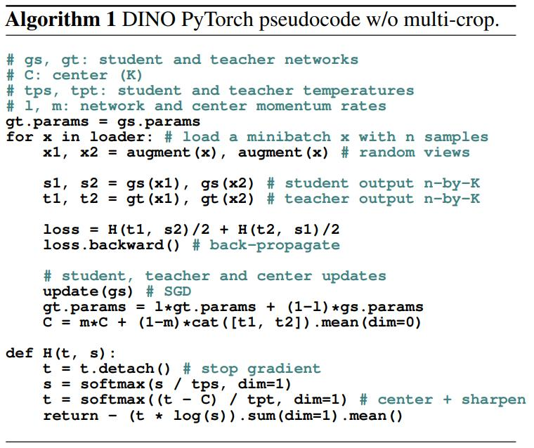

知识蒸馏是一种学习范式，我们训练一个学生网络 $\large g_{\theta_s}$ 来匹配给定教师网络 $\large g_{\theta_t}$ 的输出，分别由 $\theta_s$ 和 $\theta_t$ 参数化。给定输入一张图像 $x$ ，两个网络都输出 $K$ 维的概率分布 $P_s$ 和 $P_t$ 。概率 $P$ 通过用 softmax 函数归一化网络 $g$ 的输出获得。更准确地说，

$$
\large P_s(x)^{(i)} = \frac{\exp(g_{\theta_s}(x)^{(i)} / \tau_s)}{\sum_{k=1}^K \exp(g_{\theta_s}(x)^{(k)} / \tau_s)}, \tag{1}
$$

其中 $\tau_s \gt 0$ 是一个控制输出分布锐度的温度参数， $P_t$ 的公式类似，温度为 $\tau_t$ 。给定一个固定的教师网络 $\large g_{\theta_t}$ ，我们通过最小化相对于学生网络参数 $\theta_s$ 的交叉熵损失来学习匹配这些分布：

$$
\large \min_{\theta_s} H(P_t(x), P_s(x)), \tag{2}
$$

其中 $H(a,b) = -a \log b$ 。

在以下内容中，我们详细说明了如何将等式 (2) 中的问题适应于自监督学习。首先，我们使用多裁剪策略 [10] 构造图像的不同失真视图或裁剪。更准确地说，从给定的图像中，我们生成一组不同的视图 V。该集合包含两个全局视图 $x_1^g$ 和 $x_2^g$ 以及几个较小分辨率的局部视图。所有裁剪都通过学生网络，而只有全局视图通过教师网络，因此鼓励“局部到全局”的对应关系。我们最小化损失：

$$
\large \min_{\theta_s} \sum_{x \in \set{x_1^g, x_2^g}} \sum_{x^{\prime} \in V, x^{\prime} \neq x} H(P_t(x), P_s(x^{\prime})). \tag{3}
$$
该损失函数具有通用性，可以用于任意数量的视图，甚至只有 2 个视图。然而，我们遵循多裁剪的标准设置，使用 2 个分辨率为 $224^2$ 的全局视图，覆盖原始图像的一个大面积区域（例如大于 50%）。此外，还使用几个分辨率为 $96^2$ 的局部视图，仅覆盖原始图像的小面积区域（例如小于 50%）。除非另有说明，我们将此设置称为 DINO 的基本参数化。

两个网络共享相同的架构 $g$ ，但具有不同的参数集 $\theta_s$ 和 $\theta_t$ 。我们通过随机梯度下降法最小化等式 (3) 来学习参数 $\theta_s$ 。

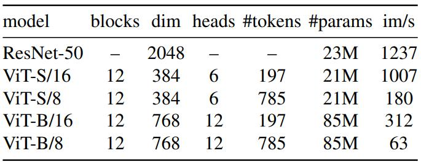

**表 1：网络配置**。 “Blocks” 指 Transformer 块的数量， “dim” 指通道维度， “heads” 指多头注意力中的头数。 “# tokens” 指在考虑 $224^2$ 分辨率输入时 token 序列的长度， “# params” 指参数总数（不包括投影头）， “im/s” 指在具有 128 个样本的前向过程在 NVIDIA V100 GPU 上的推理时间。

**教师网络**。与知识蒸馏不同，我们没有一个给定先验知识的教师 $\large g_{\theta_t}$ ，因此我们从学生网络的过去的迭代中构建它。我们在第 5.2 节中研究了教师的不同更新规则，并表明在我们的框架中，冻结教师网络超过一个 epoch 的效果出奇地好，而将学生权重复制给教师则无法收敛。特别值得注意的是，对学生权重使用指数移动平均 (EMA)，即动量编码器 [33]，非常适合我们的框架。更新规则为 $\theta_t \leftarrow \lambda \theta_t + (1 - \lambda) \theta_s$ ，其中 $\lambda$ 在训练期间遵循从 0.996 到 1 的余弦调度 [30]。最初，动量编码器被引入作为对比学习中队列的替代品 [33]。然而，在我们的框架中，它的作用有所不同，因为我们没有队列也没有对比损失，可能更接近于自训练中使用的平均教师的作用 [65]。事实上，我们观察到这个教师扮演了一种类似于具有指数衰减的 Polyak-Ruppert 平均的模型集成的形式 [51, 59]。使用 Polyak-Ruppert 平均进行模型集成是提高模型性能的标准做法 [38]。我们观察到，这个教师在整个训练过程中都具有比学生更好的性能，因此通过提供更高质量的目标特征来指导学生的训练。这种动态在以前的工作 [30, 58] 中没有观察到。

**网络架构**。神经网络 $g$ 由主干网络 $f$ （ViT [19] 或 ResNet [34]）和投影头 $h ：g = h \circ f$ 组成。下游任务中使用的特征是主干网络 $f$ 的输出。投影头由一个具有 2048 个隐藏单元的 3 层多层感知器 (MLP) 组成，后面跟着 $\ell_2$ 归一化和一个权重归一化的全连接层 [61]，具有 $K$ 个维度，这与 SwAV [10] 中的设计相似。我们测试了其他投影头，但这个特定的设计似乎最适合 DINO（附录 C）。我们不使用预测器 [30, 16]，因此学生和教师网络的架构完全相同。特别值得注意的是，我们注意到与标准卷积神经网络不同，ViT 架构默认不使用批量归一化 (BN)。因此，当将 DINO 应用于 ViT 时，我们也不在投影头中使用任何 BN，使得整个系统完全没有 BN。

**避免崩溃**。几种自监督方法的区别在于用于避免崩溃的操作，无论是通过对比损失 [73]、聚类约束 [8, 10]、预测器 [30] 还是批量归一化 [30, 58]。虽然我们的框架可以使用多种归一化方法来稳定 [10]，但它也可以仅使用动量教师输出的中心化和锐化来避免模型崩溃。如第 5.3 节中的实验所示，中心化可以防止一个维度占主导地位，但会促使向均匀分布崩溃，而锐化则具有相反的效果。应用这两种操作可以平衡它们的效果，这足以在存在动量教师的情况下避免崩溃。选择这种方法来避免崩溃可以换取对批次的较少依赖：中心化操作仅取决于一阶批统计量，并且可以解释为向教师添加一个偏置项 $c : g_t(x) \leftarrow g_t(x) + c$ 。中心 $c$ 使用指数移动平均更新，这允许该方法在不同批次大小下良好工作，如第 5.5 节所示：
$$
\large c \leftarrow mc + (1 - m) \frac{1}{B}\sum_{i = 1}^{B} g_{\theta_t} (x_i), \tag{4}
$$
其中 $m > 0 $ 是一个速率参数， $B$ 是批量大小。输出锐化是通过在教师的 softmax 归一化中使用较低的温度值 $\tau_t$ 获得。

### 3.2. Implementation and evaluation protocols

在本节中，我们提供了使用 DINO 进行训练的实现细节，并介绍了实验中使用的评估协议。

**Vision Transformer**。我们简要描述了 Vision Transformer (ViT) [19, 70] 的机制，并参考 Vaswani 等人 [70] 关于 Transformer 的详细信息以及 Dosovitskiy 等人 [19] 关于其对图像的适应性。我们遵循 DeiT [69] 中使用的实现。我们在表 1 中总结了本文中使用的不同网络的配置。ViT 架构将一个分辨率为 $N \times N$ 的不重叠连续图像块的网格作为输入。在本文中，我们通常使用 $N = 16$ (“/16”) 或 $N = 8$ (“/8”)。然后，将 patch 传入线性层以形成一组嵌入。我们将一个额外的可学习词元添加到序列中 [18, 19]。该 token 的作用是从整个序列中聚合信息，我们将投影头 $h$ 附加在其输出上。为了与以前的工作 [18, 19, 69] 保持一致，我们将此词元称为类别词元 [CLS]，即使在我们的案例中它没有附加任何标签或监督。将 patch 词元集和 [CLS] 词元馈送到具有“前规范化”的层归一化 [11, 39] 的标准 Transformer 网络。Transformer 是一系列自注意力和前馈层，与跳过连接并行。自注意力层通过使用注意力机制 [4] 查看其他词元表示来更新词元表示。

**实现细节**。我们在 ImageNet 数据集 [60] 上对模型进行预训练，但没有标签。我们使用 adamw 优化器 [44] 和 1024 的批处理大小进行训练，在使用 ViT-S/16 时分布在 16 个 GPU 上。学习率在前 10 个 epochs 中线性增加到其基本值，该基本值由以下线性缩放规则 [29] 确定： $lr = 0.0005 * \mathrm{batchsize} / 256$ 。在此预热之后，我们使用余弦调度 [43] 衰减学习率。权重衰减也遵循从 0.04 到 0.4 的余弦调度。温度 $\tau_s$ 设置为 0.1，而我们对 $\tau_t$ 使用线性预热，在前 30 个 epochs 中从 0.04 增加到 0.07。我们遵循 BYOL [30] 的数据增强（颜色抖动、高斯模糊和随机曝光）和多裁剪 [10]，并使用双三次插值使位置嵌入适应缩放 [19, 69]。复现我们结果的代码和模型是公开可用的。

**评估协议**。自监督学习的标准协议是在冻结的特征上学习一个线性分类器 [82, 33] 或在下游任务上微调特征。对于线性评估，我们在训练期间应用随机调整大小的裁剪和水平翻转增强，并报告在中心裁剪上的准确性。对于微调评估，我们用预训练权重初始化网络并在训练期间对其进行调整。然而，两种评估都对超参数敏感，我们观察到当例如改变学习率时，准确性在不同运行之间存在很大的差异。因此，我们还使用简单的加权最近邻分类器 (k-NN) 评估特征的质量，如 [73] 中所述。我们冻结预训练模型来计算和存储下游任务训练数据的特征。最近邻分类器然后将图像的特征与 k 个最近存储的特征进行匹配来投票标签。我们对不同数量的最近邻进行扫描，发现对于大多数运行，20 个最近邻始终效果最好。该评估协议不需要任何其他超参数调整，也不需要数据增强，并且只需对下游数据集进行一次传递即可运行，从而大大简化了特征评估。

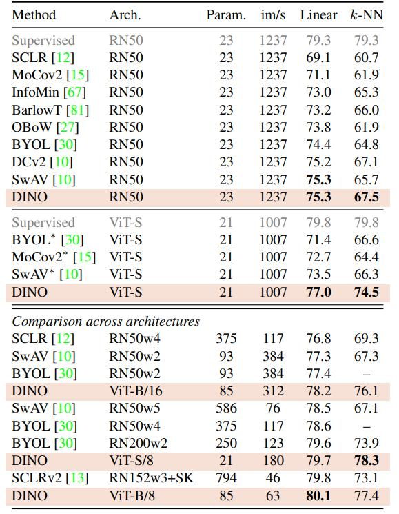

**表 2：ImageNet 上的线性分类和 k-NN 分类**。 我们报告了 ImageNet 验证集上不同自监督方法的线性评估和 k-NN 评估的 top-1 准确率。 我们专注于 ResNet-50 和 ViT-small 架构，但也报告了跨架构获得的最佳结果。* 是由我们运行的。 我们对具有官方发布权重的模型运行 k-NN 评估。 吞吐量（im/s）是在 NVIDIA V100 GPU 上使用 128 个样本进行前向计算时计算得出的。 参数 (M) 是特征提取器的参数。

## 4. Main Results

我们首先使用 ImageNet 上的标准自监督基准来验证本研究中使用的 DINO 框架。然后，我们研究了结果特征在检索、对象发现和迁移学习方面的特性。

### 4.1. Comparing with SSL frameworks on ImageNet

我们考虑两种不同的设置：与相同架构的比较和跨架构的比较。 

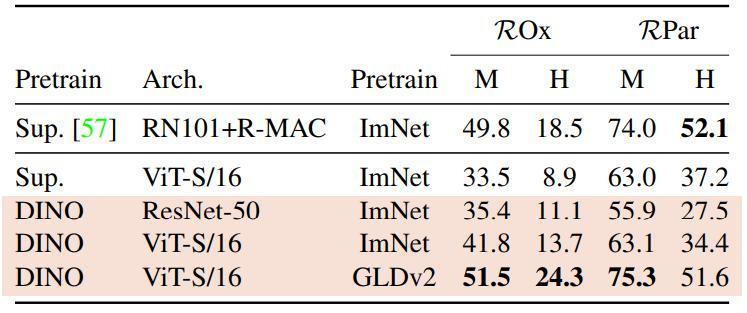

**表 3：图像检索**。 我们将监督训练或使用 DINO 在 ImageNet 和 Google Landmarks v2 (GLDv2) 数据集上预训练的现成特征的检索性能进行比较。 我们在重新访问的 Oxford 和 Paris 数据集上报告了 mAP。 使用 DINO 在地标 (landmark) 数据集上进行预训练表现特别好。 作为参考，我们还报告了使用现成特征的最佳检索方法 [57]。

**与相同架构的比较**。在表 2 的顶部面板中，我们将 DINO 与其他具有相同架构的自监督方法进行了比较，包括 ResNet-50 [34] 或 ViT-small（遵循 DeiT-S [69] 的设计）。选择 ViT-S 的原因是它在多个方面与 ResNet-50 具有相似性：参数数量（21M vs 23M）、吞吐量（1237/秒 VS 1007 im/秒）以及 ImageNet 上的监督性能（79.3% VS 79.8%），训练程序来自 [69]。我们在附录 D 中探索了 ViT-S 的变体。首先，我们观察到 DINO 在 ResNet-50 上的表现与最先进水平相当，验证了 DINO 在标准设置下有效。当我们切换到 ViT 架构时，DINO 在线性分类和 k-NN 评估方面分别优于 BYOL、MoCov2 和 SwAV 3.5% 和 7.9%。更令人惊讶的是，简单的 k-NN 分类器的性能几乎与线性分类器相当（74.5% vs 77.0%）。这种特性仅在使用 DINO 与 ViT 架构时出现，而其他现有的自监督方法或 ResNet-50 则没有出现。

**跨架构比较**。在表 2 的底部面板中，我们比较了跨架构获得的最佳性能。该设置的重点不是直接比较方法，而是评估使用 DINO 训练的 ViT 在迁移到更大架构时的局限性。虽然使用 DINO 训练更大的 ViT 可以提高性能，但减小 patch 大小（“/8” 变体）对性能的影响更大。虽然减小 patch 大小不会增加参数，但仍会导致运行时间显着减少和内存使用量增加。尽管如此，使用 DINO 训练的具有 8 × 8 patch 的基本 ViT 在线性分类中达到 80.1% 的 top-1，在 k-NN 分类器中达到 77.4%，参数比以前的最先进技术 [13] 少 10 倍，运行时间快 1.4 倍。

### 4.2. Properties of ViT trained with SSL

我们评估了 DINO 特征在最近邻搜索、保留对象位置信息和迁移到下游任务方面的特性。

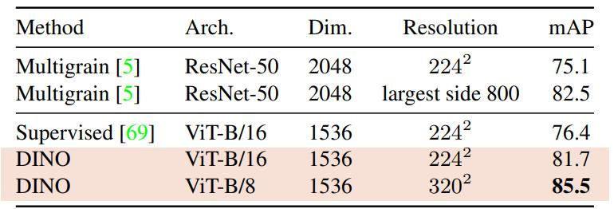

**表 4：复制检测**。 我们在 Copydays 的 “强”子集 [21] 上报告了复制检测的 mAP 性能。 作为参考，我们还报告了专门针对特定对象检索训练的多粒度模型 [5] 的性能。

#### 4.2.1 Nearest neighbor retrieval with DINO ViT

ImageNet 分类的结果表明，我们的特征对于依赖最近邻检索的任务具有潜力。在这组实验中，我们在地标检索和复制检测任务上进一步巩固了这一发现。

**图像检索**：我们考虑了重新审视的 [53] 英国牛津和法国巴黎图像检索数据集 [50]。它们包含 3 个不同难度级别的拆分，具有查询/数据库对。我们报告了中度 (M) 和困难 (H) 拆分的平均精度均值 (mAP)。在表 3 中，我们比较了使用监督训练或 DINO 训练获得的不同现成特征的性能。我们冻结特征并直接应用 k-NN 进行检索。我们观察到 DINO 特征优于在 ImageNet 上使用标签训练的特征。

SSL 方法的一个优点是它们可以在任何数据集上进行训练，而不需要任何形式的注释。我们在 Google Landmarks v2 (GLDv2) [72] 的 120 万个干净的数据集上训练 DINO，这是一个专为检索目的设计的地标数据集。在 GLDv2 上训练的 DINO ViT 特征非常出色，优于以前发布的基于现成描述符的方法 [68, 57]。

**复制检测**：我们还评估了使用 DINO 训练的 ViT 在复制检测任务上的性能。我们在 INRIA Copydays 数据集 [21] 的“强”子集上报告了平均精度均值。该任务是识别已被模糊、插入、打印和扫描等扭曲的图像。遵循先前的工作 [5]，我们添加了 10k 个从 YFCC100M 数据集 [66] 随机采样的干扰图像。我们直接使用余弦相似度对从预训练网络获得的特征执行复制检测。这些特征是通过输出 [CLS] token 和 GeM 池化 [54] 输出 patch tokens 的串联获得的。这为 ViT-B 生成了一个 1536d 描述符。遵循 [5]，我们在特征上应用白化。我们在来自 YFCC100M 的另外 20K 个随机图像上学习这种变换，这些图像与干扰图像不同。表 4 显示，使用 DINO 训练的 ViT 在复制检测方面具有很强的竞争力。

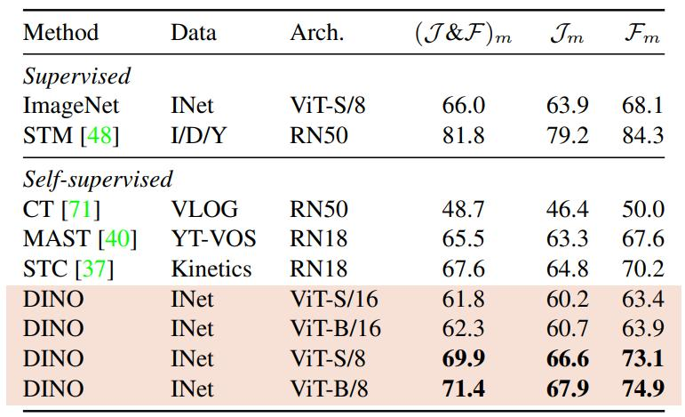

**表 5：DAVIS 2017 视频对象分割**。 我们评估了冻结特征在视频实例跟踪中的质量。 我们报告了平均区域相似度 $\mathcal{J}_m$ 和平均轮廓精度 $\mathcal{F}_m$ 。 我们将与现有的自监督方法和在 ImageNet 上训练的监督 ViT-S/8 进行比较。 图像分辨率为 480p。

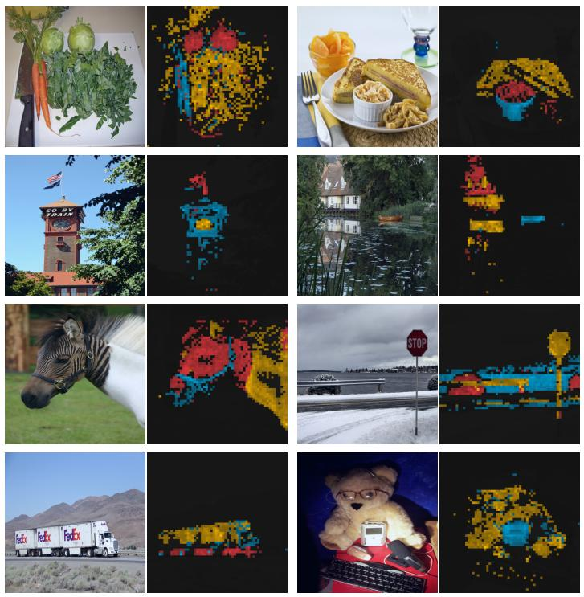

**图 3：多个头部的注意力图**。 我们考虑了使用 DINO 训练的 ViT-S/8 的最后一层的头部， 并显示了 [CLS] token 查询的自注意力。 不同的头部，由不同的颜色体现， 专注于代表不同对象或部分的不同位置（更多示例见附录）。

#### 4.2.2 Discovering the semantic layout of scenes

如图 1 中定性所示，我们的自注意力图包含有关图像分割的信息。在本研究中，我们通过标准基准测试以及直接探测从这些注意力图生成的掩码的质量来衡量此属性。

**视频实例分割**：在表 5 中，我们评估了在 DAVIS-2017 视频实例分割基准 [52] 上的输出 patch tokens。我们遵循 Jabri 等人 [37] 中的实验协议，并使用连续帧之间的最近邻来分割场景；因此，我们不会在特征之上训练任何模型，也不会微调任何权重以适应任务。我们在表 5 中观察到，尽管我们的训练目标和架构不是为密集任务设计的，但该性能在该基准上具有竞争力。由于网络未经微调，因此模型的输出必须保留一些空间信息。最后，对于此密集识别任务，具有小 patch（“/8”）的变体表现要好得多（ViT-B 的 (J & F)m 提高了 9.1%）。

**探测自注意力图**：在图 3 中，我们显示了不同的头可以关注图像的不同语义区域，即使它们被遮挡（第三行中的灌木丛）或很小（第二行中的旗帜）。可视化是使用 480p 图像获得的，因此产生 3601 个 tokens 的序列用于 ViT-S/8。在图 4 中，我们显示了监督的 ViT 无法很好地关注杂乱环境中的对象，无论是定性还是定量。我们报告了通过对自注意力图进行阈值处理以保持 60% 的质量获得的标注 (GT) 和分割掩码之间的 Jaccard 相似度。请注意，自注意力图是平滑的，并且没有针对生成掩码进行优化。尽管如此，我们仍然看到了监督模型或 DINO 模型之间存在明显的差异，在 Jaccard 相似度方面存在显着差距。请注意，自监督卷积神经网络也包含有关分割的信息，但需要专用方法才能从其权重中提取 [31]。

#### 4.2.3 Transfer learning on downstream tasks

在表 6 中，我们评估了使用 DINO 预训练的特征在不同下游任务上的质量。我们将与在 ImageNet 上使用监督训练的相同架构的特征进行比较。我们遵循 Touvron 等人 [69] 中使用的协议，并在每个下游任务上微调特征。我们观察到，对于 ViT 架构，自监督预训练比使用监督训练的特征转移得更好，这与卷积神经网络上的观察结果一致 [10, 33, 62]。最后，自监督预训练大大提高了 ImageNet 的结果 (+1-2%)。

## 5. Ablation Study of DINO

在本节中，我们凭经验研究了应用于 ViT 的 DINO。本研究中考虑的模型是 ViT-S。我们还请读者参考附录以获取其他研究。

### 5.1. Importance of the Different Components

我们展示了将来自自监督学习的不同组件添加到使用我们的框架训练的 ViT 的影响。

在表 7 中，我们报告了添加或删除组件的不同模型变体。首先，我们观察到在没有动量的情况下，我们的框架不起作用（第 2 行），并且需要更高级的操作，例如 SK，来避免崩溃（第 9 行）。但是，使用动量时，使用 SK 的影响很小（第 3 行）。此外，比较第 3 行和第 9 行突出了动量编码器对性能的重要性。其次，在第 4 行和第 5 行中，我们观察到多裁剪训练和 DINO 中的交叉熵损失是获得良好特征的重要组成部分。我们还观察到，向学生网络添加预测器的影响很小（第 6 行），而它对于防止 BYOL 崩溃至关重要 [16, 30]。为了完整性，我们在附录 B 中提出了此消融研究的扩展版本。

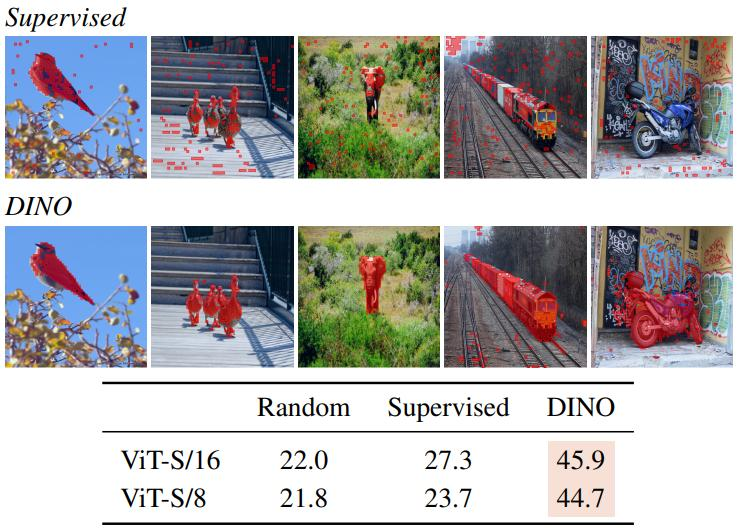

**图 4：监督与 DINO 的分割**。 我们可视化了通过对自注意力图进行阈值处理以保留 60% 质量而获得的掩码。 在顶部，我们显示了使用监督和 DINO 训练的 ViT-S/8 的结果掩码。 我们展示了两种模型的最佳头部。 底部的表比较了 PASCAL VOC12 数据集的验证图像上地面实况与这些掩码之间的 Jaccard 相似度。

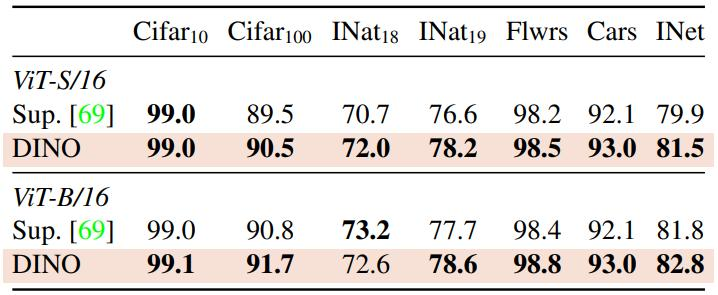

**表 6：通过微调预训练模型在不同数据集上的迁移学习**。 我们报告 top-1 准确率。 使用 DINO 的自监督预训练比监督预训练具有更好的迁移性。

**patch 大小的重要性**：在图 5 中，我们比较了使用不同 patch 大小（16 × 16、8 × 8 和 5 × 5）训练的 ViT-S 模型的 k-NN 分类性能。我们还与使用 16 × 16 和 8 × 8  patch 的 ViT-B 进行了比较。所有模型均训练了 300 个 epochs。我们观察到，随着 patch 大小的减小，性能大大提高。有趣的是，性能可以大大提高而无需添加额外的参数。但是，使用较小补丁的性能提升是以吞吐量为代价的：当使用 5×5 patch 时，吞吐量下降到 44 im/s，而 8×8 patch 的吞吐量为 180 im/s。

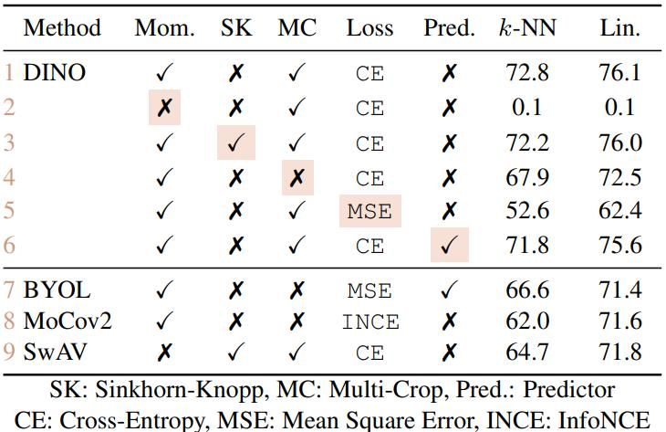

**表 7：自监督 ViT 预训练的重要组件**。 模型使用 ViT-S/16 训练 300 个 epochs。 我们研究了对 k-NN 和线性（“Lin.”）评估重要的不同组件。 对于不同的变体，我们高亮了与默认 DINO 设置的差异。 最佳组合是具有多裁剪增强和交叉熵损失的动量编码器。 我们还报告了 BYOL [30]、MoCo-v2 [15] 和 SwAV [10] 的结果。

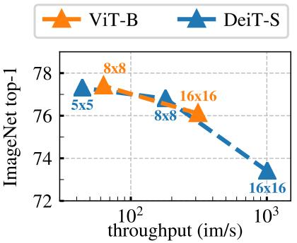

**图 5：Patch 大小的影响**。 k-NN 评估作为不同输入 patch 大小的吞吐量的函数， 使用 ViT-B 和 ViT-S。 模型训练了 300 个 epochs。

### 5.2. Impact of the choice of Teacher Network

在此消融研究中，我们尝试了不同的教师网络来了解其在 DINO 中的作用。我们比较了使用 k-NN 协议训练 300 个 epochs 的不同模型。

**从学生构建不同的教师**：在图 6（右）中，我们比较了从学生的先前实例构建教师的不同策略，除了动量教师之外。首先，我们考虑使用先前 epoch 的学生网络作为教师。此策略已用于内存库 [73] 或作为一种聚类硬蒸馏 (hard-distillation) [8, 2, 14]。其次，我们考虑使用前一个迭代的学生网络以及学生的副本作为教师。在我们的设置中，使用基于学生近期版本的教师不会收敛。此设置需要更多的规范化才能工作。有趣的是，我们观察到使用先前 epoch 的教师不会崩溃，在 k-NN 评估中提供的性能与 MoCo-v2 或 BYOL 等现有框架具有竞争力。虽然使用动量编码器显然提供了优于这个朴素教师的性能，但这一发现表明存在探索教师替代方案的空间。

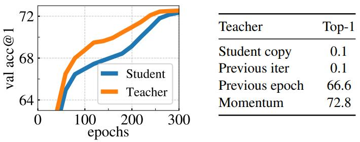

**图 6：k-NN 分类器在 ImageNet 验证集上的 Top-1 准确率**。 （左）训练过程中动量教师和学生的性能比较。 （右）不同类型教师网络的比较。 动量编码器可带来最佳性能，但不是唯一可行的选项。

**分析训练动态**：为了进一步了解动量教师在我们的框架中表现良好的原因，我们在图 6 的左面板中研究了其在 ViT 训练期间的动态。一个关键观察结果是，该教师在训练期间始终优于学生，并且我们在使用 ResNet-50 训练时也观察到了相同的行为（附录 D）。其他也使用动量的框架 [33, 30] 以及当教师由前一个 epoch 构建时，没有观察到这种行为。我们建议将 DINO 中的动量教师解释为具有指数衰减的 Polyak-Ruppert 平均 [51, 59] 的一种形式。Polyak-Ruppert 平均通常用于模拟模型集成以提高网络在训练结束时的性能 [38]。我们的方法可以解释为在训练期间应用 Polyak-Ruppert 平均，以不断构建具有优越性能的模型集成。然后，该模型集成指导学生网络的训练 [65]。

### 5.3. Avoiding collapse

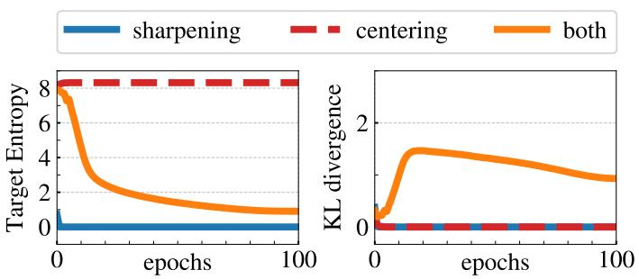

**图 7：崩溃研究**。（左）：教师目标熵随训练 epochs 的演变；（右）：教师和学生输出之间 KL 散度的演变。

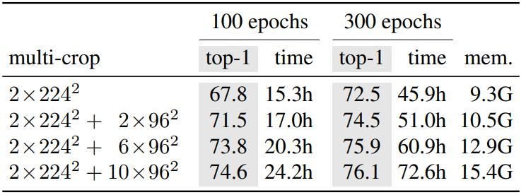

**表 8：时间和内存需求**。 我们展示了在两台 8-GPU 机器上运行 ViT-S/16 DINO 模型时的总运行时间和每个 GPU 的峰值内存（“mem.”）。 我们报告了具有线性评估的几种多裁剪变体的 top-1 ImageNet val acc， 每种变体具有不同的计算要求级别。

我们研究了中心化和目标锐化在避免崩溃中的互补作用。有两种形式的崩溃：无论输入如何，模型输出在所有维度上都是均匀的或由一个维度主导。中心化避免了由主导维度引起的崩溃，但鼓励均匀输出。锐化则产生相反的效果。我们通过将交叉熵 $H$ 分解为熵 $h$ 和 Kullback-Leibler 散度 (“KL”) $D_{KL}$ 来证明这种互补性：

$$
\large H(P_t, P_s) = h(P_t) + D_{KL}(P_t | P_s). \tag{5}
$$

KL 等于零表示恒定输出，因此表示崩溃。在图 7 中，我们绘制了训练期间有和没有中心化和锐化的熵和 KL。如果缺少一项操作，则 KL 收敛到零，表示崩溃。但是，熵 $h$ 收敛到不同的值：没有中心化时为 0，没有锐化时为 $-\log(1/K)$ ，表明两种操作都会引起不同形式的崩溃。应用这两种操作可以平衡这些影响（参见附录 D 中对锐化参数 $\tau_t$ 的研究）。

### 5.4. Compute requirements

在表 8 中，我们详细说明了在两台 8-GPU 机器上运行 ViT-S/16 DINO 模型的时间和 GPU 内存要求。我们报告了多裁剪训练的几个变体的结果，每个变体都有不同的计算要求级别。我们在表 8 中观察到，使用多裁剪可以改善 DINO 运行的准确性/运行时间权衡。例如，在 46 小时无多裁剪（即 $2 \times 224^2$ ）训练后，性能为 72.5%，而在 $2 \times 224^2 + 10 \times 96^2$ 裁剪设置中，DINO 仅在 24 小时内达到 74.6%。这是 +2% 的改进，同时所需时间减少了 2 倍，尽管内存使用量更高（15.4G 对比 9.3G）。我们观察到，使用多裁剪带来的性能提升无法通过在 $2 \times 224^2$ 设置中进行更多训练来弥补，这展现了“局部到全局”增强的价值。最后，添加更多视图的收益随着训练时间的延长而减少（从 $6 \times$ 到 $10 \times 96^2$ 裁剪 +0.2%）。

总体而言，使用 Vision Transformers 训练 DINO 在 3 天内使用两台 8-GPU 服务器实现了 76.1 的 top-1 准确性。该结果优于基于可比较大小的卷积神经网络的最先进的自监督系统，同时显着降低了计算要求 [30, 10]。我们的代码可用于在有限数量的 GPU 上训练自监督 ViT。

### 5.5. Training with small batches

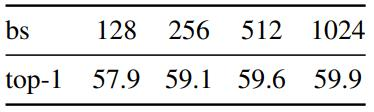

**表 9：批量大小的影响**。 使用 k-NN 训练 100 个 epochs 且无多裁剪的模型的 Top-1。

在表 9 中，我们研究了批量大小对使用 DINO 获得的特征的影响。我们还研究了公式 4（附录D）的中心化更新规则中使用的平滑参数 $m$ 的影响。我们将学习率与批量大小线性缩放[29]： $lr = 0.0005 * \mathrm{batchsize}/256$ 。 表 9 证实了我们可以用小批量训练模型到高性能。较小批量大小（ $bs = 128$ ）的结果略低于我们的默认训练设置 $bs = 1024$ ，并且肯定需要重新调整超参数，例如动量率。请注意，批量大小为 128 的实验仅在 1 个GPU上运行。 我们已经探索了使用 8 的批量大小训练模型，在 50 个 epochs 后达到 35.2%，展示了训练每个 GPU 几乎只能容纳一张图像的大型模型的潜力。

## 6. Conclusion

在这项工作中，我们展示了自监督预训练标准 ViT 模型的潜力，实现了与为此设置专门设计的最佳卷积神经网络相当的性能。我们还观察到出现了两种可以在未来应用中利用的特性：k-NN 分类中特征的质量对于图像检索具有潜力，其中 ViT 已经显示出有希望的结果 [22]。特征中存在有关场景布局的信息也可以使弱监督图像分割受益。然而，本文的主要结果是我们有证据表明自监督学习可能是开发基于 ViT 的 BERT 式模型的关键。在未来，我们计划探索使用 DINO 在随机未整理的图像上对大型 ViT 模型进行预训练是否可以突破视觉特征的极限 [28]。

## Appendix

### A. Additional Results

**k-NN 分类**。 在表 10 中，我们使用两种评估协议（线性或 k-NN）评估了由 ResNet-50 或 ViT-small 预训练的 DINO 给出的冻结表示。 对于两种评估，我们从预训练网络中提取表示，而无需使用任何数据增强。 然后，我们使用加权 k-NN 或使用 cyanure 库 [45] 学习的线性回归进行分类。 在表 10 中，我们看到 ViT-S 准确率优于使用 RN50 获得的准确率，无论是使用线性分类器还是 k-NN 分类器。 然而，使用 k-NN 评估时的性能差距比考虑线性评估时要大得多。 例如，在 ImageNet 1% 上，ViT-S 以 +14.1% 的巨大优势优于 ResNet-50，采用 k-NN 评估。 这表明使用 DINO 训练的 Transformer 架构可能提供更多有利于 k-NN 评估的模型灵活性。 K-NN 分类器具有部署快速轻便的巨大优势，无需任何领域适应。 总体而言，使用 DINO 训练的 ViT 提供了与 k-NN 分类器特别结合的特征。

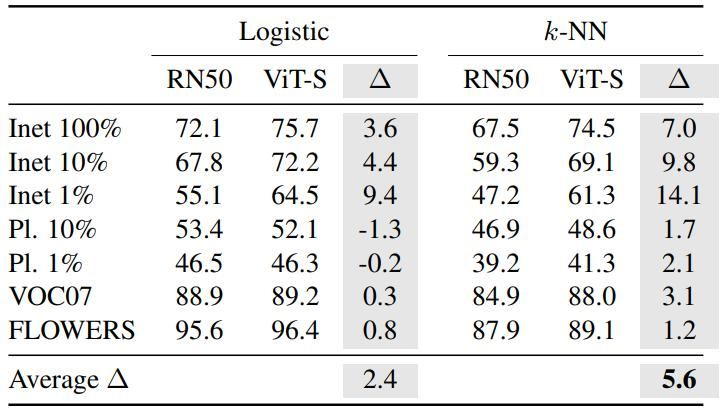

**表 10**：

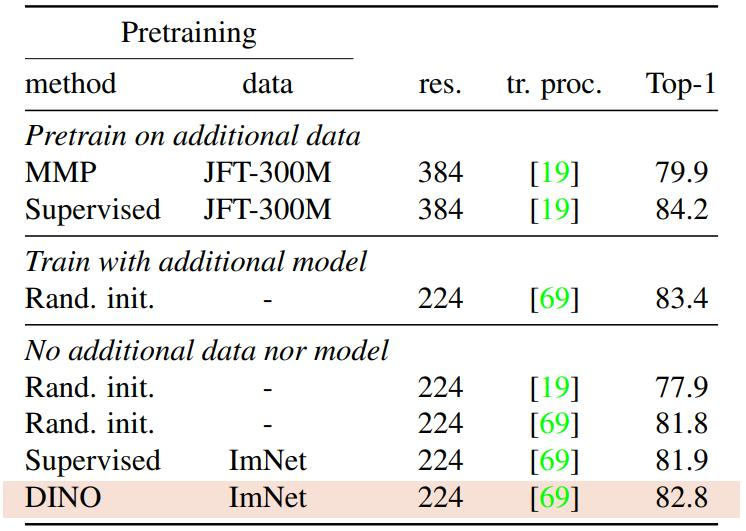

**表 11**：

**ViT 的自监督的 ImageNet 预训练**。 在此实验中，我们研究了使用我们的方法对监督 ViT 模型进行预训练的影响。 在表 11 中，我们比较了监督 ViT 模型的性能，这些模型使用不同的预训练进行初始化或在训练期间使用额外的预训练卷积网络进行引导。 第一组模型在大型精选数据集（由 3 亿张图像组成）上进行监督和无监督预训练。 第二组模型使用来自预训练的监督 RegNetY [56] 的硬知识蒸馏进行训练。 最后一组模型不使用任何额外的数据或模型，并且要么随机初始化，要么在使用 DINO 在 ImageNet 上进行预训练之后进行初始化。 与随机初始化相比，使用 DINO 进行预训练可带来 +1% 的性能提升。 这不是由于更长的训练时间造成的，因为使用监督而不是 DINO 进行预训练不会提高性能。 使用自监督预训练减少了与在额外数据上预训练或从卷积网络蒸馏的模型之间的差距。

**ImageNet 上的少样本学习**。 我们评估了在低样本学习中应用于 ViT-S 的 DINO 获得的特征。 在表 12 中，我们报告了在 1% 和 10% 标签上训练的冻结特征 (FROZEN) 的逻辑回归的验证准确性。 逻辑回归是使用 cyanure 库 [45] 训练的。 当比较具有相似参数数量和图像/秒的模型时，我们观察到我们的特征与最先进的半监督模型相当。 有趣的是，这种性能是通过在冻结特征上训练多类逻辑回归获得的，无需数据增强或微调。

### B. Methodology Comparison

我们比较了使用卷积网络或 ViT 时不同自监督框架 MoCo-v2 [15]、SwAV [10] 和 BYOL [30] 的性能。 在表 13 中，我们看到当使用 ResNet-50（卷积网络）训练时，DINO 的性能与 SwAV 和 BYOL 相当。 然而，DINO 在 ViT 上发挥了其潜力，以较大优势超过 MoCo-v2、SwAV 和 BYOL（线性评估 +4.3%，k-NN 评估 +6.2%）。 在本节的其余部分，我们进行消融研究以更好地了解 DINO 应用于 ViT 的性能。 特别是，我们提供了与使用动量编码器的 MoCo-v2 和 BYOL 以及使用多裁剪的 SwAV 方法的详细比较。

与 MoCo-v2 和 BYOL 的关系。 在表 14 中，我们展示了消融 DINO、MoCo-v2 和 BYOL 之间不同组件的影响：损失的选择、学生头中的预测器、居中操作、投影头中的批量归一化，以及最后的多裁剪增强。 DINO 中的损失是对尖锐 softmax 输出的交叉熵 (CE)，而 MoCo-v2 使用 InfoNCE 对比损失 (INCE)，BYOL 使用 l2 归一化输出的均方误差 (MSE)。 MSE 标准没有应用锐化。 虽然，当将损失函数更改为 MSE 时，DINO 仍然令人惊讶地有效，但这会显着改变性能（见行 (1, 2) 和 (4, 9)）。 我们还观察到，添加预测器几乎没有影响 (1, 3)。 然而，在 BYOL 的情况下，预测器对于防止崩溃至关重要 (7, 8)，这与之前的研究 [16, 30] 一致。 有趣的是，我们观察到教师输出居中在没有预测器或批量归一化的情况下避免了 BYOL 中的崩溃 (7, 9)，尽管性能显着下降，这可能可以通过我们的居中操作设计为与锐化相结合来解释。 最后，我们观察到多裁剪与 DINO 和 MoCo-v2 协同作用特别好，移除它会使性能下降 2-4% (1 与 4 以及 5 与 6)。 将多裁剪添加到 BYOL 中不能开箱即用 (7, 10)，如附录 E 中所述，可能需要进一步的调整。
