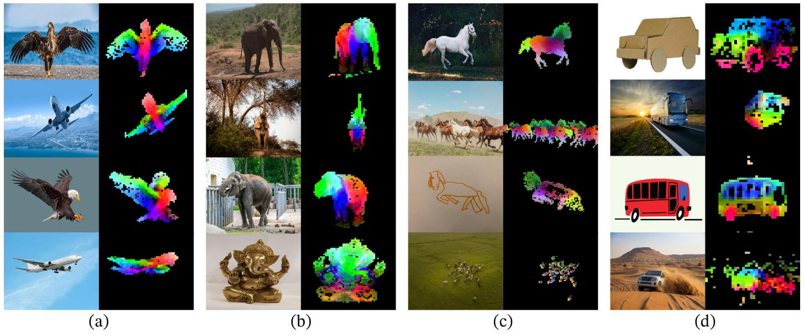
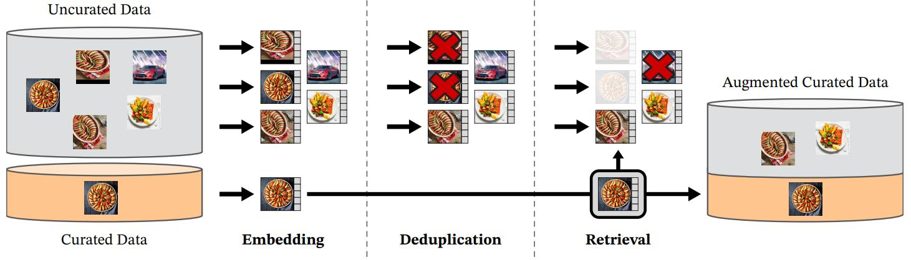

# [DINOv2: Learning Robust Visual Features without Supervision](https://arxiv.org/abs/2304.07193)

## Abstract

最近自然语言处理中在大量数据上进行模型预训练的突破，为计算机视觉领域中类似的基础模型开辟了道路。这些模型可以通过生成通用视觉特征（即无需微调即可在不同的图像分布和任务中起作用的特征），极大地简化在任何系统中使用图像的过程。这项工作表明，现有的预训练方法，特别是自监督方法，如果在使用来自不同来源的足够多且经过整理的数据进行训练时，就能够产生这样的特征。我们重新审视了现有的方法，并结合了不同的技术，从而在数据和模型规模方面扩展我们的预训练。大部分的技术贡献旨在加速并稳定大规模的训练过程。在数据方面，我们提出了一种自动化的流程，用于构建一个专用的、多样化的且经过整理的图像数据集，而不是像自监督文献中通常的做法那样使用未经整理的数据。在模型方面，我们训练了一个包含 10 亿参数的 ViT 模型 (Dosovitskiy et al., 2021)，并将其蒸馏成一系列较小的模型，这些模型在图像和像素级别的大多数基准测试中，都超越了目前可用的最佳通用特征 OpenCLIP (Ilharco et al., 2021)。

**图 1**：

## 1 Introduction

学习任务无关的预训练表示已经成为自然语言处理（NLP）领域的标准 (Radford et al., 2019; Raffel et al., 2020; Chowdhery et al., 2022; Hoffmann et al., 2022; Touvron et al., 2023)。人们可以“原封不动”地使用这些特征，即无需微调，并在下游任务上取得明显优于特定任务模型所产生的性能 (Brown et al., 2020)。这种成功得益于使用代理目标（如语言建模 (Radford et al., 2017) 或词向量 (Devlin et al., 2019)）在大量原始文本上进行预训练，这些目标不需要任何监督。

随着 NLP 领域的这种范式转变，我们预计类似的“基础”模型也会出现在计算机视觉领域 (Bommasani et al., 2021)。这些模型应该生成能够在任何任务上开箱即用的视觉特征，包括图像级别（如图像分类）和像素级别（如分割）。针对这些基础模型的最具前景的努力集中在文本引导的预训练上，即使用一种形式的文本监督来引导特征的训练 (Joulin et al., 2016; Mahajan et al., 2018; Radford et al.,2021)。这种文本引导的预训练形式限制了可以保留的关于图像的信息，因为标题只能近似表示图像中丰富的信息，而复杂的像素级信息可能无法在这种监督下显现出来。此外，这些图像编码器需要对齐的文本-图像语料库，因此不具备其文本对应物那样的灵活性，即仅从原始数据中学习。

文本引导预训练的一种替代方案是自监督学习 (Caron et al., 2018; Chen et al., 2020; He et al., 2022)，在这种方法中，特征仅从图像中学习。这些方法在概念上更接近于语言建模等代理任务，并且可以捕获图像和像素级别的信息 (Caron et al., 2021)。此外，自监督模型输出的特征已被证明具有各种有用的属性，并促成了广泛的应用 (Amir et al., 2022; Tumanyan et al., 2022; Ofri-Amar et al., 2023; Hamilton et al., 2022)。然而，尽管它们具有学习通用特征的潜力，但自监督学习的大多数进展都是在小型且经过整理的数据集 ImageNet-1k (Russakovsky et al., 2015) 上进行预训练的背景下取得的。已经有一些尝试将这些方法扩展到 ImageNet-1k 之外 (Caron et al., 2019; Goyal et al., 2021; 2022a)，但它们集中在未经整理的数据集上，这通常会导致特征质量的显著下降。解释这一现象的原因是缺乏对数据质量和多样性的控制，而这对于产生优秀的特征至关重要。

在这项工作中，我们探讨了如果在使用大量经过整理的数据进行预训练时，自监督学习是否具有学习通用视觉特征的潜力。我们重新审视了现有的在图像和图像块级别学习特征的判别式自监督方法，例如 iBOT (Zhou et al., 2022a)，并在更大数据集的视角下重新考虑了它们的一些设计选择。我们的大部分技术贡献旨在当模型和数据规模扩展时，稳定并加速判别式自监督学习。这些改进使我们的方法比类似的判别式自监督方法快约 2 倍，所需内存少 3 倍，从而使我们能够利用更大的批次大小进行更长时间的训练。

在预训练数据方面，我们构建了一个自动化流程，用于从大量未经整理的图像集合中过滤和重新平衡数据集。该流程受到了 NLP 中所用流程的启发 (Wenzek et al., 2020)，其中使用了数据相似性而不是外部元数据，且不需要人工标注。在处理真实世界图像时，一个主要困难是重新平衡概念并避免在少数主导模式上过拟合。在这项工作中，一种朴素的聚类方法在解决这一问题上表现得相当不错。我们收集了一个包含 1.42 亿张图像的小型但多样化的语料库来验证我们的方法。

最后，我们提供了多种预训练视觉模型，称为 DINOv2，它们是使用不同的视觉 Transformer（ViT）(Dosovitskiy et al., 2016) 架构在我们的数据上训练的。我们发布了所有模型以及在任何数据上重新训练 DINOv2 的代码。如图 2 所总结的，随着我们的扩展，我们在图像和像素级别的各种计算机视觉基准测试上验证了 DINOv2 的质量。我们得出结论，仅靠自监督预训练本身就是学习可迁移冻结特征的一个良好候选方案，这些特征能够与现有的最佳开源弱监督模型相媲美。

## 2 Related Work

**图像内自监督训练**。自监督方法的第一类侧重于从图像自身构建预训练任务，即从图像中提取信号，并从图像的其余部分预测该信号。Doersch 等人 (2015) 的工作使这种思想开始流行，他们在工作中通过预测给定图像 patch 的上下文进行训练。许多其他预训练任务也被提出，例如基于以下方法：图像重着色 (Zhang 等人., 2016)、预测图像变换 (Gidaris 等人., 2018)、图像修复 (Pathak 等人., 2016) 或图像块重排序 (Noroozi & Favaro, 2016; Misra & Maaten, 2020)。近期，基于图像块的架构（如 ViT）的兴起，再次引发了对图像修复在预训练中应用的研究 (He 等人., 2022; Bao 等人., 2021; El-Nouby 等人., 2021)，甚至可能在特征空间中进行修复 (Assran 等人., 2023; Baevski 等人., 2022)。尤其值得关注的是，He 等人 (2022) 表明，掩码自编码器 (MAE) 学习到的特征在下游任务上进行微调时，可以带来显著的性能提升。MAE 的这一特性已在视频 (Tong 等人., 2022)、音频 (Xu 等人., 2022) 以及其他模态 (Girdhar 等人., 2023) 上得到了进一步验证。然而，他们的特征需要有监督的微调，而我们的特征则开箱即用，性能良好。

**判别式自监督学习**。第二类工作，更接近于我们的方法，是利用图像之间或图像组之间的判别式信号来学习特征。这类方法起源于早期的深度学习工作 (Hadsell 等人., 2006)，但随着实例分类方法 (Dosovitskiy 等人., 2016; Bojanowski & Joulin, 2017; Wu 等人., 2018) 的兴起而变得流行。许多改进是基于实例级别的目标函数 (Hénaff 等人., 2019; He 等人., 2020; Chen & He, 2021; Chen 等人., 2020; Grill 等人., 2020; Caron 等人., 2021) 或聚类 (Caron 等人., 2018; Asano 等人., 2020; Caron 等人., 2020) 而提出的。这些方法在诸如 ImageNet (Russakovsky 等人., 2015) 等标准基准测试上提供了性能优异的冻结特征，但它们难以扩展到更大的模型尺寸 (Chen 等人., 2021)。在这项工作中，我们将在大型预训练数据集和模型的背景下，重新审视这些方法的训练。 特别是，我们基于 Zhou 等人 (2022a) 的工作进行构建，我们发现该方法特别适合扩展。

**扩展自监督预训练**。越来越多的研究工作开始关注自监督学习在数据和模型规模上的扩展能力 (Caron 等人., 2019; Goyal 等人., 2019; Tian 等人., 2021; Goyal 等人., 2022a)。这些研究工作大多使用大量的未校正数据来训练无监督模型。它们表明判别式方法可以随数据规模扩展，但由于预训练数据的质量较差，大部分结果是通过微调特征获得的。尤其值得关注的是，Goyal 等人 (2021) 也表明，在给定足够多的预训练数据的情况下，这些方法能够受益于模型规模的扩展。这类工作质疑了自监督方法在任意数据上工作的能力，而我们的重点是生成最佳的预训练编码器。

**自动数据校正**。我们的数据集构建借鉴了图像检索领域的思路 (Weinzaepfel 等人., 2021; Radenović 等人., 2018b; Berman 等人., 2019; Douze 等人., 2009; Tolias 等人., 2016; Revaud 等人., 2019)。特别地，在半监督学习的背景下，检索技术已被用于扩充训练集的研究 (Yalniz 等人., 2019)。类似地，其他人也使用主题标签或其他元数据 (Mahajan 等人., 2018; Radford 等人., 2021) 或预训练的视觉编码器 (Schuhmann 等人., 2021; 2022) 来过滤未校正的数据集。与这些工作不同，我们不使用预训练的编码器、元数据或监督信息来过滤图像，而是利用图像之间的视觉相似性。我们的方法受到文本校正流程 (Wenzek 等人., 2020) 的启发，该流程在维基百科上训练语言模型，以评估从未校正来源提取的文本的质量。

## 3 Data Processing

我们通过从大型的未校正数据池中检索与多个校正过的数据集中图像相似的图像，来构建我们校正过的 LVD-142M 数据集。下面我们将描述我们数据管线的主要组成部分，包括校正过的/未校正过的数据来源、图像去重步骤和检索系统。我们的管线不需要任何元数据或文本，并且直接处理图像，如图 3 所示。我们建议读者参考附录 A，以了解更多关于我们方法的细节。

**图 3**：

**数据来源**。我们选择的校正过的数据集在附录中详细列出 (表 15)，包括 ImageNet-22k、ImageNet-1k 的训练集划分、Google Landmarks 和几个细粒度数据集。对于未校正的数据来源，我们从一个公开可用的网络爬取数据仓库中收集了一个原始的、未过滤的图像数据集。从仓库中的每个网页中，我们从 `` 标签中提取图像的 URL 链接。我们丢弃不安全或受域限制的 URL，并对下载的图像进行后处理 (PCA 哈希去重、NSFW 过滤和模糊可识别的面部)。这得到了 12 亿张独特的图像。

**去重**。我们对未校正的数据应用 Pizzi 等人 (2022) 的重复检测管线，并移除近重复图像。这减少了冗余，并增加了图像之间的多样性。我们还移除了本工作中使用的任何基准测试的测试集或验证集中包含的图像的近重复项。

**自监督图像检索**。我们通过从我们的未校正数据来源中检索与我们的校正数据来源中的图像相似的图像，来构建我们校正过的预训练数据集。为了做到这一点，我们首先使用在 ImageNet-22k 上预训练的自监督 ViT-H/16 网络计算图像嵌入，并使用余弦相似度作为图像之间的距离度量。然后，我们对未校正的数据执行 k-means 聚类。给定一个用于检索的查询数据集，如果它足够大，我们为每个查询图像检索 N 个 (通常为 4 个) 最近邻。如果它很小，我们从对应于每个查询图像的聚类中采样 M 个图像。虽然视觉检查似乎表明对于远大于 4 的 N 值具有良好的检索质量，但这会导致更多的冲突 (图像是多个查询的最近邻检索结果)。我们选择 N=4，因为它在这方面提供了良好的折衷方案。

**实现细节**。我们管线的去重和检索阶段依赖于 Faiss 库 (Johnson et al., 2019)，以高效地索引和计算最近邻嵌入的批量搜索。特别地，我们很大程度上利用了 Faiss 库对 GPU 加速索引的支持，使用带有乘积量化代码的倒排文件索引 (Jegou et al., 2010)。整个处理过程分布在一个包含 20 个节点（每个节点配备 8 个 V100-32GB GPU）的计算集群上，生成 LVD-142M 数据集花费不到两天时间。

## 10 Future work and Discussion

在这项工作中，我们介绍了 DINOv2，这是一系列在大型筛选数据上进行无监督预训练的图像编码器。这是首个在图像数据上进行自监督学习的工作，其视觉特征在广泛的基准测试中与 (弱) 监督替代方案的性能差距不大，并且无需微调。我们可以将 DINOv2 系列模型的强大性能归因于以下几个因素：i) 改进的训练配方，包括更好的超参数和正则化 (表 1)，ii) 更大的模型规模，无论用于训练的数据如何，性能都有改进 (图 4)，iii) 更大的数据集 (图 4)，以及iv) 蒸馏过程使较小的模型受益于最强的 ViT-g 模型的性能 (图 5) 。这些模型呈现出一些特性，例如对物体部分和场景几何的理解，无论图像领域如何。我们预计在更大规模的模型和数据下，会出现更多这些特性，类似于大型语言模型中的指令出现，并计划继续在这些方面进行扩展。此外，本文还证明了这些视觉特征与简单的分类器 (例如线性层) 兼容，这意味着底层信息是可以直接获取的。在未来的工作中，我们计划利用这种能力来训练一个具有语言功能的 AI 系统，该系统可以处理视觉特征，就像它们是词 token 一样，并提取所需的信息来支持系统。