# [A COMPREHENSIVE REVIEW OF YOLO: FROM YOLOV1 AND BEYOND](https://arxiv.org/abs/2304.00501)

## Abstract

YOLO 已经成为机器人、无人驾驶汽车和视频监控应用的核心实时目标检测系统。我们全面分析了 YOLO 的演变，检验了从原始 YOLO 到 YOLOv8、YOLO-NAS 和带 Transformer 的 YOLO 每一代的创新和贡献。我们首先描述标准指标和后处理，然后讨论每个模型在网络架构和训练技巧上的主要变化。最后，我们总结 YOLO 开发的重要经验教训，并对其未来提供视角，重点介绍增强实时目标检测系统性能的潜在研究方向。

**Keywords** YOLO · Object detection · Deep Learning · Computer Vision

## 1 Introduction

实时目标检测已成为许多应用中的关键组成部分，涵盖了自动驾驶汽车、机器人、视频监控和增强现实等各个领域。在不同的目标检测算法中，YOLO (You Only Look Once) 框架因其出色的速度和准确性而脱颖而出，使图像中的物体能够快速且可靠地被识别出来。自诞生以来，YOLO 系列已经经历了多次迭代，每一次都在前一版本的基础上进行改进，以解决局限性并提高性能 (见图 1)。本文旨在全面回顾 YOLO 框架的发展，从最初的 YOLOv1 到最新的 YOLOv8，阐明了每个版本之间的关键创新、差异和改进。

除了 YOLO 框架之外，目标检测和图像处理领域还发展出了其他一些值得注意的方法。例如，R-CNN (基于区域的卷积神经网络) [1]及其后续版本 Fast R-CNN [2]和 Faster R-CNN [3]在提高目标检测的准确性方面发挥了关键作用。这些方法依赖于一个两阶段的过程：选择性搜索生成区域候选，卷积神经网络对这些区域进行分类和细化。另一个重要的方法是 Single-Shot MultiBox Detector (SSD)，类似于 YOLO，它专注于速度和效率，通过消除独立的区域建议步骤来实现。此外，像Mask R-NN 这样的方法扩展了实例分割的能力，实现了精确的目标定位和像素级分割。这些发展，以及其他方法如 RetinaNet 和 EfficientDet，共同构成了目标检测算法多样化的格局。每种方法都在速度、准确性和复杂性之间存在独特的权衡，以满足不同的应用需求和计算限制。

其他伟大的综述包括[8,9,10]。 但是 [8] 的综述只包括到 YOLOv3，[9] 只包括到YOLOv4，落后于最新发展。我们的论文与[10]不同，展示了大多数 YOLO 架构的深入架构，并涵盖其他变体，如 YOLOX、PP-YOLO、带 transformers 的 YOLO 和 YOLO-NAS。

本文首先探讨了原始 YOLO 模型的基础概念和架构，这为 YOLO 系列的后续进步奠定了基础。在此之后，我们深入探讨了从 YOLOv2 到 YOLOv8 的每个版本中引入的改进和增强。这些改进涵盖了网络设计、损失函数修改、锚框适应以及输入分辨率缩放等各个方面。通过检查这些发展，我们旨在全面理解 YOLO 框架的演变及其对目标检测的意义。

除了讨论每个 YOLO 版本的具体改进，本文还突出了 YOLO 框架发展过程中速度与准确性之间的权衡。这强调了在选择最合适的 YOLO 模型时，考虑特定应用的上下文和要求的重要性。最后，我们展望了 YOLO 框架的未来发展方向，概述了进一步研究和开发的潜在途径，这将塑造实时目标检测系统的持续进步。

图 1：YOLO 版本的时间线

## 2 YOLO Applications Across Diverse Fields

YOLO 的实时目标检测能力对自主驾驶汽车系统具有莫大价值，可以快速识别和跟踪各种对象，如汽车、行人、自行车和其他障碍物。这些能力已经被应用于许多领域，包括视频监控中的行为识别、体育分析和人机交互。

YOLO 模型已被用于农业领域检测和分类农作物、病虫害，协助精准农业技术和自动化农业流程。它们还被改编用于生物识别、安全和面部识别系统中的人脸检测任务。

在医学领域，YOLO 已被用于癌症检测、皮肤分割和药片识别，提高了诊断准确率和治疗过程的效率。在遥感领域，它被用于卫星和航空图像中的目标检测和分类，协助土地利用制图、城市规划和环境监测。

安全系统集成了 YOLO 模型进行实时视频监控和分析，允许快速检测可疑活动、社交距离和戴口罩检测。这些模型还被应用于表面检测以检测缺陷和异常情况，提高了制造业和生产过程中的质量控制。

在交通应用中，YOLO 模型被用于车牌检测和交通标志识别等任务，有助于智能交通系统和交通管理解决方案的发展。它们被用于野生动物检测和监测，以识别濒危物种用于生物多样性保护和生态系统管理。最后，YOLO 被广泛用于机器人应用和无人机目标检测。图 2 显示了 Scopus 中找到的所有论文的文献计量网络可视化标题中包含 YOLO 一词，并通过对象检测关键字进行过滤。然后，我们手动过滤所有的论文与应用程序相关。

**图 2**：使用 [?] 创建的主要 YOLO 应用程序的文献计量网络可视化

## 3 Object Detection Metrics and Non-Maximum Suppression (NMS)

平均准确率 (Average Precision，AP)，传统上称为 Mean Average Precision，mAP，是评估目标检测模型性能的常用指标。它测量所有类别的平均准确率，提供一个值来比较不同模型。COCO 数据集不区分 AP 和 mAP。在本文其余部分，我们将此指标称为 AP。

在 YOLOv1 和 YOLOv2 中，用于训练和基准测试的数据集是 PASCAL VOC 2007 和 VOC 2012。然而，从 YOLOv3 开始，所用数据集是 Microsoft COCO (上下文中的常见物体)。这些数据集的 AP 计算方式不同。下节将讨论 AP 背后的原理，并解释其计算方式。

### 3.1 How AP works?

AP 指标基于精确率-召回率指标，处理多个物体类别，并使用交并比 (Intersection over Union， IoU) 来定义正样本预测。

**精确率和召回率**：精确率衡量模型正样本预测的准确度，而召回率衡量模型正确识别的实际正样本的比例。精确率和召回率通常存在权衡；例如，增加检测物体数量 (更高的召回率) 可能导致更多假正样本 (更低的精确率)。为了考虑这种权衡，AP 指标结合了随不同置信度阈值绘制精确率-召回率曲线。该指标通过考虑精确率-召回率曲线下的面积来平衡评估精确率和召回率。

**处理多个物体类别**：目标检测模型必须识别图像中的多个物体类别并定位。AP 指标通过分别计算每个类别的平均准确率 (AP)，然后计算所有类别的 AP 均值来解决这个问题 (这也是为什么它也称为 mAP)。这种方法确保每个类别的性能都被单独评估，为模型的整体性能提供了更全面的评估。

**交并比**：目标检测旨在通过预测边界框准确定位图像中的物体。AP 指标结合使用交并比 (IoU) 测量来评估预测边界框的质量。IoU 是预测边界框和真值边界框交集面积与并集面积之比 (见图 2)。它测量真值和预测边界框之间的重叠面积。COCO 基准考虑多个 IoU 阈值来评估模型在不同定位准确度水平上的性能。

**图 3**：交并比 (IoU)。a) IoU的计算是将两个框的交集除以框的并集；b) 三个不同IoU值的示例，对应不同的框位置。

### 3.2 Computing AP

AP 在 VOC 和 COCO 数据集上的计算方式不同。本节将描述它在每个数据集上的计算方式。

#### VOC 数据集

该数据集包含 20 个物体类别。在 VOC 中计算 AP 的步骤如下:

1. 对每个类别，通过改变模型预测的置信度阈值计算精确率-召回率曲线。
2. 使用曲线的 11 点插值计算每个类别的平均准确率 (AP)。
3. 通过计算所有 20 个类别的 APs 均值获得最终的平均准确率 (AP)。

#### Microsoft COCO 数据集

该数据集包含 80 个物体类别，使用更复杂的方法计算 AP。它使用 101 点插值而不是 11 点插值，即它以 0.01 的步长计算从 0 到 1 的 101 个召回率阈值的精确率。此外，**AP 是通过多个 IoU 值的平均获得的**，而不仅仅是一个，除了一个常用的 AP 指标 $AP_{50}$ ，它是 IoU 阈值为 0.5 时的 AP。

在 COCO 中计算 AP 的步骤如下:

1. 对每个类别，通过改变模型预测的置信度阈值计算精确率-召回率曲线。
2. 使用 101 个召回率阈值计算每个类别的平均准确率 (AP)。
3. 计算不同交并比 (IoU) 阈值的 AP，通常从 0.5 到 0.95，步长为 0.05。更高的 IoU 阈值需要更准确的预测才能被视为真正例。
4. 对每个 IoU 阈值，计算所有 80 个类别的 AP 均值。
5. 最后，通过对每个 IoU 阈值计算的 AP 值平均获得总体 AP。

AP 计算的差异使得很难直接比较两个数据集上目标检测模型的性能。当前的标准是使用 COCO AP，因为它可以更细致地评估模型在不同 IoU 阈值下的表现。

### 3.3 Non-Maximum Suppression (NMS)

非极大值抑制 (Non-Maximum Suppression, NMS) 是目标检测算法中使用的一种后处理技术，用于减少重叠的边界框数量并提高整体检测质量。目标检测算法通常为同一目标生成多个具有不同置信度分数的边界框。NMS过滤掉冗余和不相关的边界框，只保留最准确的那些。算法 1 描述了该过程。图 4 显示了目标检测模型的典型输出，包含多个重叠的边界框，以及 NMS 后的输出。

**图 4**：非极大值抑制 (NMS)。a) 显示了目标检测模型的典型输出，其中包含多个重叠的框。b) 显示 NMS 后的输出。

> NMS 的工作原理如下:
>
> 
> 0. 过滤低于置信度阈值的边界框。
> 1. 对检测结果按置信度分数排序。
> 2. 选择置信度最高的边界框。
> 3. 计算其他所有边界框与该边界框的交集比例(IoU)。
> 4. 删除IoU大于阈值(如0.5)的边界框。
> 5. 重复步骤2-4，直到没有边界框剩余。
>
> 这样就可以删除大部分冗余和不准确的边界框，只保留置信度高且不重叠的边界框。NMS 是目标检测后处理中的标准操作，极大地提升了检测性能。

## 4 YOLO: You Only Look Once

YOLO 由 Joseph Redmon 等人在 2016 年 CVPR 上发表。它首次提出了一个端到端的实时目标检测方法。YOLO 代表“You Only Look Once”，意思是它能够在网络的一次前向传播中完成检测任务，而之前的方法要么使用滑动窗口后跟一个需要对每个图像运行数百次或数千次的分类器，要么使用更先进的两阶段方法，其第一步检测可能存在目标的区域或候选区域，第二步对候选区域运行分类器。此外，YOLO 使用了一种更直接的仅基于回归的输出来预测检测结果，而不是 Fast R-CNN 使用的两种独立输出，一种用于概率的分类，一种用于框坐标的回归。

### 4.1 How YOLOv1 works?

YOLOv1 通过同时检测所有边界框来统一目标检测步骤。为实现此目的，YOLO 将输入图像划分为一个 $S \times S$ 的网格，并为每个网格单元预测 $B$ 个同类边界框以及 $C$ 个不同类别的置信度。每个边界框预测由五个值组成： $P_c, bx, by, bh, bw$ ，其中 $P_c$ 是边界框置信度，反映模型对该框包含物体的置信程度及框的准确性。 $bx$ 和 $by$ 是框相对于网格单元的中心坐标， $bh$ 和 $bw$ 是框相对于整个图像的高度和宽度。YOLO 的输出是一个 $S \times S \times (B \times 5 + C)$ 的张量，可选地后面跟着非极大值抑制 (NMS) 来消除重复检测。

在原始 YOLO 论文中，作者使用 PASCAL VOC 数据集，其中包含 20 类 $(C=20)$ ; $7\times7$ 网格 $(S=7)$ ；每个网格单元最多 2 类 $(B=2)$ ，给出 $7 \times 7 \times 30$ 的输出预测。

图 5 显示了考虑 $3 \times 3$ 网格、3 类和每个网格 1 类的简化输出向量，共 8 个值。在这个简化案例中，YOLO 的输出就是 $3 \times 3 \times 8$ 。

YOLOv1 在 PASCAL VOC2007 数据集上达到了 63.4 的平均准确率 (AP)。

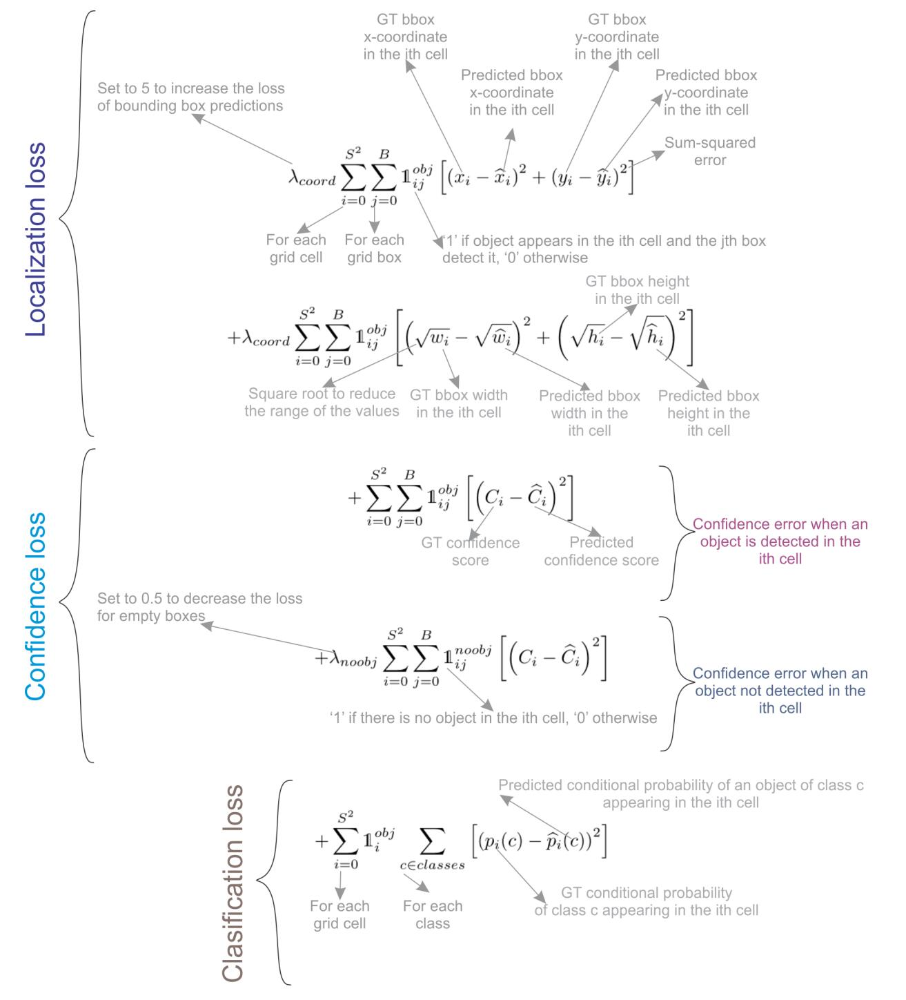

**图 5**：YOLO 输出预测。该图描绘了一个简化的 YOLO 模型， $3 \times 3$ 的网格，3 个类别，以及每个网格元素的单类预测以产生 8 个值的向量。

### 4.2 YOLOv1 Architecture

YOLOv1 的架构由 24 个卷积层和两个全连接层组成，全连接层预测边界框坐标和概率。除了最后一层使用线性激活函数外，所有层都使用了泄露修正线性单元 (ReLU) 激活函数。受 GoogLeNet 和 Network in Network 的启发，YOLO 使用 $1 \times 1$ 卷积层来减少特征图数量并使参数量相对较低。表 1 描述了 YOLOv1 的架构。作者还引入了一个较轻的模型 Fast YOLO，由 9 个卷积层组成。

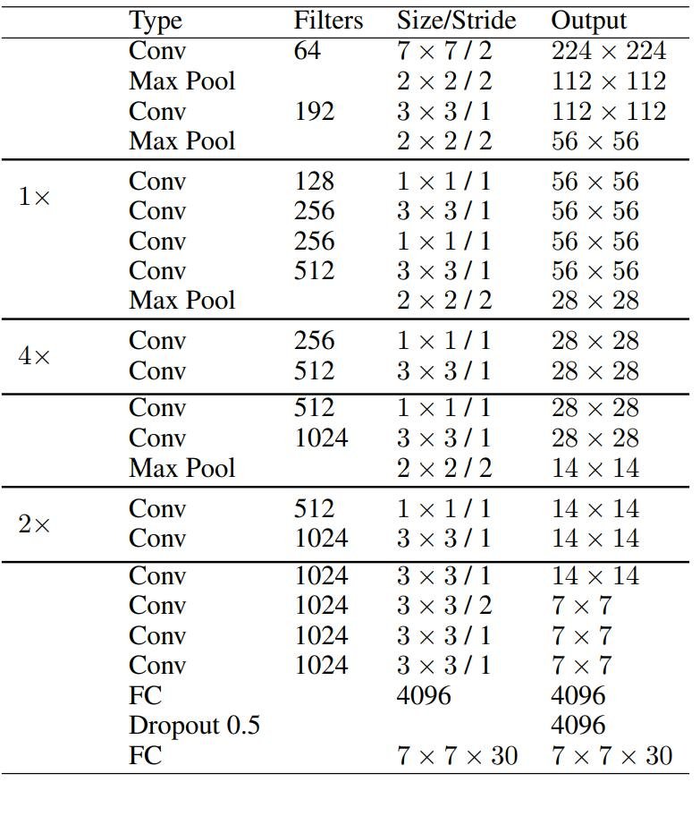

**表 1**：YOLOv1 的架构表格。该架构包括 24 个卷积层，将 $3 \times 3$ 卷积与 $1 \times 1$ 卷积相结合以进行通道缩减。输出是一个全连接层，生成一个 $7 \times 7$ 的网格，每个网格单元格有 30 个值，以容纳 10 个边界框坐标 (2个框) 和 20 个类别。

### 4.3 YOLOv1 Training

作者使用 ImageNet 数据集以 224×224 分辨率预训练了 YOLO 的前 20 层。然后，他们添加了带有随机初始化权重的最后四层，并使用 PASCAL VOC 2007 和VOC 2012 数据集以 448×448 分辨率微调模型，以增加细节来进行更准确的目标检测。

对于数据增强方面，作者使用了最大为输入图像大小 20% 的随机缩放和平移，以及 HSV 颜色空间中上限因子为 1.5 的随机曝光和饱和度。

YOLOv1 使用了由多个平方和误差组成的损失函数，如图 6 所示。在损失函数中， $\lambda_{coord} = 5$ 是一个放大比例因子，给予边界框预测更大的重要性， $\lambda_{noobj} = 0.5$ 是一个缩小比例因子，减少不包含目标的框的重要性。

损失函数的前两个项表示定位损失；它计算预测边界框位置 $(x,y)$ 和大小 $(w,h)$ 的误差。注意，这些误差仅在包含对象的框中计算(由 $\mathbb 1_{ij}^{obj}$ 表示)，仅当网格单元中存在对象时才进行惩罚。第三和第四项损失表示置信度损失；第三项测量在框中检测到对象时 $(\mathbb 1_{ij}^{obj})$ 的置信度误差，第四项测量在框中未检测到对象时的置信度误差 $(\mathbb 1_{ij}^{noobj})$ 。由于大多数框是空的，该损失由 $\lambda_{noobj}$ 项加权缩减。最后一个损失分量是分类损失，仅当对象出现在单元中时 $(\mathbb 1_{ij}^{obj})$ ，它测量每个类别的类别条件概率的平方误差。

**图 6**：YOLO 的损失函数，包括边界框坐标的定位损失、对象存在或不存在的置信度损失以及类别预测准确性的分类损失。

### 4.4 YOLOv1 Strengths and Limitations

YOLO 的简单架构以及其新颖的全图像一次回归使其比现有目标检测器快得多，允许实时性能。

然而，尽管 YOLO 比任何目标检测器都快，但与 Fast R-CNN 等最先进方法相比，其定位误差较大。这个限制有三个主要原因：

1. 每个网格单元最多只能检测到两个同类对象，限制了预测相近对象的能力。
2. 它难以预测训练数据中未见宽高比的对象。
3. 由于下采样层，它从粗糙的对象特征中学习。

## 5 YOLOv2: Better, Faster, and Stronger

YOLOv2 由 Joseph Redmon 和 Ali Farhadi 在 CVPR 2017 发表。它在原始 YOLO 的基础上进行了多项改进，使其更好、保持相同的速度同时也更强大——能够检测 9000 个类别！这些改进如下：

1. **批量归一化 (BN)**。在所有卷积层上使用批量归一化，提高收敛性并作为正则化器减少过拟合。
2. **高分辨率分类器**。像 YOLOv1 一样，他们使用 ImageNet 在 224×224 上预训练模型。然而，这一次，他们在 ImageNet 上使用 448×448 的分辨率对模型进行了 10 个 epochs 的微调，提高了网络在更高分辨率输入上的性能。
3. **完全卷积**。他们去掉了密集层 (dense layers)，并使用了一个完全卷积的架构。
4. **使用锚框预测边界框**。他们使用一组先验框或锚框，这些是具有预定义形状的框，用于匹配对象的典型形状，如图 7 所示。为每个网格单元定义了多个锚框，并且系统为每个锚框预测坐标和类别。网络输出的大小与每个网格单元中锚框的数量成比例。
5. **尺寸聚类**。选择好的先验框有助于网络学习预测更准确的边界框。作者在训练边界框上运行 k-means 聚类，以找到好的先验框。他们选择了五个先验框，提供了在召回率和模型复杂度之间的良好平衡。
6. **直接位置预测**。与其他预测偏移量的方法不同 ，YOLOv2 遵循相同的哲学，并且预测相对于网格单元的位置坐标。网络为每个单元格预测五个边界框，每个边界框都有五个值 $t_x, t_y, t_w, t_h$ 和 $t_o$ ，其中 $t_o$ 等价于 YOLOv1 中的 $P_c$ ，最终边界框坐标如图 7 所示。
7. **更细粒度的特征**。与 YOLOv1 相比，YOLOv2 去掉了一个池化层，以获得 416×416 输入图像的 13×13 的输出特征映射或网格。YOLOv2 还使用了一个 passthrough 层，它将 26×26×512 特征映射重新组织，将相邻的特征堆叠到不同的通道中，而不是通过空间子采样丢失它们。这生成了 13×13×2048 特征映射，这些特征映射在通道维度上与较低分辨率的 13×13×1024 映射拼接在一起，以获得 13×13×3072 特征映射。有关架构详细信息，请参见表 2。
8. **多尺度训练**。由于 YOLOv2 不使用全连接层，因此输入可以具有不同的大小。为了使 YOLOv2 对不同的输入大小具有鲁棒性，作者随机训练模型，每十个批次从 320×320 到 608×608 中更改一次输入大小。

所有这些改进使得 YOLOv2 在 PASCAL VOC2007 数据集上的平均精度 (AP) 达到了 78.6％，而 YOLOv1 仅为 63.4％。

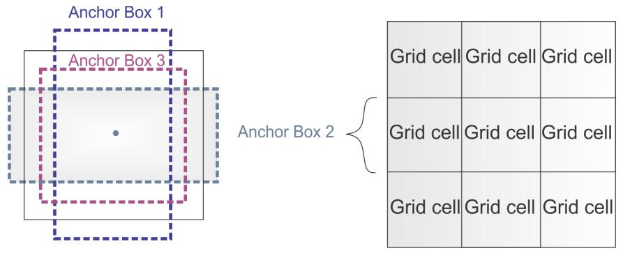

**图 7**：锚框。YOLOv2 为每个网格单元定义了多个锚框。

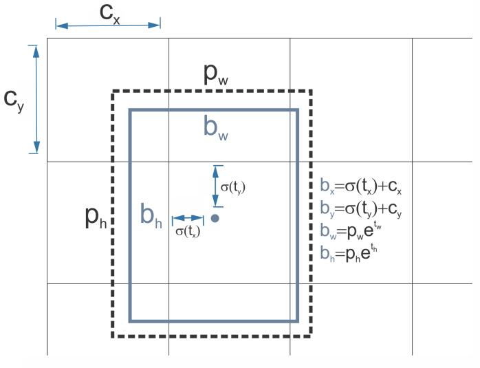

**图 8**：YOLOv2 的边界框预测图。边界框的中心坐标是通过将预测 $t_x,t_y$ 值应用一个 sigmoid 函数，并通过网格单元格 的位置 $c_x、c_y$ 进行偏移获得的。最终框的宽度和高度使用先验的宽度 $p_w$ 和高度 $p_h$ ，分别由 $e^{t_w}$ 和 $e^{t_h}$ 缩放，其中 $t_w$ 和 $t_h$ 由 YOLOv2 预测得到。

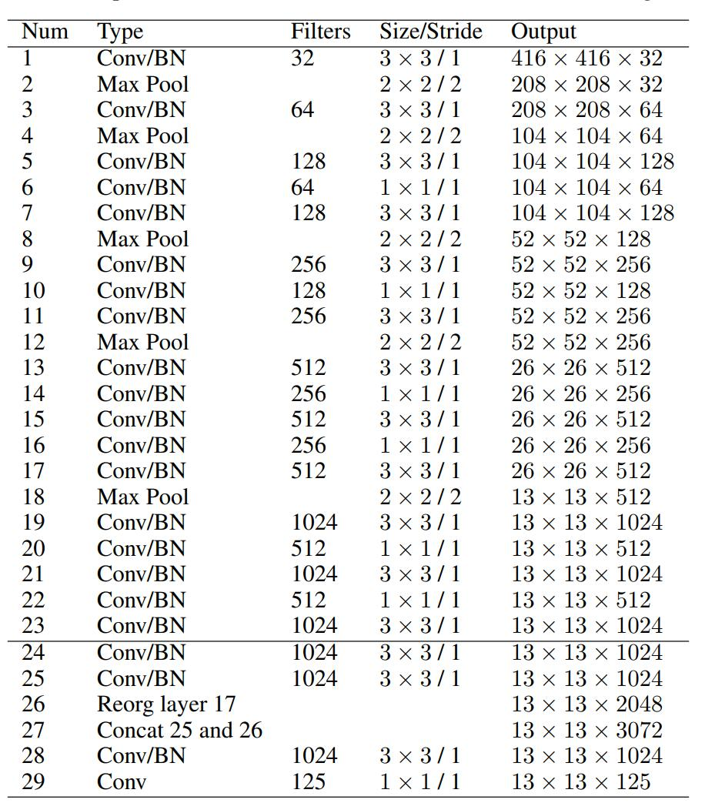

**表 2**：YOLOv2 的架构。它由 Darknet-19 骨干网络 (第 1 到 23 层) 和检测头组成，检测头由最后四个卷积层和穿越 (passthrough) 层组成。穿越层将 26×26×512 的第 17 个输出的特征重新组织为 13×13×2048，然后与第 25 层连接。最终卷积生成一个 13×13 的网格，具有 125 个通道，以容纳 5 个边界框的 25 个预测 (5 个坐标 + 20 个类别)。

### 5.1 YOLOv2 Architecture

YOLOv2 使用的骨干架构称为 *Darknet-19*，包含 19 个卷积层和 5 个最大池化层。与 YOLOv1 的架构类似，它受到了 Network in Network 的启发，在 3×3 的卷积之间使用 1×1 的卷积以减少参数数量。此外，正如上面提到的，他们使用批量归一化来规范化并帮助收敛。

表 2 显示了整个 Darknet-19 骨干架构及其目标检测头。当使用 PASCAL VOC 数据集时，YOLOv2 预测 5 个边界框，每个边界框都有 5 个值和 20 个类别。

目标分类头将最后四个卷积层替换为一个具有 1000 个滤波器的单卷积层，后跟全局平均池化层和 Softmax。

### 5.2 YOLO9000 is a stronger YOLOv2

作者在论文中介绍了一种联合分类和检测的训练方法。它使用了 COCO 中的检测标记数据来学习边界框坐标，并使用 ImageNet 中的分类数据来增加它可以检测的类别数量。在训练过程中，他们将两个数据集结合在一起，这样当使用检测训练图像时，它会反向传播检测网络，而当使用分类训练图像时，它会反向传播架构的分类部分。结果是一个能够检测超过 9000 个类别的 YOLO 模型，因此被称为YOLO9000。

## 6 YOLOv3

YOLOv3 是由 Joseph Redmon 和 Ali Farhadi 于 2018 年在 ArXiv上 发表的。它包含了重大的变化和更大的架构，以保持与最先进的技术同步，同时保持实时性能。以下是相对于 YOLOv2 的变化：

1. **边界框预测**。像 YOLOv2 一样，网络为每个边界框预测四个坐标 $t_x,t_y,t_w,t_h$ ；但是这一次 YOLOv3 使用逻辑回归为每个边界框预测一个物体得分 (objectness score)。这个得分对于与真实标注重叠最多的锚框是 1，对于其余锚框是 0。与 Faster R-CNN 不同，YOLOv3 仅为每个真实标注对象分配一个锚框。此外，如果没有锚框分配给一个对象，则只会产生分类损失而没有定位损失或置信度损失。
2. **类别预测**。他们使用二元交叉熵来训练独立的逻辑分类器，而不是使用 softmax 进行分类，并将问题作为多标签分类。这个改变允许将多个标签分配给同一个框，在一些具有重叠标签的复杂数据集上可能会出现。例如，同一个对象可以是一个人和一个男人。
3. **新的骨干网络**。YOLOv3 具有一个更大的特征提取器，由 53 个卷积层和残差连接组成。第 6.1 节详细描述了这个架构。
4. **空间金字塔池化 (SPP)**。虽然论文中没有提到，但作者还向骨干网络添加了一个修改后的 SPP 块，它将多个最大池化输出连接起来，而不进行子采样 (步幅= 1)，每个输出具有不同的内核大小 $k \times k$ ，其中 $k = 1,5,9, 13$ ，从而允许更大的感受野。这个版本被称为 YOLOv3-spp，是表现最好的版本，将 $AP_{50}$ 提高了 2.7％。
5. **多尺度预测**。与 Feature Pyramid Networks 类似，YOLOv3 在三个不同的尺度上预测三个边界框。第 6.2 节详细描述了多尺度预测机制。
6. **边界框先验**。与 YOLOv2 类似，作者还使用 k-means 算法确定锚框的边界框先验。不同之处在于，在 YOLOv2 中，他们每个单元格使用了五个先验框，而在YOLOv3 中，他们为三个不同尺度使用了三个先验框 (总共 9 个)。

### 6.1 YOLOv3 Architecture

YOLOv3 中的骨干网络被称为 Darknet-53。它用带步长的卷积替换了所有的最大池化层，并添加了残差连接。它总共包含 53 个卷积层。图 9 显示了架构细节。

Darknet-53 骨干网络获得的 Top-1 和 Top-5 准确率与 ResNet-152 相当，但速度快了近 2 倍。

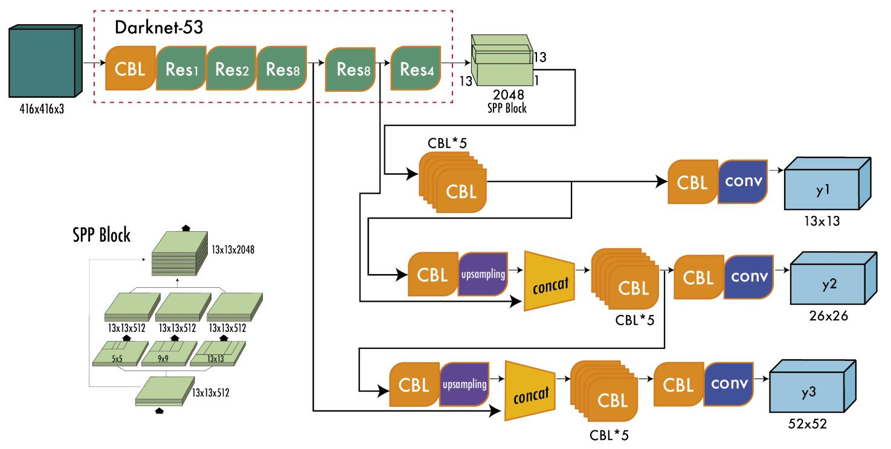

**图 9**：YOLOv3 Darknet-53 骨干网络。YOLOv3 的架构由 53 个卷积层组成，每个卷积层都有批量归一化和 Leaky ReLU 激活。此外，残差连接将 1×1 卷积的输入与整个网络中 3×3 卷积的输出相连。这里展示的架构仅包括骨干网络，不包括由多尺度预测组成的检测头。

### 6.2 YOLOv3 Multi-Scale Predictions

除了更大的架构之外，YOLOv3 的一个重要特征是多尺度预测，即在多个网格大小上进行预测。这有助于获得更精细的边界框，并显着提高小物体的预测能力，这是以前版本的 YOLO 的主要弱点之一。

图 10 所示的多尺度检测架构的工作方式如下：第一个标记为 **y1** 的输出等效于 YOLOv2 的输出，其中 13×13 网格定义了输出。第二个输出 **y2** 由 Darknet-53 的 (Res×4) 后的输出和 (Res×8) 后的输出拼接而成。特征图的大小不同，即 13×13 和 26×26 ，因此在拼接之前需要进行上采样操作。最后，使用上采样操作，第三个输出 **y3** 将 26×26 特征图与 52×52 特征图拼接起来。

对于有 80 个类别的 COCO 数据集，每个尺度提供一个形状为 $N \times N \times [3 \times (4+1+80)]$ 的输出张量，其中 N×N 是特征图 (或网格单元) 的大小，3 表示每个单元格的边界框数，4+1 包括四个坐标和物体得分。

**图 10**：YOLOv3 的多尺度检测架构。Darknet-53 骨干网络的输出分为三个不同的输出，分别标记为 **y1**、**y2** 和 **y3**，每个输出的分辨率都有所提高。最终预测的边界框使用非极大值抑制进行过滤。CBL (Convolution-BatchNorm-Leaky ReLU) 块包括一个带有批量归一化和泄漏整流线性单元的卷积层。Res 块包含一个 CBL，后面跟着两个带有残差连接的 CBL 结构，如图 9 所示。

### 6.3 YOLOv3 Results

当 YOLOv3 发布时，目标检测的基准从 PASCAL VOC 更改为 Microsoft COCO。因此，从这里开始，所有的 YOLO 都在 MS COCO 数据集中进行评估。YOLOv3-spp 在 20 FPS 下实现了 36.2％ 的平均精度 AP 和 60.6％ 的 $AP_{50}$ ，当时达到了最先进的水平，并且速度快了 2 倍。

## 7 Backbone, Neck, and Head

此时，目标检测器的架构开始被描述为三个部分：骨干网络、中间层和头部。图 11 展示了一个骨干网络 (backbone)、瓶颈层 (neck) 和检测头 (head) 的高级示意图。

backbone 负责从输入图像中提取有用的特征。它通常是一个在大规模图像分类任务 (例如 ImageNet) 上进行训练的卷积神经网络 (CNN)。骨干网络在不同尺度上捕获分层特征，在前面的层中提取较低级的特征 (如边缘和纹理)，在更深层中提取更高级的特征 (如物体部分和语义信息)。

neck 是连接 backbone 和 head 的中间组件。它聚合和优化骨干网络提取的特征，通常着重增强不同尺度上的空间和语义信息。neck 可包括额外的卷积层、特征金字塔网络 (FPN) 或其他机制来改进特征的表示。

head 是目标检测器的最后一个组件；它基于 backbone 和 neck 提供的特征进行预测。它通常由一个或多个执行分类、定位以及最近的实例分割和姿态估计的特定任务的子网络组成。head 处理 neck 提供的特征，为每个目标候选生成预测。最后，后处理步骤 (例如非极大值抑制 (NMS)) 过滤掉重叠的预测，仅保留最可信的检测结果。在 YOLO 模型的剩余部分中，我们将使用 backbone、neck 和 head 来描述这些架构。

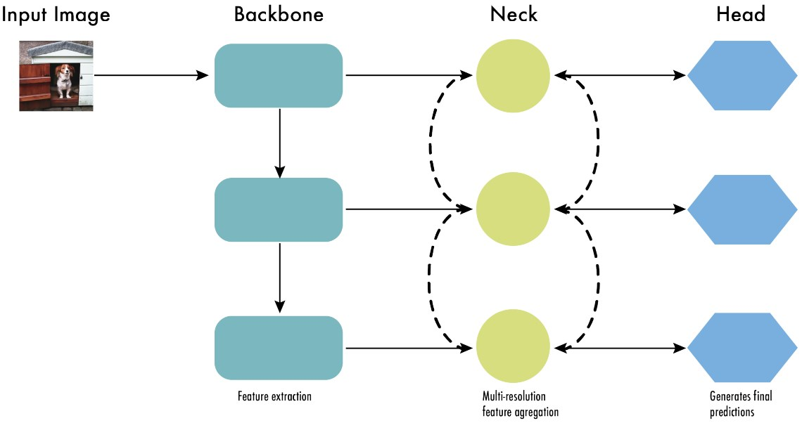

**图 11**：现代目标检测器的架构可以描述为骨干网络、瓶颈层和检测头。骨干网络通常是一个卷积神经网络 (CNN)，用于从图像中提取不同尺度的关键特征。瓶颈层对这些特征进行精炼，增强空间和语义信息。最后，检测头使用这些精炼后的特征进行目标检测预测。

## 8 YOLOv4

YOLO 有两年没有新版本了。直到 2020 年 4月，Alexey Bochkovskiy、Chien-Yao Wang 和 Hong-Yuan Mark Liao 在 ArXiv 上发表了 YOLOv4 的论文。起初，不同的作者发表新的“官方”YOLO版本感觉很奇怪；然而，YOLOv4 保持了相同的 YOLO 理念——实时、开源、single shot 和 darknet 框架——并且提升非常令人满意，社区很快就接受了这个版本作为官方的 YOLOv4。

YOLOv4 通过试验许多归类为  bag-of-freebies 和 bag-of-specials 的改变来找到最佳平衡。Bag-of-freebies 是仅改变训练策略、增加训练成本而不增加推理时间的方法，最常见的是数据增强。另一方面，bag-of-specials 是稍微增加推理成本但显著提高准确性的方法。这些方法的例子包括扩大感受野、特征融合和后处理等。

我们总结 YOLOv4 的主要变化有以下几点：

- **一个具有 Bag-of-Specials (BoS) 集成的增强架构**。作者尝试了 ResNeXt50、EfficientNet-B3 和 Darknet-53 等多个骨干网络架构。表现最佳的架构是使用一个修改后的 Darknet-53 作为骨干网络 (见图 12)，其使用了跨阶段局部连接 (CSPNet)，以及 Mish 激活函数。对于 neck，他们使用了 YOLOv3-spp 中的修改版空间金字塔池化 (SPP)，以及像 YOLOv3 一样的多尺度预测，但是使用了修改版的路径聚合网络 (PANet)，而不是 FPN，还有一个修改版的空间注意力模块(SAM)。最后，对于检测头，他们使用了 YOLOv3 中的锚框。因此，该模型被称为 CSPDarknet53-PANet-SPP。添加到 Darknet-53 的跨阶段局部连接 (CSP) 有助于降低模型的计算量而保持相同的准确度。与 YOLOv3-spp 一样，SPP 块增加了感受野而不影响推理速度。PANet 的修改版拼接特征而不是像原论文中将它们相加。
- **集成 bag-of-freebies (BoF) 用于高级训练方法**。除了常规的增强如随机亮度、对比度、缩放、裁剪、翻转和旋转，作者还实现了马赛克增强，将四幅图像组合成一幅，从而可以检测到超出通常上下文的对象，并减少了批量归一化所需的大的 mini-batch 大小。对于正则化，他们使用了 DropBlock，它像 Dropout 一样工作，但用于卷积神经网络，以及类别标签平滑。对于检测器，他们添加了 CIoU 损失和跨小批量标准化 (CmBN)，从整个批处理中而不是在常规批处理标准化的单个小批量中收集统计信息。 
- **自对抗训练 (SAT)**。为了使模型对扰动更具鲁棒性，在输入图像上执行对抗攻击，制造真实目标不在图像中的欺骗，但保留原始标签以检测正确的对象。
- **使用遗传算法优化超参数**。为了找到用于训练的最佳超参数，他们在前 10% 的训练周期中使用遗传算法，以及余弦退火调度器在训练过程中改变学习率。学习率先缓慢减小，在训练过程中减小一半，最后略微减小。

表 3 列出了骨干网络和检测器的 BoFs 和 BoS 的最终选择。

在 MS COCO 数据集 test-dev 2017 上进行评估，YOLOv4 在一块 NVIDIA V100 上以超过 50 FPS 取得了 43.5% 的 AP 和 65.7% $AP_{50}$ 。

**图 12**：用于目标检测的 YOLOv4 的架构。图中的模块为 **CMB**：卷积 + 批量归一化 + Mish 激活，**CBL**：卷积 + 批量归一化 + Leaky Relu，**UP**：上采样，**SPP**：空间金字塔池化，**PANet**：路径聚合网络。图示灵感来自 [79]。

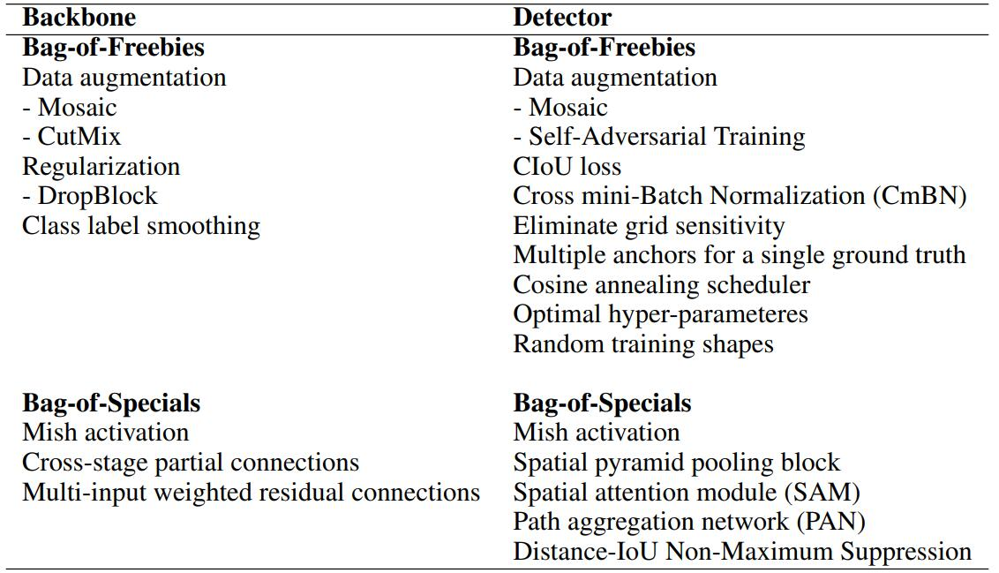

**表 3**：YOLOv4 的 bag-of-freebies (BoF) 和 bag-of-specials (BoS) 的最终选择。BoF 是一些在不增加推理成本但会增加训练时间的提高性能的方法。BoS 是一些略微增加推理成本但显著提高准确性的方法。

## 9 YOLOv5

骨干网络是经过修改的 CSPDarknet53，它以一个 Stem 开始，这是一个带有大窗口大小的步进卷积层，用于减少内存和计算成本；之后是从输入图像中提取相关特征的卷积层。SPPF (空间金字塔池化快速) 层和后续的卷积层在各种尺度上处理特征，而上采样层则增加了特征图的分辨率。SPPF 层旨在通过将不同尺度的特征汇聚到固定大小的特征图中，加速网络的计算。每个卷积后面都跟着批量归一化 (BN) 和 SiLU 激活。neck 使用了 SPPF 和修改过的 CSP-PAN，而 head 类似于 YOLOv3。

YOLOv5 使用了多种数据增强技术，例如 Mosaic、复制粘贴、随机仿射变换、MixUp、HSV增强、随机水平翻转，以及来自 albumentations 包的其他增强技术。此外，它还改进了网格敏感性，使其更稳定，不易出现梯度爆炸的情况。

YOLOv5 提供了五个不同规模的版本：YOLOv5n (微小)、YOLOv5s (小)、YOLOv5m (中) 、YOLOv5l (大) 和 YOLOv5x (特大)，其中卷积模块的宽度和深度各不相同，以适应特定的应用和硬件需求。例如，YOLOv5n 和 YOLOv5s 是针对资源有限设备的轻量级模型，而 YOLOv5x 则以牺牲速度为代价进行了高性能优化。

截至撰写本文时，YOLOv5 的发布版本是 v7.0，包括了具备分类和实例分割功能的 YOLOv5 版本。YOLOv5 是开源的，并由 Ultralytics 积极维护，拥有 250 多名贡献者，并经常进行新的改进。YOLOv5 易于使用、训练和部署。Ultralytics 还提供了适用于 iOS 和 Android 的移动版本，以及许多标注、训练和部署的集成工具。

在 MS COCO 数据集的 test-dev 2017 上评估，YOLOv5x 在 640 像素的图像尺寸下达到了 50.7% 的 AP。使用批量大小为 32，它可以在 NVIDIA V100 上实现200 FPS 的速度。使用更大的输入尺寸 (1536 像素) 和测试时间增强 (TTA)，YOLOv5 可以达到 55.8% 的 AP。

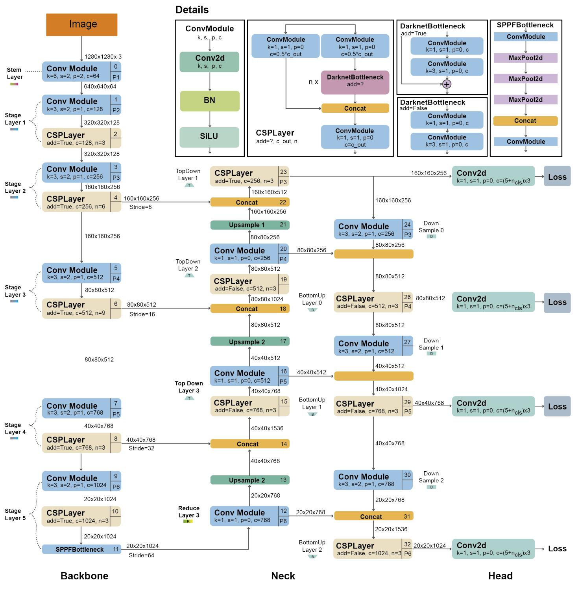

**图 13**：YOLOv5 架构。该架构使用一个修改后的 CSPDarknet53 骨干网络，其包括一个 Stem，后面是从图像中提取特征的卷积层。空间金字塔池化快速 (SPPF) 层通过将特征汇聚到固定大小的特征图中来加速计算。每个卷积层都具有批量归一化和 SiLU 激活。网络的 neck 使用了 SPPF 和修改过的 CSP-PAN，而 head 似于 YOLOv3。图示基于[85]和[86]。

## 10 Scaled-YOLOv4

YOLOv4 发布一年后，同一作者团队在 2021 年的 CVPR 上提出了 Scaled-YOLOv4。与 YOLOv4 不同，Scaled YOLOv4 是基于 Pytorch 而不是 Darknet 开发的。其主要创新是引入了放大和缩小技术。放大是以牺牲速度为代价提高模型准确率；另一方面，缩小是以牺牲准确率为代价提高模型速度。此外，缩小后的模型需要更少的计算力，可以在嵌入式系统上运行。

缩小的模型架构称为 YOLOv4-tiny，它是针对低端 GPU 设计的，在 Jetson TX2 上可以以 46 FPS 运行，在 RTX2080Ti 上可以达到 440 FPS，在 MS COCO 数据集上得到 22% 的平均精度 (AP)。

放大的模型架构称为 YOLOv4-large，它包含了三种不同尺寸 P5、P6 和 P7。这个架构是为云 GPU 设计的，取得了当时最先进的性能，在 MS COCO 数据集上达到 56% 的 AP，超过之前的所有模型。

## 11 YOLOR

YOLOR 由 YOLOv4 的同一研究团队于 2021 年 5 月在 ArXiv 上发表。其名称表示“你只需要学习一个表示 (You Only Learn One Representation)”。在这篇文章中，作者采用了不同的方法；他们开发了一种多任务学习方法，旨在通过学习通用表示和使用子网络创建特定任务的表示，来创建完成各种任务 (例如分类、检测、姿态估计) 的单一模型。作者认为，传统的联合学习方法常常导致次优特征生成，YOLOR 旨在通过编码神经网络的隐式知识来克服这一点，类似于人类如何利用过去的经验来解决新问题。结果表明向神经网络中引入隐式知识有利于所有任务。

在 MS COCO 数据集 test-dev 2017 上评估，YOLOR 达到了 55.4% 的 AP 和 73.3% 的 $AP_{50}$ ，在 NVIDIA V100 上以 30 FPS 运行。

## 12 YOLOX

YOLOX 由商汤科技于 2021 年 7 月在 ArXiv 上发表。它基于 Pytorch 开发，以 Ultralytics 的 YOLOv3 为起点，做了五个主要改进：一个无锚框架构、多个正样本、解耦头部、高级标签分配和强数据增强。它在 2021 年取得了最先进的结果，在速度和准确性之间取得了最佳平衡，在 Tesla V100 上以 68.9% 的 FPS 达到 50.1% 的 AP。下面我们介绍 YOLOX 相对于 YOLOv3 的五个主要改进:

1. **无锚框**。自 YOLOv2 以来，所有后续的 YOLO 版本都是基于锚框的检测器。YOLOX 受到如 CornerNet、CenterNet 和 FCOS 等无锚框目标检测器的启发，返回到了一个简化了训练和解码过程的无锚框架构。无锚框相对于 YOLOv3 基线提高了 0.9 个点的 AP。

2. **多个正样本**。为了补偿无锚框产生的大量不平衡，作者使用中心采样，将中心 3×3 区域赋予正样本。这种方法提高了 2.1 个点的 AP。

3. **解耦头部**。在 [94,95] 中发现，分类置信度和定位准确度之间可能存在不对齐。因此，YOLOX 将它们分为两个头部 (如图 14 所示)，一个用于分类，另一个用于回归，提高了 1.1 个点的 AP，并加速了模型收敛。

4. **高级标签分配**。在 [96] 中发现，当多个对象的框重叠时，真值标签分配会存在歧义，并将分配过程建模为一个最优传输 (OT) 问题。YOLOX 受此启发，提出了一种简化的称为 simOTA 的方法。这种改进提高了 2.3 个点的 AP。

5. **强数据增强**。YOLOX 使用 MixUP 和 Mosaic 数据增强。作者发现，在使用这些增强后，ImageNet 预训练不再有益。强数据增强提高了 2.4 个点的 AP。

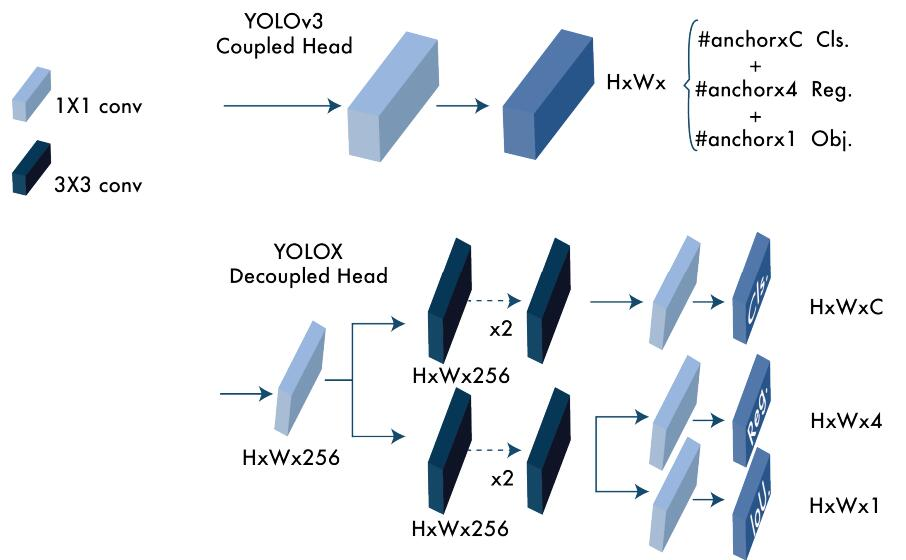

**图 14**：YOLOv3 头部和 YOLOX 解耦头部之间的区别。对于 FPN 的每个级别，他们使用了一个 1×1 的卷积层将特征通道减少到 256，然后添加了两个平行的分支，每个分支都有两个 3×3 的卷积层，用于类别置信度 (分类) 和定位 (回归) 任务。IoU 分支添加到了回归头部。

## 13 YOLOv6

YOLOv6 由美团视觉 AI 部门于 2022 年 9 月在 ArXiv 上发表。网络设计由高效的骨干网络 (使用 RepVGG 或 CSPStackRep 模块)、PAN 结构的 neck 和混合通道策略的高效解耦 head 组成。此外，论文引入了使用后量化训练和通道方向蒸馏的增强量化技术，得到了更快更准确的检测器。总体而言，YOLOv6 在准确度和速度指标上优于之前的最新模型，如 YOLOv5、YOLOX 和 PP-YOLOE。图 15 显示了 YOLOv6 的详细架构。该模型的主要创新总结如下：

1. 一种新的基于 RepVGG 的称为 EfficientRep 的骨干网络，具有比以前的 YOLO 骨干网络更高的并行性。对于 neck，他们使用了以 RepBlocks 或 CSPStackRep 模块增强的 PAN。并且与 YOLOX 一样，他们开发了一个高效的解耦头部。

2. 使用 TOOD 中引入的任务对齐学习方法进行标签分配。

3. 新的分类和回归损失。他们使用了一个 VariFocal 分类损失和一个 SIoU /GIoU 回归损失。

4. 回归和分类任务的自蒸馏策略。 

5. 使用 RepOptimizer 和通道级别的蒸馏的检测量化方案，帮助获得更快的检测器。

作者提供了 8 个不同模型，从 YOLOv6-N 到YOLOv6-L6。在 MS COCO 数据集 test-dev 2017 上评估，最大模型在 NVIDIA Tesla T4上获得了约 29 FPS 和 57.2% 的 AP。

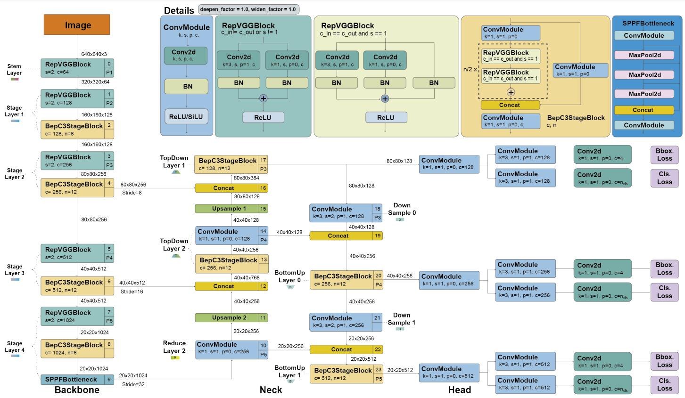

**图 15**：YOLOv6 架构。该架构使用了一个具有 RepVGG 模块的新骨干网络。空间金字塔池化快速 (SPPF) 和卷积模块与 YOLOv5 相似。但是，YOLOv6 使用了一个解耦的头部。图示基于 [99]。

## 14 YOLOv7

YOLOv7 由 YOLOv4 和 YOLOR 的同一作者团队于 2022 年 7 月在 ArXiv 上发表。当时，它在 5 FPS 到 160 FPS 的范围内超过了所有已知的目标检测器，无论是速度还是准确率。与 YOLOv4 一样，它仅使用 MS COCO 数据集进行训练，没有使用预训练的骨干网络。YOLOv7 提出了一些架构变化和一系列 bag-of-freebies 方法，这些方法在不影响推理速度但增加了训练时间的情况下提高了准确率。

图 16 显示了 YOLOv7 的详细架构。

YOLOv7 的架构变化有：

- 扩展高效层聚合网络 (E-ELAN)。ELAN 是一种策略,通过控制最短和最长的梯度路径,使深度模型能够更高效地学习和收敛。YOLOv7提出的E-ELAN适用于无限堆叠的计算模块。E-ELAN通过打乱和合并基数来增强网络的学习,而不破坏原始的梯度路径。

- 基于拼接的模型缩放。缩放通过调整某些模型属性生成不同大小的模型。YOLOv7的架构是基于拼接的架构,标准的缩放技术(如深度缩放)会改变过渡层的输入通道和输出通道的比率,从而导致模型的硬件利用率下降。YOLOv7为基于拼接的模型缩放提出了一种新的策略,其中块的深度和宽度按相同因子缩放,以维持模型的最佳结构。

YOLOv7使用的“免费提升”包括:

- 计划重参数化卷积。与YOLOv6类似,YOLOv7的架构也来源于重参数化卷积(RepConv)[98]。但是,他们发现RepConv中的恒等连接破坏了ResNet [61]中的残差和DenseNet [109]中的拼接。因此,他们删除了恒等连接,并将其称为RepConvN。

- 为辅助头使用粗标签分配,为主头使用细标签分配。主头负责最终输出,辅助头协助训练。

- 卷积-BN-激活中的BN。这会在推理阶段将BN的均值和方差集成到卷积层的偏置和权重中。

- 受YOLOR [89]中的隐式知识启发。

- 指数移动平均作为最终推理模型。

总之,YOLOv7通过模块化设计、混合通道策略、量化技术等进一步提升了YOLO系列的性能,使其保持最先进水平。

## 15 DAMO-YOLO

## 16 YOLOv8

## 17 PP-YOLO, PP-YOLOv2, and PP-YOLOE

## 18 YOLO-NAS

## 19 YOLO with Transformers

