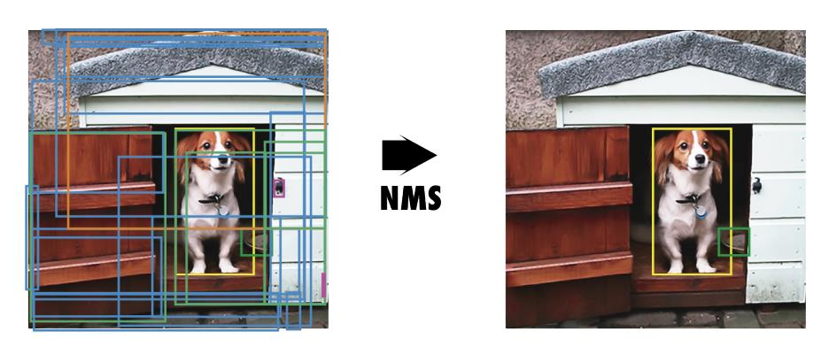

# [A COMPREHENSIVE REVIEW OF YOLO: FROM YOLOV1 AND BEYOND](https://arxiv.org/abs/2304.00501)

## Abstract

YOLO已经成为机器人、无人驾驶汽车和视频监控应用的核心实时目标检测系统。我们全面分析了YOLO的演变，检验了从原始YOLO到YOLOv8、YOLO-NAS和带Transformer的YOLO每一代的创新和贡献。我们首先描述标准指标和后处理；然后，我们讨论每个模型在网络架构和训练技巧上的主要变化。最后，我们总结YOLO开发的重要经验教训，并对其未来提供视角，重点介绍提高实时目标检测系统性能的可能研究方向。

**Keywords** YOLO · Object detection · Deep Learning · Computer Vision

## 1 Introduction

实时目标检测已经成为众多应用领域的关键组成部分，范围跨自主驾驶、机器人、视频监控以及增强现实等。在各种目标检测算法中，YOLO(You Only Look Once)框架以其卓越的速度和精度平衡而脱颖而出，能够对图像中的对象进行快速可靠的识别。自问世以来，YOLO家族经历了多次迭代，每次在前一版本的基础上解决局限性并提升性能(见图1)。

本文旨在全面回顾YOLO框架的发展，从原始的YOLOv1到最新的YOLOv8，阐明每个版本的关键创新、差异和改进。本文首先探讨了原始YOLO模型的基础概念和架构，这为YOLO家族后续的进步奠定了基础。在此之后，我们深入研究了从YOLOv2到YOLOv8每个版本引入的改进和增强。这些改进涵盖网络设计、损失函数修改、锚框适应以及输入分辨率缩放等各个方面。通过检查这些发展，我们旨在全面理解YOLO框架的演变及其对目标检测的影响。

除了讨论每个YOLO版本的具体进步，本文还重点介绍了YOLO框架发展过程中速度和精度之间的权衡。这强调了在选择最合适的YOLO模型时，考虑具体应用的上下文和要求的重要性。最后，我们展望了YOLO框架的未来方向，涉及能够塑造实时目标检测系统持续发展的潜在研究与开发道路。

图 1：YOLO 版本的时间线

## 2 YOLO Applications Across Diverse Fields

YOLO的实时目标检测能力对自主驾驶汽车系统具有莫大价值，可以快速识别和跟踪各种对象，如汽车、行人[1，2]、自行车和其他障碍物[3，4，5，6]。这些能力已经被应用于许多领域，包括视频监控中的行为识别[7]、体育分析[9]和人机交互[10]。

YOLO模型已被用于农业领域检测和分类农作物[11，12]、病虫害[13]，协助精准农业技术和自动化农业流程。它们还被改编用于生物识别、安全和面部识别系统中的人脸检测任务[14，15]。

在医学领域，YOLO用于癌症检测[16，17]、皮肤分割[18]和药片识别[19]，提高了诊断准确率和治疗过程的效率。在遥感领域，它被用于卫星和航空图像中的目标检测和分类，协助土地利用制图、城市规划和环境监测[20，21，22，23]。

安全系统集成了YOLO模型进行实时视频监控和分析，允许快速检测可疑活动[24]、社交距离和戴口罩检测[25]。这些模型还被应用于表面检测以检测缺陷和异常情况，提高了制造业和生产过程中的质量控制[26，27，28]。

在交通应用中，YOLO模型被用于车牌检测[29]和交通标志识别[30]等任务，有助于智能交通系统和交通管理解决方案的发展。它们被用于野生动物检测和监测，以识别濒危物种用于生物多样性保护和生态系统管理[31]。最后，YOLO被广泛用于机器人应用[32，33]和无人机目标检测[34，35]。

## 3 Object Detection Metrics and Non-Maximum Suppression (NMS)

平均准确率(Average Precision，AP)，传统上称为平均均值准确率(Mean Average Precision，mAP)，是评估目标检测模型性能的常用指标。它测量所有类别的平均准确率，提供一个值来比较不同模型。COCO数据集不区分AP和mAP。在本文其余部分，我们将此指标称为AP。

在YOLOv1和YOLOv2中，用于训练和基准测试的数据集是PASCAL VOC 2007和VOC 2012[36]。然而，从YOLOv3开始，所用数据集是Microsoft COCO(上下文中的常见物体)[37]。这些数据集的AP计算方式不同。下节将讨论AP背后的原理，并解释其计算方式。

### 3.1 How AP works?

AP指标基于精确率-召回率指标，处理多个物体类别，并使用交集除以联合(Intersection over Union， IoU)来定义正样本预测。

**精确率和召回率:** 精确率衡量模型正样本预测的准确度，而召回率衡量模型正确识别的实际正样本的比例。精确率和召回率通常存在权衡;例如，增加检测物体数量(更高的召回率)可能导致更多假正样本(更低的精确率)。为了考虑这种权衡，AP指标结合了随不同置信度阈值绘制精确率-召回率曲线。该指标通过考虑精确率-召回率曲线下的面积来平衡评估精确率和召回率。

**处理多个物体类别:** 目标检测模型必须识别图像中的多个物体类别并定位。AP指标通过分别计算每个类别的平均准确率(AP)，然后计算所有类别的AP均值来解决这个问题(这也是为什么它也称为平均均值准确率)。这种方法确保每个类别的性能都被单独评估，为模型的整体性能提供了更全面的评估。

**交并比:** 目标检测旨在通过预测边界框准确定位图像中的物体。AP指标结合使用交集除以联合(IoU)测量来评估预测边界框的质量。IoU是预测边界框和真值边界框交集面积与并集面积之比(见图2)。它测量真值和预测边界框之间的重叠面积。COCO基准考虑多个IoU阈值来评估模型在不同定位准确度水平上的性能。

图 2：交并比 (Intersection over Union， IoU)。a) IoU的计算是将两个框的交集除以框的并集；b) 三个不同IoU值的示例，对应不同的框位置。

### 3.2 Computing AP

AP在VOC和COCO数据集上的计算方式不同。本节将描述它在每个数据集上的计算方式。

**PASCAL VOC数据集**

该数据集包含20个物体类别。在VOC中计算AP的步骤如下:

1. 对每个类别，通过改变模型预测的置信度阈值计算精确率-召回率曲线。
2. 使用曲线的11点插值计算每个类别的平均准确率(AP)。
3. 通过计算所有20个类别的AP均值获得最终的平均准确率(AP)。

**Microsoft COCO数据集**

该数据集包含80个物体类别，使用更复杂的方法计算AP。它使用101点插值而不是11点插值，即它以0.01的步长计算从0到1的101个召回率阈值的精确率。此外，AP是通过多个IoU值的平均获得的，而不仅仅是一个，除了一个常用的AP指标AP50，它是IoU阈值为0.5时的AP。

在COCO中计算AP的步骤如下:

1. 对每个类别，通过改变模型预测的置信度阈值计算精确率-召回率曲线。
2. 使用101个召回率阈值计算每个类别的平均准确率(AP)。
3. 计算不同交集除以联合(IoU)阈值的AP，通常从0.5到0.95，步长为0.05。更高的IoU阈值需要更准确的预测才能被视为真正例。
4. 对每个IoU阈值，计算所有80个类别的AP均值。
5. 最后，通过对每个IoU阈值计算的AP值平均获得总体AP。

AP计算的差异使得很难直接比较两个数据集上目标检测模型的性能。当前的标准是使用COCO AP，因为它可以更细致地评估模型在不同IoU阈值下的表现。

### 3.3 Non-Maximum Suppression (NMS)

非极大值抑制 (Non-Maximum Suppression, NMS) 是目标检测算法中使用的一种后处理技术，用于减少重叠的边界框数量并提高整体检测质量。目标检测算法通常为同一目标生成多个具有不同置信度分数的边界框。NMS过滤掉冗余和不相关的边界框，只保留最准确的那些。算法1描述了该过程。图3显示了目标检测模型的典型输出，包含多个重叠的边界框，以及NMS后的输出。

**图 3**：非极大值抑制(NMS)。a) 显示了目标检测模型的典型输出，其中包含多个重叠的框。b) 显示 NMS 后的输出。

> NMS的工作原理如下:
>
> 
> 0. 过滤低于置信度阈值的边界框。
> 1. 对检测结果按置信度分数排序。
> 2. 选择置信度最高的边界框。
> 3. 计算其他所有边界框与该边界框的交集比例(IoU)。
> 4. 删除IoU大于阈值(如0.5)的边界框。
> 5. 重复步骤2-4，直到没有边界框剩余。
>
> 这样就可以删除大部分冗余和不准确的边界框，只保留置信度高且不重叠的边界框。NMS是目标检测后处理中的标准操作，极大地提升了检测性能。

## 4 YOLO: You Only Look Once

YOLO 由 Joseph Redmon 等人在 2016 年 CVPR 上发表[38]。它首次提出了一个端到端的实时目标检测方法。YOLO 代表“You Only Look Once”，意思是它能够在网络的一次前馈中完成检测任务，而之前的方法要么使用滑动窗口后跟一个需要对每个图像运行数百次或数千次的分类器，要么使用更先进的两步法，其第一步检测可能存在目标的区域或候选区域，第二步对候选区域运行分类器。此外，YOLO 使用了一种更直接的仅基于回归的输出来预测检测结果，而不是 Fast R-CNN[39]使用的两种独立输出，一种用于概率的分类，一种用于框坐标的回归。

### 4.1 How YOLOv1 works?

YOLOv1 通过同时检测所有边界框来统一目标检测步骤。为实现此目的，YOLO 将输入图像划分为 $S \times S$ 网格，并为每个网格单元预测 $B$ 个同类边界框以及 $C$ 个不同类别的置信度。每个边界框预测由五个值组成： $P_c,bx,by,bh,bw$ ，其中 $P_c$ 是边界框置信度，反映模型对该框包含物体的置信程度及框的准确性。 $bx$ 和 $by$ 是框相对于网格单元的中心坐标， $bh$ 和 $bw$ 是框相对于整个图像的高度和宽度。YOLO 的输出是一个 $S \times S \times (B \times 5 + C)$ 的张量，可选地后面跟着非极大值抑制 (NMS) 来消除重复检测。

在原始 YOLO 论文中，作者使用 PASCAL VOC 数据集[36]，其中包含 20 类 $(C=20)$ ; $7\times7$ 网格 $(S=7)$ ；每个网格单元最多2类 $(B=2)$ ，给出 $7 \times 7 \times 30$ 的输出预测。

图 4 显示了考虑 $3 \times 3$ 网格、3 类和每个网格 1 类的简化输出向量，共 8 个值。在这个简化案例中，YOLO 的输出就是3×3×8。

YOLOv1在PASCAL VOC2007数据集上达到了63.4的平均准确率(AP)。

### 4.2 YOLOv1 Architecture

YOLOv1的架构由24个卷积层和两个全连接层组成，全连接层预测边界框坐标和概率。除了最后一层使用线性激活函数外，所有层都使用了泄露修正线性单元 (ReLU 激活函数[40]。受GoogLeNet[41]和Network in Network[42]的启发，YOLO **使用1×1卷积层来减少特征图数量并使参数量相对较低**。表 1 描述了 YOLOv1的架构。作者还引入了一个较轻的模型 Fast YOLO，由 9 个卷积层组成。

### 4.3 YOLOv1 Training

作者使用 ImageNet 数据集[43]以 224×224 分辨率预训练了YOLO的前20层。然后，他们添加了带有随机初始化权重的最后四层，并使用 PASCAL VOC 2007 和VOC 2012数据集[36]以 448×448 分辨率微调模型，以增加细节来进行更准确的目标检测。

对于数据增强方面，作者使用了最大为输入图像大小 20% 的随机缩放和平移，以及 HSV 颜色空间中上限因子为 1.5 的随机曝光和饱和度。

YOLOv1 使用了由多个平方和误差组成的损失函数，如图5所示。在损失函数中， $\lambda_{coord} = 5$ 是一个放大比例因子，给予边界框预测更大的重要性， $\lambda_{noobj} = 0.5$ 是一个缩小比例因子，减少不包含目标的框的重要性。

损失函数的前两个项表示定位损失；它计算预测边界框位置 $(x,y)$ 和大小 $(w,h)$ 的误差。注意，这些误差仅在包含对象的框中计算(由 $\mathbb 1_{ij}^{obj}$ 表示)，仅当网格单元中存在对象时才进行惩罚。第三和第四项损失表示置信度损失；第三项测量在框中检测到对象时 $(\mathbb 1_{ij}^{obj})$ 的置信度误差，第四项测量在框中未检测到对象时的置信度误差 $(\mathbb 1_{ij}^{noobj})$ 。由于大多数框是空的，该损失由 $\lambda_{noobj}$ 项加权缩减。最后一个损失分量是分类损失，仅当对象出现在单元中时 $(\mathbb 1_{ij}^{obj})$ ，它测量每个类别的类别条件概率的平方误差。

**图 4**：YOLO 输出预测。该图描绘了一个简化的 YOLO 模型，3×3 的网格，3 个类别，4 个框元素，每个网格一个单类别预测 $(P_c)$ 以产生 8 个值的向量。

### 4.4 YOLOv1 Strengths and Limitations

YOLO 的简单架构以及其新颖的全图像一次回归使其比现有目标检测器快得多，允许实时性能。

然而，尽管 YOLO 比任何目标检测器都快，但与 Fast R-CNN\[39\]等最先进方法相比，其定位误差较大。这个限制有三个主要原因：

1. 每个网格单元最多只能检测到两个同类对象，限制了预测相近对象的能力。
2. 它难以预测训练数据中未见宽高比的对象。
3. 由于下采样层，它从粗糙的对象特征中学习。

## 5 YOLOv2: Better, Faster, and Stronger
