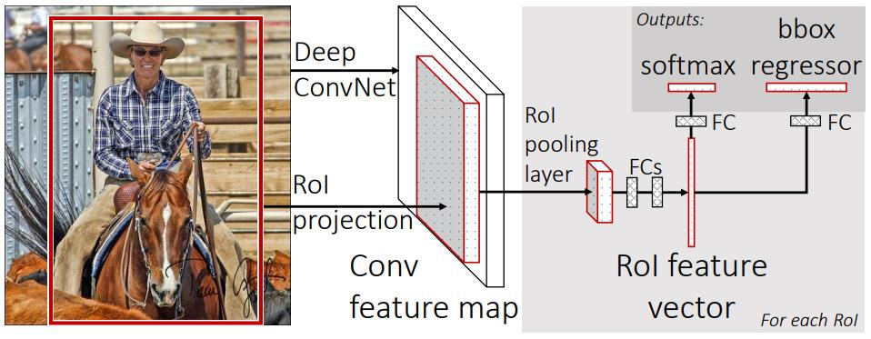
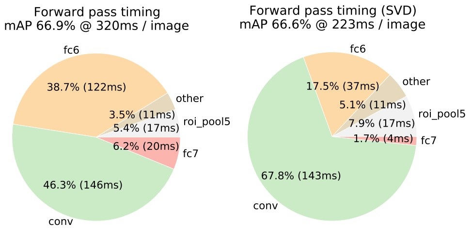

# [Fast R-CNN](https://arxiv.org/abs/1504.08083)

## Abstract

这篇论文提出了一种基于区域的快速卷积神经网络方法（Fast R-CNN）用于目标检测。Fast R-CNN 在之前的工作基础上，使用深度卷积神经网络高效地分类候选区域。与以前的工作相比，Fast R-CNN 采用了多种创新来提高训练和测试速度，同时还提高了检测精度。Fast R-CNN 训练非常深的 VGG16 网络比 R-CNN 快 9 倍，测试速度快 213 倍，并在 PASCAL VOC 2012 上实现了更高的 mAP。与 SPPnet 相比，Fast R-CNN 训练 VGG16 快 3 倍，测试快 10 倍，并且更准确。Fast R-CNN 使用 Python 和 C++（使用Caffe）实现，并在开源 MIT许可下可用 https://github.com/rbgirshick/fast-rcnn 。

## 1. Introduction

最近，深度卷积神经网络显着提高了图像分类和目标检测的准确性。与图像分类相比，目标检测是一项更具挑战性的任务，需要更复杂的方法来解决。由于这种复杂性，当前很多的方法（例如 R-CNN、SPPNet、OverFeat、segDeepM）都是采用多阶段流水线的形式训练模型，不仅慢而且不优雅。

复杂性产生的原因是检测需要获得目标物体的精确位置，从而产生了两个主要挑战。首先，必须处理大量候选物体位置（通常称为"候选框"）。其次，这些候选物体仅提供粗略的定位，必须对它进行细化以实现更精确的定位。解决这些问题往往需要在速度，精度，简易性上进行适当地妥协折中。

在本文中，我们简化了最先进的基于 ConvNet 的目标检测器 (R-CNN、SPPnet) 的训练过程。我们提出了一种单阶段的训练算法，它可以联合学习分类候选区域物体和细化它们的空间位置。

由此产生的方法可以训练一个非常深的检测网络（VGG16 [20]），比 R-CNN [9] 快 9 倍，比 SPPnet [11]快 3 倍。在运行时，检测网络在 0.3 秒内处理图像 (不包括生成候选区域的时间)，同时在 PASCAL VOC 2012 [7] 上取得了最高的准确性，mAP 为 66%（R-CNN 为 62%）。

### 1.1 R-CNN and SPPnet

基于的卷积网络方法 (R-CNN) 通过使用深度卷积网络完成了对目标候选区域的分类，并得到了很好的目标检测精度。但是，R-CNN有显著的缺点：

1. **训练是多阶段流水线 (multi-stage Pipeline)**：首先，R-CNN 利用目标候选区域对卷积网络进行微调，损失函数采用的是 log 损失 (其实就是 Softmax 函数)。然后，它在卷积网络特征上拟合 SVM。这些 SVMs 通过微调取代了Softmax 分类器作为目标检测器。在第三个训练阶段，边界框（Bounding-box）回归器被训练学习。
1. **训练在空间和时间上都很昂贵**：对于 SVM 和边界框回归器的训练，需要从每张图像中的每个候选区域中提取特征，并写入磁盘。对于非常深的网络，比如 VGG16，这些处理任务对于 VOC07 trainval 数据集中的 5k 幅图像需要 2.5 个 GPU 天。这些特征需要数百 GB 的存储空间。
1. **目标检测速度较慢**。在测试时，特征从每一张测试图片的每一个目标候选区域被提取出来。使用 VGG16 在 GPU 上进行检测需要 47 秒/图像。

R-CNN 速度较慢，因为它对每个候选区域都执行一次 ConvNet 前向传播计算，没有共享卷积计算。为了加速 R-CNN，提出了空间金字塔池化网络（SPPnets）[11]，通过共享计算来加速 R-CNN。SPPnet 对于一张完整的输入图片只计算一次卷积特征映射，然后从共享的特征映射提取每一个目标候选区域所对应的特征向量并做分类处理。通过将候选区域内的特征图部分最大池化到固定大小的输出 (例如 6×6) 来从提议中提取特征。采用与空间金字塔池化[15]相同的方式对多个输出尺寸进行池化然后拼接。SPP-net 在测试上是 R-CNN 的 10~100 倍。由于加快了候选区域的特征提取，训练时间减少 3 倍。

SPPnet 也有显著的缺点。像 R-CNN 一样，训练是一个多阶段的流水线，包括提取特征，利用对数损失微调网络，训练 SVM，最后拟合边界框回归器。训练所需的特征也被写入磁盘。但与 R-CNN 不同，在 SPPnet 中提出的微调算法无法更新空间金字塔池化之前的卷积层。不出所料，这个限制 (固定的卷积层) 限制了非常深的网络 (VGG16) 的准确性。

### 1.2. Contributions

我们提出了一种新的训练算法，它既修复了 R-CNN 和 SPPnet 的缺点，又改进了它们的速度和准确性。我们将这种方法称为 Fast R-CNN，因为相比而言它的训练和测试都很快。Fast RCNN 方法有几个优点:

1. 比 R-CNN 和 SPPnet 检测质量 (mAP) 更高
2. 训练是单阶段的，使用多任务损失
3. 训练可以更新所有网络层
4. 不需要磁盘存储来缓存特征

Fast R-CNN 使用 Python 和 C++ (Caffe [13]) 编写，在 MIT 开源许可证下在 https://github.com/rbgirshick/fast-rcnn 上开源可用。

## 2. Fast R-CNN architecture and training

图1 说明了 Fast R-CNN 的架构。Fast R-CNN 网络以整个图像和一组候选区域作为输入。该网络首先用一些卷积 (conv) 和最大池化层处理整个图像，生成一个卷积特征图。然后，对每个目标候选区域，感兴趣区域 (RoI) 池化层从特征图中提取固定维度的特征向量。每个特征向量被馈送到一系列全连接 (fc) 层，最终分支到两个同级输出层：一个输出 K 个物体类加上一个 "背景" 类的 softmax 概率估计，另一个层对 K 个物体类别输出4个实数值。每个 4 实数值集编码了 K 类之一的细化的边界框位置。

**图 1**：Fast R-CNN 架构。输入图像和多个感兴趣区域 (RoIs) 被输入到一个全卷积网络中 (这里应该是 ROI 池化前的全部卷积层)。每个 RoI 被池化成一个固定大小的特征图，然后通过全连接层 (FCs) 映射到一个特征向量。该网络对每个 RoI 有两个输出向量：softmax 概率和每个类别的边界框回归偏移量。该架构通过多任务损失端到端训练。

### 2.1. The RoI pooling layer

RoI 池化层使用最大池化将任何有效感兴趣区域内的特征转换为一个固定空间范围为 $H \times W$ (例如7×7)的小特征图，其中 $H$ 和 $W$ 是与任意特定 RoI 无关的层超参数。在本文中，RoI 是一个映射到 conv 特征图上的矩形窗口。每个 RoI 由四元组 $(r,c,h,w)$ 定义，RoI 左上角为 $(r,c)$ ，其高度和宽度 $(h,w)$ 。

RoI 最大池化的工作原理是将 $h\times w$ 的 RoI 窗口划分为子窗口大小大约为 $h/H \times w/W$ 的 $H \times W$ 网格，然后将每个子窗口中的值最大池化到相应的输出网格单元中。池化单独作用于特征图每个通道上，如标准最大池化一样。RoI 层是 SPPNet 网络中的空间金字塔池化层的一个简单的特例，它是只有一层的金字塔层。我们使用 SPPNet 中给出的池化子窗口计算。

### 2.2. Initializing from pre-trained networks

我们的实验采用了三种在 ImageNet 数据集上预训练的网络，每个网络都有五个最大池化层和 5~13 个卷积层 (第 4.1 节详述网络细节)。当一个预训练网络初始化一个 Fast R-CNN 网络时，它经历了三次转换。

首先，最后的最大池化层被一个 RoI 池化层替换，该ROI池化层通过设置合理 $H$ 和 $W$ 实现了与第一个全连接层兼容性配置 (例如对 VGG16 设置 $H=W=7$ )。

其次，网络最后的全连接层和 softmax (针对1000 类 ImageNet 分类训练) 被前面描述的两个同级 (sibling) 层替换 (一个全连接层和 $K+1$ 类的 softmax 以及类别特定的边界框回归器)。

第三，网络被修改以接受两种数据输入：一组图像和一组这些图像中的 RoI。

### 2.3. Fine-tuning for detection

使用反向传播训练所有网络权重是 Fast R-CNN 的一个重要能力。首先，让我们阐明为什么 SPPnet 无法更新空间金字塔池化层以下的权重。

根本原因是，当每个训练样本 (即 RoI) 来自不同的图像时，通过 SPP 层进行反向传播非常低效，而这正是 R-CNN 和 SPPnet 网络的训练方式。低效源于每个 RoI 可能有一个非常大的感受野，通常跨越整个输入图像。由于前向传播必须处理整个感受野，训练需要的输入很大的 (通常是整个图像)。

我们提出了一种更有效的训练方法，它在训练过程中利用特征共享。在 Fast RCNN 训练中，随机梯度下降 (SGD) 小批量是分层采样的，首先采样 N 张图像，然后从每张图像中采样 R/N 个 RoI。关键是，来自同一图像的 RoI 在前向和反向传播中共享计算和内存。使 N 较小可减少小批量的计算量。例如，使用 $N=2$ 和 $R=128$ 时，所提出的训练方案比从 128 张不同的图像中采样 1 个 RoI (即 R-CNN 和 SPPnet 的策略) 快约 64 倍。

这个策略的一个担忧是它可能导致训练收敛缓慢，因为来自同一图像的 RoI 之间存在相关性。但这种担忧在实际中并不成问题，我们使用 $N=2$ 和 $R=128$ 以少于 R-CNN 的 SGD 迭代次数就获得了良好的结果。

除了分层采样，Fast R-CNN 还使用了一个精简的训练过程，一个微调阶段联合优化了 softmax 分类器和边界框回归器，而不是像 [9,11] 中那样分三个阶段训练 softmax 分类器、SVM 和回归器。这个过程的组成部分 (损失函数、小批量采样策略、通过 RoI 池化层的反向传播以及 SGD 超参数) 在下面描述。

**多任务损失**。Fast R-CNN 网络有两个同级输出层。第一个输出每个 RoI 的离散概率分布 $p = (p_0, \cdots , p_K)$ ，总共有 $K+1$ 个类别。通常， $p$ 是通过全连接层的 $K+1$ 个输出上的 softmax 计算的。第二个同级层输出为 $K$ 个对象类边界框回归偏移量 $t^k = (t_x^k , t_y^k , t_w^k , t_h^k)$ ，索引为 $k$ 。我们使用 [9]中给出的 $t^k$ 的参数化形式，其中 $t^k$ 指定相对于目标候选区域的尺度不变的平移和对数空间高度/宽度位移。

每个训练 RoI 用真实类别 $u$ 和真实边界框回归目标 $v$ 进行标注。我们在每个标注的 RoI 上使用多任务损失 $L$ 联合训练分类和边界框回归：

$$
L(p,u,t^u,v) = L_{cls}(p,u) + \lambda[u \ge 1]L_{loc}(t^u,v), \tag1
$$

其中 $L_{cls}(p,u) = -\log p_u$ 表示对于真实类别 $u$ 的对数损失 (即交叉熵损失)。

第二个任务损失 $L_{loc}$ 是定义在类别 $u$ , $v = (v_x, v_y, v_w, v_h)$ 的真实边界框回归目标的元组和针对类别 $u$ 预测的元组 $t^u = (t_x^u, t_y^u, t_w^u, t_h^u)$ 上。 $u \ge 1$ 时艾佛森括号中的指示器函数 $[u \ge 1]$ 的结果为 1，否则为 0。对于背景 ROI 区域没有真实边界框的概念，因此 $L_{loc}$ 被忽略。对于边界框回归，我们使用损失

$$
L_{loc}(t^u, v) = \sum_{i \in \set{x,y,w,h}} \mathrm{smooth}_{L_1}(t_i^u - v_i), \tag2
$$

其中

$$
\mathrm{smooth}_{L_1}(x) = 
\left\{\begin{matrix}
0.5x^2 & \mathrm{if} \ |x| < 1 \\
|x| - 0.5 & \mathrm{otherwise}
\end{matrix}\right.
\tag{3}
$$

是一种鲁棒的 $L_1$ 损失，对于异常值的敏感度要低于 R-CNN 和 SPPnet 中使用的 $L_2$ 损失。当回归目标限制时，使用 $L_2$ 损失训练可能需要仔细调整学习率以防止梯度爆炸。公式 3 消除了这种敏感性。

公式 1 中的超参数 $\lambda$ 控制两个任务损失之间的平衡。我们将真实回归目标 $v_i$ 标准化为零均值和单位方差。所有的实验使用 $\lambda = 1$ 。

我们注意到 [6] 使用相关损失来训练一个类不可知的区域提议网络。与我们的方法不同，[6] 主张使用双网络系统来分离定位和分类。OverFeat [19]、R-CNN [9] 和 SPPnet [11] 也训练分类器和边界框定位器，但是这些方法使用分阶段训练，我们将在 5.1 节展示它们对于 Fast R-CNN 来说是次优的。

**小批量采样**。在微调期间，每个 SGD 小批量由 $N=2$ 幅图像构成，随机均匀选择 (按照常规做法，我们实际上遍历数据集的排列)。我们使用小批量大小 $R=128$ ，从每张图像中采样 64 个 RoI。如 [9] 中，我们从与真实边界框 IoU 重叠至少 0.5 的候选区域中采样 25% 的 RoI。这些 RoI 由标记为前景目标类的示例构成，即 $u \ge 1$ 。其余的 RoI 从与真实标注的最大 IoU 在区间 $[0.1,0.5)$ 内的候选区域中采样，遵循 [11]。这些是背景示例，标记为 $u=0$ 。较低阈值 0.1 似乎充当了困难示例挖掘[8]的启发式方法。在训练期间，图像以 0.5 的概率水平翻转。没有使用其他数据增强。

**通过 RoI 池化层进行反向传播**。反向传播偏导传播路径经过 RoI 池化层。为清楚起见，我们假设每个小批量仅有一张图像 $(N=1)$ ，但是将其扩展到 $N>1$ 非常简单，因为前向传播独立地处理所有图像。

设 $x_i \in \mathbb R$ 为进入 RoI 池化层的第 $i$ 个激活输入， $y_{rj}$ 为 RoI 池化层中来自第 $r$ 个 RoI 的第 $j$ 个输出。RoI 池化层计算 $y_{rj} = x_{i∗(r,j)}$ ，其中 $i∗(r,j) = \arg \max_{i' \in R(r,j)} x_i'$ 。 $R(r,j)$ 是输出单元 $y_{rj}$ 最大池化的子窗口上输入的索引集。单个 $x_i$ 可以分配给多个不同的输出 $y_{rj}$ 。

RoI 池化层的反向函数通过遵循 argmax 开关来计算损失函数相对于每个输入变量 $x_i$ 的偏导数：

$$
\frac{\partial L}{\partial x_i} = \sum_{r} \sum_{j}[i = i^*(r,j)] \frac{\partial L}{\partial y_{rj}} \tag4
$$

换言之，对于每个小批量 RoI $r$ 和每个池化输出单元 $y_{rj}$ ，如果 $i$ 是 $y_{rj}$ 通过最大池化选择的 argmax，则会累积偏导数 $\partial L / \partial y_{rj}$ 。在反向传播中，偏导数 $\partial L / \partial y_{rj}$ 已经由ROI池化层的上一层的反向函数计算出。

**SGD 超参数**。用于 softmax 分类和边界框回归的全连接层分别以标准差为 0.01 和 0.001 的零均值高斯分布初始化。偏置初始化为 0。所有层的权重学习率为 1，偏置学习率为 2，全局学习率为 0.001。在VOC07 或 VOC12 trainval 上训练时，我们使用 SGD 运行 30k 个小批量迭代，然后将学习率降低到 0.0001，再训练 10k 次迭代。在更大的数据集上训练时，我们使用 SGD 运行更多迭代，如后面所述。使用动量 0.9 和参数衰减 0.0005 (对权重和偏置)。

### 2.4. Scale invariance

我们探索了实现尺度不变的目标检测的两种方法：(1) 通过“暴力”学习，(2) 使用图像金字塔。这些策略遵循[11] 中的两种方法。在暴力方法中，在训练和测试期间，每个图像以预定义的像素尺寸进行处理。网络必须从训练数据中直接学习尺度不变的目标检测。

相反，多尺度方法通过图像金字塔为网络提供近似的尺度不变性。在测试时，图像金字塔用于近似尺度归一化每个候选区域。在多尺度训练期间，我们在采样图像时随机采样金字塔尺度，遵循[11]，作为数据增强的一种形式。由于 GPU 内存限制，我们仅对较小的网络实验多尺度训练。

## 3. Fast R-CNN detection

一旦 Fast R-CNN 网络被微调完毕，检测相当于运行前向传播 (假设候选框是预先计算的)。网络以一张图像 (或图像金字塔，编码为图像列表) 和 $R$ 个待计算分数的候选区域列表作为输入。在测试时， $R$ 通常约为 2000，尽管我们也会考虑更大的情况 $(\approx 45k)$ 。当使用图像金字塔时，每个 RoI 被缩放，使其最接近 $224^2$ 像素。

对于每个测试 RoI $r$ ，前向传播输出一个类别后验概率分布 $p$ 和一组相对于 $r$ 的预测边界框偏移量 (K 个类别都有自己独立的精确边界框预测)。我们使用估计概率 $\mathrm{Pr}(\mathrm{class} = k | r) \triangleq p_k$ 为 $r$ 分配 k 个类别的检测置信度。然后，我们使用 R-CNN 的算法和设置，为每个类独立地执行非极大值抑制。

### 3.1. Truncated SVD for faster detection

对于整个图像分类，计算全连接层所花费的时间相比卷积层很小。相反，检测时需要处理的 RoI 的数量很大，并且将近一半的时间用于计算完全连接层 (参见图 2)。大的全连接层可以通过截断的 SVD [5,23] 压缩来轻松加速。

在这种技术中，一个层的 $u \times v$ 的权重矩阵 $W$ 参数通过 SVD 近似分解为：

$$
W \approx U \begin{matrix} \sum_t \end{matrix} V^T \tag5
$$

在这种分解中， $U$ 是包含 $W$ 的前 $t$ 个左奇异向量组成的 $U \times t$ 矩阵， $\begin{matrix} \sum_t \end{matrix}$ 是一个包含 $W$ 的前 $t$ 个奇异值的 $t \times t$ 对角矩阵， $V$ 是一个包含 $W$ 的前 $t$ 个右奇异向量的 $v \times t$ 矩阵。截断 SVD 将参数量从 $uv$ 减少到 $t(u + v)$ ，如果 $t$ 远小于 $\min(u, v)$ ，这可以显著减少参数量。要压缩网络，将对应于 $W$ 的单全连接层替换为两层全连接层，它们之间没有非线性层。第一层全连接层使用权重矩阵 $\begin{matrix} \sum_t \end{matrix} V^T$ (不使用偏置)，第二层全连接层使用 $U$ (带有与 $W$ 相关的原始偏置)。当 RoI 数量很大时，这种简单的压缩方法有很好的加速效果。

**图 2**：截断 SVD 前后的 VGG16 时序图。在 SVD 之前，全连接层 fc6 和 fc7 占用 45% 的时间。

## 4. Main results

三个主要结果支持了本文的贡献：

1. 在 VOC07、2010 和 2012 数据集上取得了最先进的 mAP。

2. 与 R-CNN 和 SPPnet 相比，训练和测试更快。

3. 调优 VGG16 的卷积层可以提高 mAP。

### 4.1. Experimental setup

### 4.2. VOC 2010 and 2012 results

### 4.3. VOC 2007 results

### 4.4. Training and testing time

### 4.5. Which layers to fine-tune?

## 5. Design evaluation

我们进行了实验来理解 Fast RCNN 与 R-CNN 和 SPPnet 的比较，以及评估设计决策。按照最佳实践，我们在 PASCAL VOC07 数据集上进行这些实验。

### 5.1. Does multi-task training help?

### 5.2. Scale invariance: to brute force or finesse?

### 5.3. Do we need more training data?

一个好的目标检测器在获得更多训练数据时应该会有提升。Zhu 等人[24] 发现当训练样本达到几百到几千时，DPM [8] 的 mAP 就会饱和。这里我们用 VOC12 的 trainval 集增强了 VOC07 的 trainval 集，将图像数量大致增加3倍到16.5k，以评估 Fast R-CNN。使用扩大训练集将 VOC07 测试集上的 mAP 从 66.9% 提升到 70.0% (表1)。在这个数据集上训练时，我们使用 60k 个小批量迭代而不是 40k。

我们在 VOC10 和 2012 上进行了类似的实验，用 VOC07 trainval、test和VOC12 trainval的并集构建了一个包含 21.5k 张图像的数据集。在这个数据集上训练时，我们使用 SGD 进行 100k 次迭代，并在每 40k 次迭代后将学习率缩小 0.1 倍 (而不是每30k次)。对于 VOC10 和 2012，mAP 分别从 66.1% 提升到68.8% 和从 65.7% 提升到 68.4%。

### 5.4. Do SVMs outperform softmax?

### 5.5. Are more proposals always better?

### 5.6. Preliminary MS COCO results

## 6. Conclusion

本文提出了 Fast R-CNN，它是 R-CNN 和 SPPnet 的一个整洁和快速的更新。除了报告最先进的检测结果，我们还提供了详细的实验，希望能提供新的见解。特别需要注意的是，稀疏的候选区域似乎可以改进检测器的质量。在过去，这个问题的探索代价 (在时间上) 太大，但有了 Fast R-CNN 就变得实际可行。当然，可能还存在一些未被发现的技术，可以让稠密的框和稀疏的候选区域一样好。如果开发出这样的方法，可能会进一步加速目标检测。

## Reference

[1]: https://www.cnblogs.com/wj-1314/p/13359146.html	"深度学习论文翻译解析（十二）：Fast R-CNN"

