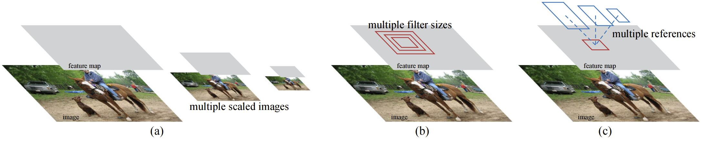
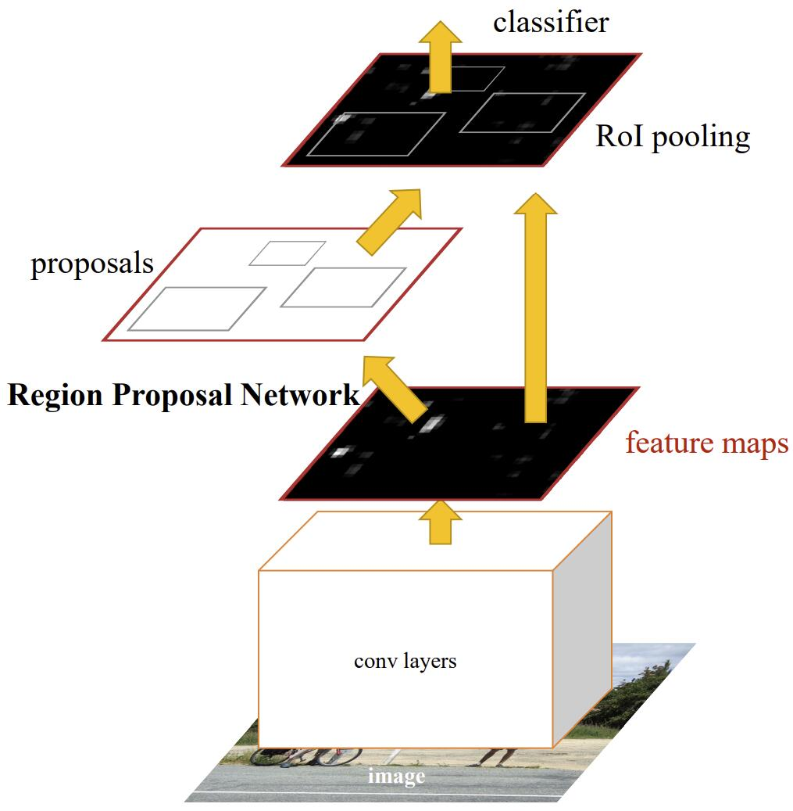
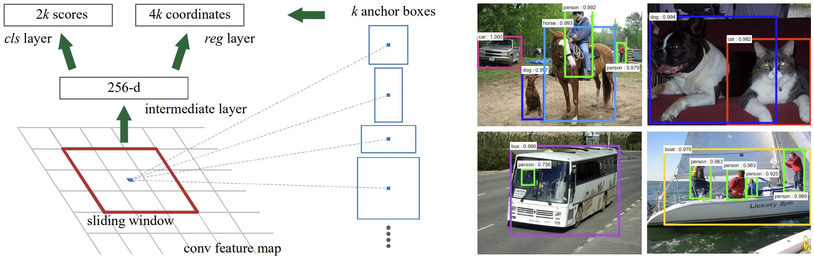
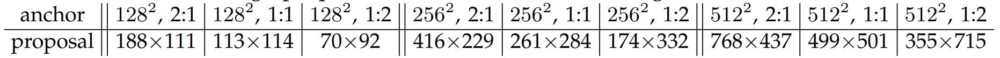
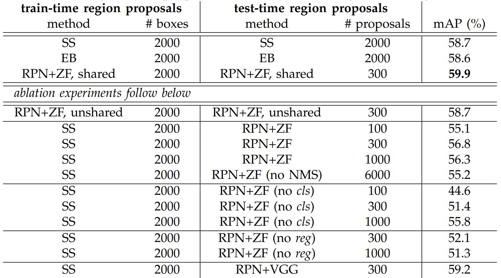
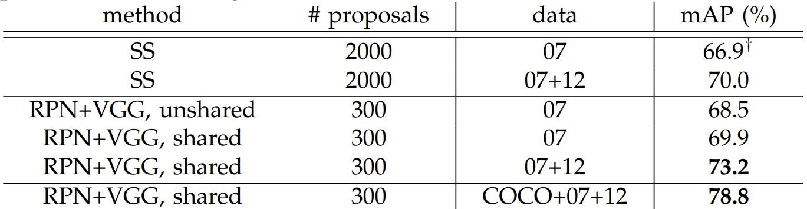
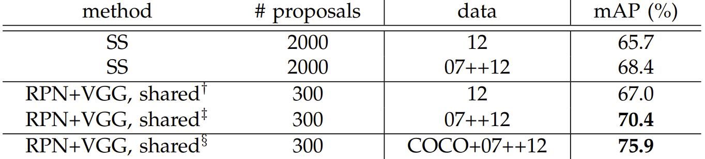
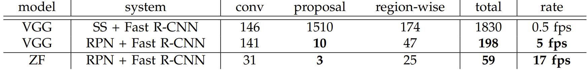

# [Faster R-CNN: Towards Real-Time Object Detection with Region Proposal Networks](https://arxiv.org/pdf/1506.01497.pdf)

## Abstract

最先进的目标检测网络依赖于 region proposal 算法来假设物体位置。像 SSPnet 和 Fast R-CNN 取得的进展已经减少了检测网络的运行时间，但同时也暴露出来了一个问题——在提出候选框的这一部分存在计算瓶颈。在这项工作中，我们介绍一种区域候选网络 (RPN)，它可以和检测网络一起共享整张图片的特征，因此可以几乎零成本的提取候选框。RPN 是一个全卷积的网络，它在每个位置同时预测目标边界和目标分数。RPN 端到端地训练，生成高质量的候选框，这些候选框被 Fast R-CNN 用于检测。通过共享它们的卷积特征，我们进一步将 RPN 和 Fast R-CNN 合并为一个单一网络——使用最近流行的神经网络术语“注意力”机制，RPN 组件告诉统一网络要查找哪里。对于非常深的 VGG-16 模型，我们的检测系统在 GPU 上帧率为每秒 5 帧 (包括所有步骤) ，同时在每个图像仅使用 300 个提议情况下，在 PASCAL VOC 2007、2012 和 MS COCO 数据集上取得了最好的目标检测精度。在 ILSVRC 和 COCO 2015 比赛中，Faster R-CNN 和 RPN 是在多个赛道中获得第一名的模型的基础。代码已经公开发布。

**索引词：** Object Detection, Region Proposal, Convolutional Neural Network

## 1 Introduction

最近目标检测的进展得益于区域候选方法和基于区域的卷积神经网络 (R-CNNs) 的成功。虽然 R-CNNs 在最初开发时计算成本很高，但通过跨提议共享卷积，它们的成本已经大大降低。最新版本的 Fast R-CNN 使用非常深的网络在忽略提取候选框所花费的时间下实现了接近实时的速率。现在，提议是最先进的检测系统中测试时的计算瓶颈。

区域候选方法通常依赖于 inexpensive features  和 economical inference 策略。选择性搜索是最受欢迎的方法之一，它基于设计的低级特征贪婪地合并超像素。然而，与高效检测网络相比，选择性搜索慢一个数量级，在 CPU 实现中每个图像需要 2 秒。EdgeBoxes 目前在候选框质量和提取速度之间提供了最好的权衡，每张图像 0.2 秒。然而，提取候选框步骤仍然消耗与检测网络一样多的运行时间。

可以注意到，Fast R-CNN 利用了 GPU，而研究中使用的区域候选方法是在 CPU 上实现的，因此这样的运行时比较是不公平的。加速候选框计算的一种明显方法是使用 GPU 重新实现它。这可能是一种有效的工程解决方案，但重新实现忽略了下游检测网络，因此错过了共享计算的重要机会。

在本文中，我们展示了一种算法改变——使用深度卷积神经网络计算候选框——这是一种优雅而有效的解决方案，使得在给定的检测网络的计算下提取候选框几乎零成本。为此，我们引入了新颖的区域候选网络 (RPNs) ，它们与最先进的物体检测网络共享卷积层。通过在测试时共享卷积，计算候选框的边际成本很小 (例如，每个图像 10 ms) 。

我们观察到，基于区域的检测器 (如 Fast R-CNN) 使用的卷积特征映射也可以用于生成区域候选。在这些卷积特征之上，我们通过添加一些额外的卷积层来构建一个 RPN，在一个规则的网格上同时回归区域边界和物体分数。因此，RPN 是一种完全卷积网络 (FCN) ，并且可以被端到端训练来用于生成检测候选框的任务。

RPNs 被设计用来高效地预测具有各种尺度和长宽比的候选框。与普遍流行的使用图像金字塔 (图 1，a) 或滤波器金字塔 (图 1，b) 的方法相比，我们引入了新颖的“锚”框作为多种尺度和长宽比参考。我们的方案可以被认为是回归参考的金字塔 (图 1，c) ，它避免了枚举多种尺度或长宽比的图像或滤波器。这个模型在使用单尺度图像做输入时训练和测试的表现都很好，并且速度很快。

图 1：解决多中尺度和大小的不同方案。(a) 构建图像和特征映射的金字塔，并在所有尺度上运行分类器。(b) 在特征图上运行具有多种尺度/大小的滤波器的金字塔。(c) 我们在回归函数中使用参考框的金字塔。

为了将 RPNs 与 Fast R-CNN 目标检测网络统一起来，我们提出了一种训练方案，它在微调区域回归任务和微调目标检测之间做交替，同时保持候选框固定。这个方案收敛迅速，并产生了一个在两个任务之间共享卷积特征的统一的网络。

我们在 PASCAL VOC 检测基准测试上全面评估了我们的方法，其中使用 RPNs 的 Fast R-CNNs 产生的检测精度优于使用选择性搜索的 Fast R-CNNs 的强基线。同时，在测试时，我们的方法几乎免除了选择性搜索的所有计算负担——区域候选的有效运行时间仅为 10 毫秒。使用 VGG 中昂贵的非常深层模型，我们的检测方法仍然在 GPU 上具有 5fps 的帧率 (包括所有步骤) ，因此在速度和准确性方面都是一种实用的物体检测系统。我们还报告了 MS COCO 数据集上的结果，并研究了使用 COCO 数据在 PASCAL VOC 上的改进。代码已经公开发布在 https://github.com/shaoqingren/faster_rcnn (MATLAB) 和 https://github.com/rbgirshick/py-faster-rcnn (Python) 。

这篇论文的初版曾经发表在 [10]。自那时以来，RPN 和 Faster R-CNN 的框架已经被采用并推广到其他方法，例如 3D 物体检测，基于部件的检测，实例分割和描述。我们快速有效的目标检测系统也已经在商业系统中构建，例如在 Pinterests 中，报告了用户参与度的提高。

在 ILSVRC 和 COCO 2015 比赛中，Faster R-CNN 和 RPN 是 ImageNet 检测，ImageNet 定位，COCO 检测和 COCO 分割等多个第一名的基础。RPN 完全从数据中学习提出候选框，因此可以轻松受益于更深入和更具表现力的特征 (例如在 ResNet 中采用的 101 层残差网络) 。Faster R-CNN 和 RPN 也被这些竞赛中的其他领先条目使用。这些结果表明，我们的方法不仅是一种成本效益高的实用解决方案，而且还是提高目标检测准确性的有效方法。

## 2 Releated Work

**目标候选：** 有大量关于目标候选方法的文献。可以在 [19]，[20]，[21] 中找到关于目标候选方法的综述。广泛使用的目标候选方法包括基于分组超像素的方法 (例如，选择性搜索，CPMC，MCG) 和基于滑动窗口的方法 (例如，[24]，EdgeBoxes) 。目标候选方法被采用为检测器的独立外部模块 (例如，选择性搜索目标检测器，R-CNN  和 Fast R-CNN) 。

**目标检测的深度网络：** R-CNN方法端到端地训练 CNN 来将候选区域分类为物体类别或背景。R-CNN 主要作为分类器，它不预测目标边界 (除了通过边界框回归进行细化) 。它的准确性取决于区域候选模块的性能 (请参见 [20] 中的比较) 。几篇论文 [25]，[9]，[26]，[27] 提出了使用深度网络预测物体边界框的方法。在 OverFeat 方法中，一个全连接层被训练来预测假设有一个单一的目标的定位任务的框坐标。然后将全连接层转换为一个卷积层，以检测多个特定类别的目标。MultiBox 方法从一个最后一个全连接层同时预测多个类别不可知的框的网络生成候选区域，推广了 OverFeat 的“单个框”风格。这些类别不可知的框被用作 R-CNN 的候选框。MultiBox 提议网络应使用单个图像裁剪或多个大型图像裁剪 (例如 $224 \times 224$ ) ，与我们的完全卷积方案相反。MultiBox 不在候选和检测网络之间共享特征。我们稍后将在与我们的方法相关的上下文中更深入地讨论 OverFeat 和 MultiBox。与我们的工作同时进行，DeepMask 方法被开发用于学习分割提议。

共享卷积计算已经引起了越来越多的关注，以实现高效而准确的视觉识别。OverFeat 论文从图像金字塔中计算用于分类，定位和检测的卷积特征。在共享的卷积特征映射自适应大小池化 (SPP) 上被开发用于高效的基于区域的目标检测和语义分割。Fast R-CNN 使得能够在共享的卷积特征上端到端训练检测器，并显示出令人信服的准确性和速度。

## 3 Faster R-CNN

图 2：Faster R-CNN 是一个单一的、统一的目标检测网络。RPN 模块作为这个统一网络的“注意力”。

我们的目标检测系统称为 ==Faster R-CNN，由两个模块组成。第一个模块是一个用于提出候选框的深度完全卷积网络，第二个模块是使用候选框的 Fast R-CNN 检测器==。整个系统是一个单一的、统一的目标检测网络 (图 2) 。使用最近流行的神经网络术语“注意力”机制，RPN 模块可以告诉 Fast R-CNN 模块在哪里寻找。在第 3.1 节中，我们介绍区域候选网络的设计和属性。在第 3.2 节中，我们开发了用于训练共享特征的两个模块的算法。

### 3.1 Region Proposal Networks

区域候选网络 (RPN) 将图像 (任意大小) 作为输入，并输出一组矩形的候选框，每个候选框都有一个对象分数。我们使用一个完全卷积网络对此过程进行建模，我们将在本节中进行描述它。因为我们的最终目标是与 Fast R-CNN 目标检测网络共享计算，所以我们假设两个网络共享一组公共的卷积层。在我们的实验中，我们研究了Zeiler 和 Fergus 的具有 5 个可共享的卷积层的模型，Simonyan 和 Zisserman 的具有 13 个可共享的卷积层的模型 (VGG-16) 。

> "区域"是一个通用术语，在本文种，仅考虑矩形区域。这是许多方法的常见做法。 "Objectness" 衡量是一组目标 vs 背景的可能性。

为了产生候选框，我们使用一个小网络在最后一个共享卷积层输出的特征图上滑动。这个小型网络将输入卷积特征映射的一个 $n \times n$ 的空间窗口作为输入。将每个滑动窗口映射到更低维度的特征 (ZF 为 256-d，VGG 为 512-d，后紧跟 ReLU) 。这个特征被送进两个子全连接层——一个边框回归层 (reg)，另一个边框分类成 (cls)。在本文中，我们使用 $n = 3$ ，要注意的是在输入图片上的有效感受野已经很大了 (ZF 和 VGG 分别为 171 和 228 像素) 。在图 3 (左) 的单独位置上展示了这个小型网络。请注意，因为小型网络以滑动窗口方式运行，所以所有空间位置都共享全连接的层。==这种架构通过 $n \times n$ 卷积层实现，后面跟两个子 $1 \times 1$ 卷积层 (分别用于 reg 和cls) 自然地实现。==

> $1 \times 1$ 的卷积层来代替全连接层

图 3：左：区域候选网络 (RPN)。右：在 PASCAL 验证集上使用 RPN 的检测示例。我们的方法在很宽范围的尺度和长宽比上检测目标。

> RPN 网络结构：在特征图上的一个 $3 \times 3$ 的卷积后接两个 $1 \times 1$ 的卷积分支，用于输出 cls 和 reg。

#### 3.1.1 Anchors

在每个滑动窗口位置，我们同时预测多个候选框，其中每个位置候选框的最大可能数量为 k。因此，==reg 层具有 4k 个输出，编码 k 个框的坐标，cls 层输出 2k 个分数来估计每个候选框的对象或非对象的概率==。这 k 个候选框相对于 k 个称为锚框的参考框进行参数化。==一个锚框以相关滑动窗口为中心，并和尺度与长宽比有关系 (图 3，左)==。默认情况下，我们使用 3 种尺度和 3 种长宽比，在每个滑动位置产生 $k = 9$ 个锚框。对于大小为 $W \times H$ (通常为∼2,400) 的卷积特征图，总共有 $WHk$ 个锚框。

> 简单起见，cls 层用一个两类的 softmax 层实现。或者，可以使用逻辑回归来产生 k 个分数。

**平移不变的锚框**

我们方法的一个重要属性就是它是平移不变的，无论是锚框还是锚框有关的计算候选框的函数。如果一张图片上的目标发生了平移，区域应该平移，相同的函数应该在两个位置都能预测候选框。这个平移不变的特性是由我们的方法保证的。相比之下，MultiBox 方法使用 k-means 生成 800 个不具有平移不变性的锚框。因此，如果对象被平移，则 MultiBox 不能保证生成相同的候选框。

平移不变性同时减小模型大小。MultiBox 具有 $(4 + 1) \times 800$ 维的全连接输出层，而我们的方法在 $k = 9$ 个锚框的是有 $(4 + 2) \times 9$ 维卷积输出层。因此，我们的输出层有 $2.8 \times 10^4$ 个参数( $512 \times (4 + 2) \times 9$ 用于 VGG-16) ，比 MultiBox 的输出层的 $6.1 \times 10^6$ 个参数 ( $1536 \times (4 + 1) \times 800$ 用于 MultiBox 中的 GoogleNet) 少两个数量级。如果考虑特征投影层，则我们的区域候选层仍然比 MultiBox 少一个数量级。我们预计我们的方法在像 PASCAL VOC 这样的小数据集上过拟合风险更小。

**多尺度的锚框作为回归参考**

我们的锚框设计提供了一种解决多种尺度 (和长宽比) 的新方案。如图 1 所示，对于多尺度预测有两种比较流行的方法。第一种方法基于图像/特征金字塔，例如 DPM 和基于 CNN 的方法。图像在多个尺度上缩放，并针对每个尺度 (图 1 (a) ) 计算特征映射 (HOG 或深度卷积特征) 。这种方法通常很有用，但非常耗时。第二种方法是在特征映射上使用多个尺度 (和/或长宽比) 的滑动窗口。例如，在 DPM 中，使用不同的滤波器大小 (例如 $5 \times 7$ 和 $7 \times 5$ ) 分别训练不同长宽比的模型。如果使用此方法来解决多尺度问题，可以把它看作一个“滤波器金字塔” (图 1 (b) ) 。第二种方法通常与第一种方法联合使用。

相比之下，我们基于锚框的方法是建立在锚框金字塔上的，它在成本上更加高效。我们的方法根据多个尺度和长宽比的锚框对边界框进行分类和回归。它仅依赖于单一尺度的图像和特征映射，并使用单一大小的滤波器 (特征映射上的滑动窗口) 。我们通过实验展示了这种方案对于解决多尺度和大小的效果 (表 8) 。

因为这种基于锚框的多尺度设计，所以我们可以简单地使用在单一尺度图像上计算出的卷积特征，这也是 Fast R-CNN 检测器所做的。多尺度锚框的设计是共享特征而不需要额外成本来解决尺度问题的关键组成部分。

#### 3.1.2 Loss Function

为了训练 RPN，我们为每个锚框分配一个二值类标签 (即是目标类还是背景类) 。我们将正标签分配给两种类型的锚框： (i) 与标注框有最高 IoU 的锚框，或 (ii) 与任何标注框的 IoU 高于 0.7 的锚框。请注意，单个标注款框可能会将正标签分配给多个锚框。通常，第二个条件足以确定正样本；但是我们仍然采用第一种情况，这是为了防止在极少数的情况下我们没有发现正样本。如果一个非正锚框和所有标注框的 IoU 低于 0.3，则认为它是负样本。既不是正也不是负的锚框不会对训练目标产生贡献。

> IoU 在 0.3 和 0.7 之间的 anchors 对训练没有贡献 (不参与 RPN 训练 ???)。

有了上面的定义，我们遵循 Fast R-CNN 中的多任务损失来最小化目标函数。我们针对一个图像定义的损失函数如下：

$$
\large L(\{p_i\},\{t_i\}) = \frac{1}{N_{cls}} \sum_{i}L_{cls}(p_i,p_i^*)  + \lambda \frac{1}{N_{reg}} \sum_{i} p_i^* L_{reg}(t_i,t_i^*) \tag{1}
$$

其中 $i$ 是小批量中的一个锚框的索引， $p_i$ 是锚框 $i$ 是一个目标的预测概率。==如果锚框是正样本则标注框标签 $p_i^*$ 是 1，否则是 0==。 $t_i$ 是一个表示预测框的 4 个参数化坐标的向量，而 $t_i^*$ 是与正锚框相关的标注框的参数化坐标向量。分类损失 $L_{cls}$ 是两个类 (目标 vs 背景) 的对数损失。对于回归损失，我们使用 $L_{reg}(t_i, t_i^*) = R(t_i - t_i^*)$ ，其中 $R$ 是 Fast R-CNN 中定义的鲁棒损失函数 (平滑 $L_1$ )。 $p_I^* L_{reg}$ 表示仅对正锚框 ( $p_i^* = 1$ ) 激活回归损失。cls 和 reg 层的输出分别由 $\{p_i\}$ 和 $\{t_I\}$ 组成。

这两项用 $N_{cls}$ 和 $N_{reg}$ 进行归一化，并由一个平衡参数 $\lambda$ 加权。在我们的目前的实现中 (与发布的代码相同) ，公式 (1) 中的 cls 项由小批量大小 (即 $N_{cls} = 256$ ) 归一化，reg 项由锚框位置数量 (即 $N_{reg}$ ∼2,400) 归一化。默认情况下，我们设置 $\lambda = 10$ ，因此 cls 和 reg 项的权重大致相等。我们通过实验表明，结果对宽范围的 $\lambda$ 的值不敏感 (表 9) 。我们还注意到，上述的归一化不是必需的，可以简化。

对于边界框回归，我们采用了 [5] 中的 4 个坐标的参数化：

$$
\large t_x = (x - x_a) / w_a, \quad t_y = (y - y_a) / h_a, \\
\large t_w = \log(w/w_a), \quad t_h = \log(h / h_a), \\
\large t_x^* = (x^* - x_a) / w_a, \quad t_y^* = (y^* - y_a) / h_a, \\
\large t_w^* = \log(w^*/w_a), \quad t_h^* = \log(h^* / h_a) \\ \tag{2}
$$

其中 $x, y, w, h$ 分别表示框的中心坐标和宽高。变量 $x$ 、$x_a$ 和 $x^∗$ 分别为预测框、锚框和标注框 ( $y$ 、$w$ 、$h$ 同理) 的参数。这可以被认为是从锚框到附近的标注框的边界框回归。

然而，我们的方法以不同于之前基于 RoI 方法 (SSPnet 和 Fast R-CNN) 的方式实现边界框回归。在 SSPnet 和 Fast R-CNN 中，做边界框回归时的输入为任意大小 RoI 池化之后的特征图，所有大小的 RoIs 回归权重共享。在我们的公式中，被用于回归的特征为特征图上 $3 \times 3$ 的空间区域。为了考虑不同的大小，学习了 k 个边界框回归器。每个回归器负责一种尺度和长宽比，并且 k 个回归器不共享权重。因此，即使特征是固定大小/尺度的，也仍然可以预测各种大小的框，这要归功于锚框设计。

#### 3.1.3 Training RPNs

RPN 可以通过反向传播和随机梯度下降 (SGD) 进行端到端的训练。我们遵循 Fast R-CNN 中的“以图像为中心”的采样策略来训练这个网络。每个小批量都来自一张包含许多正样本和负样本锚框的图像。可以优化所有锚框的损失函数，但这将偏向于负样本，因为它们占主导地位。相反，我们在图像中随机采样 256 个锚框来计算一个小批量的损失函数，其中采样的正样本和负样本面锚框的比例高达 1:1。如果图像中正样本少于 128 个，则用负样本填充小批量。

我们通过以均值为 0，标准差为 0.01 的高斯分布来随机初始化所有新层。所有其他层 (即共享卷积层) 都是通过 ImageNet 预训练的分类模型进行初始化的，这是标准做法。我们调整 ZF 网络的所有层，以及 VGG 网络的 $\mathrm{conv}3\_1$ 以节省内存。我们在 PASCAL VOC 数据集上使用学习率为 0.001 训练 60k 个小批量，然后使用 0.0001 训练下 20k 个小批量。我们使用 0.9 的动量和 0.0005 的权重衰减。我们的实现使用 Caffe。

### 3.2  Sharing Features for RPN and Fast R-CNN

到目前为止，我们已经描述了如何训练一个网络来生成候选框，而不考虑将利用这些候选框的基于区域的物体检测 CNN。对于检测网络，我们使用 Fast R-CNN。接下来，我们将描述学习由 RPN 和 Fast R-CNN 组成的具有共享卷积层的统一网络 (图 2) 。

独立训练的 RPN 和 Fast R-CNN 都会以不同的方式修改它们的卷积层。因此，我们需要开发一种允许在两个网络之间共享卷积层的技术，而不是学习两个单独的网络。我们讨论了三种使用共享特征训练网络的方法：

(i) 交替训练。在这个解决方案中，我们首先训练 RPN，并使用候选框来训练 Fast R-CNN。被 Fast R-CNN 微调后的的网络随后用于初始化 RPN，迭代这个过程。这是本文中所有实验中使用的解决方案。

(ii) 近似联合训练。在这个解决方案中，RPN 和 Fast R-CNN 网络在训练期间合并为一个网络，如图 2 所示。在每个 SGD 迭代中，正向传递生成区域候选框，这些候选框在训练 Fast R-CNN 检测器时被视为固定的预计算的候选框。反向传播和往常一样，不过这个时候共享卷积层的反向传播信号来自 RPN 和 Fast R-CNN 损失的结合。这个解决方案很容易实现。但是这个解决方案忽略了与候选框坐标相关的梯度，这些坐标也是作为网络响应的，因此这个方案是近似的。在我们的实验中，我们发现这个求解器产生了接近的结果，但与交替训练相比，减少了大约 25-50% 的训练时间。这个求解器包含在我们发布的 Python 代码中。

(iii) 非近似联合训练。如上所述，RPN 预测的边界框也是输入的函数。Fast R-CNN 中的 RoI 池化层接受卷积特征和预测的边界框作为输入，因此理论上有效的反向传播求解器也应该涉及和框坐标相关的梯度。这些梯度在上述近似联合训练中被忽略了。在非近似联合训练解决方案中，我们需要一个对框坐标是可微分的 RoI 池化层。这是一个重要的问题，可以通过 [15] 中“RoI warping”层来解决，这超出了本文的范围。

**4 阶段交替训练。** 在本文中，我们使用一种实用的 4 阶段训练算法通过交替优化来学习共享特征。在第一阶段中，我们按照第 3.1.3 节中所述训练 RPN。该网络使用 ImageNet 预训练模型进行初始化，并进行端到端的微调以完成生成候选框的任务。在第二阶段中，我们使用第一阶段中的 RPN 生成的候选框来训练 Fast R-CNN 检测网络。该检测网络也由 ImageNet 预训练模型初始化。此时，两个网络不共享卷积层。在第三阶段中，我们使用检测器网络来初始化 RPN 的训练，但是我们固定共享卷积层，只对 RPN 独有的层进行微调。现在两个网络共享卷积层。最后，保持共享卷积层不变，微调 Fast R-CNN 独有的层。由此，两个网络共享相同的卷积层并形成一个统一的网络。类似的交替训练可以迭代更多次，但是我们发现没有很大的提升。

表 1：使用 ZF 网络学习到的每个锚框的平均候选框大小 ( $s = 600$ 时的数量) 。

### 3.3 Implementation Details

我们在单一尺度的图像上训练和测试区域候选和目标检测网络。我们缩放图像使其较短的一侧为 $s = 600$ 像素。多尺度特征提取 (使用图像金字塔) 可能会提高准确性，但不会展现出良好的速度-准确性权衡。在缩放的图像上，ZF 和 VGG 网络在最后一个卷积层上的总 stride 为 16 个像素，而在缩放前的典型 PASCAL 图像 (约500×375) 上为 ∼10 个像素。即使这样大的一个 stride 也能提供良好的结果，但准确性可能会随着更小的步幅进一步提高。

对于锚框，我们使用 3 种框面积分别为 $128^2$ 、 $256^2$ 和 $512^2$ 个像素的尺度，并使用 1:1、1:2 和 2:1 的 3 种长宽比。这些超参数并非针对特定数据集精心选择，我们将在下一节中提供关于它们效果的消融实验。如讨论的那样，我们的解决方案不需要图像金字塔或滤波器金字塔来预测多尺度区域，从而节省了大量运行时间。图 3 (右) 展示了我们的方法在各种尺度和长宽比下的能力。表 1 展示了使用 ZF 网络学习的每个锚框的平均候选框大小。我们注意到，我们的算法允许预测大于底层感受野的预测。这样的预测并不是不可能的——如果只有目标的中间部分可见，则仍然可以粗略地推断目标的范围。

跨越图像边界的锚框需要小心处理。在训练期间，我们忽略所有跨越边界的锚框，因此它们不会对损失产生贡献。对于典型的 $1000 \times 600$ 图像，总共大约有 20000 ( $\approx 60 \times 40 \times 9$ ) 个锚框。忽略跨越边界的锚框后，每个图像有大约 6000 个锚框用于训练。如果在训练中不忽略跨越边界的异常值，则会在目标函数中引入大量难以纠正的误差项，训练无法收敛。然而，在测试期间，我们仍然将完全卷积的 RPN 应用于整个图像。这可能会生成跨越边界的候选框，我们将其裁剪到图像边界。

表 2：在 PASCAL VOC 2007 测试集上的检测结果 (在 VOC 2007 trainval 上训练)。检测器是具有 ZF 的 Fast R-CNN，但使用不同的区域候选方法进行训练和测试。

一些 RPN 产生的候选框高度重叠。为了减少冗余，我们根据它们的 cls 分数对候选框采用非极大值抑制 (NMS) 。我们将 NMS 的 IoU 阈值固定为 0.7，这样每个图像留下大约 2000 个候选框。正如我们将要展示的那样，NMS 不会损害最终的检测准确性，但可以大大减少候选框数量。在 NMS 之后，我们使用排名前 N 的候选框进行检测。在接下来的内容中，我们使用 2000 个 RPN 产生的候选框来训练 Fast R-CNN，但在测试时评估不同数量的候选框。

## 4 Experiments

### 4.1 Experiments on PASCAL VOC

表 3：PASCAL VOC 2007 测试集上的检测结果。检测器是 Fast R-CNN 和 VGG-16。训练数据：“07”：VOC 2007 trainval，“07+12”：VOC 2007 trainval 和 VOC 2012 trainval 的并集。对于 RPN，Fast R-CNN 的训练时候选框为 2000。 $\dagger$ ：这个数字是在 Fast R-CNN 中报告的；使用本文提供的仓库，这个结果更高（68.1）。

表4：PASCAL VOC 2012测试集上的检测结果。检测器是Fast R-CNN和VGG-16。训练数据：“07”：VOC 2007 trainval，“07++12”：VOC 2007 trainval+test和VOC 2012 trainval的并集。对于 RPN，Fast R-CNN 的训练时候选框为 2000。$\dagger$ ：http://host.robots.ox.ac.uk:8080/anonymous/HZJTQA.html。 $\ddagger$ ：http://host.robots.ox.ac.uk:8080/anonymous/YNPLXB.html。§：http://host.robots.ox.ac.uk:8080/anonymous/XEDH10.html。

表5：K40 GPU 上的计时（ms），除了 SS 区域候选在 CPU 上评估。“Region-wise”包括 NMS、池化、全连接和 softmax 层。有关运行时间的分析，请参见我们发布的代码。

## 5 Conclusion

我们提出了 RPNs 以实现高效准确的区域候选框生成。通过与下游检测网络共享卷积特征，区域候选步骤几乎是零成本的。我们的方法使得一个统一的、基于深度学习的目标检测系统以接近实时帧速率运行。学习到的 RPN 还提高了区域候选框的质量，从而提高了整体目标检测准确性。

<!-- 完成标志, 看不到, 请忽略! -->