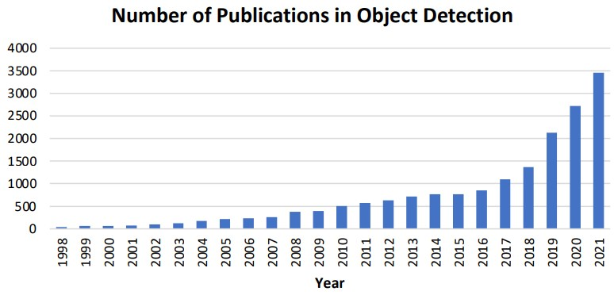
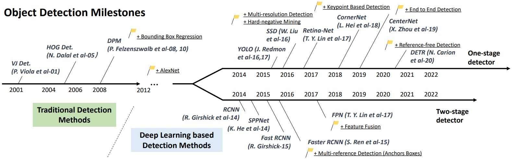
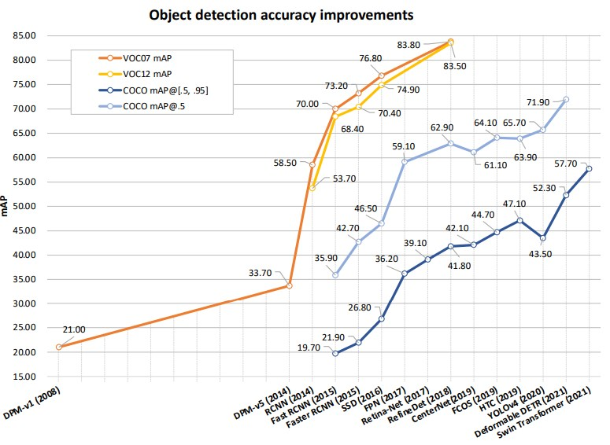
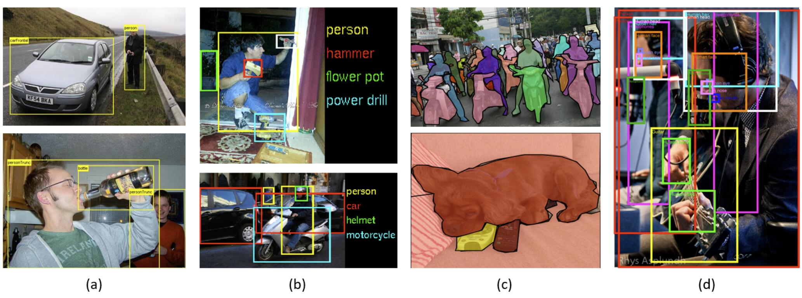
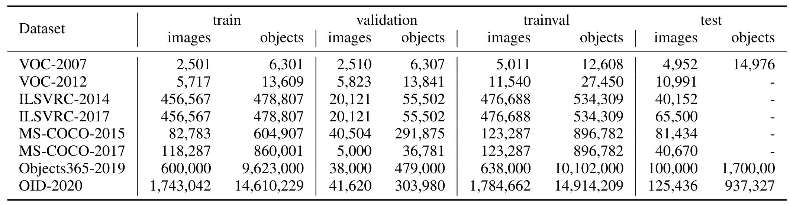
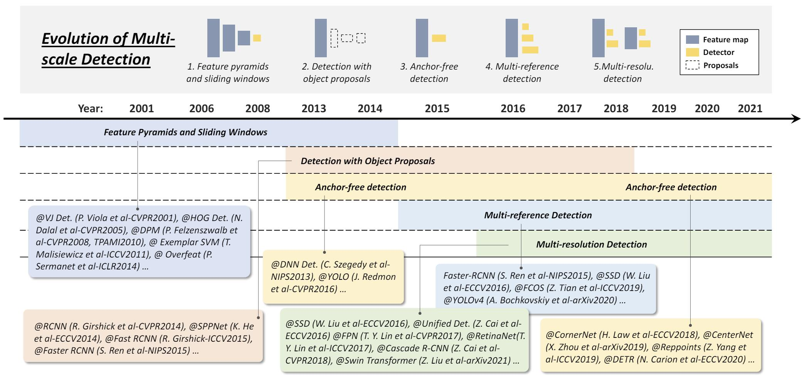
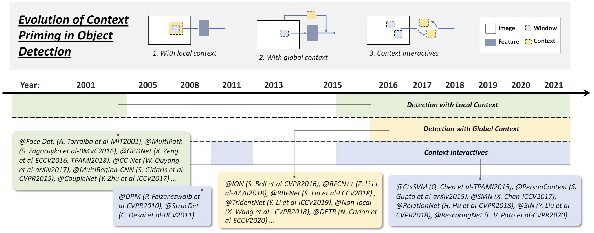
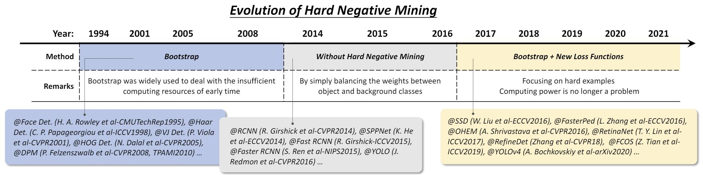
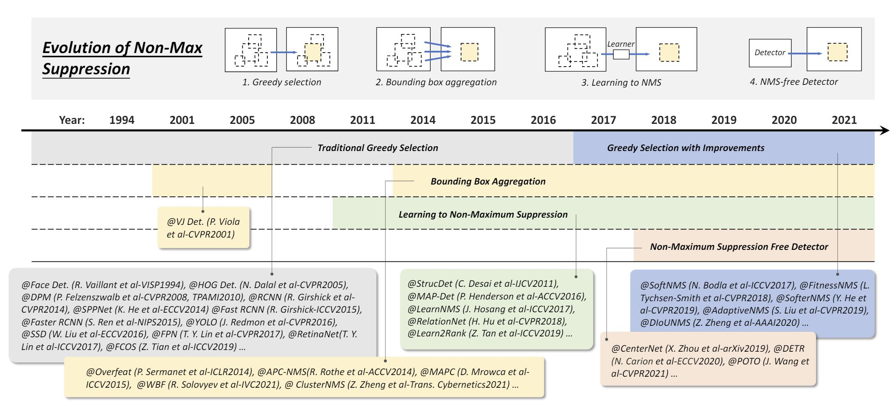

# [Object Detection in 20 Years: A Survey](https://arxiv.org/abs/1905.05055)

## Abstract

目标检测是计算机视觉领域最基本也是最具挑战性的问题之一，近年来备受关注。在过去的二十年中，我们目睹了目标检测技术的飞速发展及其对整个计算机视觉领域的深远影响。如果将当今的目标检测技术视为深度学习驱动的一场革命，那么回溯到 1990 年代，我们将看到早期计算机视觉研究人员的独创思维和长远的设计理念。本文广泛回顾了这个快速发展的研究领域，涵盖了其从 1990 年代到 2022 年超过四分之一个世纪的技术演变历程。本文论述了历史上的里程碑式检测器、检测数据集、评价指标、检测系统基本构建模块、加速技术以及最新颖的检测方法等诸多主题。

索引项 - 目标检测、计算机视觉、深度学习、卷积神经网络、技术演变

## I. INTRODUCTION

目标检测是计算机视觉领域的一项重要任务，它处理在数字图像中检测特定类别（例如人类、动物或汽车）的视觉对象的实例。目标检测的目标是开发计算模型和技术，为计算机视觉应用程序提供最基本的知识之一：哪些物体位于何处？目标检测最重要的两个评价指标是精度（包括分类精度和定位精度）和速度。

目标检测是许多其他计算机视觉任务的基础，例如实例分割 [1–4]、图像描述 [5–7]、对象跟踪 [8] 等。近年来，深度学习技术 [9] 的飞速发展极大地促进了目标检测的进步，取得了显著突破，并将其推向了前所未有的关注热度。目标检测现已广泛应用于许多现实世界应用，例如自动驾驶、机器人视觉、视频监控等。图 1 展示了过去二十年中与“目标检测”相关的出版物数量的增长。

**图 1**：1998 年至 2021 年目标检测领域论文数量的增长。（数据来自 Google 学术高级搜索：allintitle: “object detection” OR “detecting objects”。）

由于不同的检测任务具有完全不同的目标和约束，因此它们的难度可能彼此差异很大。除了其他计算机视觉任务中的一些常见挑战，例如不同视角、光照和类内变化下的物体之外，目标检测面临的挑战还包括但不限于以下几个方面：物体旋转和尺度变化（例如小物体）、准确的物体定位、密集和遮挡的目标检测、检测速度加快等。我们在第四节将更详细地分析这些主题。

这篇综述旨在让初学者从多个角度全面掌握目标检测技术，并着重于其发展历程。主要特点有三点：结合技术演变的全面回顾，深入探讨关键技术和最新技术，以及对检测加速技术的综合分析。主要线索侧重于过去、现在和未来，并辅以目标检测中其他一些必要组件，例如数据集、指标和加速技术。这篇综述立足于技术发展之路，旨在展示相关技术的演变，让读者掌握基本概念并找到潜在的未来发展方向，同时忽略技术细节。

本文其余部分安排如下。第二节回顾了 20 年来目标检测的发展历程。第三节回顾了目标检测中的加速技术。第四节回顾了最近三年的最先进检测方法。第五节总结本文并深入分析未来的研究方向。

## II. OBJECT DETECTION IN 20 YEARS

本节将回顾目标检测的历史，涵盖里程碑检测器、数据集、评价指标以及关键技术的演进。

### A. A Road Map of Object Detection

**图 2**：目标检测路线图。图中的里程碑检测器：VJ Det. [10, 11], HOG Det. [12], DPM [13– 15], RCNN [16], SPPNet [17], Fast RCNN [18], Faster RCNN [19], YOLO [20–22], SSD [23], FPN [24], Retina-Net [25], CornerNet [26], CenterNet [27], DETR [28].

过去二十年中，目标检测的进步经历了两个历史时期，“传统目标检测时期（2014 年之前）”和“基于深度学习的检测时期（2014 年之后）”，如图 2 所示。下文中，我们将总结这一时期的里程碑检测器，出现的时代和性能是主要的线索，以突出背后的驱动技术，参见图 3。

**图 3**：目标检测器的准确率提升。VOC12 和 MS-COCO 数据集。图中的检测器：DPM-v1 [13], DPM-v5 [37], RCNN [16], SPPNet [17], Fast RCNN [18], Faster RCNN [19], SSD [23], FPN [24], RetinaNet [25], RefineDet [38], TridentNet [39] CenterNet [40], FCOS [41], HTC [42], YOLOv4 [22], Deformable DETR [43], Swin Transformer [44].

1）里程碑：传统检测器：如果将当今的目标检测技术视为深度学习驱动的革命，那么早在 1990 年代，我们可以看到早期计算机视觉的巧妙设计和长远眼光。大多数早期的目标检测算法都基于手工提取的特征。由于当时缺乏有效的图像表示方法，人们不得不设计复杂的特征表示和各种加速技巧。

**Viola-Jones 检测器**：2001 年，P. Viola 和 M. Jones 首次实现了无需任何限制（例如肤色分割）的实时人脸检测 [10, 11]。该检测器运行在 700MHz Pentium III CPU 上，在可比较 (与其他相当或差不多) 的检测精度下，其速度比当时的其他算法快几十甚至几百倍。VJ 检测器遵循最简单的检测方式，即滑动窗口：遍历图像中所有可能的的位置和尺度，查看是否有窗口包含人脸。尽管这看起来非常简单，但其背后的计算量远远超出了当时计算机的处理能力。VJ 检测器通过结合三种重要技术（“积分图像”、“特征选择”和“级联检测”（将在第三节介绍））显著提高了检测速度。

**HOG 检测器**：2005 年，N. Dalal 和 B. Triggs 提出了方向梯度直方图 (HOG) 特征描述符 [12]。HOG 可以被认为是当时尺度不变的特征变换 [29, 30] 和形状上下文 [31] 的重要改进。为了平衡特征不变性（包括平移、缩放、光照等）和非线性，HOG 描述符被设计为在密集网格的均匀间隔单元上计算，并使用重叠的局部对比度归一化（在“块”上）。虽然 HOG 可以用于检测各种物体类别，但其最初的动机主要是行人检测问题。为了检测不同大小的物体，HOG 检测器会多次重新缩放输入图像，同时保持检测窗口的大小不变。多年来，HOG 特征描述子一直是许多目标检测器 [13, 14, 32] 和各种计算机视觉应用的重要基础。

**形变部件模型 (DPM)**：DPM 是 VOC-07、-08 和 -09 检测挑战赛的获胜者，代表了传统目标检测方法的巅峰。DPM 最初由 P. Felzenszwalb 于 2008 年提出 [13]，作为 HOG 检测器的扩展。它遵循“分而治之”的检测理念，训练可以简单地理解为学习一种适当的方式分解物体，推理可以被视为对不同物体部件的检测集合。例如，检测“汽车”的问题可以分解为检测其窗户、车身和车轮。这部分工作，也称为 “star-model” ，由 P. Felzenszwalb 等人提出 [13]。后来，R. Girshick 进一步将星形模型扩展到 “mixture models”，以处理现实世界中具有更大变化的物体，并做了一系列其他改进 [14, 15, 33, 34]。

虽然当今的目标检测器在检测精度上已经远远超过 DPM，但它们中的许多仍然深受其宝贵见解的影响，例如混合模型、困难负样本挖掘、边界框回归、上下文引导等。2010 年，P. Felzenszwalb 和 R. Girshick 被 PASCAL VOC 授予“终身成就奖”。

2）里程碑：基于 CNN 的两阶段检测器：随着手工特征性能的饱和，2010 年后目标检测研究陷入停滞状态。2012 年，卷积神经网络迎来了重生 [35]。由于深度卷积网络能够学习图像鲁棒且高级的特征表示，因此人们自然而然地会产生一个疑问：能否将其引入目标检测领域？Girshick 等人率先在 2014 年提出了具有 CNN 特征的区域 (RCNN) 打破僵局 [16, 36]。从那时起，目标检测开始以前所未有的速度发展。深度学习时代的目标检测器可以分为两大类：“两阶段检测器”和“单阶段检测器”，前者将检测框定为“粗到精”的过程，而后者则将其框定为“一步完成”的过程。

**RCNN**：RCNN 的基本思想很简单：它首先通过选择性搜索 [45] 提取一组物体建议（候选框）。然后将每个建议缩放成固定大小的图像，并输入到在 ImageNet 上预训练的 CNN 模型（例如 AlexNet [35]）中提取特征。最后，使用线性 SVM 分类器来预测每个区域内是否存在物体以及识别物体类别。RCNN 在 VOC07 数据集上取得了显著的性能提升，平均精度 (mAP) 从 33.7%（DPM-v5 [46]）大幅提升到了 58.5%。尽管 RCNN 取得了巨大进步，但其缺点也很明显：大量重叠提案（一张图像中来自 2000 多个框）的冗余特征计算导致检测速度极慢（GPU 上每张图像 14 秒）。同年晚些时候，SPP 网络 [17] 被提出并解决了这个问题。

**SPPNet**：2014 年，何凯明等提出了空间金字塔池化网络 (SPPNet) [17]。之前的 CNN 模型需要固定大小的输入，例如 AlexNet [35] 需要 224x224 的图像。SPPNet 的主要贡献在于引入了空间金字塔池化 (SPP) 层，该层使 CNN 能够生成固定长度的表示，而无需缩放图像/感兴趣区域。在将 SPPNet 用于目标检测时，特征图可以仅从整个图像计算一次，然后生成任意区域的固定长度表示用于训练检测器，从而避免了重复计算卷积特征。SPPNet 的速度比 R-CNN 快 20 多倍，同时没有损失任何检测精度 (VOC07 mAP = 59.2%)。虽然 SPPNet 有效地提高了检测速度，但仍存在一些缺点：一是训练仍然是多阶段的，二是 SPPNet 只微调其全连接层，而忽略了所有前面的层。这之后的第二年提出的 Fast RCNN 解决了这些问题。

**Fast RCNN**：2015 年，R. Girshick 提出了 Fast RCNN 检测器 [18]，它是 R-CNN 和 SPPNet 的进一步改进 [16, 17]。Fast RCNN 使我们能够在相同的网络配置下同时训练检测器和边界框回归器。在 VOC07 数据集上，Fast RCNN 将 mAP 从 58.5%（RCNN）提升到了 70.0%，同时检测速度比 R-CNN 快 200 多倍。虽然 Fast-RCNN 成功整合了 R-CNN 和 SPPNet 的优点，但其检测速度仍然受到候选框检测的限制（有关详细信息，请参见 II-C1）。那么，自然而然地会产生一个问题：“能否使用 CNN 模型生成候选框？” 稍后，Faster R-CNN [19] 回答了这个问题。

**Faster RCNN**：2015 年，任少卿等人紧随 Fast RCNN 之后提出了 Faster RCNN 检测器 [19, 47]。Faster RCNN 是首个接近实时的深度学习检测器 (COCO mAP@.5 = 42.7%，VOC07 mAP = 73.2%，使用 ZF-Net [48] 可达 17 fps)。Faster-RCNN 的主要贡献是引入了区域建议网络 (RPN)，该网络可以几乎免费地生成区域建议。从 R-CNN 到 Faster RCNN，目标检测系统的大多数独立模块（例如候选框检测、特征提取、边界框回归等）已经逐渐集成到一个统一的端到端学习框架中。虽然 Faster RCNN 突破了 Fast RCNN 的速度瓶颈，但在后续的检测阶段仍然存在计算冗余。后来，提出了各种改进方法，包括 RFCN [49] 和 Light head RCNN [50]。（更多细节见章节 III）

**特征金字塔网络 (FPN)**：在 2017 年, T.-Y. Lin et al. 提出了 FPN [24]。在 FPN 出现之前，大多数基于深度学习的检测器只在网络顶层的特征图上进行检测。虽然 CNN 深层特征有利于类别识别，但不利于定位物体。为此，FPN 引入了自顶向下的具有横向连接的架构，旨在构建所有尺度的的高级语义信息。由于 CNN 在前向传播过程中会自然地形成特征金字塔，因此 FPN 在检测各种尺度的物体方面取得了巨大进步。在基本的 Faster R-CNN 系统中使用 FPN，它在 COCO 数据集上实现了最先进的单模型检测结果 (COCO mAP@.5 = 59.1%)，无需任何额外改进 。FPN 已经成为许多最新检测器的基本构建模块。

3）里程碑：基于 CNN 的单阶段检测器：大多数两阶段检测器遵循从粗到精的处理范式。粗检测旨在提高召回率，精检测则在粗检测的基础上细化定位，更加注重判别能力。它们可以轻松实现高精度，但由于速度慢和复杂性高，很少用于工程应用。相反，单阶段检测器可以在一步推理中检测所有物体。它们因其实时性和易部署特性而受到移动设备的青睐，但在检测密集和小物体时性能会明显下降。

**You Only Look Once (YOLO)**：YOLO 是由 Joseph Redmon 等人在 2015 年提出的，它是深度学习时代首个单阶段检测器 [20]。YOLO 非常快：YOLO 的快速版本在 VOC07 上 mAP 为 52.7%，运行速度为 155 fps，其增强版本在 VOC07 上 mAP 为 63.4%，运行速度为 45fps。YOLO 遵循与两阶段检测器完全不同的范式：将单个神经网络应用于整幅图像。该网络将图像划分为区域，并同时预测每个区域的边界框和概率。尽管 YOLO 的检测速度有了很大提高，但与两阶段检测器相比，其定位精度有所下降，尤其是一些小物体。YOLO 的后续版本 [21, 22, 51] 和后来提出的 SSD [23] 更关注这个问题。最近，YOLOv4 团队提出了后续工作 YOLOv7 [52]。通过引入动态标签分配和模型结构重新参数化等优化结构，它在速度和精度方面超越了大多数现有目标检测器（范围从 5 FPS 到 160 FPS）。

**单发多框检测器 (SSD)**：SSD 由刘伟等人于 2015 年提出 [23]。SSD 的主要贡献在于引入了多参考和多分辨率检测技术（将在章节 II-C1 中介绍），这显著提高了单阶段检测器的检测精度，尤其是对于一些小物体。SSD 在检测速度和精度方面都具有优势 (COCO mAP@.5 = 46.5%，快速版本运行速度为 59 fps)。SSD 与之前检测器的主要区别在于 SSD 在网络的不同层检测不同尺度的物体，而之前的检测器只在其顶层运行检测。

**RetinaNet**：尽管单阶段检测器速度快且简单，但多年来其准确性一直落后于两阶段检测器。T.-Y. Lin 等人探索了其中的原因并于 2017 年提出了 RetinaNet [25]。他们发现，密集检测器训练过程中遇到的极端前景-背景类别不平衡是主要原因。为此，RetinaNet 引入了一种名为 “focal loss” 的新损失函数，通过重新塑造标准交叉熵损失函数，使检测器在训练过程中更加关注难分类的误分类样本。Focal Loss 使单阶段检测器能够在保持非常高的检测速度的同时，实现与两阶段检测器相当的精度 (COCO mAP@.5 = 59.1%) 。

**CornerNet**：以前的方法主要使用锚框来提供分类和回归的参考。物体在数量、位置、尺度、宽高比等方面经常发生变化。为了实现高性能，需要设置大量的参考框以更好地匹配真实框。然而，这将导致网络进一步类别不平衡、大量手动设计的超参数以及较长的收敛时间。为了解决这些问题，H. Law 等人 [26] 抛弃了以前的检测范式，将任务视为关键点（框的角点）预测问题。获得关键点后，它将利用额外的嵌入信息对角点进行解耦和重新分组以形成边界框。CornerNet 在当时的表现优于大多数单阶段检测器 (COCO mAP@.5 = 57.8%)。

**CenterNet**：X. Zhou 等人在 2019 年提出了 CenterNet [40]。它也遵循基于关键点的检测范式，但去掉了昂贵的后处理步骤，例如基于组的关键点分配（在 CornerNet [26]、ExtremeNet [53] 等中）和非极大值抑制 (NMS)，从而形成一个完全端到端的检测网络。CenterNet 将物体视为单个点（物体的中心），并基于参考中心点回归其所有属性（例如大小、方向、位置、姿态等）。该模型简单优雅，可以将三维目标检测、人体姿态估计、光流学习、深度估计等任务集成到一个框架中。尽管使用了如此简洁的检测概念，CenterNet 也能取得相当的检测结果 (COCO mAP@.5 = 61.1%)。

**DETR**：近年来，Transformer 在整个深度学习领域，特别是计算机视觉领域产生了深远影响。为了克服 CNN 的局限性并获得全局感受野，Transformer 抛弃了传统的卷积运算器，转而采用仅注意力机制的计算。2020 年，Carion 等人提出了 DETR [28]，他们将目标检测视为集合预测问题，并提出了一个端到端的 Transformer 检测网络。迄今为止，目标检测进入了一个新时代，无需使用锚框或锚点即可检测物体。后来，朱显等人在 Deformable DETR [43] 中解决了 DETR 的收敛时间长和检测小物体性能受限的问题。它在 MSCOCO 数据集上实现了最先进的性能 (COCO mAP@.5 = 71.9%)。

### B. Object Detection Datasets and Metrics

1）数据集：构建更大且偏倚更少的训练数据集对于开发先进的检测算法至关重要。过去 10 年里发布了许多著名的检测数据集，例如 PASCAL VOC 挑战赛数据集 [54, 55]（例如 VOC2007、VOC2012），ImageNet 大型视觉识别挑战赛 (e.g., ILSVRC2014) [56]，MS COCO 检测挑战赛 [57]，Open Images 数据集 [58, 59]，Objects365 数据集 [60] 等。 表 I 列出了这些数据集的统计信息。图 4 展示了一些来自这些数据集的图像示例。图 3 展示了 2008 年到 2021 年间在 VOC07、VOC12 和 MS COCO 数据集上检测精度的提升。

**图 4**：在 (a) PASCAL-VOC07，(b) ILSVRC，(c) MS-COCO 和 (d) Open Images 上的一些示例和标注。

**表 I**：一些著名的目标检测数据集和它们的统计。

**PASCAL VOC**：PASCAL 视觉对象类别 (VOC) 挑战赛 (2005 年到 2012 年) [54, 55] 是早期计算机视觉领域最重要的竞赛之一。目标检测领域主要使用两个版本的 Pascal VOC：VOC07 和 VOC12，其中 VOC07 包含 5000 张训练图像 + 12,000 个标注对象，VOC12 包含 11,000 张训练图像 + 27,000 个标注对象。这两个数据集标注了 20 个日常生活常见的物体类别，例如“人”、“猫”、“自行车”、“沙发”等。

**ILSVRC**：ImageNet 大型视觉识别挑战赛 (ILSVRC) [56] 推动了通用目标检测的最新技术水平。ILSVRC 从 2010 年到 2017 年每年举办一次。它包含了一个使用 ImageNet 图像的检测挑战 [61]。ILSVRC 检测数据集包含 200 个视觉对象类别。其图像/物体实例数量比 VOC 大两个数量级。

**MS-COCO**：MS-COCO [57] 是当今最具挑战性的目标检测数据集之一。基于 MS-COCO 数据集的年度竞赛自 2015 年以来一直举行。它比 ILSVRC 具有更少的物体类别，但拥有更多的物体实例。例如，MS COCO-17 包含来自 80 个类别的 164,000 张图像和 897,000 个标注对象。与 VOC 和 ILSVRC 相比，MS-COCO 的最大进步在于除了边界框标注之外，每个物体还使用每个实例分割进行进一步标记，以帮助精确定位。此外，MS-COCO 还包含更多的小物体（其面积小于图像的 1%）和更多密集定位的物体。就像 ImageNet 当年一样，MS-COCO 也已成为目标检测领域的标准。

**Open Images**：继 MS-COCO 之后，2018 年推出了 Open Images 检测 (OID) 挑战赛 [62]，规模前所未有。Open Images 包含两个任务：1) 标准目标检测，以及 2) 检测特定关系中的成对物体（视觉关系检测）。对于标准检测任务，该数据集包含 191 万张图像，以及 600 个物体类别上的 1544 万个标注边界框。

2）评估指标：如何评估检测器的精度？这个问题在不同时期可能会有不同的答案。在早期目标检测研究中，还没有得到广泛认可的检测精度评价指标。例如，在早期行人检测研究中，“漏检率 vs. 每窗口误报数 (FPPW)” 被常用作评价指标。然而，这种基于窗口的测量方法存在缺陷，无法预测整幅图像的性能 [63]。2009 年，Caltech 行人检测基准测试被引入 [63, 64]，从此评价指标从 FPPW 改为每图像误报数 (FPPI)。

近年来，目标检测最常用的评价指标是“平均精确率 (AP)”，该指标最初在 VOC2007 中引入。AP 被定义为不同召回率下的平均检测精确率，通常以类别特定的方式进行评估。最终性能指标通常使用所有类别平均的平均精确率 (mAP)。为了衡量物体定位精度，会使用预测框和标注框之间的 IoU 来判断其是否大于预定义的阈值，例如 0.5。如果是，则该物体将被识别为“检测到”，否则为“漏检”。0.5-IoU mAP 因此成为目标检测的标准评价指标。

2014 年之后，随着 MS-COCO 数据集的引入，研究人员开始更加关注物体定位的准确性。MS-COCO AP 不再使用固定的 IoU 阈值，而是对 0.5 到 0.95 之间的多个 IoU 阈值进行平均，这鼓励更准确的物体定位，并且可能对一些现实世界应用非常重要（例如，想象一个机器人试图抓取扳手）。

### C. Technical Evolution in Object Detection

这一部分将介绍检测系统的一些重要组成部分及其技术演变。首先，我们将描述模型设计中的多尺度和上下文引导，然后是训练过程中的样本选择策略和损失函数设计，最后是推理过程中的非极大值抑制。图表和文本中的时间戳由论文发表时间提供。图中所示的演化顺序主要为了帮助读者理解，可能存在时间重叠。

1）多尺度检测的技术演进：“不同尺寸”和“不同宽高比”的物体多尺度检测是目标检测的主要技术挑战之一。如图 5 所示，过去 20 年间，多尺度检测经历了多个历史时期。

**图 5**：目标检测中多尺度检测的演化进程。图中的检测器：VJ Det. [10], HOG Det. [12], DPM [13], Exemplar SVM [32], Overfeat [65], RCNN [16], SPPNet [17], Fast RCNN [18], Faster RCNN [19], DNN Det. [66], YOLO [20], SSD [23], Unified Det. [67], FPN [24], RetinaNet [25], RefineDet [38], Cascade R-CNN [68], Swin Transformer [44], FCOS [41], YOLOv4 [22], CornerNet [26], CenterNet [40], Reppoints [69], DETR [28].

**特征金字塔 + 滑动窗口**：继 VJ 检测器之后，研究人员开始更多地关注一种更直观的检测方式，即构建“特征金字塔 + 滑动窗口”。2004 年以来，基于这一范式的里程碑式检测器层出不穷，例如 HOG 检测器、DPM 等。它们经常在图像上滑动固定大小的检测窗口，很少关注“不同宽高比”。为了检测外观更复杂的物体，R. Girshick 等人开始在特征金字塔之外寻找更好的解决方案。“混合模型” [15] 当时是一种解决方案，即针对不同宽高比的物体训练多个检测器。除此之外，基于示例的检测 [32, 70] 也提供另一种解决方案，即为每个物体实例 (exemplar) 训练单独的模型。

**基于候选框的检测**：物体候选框是指一组可能包含任何物体的类不可知的参考框。基于候选框的检测有助于避免在图像上进行详尽的滑动窗口搜索。有关此主题的全面综述，我们推荐读者阅读以下论文 [71, 72]。早期的时间候选框检测方法遵循自下而上的检测理念 [73, 74]。2014 年之后，随着深度卷积神经网络 (CNN) 在视觉识别中的流行，自顶向下、基于学习的方法开始在这个问题上显示出更多优势 [19, 75, 76]。现在，随着单阶段检测器的兴起，基于候选框的检测逐渐淡出人们的视线。

**深度回归和无锚框检测**：近年来，随着 GPU 计算能力的提升，多尺度检测变得越来越简单粗暴。使用深度回归解决多尺度问题的思路变得简单，即直接基于深度学习特征预测边界框的坐标 [20, 66]。2018 年之后，研究人员开始从关键点检测的角度思考目标检测问题。这些方法通常遵循两种思路：一种是分组方法，它检测关键点（角点、中心点或代表点），然后进行物体分组 [26, 53, 69, 77]；另一种是无分组方法，它将物体视为一个/多个点，然后根据点的参考回归物体属性 (尺寸、宽高比等) [40, 41]。

**多引用/分辨率检测**：多引用检测现在是用于多尺度检测的最常用方法 [19, 22, 23, 41, 47, 51]。多引用检测的主要思想 [19, 22, 23, 41, 47, 51] 是首先在图像的每个位置定义一组引用 (又称 anchors，包括框和点)，然后基于这些引用预测检测框。另一种流行的技术是多分辨率检测 [23, 24, 44, 67, 68]，即在网络的不同层检测不同尺度的物体。多引用和多分辨率检测现在已经成为最先进的目标检测系统中的两个基本组成部分。

2）上下文引导的技术演进：视觉对象通常嵌入到一个由周围环境组成的典型语境中。我们的大脑利用物体和环境之间的关联来促进视觉感知和认知 [96]。上下文引导长期被用于改善检测性能。图 6 展示了上下文引导在目标检测中的演进过程。

**图 6**：目标检测中上下文引导的演化进程。图中的检测器：Face Det. [78], MultiPath [79], GBDNet [80, 81], CC-Net [82], MultiRegion-CNN [83], CoupleNet [84], DPM [14, 15], StructDet [85], ION [86], RFCN++ [87], RBFNet [88], TridentNet [39], Non-local [89], DETR [28], CtxSVM [90], PersonContext [91], SMN [92], RelationNet [93], SIN [94], RescoringNet [95].

**使用局部上下文的检测**：局部上下文是指检测目标周围区域的视觉信息。长期以来，人们公认局部上下文有助于改善目标检测。在 20 世纪初，Sinha 和 Torralba [78] 发现加入局部上下文区域（例如面部边界轮廓）可以显著提高人脸检测性能。Dalal 和 Triggs 也发现加入少量背景信息可以提高行人检测的准确率 [12]。最近的基于深度学习的检测器也可以通过简单地扩大网络感受野或物体候选框的大小来利用局部上下文进行改进 [79-84, 97]。

**使用全局上下文的检测**：全局上下文利用场景配置作为目标检测的附加信息来源。对于早期检测器，常用的全局上下文集成方式是融入场景元素的统计摘要，例如 Gist [96]。最近的检测器则采用两种方法集成全局上下文。第一种方法是利用深度卷积、扩张卷积、可变形卷积、池化操作等来获得大的感受野（甚至比输入图像更大）[39, 87, 88]。现在，研究人员开始探索基于注意力的机制（非局部、transformer 等）来实现全图像感受野，并取得了巨大成功 [28, 89]。第二种方法将全局上下文视为一种序列信息，并利用循环神经网络进行学习 [86, 98]。

**上下文交互**：上下文交互是指视觉元素之间传递的约束和依赖关系。最近的一些研究表明，通过考虑上下文交互，可以改善现代检测器。一些改进可以分为两类，第一类是探索单个物体之间的关系 [15, 85, 90, 92, 93, 95]，第二类是探索物体和场景之间的依赖关系 [91, 94]。

3）困难负样本挖掘的技术演进：检测器的训练本质上是一个数据不平衡的学习问题。例如，基于滑动窗口的检测器，背景和目标之间的数量比可能极端到 107:1 [71]。在这种情况下，使用所有背景样本反而会损害训练，因为大量的简单负样本会淹没学习过程。困难负样本挖掘 (HNM) 旨在克服这个问题。HNM 的技术演进如图 7 所示。

**图 7**：目标检测中困难负样本挖掘的演进。图中的检测器：Face Det. [99], Haar Det. [100], VJ Det. [10], HOG Det. [12], DPM [13, 15], RCNN [16], SPPNet [17], Fast RCNN [18], Faster RCNN [19], YOLO [20], SSD [23], FasterPed [101], OHEM [102], RetinaNet [25], RefineDet [38], FCOS [41], YOLOv4 [22].

**Bootstrap**：目标检测中的 bootstrap 是指一组训练技术，其中训练从一小部分背景样本开始，然后迭代添加新的误分类样本。早期检测器经常使用 bootstrap 来减少处理数百万背景样本的训练计算量 [10, 99, 100]。后来它成为 DPM 和 HOG 检测器解决数据不平衡问题的一种标准技术 [12, 13]。

**深度学习检测器中的困难负样本挖掘**：深度学习时代，由于计算能力的提高，2014-2016 年间 bootstrap 在目标检测中被短暂舍弃 [16-20]。为了缓解训练过程中的数据不平衡问题，Faster R-CNN 和 YOLO 等检测器只是简单地平衡了正负窗口之间的权重。然而，研究人员后来注意到这并不能完全解决不平衡问题 [25]。为此，2016 年之后 bootstrap 被重新引入目标检测领域 [23, 38, 101, 102]。另一种改进方法是设计新的损失函数 [25]，通过重塑标准交叉熵损失函数，使模型更加关注困难的误分类样本。

4）损失函数的技术演进：损失函数衡量模型与数据的拟合程度（即预测值与真实标签的偏差）。计算损失会产生模型权重的梯度，然后可以通过反向传播进行更新以更好地拟合数据。分类损失和定位损失共同构成目标检测问题的监督，见公式 1。损失函数的一般形式可以写成如下形式：
$$
L(p,p^*,t,t^*) = L_{cls.}(p,p^*) + \beta I(t)L_{loc.}(t,t*) \\
I(t) = \left\{\begin{matrix}
 1 & \mathrm{IOU}\set{a,a^*} > \eta \\
 0 & else
\end{matrix}\right. \tag{1}
$$

其中 $t$ 和 $t^*$ 是预测和真实边界框的位置， $p$ 和 $p^*$ 是它们的类别概率。 $\mathrm{IoU}\set{a, a^*}$  是参考框/点 $a$ 和其真实值 $a^*$ 之间的 IoU。 $\eta$ 是一个 IoU 阈值，例如 0.5。如果锚框/点与任何物体都不匹配，它的定位损失就不会计入最终损失。

**分类损失**：分类损失用于评估预测类别与真实类别的差异，这在前期的工作中没有被深入研究，例如 YOLOv1 [20] 和 YOLOv2 [51] 使用 MSE/L2 损失 (均方误差)。后来，CE 损失 (交叉熵) 被普遍采用 [21, 23, 47]。L2 损失是欧几里得空间中的度量，而 CE 损失可以度量分布差异（称为一种似然形式）。分类的预测是一个概率，因此 CE 损失比 L2 损失更可取，因为它具有更大的误分类成本和更低的梯度消失效应。为了提高分类效率，提出了标签平滑 (Label Smooth) 来增强模型泛化能力并解决噪声标签的过度拟合问题 [103, 104]，焦点损失 (Focal loss) 则被设计来解决类别不平衡和分类难度差异的问题 [25]。

**定位损失**：定位损失用于优化位置和大小偏差。L2 损失在早期研究中很普遍 [16, 20, 51]，但它容易受到异常值的影响，并且容易出现梯度爆炸。研究人员结合了 L1 损失和 L2 损失的优点，提出了 Smooth L1 损失，如下面的公式所示：

$$
\mathrm{Smooth}_{L1}(x) = \left\{\begin{matrix}
 0.5x^2 & if \left| x \right| < 1 \\
 \left| x \right| - 0.5 & else
\end{matrix}\right. \tag{2}
$$

其中 $x$ 表示目标值和预测值之间的差值。在计算误差时，上述损失将代表包围框的四个数字 $(x, y, w, h)$ 视为独立变量，然而它们之间存在相关性。此外，IoU 用于评估预测框在评估中是否对应于实际的真实框。相同的 Smooth L1 值将具有完全不同的 IoU 值，因此引入了 IoU 损失，如下所示：

$$
\mathrm{IoU \ loss} = -\log(\mathrm{IoU}) \tag{3}
$$

接下来，几种算法改进了 IoU 损失函数。GIoU (Generalized IoU) [106] 针对 IoU 损失无法优化非重叠边界框（即 IoU = 0）的情况进行了改进。Distance-IoU [107] 认为成功的检测回归损失应该满足三个几何指标：重叠面积、中心点距离和宽高比。因此，基于 IoU 损失和 G-IoU 损失，DIoU (Distance IoU) 被定义为预测框的中心点到真实框的中心点的距离，CIoU (Complete IoU) [107] 则在 DIoU 的基础上考虑了宽高比的差异。

5）非极大值抑制的技术演进：由于相邻窗口通常具有相似的检测分数，因此非极大值抑制被用作后处理步骤，以删除重复的边界框并获得最终的检测结果。在物体检测的早期，NMS 并不总是被集成 [121]。这是因为当时物体检测系统的期望输出并不完全清晰。图 8 展示了 NMS 在过去 20 年中的发展历程。

**图 8**：1994-2021 年目标检测中非极大值抑制 (NMS) 技术的演进。1) 贪婪选择，2) 边界框聚合，3) 基于学习的 NMS，4) NMS-free 检测。图中的检测器：Face Det. [108], HOG Det. [12], DPM [13, 15], RCNN [16], SPPNet [17], Fast RCNN [18], Faster RCNN [19], YOLO [20], SSD [23], FPN [24], RetinaNet [25], FCOS [41], StrucDet [85], MAP-Det [109], LearnNMS [110], RelationNet [93], Learn2Rank [111], SoftNMS [112], FitnessNMS [113], SofterNMS [114], AdaptiveNMS [115], DIoUNMS [107], Overfeat [65], APC-NMS [116], MAPC [117], WBF [118], ClusterNMS [119], CenterNet [40], DETR [28], POTO [120].

**贪婪选择**：贪婪选择是一种老式的方法，也是最流行的 NMS 执行方式。其背后的思想简单直观：对于一组重叠的检测，选择具有最大检测分数的边界框，同时根据预定义的重叠阈值删除其邻近框。虽然贪婪选择现在已经成为 NMS 的事实标准方法，但仍存在一些改进空间。首先，得分最高的框可能并不是最合适的。其次，它可能会抑制附近的物体。最后，它不能抑制误报 [116]。许多工作被提出解决上述问题 [107, 112, 114, 115]。

**边界框聚合**：边界框聚合是另一组用于 NMS 的技术 [10, 65, 116, 117]，其思想是将多个重叠的边界框组合或聚类成一个最终的检测结果。这种方法的优点在于它充分考虑了物体之间的关系及其空间布局 [118, 119]。一些著名的检测器使用这种方法，例如 VJ 检测器 [10] 和 Overfeat（ILSVRC-13 定位任务的获胜者）[65].

**基于学习的 NMS**：最近备受关注的一组 NMS 改进是基于学习的 NMS [85, 93, 109–111, 122]。其主要思想是将 NMS视为一种过滤器，可以对所有原始检测进行重新评分，并以端到端的方式将 NMS 作为网络的一部分进行训练，或训练网络模仿 NMS 的行为。这些方法在改善遮挡和密集物体检测方面显示出优于传统手工制作的 NMS 方法的有希望的结果。

**NMS-free 检测器**：为了摆脱 NMS 并实现完全端到端的物体检测训练网络，研究人员开发了一系列方法来完成一对一标签分配（即一个物体只有一个预测框）[28, 40, 120]。这些方法经常遵循一项规则，该规则要求在训练中使用最高质量的框来实现无 NMS。无 NMS 检测器更类似于人类视觉感知系统，也可能是未来物体检测发展的一个方向。

### III. SPEED-UP OF DETECTION

