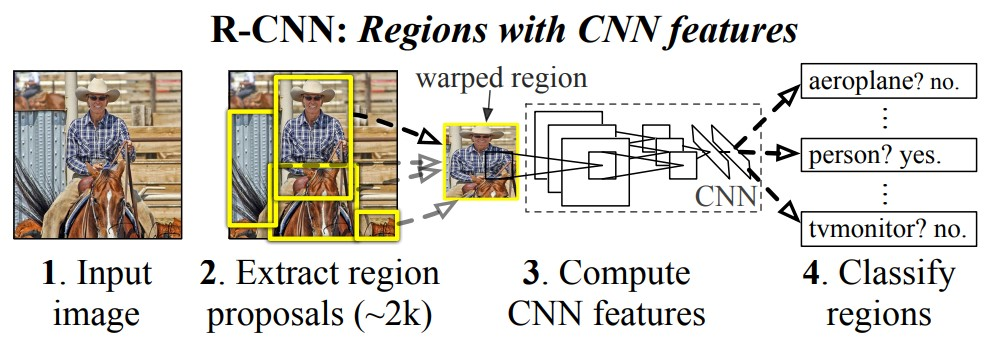

# [Rich feature hierarchies for accurate object detection and semantic segmentation](https://arxiv.org/abs/1311.2524)

## Abstract

在 PASCAL VOC 数据集上测量的目标检测性能在过去几年中已经趋于平稳。效果最好的方法是融合了多种低维图像特征和高维上下文环境的复杂融合系统。本文提出了一种简单且可扩展的检测算法，与先前在 VOC 2012上 的最佳结果相比，平均精度 (mAP) 提高了 30% 以上，达到 53.3% 的 mAP。我们的方法结合了两个关键见解：(1) 可以将高容量卷积神经网络 (CNN) 应用于自下而上的候选区域，以定位和分割对象； (2) 当标记的训练数据不足时，针对辅助任务进行监督预训练，然后进行特定于域的微调，可以显著提高性能。由于我们将候选区域与 CNN 相结合，因此我们将其称为 R-CNN：Regions with CNN features。我们还将 R-CNN 与 OverFeat 进行了比较，后者是一种基于类似 CNN 架构的滑动窗口检测器。我们发现，在 200 类 ILSVRC2013 检测数据集上，R-CNN 的表现远远优于 OverFeat。完整系统的源代码可在 <http://www.cs.berkeley.edu/˜rbg/rcnn> 上找到。

**图 1**：对象检测系统概览。我们的系统 (1) 接受一副输入图像，(2) 提取大约 2000 个自底向上的候选区域，(3) 使用一个大型卷积神经网络 (CNN) 为每个候选区域计算特征，然后 (4) 使用类别特定的线性 SVM对每个候选区域进行分类。R-CNN 在 PASCAL VOC 2010 上获得了 53.7% 的平均精度 (mAP)。相比之下，[39] 使用相同的候选区域，但采用空间金字塔和  bag-of-visual-words 方法获得了 35.1% 的 mAP。流行的可变形组件模型的性能为 33.4%。在 200 类 ILSVRC2013 检测数据集上，R-CNN 的 mAP 为31.4%，大大优于 OverFeat [34]，其为 24.3%。

## 1. Introduction

特征至关重要。过去十年中，各种视觉识别任务的进展在很大程度上依赖于 SIFT [29] 和 HOG [7](http://vision.stanford.edu/teaching/cs231b_spring1213/papers/CVPR05_DalalTriggs.pdf)的使用。但是，如果我们关注一下在典型的视觉识别任务 PASCAL VOC 目标检测[15] 上的表现，大家普遍认为 2010-2012 年间进展缓慢，通过构建集成系统和使用成功方法的变种获得了微小的收益。

SIFT 和 HOG 是块方向直方图 (blockwise orientation histograms)，一种类似大脑初级皮层V1层复杂细胞的表示方法。但我们也知道，识别发生在多个下游阶段 (我们是先看到了一些特征，然后才意识到这是什么东西)，这表明可能存在分层的、多阶段的计算特征的过程，这些特征对于视觉识别更具信息量。

Fukushima 的 "neocognitron" [19]是一种受生物启发的分层和平移不变模式识别模型，算是这方面早期的尝试。然而 neocognitron 缺乏监督学习算法。在 Rumelhart 等人[33]的基础上，LeCun 等人[26]表明，通过反向传播的随机梯度下降对于训练卷积神经网络 (CNN) 是有效的，非常有效，CNNs 被认为是继承自 neocognitron 的一类模型。

CNNs 在 1990 年代被广泛使用，但随即便因为 SVM 的崛起而淡出研究主流。2012年，Krizhevsky 等人在 ImageNet 大规模视觉识别挑战赛 (ILSVRC) 上的出色表现重新燃起了世界对 CNNs 的兴趣 (AlexNet)。他们的成功在于在 120 万的标签图像上使用了一个大型的 CNN，并且对 LeCUN 的 CNN 进行了一些改进 (比如ReLU 和 Dropout Regularization)。

这个 ImangeNet 的结果的重要性在 ILSVRC2012 workshop 上得到了热烈的讨论。提炼出来的核心问题是：ImageNet 上的 CNN 分类结果在何种程度上能够应用到 PASCAL VOC 挑战的目标检测任务上？

我们通过桥接图像分类和目标检测之间的差距来回答这个问题。本论文是第一个展示在 PASCAL VOC 的目标检测任务上 CNN 比基于简单类 HOG 特征的系统有大幅的性能提升。为取得这一结果，我们主要关注了两个问题：使用深度网络定位物体和在小规模的标注数据集上进行大型网络模型的训练。

与图像分类不同,检测需要定位图像中的 (可能很多) 物体。一个方法是将框定位看做是回归问题。但Szegedy 等人的工作说明这种策略并不 work（在 VOC2007 上他们的 mAP 是 30.5%，而我们的达到了58.5%）。另一种方法是构建一个滑动窗口检测器。通过这种方法使用 CNNs 至少已经有 20 年的时间了，通常用于一些特定的种类如人脸，行人等。为了获得较高的空间分辨率，这些CNN通常只有两个卷积和两个池化层。我们也考虑过采用滑动窗口方法。然而，我们的网络有 5 个卷积层，高层单元在输入图像上有非常大的感受野 ( $195 \times 195$ 像素) 和步幅 ( $32 \times 32$ 像素)，这使得采用滑动窗口的方法充满挑战。

我们采用了使用区域进行识别 (recognition using regions) 范式[21]来解决 CNN 定位问题，该范式在目标检测[39]和语义分割[5]中都取得了成功。测试时，我们的方法对输入图像生成大约 2000 个与类别无关的候选区域，从每个候选区域中用 CNN 提取固定长度的特征向量，然后使用类别特定的线性 SVM 对每个区域进行分类。我们使用一种简单的技术 (仿射图像变换) 从每个候选区域计算出固定大小的 CNN 输入,无论区域的形状如何。图 1 概述了我们的方法并突出显示了部分结果。由于我们的系统将候选区域与 CNN 结合，我们将该方法称为 R-CNN：Regions with CNN features。

在本文的更新版本中，我们通过在 200 类 ILSVRC2013 检测数据集上运行 R-CNN，与最近提出的 OverFeat [34] 检测系统进行了头对头比较。OverFeat 使用滑动窗口 CNN 进行检测，目前在 ILSVRC2013 检测上表现最佳。我们展示了 R-CNN 明显优于 OverFeat，mAP 分别为 31.4% vs. 24.3%。

检测面临的第二个挑战是标注数据的稀缺，目前可获得的数据量不足以训练一个大型的 CNN。解决这个问题的传统方法是先进行无监督预训练，再进行监督微调 (例如[35])。本文的第二个核心贡献是展示了，在数据稀缺时，先在大规模辅助数据集 (ILSVRC) 上进行监督预训练，再在小数据集 (PASCAL) 上进行特定领域的微调，是有效训练大型 CNN 的范式。在我们的实验中，微调将 mAP 性能提升了 8 个百分点。微调后，我们的系统在 VOC 2010 上的 mAP 达到54%，而高度调优的基于 HOG 的可变形的组件模型 (DPM) [17,20]为 33%。我们也推荐读者参考 Donahue 等人的同期工作[12]，他们展示了 Krizhevsky 的CNN 可被用作 (无需微调的) 黑盒特征提取器，在多个识别任务包括场景分类、细粒度子分类和域自适应中都获得了优异的性能。

我们的系统也非常高效。唯一的类别特定计算是合理小的矩阵向量积和贪心非极大抑制。这个计算特性源自于特征在不同类别之间的共享 (对于不同类别，CNN 提取到的特征是一样的)，这比之前使用的区域特征少了两个数量级 (参见[39])。

理解我们方法的失败模式对改进也至关重要，因此我们报告了 Hoiem 等人[23]的检测分析工具的结果。作为此分析的直接结果，我们证明简单的边界框回归方法是可以显著减少错误定位，这是主要的错误模式。

在介绍技术细节之前，我们注意到因为 R-CNN 基于候选区域操作，所以可以很自然地扩展到语义分割任务上。通过轻微修改，我们在 PASCAL VOC 分割任务上也取得了有竞争力的结果，在 VOC 2011 测试集上的平均分割精度为 47.9%。

## 2. Object detection with R-CNN

我们的目标检测系统由三个模块组成。第一个模块生成与类别无关的候选区域。这些候选区域定义了检测器可用的候选检测集合。第二个模块是一个大型卷积神经网络，它从每个候选区域中提取固定长度的特征向量。第三个模块是一组特定类别的线性 SVM。在本节中，我们介绍每个模块的设计决策，描述它们的测试阶段的用法，详细说明它们的参数学习方式，并给出在 PASCAL VOC 2010-12 和 ILSVRC2013 上检测结果。

### 2.1. Module design

**区域提议**。近期的许多论文都提出了生成与类别无关的候选区域的方法。比如：objectness [1]、selective search [39]、与类别无关的目标提议 [14]、受约束的参数最小切割 (CPMC)[5]、多尺度联合分组[3]以及 Cires ̧an 等人的方法[6]，他们通过将 CNN 应用于规则间隔的方形裁剪来检测有丝分裂细胞，算是区域推荐的一种特例。虽然 R-CNN 对特定的区域提议方法不敏感，但我们使用 selective search 以便与之前的检测工作 (例如 [39,41]) 进行可控的比较。

**特征提取**。我们使用 Krizhevsky 等人 [25] 描述的 CNN (AlexNet) 的一个 Caffe [24] 实现版本从每个候选区域中提取一个 4096 维特征向量。特征是将减去均值的 $227 \times 227$ RGB 图像通过五个卷积层和两个全连接层进行前向传播来计算的。有关网络架构的更多细节，请参阅 [24, [25][25]]。

为了计算候选区域的特征，我们必须首先将该区域中的图像数据转换成与 CNN 兼容的形式 (其架构要求输入为固定 $227 \times 227$ 像素大小)。这个变换有很多办法，我们使用了最简单的一种。无论候选区域的大小或宽高比如何，我们都把候选框变形成想要的尺寸。在变形前，我们扩张边界框，以便在变形后的大小下原始框周围恰好有 $p$ 个变形后的图像上下文像素 (我们使用 $p=16$ )。图 2 展示了变形后的训练区域的随机采样。附录 A 中讨论了变形的替代方法。

**图 2**：来自 VOC 2017 的变形后的训练样本

## 6. Conclusion

近年来，目标检测的性能进展停滞。最好的系统都是将多个底层图像特征与来自目标检测器和场景分类器的高层上下文组合的复杂集成。本文提出了一种简单并且可扩展的目标检测算法，相较于此前在 PASCAL VOC 2012 上的最佳结果，取得了 30% 的相对提升。

我们通过两个方面取得了这一性能。第一是应用了自底向上的候选框训练的高容量的卷积神经网络进行定位和分割物体。第二是一种在标注训练数据稀缺时训练大型 CNN 的范式。我们展示了对具充足数据的辅助任务 (分类) 进行监督预训练网络，然后对缺少数据的目标任务微调 (预训练的) 网络非常有效。我们推测"有监督的预训练+特定领域的调优"这一范式将对各种缺少数据的视觉问题是很有效的。

最后,我们注意到能得到这些结果，将计算机视觉中经典的工具和深度学习(自底向上的区域候选框和卷积神经网络）组合是非常重要的。两者不是对立的科学探究方向，而是自然而且必然的结合。

## Reference

[1]: https://blog.csdn.net/v1_vivian/article/details/78599229	"R-CNN论文详解（论文翻译）"
[25]: https://proceedings.neurips.cc/paper_files/paper/2012/file/c399862d3b9d6b76c8436e924a68c45b-Paper.pdf	"AlexNet"

