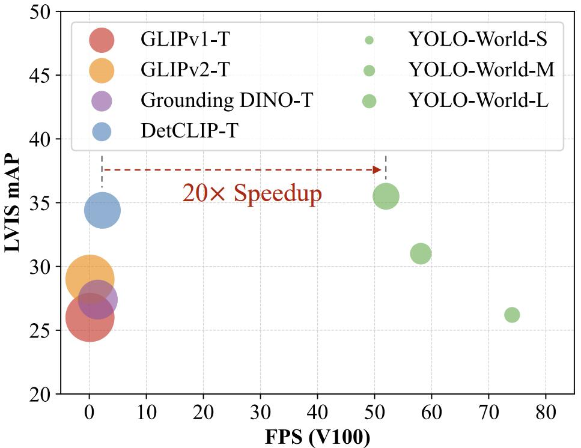
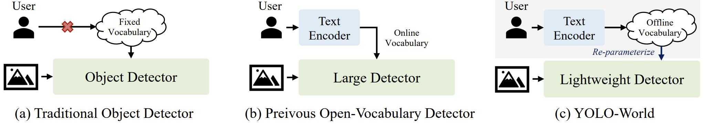
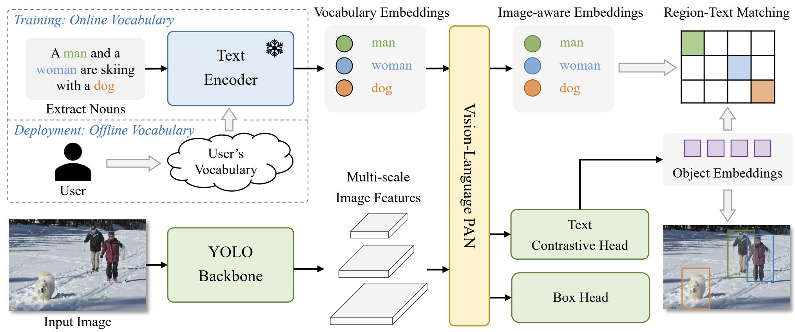
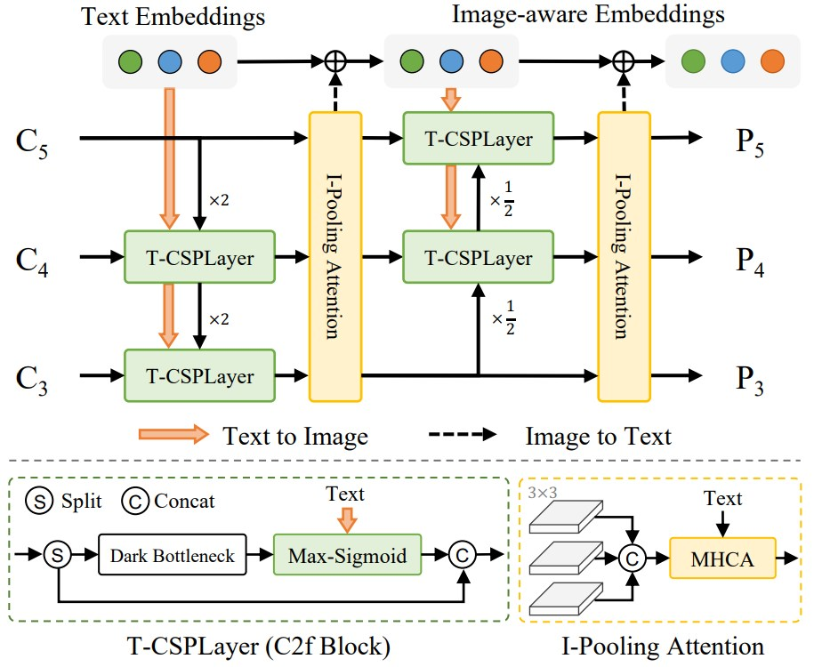

# [YOLO-World: Real-Time Open-Vocabulary Object Detection](https://arxiv.org/abs/2401.17270)

You Only Look Once (YOLO) 系列检测器已经证明了自己是一种高效实用的工具。然而，它们依赖于预定义和训练好的物体类别，限制了它们在开放场景中的适用性。为了解决这一限制，我们引入了一种创新方法 YOLO-World，它通过视觉—语言建模和大规模数据集预训练，赋予 YOLO 开放词汇检测能力。具体来说，我们提出了一种新的可重新参数化 (Re-parameterizable) 视觉语言路径聚合网络 (RepVL-PAN) 和区域—文本对比损失函数，以促进视觉和语言信息之间的交互。我们的方法在零样本场景下高效率检测各种物体表现出色。在具有挑战性的 LVIS 数据集上，YOLO-World 在 V100 上实现了 35.4 AP 和 52.0 FPS 的性能，在精度和速度方面都优于许多最先进的方法。此外，经过微调的 YOLO-World 在一些下游任务（例如目标检测和开放词汇实例分割）上也取得了显著的性能提升。

**图 1：速度—精度曲线**。我们将在速度和精度方面将 YOLO-World 与最近的开放词汇方法进行比较。所有模型均在 LVIS minival 上进行评估，推理速度在一块不带 TensorRT 的 NVIDIA V100 上进行测量。圆圈的大小代表模型的大小。

## 1. Introduction

目标检测一直是计算机视觉领域的一项长期而基础性的挑战，在图像理解、机器人技术和自动驾驶汽车等方面有着广泛的应用。随着深度神经网络的发展，大量研究 [16, 27, 43, 45] 在目标检测领域取得了重大突破。尽管这些方法取得了成功，但它们仍然存在局限性，因为它们只能处理具有固定词汇表的目标检测，例如 COCO 数据集 [26] 中的 80 个类别。一旦对象类别被定义和标记，训练后的检测器只能检测那些特定的类别，从而限制了其在开放场景中的能力和适用性。

最近的研究 [8, 13, 48, 53, 58] 利用流行的视觉—语言模型 [19, 39] 通过从语言编码器（例如 BERT [5]）中蒸馏词汇知识来解决开放词汇检测 [58] 的问题。然而，这些基于知识蒸馏的方法由于训练数据稀缺且词汇多样性有限（例如包含 48 个基础类别的 OV-COCO [58]）而受到很大限制。一些方法 [24, 30, 56, 57, 59] 将目标检测训练重新定义为区域级的视觉语言预训练，并大规模训练开放词汇目标检测器。然而，这些方法在现实场景中的检测仍然面临两个方面的挑战：(1) 繁重的计算负担，(2) 针对边缘设备的部署复杂性。先前的工作 [24, 30, 56, 57, 59] 证明了预训练大型检测器的优越性能，但使用预训练小型检测器赋予它们开放识别能力的方法仍未被探索。

本论文提出 YOLO-World，旨在实现高效的开放词汇目标检测，并探索大规模预训练方案，将传统 YOLO 检测器提升到一个全新的开放词汇领域。与之前的方法相比，所提出的 YOLO-World 效率卓越，推理速度快，易于部署于下游应用。具体来说，YOLO-World 遵循标准的 YOLO 架构 [20]，并利用预训练的 CLIP [39] 文本编码器对输入文本进行编码。我们进一步提出了可重参数化视觉—语言路径聚合网络 (RepVL-PAN) 来连接文本特征和图像特征，以获得更好的视觉语义表示。在推理过程中，可以移除文本编码器，并将文本嵌入重新参数化成 RepVL-PAN 的权重，以实现高效部署。我们进一步研究了 YOLO 检测器的开放词汇预训练方案，该方案通过大规模数据集上的区域-文本对比学习进行，将检测数据、 grounding 数据和图像-文本数据统一成区域-文本对。预训练后的 YOLO-World 拥有丰富的区域-文本对，展示了强大的大词汇检测能力，并且训练更多数据会带来更大的开放词汇能力提升。

此外，我们探索了一种 “prompt-then-detect” 的范式，以进一步提高现实场景中开放词汇目标检测的效率。如图 2 所示，传统的目标检测器 [16, 20, 23, 41–43, 52] 专注于使用预定义和训练过的类别的固定词汇 (闭合集) 检测。先前的一些开放词汇检测器 [24, 30, 56, 59] 则使用文本编码器对用户的提示编码为在线词汇，并检测目标。值得注意的是，这些方法往往采用具有大容量骨干网络的大型检测器（例如 Swin-L [32]）来提高开放词汇容量。相比之下，“prompt-then-detect” 范式 (图 2 (c)) 首先对用户的提示进行编码以构建离线词汇，该词汇会根据不同的需求而变化。然后，高效的检测器可以实时推理离线词汇，而无需重新编码提示。对于实际应用，一旦我们训练好检测器，即 YOLO-World，就可以预先对提示或类别进行编码以构建离线词汇，然后将其无缝集成到检测器中。

我们主要的贡献可以概括为以下三点：

- 我们引入了一种名为 YOLO-World 的前沿开放词汇目标检测器，该检测器针对实际应用具有高效性。
- 我们提出了一种可重参数化视觉语言—路径聚合网络 (RepVL-PAN) 来连接视觉和语言特征，并为 YOLO-World 设计了一个开放词汇区域-文本对比预训练方案。
- 在大规模数据集上预训练的 YOLO-World 展示了强大的零样本性能，在 LVIS 数据集上达到了 35.4 AP 的精度和 52.0 FPS 的速度。预训练后的 YOLO-World 可以轻松适应下游任务，例如开放词汇实例分割和指代目标检测。此外，YOLO-World 的预训练权重和代码将开源，以促进更多实际应用。

**图 2：检测范式的比较**。**(a) 传统目标检测器**：这些目标检测器只能检测训练数据集预定义的固定词汇中的物体，例如 COCO 数据集 [26] 的 80 个类别。固定词汇限制了其在开放场景中的扩展。**(b) 以前的开放词汇检测器**：以前的方法倾向于开发用于开放词汇检测的大且重型检测器，这些检测器直观上具有强大的容量。此外，这些检测器会同时将图像和文本作为输入进行预测，这对于实际应用来说非常耗时。**(c) YOLO-World**：我们展示了轻量级检测器（例如 YOLO 检测器 [20, 42]）的强大的开放词汇性能，这对于实际应用具有重要意义。我们没有使用在线词汇，而是提出了一种用于高效推理的 prompt-then-detect 的范式，用户可以根据需要生成一系列提示，然后将提示编码成离线词汇。然后可以将其重新参数化为模型权重以进行部署和进一步加速。

## 2. Related Works

### 2.1. Traditional Object Detection

流行的目标检测研究集中在固定词汇（闭集）检测上，其中目标检测器在预定义类别的数据集上进行训练，例如 COCO 数据集 [26] 和 Objects365 数据集 [46]，然后检测固定类别集中的对象。在过去的几十年里，**传统目标检测的方法可以简单地分为三大类，即基于区域的方法、基于像素的方法和基于查询的方法**。基于区域的方法 [11, 12, 16, 27, 44]，例如 Faster R-CNN [44]，采用两阶段框架进行候选区域生成 [44] 和感兴趣区域 (RoI) 分类和回归。基于像素的方法 [28, 31, 42, 49, 61] 倾向于单阶段检测器，它们对预定义的锚点或像素进行分类和回归。DETR [1] 是第一个通过 transformer [50] 探索目标检测，并启发了广泛的基于查询的方法 [64]。在推理速度方面，Redmon 等人提出了 YOLO [40-42]，它利用简单的卷积架构进行实时目标检测。一些工作 [10, 23, 33, 52, 55] 为 YOLO 提出了一些架构或设计，包括路径聚合网络 [29]、跨阶段局部网络 [51] 和重新参数化 [6]，进一步提高了速度和精度。与之前的 YOLO 相比，本文的 YOLO-World 旨在通过强大的泛化能力检测超出固定词汇的对象。

### 2.2. Open-Vocabulary Object Detection

开放词汇目标检测 (OVD) [58] 作为一种新兴趋势出现在现代目标检测领域，旨在检测超出预定义类别的对象。早期工作 [13] 遵循标准的 OVD 设置 [58]，通过在基础类别上训练检测器并评估新颖的 (未知) 类别来进行。然而，这种开放词汇设置可以评估检测器检测和识别新颖物体的能力，但由于训练数据集和词汇有限，它仍然局限于开放场景，缺乏对其他领域的泛化能力。受视觉—语言预训练 [19, 39] 的启发，最近的一些工作 [8, 22, 53, 62, 63] 将开放词汇目标检测表述为图像-文本匹配，并利用大规模的图像-文本数据来大规模增加训练词汇。OWLViTs [35, 36] 使用检测和 grounding 数据集微调简单的 vision transformer [7]，并构建具有良好性能的简单开放词汇检测器。GLIP [24] 提出了一种基于 phrase grounding 的开放词汇检测预训练框架，并以零样本学习的设定进行评估。Grounding DINO [30] 将 grounding 预训练 [24] 与具有交叉模态融合的检测 transformer [60] 相结合。一些方法 [25, 56, 57, 59] 通过区域-文本匹配和使用大规模图像-文本对预训练检测器，统一检测数据集和图像-文本数据集，实现了良好的性能和泛化能力。然而，这些方法往往使用诸如 ATSS [61] 或以 Swin-L [32] 为骨干的 DINO [60] 等重量级检测器，这导致高昂的计算需求和部署挑战。相比之下，我们提出了 YOLO-World，旨在实现高效的开放词汇目标检测，具有实时推理能力并简化了下游应用程序的部署。YOLO-World 不同于 ZSD-YOLO [54]，后者也通过语言模型对齐来探索 YOLO 的开放词汇检测 [58]，YOLO-World 引入了一个新颖的 YOLO 框架，结合了有效的预训练策略，从而提高了开放词汇的性能和泛化能力。

## 3. Method

### 3.1. Pre-training Formulation: Region-Text Pairs

传统的目标检测方法，包括 YOLO 系列 [20]，都使用实例标注 $\Omega = \set{B_i , c_i}_{i=1}^{N}$ 进行训练，其中包含边界框 $\set{B_i}$ 和类别标签 $\set{c_i}$ 。在这篇论文中，我们将实例标注重新定义为区域-文本对 $\Omega = \set{B_i , t_i}_{i=1}^{N}$ ，其中 $t_i$ 是区域 $B_i$ 的对应文本。具体来说，文本 $t_i$ 可以是**类别名称、名词短语或对象描述**。此外，YOLO-World 还将图像 $I$ 和文本 $T$ (一组名词) 作为输入，并输出预测的框 $\set{\hat B_k}$ 和相应的对象嵌入 $\set{e_k} (e_k \in \R^D)$ 。

### 3.2. Model Architecture

YOLO-World 的整体架构如图 3 所示，它由一个 YOLO 检测器、一个文本编码器和一个可重新参数化的视觉—语言路径聚合网络 (RepVL-PAN) 组成。给定输入文本，YOLO-World 中的文本编码器将文本编码成文本嵌入。YOLO 检测器中的图像编码器从输入图像中提取多尺度特征。然后，我们利用 RepVL-PAN 通过挖掘图像特征和文本嵌入之间的跨模态融合来增强文本和图像表示。

**图 3：YOLO-World 的整体架构**。与传统的 YOLO 检测器相比，YOLO-World 作为一种开放词汇检测器采用文本作为输入。文本编码器首先对输入文本进行编码，得到文本嵌入。然后，图像编码器将输入图像编码成多尺度的图像特征，所提出的 RepVL-PAN 利用多级跨模态融合来融合图像和文本特征。最后，YOLO-World 预测回归的边界框和对象嵌入，以匹配输入文本中出现的类别或名词。

**YOLO 检测器**：YOLO-World 主要基于 YOLOv8 [20] 开发，它包含一个作为图像编码器的 Darknet 主干网络 [20, 43]、用于多尺度特征金字塔的路径聚合网络 (PAN) 以及用于边界框回归和目标嵌入的头部。

**文本编码器**：给定文本 $T$ ，我们采用 CLIP [39] 预训练的 Transformer 文本编码器来提取对应的文本嵌入 $W = \mathrm{TextEncoder}(T) \in \R^ {C \times D}$ ，其中 $C$ 是名词数量， $D$ 是嵌入的维度。与仅文本的语言编码器 [5] 相比，CLIP 文本编码器在将视觉对象与文本联系起来方面提供更好的视觉语义能力。当输入文本是图像描述或指代表达式时，我们采用简单的 n-gram 算法提取名词短语，然后将它们输入文本编码器。

**文本对比头部**：遵循之前的工作 [20]，我们采用带有两个 $3\times3$ 卷积的解耦头来回归边界框 $\set{b_k}_{k=1}^K $ 和对象嵌入 ${e_k}_{k=1}^K$ ，其中 $K$ 表示对象数量。我们引入了一个文本对比头部通过以下公式获得对象-文本相似度 $s_{k,j}$ ：

$$
\large s_{k,j} = \alpha \cdot \mathrm{L2-Norm}(e_k) \cdot \mathrm{L2-Norm}(w_j )^{\mathsf{T}} + \beta \tag{1}
$$

其中 $\mathrm{L2-Norm}(\cdot)$ 是 L2 归一化， $w_j \in W$ 是第 $j$ 个文本嵌入。此外，我们添加了具有可学习缩放因子 $\alpha$ 和平移因子 $\beta$ 的仿射变换。L2 归一化和仿射变换对于稳定区域—文本训练都非常重要。

**在线词汇训练**：在训练过程中，我们为每个包含 4 张图像的马赛克样本构建一个在线词汇 $T$ 。具体来说，我们采样马赛克图像中涉及的所有正名词，并从相应的数据集随机采样一些负名词。每个马赛克样本的词汇最多包含 $M$ 个名词， $M$ 默认设置为 80。

**离线词汇推理**：在推理阶段，我们提出了一种使用离线词汇的提示然后检测 (prompt-then-detect) 的策略以进一步提高效率。如图 3 所示，用户可以定义一系列自定义提示，这些提示可能包含图像描述或类别。然后我们利用文本编码器对这些提示进行编码并获得离线词汇嵌入。离线词汇可以避免对每个输入进行计算，并提供根据需要调整词汇的灵活性。

### 3.3. Re-parameterizable Vision-Language PAN

**图 4：RepVL-PAN 的示意图**。所提出的 RepVLPAN 采用文本引导的 CSP 层 (T-CSPLayer) 将语言信息注入图像特征，并采用图像池化注意力 (I-Pooling Attention) 增强图像感知文本嵌入。

图 4 展示所提出的 RepVL-PAN 的结构遵循自顶向下和自底向上的路径 [20, 29] 来建立具有多尺度图像特征 $\set{C_3, C_4, C_5}$ 的特征金字塔 $\set{P_3, P_4, P_5}$ 。此外，我们提出了文本引导的 CSP 层 (T-CSPLayer) 和图像池化注意力 (I-Pooling Attention) 以进一步增强图像特征和文本特征之间的交互，从而可以改善开放词汇能力的视觉语义表示。在推理阶段，离线词汇嵌入可以重新参数化成卷积层或线性层的权重以进行部署。

**文本引导的 CSP 层**：如图 4 所示，CSPLayer 在自顶向下或自底向上的融合之后被利用。我们通过将文本指导融入多尺度图像特征来扩展 [20] 的 CSPLayer (也称为 C2f)，从而形成文本引导的 CSPLayer。具体来说，给定文本嵌入 $W$ 和图像特征 $X_l \in \R^{H×W×D} (l \in \set{3, 4, 5})$ ，我们在最后一个 dark bottleneck block 之后采用 max-sigmoid 注意力机制，通过以下公式将文本特征聚合到图像特征中：

$$
\large X_l^{\prime} = X_l \cdot \delta(\max_{j \in \set{1..C}} (X_lW_j^{\mathsf{T}}))^{\mathsf{T}} \tag{2}
$$

其中更新后的 $X_l^{\prime}$ 与跨阶段特征连接作为输出。 $\delta$ 表示 sigmoid 函数。

**图像池化注意力**：为了用图像感知信息增强文本嵌入，我们提出了一种图像池化注意力机制，通过聚合图像特征来更新文本嵌入。我们不是直接对图像特征使用交叉注意力，而是利用多尺度特征的最大池化来获得 $3 \times 3$ 的区域，从而总共得到 27 个 patch tokens $\widetilde X \in \R^{27×D}$ 。然后通过以下公式更新文本嵌入：
$$
\large W^{\prime} = W + \mathrm{MultiHead-Attention}(W, \widetilde X, \widetilde X) \tag{3}
$$

### 3.4. Pre-training Schemes

这一节，我们介绍在大型目标检测、 grounding 和 图像-文本 数据集上预训练 YOLO-World 的训练方案。

**从区域-文本对比损失中学习**。给定马赛克样本 $I$ 和文本 $T$ ，YOLO-World 输出 $K$ 个目标预测 $\set{B_k, s_k}_{k=1}^K$ ，以及标注 $\Omega = \set{B_i , t_i}_{i=1}^{N}$ 。我们遵循 [20] 的方法，并利用任务对齐标签分配 [9] 将预测结果与 groundtruth 标注进行匹配，并将每个正例预测分配一个文本索引作为分类标签。基于此词汇，我们通过对象-文本（区域-文本）相似度和对象-文本分配之间的交叉熵来构建区域-文本对比损失 $\mathcal{L}_{con}$ 。此外，我们还采用 IoU 损失和分布式 focal loss 用于边界框回归，总训练损失定义为： 

$$
\large \mathcal{L}(I) = \mathcal{L}_{con} + \lambda_I \cdot (\mathcal{L}_{iou} + \mathcal{L}_{dfl})
$$

其中 $\lambda_I$ 是一个指示因子，当输入图像 $I$ 来自检测或 grounding 数据时设置为 1，当它来自图像-文本数据时设置为 0。考虑到图像-文本数据集存在干扰框 (noisy boxes)，我们仅计算具有准确边界框的样本的回归损失。

**使用图像-文本数据进行伪标签**。我们提出了一种自动标注方法来生成区域-文本对，而不是直接使用图像-文本对进行预训练。具体来说，该标注方法包含三个步骤：(1) **提取名词短语**：我们首先利用 n-gram 算法从文本中提取名词短语；(2) **伪标签**：我们采用一个预训练的开放词汇检测器（例如 GLIP [24]）为给定的名词短语生成每个图像的伪框，从而提供粗略的区域-文本对。(3) **过滤**：我们使用预训练的 CLIP [39] 来评估图像-文本对和区域-文本对的相关性，并过滤掉相关性低的伪标注和图像。我们进一步通过非极大值抑制 (NMS) 等方法过滤冗余的边界框。建议读者参考附录获取详细方法。使用上述方法，我们从 CC3M [47] 数据集中采样并标注了 24.6 万张图像，获得了 82.1 万个伪标注。

## 4. Experiments

## 5. Conclusion

我们提出 YOLO-World，一种先进的实时开放词汇表检测器，旨在提高实际应用中的效率和开放词汇能力。在本文中，我们将流行的 YOLO 模型重塑为一种用于开放词汇表预训练和检测的视觉语言 YOLO 架构，并提出了 RepVL-PAN，它可以将视觉和语言信息与网络连接起来，并可以重新参数化以实现高效部署。我们进一步提出了结合检测、grounding 和图像-文本数据的有效预训练方案，赋予 YOLO-World 强大的开放词汇检测能力。实验可以证明 YOLO-World 在速度和开放词汇性能方面的优势，并表明视觉语言预训练对小型模型的有效性，这为未来的研究提供了深刻的见解。我们希望 YOLO-World 可以成为解决实际世界开放词汇检测的新基准。

