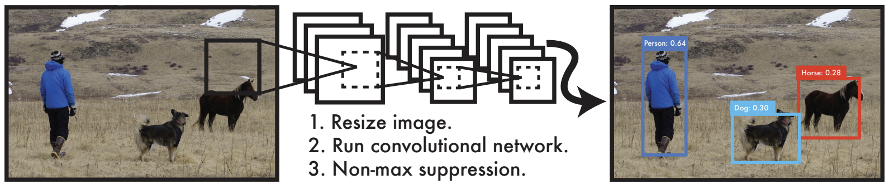
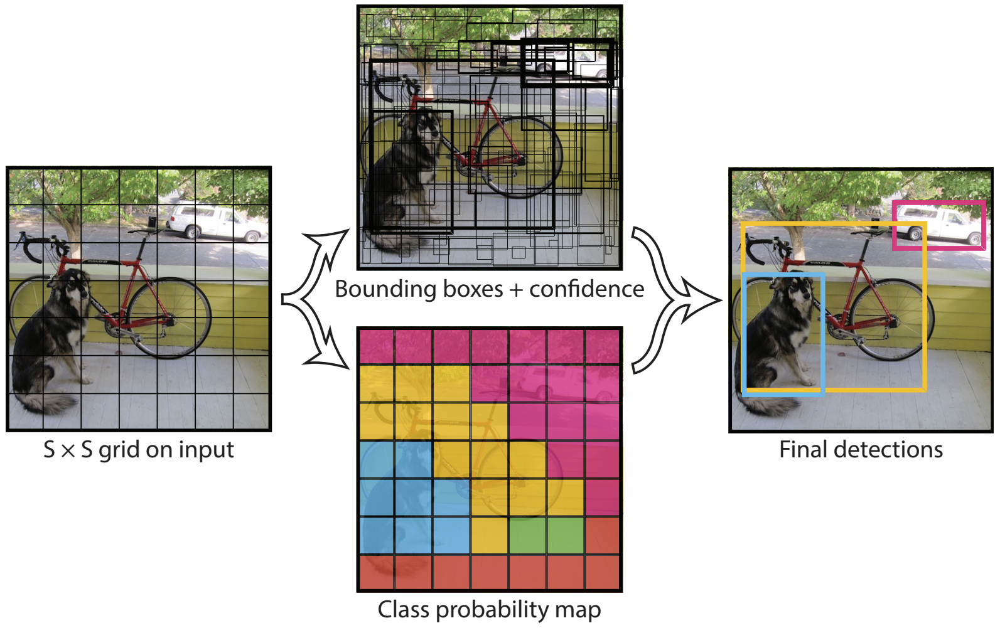
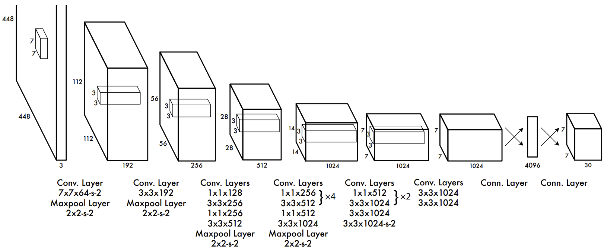

# [You Only Look Once: Unified, Real-Time Object Detection](https://arxiv.org/abs/1506.02640)

## Abstract

我们提出了 YOLO，一种新的目标检测方法。先前的目标检测工作重新应用 (repurposes) 分类器来进行检测。相反，我们将目标检测定义为一个关于空间上分离的边界框和相关类别的概率的回归问题。在一次评估中，单个神经网络直接从完整的图像预测边界框和类别概率。由于整个检测流水线 (pipeline) 是一个单一神经网络，因此可以在检测性能上直接进行端到端优化。

我们的统一架构非常快。我们的基础 YOLO 模型以 45 帧/秒的速度实时处理图像。该网络的一个更小的版本，Fast YOLO，能达到惊人的 155 帧/秒，同时仍然取得了其他实时检测器的两倍的 mAP。与其他最先进的检测系统相比，YOLO 产生更多的定位错误，但更少可能在背景区域上产生误报 (假阳)。最后，YOLO 学习目标的一般表示。当从自然图像推广到其他领域 (如艺术品) 时，它优于其他检测方法，包括 DPM 和 R-CNN。

## 1. Introduction

人们扫一眼图像就能立刻知道图像中有什么物体，它们在哪里，已经它们是如何相互作用的。人类的视觉系统是快速和准确的，使我们能够以很少的有意识的思考执行复杂的任务，如驾驶。快速，准确的目标检测算法可以让计算机在不用任何专用的传感器的情况下驾驶汽车，使辅助设备能够向人类用户传输实时场景信息，并解锁用于通用的、响应式的机器人系统的潜力。

目前的检测系统重新应用分类器来进行检测。为了检测一个目标，这些系统为该目标采用一个分类器，并在测试图像上的不同位置和尺度上使用它。像可变形的组件模型 (DPM) 这样的系统使用滑动窗口的方法，分类器在整个图像上均匀间隔的位置上运行。

最近的方法，如 R-CNN，使用区域候选方法首先在图像中生成潜在的边界框，然后在这些候选框上运行分类器。分类之后，使用后处理来细化边界框，消除重复的检测，并基于场景中的其他物体对边界框重新打分。这些复杂的流水线速度很慢并且难以优化，因为每个独立的组件必须单独训练。

我们将目标检测重新定义为一个单一的回归问题，直接从图像像素到边界框坐标和类别概率。使用我们的系统，你只需要看一次 (YOLO) 图像，就可以有什么物体以及它们在哪里。

YOLO 非常简单：参见图 1。一个卷积网络同时预测多个边界框以及这些边界框的类别概率。YOLO 在完整图像上训练，并直接优化检测性能。与传统目标检测方法相比，这个统一的模型有几个优势。

**图 1：YOLO 检测系统** 。使用 YOLO 处理图像是简单而直接的。我们的系统 (1) 将输入图像 resize 到 $448 \times 448$，(2) 在图像上运行一个单一的卷积网络，(3) 根据模型的置信度对检测结果做阈值处理。

第一，YOLO 的速度非常快。由于我们将检测定义为回归问题，所以我们不需要一个复杂的流水线。我们只需要在测试时在新图像上运行我们的神经网络来预测检测结果。我们的基础网络在 Titan X GPU 上，没有批处理，以 45  帧/秒的速度运行，并且一个更快的版本超过每秒 150 帧。这意味着我们可以以小于 25 ms 的延迟处理流媒体视频。此外，YOLO 的平均精度是其他实时系统的两倍多。一个关于我们的系统在网络摄像头上实时运行的演示请参考我们的项目网页：http://pjreddie.com/yolo/ 。

第二，YOLO 在预测时会对图像进行全局地推理。与滑动窗口和基于区域候选的技术不同，YOLO 在训练和测试期间都是看整个图像的，因此它隐式地编码了关于类别以及它们的出现的上下文信息。Fast R-CNN，一种顶级的检测方法，将图像中背景块 (patches) 误认为目标，因为它无法看到更大的上下文。YOLO 产生的背景错误数量不到 Fast R-CNN 的一半。

第三，YOLO 学习的是物体的通用的表示。当在自然图像上训练并在艺术品上测试时，YOLO 的表现远远超过顶级检测方法，如 DPM 和 R-CNN。因为 YOLO 具有高度的泛化性，所以当它应用于新领域或意外的输入时，它不太可能会发生故障。

YOLO 在准确性方面仍然落后于最先进的检测系统。虽然它可以快速地识别图像中的目标，但它很难精确地定位一些目标，特别是小目标。我们在实验中进一步检验这些权衡。

我们所有的训练和测试代码都是开源的。各种预训练模型也是可以下载的。

## 2. Unified Detection

我们将目标检测的各个组件统一到一个单一的神经网络中。我们的网络使用整个图像的特征来预测每个边界框。它同时预测图像的所有类别的所有边界框。这意味着我们的网络对整个图像和图像中所有的物体进行全局地推理。YOLO 的设计使得端到端训练和实时并同时保持较高的平均精度成为可能。

我们的系统将输入图像划分为一个 $S \times S$ 的网格。如果==一个物体的中心落在一个网格单元内，那么这个网格单元负责检测该物体==。

每个网格单元预测 $B$ 个边界框和这些框的置信度分数。这些置信度分数反映了模型对框内包含一个物体的置信度，以及它认为它预测的框有多准确。我们正式地定义置信度为 $\rm Pr(Object) * IOU_{pred}^{truth}$ 。如果网格单元内不存在目标，置信度分数应该为零。否则，我们希望置信度分数等于预测框与真实框之间的交并比 (IOU)。

每个边界框包含 5 个预测值：$x, y, w, h$ 和 confidence。$(x, y)$ 坐标表示==物体的中心，相对于网格单元边界的==。预测的==宽和高是相对于整个图像的==。最后，置信度表示预测框和真实框之间的 IOU。

**ps:** $(x,y)$ 是相对于网格单元左上角的偏移量，处于 0 到 1之间，高宽相当于图像高宽，也处于 0 到 1之间。

每个网格单元还预测 $C$ 个有条件的类别概率，$\rm Pr(Class_i | Object)$ 。这些概率是在网格单元包含目标的条件下的。不管有多少个框 $B$ ，每个网格仅预测一组类别概率。

在测试时我们将有条件的类别概率与每个独立的框的置信度相乘，

$$
\large \rm Pr(Class_i | Obejct) * Pr(Obejct) * IOU_{pred}^{truth} = Pr(Class_i) * IOU_{pred}^{truth} \tag{1}
$$
它为每个框提供了类别相关的置信度分数。这些分数同时编码了该类别出现在框中的概率和预测的框与目标的匹配程度。

在 $\rm P{\scriptsize ASCAL} \ VOC$ 上评估时，我们使用 $S = 7$，$B = 2$ 。PASCAL VOC 有 20 个类别，所以 $C = 20$ 。我们最后的预测是一个 $7 \times 7 \ times 30$ 的张量。

**图 2：模型** 。我们的系统将检测建模为一个回归问题。它将图像划分为 $S \times S$ 的网格，并且对于每个网格单元预测 $B$ 个边界框、这些框的置信度和 $C$ 个类别概率。这些预测被编码为一个 $S \times S \times (B * 5 + C)$ 的张量。

### 2.1. Network Design

我们将该模型实现为一个卷积神经网络，并在 PASCAL VOC 检测数据集上评估它。网络的前面的卷积层从图像抽取特征，而全连接层预测输出概率和坐标。

我们的网络架构受到图像分类模型 GoogLeNet 的启发。我们的网络有 24 个卷积层，接着 2 个全连接层。与 GoogLeNet 使用 inception 模块不同，我们简单使用 $1 \times 1$ 卷积层 (融合/减少通道) 后接着 $3 \times 3$ 卷积层，类似于 Lin 等人。完整的网络如图 3 所示。

我们还训练了 YOLO 的一个快速的版本，旨在推动快速目标检测的界限。Fast YOLO 使用一个更少卷积层的神经网络 (9 层)，并且这些层的滤波器更少。除了网络的大小，YOLO 和 Fast YOLO 所有的训练和测试参数都是相同的。

网络的最终输出是 $7 \times 7 \times 30$ 的张量。

**图 3：架构 **。我们的检测网络有 24 个卷积层，接着 2 个全连接层。交替的 $1 \times 1$ 的卷积层减少了来自前一层的特征的维度。我们在 ImageNet 分类任务上以一半的分辨率 ($224 \times 224$ 的输入图像)对卷积层进行预训练，然后将分辨率提高一倍进行检测。

### 2.2. Training

我们在 ImageNet 1000 类竞赛数据集上预训练我们的卷积层。对于预训练，我们使用图 3 中前 20 层的卷积层，跟着一个平均汇聚层和一个全连接层。我们对这个网络训练大约一周，并在 ImageNet 2012 验证集上取得了 88% 的 single crop (不在多个裁剪图上区平均) top-5 准确率，与 Caffe 的 Model Zoo 中的 GoogLeNet 相当。

然后我们转换模型来执行检测。Ren 等人的研究 [29] 表明，在预训练网络中添加卷积层和全连接层可以改善性能。在他们的例子基础上，我们添加了 4 个卷积层和 2 个全连接层，随机初始化权重。检测通常需要细粒度的视觉信息，因此我们将网络的输入分辨率从 $224 \times 224$ 提升到 $448 \times 448$ 。

我们最后一层同时预测类别概率和边界框坐标。我们以图像的宽度和高度对边界框的宽度和高度进行归一化，使它们落在 0 到 1之间。我们将边界框的 $x$ 和 $y$ 坐标参数化为特定的网格单元的位置的偏移量，因此它们也在 0 到 1 之间。

我们最后一层使用线性激活函数，其他层都使用以下的渗漏整流线性激活 ( Leaky ReLU)：
$$
\begin{equation}
\phi(x)=\left\{
	\begin{aligned}
	x, & \quad x>0 \\ 
	0.1x, & \quad otherwise
	\end{aligned}
	\right
	.
\end{equation} \tag{2}
$$

我们优化模型输出的误差平方和。我们使用误差平方和，因为它很容易优化，但它并不完全符合我们最大化平均精度的目标。它对定位误差和分类误差的权重是相等的，这可能并不理想。还有，在每张图像中，许多网格单元不包含任何目标。这会使这些单元格的 "confidence" 分数接近于 0，通常会压制 (严重影响) 那些来自包含目标的单元格的梯度。这可能会导致模型不稳定，造成训练早期发散。

为了补救这一点，我们增加了边界框坐标预测的损失，并减少了不包含目标的框的置信度预测的损失。我们使用两个参数 $\lambda_{coord}$ 和 $\lambda_{noojb}$ 来实现这。我们设置 $\lambda_{coord} = 5$ 和 $\lambda_{noojb} = 0.5$ 。

误差平方和对于大框和小框的权重也相等。我们的误差指标应该反映出大框里的小偏差比小框里的小偏差影响更小。为了部分解决这个问题，我们使用边界框的宽度和高度的平方根来代替直接使用宽度和高度。

YOLO 为每个网格单元预测多个边界框。在训练时，我们希望每个目标只有一个边界框预测器对其负责。我们根据哪个预测与真实值具有最高的 IOU 来分配一个预测器负责预测这个目标。这导致边界框预测器专门化。每个预测器都能更好地预测特定的尺寸、长宽比或目标的类别，从而提高整体的召回率。

训练期间，我们优化以下多个部分的损失函数：
$$
\lambda_{coord} \sum_{i = 0}^{S^2} \sum_{j=0}^B \mathbb{1}_{ij}^{obj} \left [ (x_i - \hat{x}_i)^2 + (y_i - \hat{y}_i)^2 \right ]  \\ + \lambda_{coord} \sum_{i = 0}^{S^2} \sum_{j=0}^B \mathbb{1}_{ij}^{obj} \left [ \left(\sqrt{w_i} - \sqrt{\hat{w}_i}\right)^2 + \left(\sqrt{h_i} - \sqrt{\hat{h}_i} \right)^2 \right ] \\ 
+ \sum_{i = 0}^{S^2} \sum_{j=0}^B \mathbb{1}_{ij}^{obj} \left(C_i - \hat{C}_i \right)^2 + \lambda_{noobj} \sum_{i = 0}^{S^2} \sum_{j=0}^B \mathbb{1}_{ij}^{noobj} \left(C_i - \hat{C}_i \right)^2 \\ 
+ \sum_{i = 0}^{S^2} \mathbb{1}_{i}^{obj} \sum_{c \in classes}(p_i(c) - \hat{p}_i(c))^2 \tag{3}
$$

其中 $\mathbb{1}_{i}^{obj}$ 表示目标是否出现在单元格 $i$ 中，$\mathbb{1}_{ij}^{obj}$ 表示第 $i$ 个单元格中的第 $j$ 个边界框预测器 "负责" 该预测。

请注意，只有当网格单元中存在目标时，损失函数才会对分类错误进行惩罚 (所以前面讨论的是有条件的类别概率)。只有当该预测器对某个真实边界框负责时，才会对边界框坐标误差进行惩罚 (即在网格单元中具有最高 IOU 的预测器)。

我们在 PASCAL VOC 2007 和 2012 训练和验证数据集上训练网络 135 个 epochs。当在 2012 上测试时，我们还将 VOC 2007 测试集用于训练。整个训练过程中，我们使用批量大小为 64，动量为 0.9，衰减为 0.0005。

我们的学习率计划如下：对于第 1 个 epoch，我们慢慢地将学习率从 $10^{-3}$ 提升到 $10^{-2}$ 。如果我们以一个高的学习率开始，我们的模型经常会因为不稳定的梯度而发散。我们以 $10^{-2}$  训练 75 个 epochs，然后以 $10^{-3}$ 训练 30 个 epochs，最后以 $10^{-4}$ 训练 30 个epochs。

为了避免过拟合，我们使用 dropout 和广泛的数据增强。第一个全连接层之后的 $rate = 0.5$ 的 dropout 层阻止了层 [18] 之间的协同适应。对于数据增强，我们引入了高达 20% 图像大小的随机缩放和平移。我们还在 HSV 颜色空间中随机调整图像的曝光和饱和度，最多调整 1.5 倍。

### 2.3. Inference

和训练一样，预测测试图像的检测结果只需要一个网络评估。在 PASCAL VOC 上，网络为每张图像预测 98 个边界框和每个框的类别概率。YOLO 在测试时非常快，因为只需要单个的网络评估，不像基于分类器的方法。

网格设计加强了边界框预测中的空间多样性。通常目标落在哪个网格单元是很清楚的，并且网络只为每个目标预测一个框。但是，一些较大的目标或靠近多个单元格边界的目标可以被多个单元格很好地定位。非极大值抑制可以被用来修复这些重复的检测。虽然不像它对于 R-CNN 或 DPM 那样至关重要，但是非极大值抑制在 mAP 提升了 2 - 3%。

### 2.4. Limitations of YOLO

YOLO 对边界框施加了很强的空间约束，因为每个网格单元只能预测两个框，并且只能有一个类。这种空间约束限制了模型可以预测的邻近目标的数量。我们的模型对于成群出现的小目标有困难，比如鸟群。

由于我们的模型从数据中学习预测边界框，因此它很难泛化到新的或者不常见的纵横比或配置的目标。我们的模型预测使用的特征也相对粗糙，因为我们的架构有多个下采样层。

最后，虽然我们在近似检测性能的损失函数上训练，但我们的损失函数对待小的边界框和大的边界框的误差是一样的。一个大框里的小偏差通常是无关紧要的，但一个小框里的小偏差对 IOU 的影响要大得多。我们的主要错误来源是不精确的定位。

## 3. Comparison to Other Detection Systems

目标检测是计算机视觉中的一个核心问题。检测流水线通常首先从图像中提取一组鲁棒的特征 (Haar [25]，SIFT [23]，HOG [4]，卷积的特征)。然后，使用分类器或者定位器在特征空间中识别目标。这些分类器或者定位器以滑动窗口的方式在整个图像或图像中某些区域的子集上运行。我们将 YOLO 检测系统与一些顶级检测框架进行比较，高亮了关键的相似与差异。

**Deformable parts models** 。可变形组件模型 (DPM) 使用滑动窗口方法来进行目标检测。DPM 使用一个不连续的流水线，提取静态特征，分类区域，为高分区域预测边界框，等等。我们的系统使用单个卷积神经网络替换掉所有这些不同的组件。网络同时执行特征提取，边界框预测，非极大值抑制和上下文推理。使用的也不是静态特征，网络在线训练特征，并优化它们以满足检测任务。我们的统一架构带来一个比 DPM 更快、更准确的模型。

**R-CNN** 。R-CNN 和它的变种使用区域候选而不是滑动窗口来寻找图像中的目标。选择性搜索 [35] 生成潜在的边界框，一个卷积网络提取特征，一个 SVM 对这些框打分，一个线性模型调整这些边界框，和非极大值抑制消除重复的检测。这个复杂流水线的每个阶段都必须精确地独立地调优，导致系统很慢，在测试时每张图像需要超过 40 秒。

YOLO 与 R-CNN 有一些相似之处。每个网格单元都提出潜在的边界框，并使用卷积的特征对这些框进行评分。然而，我们的系统在网格单元候选上设置了空间约束，这有助于减缓对同一目标的多次检测。我们的系统候选的边界框更少，每张图像只有 98 个，而选择性搜索大约 2000 个。最后，我们的系统将这些独立的组件组合进一个单一的、联合优化的模型。

**Other Fast Detectors** Fast 和 Faster R-CNN 聚焦于通过共享计算和使用神经网络代替选择性搜索候选区域来加速 R-CNN 框架。虽然它们的速度和准确性都比 R-CNN 有所提升，但是它们的实时性仍然不足。

许多研究致力于加速 DPM 流水线。它们加速了 HOG 的计算，使用级联，和将计算放到 GPU 上。然而，只有 30 Hz 的 DPM 实际上是实时运行的。

YOLO 不是试图优化一个大型流水线的独立组件，而是完全扔掉流水线，并且设计地很快。

对于单个类别 (如人脸或人)的检测器可以被高度地优化，因为它们处理更少的变换。YOLO 是一个通用目的的检测器，它学会同时检测各种目标。

**Deep MultiBox**。不像 R-CNN，Szegedy 等人训练一个卷积神经网络来预测感兴趣区域，而不是使用选择性搜索。MultiBox 还可以通过将置信度预测替换为一个单类别的预测来实现单目标检测。然而，MultiBox 不能执行通用目标检测，并且只是一个更大的检测流水线中的一小部分，需要进一步的图像块的分类。YOLO 和 MultiBOX 都用一个卷积网络来预测图像中的边界框，但 YOLO 是一个完整的检测系统。

**OverFeat**。 Sermanet 等人训练一个 卷积神经网络进行定位，并使用一个定位器进行检测。OverFeat 高效地执行滑动窗口检测，但它仍然是一个不连续的系统。OverFeat 为定位而优化，而不是检测性能。像 DPM，定位器在进行预测时只能看技局部的信息。OverFeat 不能推理全局上下文，因此需要大量的后处理来产生一致的检测。

**MultiGrasp**。我们的工作在设计上类似于 Redmon 等人的抓握检测工作。我们的用于边界框预测的网格方法是基于用于抓握回顾的 MultiGrasp 系统。然而，抓握检测比目标检测简单得多。MultiGrasp 只需要对包含一个目标的图像预测一个可抓取区域。它不需要估计目标的大小、位置或边界，也不需要预测它的类别，只需要找到适合抓取的区域。YOLO 预测图像中多个类别的多个目标的边界框和类别概率。

## 4. Experiments

## 5. Real-Time Detection In The Wild

YOLO 是一种快速、准确的目标检测器，使其成为计算机视觉应用的理想选择。我们将 YOLO 连接到网络摄像头，并验证它保持实时性能，包括从摄像头获取图像和显示检测结果的时间。

由此产生的系统是交互的和有吸引力的。虽然 YOLO 单独处理图像，但当连接到网络摄像头时，它的功能就像一个跟踪系统，可以检测目标的移动和外观变化。系统的演示和源码可以在我们的项目网站上找到：http://pjreddie.com/yolo/ 。

## 6. Conclusion

我们介绍了 YOLO， 一种统一的目标检测模型。我们的模型容易构建，并且能直接完整的图像上训练。于基于分类器的方法不同，YOLO 是在一个直接对应检测性能的损失函数上训练的，并且整个模型是联合训练的。

Fast YOLO 是文献中最快的通用的目标检测器，YOLO 在实时检测方面推动了最先进的技术水平。YOLO 还可以很好地推广到新的领域，使其成为那些依赖快速的、健壮的目标检测的应用的理想选择。