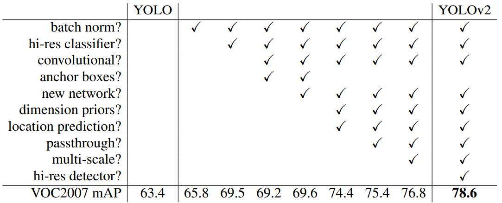
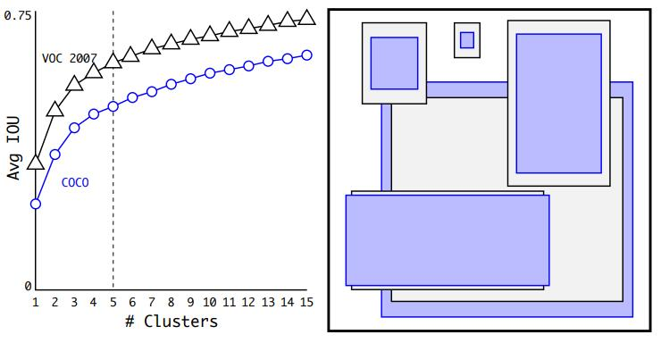
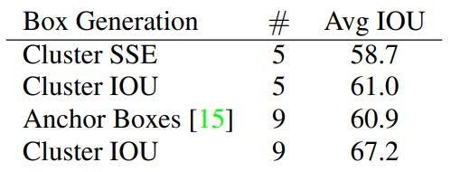
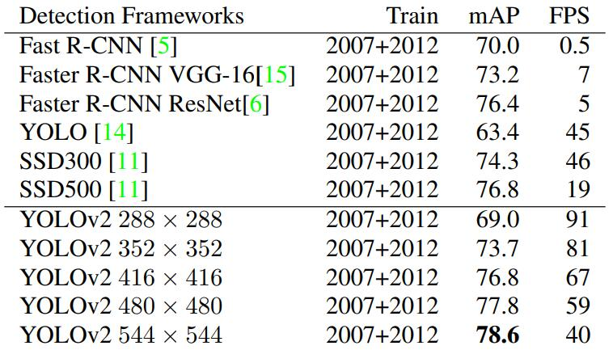
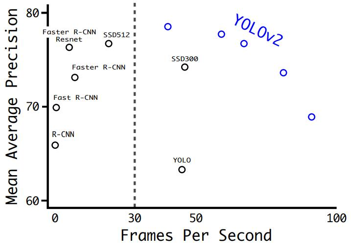

# [YOLO9000: Better, Faster, Stronger](https://arxiv.org/abs/1612.08242)

## Abstract

我们引入 YOLO9000，一个最先进的实时目标检测系统，可以检测超过 9000 个物体类别。首先，我们提出了各种改进 YOLO 检测方法的方法，既有新颖的，也有借鉴先前工作的。改进后的模型 YOLOv2 在标准检测任务（例如 PASCAL VOC 和 COCO）上达到了最先进的水平。使用一种新颖的多尺度训练方法，同一个 YOLOv2 模型可以在不同大小下运行，在速度和精度之间提供轻松的权衡。在 67 FPS 下，YOLOv2 在 VOC 2007 上达到 76.8 mAP 的性能。在 40 FPS 下，YOLOv2 达到 78.6 mAP 的性能，优于 Faster R-CNN (使用 ResNet) 和 SSD 等先进方法，同时运行速度也显著更快。最后，我们提出了一种联合训练目标检测和分类的方法。使用这种方法，我们同时在 COCO 检测数据集和 ImageNet 分类数据集上训练 YOLO9000。我们这种联合训练方法使 YOLO9000 能够预测没有标注检测数据的物体类别的检测结果。我们在 ImageNet 检测任务上验证了我们的方法。尽管只有 200 个类别中 44 个具有检测数据，YOLO9000 在 ImageNet 检测验证集上仍取得了 19.7 mAP 的成绩。在不包含在 COCO 数据集中的 156 个类别上，YOLO9000 达到 16.0 mAP 的成绩。YOLO 不仅可以检测 200 多个类别，还可以预测超过 9000 个不同的物体类别。而且它仍然可以实时运行。

## 1. Introduction

通用目标检测应该既快速又准确，并且能够识别各种各样的物体。自从神经网络问世以来，检测框架变得越来越快、越来越准确。然而，大多数检测方法仍然局限于少数物体类别。

与图像分类和标记等其他任务相比，当前的目标检测数据集非常有限。最常见的检测数据集包含数千到数十万张图像，以及几十到数百个标签 [3] [10] [2]。分类数据集包含数百万张图像，涵盖成千上万个类别 [20] [2]。

我们希望检测能够扩展到与对象分类相同的水平。然而，为检测标注图像的成本远高于为分类或标记标注图像 (标记通常由用户免费提供)。因此，在不久的将来，我们不太可能看到与分类数据集规模相同的检测数据集。

我们提出了一种利用我们已经拥有的大量分类数据并将其用于扩展当前检测系统范围的新方法。我们的方法利用对象分类的层次结构视图，可以将不同的数据集组合在一起。

我们还提出了一种联合训练算法，允许我们在检测和分类数据上同时训练目标检测器。我们的方法利用标记的检测图像来学习精确定位物体，同时利用分类图像来增加其词汇量和鲁棒性。

使用这种方法，我们训练了 YOLO9000，这是一个可以检测 9000 多个不同物体类别的实时目标检测器。首先，我们改进了基本的 YOLO 检测系统，创建了最先进的实时检测器 YOLOv2。然后，我们使用我们自己的数据集组合方法和联合训练算法，使用来自 ImageNet 的 9000 多个类别以及来自 COCO 的检测数据来训练模型。我们所有的代码和预训练模型都可以在线获得 http://pjreddie.com/yolo9000/。

**图 1：YOLO9000** 。YOLO9000 可以实时检测多种目标类别。

## 2. Better

YOLO 在与最先进的检测系统相比时存在一些缺点。YOLO 与 Fast R-CNN 的误差分析比较表明，YOLO 会产生大量定位错误。此外，与基于区域候选的方法相比，YOLO 的召回率也相对较低。因此，我们主要关注在保持分类准确性的同时提高召回率和定位能力。

计算机视觉领域通常倾向于使用更大、更深的网络 [6] [18] [17]。更好的性能通常依赖于训练更大的网络或将多个模型结合在一起。然而，对于 YOLOv2，我们希望得到一个更准确但仍然快速的检测器。我们没有扩大网络规模，而是简化了网络，然后使表示更容易学习。我们结合了过去工作中的各种想法和我们自己新颖的概念来改进 YOLO 的性能。结果总结见表 2。

**表2：从 YOLO 到 YOLOv2 的路径**。列出的大多数设计决策都显著提高了 mAP。两个例外是切换到具有锚框的完全卷积网络和使用新网络。切换到锚框样式方法增加了召回率，而不改变 mAP，而使用新网络则将计算量减少了 33%。

**批量归一化**。批量归一化可以显著改善收敛速度，同时消除对其他形式正则化的需求 [7]。通过在 YOLO 的所有卷积层上添加批量归一化，我们可以使 mAP 提高 2% 以上。批量归一化还有助于正则化模型。使用批量归一化，我们可以从模型中删除 dropout 层而不会发生过拟合。

**高分辨率分类器**。所有最先进的检测方法都使用预训练于 ImageNet 的分类器 [16]。大多数分类器从 AlexNet 开始，处理小于 $256 \times 256$ 的输入图像 [8]。原始的 YOLO 以 $224 \times 224$ 的分辨率训练分类器网络，然后将分辨率提高到 448 进行检测。这意味着网络必须同时学习目标检测并适应新的输入分辨率。

对于 YOLOv2，我们首先在 ImageNet 上以完整的 $448 \times 448$ 分辨率微调分类网络 10 个 epochs。这给了网络时间调整其滤波器以更好地处理更高分辨率的输入。然后我们对检测任务进行微调。这个高分辨率分类器使我们的 mAP 提高了近 4%。

**使用锚框进行卷积预测**。YOLO 在卷积特征提取器之上使用全连接层直接预测边界框的坐标。Faster R-CNN 则不是直接预测坐标，而是使用手动选择的先验框来预测边界框。Faster R-CNN 中的区域候选网络 (RPN) 仅使用卷积层来预测锚框的偏移量和置信度。由于预测层是卷积层，因此 RPN 可以预测特征图中每个位置的这些偏移量。相对于直接预测坐标，预测偏移简化了问题，使网络更容易学习。

我们从 YOLO 中移除全连接层，并使用锚框来预测边界框。首先，我们移除一层池化层以提高网络卷积层的输出分辨率。我们还将网络缩小到处理 $416 \times 416$ 的输入图像，而不是 $448 \times 448$ 的图像。我们这样做是因为我们希望特征图中的位置数量为奇数，从而存在单个中心单元。物体，尤其是大型物体，往往占据图像的中心，因此在中心位置预测这些物体比预测附近四个位置更好。YOLO 的卷积层将图像缩小 32 倍，因此使用 416 的输入图像，我们可以得到一个 $13 \times 13$ 的输出特征图。

当我们转向锚框时，我们还将类别预测机制与空间位置解耦，为每个锚框预测类别和物体性 (objectness)。与 YOLO 一样，物体性预测仍然预测真实框和建议框的 IOU，类别预测预测给定存在物体的条件下该类别的条件概率。

使用锚框会使精度略有下降。YOLO 每张图像只预测 98 个框，但使用锚框后我们的模型可以预测一千多个框。如果不使用锚框，我们的中间模型的 mAP 为 69.5，召回率为 81%。使用锚框后，我们模型的 mAP 为 69.2，召回率为 88%。尽管 mAP 下降了，但召回率的提高意味着我们的模型还有更大的改进空间。

**尺寸聚类**。在将锚框与 YOLO 一起使用时，我们遇到两个问题。第一个问题是框的尺寸是手工挑选的。网络可以学习适当调整框，但是如果我们从一开始就为网络挑选更好的先验框，我们可以使网络更容易学习预测良好的检测结果。

我们没有手工选择先验框，而是对训练集的边界框运行 k-means 聚类来自动找到好的先验框。如果我们使用标准的 k-means 和欧式距离，较大的框会比较小的框产生更多的误差。然而，我们真正想要的是导致良好 IOU 分数的先验框，这与框的大小无关。因此，对于距离度量，我们使用：

$$
\large d\mathrm{(box, cetroid)} = 1 - \mathrm{IOU(box, centroid)}
$$

我们对不同 k 值运行了 k-means，并绘制了与最近质心的平均 IOU 的图表，见图 2。我们选择 $k = 5$ 作为模型复杂性和高召回率之间的良好权衡。聚类质心与手动选择的锚框明显不同。短而宽的框较少，而高而瘦的框较多。

**图2：在 VOC 和 COCO 上对边界框尺寸进行聚类。**我们对边界框的尺寸运行了 k-means 聚类，为我们模型获取良好的先验。左侧图像显示了我们在不同 k 值选择下获得的平均 IOU。我们发现 k = 5 在召回率与模型复杂性之间取得了良好的权衡。右侧图像显示了 VOC 和 COCO 的相对质心。这两组先验都偏向于更瘦、更高的框，而 COCO 的尺寸变化比 VOC 更大。

我们将平均 IOU 与我们聚类策略中最近的先验框和手动选择的锚框进行了比较，结果见表 1。仅使用 5 个先验时，质心的表现与 9 个锚框相似，平均 IOU 为61.0，而锚框为 60.9。如果使用 9 个质心，平均 IOU 会更高。这表明使用 k-means 生成边界框可以使模型具有更好的表示，并使任务更容易学习。

**表 1：VOC 2007 上每个框到最近先验框的平均 IOU**。使用不同的生成方法，VOC 2007上的对象与其最近的未修改先验之间的平均 IOU。聚类比使用手动选择的先验效果要好得多。

**直接预测位置**。在将锚框与 YOLO 一起使用时，我们遇到了第二个问题：模型不稳定，尤其是在早期迭代过程中。大部分的不稳定性来自于预测框的 $(x, y)$ 位置。在区域候选网络中，网络预测值 $t_x$ 和 $t_y$ ， $(x, y)$ 中心坐标的计算公式为：
$$
\large x = (t_x * w_a) - x_a \\ \large y = (t_y * h_a) - y_a
$$

例如，预测 $t_x = 1$ 会将框向右移动锚框的宽度，预测 $t_x = -1$ 会将其向左移动相同的量。

这种形式是没有约束的，因此任何锚框最终都可能出现在图像中的任何位置，而不管哪个位置预测了该框。使用随机初始化，模型需要花费很长时间才能稳定地预测合理偏移量。

为了避免预测偏移量，我们遵循 YOLO 的方法，预测相对于网格单元位置的定位坐标。这将真实值限制在 0 和 1 之间。我们使用逻辑激活函数来限制网络的预测值落在该范围内。

网络在输出特征图的每个单元格预测 5 个边界框。网络为每个边界框预测 5 个坐标，分别为 $t_x, t_y, t_w, t_h, t_o$ 。如果单元格相对于图像左上角的偏移量为 $(c_x, c_y)$ ，并且边界框先验具有宽度和高度 $p_w, p_h$ ，那么预测值对应于：

$$
\large b_x = \sigma(t_x) + c_x \\
\large b_y = \sigma(t_y) + c_y \\
\large b_w = p_w e^{t_w} \\
\large b_h = p_w e^{t_h} \\
\large Pr(\mathrm{object}) * IOU(b, \mathrm{object}) = \sigma(t_o)
$$

由于位置预测受到约束，参数化更容易学习，使网络更加稳定。与使用锚框的版本相比，利用尺寸聚类以及直接预测边界框中心位置的方式将 YOLO 的性能提升了近 5%。

**细粒度特征**。这个改进后的 YOLO 在一个 $13 \times 13$ 的特征图上预测检测结果。虽然这对于大的物体来说已经足够，但是对于定位较小的物体，可能需要更细粒的特征。Faster R-CNN 和 SSD 都在其网络中的不同特征图上运行区域候选网络，以获得一系列分辨率。我们采用了一种不同的方法，简单地添加了一个直通层，该层引入来自一个 $26 \times 26$ 分辨率的较早层的特征。

直通层通过将相邻特征堆叠到不同的通道而不是空间位置（类似于 ResNet 中的恒等映射）的方式，将较高分辨率的特征与较低分辨率的特征进行连接。这将 $26 \times 26 \times 512$ 的特征图转换为 $13 \times 13 \times 2048$ 的特征图，然后可以与原始特征进行连接。我们的检测器运行在这个扩展的特征图之上，以便能够访问细粒度特征。这带来了 1% 性能提升。

**多尺度训练**。原始的 YOLO 使用 $448 \times 448$ 的输入分辨率。随着加入锚框，我们将分辨率改为 $416 \times 416$ 。然而，由于我们的模型只使用卷积层和池化层，因此它可以动态地调整大小。我们希望 YOLOv2 能够鲁棒地运行在不同大小的图像上，因此我们将这一点训练到模型中。

我们没有固定输入图像大小，而是每隔几轮迭代就改变网络。每 10 批次，我们的网络随机选择一个新的图像尺寸大小。由于我们的模型会进行 32 倍的下采样，因此我们从以下 32 的倍数中选择： $\set{320, 352, \dots, 608}$ 。因此最小的选项是 $320 \times 320$ ，最大的选项是 $608 \times 608$ 。我们将网络调整到该尺寸并继续训练。

这种训练方式迫使网络学习跨越各种输入尺寸进行良好预测。这意味着同一个网络可以在不同的分辨率下预测检测结果。在较小的尺寸下，网络运行得更快，因此 YOLOv2 可以轻松地在速度和精度之间进行权衡。

在较低的分辨率下，YOLOv2 可以作为一个廉价、相当准确的检测器运行。在 $288 \times 288$ 的分辨率下，它的运行速度超过 90 FPS，并且 mAP 值几乎与 Fast R-CNN 一样好。这使其非常适合小型 GPU，高帧率视频或多个视频流的场景。

在高分辨率下，YOLOv2 仍然可以实时运行，并且在 VOC 2007 数据集上达到了 78.6 mAP 的先进水平。有关 YOLOv2 与其他框架 (图 4) 在 VOC 2007 上的对比，请参见表格 3。

**表3：PASCAL VOC 2007上的检测框架**。YOLOv2 比先前的检测方法更快、更准确。它还可以在不同的分辨率下运行，以便在速度和准确性之间进行简单的权衡。每个 YOLOv2 结果实际上都是相同的训练模型，具有相同的权重，只是在不同的大小下进行评估。所有的计时信息都是基于 Geforce GTX Titan X（原始型号，而不是 Pascal 型号）。

**图 4**：在 VOC 2007 上的准确率和速度。

**进一步的实验**。我们训练了 YOLOv2 用于 VOC 2012 数据集上的检测任务。表格 4 显示了 YOLOv2 与其他先进检测系统相比的性能对比。YOLOv2 的运行速度远高于竞争对手，同时达到了 73.4 的 mAP 值。我们还训练了 YOLOv2 用于 COCO 数据集，并在表格 5 中将其与其他方法进行比较。在 VOC 评估标准 (IOU = 0.5) 下，YOLOv2 的 mAP 值为 44.0，与 SSD 和 Faster R-CNN 相当。

## 3. Faster

## 4. Stronger

## 5. Conclusion

我们介绍了 YOLOv2 和 YOLO9000，这两种都是实时的检测系统。YOLOv2 在各种检测数据集上都达到了最先进的水平，并且比其他检测系统更快。此外，它可以在各种图像大小下运行，在速度和精度之间提供良好的平衡。

YOLO9000 是一个可以实时检测超过 9000 个物体类别的框架，它通过联合优化检测和分类来实现。我们使用 WordTree 将来自不同来源的数据进行组合，并使用联合优化技术同时在 ImageNet 和 COCO 数据集上进行训练。YOLO9000 是朝着缩小检测和分类之间数据集规模差距的重要一步。

我们使用的许多技术都具有广泛的适用性，并不局限于目标检测领域。我们基于 WordTree 的 ImageNet 表示为图像分类提供了一种更丰富、更详细的输出空间。使用层次分类进行数据集组合在分类和分割领域也将非常有用。多尺度训练等训练技术可以应用于各种视觉任务。

作为未来的研究方向，我们希望使用类似的技术来进行弱监督图像分割。我们还计划通过改进在训练过程中为分类数据分配弱标签的匹配策略来提高我们的检测结果。计算机视觉拥有大量标记数据，这为该领域的发展提供了便利。我们将继续寻找方法将不同来源和结构的数据结合起来，以构建更强大的视觉世界模型。