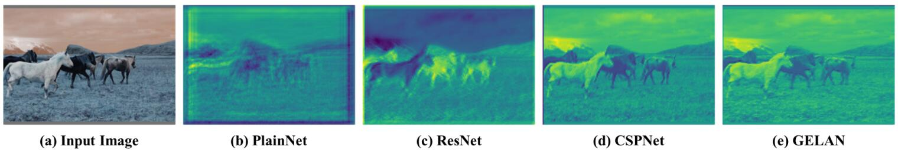
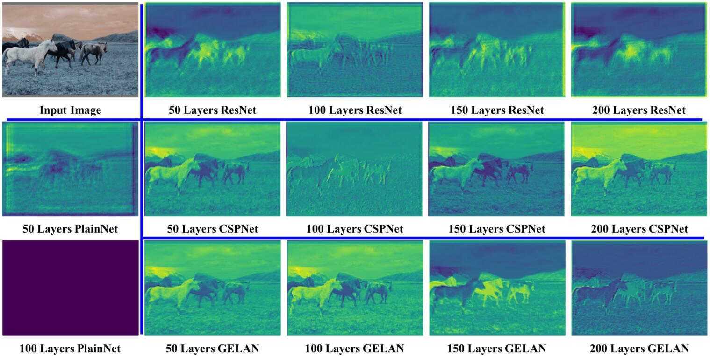

# [YOLOv9: Learning What You Want to Learn Using Programmable Gradient Information](https://arxiv.org/abs/2402.13616)

## Abstract

当今的深度学习方法主要关注如何设计最合适的目标函数，使模型的预测结果尽可能接近真实值。同时，还需要设计一种合适的架构来促进获取足够的预测信息。现有方法忽略了一个事实，即当输入数据经过逐层特征提取和空间变换后，会丢失大量信息。本文将深入探讨数据通过深度网络传递时的数据丢失问题，即信息瓶颈和可逆函数。我们提出了**可编程梯度信息 (PGI)** 的概念，以应对深度网络为实现多重目标所需的各种变化。PGI 可以为目标任务提供完整的输入信息来计算目标函数，从而获得可靠的梯度信息来更新网络权重。此外，我们还设计了一种新的轻量级网络架构 — **基于梯度路径规划的通用高效层聚合网络 (GELAN)**。GELAN 的架构证实了 PGI 在轻量级模型上取得了优异的结果。我们使用基于 MS COCO 数据集的目标检测任务验证了所提出的 GELAN 和 PGI。结果表明，GELAN 只使用常规卷积算子，就能比基于深度可分离卷积的最先进方法实现更好的参数利用率。PGI 可用于各种轻量级到大型模型。它可以用于获取完整的信息，从而使从头开始训练的模型能够取得比使用大型数据集预训练的最先进的模型更好的效果，对比结果如图 1 所示。源代码地址：https://github.com/philipperemy/yolo-9000

**图 1**：MS COCO 数据集上的实时目标检测器比较。基于 GELAN 和 PGI 的目标检测方法在目标检测性能方面超越了所有先前从头开始训练的方法。在准确性方面，新方法优于在大型数据集上预训练的 RT DETR [43]，并且在参数利用率方面也优于基于深度卷积的 YOLO MS [7]。

## 1. Introduction

基于深度学习的模型在计算机视觉、语言处理、语音识别等领域展现出比过去人工智能系统更出色的性能。近年来，深度学习研究人员主要集中在如何开发更强大的系统架构和学习方法上，例如卷积神经网络 (CNN) [21-23, 42, 55, 71, 72]、Transformer [8, 9, 40, 41, 60, 69, 70]、Perceiver [26, 26, 32, 52, 56, 81, 81] 和 Mamba [17, 38, 80]。此外，一些研究人员还尝试开发更通用的目标函数，例如损失函数 [5, 45, 46, 50, 77, 78]、标签分配 [10, 12, 33, 67, 79] 和辅助监督 [18, 20, 24, 28, 29, 51, 54, 68, 76]。上述研究都试图精确地找到输入和目标任务之间的映射关系。然而，过去的大多数方法忽略了输入数据在向前馈过程中可能会损失大量的信息。这种信息损失可能导致用于更新模型的梯度流产生偏差。上述问题可能导致深度网络在目标和输入之间建立错误的关联，从而使训练后的模型产生错误的预测。

在深度网络中，输入数据在前馈过程中丢失信息的现象通常被称为**信息瓶颈** [59]，如图 2 所示。目前，缓解这种现象的主要方法如下：(1) 使用可逆架构[3,16,19]： 此方法主要利用重复的输入数据，并以显式的方式保留输入数据的信息；(2) 使用掩码建模 [1,6,9,27,71,73]：它主要使用重建损失，并采用隐式的方式最大化提取的特征并保留输入信息；(3) 引入深度监督概念 [28,51,54,68]：它使用尚未丢失太多重要信息的浅层特征，预先建立特征到目标的映射，以确保重要信息可以传递到更深层。然而，上述方法在训练过程和推理过程中都存在不同的缺点。例如，可逆架构需要额外的层来组合重复馈送的输入数据，这将大大增加推理成本。此外，由于输入数据层到输出层不能有太深的路径，这种限制会使得在训练过程中难以对高阶语义信息进行建模。对于掩码建模，其重建损失有时会与目标损失冲突。此外，大多数掩码机制也会与数据产生错误关联。对于深度监督机制，它会产生误差累积，并且如果浅层监督在训练过程中丢失信息，后续层将无法检索所需的信息。上述现象在困难任务和小模型上将更加明显。

为了解决上述问题，我们提出了一个新的概念——可编程梯度信息 (PGI)。该概念旨在通过辅助的可逆分支生成可靠的梯度，使深度特征仍能保持执行目标任务的关键特征。辅助的可逆分支的设计可以避免传统深度监督过程（该过程集成多路径特征）可能导致的语义损失。换句话说，我们正在对不同语义级别的梯度信息传播进行编程，从而实现最佳的训练效果。PGI 的可逆架构建立在辅助分支上，因此没有额外的开销。由于 PGI 可以自由选择适合目标任务的损失函数，因此它也克服了掩码建模遇到的问题。所提出的 PGI 机制可以应用于各种大小的深度神经网络，并且比仅适用于非常深的神经网络的深度监督机制更通用。

在本文中，我们还基于 ELAN [65] 设计了通用的 ELAN (GELAN)，GELAN 的设计同时考虑了参数数量、计算复杂度、精度和推理速度。该设计允许用户根据不同的推理设备任意选择合适的计算块。我们将提出的 PGI 和 GELAN 进行结合，然后设计了新一代的 YOLO 系列目标检测系统，我们将其命名为 YOLOv9。我们使用 MS COCO 数据集进行实验，实验结果验证了我们提出的 YOLOv9 在所有对比中都取得了顶级性能。

总结本文的主要贡献如下：

1. 我们从可逆函数的角度对现有的深度神经网络架构进行了理论分析，通过这一过程成功解释了过去许多难以解释的现象。基于此分析，我们设计了 PGI 和辅助可逆分支，并取得了优异的成果。
2. 我们设计的 PGI 解决了深度监督仅适用于超深度神经网络架构的难题，从而使新型轻量级架构能够真正应用于日常生活中。
3. 我们设计的 GELAN 仅使用常规卷积算子，即可实现比基于最新深度可分离卷积设计的更高参数利用率，同时在轻量、快速和准确方面表现出巨大优势。
4. 将所提出的 PGI 和 GELAN 相结合，YOLOv9 在 MS COCO 数据集上的对象检测性能在各个方面均大大超越了现有的实时目标检测器。

**图 2**：不同网络架构的随机初始权重输出特征图的可视化结果：(a) 输入图像，(b) PlainNet，(c) ResNet，(d) CSPNet，(e) 提出的 GELAN。从图中我们可以看到，在不同的架构中，提供给目标函数计算损失的信息在不同程度上丢失，我们的架构可以保留最完整的信息，并为计算目标函数提供最可靠的梯度信息。

## 2. Related work

### 2.1. Real-time Object Detectors

目前主流的实时目标检测器是 YOLO 系列 [2, 7, 13-15, 25, 30, 31, 47-49, 61-63, 74, 75]，其中大多数模型都使用 CSPNet [64] 或 ELAN [65] 及其变种作为主要的计算单元。在特征融合方面，改进版的 PAN [37] 或 FPN [35] 通常被用作工具，然后使用改进版的 YOLOv3 头 [49] 或 FCOS 头 [57, 58] 作为预测头。近年来，一些基于 DETR [4] 的实时目标检测器也已被提出，例如 RT DETR [43]。然而，由于 DETR 系列的目标检测器在没有对应领域预训练模型的情况下很难应用于新领域，因此目前使用最广泛的实时目标检测器仍然是 YOLO 系列。本文选择在各种计算机视觉任务和场景中被证明有效的 YOLOv7 [63] 作为基础来开发所提出的方法。我们使用 GELAN 改进网络架构，并结合提出的 PGI 来优化训练过程。上述创新方法使所提出的 YOLOv9 成为新一代顶尖的实时目标检测器。

### 2.2. Reversible Architectures

可逆架构的运算单元必须保持可逆转换的特性，从而确保每一层运算单元的输出特征图都能够保留完整的原始信息。之前，RevCol [3] 将传统的可逆单元推广到多个层级，从而可以扩展不同层单元所表达的语义层次。通过对各种神经网络架构的文献回顾，我们发现许多高性能架构都具有一定程度的可逆特性。例如，Res2Net 模块 [11] 以分层的方式将不同的输入划分与下一个划分进行组合，并在反向传递之前连接所有转换后的划分。CBNet [34, 39] 通过复合主干网络重新引入原始输入数据以获得完整的原始信息，并通过各种组合方法获得不同层次的多级可逆信息。这些网络架构通常具有出色的参数利用率，但额外的复合层会导致推理速度变慢。DynamicDet [36] 将 CBNet [34] 和高效实时目标检测器 YOLOv7 [63] 相结合，在速度、参数数量和精度之间取得了非常好的平衡。本文将 DynamicDet 架构作为设计可逆分支的基础。此外，还将可逆信息进一步引入所提出的 PGI 中。所提出的新架构在推理过程中不需要额外的连接，因此可以充分保留速度、参数量和精度的优势。

### 2.3. Auxiliary Supervision

深度监督 [28, 54, 68] 是最常用的辅助监督方法，它通过在中间层插入额外的预测层来进行训练。尤其是在基于 Transformer 的方法中引入的多层解码器应用最为普遍。另一种常见的辅助监督方法是利用相关的元信息来指导中间层产生的特征图，使其具有目标任务所需的属性 [18, 20, 24, 29, 76]。例如，使用分割损失或深度损失来提高目标检测器的精度。近年来，文献 [53, 67, 82] 中也有许多报道使用不同的标签分配方法生成不同的辅助监督机制，既可以加快模型的收敛速度，又可以提高鲁棒性。然而，辅助监督机制通常只适用于大型模型，当应用于轻量级模型时，容易导致参数不足现象，从而使性能下降。我们提出的 PGI 设计了一种重新编程多级语义信息的方法，该设计允许轻量级模型也能从辅助监督机制中获益。

## 3. Problem Statement

通常，人们将深度神经网络收敛困难的问题归因于梯度消失或梯度爆炸等因素，这些现象在传统深度神经网络中确实存在。然而，现代深度神经网络通过设计各种归一化和激活函数，已经从根本上解决了上述问题。尽管如此，深度神经网络仍然存在收敛速度慢或收敛效果差的问题。

本文将进一步探索上述问题本质。通过对信息瓶颈的深入分析，我们推断出该问题的根本原因在于，最初来自非常深的网络的梯度在经过一段传输后，丢失了大量实现目标所需的信息。为了验证这一推论，我们用初始权重前馈不同架构的深度网络，然后在图 2 中进行可视化和说明。显然，PlainNet 在深层丢失了目标检测所需的大量重要信息。ResNet、CSPNet 和 GELAN 可以保留的重要信息比例确实与训练后可以获得的精度成正比。我们进一步设计了基于可逆网络的方法来解决上述问题的原因。本节将详细阐述我们对信息瓶颈原理和可逆函数的分析。

### 3.1. Information Bottleneck Principle

依据信息瓶颈原理，我们知道数据 $X$ 在经过变换时可能会丢失信息，正如下式 (1) 所述：

$$
\large I(X,X) \ge I(X, f_\theta(X)) \ge I(X, g_\phi(f_\theta(X))), \tag{1}
$$

式中， $I$ 表示互信息， $f$ 和 $g$ 是变换函数， $\theta$ 和  $\phi$ 分别是 $f$ 和 $g$ 的参数。

在深度神经网络中， $f_\theta(·)$ 和 $g_\phi(·)$ 分别表示深度神经网络中连续两层的操作。从公式 (1) 可以预测，随着网络层数的增加，原始数据丢失的可能性也越大。然而，深度神经网络的参数更新是基于网络的输出以及给定的目标，通过计算损失函数生成新的梯度后更新网络。可以想象，更深的网络输出往往无法完整保留预测目标的信息。这将导致网络训练过程中使用不完整的信息，进而产生不可靠的梯度和较差的收敛性。

解决上述问题的一种方法是直接增加模型的规模。当我们使用大量参数构建模型时，它能够更完整地转换数据。即使在前馈过程中丢失了一些信息，这种方法仍然有可能保留足够的信息来完成向目标的映射。上述现象解释了为什么在大多数现代模型中，宽度比深度更重要。不过，上述结论并不能从根本上解决超深度神经网络中不可靠梯度的问题。接下来，我们将介绍如何使用可逆函数来解决问题并进行相关分析。

### 3.2. Reversible Functions

当函数 $r$ 拥有反变换函数 $v$ 时，我们称该函数为可逆函数，如下式 (2) 所示：

$$
\large X = v_\zeta (r_\psi(X)), \tag{2}
$$

式中， $\psi$ 和 $\zeta$ 分别是 $r$ 和 $v$ 的参数。可逆函数可以转换数据 $X$ 而不会丢失信息，如下式 (3) 所示：

$$
\large I(X,X) = I(X, r_\psi(X)) = I(X, v_\zeta(r_\psi(X))), \tag{3}
$$

当网络的变换函数由可逆函数组成时，可以获得更可靠的梯度来更新模型。当今几乎所有流行的深度学习方法都遵循可逆性，例如方程式 (4)。

$$
\large X^{l+1} = X^{l} + f_\theta^{l+1}(X^l), \tag{4}
$$

其中， $l$ 表示 PreAct ResNet 的第 $l$ 层， $f$ 是第 $l$ 层的变换函数。PreAct ResNet [22] 以显式的方式将原始数据 X 反复传递到后续层。虽然这种设计可以让具有千层以上的神经网络很好地收敛，但却破坏了我们需要深度神经网络的一个重要原因。即，对于困难问题，我们很难直接找到将数据映射到目标的简单映射函数。这也解释了为什么当层数较少时，PreAct ResNet 的性能比 ResNet [21] 差的原因。

此外，我们尝试使用掩码建模的方法，让 Transformer 模型取得了重大突破。我们使用逼近的方法，例如公式 (5)，尝试寻找 $r$ 的反变换函数 $v$ ，以便使用稀疏特征使转换后的特征能够保留足够的信息。公式 (5) 的形式如下：

$$
\large X = v_\zeta (r_\psi(X) \cdot M), \tag{5}
$$

其中， $M$ 是一个动态的二元掩码。其他常用作上述任务的方法还有扩散模型和变分自动编码器，它们都具有寻找反函数的功能。然而，当我们将上述方法应用于轻量级模型时，会存在缺陷，因为轻量级模型对于处理大量原始数据来说参数数量太少。由于上述原因，将数据 $X$ 映射到目标 $Y$ 的重要信息 $I(Y, X)$ 也将面临同样的问题。针对这个问题，我们将使用信息瓶颈的概念进行探讨。信息瓶颈的公式如下：

$$
\large I(X,X) \ge I(Y, X) \ge I(Y, f_\theta(X)) \ge \dots \ge I(Y, \hat Y) , \tag{6}
$$

通常， $I(Y, X)$ 只占 $I(X, X)$ 的很小一部分。但是，它对于目标任务至关重要。因此，即使前馈阶段丢失的信息量并不显着，只要覆盖了 $I(Y, X)$ ，训练效果也会受到很大影响。轻量级模型本身处于参数不足的状态，因此在前馈过程中很容易丢失大量重要信息。因此，我们对轻量级模型的目标是如何准确地从 $I(X, X)$ 中过滤出 $I(Y, X)$ 。至于完全保留 $X$ 的信息，那是很难实现的。基于以上分析，我们希望提出一种新的深度神经网络训练方法，该方法不仅可以生成可靠的梯度来更新模型，而且适用于浅层和轻量级的网络。

**图 3**： PGI 及相关网络架构和方法。(a) 路径聚合网络 (PAN) [37]，(b) 可逆列 (RevCol) [3]，(c) 传统深度监督，(d) 我们提出的可编程梯度信息 (PGI)。PGI 主要由三个部分组成：(1) 主分支：用于推理的架构，(2) 辅助的可逆分支：生成可靠的梯度以供主分支反向传播，(3) 多级辅助信息：控制主分支学习可规划的多级语义信息。

## 4. Methodology

### 4.1. Programmable Gradient Information

为了解决上述问题，我们提出了一种名为可编程梯度信息 (PGI) 的新型辅助监督框架，如图 3 (d) 所示。PGI 主要包含三个部分，即 (1) 主分支，(2) 辅助的可逆分支，以及 (3) 多级辅助信息。从图 3 (d) 可以看出，PGI 的推理过程仅使用主分支，因此不需要任何额外的推理成本。辅助可逆分支和多级辅助信息用于解决深度学习方法中的几个重要问题。辅助可逆分支旨在解决神经网络加深导致的问题。网络加深会导致信息瓶颈，这将使损失函数无法生成可靠的梯度。多级辅助信息则用于处理深度监督带来的误差累积问题，尤其适用于具有多分支预测架构的轻量级模型。接下来，我们将逐步介绍这两种组件。

#### 4.1.1 Auxiliary Reversible Branch

在 PGI 框架中，我们提出辅助的可逆分支来生成可靠的梯度并更新网络参数。通过提供将数据映射到目标的信息，损失函数可以提供指导并避免因不完整的前馈特征（这些特征与目标相关性较低）而找到错误关联的可能性。我们提出通过引入可逆架构来保持完整的信息，但是将主分支添加到可逆架构会消耗大量的推理成本。我们分析了图 3 (b) 的架构，发现当添加从深层到浅层的额外连接时，推理时间会增加 20%。当我们反复将输入数据添加到网络的高分辨率计算层（黄色框）时，推理时间甚至会超过两倍。

由于我们的目标是使用可逆架构来获得可靠的梯度，因此“可逆”并不是推理阶段的唯一必要条件。有鉴于此，我们将可逆分支视为深度监督分支的扩展，然后设计了辅助可逆分支，如图 3 (d) 所示。对于主分支深度特征，由于信息瓶颈问题可能会丢失重要信息，它们将能够从辅助可逆分支接收可靠的梯度信息。这些梯度信息将驱动参数学习，帮助提取正确重要信息，上述操作可以让主分支获得对目标任务更有效的特征。此外，可逆架构在浅层网络上的表现比在一般网络上更差，因为复杂的任务需要在更深的网络中进行转换。我们提出的方法不是强制主分支保留完整的原始信息，而是通过辅助监督机制生成有用的梯度来更新它。这种设计的优点是，所提出的方法也可以应用于更浅的网络。

最后，由于辅助可逆分支在推理阶段可以被移除，因此可以保持原始网络的推理能力。我们还可以在 PGI 中选择任何可逆架构来扮演辅助可逆分支的角色。

#### 4.1.2 Multi-level Auxiliary Information

本节将讨论多级辅助信息的工作原理。图 3 (c) 展示了包含多分支预测的深度监督架构。以目标检测为例，可以使用不同的特征金字塔来执行不同的任务，例如它们可以协同检测不同大小的物体。因此，在连接到深度监督分支后，浅层特征会被引导学习小物体检测所需的特征，此时系统会将其他尺寸物体的的位置视为背景。然而，上述操作会导致深层特征金字塔丢失许多预测目标物体所需的信息。针对这个问题，我们认为每个特征金字塔都需要接收所有目标物体的相关信息，以便后续的主分支能够保留完整的信息来学习各种目标的预测。

多级辅助信息的概念是在辅助监督的特征金字塔层次结构和主分支之间插入一个集成网络，然后用它来组合来自不同预测头的返回梯度，如图 3 (d) 所示。多级辅助信息然后聚合包含所有目标物体的梯度信息，并将其传递给主分支然后更新参数。此时，主分支的特征金字塔层次结构的特征不会被某些特定物体的的信息所主导。因此，我们的方法可以缓解深度监督中的信息断裂问题。此外，任何集成网络都可以在多级辅助信息中使用。因此，我们可以规划所需的语义级别来指导不同规模网络架构的学习。

### 4.2. Generalized ELAN

本节我们将描述所提出的新型网络架构 – GELAN。通过结合两个设计有梯度路径规划的神经网络架构 CSPNet [64] 和 ELAN [65]，我们设计了兼顾轻量级、推理速度和精度的广义高效层聚合网络 (GELAN)。其整体架构如图 4 所示。我们将 ELAN [65] 的能力进行了泛化，该架构最初仅使用卷积层的堆叠，扩展到可以使用任何计算块的新架构。

**图 4**：GELAN 的架构：(a) CSPNet [64]，(b) ELAN [65] 和 (c) 提出的 GELAN。我们模拟 CSPNet 并将 ELAN 扩展为 GELAN，可以支持任何计算块。

## 5. Experiments

### 5.1. Experimental Setup

我们使用 MS COCO 数据集验证了所提出的方法。所有实验设置遵循 YOLOv7 AF [63]，数据集为 MS COCO 2017 splitting。我们提到的所有模型都使用从头训练策略进行训练，总训练次数为 500 个 epochs。在设置学习率时，我们在前三个 epochs 使用线性热身，后续 epochs 则根据模型大小设置相应的衰减方式。对于最后 15 个 epochs，我们关闭了 Mosaic 数据增强。有关更多设置，请参阅附录。

### 5.2. Implimentation Details

我们分别基于 YOLOv7 [63] 和 Dynamic YOLOv7 [36] 构建了 YOLOv9 的通用版本和扩展版本。在网络架构设计中，我们用 GELAN 替换了 ELAN [65]，并使用具有 planned RepConv [63] 的 CSPNet 块 [64] 作为计算块。我们还简化了下采样模块并优化了无锚框预测头。对于 PGI 的辅助损失部分，我们完全遵循 YOLOv7 的辅助分支设置。有关更多详细信息，请参阅附录。

### 5.3. Comparison with state-of-the-arts

**表 1**：最先进的实时目标检测器比较。

表 1 列出了我们提出的 YOLOv9 与其他从头训练的实时目标检测器的比较。总体而言，现有方法中性能最佳的方法分别是轻量级模型的 YOLO MS-S [7]，中等模型的 YOLO MS [7]，通用模型的 YOLOv7 AF [63] 以及大型模型的 YOLOv8-X [15]。与轻量级和中等模型 YOLO MS [7] 相比，YOLOv9 的参数减少约 10%，计算量减少 5∼15%，但 AP 仍提高了 0.4∼0.6%。与 YOLOv7 AF 相比，YOLOv9-C 的参数减少 42%，计算量减少 21%，但实现了相同的 AP (53%)。与 YOLOv8-X 相比，YOLOv9-X 的参数减少 15%，计算量减少 25%，并且 AP 显著提高了 1.7%。上述对比结果表明，我们提出的 YOLOv9 在各个方面均优于现有方法。

另一方面，我们还将 ImageNet 预训练模型纳入比较，结果如图 5 所示。我们分别根据参数量和计算量进行比较。在参数数量方面，性能最佳的大模型是 RT DETR [43]。从图 5 可以看出，使用常规卷积的 YOLOv9 在参数利用率上甚至优于使用深度可分离卷积的 YOLO MS。对于大型模型的参数利用率，也大大超越了使用 ImageNet 预训练模型的 RT DETR。更棒的是，在深度模型中，YOLOv9 展示了使用 PGI 的巨大优势。通过准确保留和提取将数据映射到目标所需的的信息，我们的方法仅需 64% 的参数即可保持与 RT DETR-X 相同的精度。

在计算量方面，现有的最佳模型从最小到最大分别是 YOLO MS [7]、PP YOLOE [74] 和 RT DETR [43]。从图 5 可以看出，YOLOv9 在计算复杂度方面远优于从头训练的方法。此外，与基于深度可分离卷积和 ImageNet 预训练模型的方法相比，YOLOv9 也极具竞争力。

**图 5**：实时目标检测器性能对比。参与对比的方法都使用 ImageNet 预训练权重，包括 RT DETR [43]、RTMDet [44] 和 PP-YOLOE [74] 等。从头训练的 YOLOv9 明显超越了其他方法的性能。

### 5.4. Ablation Studies

#### 5.4.1 Generalized ELAN

在 GELAN 的研究中，我们首先进行了计算块的消融研究。我们分别使用 Res 块 [21]、Dark 块 [49] 和 CSP 块 [64] 进行实验。表 2 显示，用不同的计算块替换 ELAN 中的卷积层后，系统仍然可以保持良好的性能。用户确实可以自由替换计算块并将其用于各自的推理设备上。在不同的计算块替换中，CSP 块表现尤为出色。它们不仅减少了参数量和计算量，而且将 AP 提高了 0.7%。因此，我们在 YOLOv9 的 GELAN 中选择 CSP-ELAN 作为组件单元。

**表 2**：各种计算模块的消融实验。CB type 表示计算块类型；-S 表示小尺寸模型。

接下来，我们在不同大小的 GELAN 上进行 ELAN 块深度和 CSP 块深度实验，并将结果显示在表 3 中。我们可以看到，当 ELAN 的深度从 1 增加到 2 时，精度会显着提高。但是当深度大于或等于 2 时，无论增加 ELAN 深度还是 CSP 深度，参数量、计算量和精度都将始终呈线性关系。这表明 GELAN 对深度不敏感。换句话说，用户可以任意组合 GELAN 中的组件来设计网络架构，并且可以获得性能稳定的模型，而无需特殊设计。在表 3 中，对于 YOLOv9-{S,M,C}，我们将 ELAN 深度和 CSP 深度的配对设置为 {{2, 3}, {2, 1}, {2, 1}}。

**表 3**：ELAN 和 CSP 深度的消融实验。 $D_{ELAN}$ 和 $D_{CSP}$ 分别表示 ELAN 和 CSP 的深度。-{S,M,C} 表示小、中、紧凑模型。

#### 5.4.2 Programmable Gradient Information

对于 PGI，我们分别针对主干网络和颈部进行了辅助可逆分支和多级辅助信息的消融研究。我们设计了辅助可逆分支 ICN，使用 DHLC [34] 链路来获取多级可逆信息。对于多级辅助信息，我们使用 FPN 和 PAN 进行消融研究，PFH 的作用相当于传统的深度监督。所有实验的结果都列在表 4 中。从表 4 可以看出，PFH 仅对深度模型有效，而我们提出的 PGI 可以提高不同组合下的精度。尤其是在使用 ICN 时，我们获得了稳定且更好的结果。我们还尝试将 YOLOv7 [63] 中提出的引导头引导分配应用于 PGI 的辅助监督，并取得了更好的性能。

**表 4**：主干网络和颈部的 PGI 的消融实验。LHG 表示 YOLOv7 [63] 提出的引导头引导训练。

我们进一步实现了 PGI 和深度监督的概念在各种大小模型上的应用，并将结果显示在表 5 中。正如开头所分析的，引入深度监督会导致浅层模型的精度下降。对于通用模型，引入深度监督会导致性能不稳定，深度监督的设计理念仅在极深的模型中才能带来收益。我们提出的 PGI 可以有效地处理信息瓶颈和信息断裂等问题，可以全面提升不同大小模型的精度。PGI 的概念带来了两个宝贵的贡献。第一，使辅助监督方法适用于浅层模型；第二，使深度模型训练过程获得更可靠的梯度。这些梯度使深度模型能够使用更准确的信息来建立数据和目标之间的正确相关性。

**表 5**：PGI 的消融实验。DS 表示深度监督。

最后，我们通过表格展示了从基线 YOLOv7 逐步增加组件到 YOLOv9-E 的结果。我们提出的 GELAN 和 PGI 使模型得到了全面的改进。

**表 6**：GELAN 和 PGI 的消融实验。

### 5.5. Visualization

本节将探讨信息瓶颈问题并对其进行可视化。此外，我们还将可视化所提出的 PGI 如何使用可靠梯度来找到数据和目标之间的正确相关性。图 6 展示了使用不同架构下的使用随机初始权重作为前馈获得的特征图的可视化结果。可以看到，随着层数的增加，所有架构的原始信息逐渐减少。例如，在 PlainNet 的第 50 层，很难看到物体的的位置，并且所有可区分的特征将在第 100 层丢失。对于 ResNet，虽然在第 50 层仍然可以看到物体的的位置，但是边界信息已经丢失。当深度达到第 100 层时，整个图像变得模糊。CSPNet 和我们提出的 GELAN 都表现非常好，它们都可以在 200 层之前保持支持清晰识别物体的特征。在比较中，GELAN 具有更稳定的结果和更清晰的边界信息。

**图 6**：PlainNet、ResNet、CSPNet 和 GELAN 在不同深度下使用随机初始权重输出的特征图 (可视化结果)。经过 100 层后，ResNet 开始产生足以混淆物体信息的 前馈输出。直至 150 层，我们提出的 GELAN 仍然可以保留相当完整的信息，并且在 200 层时仍具有足够的辨别力。

图 7 用于展示 PGI 在训练过程中是否能提供更可靠的梯度，以便用于更新的参数能够有效地捕获输入数据和目标之间的关系。图 7 显示了 PAN 偏差预热过程中 GELAN 和 YOLOv9 (GELAN + PGI) 的特征图可视化结果。从图 7(b) 和 (c) 的比较可以清楚地看到，PGI 准确而简洁地捕获了包含物体的区域。对于未使用 PGI 的 GELAN，我们发现它在检测物体边界时会发散，并且还会在某些背景区域产生意想不到的响应。该实验证实了 PGI 确实可以提供更好的梯度来更新参数，并使主分支的前馈阶段保留更多重要特征。

**图 7**：经过一个 epoch 的偏差预热之后，GELAN 和 YOLOv9 (GELAN + PGI) 的 PAN 特征图 (可视化结果)。GELAN 最初存在一些发散问题，但加入了 PGI 的可逆分支后，它更能够关注目标物体。

## 6. Conclusions

本文提出了一种可编程梯度信息 (PGI) 来解决深度学习模型中的信息瓶颈问题，以及深度监督机制不适用于轻量级神经网络的难题。我们设计了一种高效且轻量的神经网络 GELAN。在目标检测方面，GELAN 在不同的计算块和深度设置下都具有强大且稳定的性能。它可以扩展成适用于各种推理设备的模型。为了解决以上两个问题，PGI 的引入使轻量级模型和深度模型都能在精度上取得显著提升。通过结合 PGI 和 GELAN 设计的 YOLOv9 显示出强大的竞争力。与 YOLOv8 相比，其出色的设计使深度模型的参数数量减少了 49%，计算量减少了 43%，同时在 MS COCO 数据集上还提升了 0.6% 的 AP。

## Appendix

### A. Implementation Details

**表 1**：YOLOv9 的超参数设置。

YOLOv9 的训练参数在表 1 中列出。我们完全遵循 YOLOv7 AF [63] 的设置，即使用 SGD 优化器训练 500 个 epochs。我们首先进行 3 个 epochs 的预热，并且仅在预热阶段更新偏置项。接下来，我们将初始学习率从 0.01 线性衰减到 0.0001，数据增强设置列于表 1的底部。我们在最后 15 个 epochs 关闭 Mosaic 数据增强操作。

**表 2**：YOLOv9 的网络配置。

YOLOv9 的网络拓扑结构完全遵循 YOLOv7 AF [63]，即用我们提出的 CSP-ELAN 块替换 ELAN 块。如表 2 所示，CSP-ELAN 的深度参数分别表示为 ELAN 深度 和 CSP 深度。CSP-ELAN 滤波器的参数分别表示为 ELAN 输出滤波器、CSP 输出滤波器和 CSP 内部滤波器。在下采样模块部分，我们将 CSP-DOWN 模块简化为 DOWN 模块。DOWN 模块由一个大小为 2、步长为 1 的池化层和一个大小为 3、步长为 2 的卷积层组成。最后，我们优化了预测层，并将回归分支中的顶部、左侧、底部和右侧替换为解耦合分支。

### B. More Comparison

**表 3**：不同训练设置的最先进的目标检测器的比较。

我们将 YOLOv9 与使用不同方法训练的最新实时目标检测器进行比较。主要包括四种不同的训练方法：(1) 从头训练：文中已经完成大部分比较，这里仅列出额外的 DynamicDet [36] 数据用于比较。(2) ImageNet 预训练：这包括使用 ImageNet 进行监督预训练和自监督预训练的两种方法。(3) 知识蒸馏：一种在训练完成后进行额外的自蒸馏的方法。(4) 更复杂的训练过程：结合 ImageNet 预训练、知识蒸馏、DAMO-YOLO、甚至额外的预训练大型目标检测数据集等步骤的组合。结果汇总在表 3 中。从该表可以看出，我们提出的 YOLOv9 优于所有其他方法。与使用 ImageNet 和 Objects365 训练的 PPYOLOE+-X 相比，我们的方法参数减少了 54%，计算量减少了 9%，并且提升了 0.4% AP。

**表 4**：不同训练设置的最先进的目标检测器的比较 (按参数数量排序)。

表格 4 列出了所有模型按参数量排序后的性能表现。我们提出的 YOLOv9 在各种大小的模型上都达到了帕累托最优 (Pareto optimal)。值得一提的是，在超过 2000 万参数的模型中，没有其他方法能达到 YOLOv9 的帕累托最优水平。这些实验数据表明，YOLOv9 拥有卓越的参数利用效率。

**表 5**：不同训练设置的最先进的目标检测器的比较 (按计算量排序)。

表格 5 展示了所有参与对比模型按计算量排序后的性能表现。YOLOv9 在各种规模的模型上都达到了帕累托最优。在超过 60 GFLOPs 的模型中，只有基于 ELAN 的 DAMO-YOLO 和基于 DETR 的 RT DETR 能与 YOLOv9 相媲美。这些对比结果表明，YOLOv9 在计算复杂度和精度之间取得了最优的平衡。

<!-- 完成标志, 看不到, 请忽略! -->
