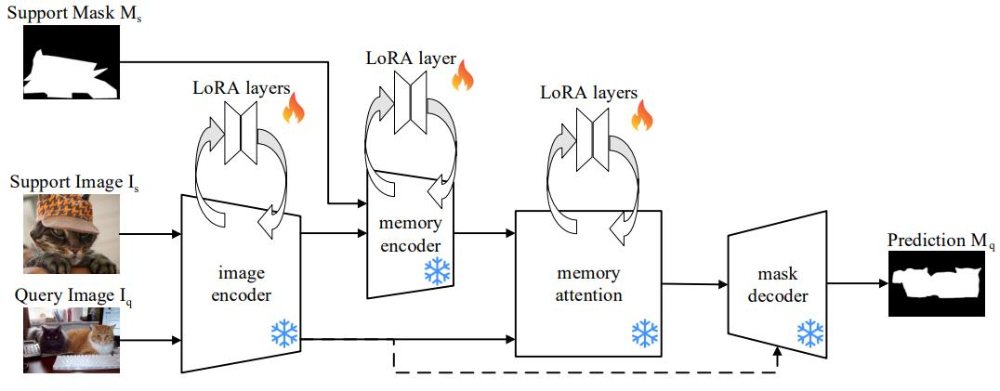

# [FS-SAM2: Adapting Segment Anything Model 2 for Few-Shot Semantic Segmentation via Low-Rank Adaptation](https://arxiv.org/abs/2509.12105)

## Abstract

小样本语义分割近来备受关注，其目标是开发一种仅利用少量标注样本就能分割未见类别的模型。现有大多数方法都采用额外模块从头训练的方式来适配预训练模型，若要达到最优性能，则需要在大型数据集上进行大量训练。Segment Anything Model 2（SAM2）是一个面向零样本图像与视频分割的基础模型，采用模块化设计。本文提出一种基于 SAM2 的小样本分割方法（FS-SAM2），直接将 SAM2 的视频能力重新用于小样本任务。此外，我们对原始模块应用低秩适配（LoRA），以处理标准数据集中常见的多样化图像——这些图像不同于 SAM2 预训练时所使用的时间连续帧。通过这种方式，只需元训练少量参数，即可在受益于 SAM2 出色分割性能的同时有效地对其加以适配。我们的方法支持任意 K-shot 配置。我们在 $\rm PASCAL-5^i$、$\rm COCO-20^i$ 和 FSS-1000 数据集上评估了 $\rm FS-SAM2$，取得了显著效果，并在推理时展现出优异的计算效率。

代码见 https://github.com/fornib/FS-SAM2。

**关键词**：Few-Shot Semantic Segmentation · Segment Anything Model 2 · Low-Rank Adaptation.

## 1 Introduction

*语义分割* 是计算机视觉中最重要的工作之一，其目标是为图像中的每个像素分配一个预定义的类别标签。深度神经网络的近期发展已在语义分割任务上取得巨大进展[3]。然而，大多数进步可归因于每个目标类别拥有大量训练样本。在实际应用中，为新类别提供带标注数据可能成本高昂甚至不切实际，尤其当需要像素级标注时。在低数据场景下，大多数方法因过拟合而泛化性能不佳。为应对这一挑战性环境，**小样本语义分割（FSS）** 旨在训练一个语义分割模型，使其能够利用有限样本适应新类别[22]。具体而言，给定一个仅包含某新类别少数几张已标注图像的支持集，模型在查询图像上评估对该新类别的分割性能。

近年来的方法通常基于预训练图像编码器提取查询和支持特征，再将其融合以解码目标分割结果 [16,19,23,24,30]。这些方法要么使用相对较少的训练样本来训练一个复杂且专门设计的模块，要么采用庞大的编码器以提取更通用的特征。后者通常表现更优，但这是以显著降低推理速度为代价的。在实际应用中，实时延迟往往是关键约束，迫使人们在效率与性能之间做出权衡。

Segment Anything Model 2（SAM2）[20] 是一个面向类别无关的图像与视频分割视觉基础模型，能够利用用户提供的多种提示（如点、框或掩码）。凭借基于 Hiera 图像编码器 [21] 的强大模型架构，并借助大规模视频分割训练过程，SAM2 兼具卓越性能和快速推理速度。其内部模块，叫做记忆注意力（memory attention），使 SAM2 能够通过匹配特征来跟踪视频帧中被提示的目标。在本文中，我们提出将这一匹配能力用于小样本任务：将支持图像视为已标注的视频帧，并将查询图像视为待分割的后续帧。我们采用低秩适配（LoRA），一种在每个模块中引入少量可训练参数的微调策略，来适配 SAM2 的记忆模块和编码器模块。这种方法能够在无需从头训练任何专用模块的情况下，实现有效的模型适配和增强的特征提取。

我们的贡献如下：

1. 我们提出**FS-SAM2**：一种简单而有效地将 SAM2 架构重新用于小样本语义分割任务的方法，展示了其基于视频的设计如何能够无缝地迁移至该任务。
2. 我们应用低秩适配（LoRA）来调整SAM2，使其在小样本场景中实现高效且稳健的学习，并配有简单的训练策略和极少的参数需求。
3. 我们在 $\rm PASCAL-5^i$、$\rm COCO-20^i$ 和 FSS-1000 数据集上进行了大量实验研究以验证我们的方法。FS-SAM2 在计算高效的同时，取得了与最先进方法相当的性能。

## 2 Background and Related Works

### 2.1  Few-shot Semantic Segmentation

小样本语义分割（FSS）是将小样本学习范式 [7] 应用于语义分割任务，旨在提升低数据场景下的泛化能力。一个由少量包含新目标类别分割掩码的图像组成的**支持集**被用作模型适配的输入，而包含该类别的查询图像则用于评估。近年来的方法通过在推理时将查询特征与支持特征进行匹配，使查询图像以新类别为条件进行分割。在原型匹配中，目标类别由从支持集中提取的一个（或少数几个）特征向量表示，并用于对每个查询特征进行分类 [26, 27, 32]。这种对支持集特征的强压缩有助于正则化，但可能包含对目标类别不完整或不准确的表示。相比之下，像素级匹配则计算查询特征与支持集特征之间的逐元素相关性，从而提供更详细的上下文信息 [9,16,19,23,28,31]。在 DCAMA [23] 中，采用交叉注意力计算像素级匹配，并将支持掩码聚合到多尺度查询特征中，再馈入卷积解码器以生成分割掩码。

### 2.2 SAM-based Few-Shot Segmentation

SAM [11] 是一个分割模型，由三个模块组成：图像编码器，用于从输入图像中提取嵌入表示；提示编码器，用于基于用户提供的提示计算嵌入；以及掩码解码器，用于结合这些嵌入以生成分割掩码。SAM2 [20] 通过增加记忆编码器模块将分割任务扩展到视频领域。它利用先前帧的图像嵌入及其预测掩码进行编码。记忆注意力模块通过像素级匹配，依据这些编码后的嵌入来调节每一新帧。近期方法 [14, 24, 30] 成功地将 SAM 适配到小样本语义分割（FSS）场景中，利用了其提示能力，尽管它们通常仍需额外编码器才能达到满意的分割性能。例如，VRP-SAM [24] 通过基于 PFENet [26] 和可学习向量的交叉注意力训练一个独立网络，直接生成应用于查询图像的提示嵌入。类似地，GF-SAM [30] 通过匹配图像特征生成先验查询掩码，随后利用该先验掩码中提取的点来聚类 SAM 的输出掩码，从而进行细化。GF-SAM 表现出色，但整体资源消耗极大，因为它使用了独立的 DINOv2 编码器 [18] 并反复应用 SAM 的掩码解码器。此外，GF-SAM 不进行任何域内训练，仅依赖 DINOv2 的泛化能力，而该能力已被证明 [2] 优于大多数语义模型。其他方法 [1, 33] 将 SAM2 用于医学图像，通过重新利用记忆注意力模块并附加选择标准来识别一小部分样本作为已标注帧。这些方法无需额外训练即可工作，因为医学数据集通常由相似图像组成，类似于 SAM2 预训练中的视频帧。

### 2.3 Fine-tuning strategies

视觉基础模型在大规模数据集上进行预训练，擅长提取高质量的图像表示。大多数小样本语义分割（FSS）方法将这些模型用作网络的主干，通常保持冻结以减少过拟合，并在其后跟一个针对小样本任务进行元训练的专用模块。然而，如 [25] 所示，对主干中少量参数进行微调，可能提升模型在学习新类别时的泛化能力。其中一种最有效且广泛采用的参数高效微调方法是低秩适配（LoRA）[10, 29]。该方法通过将选定线性层的初始特征投影到低秩表示，再投影回输出尺寸，并与原始输出特征进行逐点相加，从而实现适配。

$$
\hat{y} = \hat{W}x = Wx + BAx \tag{1}
$$

其中 $\large \hat{y} \in \mathbb{R}^{d_{out}}$ 为更新后的层输出， $\large \mathrm{x} \in \mathbb{R}^{d_{in}}$ 为层输入， $\large W \in \mathbb{R}^{d_{out} \times d_{in}}$ 为线性层对应的权重矩阵， $\large A \in \mathbb{R}^{r \times d_{in}}$ 为下投影， $\large B \in \mathbb{R}^{d_{out} \times r}$ 为上投影， $r \ll \min\{ d_{in}, d_{out} \}$ 为秩。LoRA 通过仅微调低秩投影，同时保持原始参数冻结，从而最小化可训练参数的数量。微调完成后，可将低秩更新合并到现有层中，即将原始权重 $W$ 替换为更新后的权重 $\hat{W}$ 。这种整合方式使模型能够利用微调的收益，而无需在推理时保留单独的 LoRA 组件，从而保持原始模型的计算效率并简化部署。

## 3 Methodology

### 3.1 Problem Setting

小样本语义分割（FSS）在 K-shot 设定下的任务是学习一个分割模型  $\mathcal{F}_\Theta $，该模型在元训练数据集 $ \mathcal{D}_{\text{train}} $ 上训练，并在独立的元测试数据集 $ \mathcal{D}_{\text{test}} $ 上评估。这些数据集由包含单个类别分割掩码的图像组成，且两个数据集中被分割的类别互不重叠。遵循先前工作 [7,26,27]，情节学习范式被应用于 $\mathcal{D}_{\text{train}} $ 和 $ \mathcal{D}_{\text{test}} $ 两个数据集，以确保训练过程与评估过程相仿。

对于每个数据集，令 $ l $ 为除背景外的某一类别。支持集定义为 $ S = \{(I_i, M_i)\}_{i=1}^{K} $ ，其中 $ K $ 是样本数（由 $ i $ 索引）， $ I_i \in \mathbb{R}^{H_i \times W_i \times 3} $ 是数据集中包含类别 $ l $ 的不同 RGB 图像， $ M_i \in \{0,1\}^{H_i \times W_i} $ 是它们对应的类别 $ l $ 的二值分割掩码。查询图像 $ I_q \in \mathbb{R}^{H_q \times W_q \times 3} $ 是同一数据集中不同于支持集图像的 RGB 图像，查询掩码 $ M_q \in \{0,1\}^{H_q \times W_q} $ 是类别 $ l $ 对应的掩码。一个情节由一个支持集和一张查询图像组成。对于每个情节，任务是从支持集中泛化，并在查询图像中准确分割出类别 $ l $ 。

$$
\hat{M_q} = \mathcal{F}_\Theta(I_q, S) \in \{0,1\}^{H_q \times W_q} \quad \quad \quad \quad \text{IoU}_l = \frac{\sum_{q} |M_q \cap \hat{M_q}|}{\sum_{q} |M_q \cup \hat{M_q}|} \tag{2}
$$

其中 $ \hat{M_q} $ 是查询图像中类别 $ l $ 的预测二值分割。在元测试数据集上的评估中，各情节相互独立，确保它们之间不共享任何信息。FSS 的标准评估指标是平均交并比（mIoU）：IoU 按所有查询图像 $ q $ 的像素总和计算，mIoU 则计算为所有前景类别的平均IoU： $ \text{mIoU} = \frac{1}{C} \sum_{l=1}^{C} \text{IoU}_l $ ，其中 $ C $ 是评估数据集中的类别总数。

### 3.2 FS-SAM2

在本工作中，我们提出了一种简单而有效的策略，将 SAM2 适配到小样本语义分割（FSS）任务上，充分利用其广泛的预训练和计算效率。我们将支持集 $S$ 视为已标注的视频帧，将查询图像 $I_q$ 视为待分割的后续帧，从而重新利用 SAM2 的视频分割能力。我们注意到，SAM2 的预训练基于彼此非常相似的时间连续帧，严重依赖于这些帧之间的相似性。这导致在标准数据集上的 FSS 性能欠佳，因为支持图像和查询图像可能存在显著差异。为解决这一问题，我们采用元训练策略来学习少量参数，从而有效地适配模型。

FS-SAM2 的整体架构如图 2 所示，所有模块均继承自 SAM2。给定支持图像 $I_s$ 及其对应的掩码 $M_s$ ，以及查询图像 $I_q$ ，图像编码器独立地从两幅图像中提取高质量特征。支持掩码和特征经过下采样，并在记忆编码器中进行组合，该编码器是一个卷积模块，将分割掩码融入图像特征中。记忆注意力模块通过像素级匹配，对查询特征以编码后的支持特征为条件进行调节，在图像嵌入上反复执行交叉注意力和自注意力操作。输出嵌入带有高层查询特征，用于在掩码解码器中生成预测掩码 $M_q$ ，该解码器是一个基于轻量级 Transformer 架构[4]并带有卷积上采样的模块。提示编码器被忽略，因为掩码解码器仅使用默认的 token 嵌入，且不需要几何提示。

我们将 LoRA 应用于图像编码器、记忆编码器和记忆注意力模块。掩码解码器保持不变，因为其广泛的类别无关预训练已使其适合该任务。在元训练期间，未标注的查询图像通过记忆注意力模块与已标注的支持图像进行匹配。随后将查询图像的预测标签与真实标签进行比较以计算损失，并用该损失来微调参数。这种方法允许仅通过元训练少量参数来进行微调，同时有效地使模型专门适应小样本设定。

### 3.3 Extension to K-shots

我们的方法可以适应任意 K-shot 配置，无需为每个 K 训练不同的模型。我们将所有 K 张支持图像视为先前已标注的视频帧，并应用相同的框架。具体而言，每张支持图像及其掩码通过记忆编码器进行编码，然后将这些编码沿空间维度拼接，再送入记忆注意力模块。

## 4 Experimental Results

### 4.1 Datasets

我们在三个广泛使用的公共数据集上进行了大量实验，以评估FS-SAM2的性能和泛化能力： $\text{PASCAL-5}^i$ [22]，包含来自 $\text{PASCAL VOC 2012}$ [5]和 $\text{Extended SDS}$ [8]数据集的20个类别； $\text{COCO-20}^i$ [17,27]，基于 $\text{MS COCO}$ [13]数据集，包含80个类别；以及 FSS-1000 [12]，包含 1000 个类别。 $\text{PASCAL-5}^i $和 $\text{COCO-20}^i$ 的类别均分为 4 折，采用交叉验证进行评估，而 FSS-1000 则划分为 520 个训练类别、240 个验证类别和 240 个测试类别。

遵循近期工作 [16,26]，我们还评估了域偏移场景，即每个在 $\text{COCO-20}^i$ 某一折上训练的模型，会在与该折类别不重叠的 $\text{PASCAL-VOC}$ 图像上进行测试。为确保与其他基准一致，我们对每折使用 1000 个随机采样的情节进行测试。

生成一个情节时，首先选择查询图像，然后从该图像中随机采样一个类别，最后随机采样与该类别对应的支持集，其中其他类别在分割掩码中被标记为背景。对于 $\text{COCO-20}^i$ ，按照先前工作 [16,23,24,30] 的做法，首先随机采样类别，然后随机采样包含该类别的查询图像和支持集。

### 4.2 Implementation details

我们主要遵循 VRP-SAM [24] 的实现。在元训练期间，我们使用二值交叉熵（BCE）损失和 Dice 损失来监督学习。我们采用 AdamW 优化器 [15]（β1 = 0.9，β2 = 0.999）和余弦学习率衰减调度。模型训练 50 个 epoch，初始学习率为 1e-4，批次大小为 16。每个 epoch 对应于元训练数据集的大小，并在元测试数据集上采用早停验证。我们采用与先前一些工作 [19, 26] 相同的训练增强策略。图像首先被调整为 1024×1024，再送入 SAM2，预测的掩码则被调整回原始分辨率以进行评估。模型性能使用每折的平均交并比（mIoU）进行评价。

我们所有实验均在 Hiera-B+ 版本的 SAM2 上进行，并使用 SAM2.1 预训练权重初始化。我们将 LoRA 应用于 Transformer 模块的 Q、V、K、O 投影层。图像编码器中 LoRA 秩设为 4，而在记忆注意力和记忆编码器中，鉴于其层数较少，我们将秩设为 32，以引入相当数量的可训练参数。整体架构总计 8100 万参数，其中仅 75 万为可训练参数。训练使用两块 NVIDIA A100-64GB GPU，并转换为 bfloat16 进行。

## 5 Conclusions

在本文中，我们提出了FS-SAM2，这是一个将 SAM2 适配到小样本语义分割任务的新框架。SAM2 的视频分割能力可以被有效地重新利用，通过训练少量参数即可使查询图像以支持集为条件进行分割，且无需额外的骨干网络或专用模块。采用 LoRA 进行适配进一步提升了在新类别上的泛化性能。总体而言，我们的方法在计算高效的同时，展现出了极具竞争力的结果。

对于未来的研究方向，值得探索替代性的 5-shot 训练方法，并研究更高效的参数微调策略。此外，我们计划将方法扩展到多类别设定，这是一个相对探索不足但具有显著实际优势的任务，因为 SAM2 目前缺乏类间通信能力。
