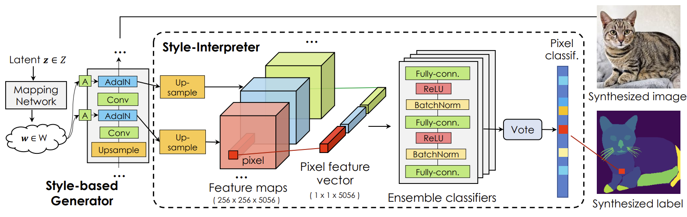

# [DatasetGAN: Efficient Labeled Data Factory with Minimal Human Effort](https://arxiv.org/pdf/2104.06490.pdf)

## Abstract

我们介绍 DatasetGAN：一个只需要极少的人力就能自动生成大量高质量的语义分割图像数据集的程序。目前的深度网络都是极其数据饥渴的，并受益于在大规模的数据上的训练，而对这些数据集进行标注是非常耗时的。我们的方法依赖最近的 GANs 的能力来生成真实的图像。我们展示了 GAN 的潜在编码可以被解码，以产生一幅图像的语言分割。训练这个解码器只需要少量标注的样本，就可以泛化到其余的潜在空间，从而产生一个无限的带标注的数据生成器！这些生成的数据集可以被用来训练任意的计算机视觉架构，就像一个真实的数据集一样。由于只有少量图像需要手动分割，因此可以对图像进行非常精细的标注，并生成具有丰富的对象和某些部分的分割数据集。为了展示我们的方法的能力，我们为 7 个图像分割任务生成了数据集，其中包含 34 个人脸零件和 32 个汽车零件的像素级标签。我们的方法明显优于所有的半监督基线，并与全监督方法相当，在某些情况下，全监督方法需要比我们的方法多 100 倍的标注数据。

**图 1：** $\rm D{\scriptsize ATASET}GAN$ 合成图像-标注对，并且能够产生带有精细的逐像素标签的大型高质量数据集。图例说明 4 个步骤：(1 & 2). 利用 StyleGAN 并标注少量的合成的图像。(3). 自动生成一个大型带标注图像的合成数据集。(4). 用合成的数据集训练你喜欢的方法，并在真实的图像上测试。

## 1. Introduction

使用语义或者实例分割等像素级标签来管理图像数据集是非常费力 (且昂贵) 的。标注一个有 50 个物体的复杂场景可能需要花费 30 - 90 分钟，这显然是实现我们可能想要的数据集规模的瓶颈。在本论文中，我们的目标是通过只标注少量的样本来合成大型高质量的已标注的数据集。

半监督学习通过利用额外的大量未标注的数据集，已经成为减少对标注数据的需求的探索中的一种流行的方法。主流方法是在一个使用真实标注的已标注数据集上训练一个模型，同时在未标注的样本上使用伪标签 [3,47] 和一致性正则化。虽然大多数方法都被用于分类任务，但最近的工作也展示了在语义分割任务上的成功。另一方面，对比学习的目标是利用在采样图像对，或者图像块的对比 (无监督) 损失来训练特征提取器。一旦通过单一的无监督损失训练出一个强大的图像表示，通常只需要一小部分已标注图像来训练准确的预测器。在我们的工作中，我们展示了最新的最先进的图像生成模型，学习极其强大的潜在表示，能被用于复杂的像素级任务。

我们引入了 $DatasetGAN$，它可以生成大量高质量的语义分割图像数据集而只需要最低限度的人力。我们的方法的关键是观察到，GANs 训练合成图像必须获得丰富的语义知识，以呈现各式各样的且真实的物体的示例。我们利用一个训练过的 GAN 的特征空间，并训练一个浅的解码器来产生像素级的标注。我们的关键见解是，只需要少量的已标注数据就可以训练一个成功的解码器，从而产生无限的标注的数据集生成器。这些生成的数据集能被用于训练任何计算机视觉架构，就像真正的数据集一样。因为我们只需要标注少量的样本，我们可以非常精细地标注图像，并生成具有丰富对象和零件分割的数据集。我们生成了 7 个分割任务的数据集，其中包括 34 个人脸零件、32  个汽车零件的像素级标注。我们的方法明显优于所有的半监督基线，并且与完全监督的方法持平，但在某些情况下需要的标注数据少两个数量级。

## 2. Related Work

**标注数据的生成模型：** 先前关于数据集合成的研究主要集中于 3D 场景图的生成模型，利用图形学来渲染图像及其标签。在我们的工作中，我们关注于生成对抗网络 (GANs)，它在使用对抗样本的大数据集上训练后，合成高质量的图像。先前的工作利用 GANs 来创建合成的数据集。在域适应中，一些工作旨在通过利用图像到图像的转换技术，将标记好的图像数据集转换到另外一个域，在这个域中，图像标注要么昂贵，要么完全缺失。然后可以在转换后的数据集上训练一个有监督的计算机视觉模型。这些方法假设存在一个大型的已标注的域，可以被用于新的域。在我们的工作中，我们只需要少量人工标注的图像，就可以合成一个更大的集合。

最近，[55] 使用 StyleGAN 作为多视图图像数据集生成器，用于训练一个逆向图网络来预测 3D 形状。作者利用了在 StyleGAN 的潜在编码中视图与物体身份之间的解耦合。我们更进一步，仅利用人类提供的一些样本来合成准确的语义标签。为了实现零样本图像分类，GANs 也被用于从未见过的类的语义特征中合成未见过的类的可视化特征。据我们所知，我们的工作是第一个使用 GANs 来直接合成有高水平的细节标注的大型图像数据集的。

**半监督学习：** 给定一批大量未标注的图像和一批少量已标注的图像，半监督方法的目的是学习比单独使用监督数据更好的分割网络。这些方法大多数将分割网络当作生成器，并使用少量真正的标注对抗训练。在他们的案例中，对抗性损失试图从模型产生的虚假的分割中学习到好的分割，但他们不像我们那样利用图像本身的生成性建模。伪标签和一致性正则化最近也被探索用于语义分割，其中关键思想是在小型的已标注的数据集上训练，并使用真实标注数据与对未标注图像的高置信度的预测的混合再重新训练模型。不同于现有的半监督方法，我们利用一个 GAN 来合成图像及其像素级标签。

同一时刻的工作 [15] 也将 GAN 的特征转换为语义分割。然而，他们的方法依赖于用卷积和残差块构建的解码器，用于将 StyleGAN 的内部层投影到分割映射上。我们的方法直接通过一个简单的 MLP 分类器的集成，将每个像素的解纠缠的特征向量直接解释为其语义标签，这更好地利用了 StyleGAN 特征向量中的语义知识。此外，我们使用我们的方法创建带有高细节的零件标签和关键点注释的大型图像数据集，我们希望这将使以前不可能实现的各种下游应用成为可能。

同一时刻的工作 [32]，作者探索了另外一个方向，GAN 配备分割分支，也被用作测试时的语义解码器。[35] 中探索了一个相关的想法，使用 VAE 从部分可见的 masks 解码非模态的实例 masks。编码器使用测试时优化将图像映射到潜在编码，然后使用该编码来预测重建图像和语义输出。语义 GAN 的训练和我们不同，使用对抗性损失。该方法比我们的方法需要更多的训练数据，并且测试时更慢，然而，它有能泛化到域之外的优点。

**对比学习：** 对比方法使用一个对比性损失来测量采样对的相似性来学习一个图像的表示空间。最近关于对比学习的研究已经在图像分类上展现出不错的结果。利用学习后的自监督表示，通过在少量已标注的样本上微调，能够显著地提升分类的准确性。通过在成对的图像块上学习，对比学习也可以被应用于图像分割。像我们一样，这一系列的工作使用学习后的图像表示来分摊对于大型标注数据集的需求。但是，我们没有使用对比性损失，而是利用了 GAN 的特征映射中的语义知识来进行细粒度的注释合成。

**图 2：** 我们的 $\rm D{\scriptsize ATASET}GAN$ 的整体架构。我们从 StyleGAN 中上采样特征映射到最高的分辨率，为合成图像上所有的像素构建逐像素的特征向量。然后训练一个 MLP 分类器的集成来将一个像素的特征向量中的语义知识翻译为它的零件标签。

## 3. Our Approach

我们现在介绍合成图像-标注对的 $\rm D{\scriptsize ATASET}GAN$。我们主要关注像素级标注任务，比如语义分割和关键点预测，因为它们是最耗时的人工标注任务中的典型例子。

$\rm D{\scriptsize ATASET}GAN$ 的关键见解是生成模型，比如 GANs，在被训练用来合成高度真实的图像时，必须在其高维的潜在空间中获取语义知识。例如，像 StyleGAN 这样的架构中的潜在编码包含了控制诸如视角和物体身份等 3D 属性的解耦合的维度。在两个潜在编码之间的插值已经被证明能产生逼真的生成，这表明 GAN 也学到了语义上和几何上对齐物体及它们的零件。$\rm D{\scriptsize ATASET}GAN$ 的目的是利用图像 GANs 的这些强大的特性。直观地说，如果一个人提供了一个对应于一个潜在编码的标签，我们期望能够跨越 GAN 的潜在空间有效地传播这个标签。

我们的 $\rm D{\scriptsize ATASET}GAN$ 十分简单，但非常强大。具体来说，我们利用一个 GAN 架构来合成少量的图像，本文中是 StyleGAN，并记录它们对应的潜在特征映射。一个人类标注人员被要求为这些图像打上一组所需要的标签。然后我们在 StyleGAN 的逐像素的特征向量上训练一个简单的 MLP 分类器的集成，我们将其称为风格解释器，来匹配人类提供的目标标签。图 2 提供了一个可视化。我们观察到，训练风格解释器仅需要少量的带标注的样本就能取得不错的精度。在训练风格解释器时，我们将其用作 StyleGAN 架构中的一个标签生成分支。通过采样潜在编码 $z$，并将其传递通过整个架构，我们得到了一个无限的数据集生成器！这些数据集能像真实数据集一样被用于训练任意的计算机视觉架构。

我们利用 $\rm D{\scriptsize ATASET}GAN$ 的仅需要少量人工标注的图像的效率优势，并致力于将每个独立图像标注为非常多细节的像素级标签。我们创建了有 40 张图像的微小数据集，包含了非常精细的零件和少数类别的关键点的标注，并利用我们的 $\rm D{\scriptsize ATASET}GAN$ 来合成更大的数据集。我们相信社区将会发现这些数据集对各种令人兴奋的下游应用有用。

我们在 3.1 节中简要地总结了 StyleGAN，并在 3.2 节中描述风格解释器。我们在 3.3 节中讨论数据集生成，并在第 4 节中详细介绍我们的标注成果。

### 3.1. Prerequisites

由于StyleGAN 的令人印象深刻的合成质量，$\rm D{\scriptsize ATASET}GAN$ 使用它作为生成主干。StyleGAN 生成器将从正态分布中抽取的潜在编码 $z \in Z$ 映射到真实的图像。潜在编码 $z$ 首先通过一个映射函数被映射到中间潜在编码 $w \in W$。然后 $w$ 被转换为 $k$ 个向量，$w^1,\dots,w^k$，得到 $k$ 个学习后的仿射变换。这些 $k$ 个变换后的潜在编码以渐进的方式作为风格信息被注入到 $k/2$ 个合成块中。具体来说，每个合成块有一个上采样 ($\times 2$) 层和两个卷积层组成。每个卷积层后跟着一个自适应实例归一化 (AdaIN) 层，它由对应的 $w^i$ (变换后的潜在编码) 控制。我们将 $k$ 个 AdaIN 层的输出特征映射表示为 $\{S^0,S^1,\dots,S^k\}$。

### 3.2. Style Interpreter

我们将 StyleGAN 解释为一个 "渲染" 引擎，而它的潜在编码作为定义渲染内容的 "图形" 属性。因此我们假设一个输出特定的 RGB 像素的扁平的特征数组包含有语义意义的信息，以便真实地渲染像素。为此，我们从 AdaIn 层中上采样特征映射 $\{S^0,S^1,\dots,S^k\}$ 到最高的分辨率 $S^k$，并将它们拼接起来得到一个 3D 特征张量 $S^* = (S^{0,*},S^{1,*},\dots,S^{k,*})$。输出图像中的每个像素 $i$ 都有它自己的特征向量 $S^*_i = (S^{0,*}_i,S^{1,*}_i,\dots,S^{k,*}_i)$，如图 2 所示。我们使用一个三层的 MLP 分类器在每个特征向量上预测标签。为了简单起见，我们在所有像素间共享权重 (**即每个像素都用同一个 MLP**)。

**训练：** 我们在第 4 节中讨论标注的收集。注意，我们这里的目标是训练一个特征分类器——对应的合成图像只是用来从人工标注人员那获取标签的。

因为特征向量 $S^*_i$ 是高维的，并且特征映射也有一个高的空间分辨率 (最多 1024)，我们不能轻易地在一个批量中消耗掉所有的图像特征向量。因此我们对每幅图像的特征向量进行随机采样，其中我们确保我们对每个标签区域至少采样一次。我们对于我们所关心的不同任务使用不同的损失。对于语义分割，我们采用交叉熵损失训练分类器。对于关键点检测，我们为训练集中的每个关节点构建一个高斯热力图，并使用 MLP 函数来拟合每个像素的热力值。我们不将梯度反向传播给 StyleGAN 骨干。

为了分摊随机采样的影响，我们训练 N 个分类器的集成，我们的论文中 $N = 10$。在语义分割测试时，我们在每个像素中使用多数投票的方式。对于关键点预测，我们对 N 个分类器对每个像素预测的 N 个热力值进行平均。

我们的特征分类器需要非常少的标注图像来做出准确的预测，如图 4 和 5 所示，并在实验中得到了验证。

### 3.3. DatasetGAN as a Labeled Data Factory

一旦训练完，我们的风格解释器被用作在 StyleGAN 主干上的标签合成分支，形成我们的 $\rm D{\scriptsize ATASET}GAN$。因此我们能够生成任意数量的图像-标注对，形成我们的合成的数据集。合成一个图像-标注对需要通过 StyleGAN 前向传播，这平均需要 9 秒。虽然我们的实验表明，随着每增加10k 的合成图像，下游任务的性能会稍微地提升，但这是有相关成本的，我们在大多数实验中使用 10k 大小的数据集。

当然，StyleGAN 偶尔也会失败，这会在合成数据集中引入噪声。我们注意到 StyleGAN 的鉴别器分数不是一个鲁棒的失败的度量，并且我们发现利用我们的分类器的集成来测量一个合成样本的不确定性是一个更鲁棒的方法。我们遵循 [30]，并使用 Jensen-Shannon (JS) 散度作为一个像素的不确定性的度量。为了计算图像的不确定性，我们对所有的图像像素求和。我们过滤掉前 10% 最不确定的图像。我们在附录中提供了详细信息。

图 4 和 图 5 展示了从我们 5 个用于不同对象类别的零件分割的合成的数据集中随机样本。虽然不完美 (例如没有皱纹)，但合成的标签的质量是引人注目的。对于一个相同规模 (10k 图像) 的数据集的众包标注需要超过 3200 小时 (132 天)，并且，我们假设这将会有很多噪音，因为标注一张图像到很精细的层次同时需要技巧和巨大的耐心。在我们的案例中，一个数据集的人工标注时间大约是 5 小时，使得我们只需要一个熟练的标注人员。接下来对此进行描述。

**图 3：** 小型人工标注的人类和汽车数据集。大多数用于语义分割的数据集 (MS-COCO, ADE, Cityscapes) 都太大了，用户无法检查每张训练图像。在这个图像中，我们展示了所有的人脸训练示例 (a-c) 和汽车 (d-f) 分割。a) 显示了一个分割 mask 的示例和相关的标签，b) 显示了完整的训练图像集合 (GAN 样本)，c) 显示了标注的零件列表和数据集中的实例数量。一个有趣的事实是，一张图像中的标签数量比数据集中的图像数量还多 (34 个标签 vs 16 张图)。

## 4. Collecting Fine-grained Annotations

真实和 GAN 生成的图像都由一个有经验的标注人员使用 LabelMe 进行标注。被用来训练风格解释器的 GAN 生成的图像，有 40 间卧室 (1109 个多变形)，16 辆汽车 (605 个多边形)，16 个人头 (950 个多变形)，30 只鸟 (443 个多边形)，和 30 只猫 (737 个多边形)。对于每个类别，我们人为地定义一个包含尽可能多细节的结构。图 3 展示了两个类别的结构和所有的标注过的图像。真实的图像 (来自不同的数据集，见第 5 节) 仅用于评估。

**标注真实图像 vs GAN 图像的统计**： GANs 根据类别产生不同质量的图像。在人头的类别中，图像非常逼真，标注的零件数量与标注的真实的图像相似 (GAN 图像平均 58 个标注过的零件，真实图像平均 55 个标注过零件)。每个人头的标注，包括所有的零件需要 1159 秒 (标注人头的轮廓平均要 74 秒)。在鸟和猫上面训练的 GANs 产生质量稍微差一点的图像。GAN 的鸟的图像有 13.7 个零件，而真实的鸟的图像标注有 17 个零件。GAN 的猫的图像有 23.6 个零件，而真实的猫的图像平均有 27.7 个标注过的零件。尽管零件的数量略有减少，但在 GAN 生成的图像中可用于标注的精细零件的数量是显著的。

**标注时间：** 鸟，包括所有的零件，每张图平均需要 262 秒来标注，而猫平均需要 484 秒。GAN 生成的卧室质量很高，但比真实的图像包含更少的可识别的物体。GAN 生成的图像的分辨率是 $256 \times 256$，而真实的图像分辨率更高。GAN 生成的卧室平均有 37.8 个标注过的物体，而真实图像有 47.8 个标注过的物体。平均而言，GAN 生成的卧室花费 629 秒来标注，而真实的图像需要 1583 秒，因为它们包含更多的细节。

**局限性：** 因为我们的方法依赖于 GAN 的图像，图像质量有时会干扰标注。我们的标注人员在标注鸟类的时抱怨。合成的鸟的腿大多是不可见的、模糊的和不自然的，使得标注具有挑战性。如图 5 所示，我们的合成数据集几乎没有生成腿标签，这影响了该部分的测试时的性能。

**图 4：** 来自我们的 $\rm D{\scriptsize ATASET}GAN$ 的人脸和汽车的合成图像和标签的示例。StyleGAN 骨干是在 $1024 \times 1024$ 分辨率的图像的 CelebA-HQ (人脸) 和 $512 \times 384$ 分辨率的图像的 LSUN CAR (汽车) 上训练的。$\rm D{\scriptsize ATASET}GAN$ 是在 16 张标注过的样本上训练的。

**图 5：** 来自我们的 $\rm D{\scriptsize ATASET}GAN$ 的鸟类、猫、卧室的合成图像的示例。StyleGAN 是在 NABirds ($1024 \times 1024$ )、LSUN CAT ($256 \times 256$) 和 LSUN Bedroom ($256 \times 256$) 上训练的。$\rm D{\scriptsize ATASET}GAN$ 是在 30 张标注过的鸟、30 张猫和 40 张卧室样本上训练的。

## 5. Experiments

我们广泛地评估我们的方法。首先，我们在五个不同类别的零件分割上面进行评估：汽车、人脸、鸟类、猫和卧室 (场景)。此外，我们还标注了两个关键点数据集 (汽车和鸟类)，并评估了我们方法所支撑的关键点检测性能。我们最终展示了一个定性的 3D 应用程序，它利用我们为汽车合成的数据来实现单张图像的 3D 资源创建。

**StyleGAN 模型：** 每个类别需要一个预训练的特定类别的 StyleGAN 模型。对于汽车、猫、人脸和卧室，我们直接地使用 StyleGAN 作者提供的官方 Github 仓库中的预训练的 StyleGAN 模型。对于鸟类，我们在包含 48k 张图像的 NABirds 上训练我们自己的 StyleGAN 模型。

**图 6：** **训练样本的数量 vs mIOU**。我们在 ADE-Car-12 测试集上与基线进行比较。红色的虚线表示利用来自 ADE20k 的训练样本的完全监督的方法。

### 5.1. Parts Segmentation

**我们生成的数据集：** 图 4，5 显示了本文中使用的所有类别的合成的图像-标注对。我们注意到，更高分辨率的 StyleGAN 模型 (鸟类、人脸) 会产生更精确的合成的标注。我们在附录中提供了更多的示例。

**零件分割网络：** 为了简单，我们使用以在 ImageNet 上预训练的 ResNet151 为骨干的 Deeplab-V3，作为我们在合成数据集上训练的零件分割网络。我们让 Deeplab-V3 在每个像素上输出所有的零件标签的概率分布。虽然可以利用模型中的零件的层次结构，但这里我们选择了最简单的方法。我们使用 Deeplab-V3 作为所有的基线模型的主干。

**基线：** 我们将我们的方法与两种基线进行比较：迁移学习 (TL) 和半监督基线。对于迁移学习基线，我们使用 MS-COCO 上的语义分割的预训练权重初始化网络，并以有监督的方式在我们的小型人工标注的数据集上微调最后一层。该基线评估了计算机视觉中在大型数据集上预训练并在域内微调的标准实践。它不访问目标域中未标注的数据，而是利用另外一个域中的大型的标注过的数据集。我们采用 [41] 作为最先进的半监督基线，并使用与我们方法相同的预训练的骨干 (Deeplab-V3?)。我们在我们的人工标注图像以及被用于训练 StyleGAN 的真实图像上训练这个方法。为了证明我们的方法的有效性，我们进一步将其与一个在大量标注过的真实图像上训练的完全监督的基线进行比较。更多细节见附录。我们强调所有的方法和我们的方法使用相同的分割网络架构，唯一的区别是训练数据和算法。

**表 1：** **零件分割的比较**。（*) 表示域内实验，其中训练和测试在同一数据集中进行，但采用不同的分割方式。否则，训练是在我们的生成的图像上进行的。注意，域内设置不适用于我们的方法，因为我们没有在提供的数据集上训练 StyleGAN。

**表 2：** **关键点检测的比较**。我们的方法得到的结果明显比那些基线得到的更好。

**测试数据集：** 对于汽车，我们在不同细节层次上评估我们的模型的零件分割，以利用现有的数据集进行基准测试。来自 ADE20K 和 PASCAL 的汽车实例分别有 12 个和 5 个零件标签。我们将 ADE20K 测试集中的汽车分成验证和测试集，分别包含 50 张和 250 张图像。我们将来自 ADE20K 中的汽车称为 **ADE-Car-12**，并根据 PASCAL 标注协议进一步将 ADE-Car-12 的标签合并为 5 类 (**ADE-Car-5**)。我们还利用 PASCAL 中的 900 辆汽车进行跨域测试 (无训练)，即 **PASCAL-Car-5**。对于人脸，我们在 CelebA-Mask-8 上评估我们的模型，它包含有 8 个零件类别的 30K 图像。我们利用测试集中前 500 张图像作为验证集。由于目前没有用于猫、鸟类和卧室的精细的零件分割数据集，与我们的标注相比，ADE-Car-12 和 CelebA-Mask-8 都是相对粗糙的。我们为每个类别人工标注 20 张测试图像，来评估在精细零件标签 (第 4 节中描述为 "Real" 的部分) 上的性能。我们将它们分别称为 **Car-20**、**Face-34**、**Bird-11**、**Cat-16**、**Bedroom-19**。我们分别从 Stanford Cars、Celeb-A mask、CUB 和 Kaggle Cat 中为这些小型测试数据集挑选图像。对于卧室，我们从网络上挑选了 20 张图像。所有测试数据集的汇总在表 1。因为我们标注过的数据集没有验证集，所以我们将测试图像分成 5 份。我们将每一份设为验证集并相应地选择检查点 (checkpoints)。我们报告平均 IOU 和标准差。

**定量比较：** 我们首先在表 1 中将我们的方法与迁移学习和半监督的基线进行比较。我们在域外和域内的设置都进行评估，其中基线是在我们的标注过的图像 (第 4 节) 或相同数量的随机选择的域内图像 (ADE cars) 上训练的。注意，我们的方法属于域外的设置，因为我们仅在我们合成的数据集上训练，并在真实的图像上测试。我们的方法在所有的类别上胜过迁移学习和半监督学习的基线一大截。引人注目的是，在 ADE-Car-12 上，我们的模型比迁移学习和半监督学习的域外基线分别高出 20.79% 和 16.96%，并分别比两个域内基线高出 15.93% 和 10.82%。

我们在图 6 中进一步展示了我们的标注过的数据集中训练样本的数量 vs mIOU，与 ADE-Car-12 测试集上的基线的比较。红色的虚线是在完整的 ADE-Car-12 训练集 (2600 张图像) 上训练的完全监督的模型。我们的方法，使用相同的架构和超参数，与完全监督的模型相比，只有 25 张标注，这不到完全监督的方法所使用的 1%。最终，我们在表 5 中展示了在 ADE-Car-5 和 PASCAL-Car-5 上与完全监督的基线的比较。在这里，在 ADE-Car-5 上我们的性能并不比完全监督的基线更好。我们假设这是由于 ADE20K 对于我们的模型是域外的，而对于基线是域内的，并且对于这个更简单的 5 类别任务，基线使用的 2500 个样本足以训练一个好的模型。注意，当我们的模型在 PASCAL-Car-5 上的域外设置中进行评估时，我们的性能比基线高出 1.3%，展示了更好的泛化能力。

**消融研究：** 我们用 16 个训练样本来消融在汽车类别上我们方法中的选择。在表 3 中我们首先消融生成数据集的大小。将合成样本的数量从 3,000 增加到 10,000 可以提高性能，然而当我们进一步添加更多的数据时，这种改进是微小的。我们使用 3.3 节中所述的不确定性去噪策略，并报告使用不同比例过滤最不确定的样本的结果。如表 4 所示，去噪起到了重要的作用。去除噪音数据是多样性和不确定性之间权衡的结果。去除更多的不确定的 (噪音) 数据意味着训练过程中的多样性更少。在此实验中，我们将生成的数据集大小设置为 10,000，并过滤掉前 10% 的不确定的样本。

**表 3：** **合成数据集大小的消融研究**。这里，风格解释器是在 16 个人工标注的图像上训练的。结果是在 ADE-Car-12 测试集上报告的。性能在慢慢地饱和。

**表 4：** **过滤比例的消融研究**。我们过滤掉最不确定的合成的图像-标注对。结果是在 ADE-Car-12 测试集上报告的，使用的生成数据集的大小是 10k。我们在其他的实验中使用 10%。

**表 5：** **与完全监督的方法的零件分割的比较**。 (*) 表示域内实验。Deeplab-V3 是在 ADE-CAR 上训练的，我们的模型是在我们生成的数据集上训练的。

**表 6：** **数据的选择**。我们比较了用于选择要人工标注的 StyleGAN 图像的不同策略。在 ADE-Car-12 测试集上报告了 mIOU。我们用 1 & 7 个训练示例计算了 5 次随机运行的均值和方差。

**训练数据的选择：** 在我们的方法中，只需要 20 个训练样本就能获得不错的准确性，这对于这种级别的细节是显著的。在这样一个低数据的环境中，选择正确的图像进行人工标注是至关重要的。我们消融三种不同的选择。最直接的选择协议是从生成的数据集中简单地随机选择图像。一个更耗时的选择，但通常在收集数据集时使用，即雇佣一个人 (CV 专家) 查看数据集，并选择最具代表性和多样化的样本。最终，作为一种更高级的策略，可以使用主动学习 (AL)，其中选择和模型训练 (训练风格解释器) 在一个连续的循环中交替。与 [30] 类似，我们利用基于集成的 AL 策略，然后应用 coreset [46]。我们重用 3.3 节中描述的集成和 JS 散度来计算图像的不确定性。我们过滤掉前 $k\%$ 最不确定的样本，并在前 $k + 10\%$ 到 $k\%$ 的数据上运行 N 个中心的 coreset 来选择最具代表性的样本。在本文中我们使用 $N = 12$ 和 $k = 10$。最终，我请我们的 CV 专家从子集中选择前 6 张最真实的图像来进行标注。

在表 6 中我们比较了这些策略。我们的实验总是从以 10k 随机样本的均值作为第一个样本开始，AL 每一轮中总共选取 6 个训练样本。人工选择和 AL 都优于随机采样。我们还报告了在 5 轮上计算的随机选择 7 个训练样本的 (mIOU) 方差。RS 的性能上限类似于 AL 或者人工策略。注意，AL 需要在每次实验运行时重新打标签，因此对于论文中其余部分不实用。我们改为采用人工策略。

**定性结果：** 在图 7 中我们展示了在我们的测试数据集上的定性结果。虽然不完美，但结果表明我们的方法得到了令人印象深刻的质量的标签输出，特别是小样本环境下的操作。大多数错误发生在细小的零件 (皱纹或者鸟腿) 或没有视觉边界的零件 (猫颈)。

### 5.2. Keypoint Detection

我们通过对另外一个任务 (即关键点检测) 的测试来展示 $\rm D{\scriptsize ATASET}GAN$ 的普遍性。

**实验设置：** 我们遵循关键点检测的常见做法，即预测热力图而不是关键点位置。我们采用与零件分割实验中相同的策略和设置，除了模型输出每个类别的热力图而不是概率分布，并且使用 L2 损失而不是交叉熵损失。类似地，我们在汽车和鸟类上将我们的方法与迁移学习基线进行比较。我们在 CUB 鸟类数据集上评估鸟类模型，而汽车模型在 20 张人工标注的真实图像上，因为之前没有任何汽车数据集具有像我们这么精细的关键点标注。

**结果：** 在表 2 中报告了测试集上的性能评估，定性结果见图 8。结果表明，使用相同的标注预算，我们的方法明显优于微调基线。

### 5.3. 3D Application: Animatable 3D Assets

现在我们将展示如何在下游应用程序中利用精细的零件和关键点预测任务。特别是，我们的目标是从单个图像执行 3D 重建 (反向渲染) 来得到丰富的 3D 资源，可以用于制作逼真的动画和潜在地被用于 3D 游戏。这个结果是同类研究的第一个结果。

我们关注于汽车。我们的目的是利用预测的关键点作为一种方法来从单目图像估计更好的三维形状。我们进一步的目标是将零件的分割映射到估计的 3D 模型，然后可以用于后期处理：1) 为每个零件，如透明挡风玻璃，放置正确的材料，2) 创建放射性照明，3) 用资源商店的美化车轮替换车轮，以使估计的 3D 汽车真实地驾驶。

我们遵循类似 [55] 中的管道来预测 3D 形状、纹理，但也预测 3D 零件和 3D 关键点。特别地，我们首先使用 StyleGAN 为不同的内容编码生成多视图的图像。然后我们用风格解释器生成零件和关键点标签。通过利用可微分的渲染，我们训练一个反向图网络，它接受一张图像作为输入，并预测 3D 形状、纹理、3D 零件标签和 3D 关键点。对于 3D 零件，我们预测一个零件贴图，将其粘贴到 3D 形状 (变形的球体) 上，方法与纹理的相同。对于 3D 关键点，我们在变形的形状中的所有顶点上学习一个概率分布。我们利用了 [9,55] 中的所有损失，并在投影的关键点上加上 L2 损失，在投影的零件分割上加上了交叉熵损失。详情见附录。

**结果：** 通过高亮预测的零件分割的和可制成动画的 3D 资源，我们在图 9 中提供了定性的结果，在附录中提供了额外的结果。

**图 7：** **定性结果：** 我们可视化在 $\rm D{\scriptsize ATASET}GAN$ 的数据集上训练的 DeepLab 的预测，将其与真实标注比较。典型的失败案例包括没有清晰的视觉边界的 (猫颈)，或细小的结构 (脸部皱纹、鸟腿、猫的胡须)。

**图 8：** **关键点检测的定性结果**。第一行：在使用 30 个人工提供的标注得到的生成的数据集上训练的模型。结果在 CUB-Bird 测试集上展示。第二行：这里使用了 16 个人工提供的标注。结果在 Car-20 测试集上展示。

**图 9：** **3D 应用：** 我们在从单目图像重建可动 3D 物体中展示了我们的精细的零件分割和关键点检测。我们遵循 [55] 来训练反向图网络，但增加了 3D 零件分割和 3D 关键点分支，我们用 2D 损失来监督它们。左上角是输入图像，底下是关键点检测，接着是将预测的纹理和分割后的 3D 模型渲染成多个视图。在最后一栏中，我们展示了一个带有前后灯的动画场景，这是由我们的 3D 零件分割制作的。汽车有物理的、装配的轮子，并且能够被虚拟地驾驶。参加补充视频。

## 6. Conclusions

我们提出了一种简单但强大的方法，用于使用少量标注的半监督学习。我们利用了最先进的生成模型 StyleGAN 的学习过的潜在空间，并证明可以在少量的人类标注的图像上训练有效的分类器。我们手动标注了对应 7 个不同任务的极小数据集，每个都很多细节 (标签多)。在这些上面训练，我们的 $\rm D{\scriptsize ATASET}GAN$ 合成了大型已标注的数据集，可以被用于训练计算机视觉架构 (模型?)。我们的方法被证明明显优于所有的半监督基线，在某些情况下超过使用多于两个数量级以上数据的完全监督的方法。我们相信这只是向更有效地训练深度网络的迈出的第一步。在未来，我们计划扩展 DatasetGAN 来处理大型并多样的类集。
