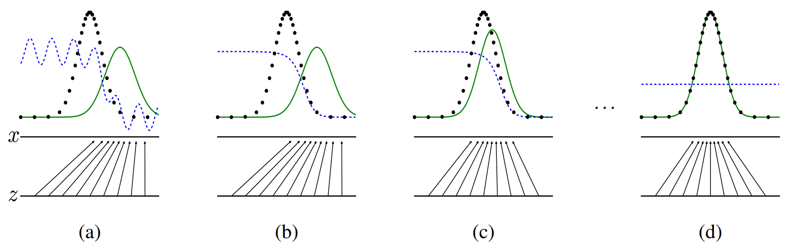
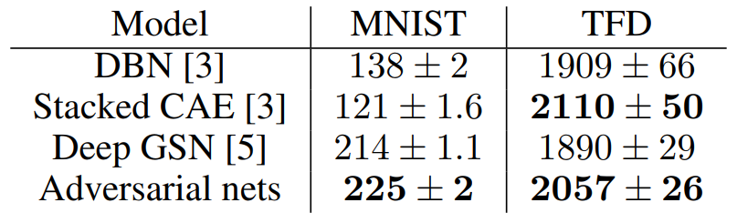
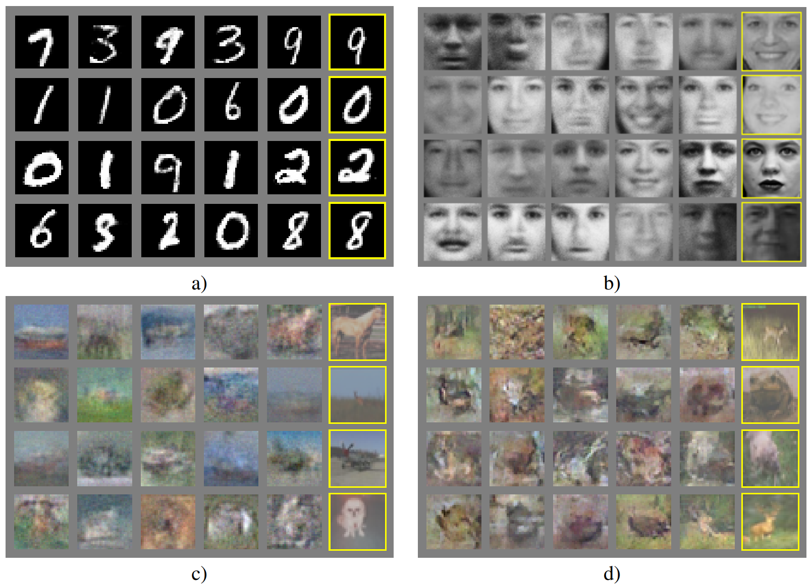
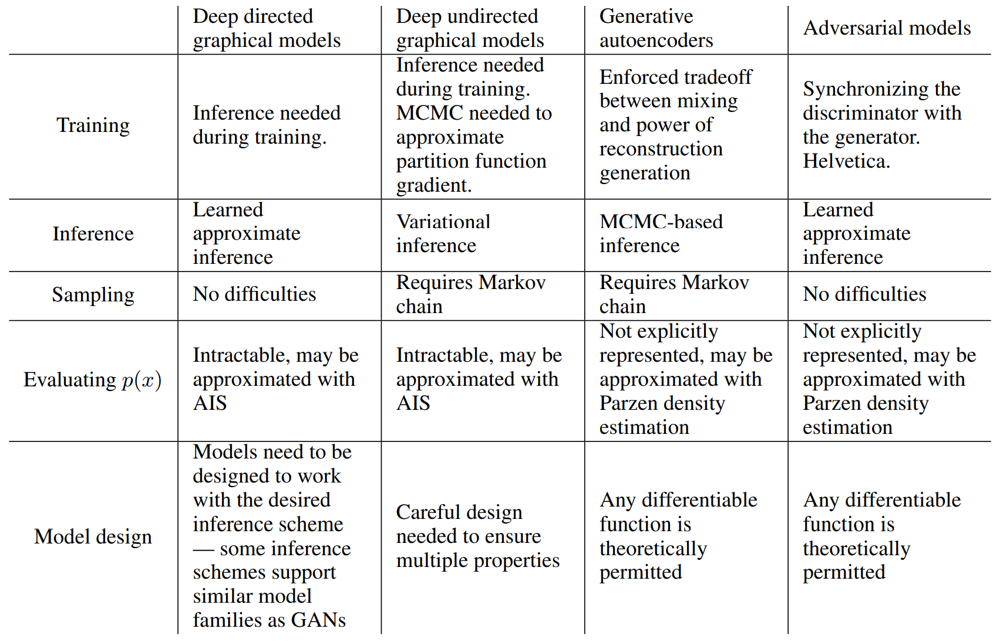

# [Generative Adversarial Nets](https://papers.nips.cc/paper/2014/file/5ca3e9b122f61f8f06494c97b1afccf3-Paper.pdf)

## Abstract

我们提出一种通过对抗性过程来估计生成式模型的新框架，我们同时训练两个模型：一个捕获数据分布的生成式模型 $G$，和一个估计样本是来自训练数据而不是 $G$ 的概率的判别式模型 $D$。 $G$ 的训练过程是最大化 $D$ 犯错的概率。这个框架对应于一个极大极小的双人博弈。在任意函数 $G$ 和 $D$ 的空间中，存在一个唯一解，使得 $G$ 可以恢复训练数据的分布，且 $D$ 处处等于 $\frac{1}{2}$。在 $G$ 和 $D$ 是由多层感知机定义的情况下，整个系统可以使用反向传播进行训练。在整个训练和样本生成过程中，不需要任何的马尔可夫链或者展开近似的推理网络。实验通过对生成的样本的定性和定量评估，证明了该框架的潜力。

## 1 Introduction

深度学习的承诺 (promise) 是发现丰富的、有层次的模型 [2]，这些模型表示人工智能应用中遇到的各种数据的概率分布，比如自然图像、包含语音的音频波形和自然语言语料库中的符号。到目前为止，深度学习中最惊人的成功已经涉及到判别式模型，这些模型通常将一个高维的、富有感官的输入映射到一个类别标签。这些惊人的成功主要是基于反向传播和 dropout 算法，使用具有特别好梯度的分段线性单元。由于在最大似然估计和相关策略中的许多难以近似的棘手的概率计算，以及在生成环境中难以利用分段线性单元的好处，深度生成式模型的影响较小。我们提出一种新的生成式模型估计程序来避开这些困难。

在提出的对抗网络框架中，生成式模型是与一个对手对抗的：一个判别式模型，它学习判定一个样本是来自模型分布还是数据分布。生成式模型可以被认为是一个造假的团队，试图产生假的假币并使用它而不被发现，而判别式模型类似警察，试图发现假币。这场比赛的竞争促使两支队伍改进它们的方法，直到仿冒品与真品难以区分。

**ps：** 最终希望生成式模型能胜过判别式模型，然后能生成与真实分布一致的数据。

这个框架可以为多种模型和优化算法提供特定的训练算法。在本文中，我们探讨了当生成式模型通过将一个随机噪声传递给一个多层感知机来生成样本，并且判别式模型同样是一个多层感知机的特殊情况。我们把这种特殊情况称为对抗网络。在这种情况下，我们可以只使用非常成功的反向传播和 dropout 算法训练两个模型，并只使用前向传播从生成式模型中采样。不需要近似推理或者马尔可夫链。

## 2 Related work

直到最近，大多数关于深度生成式模型都集中在为概率分布函数提供参数规范的模型上。然后可以通过最大化对数似然来训练模型。在这一系列模型中，也许最成功的是深度玻尔兹曼机。这类模型通常具有难以处理的似然函数，因此需要对似然梯度进行无数次近似。这些困难推动了 "生成式机器"——模型不显式地表示似然，但能从期望的分布中生成样本。生成随机网络是生成式机器的一个例子，它可以用精确的反向传播来训练，而不是玻尔兹曼机器所需的无数次近似。这项工作通过消除生成随机网络中使用的马尔可夫链，扩展了生成式机器的思想。

我们的工作通过使用以下的观察将梯度反向传播给生成过程：

$$
\large \lim_{\sigma \rightarrow 0} \nabla_x \mathbb{E}_{\epsilon \sim \mathcal{N}(0,\sigma^2 \boldsymbol{I})} f(\boldsymbol{x} + \epsilon) = \nabla_x f(\boldsymbol{x})
$$

**ps：** 即 $\epsilon \sim \mathcal{N}(0,\sigma^2 \boldsymbol{I})$ ， $\sigma \rightarrow 0$ 时， $f(\boldsymbol{x} + \epsilon)$ 的期望对 $\boldsymbol{x}$ 的偏导数等于 $f(\boldsymbol{x})$ 对 $\boldsymbol{x}$ 的偏导数 $\nabla_x f(\boldsymbol{x})$。

在我们开展这项工作时，我们不知道 Kingma 和 Welling [18] 和 Rezende 等人 [23] 已经研究出了更通用的随机反向传播规则，允许模型通过具有有限方差的高斯分布来反向传播，并反向传播到协方差参数和均值。这些反向传播规则可以让模型学习生成器的条件方差，我们在本工作中把它当作超参数。Kingma 和 Welling 和 Rezende 等人使用随机反向传播训练变分自编码器 (VAEs)。像生成式对抗网络一样，变分自编码器将一个可微分生成器网络与第二个神经网络配对。不像生成式对抗网络，VAE 中的第二个神经网络是一个执行近似推理的识别模型。GANs 需要通过可视单元进行微分，因此不能对离散数据进行建模，而 VAEs 需要通过隐藏单元进行微分，因此不能有离散的潜在变量。存在着其他的 [12, 22] 类似 VAE 的方法，但与我们的方法的关系不太密切。

先前的工作 [29,13] 也采用了使用一个判别式准测来训练一个生成式模型的方法。这些方法使用的准则是深度生成式模型难以处理的。深度模型甚至很难近似这些方法，因为它们涉及到概率的比率，不能用降低概率边界的变分近似来近似。噪声对比估计 (NCE) 涉及通过学习使模型在从固定噪声分布中区分数据有用的权重来训练生成式模型。使用先前训练过的模型作为噪声分布，可以训练一系列质量不断提高的模型。这可以被视为一种非正式的竞争机制，在精神上类似于对抗性网络游戏中使用的正式的竞争。NCE 的关键限制是它的 "鉴别器" 是由噪声分布和模型分布的概率密度的比率来定义的，因此需要评估和反向传播两个密度的能力。

先前的一些工作使用了一般意义上的两个神经网络对抗的概念。最相关的工作是可预测性最小化。在可预测性最小化中，神经网络中的每个隐藏单元都被训练成不同于第二个网络的输出，第二个网络是在给定其他隐藏层神经元的值的情况下预测那个隐藏层神经元的值。本项工作在三个重要方面不同于可预测性最小化：1) 在这项工作中，网络之间的竞争是唯一的训练准则，它本身足以支撑训练网络。可预测性最小化仅是一个正则器，它促进网络中的隐藏单元在完成其他任务时保持统计上的独立性；这不是首要的训练准则。2) 竞争的本质不同。在可预测性最小化中，两个网络的输出进行比较，其中一个网络试图使两个网络的输出相似，而另外一个网络试图使两个网络的输出不同。所讨论的输出是一个标量。在 GANs 中，一个网络产生一个多样的、高维的向量作为另外一个网络的输入，并试图选择一个使另外一个网络不知道如何处理的输入。3) 学习过程的规范不同。可预测性最小化被描述为一个最小化目标函数的优化问题，并学习逼近目标函数的最小值。GANs 是基于极大极小博弈而不是优化问题的，它有一个价值函数，一个 agent 寻求最大化，而另外一个寻求最小化。博弈终止于一个鞍点，这个鞍点对于一方的策略是最小值，对于另一方的策略是最大值。

生成式对抗网络有时会与 "对抗样本" 这个概念混淆。对抗样本是指直接在分类网络的输入上使用基于梯度的优化找到的样本，以便找到与数据相似但被错误分类的样本。这与当前的工作不同，因为对抗样本不是一种用于训练一个生成式模型的机制。相反，对抗样本主要是一种分析工具，以有趣的方式展示神经网络行为，经常自信地以高置信度对两张图像进行不同分类，即使它们之间的差异对于人类观察者来说是难以察觉的。这种对抗样本的存在表明生成式对抗网络的训练可能是低效的，因为它们表明现代判别式模型在不模拟任何人类可感知的类别属性时，就能自信地识别出类别。

## 3 Adversarial nets

对抗建模框架的最简单的应用是当生成器和鉴别器都是多层感知机。为了学到生成器在数据 $x$ 上的分布 $p_g$，我们在输入噪音变量 $p_z(z)$ 上定义了一个先验，然后将到数据空间的映射表示为 $G(z;\theta_g)$，其中 $G$ 是一个由参数为 $\theta_G$ 的多层感知机表示的一个可微分的函数。我们还定义了第二个多层感知机 $D(x;\theta_d)$，输出一个标量。 $D(x)$ 表示 $x$ 是来自数据还是 $p_g$ 的概率。我们训练 $D$ 来最大化将正确的标签分配给训练样本和 $G$ 中的样本的概率。我们同时训练 $G$ 来最小化 $\log(1 - D(G(z)))$。换句话说， $D$ 和 $G$ 用下列价值函数进行双人极大极小博弈：

$$
\large \min_G \max_D V(D,G) = \mathbb{E}_{x \sim p_{data}} \left [ \log(D(\boldsymbol{x})) \right ] + \mathbb{E}_{z \sim p_z(z)} \left [ \log(1 - D(G(z))) \right ]. \tag{1}
$$

在下一节中，我们将提出对抗性网络的理论分析，本质上表明当 $G$ 和 $D$ 被给予足够多的容量时 (即无参数限制)，训练准则足以让生成器恢复出数据的生成分布。参阅图 1 以获得对该方法不那么正式，但更具教学意义的解释。实际上，我们必须使用迭代式的数值方法来实现这样的博弈。在训练中的内循环中优化 $D$ 到最优是很高计算成本的，并且在有限的数据集上会导致过拟合。相反，我们交替进行 $D$ 优化 $k$ 步和 $G$ 优化一步。只要 $G$ 的变化足够满，这会使得 $D$ 保持在它的最优解的附近。程序在算法 1 中正式给出。

实际上，等式 1 可能无法提供足够的梯度让 $G$ 学习得好。学习的早期阶段，当 $G$ 较差时， $D$ 能够以高置信度拒绝来自 $G$ 的样本，因为它们明显与训练数据不同。这种情况下， $\log(1 - D(G(z)))$ 进入饱和。与其训练 $G$ 来最小化 $\log(1 - D(G(z)))$，我们可以训练 $G$ 来最大化 $\log(D(G(z)))$。这个目标函数导致 $G$ 和 $D$ 的最终收敛的点不变，但是可以在模型学习的早期阶段提供更强的梯度。

## 4 Theoretical Results

生成器 $G$ 隐式地定义了一个概率分布 $p_g$ 作为当 $z \sim p_z$ 时由 $G(z)$ 得到的样本的分布。因此，如果给定足够的容量和训练时间，我们希望算法 1 能够收敛到 $p_{data}$ 的一个好的估计量。本节的结果是在一个非参数的设置下完成的，例如，我们通过研究概率密度函数空间中的收敛性来表示具有无限容量的模型。

我们将在 4.1 节中展示极大极小博弈对于 $p_g = p_{data}$ 有一个全局最优解。我们将在 4.2 节中展示用算法 1 优化等式 1，从而获得想要的结果。

**图 1：** 通过同时更新鉴别分布 (D，蓝色虚线) 来训练生成式对抗网络，使 $D$ 区分样本是来自数据的生成分布 (黑色虚线) $p_x$，还是来自生成式分布 $p_g$ (绿色实线)。下面的水平线是 $z$ 采样的域，在本例中是均匀分布。上面的水平线        是 $x$ 的域的一部分。向上的箭头表示映射 $\boldsymbol{x} = G(z)$ 是如何对变换后的样本施加非均匀分布 $p_g$ 的。(a) 考虑一个接近收敛的对抗性对： $p_g$ 与 $p_{data}$ 相似，而 $D$ 是一个部分准确的分类器。(b) 在算法的内循环中， $D$ 被训练来从数据中区分 (生成) 样本，收敛于 $D^*(\boldsymbol{x}) = \frac{p_{data}(x)}{p_{data}(x) + p_g(x)}$。(c) 更新 $G$ 之后， $D$ 的梯度引导 $G(z)$ 流向更有可能被分类为数据的区域。(d) 经过多个 steps 训练后，如果 $G$ 和 $D$ 有足够的容量，它们会达到一个双方都无法继续提升的点，因为 $p_g = p_{data}$ 。鉴别器无法区分两个分布，即 $D(\boldsymbol{x}) = \frac{1}{2}$。

------

**算法 1** 生成式对抗网络的小批量梯度随机下降训练。应用于判别器的 steps $k$ 是一个超参数。在我们实验中我们使用 $k = 1$，最小的开销。

------

​    **for** 训练迭代次数 **do**

​        **for** k steps **do**

​            - 从噪声先验 $p_g(\boldsymbol{z})$ 中采样 m 个噪声样本 $\left \{ z^{(1)} , \dots, z^{(m)} \right \}$

​            - 从数据生成分布 $p_{data}(\boldsymbol{x})$ 中采样 m 个样本 $\left \{ x^{(1)} , \dots, x^{(m)} \right \}$

​            - 通过 ascending (上升?) 它的随机梯度来更新鉴别器：

$$
\large \nabla_{\theta_d} \frac{1}{m} \sum_{i = 1}^m \left[ \log D \left( \boldsymbol{x}^{(i)} \right) + \log \left( 1 - D \left( G \left( \boldsymbol{z}^{(i)} \right) \right) \right) \right]
$$

​        **end for**

​        - 从噪声先验 $p_g(z)$ 中采样 m 个噪声样本 $\left \{ z^{(1)} , \dots, z^{(m)} \right \}$

​        - 通过 descending (下降?) 它的随机梯度来更新生成器：

$$
\large \nabla_{\theta_d} \frac{1}{m} \sum_{i = 1}^m  \log \left( 1 - D \left( G \left( \boldsymbol{z}^{(i)} \right) \right) \right)
$$

​    **end for**

​    基于梯度的更新可以使用任何标准的基于梯度的学习规则。在我们的实验中我们使用了 momentum。

------

### 4.1 Global Optimality of $p_g = p_{data}$

我们首先考虑对于任意给定生成器 G 最优的鉴别器 D。

**命题 1.** 对于某一固定的 G，最优的鉴别器 D 是：

$$
\large D_{G}^*(\boldsymbol{x}) =\frac{p_{data}(\boldsymbol{x})}{p_{data}(\boldsymbol{x}) + p_g(\boldsymbol{x})} \tag{2}
$$

证明. 对于任意给定的生成器 G，D 的训练准则是最大化 $V(G,D)$

$$
\large 
\begin{aligned}
V(G,D) &= \int_x p_{data}(\boldsymbol{x}) \log (D(\boldsymbol{x}))\mathrm{d}x + \int_x p_z(\boldsymbol{z}) \log (1 - D(g(\boldsymbol{z}))) \mathrm{d}z \\
 &= \int_x p_{data}(\boldsymbol{x}) \log(D(\boldsymbol{x})) + p_g(\boldsymbol{x}) \log (1 - D(\boldsymbol{x})) \mathrm{d}x 
\end{aligned}
\tag{3}
$$

对于任意 $(a,b) \in \mathbb{R}^2 \setminus \{ 0,0 \}$，函数 $y \rightarrow a \log(y) + b \log(1 - y)$ 在 [0,1] 中点 $\frac{a}{a + b}$ 取得最大值。鉴别器不需要在 $Supp(p_{data}) \bigcup Supp(p_g)$ 之外被定义，证毕。( $Supp(p_{data})$ 和 $Supp(p_g)$ 分别问 $p_{data}$ 和 $p_g$ 的补集。)

**ps：** 利用极值定理，求解函数的导数为 0，可以求得函数的极大值 $\frac{a}{a+b}$，然后代入 $a = p_{data}(\boldsymbol{x})$， $b = p_g(\boldsymbol{x})$。

注意，D 的训练目标可以被解释为最大化估计条件概率 $P(Y = y|\boldsymbol{x})$ 的对数似然，其中 $Y$ 表示 $\boldsymbol{x}$ 是来自数据分布 $p_{data}$ ( 即 $y = 1$ ) 还是来自 $p_g$ ( 即 $y = 0$ )。等式 (1) 中的极大极小博弈现在可以重新表述为：

$$
\large
\begin{aligned}
C(G) &= \max_{D} V(G,D) \\
&= \mathbb{E}_{x \sim p_{data}} [ \log D^*_G(\boldsymbol{x}) ] + \mathbb{E}_{z \sim p_z} [ \log(1 - D^*_G(G(\boldsymbol{z})))] \\
&= \mathbb{E}_{x \sim p_{data}} [ \log D^*_G(\boldsymbol{x}) ] + \mathbb{E}_{x \sim p_g} [ \log(1 - D^*_G(\boldsymbol{x}))] \\
&= \mathbb{E}_{x \sim p_{data}} \left [ \log \frac{p_{data}(\boldsymbol{x})}{p_{data}(\boldsymbol{x}) + p_{g}(\boldsymbol{x})} \right ] + \mathbb{E}_{x \sim p_{g}} \left [ \log \frac{p_{g}(\boldsymbol{x})}{p_{data}(\boldsymbol{x}) + p_{g}(\boldsymbol{x})} \right ]
\end{aligned} \tag{4}
$$

**定理 1.** 当且仅当 $p_g = p_{data}$，(virtual) 训练准则 $C(G)$ 才取得全局最小值 $C(G) = - \log 4$ 。

**证明.** 对于 $p_g = p_{data}$， $D^*_G(\boldsymbol{x}) = \frac{1}{2}$ (考虑等式 (2))。因此，代入 $D^*_G(\boldsymbol{x}) = \frac{1}{2}$ 到等式 (4)，可以得出 $C(G) = \log \frac{1}{2} + \log \frac{1}{2} = -\log 4$ 。该值就是在 $p_g = p_{data}$ 时， $C(G)$ 所能取得的最优值，观察到
$$
\large \mathbb{E}_{\boldsymbol{x} \sim p_{data}}[\log \frac{1}{2}] + \mathbb{E}_{\boldsymbol{x} \sim p_{g}}[\log \frac{1}{2}] = \log \frac{1}{4} = - \log 4
$$

通过从 $C(G) = V(D_G^*, G)$ 减去这个表达式，我们可以得到：
$$
\large C(G) = -\log(4) + KL \left (p_{data} \bigg\Vert \frac{p_{data} + p_g}{2} \right) + KL \left( p_g \bigg\Vert \frac{p_{data} + p_g}{2} \right) \tag{5}
$$
其中 KL 是 Kullback–Leibler divergence (KL 散度或者相对熵)。我们在前面的表达式中认识到模型的分布和数据生成过程之间的 Jensen-Shannon divergence (JS 散度)：
$$
\large C(G) = -\log(4) + 2 \cdot JSD(p_{data} \Vert p_g) \tag{6}
$$
由于两个分布之间的 JS 散度总是非负的，且如果它们相等，则为 0，我们已经证明了 $C^* = - \log(4)$ 是 $C(G)$ 的全局最小值，并且唯一解是 $p_g = p_{data}$ ，即生成模型完美地复制了数据分布。

## 4.2 Convergence of Algorithme 1

**命题 2.** 如果 G 和 D 有足够的容量，在算法 1 的每一步，鉴别器在给定 G 的情况下，允许达到其最佳值，并且更新 $p_g$ 以改进准则
$$
\large \mathbb{E}_{x \sim p_{data}} [ \log D^*_G(\boldsymbol{x}) ] + \mathbb{E}_{x \sim p_g} [ \log(1 - D^*_G(\boldsymbol{x}))]
$$
然后 $p_g$ 收敛到 $p_{data}$ 。

**证明.** 考虑 $V(G,D) = U(p_g, D)$ 作为上述准则中 $p_g$ 的一个函数。注意到，在 $p_g$ 中 $U(p_g, D)$ 是凸的。凸函数上确界的子导数包括该函数在其最大值处的导数。换句话说，如果 $\large f(x)  = \sup_{\alpha \in \mathcal{A}} f_{\alpha}(x)$ 并且对于每个 $\alpha$， $f_{\alpha}(x)$ 在 $x$ 中是凸的，那么如果 $\large \beta = \arg \sup_{\alpha \in \mathcal{A}} f_{\alpha}(x)$ 则 $\large \partial  \beta(x) \in \partial f$ 。这相当于在给定对应 G 的情况下，在最优 D 处计算用于更新 $p_g$ 的梯度下降。 $\sup_D U(p_g, D)$ 在 $p_g$ 中是凸的，具有唯一的全局最优解，如定理 1 中所证明的，因此在 $p_g$ 更新足够小的情况下， $p_g$ 收敛到 $p_x$，从而得出证明。

实际上，对抗网络通过函数 $G(z;\theta_g)$ 表达一系列受限的 $p_g$ 的分布，并且我们优化 $\theta_g$ 而不是 $p_g$ 本身，因此证明不适用。然而，多层感知机在实际中的优异性能表明，尽管缺乏理论保证，但多层感知机是一种合适的模型来使用。

**表 1：** 基于 Parzen 窗口的对数似然评估。MNIST 上报告的数字是测试集上样本的平均对数似然，并计算了各个样本的平均标准差。在 TFD，我们在计算了跨越数据集每一折 (flods) 的标准差，并利用每折验证集选择不通的 $\sigma$ 。在 TFD， $\sigma$ 在每一折上交叉验证，并计算每一折的平均对数似然。对于 MNIST，我们将数据集的实值 (而不是二进制) 的版本与其他模型进行比较。

# 5 Experiments

我们在一系列数据集上训练了对抗网络，包括 MNIST、the Toronto Face Database (TFD) 和 CIFAR-10。生成式网络混合使用 ReLU 激活和 sigmoid 激活，而判别器使用 maxout 激活。Dropout 被用于训练鉴别器网络。虽然我们的理论框架允许在生成器的中间层使用 dropout 和其他噪声，但我们仅将噪声用作生成器网络最底层的输入。

我们通过将一个 Gaussian Parzen 窗口拟合到 G 生成的样本来评估 $p_g$ 分布下的测试集数据的概率，并报告该分布下的对数似然。通过在验证集上交叉验证，获得高斯函数的 $\sigma$ 参数。这个步骤由 Breuleux 等人引入，并用于各种生成模型，这些模型的确切的似然是不容易处理的。结果如表 1 所示。这种估计似然的方法具有较高的方差，并且在高位空间中表现不佳。但它是我们所知的最佳方法。生成式模型的进展，可采样但不可估计似然，直接推动了对如何评估此类模型的进一步研究。在图 2 和图 3 中，我们展示了从训练后的模型中获取的样本。虽然我们没有声称这些样本比现有方法生成的样本更好，但我们认为这些样本至少与文献中更好的生成式模型具有竞争力，并突出了对抗性框架的潜力。

**图 2：** 来自模型中的样本的可视化。最右边一列展示了最相近的训练样本，以证明模型没有记忆训练集。样本是随机抽取的，不是精细挑选的。与大多数其他深度生成式模型的可视化不同，这些图像展示了来自模型分布的真实样本，而不是在给定条件均值下隐藏层的样本。此外，这些样本是不相关的，因为采样过程不依赖马尔可夫链混合。a) MNIST b) TFD c) CIFAR-10 (全连接模型) d) CIFAR-10 (卷积的鉴别器和 "转置卷积"的生成器)

**图 3：** 通过在整个模型的 $z$ 空间的坐标直接线性插值得到的数字。

# 6 Advantages and disadvantages

与以前的建模框架相比，这个新框架有其优点和缺点。缺点主要是 $p_g(\boldsymbol{x})$ 没有明确的表示，并且在训练期间 D 必须与 G 很好地同步 (特别是，在没有更新 D 的情况下 G 不能训练太多，来避免 “the Helvetica scenario” (模式崩塌)，即 G 将太多的 $\bold{z}$ 值崩塌为相同的 $\bold{x}$，以具有足够的多样性来建模 $p_{data}$ )，就像玻尔兹曼机的负链一样，必须保持学习步骤之间的更新。其优点是不需要马尔可夫链，只使用反向传播来获得梯度，在学习过程中不需要推理，并且可以将多种函数合并到模型中。表 2 总结了生成式对抗网络与其他生成式建模方法的比较。

上述优点主要是计算上的。对抗模型还可以从生成器网络中获得一些统计优势，生成器不直接使用数据样本进行更新，而只使用流经判别器的梯度进行更新。这意味着输入组件不会直接复制到生成器的参数中。对抗网络的另外一个优点是，它们可以表示非常尖锐甚至退化的分布，而基于马尔可夫链的方法要求分布有点模糊，以便链能够在模式之间混合。

**表 2：** 生成式建模中的挑战：a summary of the difficulties encountered by different approaches to deep generative modeling for each of the major operations involving a model.

# 7 Conclusions and future work

这个框架可以进行许多直接的扩展：

1. 将 $\boldsymbol{c}$ 同时作为 G 和 D 的输入，可以得到条件生成式模型 $p(\boldsymbol{x} | \boldsymbol{c})$ 。
2. 通过训练辅助网络在给定 $\boldsymbol{x}$ 的情况下预测 $z$ ，可以学习近似推理。这与通过 wake-sleep 算法训练的推理网络类似，但其优点是在生成器网络训练完毕后，推理网络可以被训练为固定的生成器。
3. 可以通过训练一组共享参数的条件模型来近似建模所有的条件 $\large p(\boldsymbol{x}_S | \boldsymbol{x}_{S\mkern-10mu/} )$ ，其中 $S$ 是 $\boldsymbol{x}$ 索引的子集。本质上，可以使用对抗网络来实现确定性 MP-DBM 的一个随机扩展。
4. 半监督学习：当标记数据有限时，来自鉴别器或推理网络的特征可以提高分类器的性能。
5. 效率提高：通过设计更好的方法来协调 G 和 D，或者在训练过程中确定更好的分布来采样 $\bold{z}$，可以大大加速训练。

本文证明了对抗建模框架的可行性，表明这些研究方向可以被证明是有用的。

# 参考

- https://rdc.hundsun.com/portal/article/920.html
- https://blog.csdn.net/weixin_41109655/article/details/119906048
