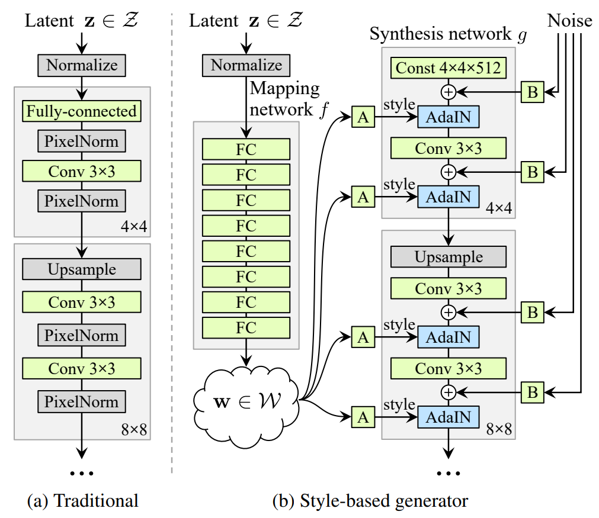
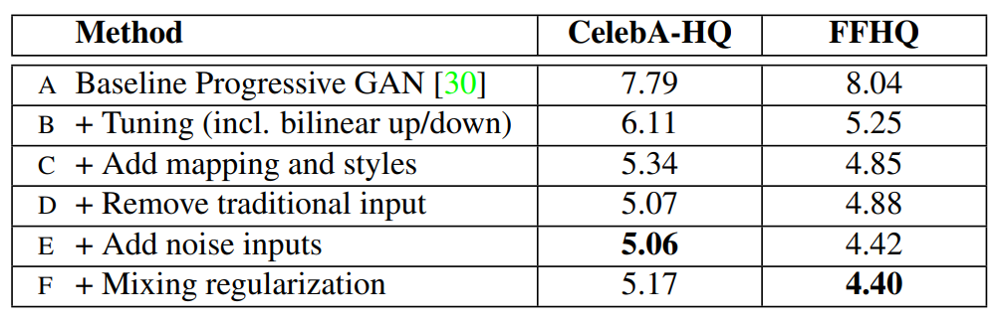
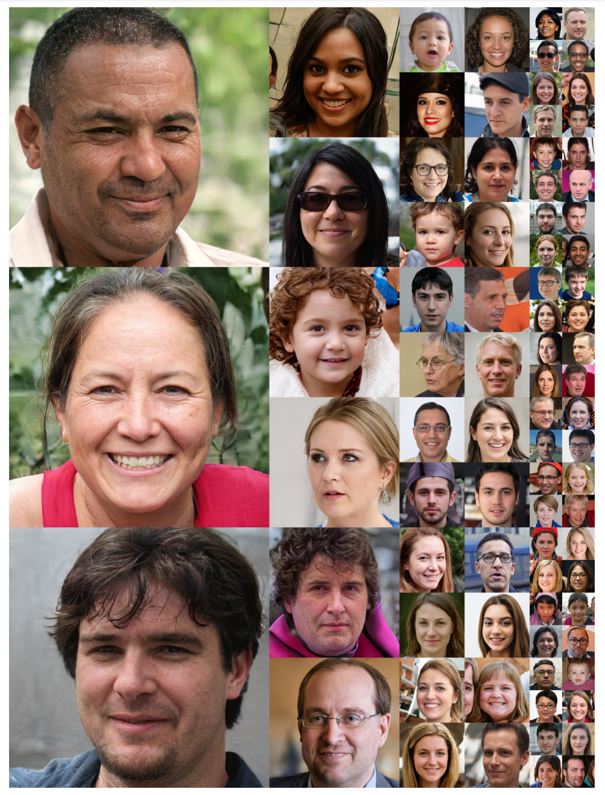
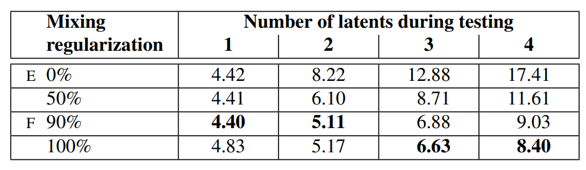

# [A Style-Based Generator Architecture for Generative Adversarial Networks](https://arxiv.org/pdf/1812.04948.pdf)

## Abstract

我们借鉴风格迁移文献，为生成对抗网络提出另外一种可供选择的生成器架构。新的架构导致了一种对于高级属性自学习的、无监督的分离 (例如在训练人脸时的姿态和身份) 和生成的图像中的随机变化 (如雀斑、头发)，它能直观地、按尺度地控制合成。新的生成器在传统的分布质量指标上提高了 state-of-the-art，得到明显更好的插值特性，并更好地解开了变化的潜在因素。为了量化插值的质量和解纠缠度，我们提出了两种新的、自动化的方法，适用于任意的生成器架构。最后，我们引入了一个新的、高度多样化和高质量的人脸数据集。

**ps：** 借鉴风格迁移，将图片的高级特征分离，直接控制生成器的合成过程。

## 1. Introduction

 生成方法，特别是生成对抗网络 (GAN) 产生的图像的分辨率和质量，最近得到了快速的提升。然而，生成器仍然像黑匣子一样运行，尽管最近有一些努力，但对图像合成过程的各个方面，如随机特征的起源等，仍然缺乏了解。对潜在空间的性质也是知之甚少，通常被证明的潜在空间插值没有提供定量的方法来比较不同的生成器。

受风格迁移文献的启发，我们以一种公开控制图像合成过程的新方法重新设计了生成器的架构。我们的生成器从一个学习过的常量输入开始，并在每个卷积层基于潜在编码调整图像 "风格"，从而直接控制不同尺度下的图像特征的强度。结合直接注入到网络中的噪声，这种架构更改导致了高级属性的自动的、无监督的分离 (如姿态、身份)。我们没有以任何方式修改鉴别器和损失函数，因此我们的工作与正在进行的关于 GAN 损失函数、正则化和超参数的讨论是正交的。

**ps：** 所谓正交就是垂直，就是说和损失函数、正则化、超参数没关系，即这些不是本论文的讨论点。

我们的生成器将输入的潜在编码嵌入 (**类似映射**) 到一个中间的潜在空间，这对变化的因素如何在网络中表示有着深远的影响。输入的潜在空间必须遵循训练数据的概率密度 ，我们认为这导致某种程度的不可避免的纠缠。我们的中间潜在空间不受这种限制，因此可以被解开纠缠。由于以前的估计潜在空间解纠缠度的方法不能直接地适用于我们的情况，我们提出了两种新的自动的方法——感知路径长度和线性可分性，来量化生成器的这些方面。使用这些指标，我们表明，与传统的生成器架构相比，我们的生成器容许对变化的不同因素有更线性的、更少纠缠的表示。

最后，我们提出了一个新的人脸数据集 (Flickr-Faces-HQ, FFHQ)，它提供了比现有的高分辨率数据集 (附录 A) 更高质的质量和覆盖更加广泛的变化。我们已经公开了这个数据集，以及我们的源码和预训练模型。所附的视频可以在同一链接下找到。

**图 1：** 传统的生成器只通过输入层输入潜在编码，而我们首先将输入映射到一个中间潜在空间 $\mathcal{W}$，它之后在每个卷积层通过自适应示例规范化 (AdaIN) 控制生成器。每次卷积之后添加高斯噪声，然后评估非线性。这里 "A" 代表一个学习过的仿射变换，"B"  将学习后的每通道缩放因子应用于噪声输入。映射网络 $f$ 由 8 层 (FC) 组成，合成网络 g 由 18 层组成，每个分辨率 ($4^2 - 1024^2$) 两层。最后一层的输出通过一个单独的 $1 \times 1$ 的卷积转换到 RGB，类似于 karras 等人。与传统的生成器的 23.1M 相比，我们的生成器共有 26.2M 可训练的参数。

**表 1：** 各种生成器设计的 Frechet inception distance (FID) (越低越好)。在本文中，我们使用从训练集中随机抽取的 50,000 图像计算 FIDs，并报告在训练过程中遇到的最低的距离。

## 2. Style-based generator

传统上，潜在编码是通过输入层即前馈网络 (图 1a) 的第一层，提供给生成器。我们通过完全地省略输入层，并从一个学习过的常量开始代替这种设计 (图 1b，右)。给定一个在输入空间 $\mathcal{Z}$ 的潜在编码 $\bold{z}$，一个非线性的映射网络：$f:\mathcal{Z} \rightarrow \mathcal{W}$ 首先生成 $\bold{w} \in \mathcal{W}$ (图 1b，左)。为了简单起见，我们将两个空间的维度设为 512，并用一个 8 层的 MLP 实现映射 $f$，我们将在 4.1 节分析这个决策。学习到的仿射变换将 $\bold{w}$ 定制化为样式 $\bold{y} = (\bold{y_s}, \bold{y_b})$，它们在合成网络 $g$ 的每个卷积层之后用于控制自适应实例规范化 (AdaIN) 运算。AdaIN 运算定义如下：
$$
{\rm AdaIN}(\bold{x}_i, \bold{y}) = \bold{y}_{s,i} \frac{\bold{x}_i - \mu(\bold{x}_i)}{\sigma(\bold{x}_i)} + \bold{y}_{b,i} \tag{1}
$$
其中每个特征图 $\bold{x}_i$ 分别归一化，然后使用样式 $\bold{y}$ 中对应的标量成分进行缩放和偏置。因此 $\bold{y}$ 的维度是该层特征图的数量的两倍。

将我们的方法与风格迁移进行比较，我们从向量 $\bold{w}$ 而不是示例图像来计算空间不变的风格 $\bold{y}$。我们选择对 $\bold{y}$ 重新使用单词 "风格"，因为类似的网络架构已经用于前馈风格迁移，无监督的图像到图像转换和域混合。与更一般的特征变换相比，AdaIN 由于它的效率和紧凑的表示而特别适合我们的目的。

最后，我们通过引入显示的噪声输入，为我们的生成器提供了一种生成随机细节的直接方法。这些是由不相关的高斯噪声组成的单通道图像，我们给合成网络的每一层提供一个专用的噪声图像。使用学习到的 per-feature 的尺度因子将噪声图像广播到所有的特征图中，然后将其添加到对应的卷积的输出，如图 1b 所示。添加噪声输入的影响在 3.2 节和 3.3 节中讨论。

### 2.1. Quality of generated images

在研究我们的生成器的特性之前，我们通过实验证明重新设计不会影响图像质量，而实际上大大提高了它。表 1 给出了在 CELEBA-HQ 和我们的 FFHQ 数据 (附录 A) 集上各种生成器架构的 Frechet inception distances (FID)。其他数据集的结果在附录 E 中给出。我们的基线配置 (A) 是 Karras 等人的 Progressive GAN [30]，我们从那里继承了网络和所有的超参数，除非另有说明。我们首先通过使用双线性上/下采样运算、更长的训练和调优的超参数来切换到改进的基线 (B)。训练设置和超参数的详细描述包含在附录 C。然后我们通过添加映射网络和 AdaIN 运算进一步改进得到新的基线 (C)，并令人惊讶地发现网络不再受益于将潜在编码输入给第一个卷积层。因此我们通过移除传统的输入层，并从一个学习过的 $4 \times 4 \times 512$  的常量张量 (D) 开始图像合成来简化网络。我们发现这非常引人注目，合成网络能够产生有意义的结果，尽管它只通过控制 AdaIN 运算的样式接收输入。

最终，我们引入噪声输入 (E)，进一步改善了结果，以及新的混合正则化 (mixing regularization) (F)，它可以去关联相邻样式，并能对生成的图像进行更细粒度的控制 (3.1 节)。

我们使用两种不同的损失函数来评估我们的方法：对于 CELEBA-HQ，我们依赖 WGAN-GP [24]，而 FFHQ，对于配置 A 使用 WGAN-GPU，对于配置 B -F 使用 R1 正则化的非饱和损失 [21]。我们发现这些选择给出最好的结果。我们的贡献不修改损失函数。

我们观察到基于样式的生成器 (E) 比传统的生成器 (B) 显著地提升了 FIDs，大约有 20%，证实了并行工作中进行的大规模 ImageNet 测量。图 2 展示了使用我们的生成器从 FFHQ 数据集生成的一组未经挑选的新图像。通过 FIDs 确认，平均质量很高，甚至像眼镜和帽子这样的配件也能成功地合成。对于这张图像，我们使用所谓的截断技巧来避免从 $\mathcal{W}$ 的极端区域采样，附录 B 详细说明了如何能够在 $\mathcal{W}$ 而不是 $\mathcal{Z}$ 中执行这种技巧。注意到，我们的生成器允许只对低分辨率选择性地截断，因此高分辨率的细节不受影响。

本文中所有的 FIDs 都是在没有截断技巧的情况下计算的，并且我们只是在图 2 和视频中为了演示目的而使用它。所有的图像均以 $1024^2$ 分辨率生成。

**图 2：** 由我们的基于样式的生成器 (配置 F) 用 FFHQ 数据集生成的未经挑选的图像。这里我们对于分辨率 $4^2-32^2$ 使用了截断技巧的一个 $\psi = 0.7$ 的变体。查看附带的视频了解更多的结果。

### 2.2. Prior art

许多关于 GAN 架构的工作集中于通过使用多个鉴别器、多分辨率鉴别器或者自注意力来改进鉴别器。生成器方面的工作主要集中于输入空间中的精确分布，或者通过高斯分布、聚类来塑造潜在空间，或鼓励凸性。

最近的条件生成器通过一个单独的嵌入网络将类标识输入给生成器中的大量的层，而潜码仍然通过输入层提供。一些作者考虑将潜码的部分提供给多个生成器层。在并行的工作中，Chen 等人的 "self modulate" 生成器使用 AdaINs，与我们的工作相似，但是没有考虑中间潜在控制或者噪声输入。

## 3. Properties of the style-based generator

我们的生成器架构使得通过对样式的特定比例的修改来控制图像合成成为可能。我们可以将映射网络和仿射变换看作一种从学过的分布中为每种风格绘制样本的方法，而将合成网络看作一种基于一堆样式生成新图像的方法。每个样式的效果在网络中都是局部化的，也就是说，修改样式的一个特定子集可能只会影响图像的某些方面。

**ps：** 映射网络相当于生成一堆样式，合成网络通过一堆样式来生成图像，每个样式之间关联不大，不会改变一处样式就改变整张图像

为了了解这种局部化的原因，让我们考虑 AdaIN 运算 (等式 1) 是如何首先将每个通道归一化为零均值和单位方差，然后根据样式应用尺度和偏差的。新的每通道统计信息，由样式决定，修改了特征对于后续卷积操作的相对重要性，但是由于归一化，它们不依赖于原始的统计信息。因此在被下一个 AdaIN 运算覆盖之前，每个样式仅控制只控制一个卷积。

**ps：** 得到每个通道的 "单位分布"，然后乘上样式的方差，加上均值。一个样式修改一个卷积

### 3.1. Style mixing

为了进一步鼓励样式局部化，我们采用混合正则化，在训练期间使用两个随机的潜在编码而不是一个来生成给定百分比的图像。当生成这样的一幅图像时，我们简单地从一个潜在编码切换到另外一个在合成网络中随机选择的一点——我们称之为样式混合操作。具体来说，我们通过映射网络运行两个潜在编码 $\bold{z}_1,\bold{z}_2$，让对应的 $\bold{w}_1,\bold{w}_2$ 控制样式，使 $\bold{w}_1$ 应用在交叉点之前，而 $\bold{w}_2$ 应用在交叉的之后。这种正则化技巧防止网络假设相邻的样式是相关的。

表 2 展示了在训练期间启用混合正则化如何大大地提升局部化，这可以通过在测试时混合多个潜码的情况下改进的 FIDs 来说明。图 3 给出了通过在不同尺度混合两种潜在编码合成的图像示例。我们可以看到样式的每个子集控制着图像的有意义的高级属性。

**图 3：** 根据各自的潜在编码 (源 A 和 B) 生成的两组图像；其余的图像是通过从源 B 复制指定的样式子集，并从源 A 获取剩余的来生成的。复制对应于粗糙的空间分辨率 ($4^2-8^2$) 带来高层次的方面，例如来自源 B 的姿态、整体发型、脸型和眼镜，而所有的颜色 (眼睛、头发、光线) 和更精细脸部特征都类似于源 A。如果我们 B 复制中间分辨率 ($16^2-32^2$) 复制样式，我们从 B 继承了更小尺度的脸部特征、头发样式、眼睛开/闭，而从 A 保留了姿势、整体脸型和眼镜。最后，从 B 复制精细的样式 ($64^2-1024^2$) 主要带来配色方案和微观结构。

**表 2：** 对于不同百分比的训练样本启用混合正则化训练的网络在 FFHQ 的 FIDs。这里我们通过随机 1 ... 4 潜码和它们直接的交叉点来对训练后的网络进行压力测试。混合正则化显著地提高了对于这些不好的操作的容忍性。标签 E 和 F 对应于表 1 中的配置。

### 3.2. Stochastic variation

## 5. Conclusion

基于我们的结果和 Chen 等人的并行化工作，[6]，很明显传统的 GAN 生成器架构在各个方面都不如 style-based 设计。根据已制定的质量来说这是真的，我们进一步相信，我们对于高级属性和随机效应的分离，以及中间潜在空间的线性关系的研究，将在提高 GAN 合成的理解和可控性方面取得成果。

我们注意到，我们的平均路径长度指标可以很容易地用作训练期间的正则化，也许线性可分性指标的一些变种也可以用作正则化。总的来说，我们希望训练期间直接塑造中间的潜在空间的方法能为未来的工作提高有趣的途径。

## 6. Acknowledgements

## A. The FFHQ dataset

