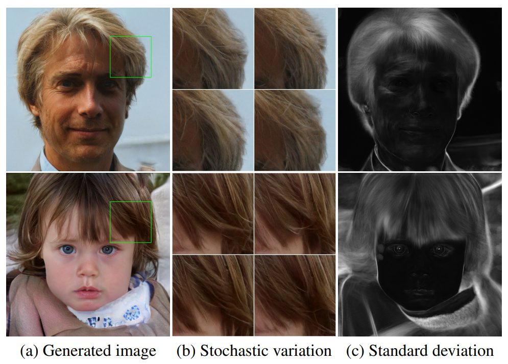

# [A Style-Based Generator Architecture for Generative Adversarial Networks](https://arxiv.org/pdf/1812.04948.pdf)

## Abstract

我们借鉴风格迁移文献，为生成对抗网络提出另外一种可供选择的生成器架构。新的架构导致了一种对于高级属性自学习的、无监督的分离 (例如在训练人脸时的姿态和身份) 和生成的图像中的随机变化 (如雀斑、头发)，它能直观地、按尺度地控制合成。新的生成器在传统的分布质量指标上提高了 state-of-the-art，得到明显更好的插值特性，并更好地解开了变化的潜在因素。为了量化插值的质量和解纠缠度，我们提出了两种新的、自动化的方法，适用于任意的生成器架构。最后，我们引入了一个新的、高度多样化和高质量的人脸数据集。

**ps：** 借鉴风格迁移，将图片的高级特征分离，直接控制生成器的合成过程。

## 1. Introduction

 生成方法，特别是生成对抗网络 (GAN) 产生的图像的分辨率和质量，最近得到了快速的提升。然而，生成器仍然像黑匣子一样运行，尽管最近有一些努力，但对图像合成过程的各个方面，如随机特征的起源等，仍然缺乏了解。对潜在空间的性质也是知之甚少，通常用于演示的潜在空间插值没有提供定量的方法来比较不同的生成器。

受风格迁移文献的启发，我们以一种公开控制图像合成过程的新方法重新设计了生成器的架构。我们的生成器从一个学习过的常量输入开始，并在每个卷积层基于潜在编码调整图像 "风格"，从而直接控制不同尺度下的图像特征的强度。结合直接注入到网络中的噪声，这种架构更改导致了高级属性的自动的、无监督的分离 (如姿态、身份)。我们没有以任何方式修改鉴别器和损失函数，因此我们的工作与正在进行的关于 GAN 损失函数、正则化和超参数的讨论是正交的。

**ps：** 所谓正交就是垂直，就是说和损失函数、正则化、超参数没关系，即这些不是本论文的讨论点。

我们的生成器将输入的潜在编码嵌入 (**类似映射**) 到一个中间的潜在空间，这对变化的因素如何在网络中表示有着深远的影响。输入的潜在空间必须遵循训练数据的概率密度 ，我们认为这导致某种程度的不可避免的纠缠。我们的中间潜在空间不受这种限制，因此可以解开纠缠。由于以前的估计潜在空间解纠缠度的方法不能直接地适用于我们的情况，我们提出了两种新的自动的方法——感知路径长度和线性可分性，来量化生成器的这些方面。使用这些指标，我们表明，与传统的生成器架构相比，我们的生成器容许对变化的不同因素有更线性的、更少纠缠的表示。

最后，我们提出了一个新的人脸数据集 (Flickr-Faces-HQ, FFHQ)，它提供了比现有的高分辨率数据集 (附录 A) 更高质的质量和覆盖更加广泛的变化。我们已经公开了这个数据集，以及我们的源码和预训练模型。所附的视频可以在同一链接下找到。

**图 1：** 传统的生成器只通过输入层输入潜在编码，而我们首先将输入映射到一个中间潜在空间 $\mathcal{W}$，它之后在每个卷积层通过自适应示例规范化 (AdaIN) 控制生成器。每次卷积之后添加高斯噪声，然后评估非线性。这里 "A" 代表一个学习过的仿射变换，"B"  将学习后的每通道缩放因子应用于噪声输入。映射网络 $f$ 由 8 层 (FC) 组成，合成网络 g 由 18 层组成，每个分辨率 ($4^2 - 1024^2$) 两层。最后一层的输出通过一个单独的 $1 \times 1$ 的卷积转换到 RGB，类似于 karras 等人。与传统的生成器的 23.1M 相比，我们的生成器共有 26.2M 可训练的参数。

**表 1：** 各种生成器设计的 Frechet inception distance (FID) (越低越好)。在本文中，我们使用从训练集中随机抽取的 50,000 图像计算 FIDs，并报告在训练过程中遇到的最低的距离。

## 2. Style-based generator

传统上，潜在编码是通过输入层即前馈网络 (图 1a) 的第一层，提供给生成器。我们通过完全地省略输入层，并从一个学习过的常量开始代替这种设计 (图 1b，右)。给定一个在输入空间 $\mathcal{Z}$ 的潜在编码 $\bold{z}$，一个非线性的映射网络：$f:\mathcal{Z} \rightarrow \mathcal{W}$ 首先生成 $\bold{w} \in \mathcal{W}$ (图 1b，左)。为了简单起见，我们将两个空间的维度设为 512，并用一个 8 层的 MLP 实现映射 $f$，我们将在 4.1 节分析这个决策。学习到的仿射变换将 $\bold{w}$ 定制化为样式 $\bold{y} = (\bold{y_s}, \bold{y_b})$，它们在合成网络 $g$ 的每个卷积层之后用于控制自适应实例规范化 (AdaIN) 运算。AdaIN 运算定义如下：
$$
{\rm AdaIN}(\bold{x}_i, \bold{y}) = \bold{y}_{s,i} \frac{\bold{x}_i - \mu(\bold{x}_i)}{\sigma(\bold{x}_i)} + \bold{y}_{b,i} \tag{1}
$$
其中每个特征图 $\bold{x}_i$ 分别归一化，然后使用样式 $\bold{y}$ 中对应的标量成分进行缩放和偏置。因此 $\bold{y}$ 的维度是该层特征图的数量的两倍。

将我们的方法与风格迁移进行比较，我们从向量 $\bold{w}$ 而不是示例图像来计算空间不变的风格 $\bold{y}$。我们选择对 $\bold{y}$ 重新使用单词 "风格"，因为类似的网络架构已经用于前馈风格迁移，无监督的图像到图像转换和域混合。与更一般的特征变换相比，AdaIN 由于它的效率和紧凑的表示而特别适合我们的目的。

最后，我们通过引入显示的噪声输入，为我们的生成器提供了一种生成随机细节的直接方法。这些是由不相关的高斯噪声组成的单通道图像，我们给合成网络的每一层提供一个专用的噪声图像。使用学习到的 per-feature 的尺度因子将噪声图像广播到所有的特征图中，然后将其添加到对应的卷积的输出，如图 1b 所示。添加噪声输入的影响在 3.2 节和 3.3 节中讨论。

### 2.1. Quality of generated images

在研究我们的生成器的特性之前，我们通过实验证明重新设计不会影响图像质量，而实际上大大提高了它。表 1 给出了在 CELEBA-HQ 和我们的 FFHQ 数据 (附录 A) 集上各种生成器架构的 Frechet inception distances (FID)。其他数据集的结果在附录 E 中给出。我们的基线配置 (A) 是 Karras 等人的 Progressive GAN [[30]](https://arxiv.org/pdf/1710.10196.pdf)，我们从那里继承了网络和所有的超参数，除非另有说明。我们首先通过使用双线性上/下采样运算、更长的训练和调优的超参数来切换到改进的基线 (B)。训练设置和超参数的详细描述包含在附录 C。然后我们通过添加映射网络和 AdaIN 运算进一步改进得到新的基线 (C)，并令人惊讶地发现网络不再受益于将潜在编码输入给第一个卷积层。因此我们通过移除传统的输入层，并从一个学习过的 $4 \times 4 \times 512$  的常量张量 (D) 开始图像合成来简化网络。我们发现这非常引人注目，合成网络能够产生有意义的结果，尽管它只通过控制 AdaIN 运算的样式接收输入。

最终，我们引入噪声输入 (E)，进一步改善了结果，以及新的混合正则化 (mixing regularization) (F)，它可以去关联相邻样式，并能对生成的图像进行更细粒度的控制 (3.1 节)。

我们使用两种不同的损失函数来评估我们的方法：对于 CELEBA-HQ，我们依赖 WGAN-GP [24]，而 FFHQ，对于配置 A 使用 WGAN-GPU，对于配置 B -F 使用 R1 正则化的非饱和损失 [21]。我们发现这些选择给出最好的结果。我们的贡献不修改损失函数。

我们观察到基于样式的生成器 (E) 比传统的生成器 (B) 显著地提升了 FIDs，大约有 20%，证实了并行工作中进行的大规模 ImageNet 测量。图 2 展示了使用我们的生成器从 FFHQ 数据集生成的一组未经挑选的新图像。通过 FIDs 确认，平均质量很高，甚至像眼镜和帽子这样的配件也能成功地合成。对于这张图像，我们使用所谓的截断技巧来避免从 $\mathcal{W}$ 的极端区域采样，附录 B 详细说明了如何能够在 $\mathcal{W}$ 而不是 $\mathcal{Z}$ 中执行这种技巧。注意到，我们的生成器允许只对低分辨率选择性地截断，因此高分辨率的细节不受影响。

本文中所有的 FIDs 都是在没有截断技巧的情况下计算的，并且我们只是在图 2 和视频中为了演示目的而使用它。所有的图像均以 $1024^2$ 分辨率生成。

**图 2：** 由我们的基于样式的生成器 (配置 F) 用 FFHQ 数据集生成的未经挑选的图像。这里我们对于分辨率 $4^2-32^2$ 使用了截断技巧的一个 $\psi = 0.7$ 的变体。查看附带的视频了解更多的结果。

### 2.2. Prior art

许多关于 GAN 架构的工作集中于通过使用多个鉴别器、多分辨率鉴别器或者自注意力来改进鉴别器。生成器方面的工作主要集中于输入空间中的精确分布，或者通过高斯分布、聚类来塑造潜在空间，或鼓励凸性。

最近的条件生成器通过一个单独的嵌入网络将类标识输入给生成器中的大量的层，而潜码仍然通过输入层提供。一些作者考虑将潜码的部分提供给多个生成器层。在并行的工作中，Chen 等人的 "self modulate" 生成器使用 AdaINs，与我们的工作相似，但是没有考虑中间潜在控制或者噪声输入。

## 3. Properties of the style-based generator

我们的生成器架构使得通过对样式的特定比例的修改来控制图像合成成为可能。我们可以将映射网络和仿射变换看作一种从学过的分布中为每种风格绘制样本的方法，而将合成网络看作一种基于一堆样式生成新图像的方法。每个样式的效果在网络中都是局部化的，也就是说，修改样式的一个特定子集可能只会影响图像的某些方面。

**ps：** 映射网络相当于生成一堆样式，合成网络通过一堆样式来生成图像，每个样式之间关联不大，不会改变一处样式就改变整张图像

为了了解这种局部化的原因，让我们考虑 AdaIN 运算 (等式 1) 是如何首先将每个通道归一化为零均值和单位方差，然后根据样式应用尺度和偏差的。新的每通道统计信息，由样式决定，修改了特征对于后续卷积操作的相对重要性，但是由于归一化，它们不依赖于原始的统计信息。因此在被下一个 AdaIN 运算覆盖之前，每个样式仅控制只控制一个卷积。

**ps：** 得到每个通道的 "单位分布"，然后乘上样式的方差，加上均值。一个样式修改一个卷积

### 3.1. Style mixing

为了进一步鼓励样式局部化，我们采用混合正则化，在训练期间使用两个随机的潜在编码而不是一个来生成给定百分比的图像。当生成这样的一幅图像时，我们简单地从一个潜在编码切换到另外一个在合成网络中随机选择的一点——我们称之为样式混合操作。具体来说，我们通过映射网络运行两个潜在编码 $\bold{z}_1,\bold{z}_2$，让对应的 $\bold{w}_1,\bold{w}_2$ 控制样式，使 $\bold{w}_1$ 应用在交叉点之前，而 $\bold{w}_2$ 应用在交叉的之后。这种正则化技巧防止网络假设相邻的样式是相关的。

表 2 展示了在训练期间启用混合正则化如何大大地提升局部化，这可以通过在测试时混合多个潜码的情况下改进的 FIDs 来说明。图 3 给出了通过在不同尺度混合两种潜在编码合成的图像示例。我们可以看到样式的每个子集控制着图像的有意义的高级属性。

**图 3：** 根据各自的潜在编码 (源 A 和 B) 生成的两组图像；其余的图像是通过从源 B 复制指定的样式子集，并从源 A 获取剩余的来生成的。复制对应于粗糙的空间分辨率 ($4^2-8^2$) 带来高层次的方面，例如来自源 B 的姿态、整体发型、脸型和眼镜，而所有的颜色 (眼睛、头发、光线) 和更精细脸部特征都类似于源 A。如果我们 B 复制中间分辨率 ($16^2-32^2$) 复制样式，我们从 B 继承了更小尺度的脸部特征、头发样式、眼睛开/闭，而从 A 保留了姿势、整体脸型和眼镜。最后，从 B 复制精细的样式 ($64^2-1024^2$) 主要带来配色方案和微观结构。

**表 2：** 对于不同百分比的训练样本启用混合正则化训练的网络在 FFHQ 的 FIDs。这里我们通过随机 1 ... 4 潜码和它们直接的交叉点来对训练后的网络进行压力测试。混合正则化显著地提高了对于这些不好的操作的容忍性。标签 E 和 F 对应于表 1 中的配置。

### 3.2. Stochastic variation

在人类肖像中由许多方面可以被认为是随机的，例如头发、胡茬、雀斑或皮肤毛孔的确切位置。只要它们遵循正确的分布，它们中任何一个都可以是随机的，而不会影响我们的对图像的感知。

让我们考虑一下传统的生成器是如何实现随机变化的。假设网络的唯一输入是通过输入层，网络需要发明一种方法，在需要的时候从早期的激活中生成空间变化的伪随机数。这将消耗网络的容量，并且很难隐藏生成的信号的周期性——而且并不总是成功，从生成图像中常见的重复模式就可以看出这一点。我们的架构通过在每次卷积之后添加逐像素的噪声完全地避开了这些问题。

图 4 展示了使用我们的生成器以不同的噪声实现所产生的相同的底层图像的随机实现。我们可以看到噪声仅影响随机的方面，而不影响整体的组成和高层次的方面，例如身份不变。图 5 进一步说明了将随机变化应用于不同的层子集上的效果。由于这些效果最好在动画中展示，请参阅附带的视频演示改变一层的噪声输入如何导致在匹配的规模中的随机变化。

我们发现有趣的是，噪声的影响在网络中呈现出了紧密地局部性。我们假设在生成器中任意一点都存在着尽可能快地引入新内容的压力，而我们的网络创建随机变化最简单的方法是依赖提供的噪声。每层都有一组新的噪声，因此没有动力从早期的激活中生成随机效应，从而导致局部的效应。

### 3.3. Separation of global effects from stochasticity

前面的部分以及附带的视频表明，虽然样式的改变具有全局的影响 (改变姿势、身份等)，但噪声只影响无关紧要的随机变化 (不同梳理的头发、胡子等)。这一观察结果与风格迁移的文献一致，其已建立了空间不变的统计 (Gram matrix、channel-wise 均值、方差等) 可靠地对图像样式进行编码，同时用空间变化的特征来编码特定的示例。

在我们的基于样式的生成器中，样式影响整个图像，因为完整的特征图是用相同的值进行缩放和偏置的。因此，全局效果，如姿态、照明或者背景风格可以被控制成一致。同时，噪声被独立地添加到每个像素上，因此非常适合控制随机变化。如果网络试图控制，例如使用噪声来控制姿态，这将导致空间上不一致的决策，然后收到判别器的惩罚。因此，在没有明确的指导下，网络学会了适当地使用全局 (style) 和局部 (noise) 的通道信息。

**图 4：** 随机变化的示例。(a) 两张生成的图像。(b) 输入噪声的不同实现的结果的放大。(c) 超过 100 种不同实现的每个像素的标准差，高亮显示图像中受噪声影响的部分。主要的区域是头发、轮廓和部分背景，但在眼睛反射中也有一些有趣的随机变化。整体方面，如身份和姿势不受随机变化的影响。

**图 5：** 噪声输入在我们生成器的不同层的影响。(a) 噪声应用于所有的层。(b) 无噪声。(c) 噪声仅应用于精细的层 ($64^2 - 1024^2$)。(d) 噪声仅应用于粗层 ($4^2 - 32^2$)。我们可以看到，噪声的人为的省略导致了无特色的 "绘画" 观感。粗糙的噪声会导致大范围的卷发和更大的背景特征出现，而精细的噪声会带来更精细的卷发，更精细的背景细节和皮肤毛孔。

## 4. Disentanglement studies

解耦合有很多种定义，但一个共同的目标是一个由线性子空间组成的潜在空间，每个子空间控制一个变化因素。但是 $\mathcal{Z}$ 中每个因子组合的采样概率需要与训练数据中相应的密度匹配。如图 6 所示，这使得这些因素无法与典型的数据集和输入的潜在分布完全分离。

**图 6：** 具有两个变化因素 (图像特征，例如男子气概和头发长度) 的说明性示例。(a) 一个缺少某些组合 (如长发男子) 的训练集示例。(b) 这迫使从 $\mathcal{Z}$ 到图像特征的映射变得弯曲，因此禁止的组合在 $\mathcal{Z}$ 中消失，以防止对无效组合的采样。(c) 学习过的从 $\mathcal{Z}$ 到 $\mathcal{W}$ 的映射能够 "撤销" 大部分的扭曲。

我们的生成器架构的一个主要的好处是，中间的潜在空间 $\mathcal{W}$ 不需要支持根据任何固定的分布进行采样；它的采样密度是由学习的分段连续映射 $f(\bold{z})$ 诱导的。这个映射可以用于 "解扭曲" $\mathcal{W}$，从而使变化的因素变得更加线性。我们假设生成器有这样做的压力，因为基于解耦合的表示应该比基于耦合的表示更容易生成真实的图像。因此，我们期望训练在无监督的设置下，即在变化的因素事先是未知的情况下产生一个更少耦合的 $\mathcal{W}$。

不幸的是，最近提出的量化解耦合的指标需要一个编码器网络，将输入图像映射到潜在编码。这些指标不适合我们的目的，因为我们的基线 GAN 缺少这样的编码器。虽然可以为此目的添加一个额外的网络，但我们希望避免将精力投入到不是实际解决方案的组件上。为此，我们提出两种量化解耦合的新方法，它们都不需要编码器或已知的变化因素，因此对于任意图像数据集和生成器都是可计算的。

### 4.1. Perceptual path length

正如 Laine [34] 所指出的，潜在空间向量的插值可能会在图像中产生惊人的非线性变化。例如，在任何端点都不存在的特征可能会出现在线性插值路径的中间。这是潜在空间被耦合和变化因素没有被正确分离的标志。为了量化这种影响，我们可以测量当我们在潜在空间中进行插值时，图像经历了多么剧烈的变化。直觉上，一个不那么弯曲的潜在空间一个比一个高度弯曲的潜在空间在感知上过度更平滑。

作为我们指标的基础，我们使用一个基于感知的两两图像距离，该距离是按照两个 VGG16 的嵌入之间的加权差计算出来的，其中权重是合适的，因此指标与人类感知相似性判断一致。如果我们将一个潜在空间的插值路径再细分为线性分段，我们可以定义这条分段后的路径的总感知长度为每段的感知差异的总和。感知路径长度的一个自然定义是这个和在无限精细的细分下的极限，但在实际中我们使用一个小的细分 $\epsilon = 10^{-4}$​ 来近似它。潜在空间 $\mathcal{Z}$ 中所有可能的端点的平均感知路径长度为：
$$
l_{\mathcal{Z}} = \mathbb{E} \left[ \frac{1}{\epsilon^2} d \left( G({\rm slerp}(\bold{z}_1, \bold{z}_2;t)), G({\rm slerp}(\bold{z}_1,\bold{z}_2;t+\epsilon)) \right) \right] \tag{2}
$$
其中 $\bold{z}_1,\bold{z}_2 \sim P(\bold{z}), t \sim U(0,1)$，$G$ 是生成器 (对于基于样式的网络即 $g \circ f$ )，$d(\cdot,\cdot)$ 评估结果图像之间的感知距离。$\rm slerp$ 表示球面插值，这是在我们的归一化后的输入潜在空间中最合适的插值方法。为了专注于人脸特征而不是背景，我们在评估成对图像指标之前对生成的图像进行裁剪，使其仅包含人脸。因为指标 $d$  是二次项，我们将其除以 $\epsilon^2$。我们通过 100,000 个样本来计算期望值。

以类似的方式计算 $\mathcal{W}$ 中的平均感知路径长度：
$$
l_{\mathcal{W}} = \mathbb{E} \left[ \frac{1}{\epsilon^2} d \left( g({\rm lerp}(f(\bold{z}_1), f(\bold{z}_2);t)), g({\rm lerp}(f(\bold{z}_1),f(\bold{z}_2);t+\epsilon)) \right) \right] \tag{3}
$$
唯一的区别是插值发生在 $\mathcal{W}$ 空间。因为 $\mathcal{W}$ 中的向量没有以任何方式归一化，我们使用线性插值 (lerp)。

**表 3：** FFHQ 中各种生成器架构的感知路径长度和可分性分数 (越低越好)。对于传统网络，我们在 $\mathcal{Z}$ 中进行测量，而对于基于样式的网络，我们在 $\mathcal{W}$ 中测量。使得网络对风格混合的抵抗似乎在一定程度上扭曲了中间潜在空间 $\mathcal{W}$。我们假设混合使得 $\mathcal{W}$ 更难以有效地编码跨越多个尺度的变化因素。

表 3 显示，对于我们带有噪声输入的基于样式的生成器，这个全路径长度大大地缩短，这表明 $\mathcal{W}$ 在感知上比 $\mathcal{Z}$ 更线性。但是，这个测量实际上稍微偏向于输入潜在空间 $\mathcal{Z}$。如果 $\mathcal{W}$ 确实是 $\mathcal{Z}$ 的一个解耦合和 "平坦的" 映射，它可能包含不在输入流形上的区域，因此被生成器重建得很糟糕，甚至在输入流形映射的点之间，而输入潜在空间 $\mathcal{Z}$ 根据定义没有这样的区域。因此可以预期，如果我们将测量限制在路径端点，即 $t \in {0,1}$，我们应该得到一个更小的 $l_\mathcal{W}$，而 $l_\mathcal{Z}$ 不受影响。这确实是我们在表 3 中观察到的。

表 4 展示了路径长度如何被映射网络所影响。我们发现传统的和基于样式的生成器都受益于拥有一个映射网络，而额外的深度通常会改善感知路径长度和 FIDs。有趣的是，虽然 $l_\mathcal{W}$ 在传统生成器中得到了改善，但 $l_\mathcal{Z}$ 却变得相当糟糕，这说明了我们的观点，即输入潜在空间确实可以在 GANs 中任意耦合。

**表 4：** 在 FFHQ 中映射网络作用。方法名中的数字表示映射网络的深度。我们看到 FID、可分性和路径长度都受益于有一个映射网络，这对基于样式的和传统的生成器架构都适用。此外，一个更深的映射网络通常比一个浅的映射网络表现得更好。

### 4.2. Linear separability

如果一个潜在空间被充分解耦，就应该由可能找到一致地对应于单独的变化因素的方向向量。我们提出了另外一个指标，通过测量潜在空间的点可以被线性超平面分离成两个不同的集合的程度来量化这种影响，以便每个集合对应图像的一个特定的二值属性。

为了标注生成的图像，我们训练辅助分类网络来区分一些二值属性，例如区分男性和女性的面孔。在我们的测试中，分类器与我们的判别器有相同的架构 (与 [[30]](https://arxiv.org/pdf/1710.10196.pdf) 相同)，并使用保留原始的 CelebA 数据集中可用的 40 个属性的 CELEBA-HQ 数据集进行训练。为了测量一个属性的可分性，我们用 $\bold{z} \sim P(\bold{z})$ 生成了 200,000 图像，并使用辅助分类器对它们进行分类。然后我们根据分类器的置信度对样本进行排序，去掉最不可信的一半，得到 100,000 标注过的潜在空间向量。

对于每个属性，我们拟合一个线性的 SVM，基于潜在空间的点—— $\bold{z}$ (传统的) 和 $\bold{w}$ (基于样式的) 来预测标签，并根据这个平面对点进行分类。然后我们计算条件熵 ${\rm H}(Y|X)$，其中 $X$ 是由 SVM 预测的类别，$Y$ 是由预训练的分类器所确定的类别。这告诉我们，假设我们知道它位于超平面的哪一边，需要多少额外的信息来确定一个样本的真实类别。较低的值表明变化因素的潜在空间方向一致。

我们计算最终的可分性分数为 $\exp(\sum_i {\rm H}(Y_i | X_i))$，其中 $i$ 列举了 40 个属性。与 inception 分数相似，取幂将值从对数域带到线性域，以便于比较。

表 3 和 4 表示 $\mathcal{W}$ 始终比 $\mathcal{Z}$ 具有更好的可分性，即表示的耦合更少。此外，增加映射网络的深度可以改善 $\mathcal{W}$ 中图像质量和可分性，这与合成网络天然地倾向于解耦合的输入表示的假设一致。有趣的是，在传统生成器潜码添加映射网络会导致 $\mathcal{Z}$ 的可分性严重丧失，但会改善中间潜在空间 $\mathcal{W}$ 的情况，FID 也会得到改善。这表明，当我们引入一个不需要遵循训练数据分布的中间潜在空间时，即使是传统的生成器架构也能表现得更好。

## 5. Conclusion

基于我们的结果和 Chen 等人的并行化工作，[6]，很明显传统的 GAN 生成器架构在各个方面都不如 style-based 设计。根据已制定的质量来说这是真的，我们进一步相信，我们对于高级属性和随机效应的分离，以及中间潜在空间的线性关系的研究，将在提高 GAN 合成的理解和可控性方面取得成果。

我们注意到，我们的平均路径长度指标可以很容易地用作训练期间的正则化，也许线性可分性指标的一些变种也可以用作正则化。总的来说，我们希望训练期间直接塑造中间的潜在空间的方法能为未来的工作提高有趣的途径。

## 6. Acknowledgements

## A. The FFHQ dataset

我们收集了一个新的人脸数据集，Flickr-Faces-HQ (FFHQ)，由 70,000 张分辨率为 $1024^2$ 的高质量图像组成  (图7)。该数据集在年龄、种族和图像背景方面比 CELEBA-HQ 包含更多的变化，同时对配件如眼镜、太阳镜、帽子等，也有更好的覆盖。图像从 Flickr 上抓取 (因此继承了该网站的所有偏差)，并自动对齐 [31] 和裁剪。只收集公开可用的图像。各种自动的滤波器被用来修剪该集合，最后 Mechanical Turk 允许我们删除偶尔的雕像、绘画或照片中的照片。我们在 https://github.com/NVlabs/ffhq-dataset 上公开了数据集。

**图 7：** FFHQ 数据集在年龄、种族、视角、光线和图像背景方面提供了许多多样性。

## B. Truncation trick in $\mathcal{W}$

如果我们考虑训练数据的分布，很明显，低密度的区域没有得到很好的表示，因此生成器可能很难学习。在所有的生成建模技术中，这是一个重要的开放性问题。然而，总所周知，从截断的或缩小的采样空间抽取潜在向量会提升平均图像质量，虽然会损失一些变化。

我们可以采用类似的策略。首先，我们计算出 $\mathcal{W}$ 的质心为 $\bar{\bold{w}} = \mathbb{E}_{\bold{z} \sim P(\bold{z})} [f(\bold{z})]$ 。对于 FFHQ，这一点表示一种平均脸 (图 8, $\psi =  0$ )。然后，我们可以将给定的 $\bold{w}$ 离中心的偏差缩放为 $\bold{w}^{\prime} = \bar{\bold{w}} + \psi (\bold{w} - \bar{\bold{w}})$，其中 $\psi < 1$ 。Brock 等人观察到，即使在使用正交的正则化的情况下，也只有一个网络的子集能够接受这种截断，即使不改变损失函数，$\mathcal{W}$ 空间中的截断似乎也是可靠的。

**图 8：** 截断技巧作为作为样式的尺度 $\psi$  的函数的影响。当 $\psi \to 0$ 衰减时，所有的脸均收敛于 FFHQ 的 "平均" 脸。这张脸对于所有的训练过的网络都是相似的，而且对于它的插值似乎从来不会造成伪影。通过对样式应用负缩放，我们得到相应的相反的或者 "反脸"。有趣的是，各种高级属性经常在相反的属性之间切换，包括视角、眼镜、年龄、着色、头发长度，通常还有性别。

## C. Hyperparameters and training details

我们构建在 Karras 等人的 Progressive GANs [[30]](https://arxiv.org/pdf/1710.10196.pdf) 的官方的 Tensorflow 实现基础上，从中我们继承了大部分训练细节。这个原始的设置对应于表 1 中的配置 A。特别的，我们使用了相同的判别器的架构、分辨率相关的小批量大小、Adam 超参数和生成器的指数移动平均。我们为 CelebA-HQ 和 FFHQ 启用镜像增强，但对于 LSUN 禁用它。在一台有 8 块 Tesla V100 GPUs 的 NVIDIA DGX-1 上我们的训练时间大约为一周。

对于我们的改进的基线 (表 1 中的 B)，我们做了一些修改来改善整体的结果质量。我们将两个网络中的最近邻上采样/下采样替换为双线性采样，实现方法是在每个上采样层之和下采样层之前用一个可分离的二阶二项滤波器对激活进行低通滤波 [64]。我们以与 Karras 等人相同的方式实现渐进式增长，但我们从 $8^2$ 的图像开始而不是 $4^2$。对于 FFHQ 数据集，我们从 WGAN-GP 切换到使用 $\gamma = 10$ 的 $R_1$ 正则化的非饱和损失。使用 $R_1$，我们发现 FID 分数比使用 WGAN-GP 时保持下降的时间长得多，因此我们将训练时间从 12M 图像增加到 25M 图像。我们使用与 Karras 等人相同的学习率，但我们发现在 CelebA-HQ 上将 $512^2$ 和 $1024^2$ 的学习率由 $0.002$ 替换为 $0.003$ 可以获得更好的稳定性。

对于我们的基于样式的生成器 (表 1 中的 F)，我们使用 $\alpha = 0.2$ 的 leaky ReLU 和所有层相同的学习率 (0.002 吗)。我们在卷积层中使用与 Karras 等人相同的特征映射计数。我们的映射网络由 8 个全连接层组成，包括 $\bold{z}$ 和 $\bold{w}$ 在内的所有输入和输出激活的维度为 $512$。我们发现增加映射网络的深度往往使得用高学习率的训练不稳定。因此我们将映射网络的学习率降低了两个数量级，即 $\lambda^{\prime} = 0.01 \cdot \lambda$ 。我们使用 $\mathcal{N}(0,1)$ 初始化所有的卷积层、全连接层和仿射变换层的权重。合成网络的常量输入初始化为 1。偏差和噪声的缩放因子初始化为 0，除了与 $\bold{y}_s$ 相关的偏差初始化为 1 。

除了禁用小批量标准偏差外，我们可分性指标用的分类器与我们的鉴别器有相同的架构。我们使用的学习率为 $10^-3$，小批量大小为 8，Adam 优化器和训练长度为 150,000 图像。分类器独立于生成器进行训练，同样 40 个分类器 (每个 CelebA 属性一个) 用于测量所有生成器的可分性指标。我们将发布预训练的分类器网络，这样我们的结果就可以被复现。

在我们的网络中，我们没有使用批处理归一化 (BN)、谱归一化、注意力机制、dropout 或者逐像素特征向量归一化。

**ps:** $\mathcal{N}(0,1)$ 表示均值为 0，方差为 1 的标准正态分布

## D. Training convergence

图 9 展示了在使用 FFHQ 数据集训练我们的配置 B 和 F 期间，FID 和感知路径长度是如何演变的。两种配置都激活了带 $R_1$ 的正则化，随着训练的进行，FID 持续地缓慢下降，促使我们选择将训练时间从 12M 图像增加到 25M 图像。即使是训练已经达到完整的 $1024^2$ 的分辨率，缓慢上升的路径长度表明，FID 的提升是以更加耦合的表示为代价的。考虑到未来的工作，这是一个有趣的问题，这是不可避免的，还是有可能在不影响 FID 收敛的情况下鼓励更短的路径长度。

**图 9：** 在使用 FFHQ 数据集和我们配置 B 和 F 的训练过程中的 FID 和路径长度指标。横轴表示判别器看到的训练图像的数量。在 8.4M 图像处的垂直的虚线标志着训练已经进展到 full $1024^2$ 分辨率。在右边，对于传统生成器的路径长度测量，我们只展示一条曲线，因为在 $\mathcal{Z}$ 中，全路径和端点采样之间没有明显的区别。

## E. Other datasets

图 10，11 和 12 分别显示了 LSUN BEEDROOM、CARS 和 CATS 的一组未经挑选的结果。在这些图像中，我们使用了附录 B 中的截断技巧，对于分辨率 $4^2 - 32^2$ 用了 $\psi = 0.7$。随附的视频提供了风格混合和随机变化测试的结果。可以看出，在卧室中结果中，粗糙的风格基本控制了相机的视角，中等(指分辨率)的风格选择了特定的家具，而精细的风格则涉及颜色和材料的更小的细节。在汽车中结果大致相似。随机变化主要影响卧室中的织物、汽车(结果)中的背景和前大灯，以及猫的皮毛、背景和猫的爪子的位置。有点令人惊讶的是，汽车的轮子似乎从来不会根据随机输入而旋转。

这些数据集使用与 FFHQ 相同的设置进行训练，对于 BEEDROOM 和 CATS 训练 70M 图像，对于 CARS 训练 46M 图像。我们怀疑卧室的结果开始接近数据集的极限，因为在许多的图像中，最令人讨厌的问题是严重的压缩伪影，这是从低质量的训练数据继承的。CARS 由更高质量的训练数据，也允许更高的空间分辨率 ($512 \times 384$ 而不是 $256^2$)，而 CATS 由于姿态、缩放级别和背景的高内在变化，仍然是一个困难的数据集。

**图 10：** 由我们的基于样式的生成器 (配置 F) 使用分辨率为 $256^2$ 的 LSUN BEEDROOM 数据集产生的一组未经挑选的图像。50K 图像计算得到的 FID 是 2.65 。

**图 11：** 由我们的基于样式的生成器 (配置 F) 使用分辨率为 $512 \times 384$ 的 LSUN CAR 数据集产生的一组未经挑选的图像。50K 图像计算得到的 FID 是 3.27 。

**图 12：** 由我们的基于样式的生成器 (配置 F) 使用分辨率为 $256^2$ 的 LSUN CAT 数据集产生的一组未经挑选的图像。50K 图像计算得到的 FID 是 8.53 。

<!-- 完成标志, 看不到, 请忽略! -->
